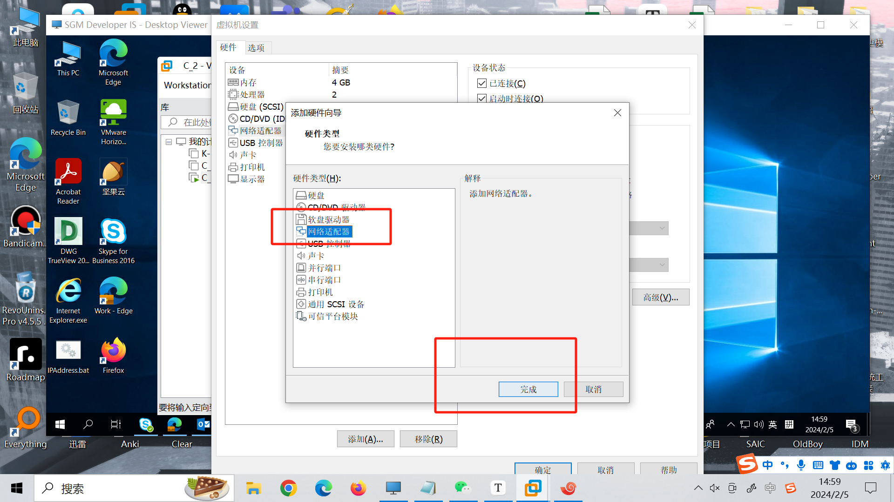
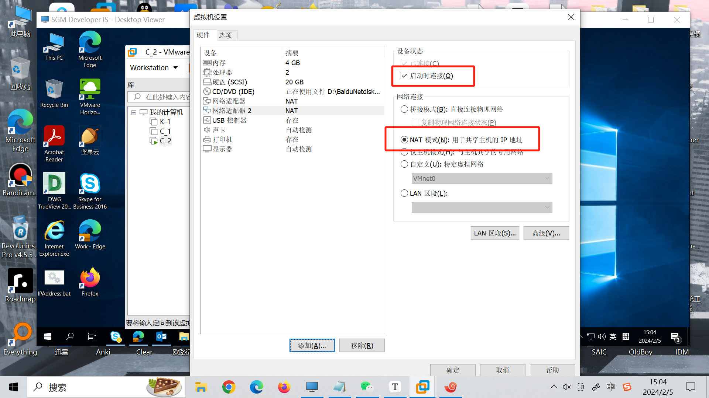
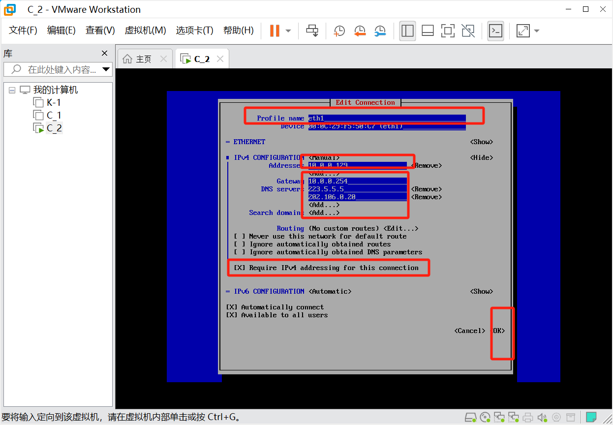

```bash
nmtui
#打开控制面板
```




配置完成：

```bash
systemctl restart network  #重启所有网卡
ifup eth1   #只启动网卡1
ifdown eth1 #只关闭网卡1
```

查看IP

```
ip a
ifconfig(yum install net-tools -y)
```

```bash
10.0.0.1-10.0.0.254 #不能做ip地址，可以做网关，有些软件是这样
10.0.0.0  #不能用
10.0.0.255 #不能用
```

