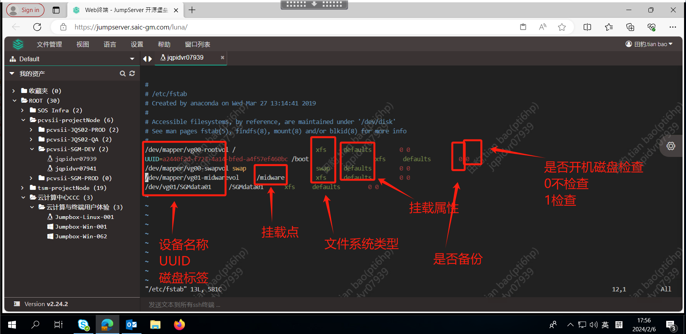

/etc/fstab：配置开机设备自动挂载的文件
危险的文件容易导致linux无法启动


```
[root@oldboy ~]# mount /dev/cdrom /mnt
```


重启，挂载就失效。

/etc/fstab 永久挂载。
[root@oldboy ~]# df -h  #查看挂载结果

```
文件系统                 容量  已用  可用 已用% 挂载点
devtmpfs                 2.0G     0  2.0G    0% /dev
tmpfs                    2.0G     0  2.0G    0% /dev/shm
tmpfs                    2.0G   12M  2.0G    1% /run
tmpfs                    2.0G     0  2.0G    0% /sys/fs/cgroup
/dev/mapper/centos-root   17G  1.9G   16G   11% /     #自动挂载
/dev/sda1               1014M  138M  877M   14% /boot #自动挂载了
tmpfs                    394M     0  394M    0% /run/user/0
/dev/sr0                 4.5G  4.5G     0  100% /mnt   #挂载结果
```



vim /etc/fstab （开机自动挂载）

```
/dev/cdrom              /mnt                 iso9660  defaults       0 0 
```

