# Docker部署Prometheus实现监控报警系统


## 环境说明

**服务器及端口说明**

| **服务器IP**      | **配置**    | **Promethus** | **node** | **grafana** | **alertmanager** |
| ----------------- | ----------- | ------------- | -------- | ----------- | ---------------- |
| **192.168.1.144** | **6C64G1T** | **7000**      | **7001** | **3000**    | **7003**         |

**实际2G内存就够用** **先安装docker 这里就不写了直接开始部署**

## 部署Prometheus 实现监控

**拉取镜像 这里直接拉取本文所用的所有镜像后面就不需要拉取了**

```
docker pull prom/prometheus
docker pull prom/node-exporter
docker pull grafana/grafana
docker pull prom/alertmanager

BASH
mkdir /home/prometheus
docker run -d --name test -P prom/prometheus
docker cp test:/etc/prometheus/prometheus.yml /home/prometheus
docker rm -f test

BASH
```

**修改配置文件**

```
vim /home/prometheus/prometheus.yml

AWK
```

**添加需要监控的主机IP及端口，修改job_name为node，此图端口和文档不对自行修改为ip:启动node节点的端口**

```
按文档添加为 ["192.168.1.1:7001","192.168.1.2:7001"]  ##此为例子

CLEAN
```

[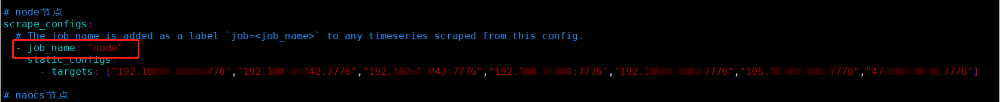](https://qn.wanwancloud.cn/typora/image-20230925113249084.png)

image-20230925113249084


```
docker run -d --name prometheus  -p 7000:9090 -v /home/prometheus/:/etc/prometheus/ prom/prometheus

AWK
```

**检测启动状态**

```
docker ps -a| grep prometheus

VIM
```

[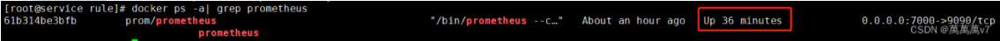](https://qn.wanwancloud.cn/typora/image-20230830102205559.png)

image-20230830102205559

**浏览器打开 输入ip:7000 可以访问即为成功 查看节点状态 到此应该是红色 我是装了node所以是绿色 先不用管继续下面操作**[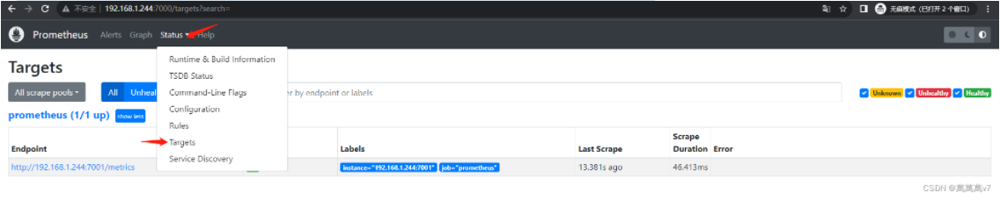](https://qn.wanwancloud.cn/typora/image-20230830102247875.png)

image-20230830102247875


## 部署Node-exporter 提取数据

```
docker run -d -p 7001:9100 --name node-exporter -v /proc:/host/proc -v /sys:/host/sys -v /:/rootfs  prom/node-exporter --path.procfs /host/proc --path.sysfs /host/sys --collector.filesystem.ignored-mount-points "^/(sys|proc|dev|host|etc)($|/)"

AWK
```

## 部署Grafana WEb可视化界面

```
mkdir /home/grafana
chmod 777 -R /home/grafana
docker run -d -p 3000:3000 --name grafana -v /home/grafana:/var/lib/grafana -e "GF_SECURITY_ADMIN_PASSWORD=Jianren@123" grafana/grafana

AWK
```

**检测启动状态**

```
docker ps -a| grep grafana

VIM
```

[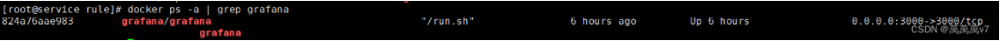](https://qn.wanwancloud.cn/typora/image-20230830102304611.png)

image-20230830102304611

**浏览器打开 输入ip:3000 可以访问即为成功** **账号为admin 密码为启动容器时的密码变量**[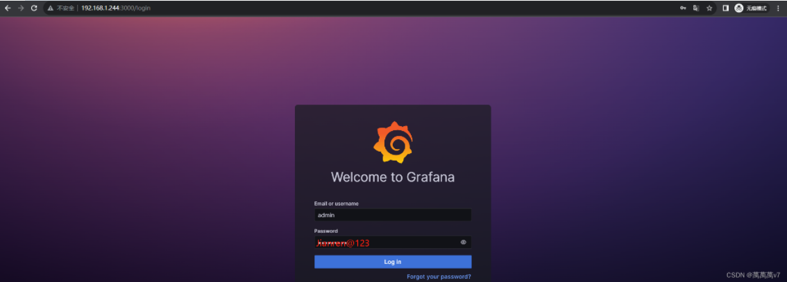](https://qn.wanwancloud.cn/typora/image-20230830102323038.png)

image-20230830102323038

**汉化设置选择中文 save保存即可**[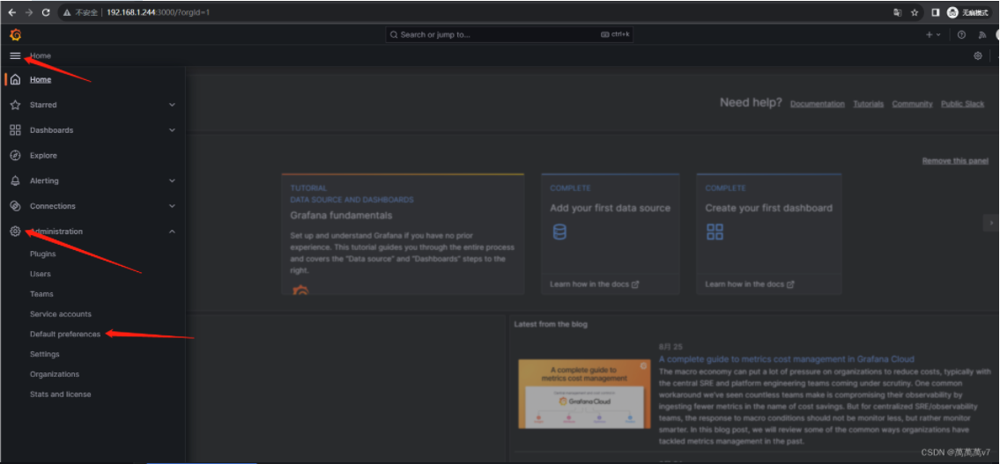](https://qn.wanwancloud.cn/typora/image-20230830102345946.png)

image-20230830102345946

[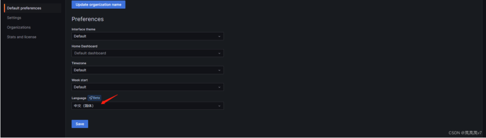](https://qn.wanwancloud.cn/typora/image-20230830102400735.png)

image-20230830102400735

**添加数据源**[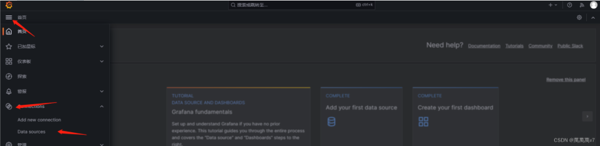](https://qn.wanwancloud.cn/typora/image-20230830102414558.png)

image-20230830102414558

**选择prometheus**[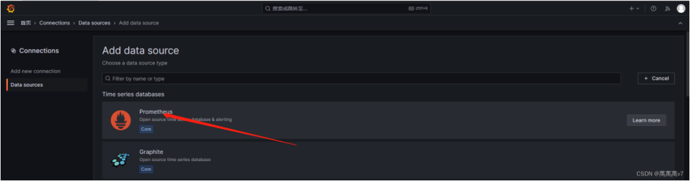](https://qn.wanwancloud.cn/typora/image-20230830102427530.png)

image-20230830102427530

**[http://IP](http://ip/):端口 下拉 save&test**[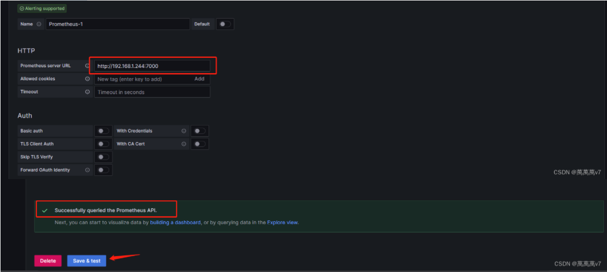](https://qn.wanwancloud.cn/typora/image-20230830102448126.png)

image-20230830102448126

[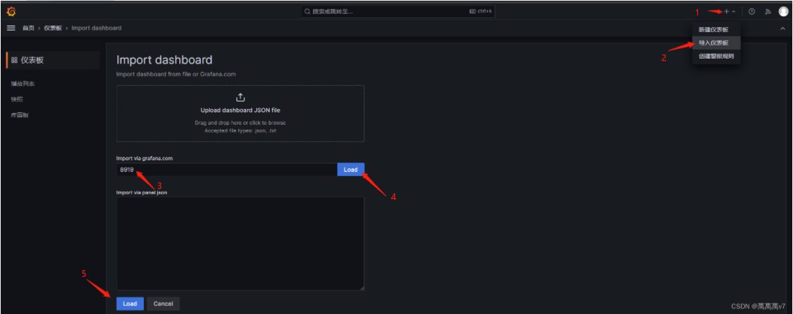](https://qn.wanwancloud.cn/typora/image-20230830102510408.png)

image-20230830102510408

**导入监控模版**[](https://qn.wanwancloud.cn/typora/image-20230830102524041.png)

image-20230830102524041

**查看面板是否获取到数据**[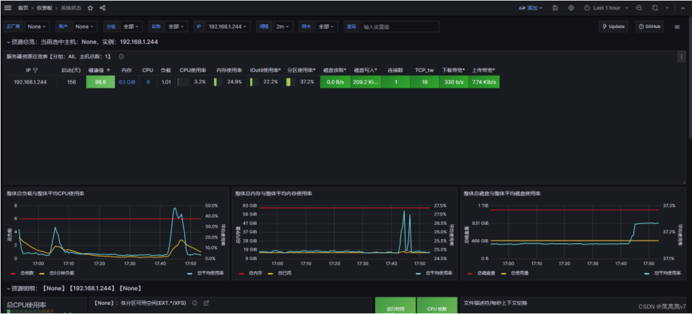](https://qn.wanwancloud.cn/typora/image-20230830102536854.png)

image-20230830102536854


## 部署Alertmanager 触发报警

```
mkdir /home/alertmanager
docker run -d --name test -p 7003:9093 prom/alertmanager   
docker cp test:/etc/alertmanager/alertmanager.yml /home/alertmanager/ 
docker rm -f test 
docker run -d --name alertmanager -p 7003:9093 -v /home/alertmanager/:/etc/alertmanager/  prom/alertmanager

AWK
```

**检测启动状态**

```
docker ps -a| grep alertmanager

VIM
```

**修改配置文件**

```
vim /home/alertmanager/alertmanager.yml

AWK
# 全局配置
global:
  smtp_smarthost: 'smtp.163.com:465'
  smtp_from: 'xxxx@163.com'  			#发送邮箱
  smtp_auth_username: 'xxxxx@163.com'	#发送邮箱
  smtp_auth_password: 'CJGLxxxx'		#授权码
  smtp_require_tls: false
templates:
  - '/etc/alertmanager/*.tmpl'
route:
  group_interval: 1m
  repeat_interval: 3h
  receiver: 'email'
# 告警接收者配置(大部分参数值都是引入模板中定义的变量)
receivers:
- name: 'email'
  email_configs:
  - to: '{{ template "email.to" }}'
    headers: { Subject: '{{ template "email.title" }}' }
    html: '{{ template "email.to.html" .}}'
    send_resolved: true

YAML
```

**编辑邮箱模板**

```
vim email.tmpl

LSL
{{ define "email.to" }}xxxx@qq.com,xxx@163.com{{ end }}   #接受邮箱可以写多个
{{ define "email.title" }}来自Prometheus告警信息{{ end }}
{{ define "email.to.html" }}
{{ range .Alerts }}
<p>==========<strong>告警通知信息</strong>==========</p>
<strong>告警程序:</strong> prometheus_alert<br>
<strong>告警级别:</strong> {{ .Labels.severity }}<br>
<strong>告警类型:</strong> {{ .Labels.alertname }}<br>
<strong>告警实例:</strong> {{ .Labels.instance }}<br>
<strong>告警信息:</strong> {{ .Annotations.summary }}<br>
<strong>告警描述:</strong> {{ .Annotations.description }}<br>
<strong>当前状态:</strong> {{ if eq .Status "resolved" }}已恢复 <br> <strong> 恢复时间:</strong> {{ (.EndsAt.Add 28800e9).Format "2006-01-02 15:04:05" }} {{ else if eq .Status "firing" }}正在告警{{ else }}{{ .Status }}{{ end }}<br>
<strong>触发时间:</strong> {{ (.StartsAt.Add 28800e9).Format "2006-01-02 15:04:05" }}<br>
<strong>监控界面地址:</strong> <a href=" http://192.168.1.244:7777 "{{ .GeneratorURL }}>点击跳转</a><br>
<p>============================</p>
{{ end }}
{{ end }}

HANDLEBARS
```

**重启alertmanager**

```
docker restart alertmanager

EBNF
```

**创建触发器目录及yml文件**

```
mkdir /home/prometheus/rule
vim /home/prometheus/rule/status.yml

AWK
groups:
    - name: 主机状态-监控告警
      rules:
      - alert: 主机状态
        expr: up{job="node"} == 0
        for: 1m
        labels:
          severity: 严重警告
        annotations:
          summary: "{{$labels.instance }} 服务器停止工作"
          description: "{{$labels.instance }} 已经停止1分钟以上"

      - alert: CPU使用情况
        expr: 100-(avg(irate(node_cpu_seconds_total{mode="idle"}[5m])) by(instance)* 100) > 90 
        for: 1m
        labels:
          severity: 一般警告
        annotations:
          summary: "{{$labels.mountpoint}} CPU使用率过高！"
          description: "{{$labels.mountpoint }} CPU使用大于90%(目前使用:{{$value}}%)"

        - alert: CPU负载
        expr: sum(node_load5) by (instance) > (count by (instance) (node_cpu_seconds_total{job="node",mode='system'})) * 2
        for: 1m
        labels:
          severity: 一般警告
        annotations:
          summary: "{{$labels.mountpoint}} CPU5分负载过高"
          description: "{{$labels.mountpoint }} 当前CPU负载大于核心数2倍(目前负载:{{$value}})"

      - alert: 内存使用情况
        expr: 100 - (node_memory_MemFree_bytes+node_memory_Cached_bytes+node_memory_Buffers_bytes) / node_memory_MemTotal_bytes * 100 > 80  
        for: 1m
        labels:
          severity: 严重警告 
        annotations:
          summary: "{{$labels.mountpoint}} 内存使用率过高！"
          description: "{{$labels.mountpoint }} 内存使用大于80%(目前使用:{{$value}}%)"

      - alert: Swap分区使用情况
        expr: (node_memory_SwapTotal_bytes - node_memory_SwapFree_bytes) / node_memory_SwapTotal_bytes * 100 > 80
        for: 1m
        labels:
          severity: 严重警告
        annotations:
          summary: "{{$labels.mountpoint}} Swap内存使用率过高！"
          description: "{{$labels.mountpoint }} Swap内存使用大于80%(目前使用:{{$value}}%)"

      - alert: IO性能
        expr: max(rate(node_disk_io_time_seconds_total[2m])) by (instance) *100 > 100 
        for: 2m
        labels:
          severity: 一般警告 
        annotations:
          summary: "{{$labels.mountpoint}} 磁盘IO使用率过高！"
          description: "{{$labels.mountpoint }} 当前磁盘IO大于100%(目前使用:{{$value}}%)"

      - alert: 网络下载
        expr: (max(rate(node_network_receive_bytes_total[2m])*8) by (instance) / 1000000) > 100 
        for: 2m
        labels:
          severity: 一般警告
        annotations:
          summary: "{{$labels.mountpoint}} 下载网络带宽过高！"
          description: "{{$labels.mountpoint }}下载网络带宽持续2分钟高于100M RX带宽使用率{{$value}}M"

      - alert: 网络上传
        expr: (max(rate(node_network_transmit_bytes_total[2m])*8) by (instance) / 1000000) > 100
        for: 2m
        labels:
          severity: 一般警告
        annotations:
          summary: "{{$labels.mountpoint}} 上传网络带宽过高！"
          description: "{{$labels.mountpoint }}上传网络带宽持续2分钟高于100M RX带宽使用率{{$value}}M"

      - alert: TCP会话
        expr: node_netstat_Tcp_CurrEstab > 1000
        for: 1m
        labels:
          severity: 一般警告
        annotations:
          summary: "{{$labels.mountpoint}} TCP_ESTABLISHED过高！"
          description: "{{$labels.mountpoint }} TCP_ESTABLISHED大于1000 (目前使用:{{$value}})"

      - alert: 磁盘容量
        expr: 100-(node_filesystem_free_bytes{fstype=~"ext.?|xfs"}/node_filesystem_size_bytes {fstype=~"ext.?|xfs"}*100) > 90
        for: 1m
        labels:
          severity: 严重警告
        annotations:
          summary: "{{$labels.mountpoint}} 磁盘分区使用率过高！"
          description: "{{$labels.mountpoint }} 磁盘分区使用大于90%(目前使用:{{$value}}%)"

YAML
```

**修改prometheus配置文件并创建触发yml文件**[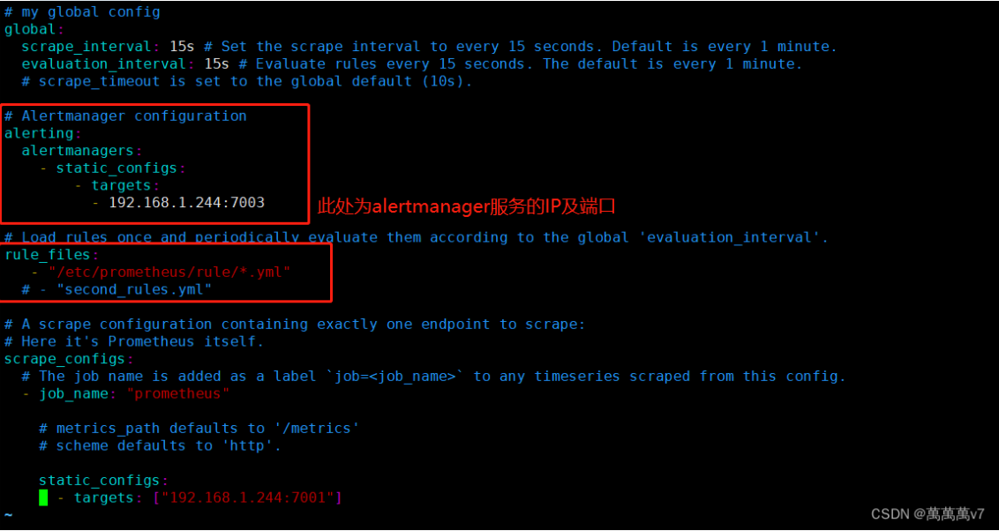](https://qn.wanwancloud.cn/typora/image-20230830102555250.png)

image-20230830102555250

**重启prometheus及alertmanager**


```
docker restart alertmanager prometheus

EBNF
```

**访问Prometheus**[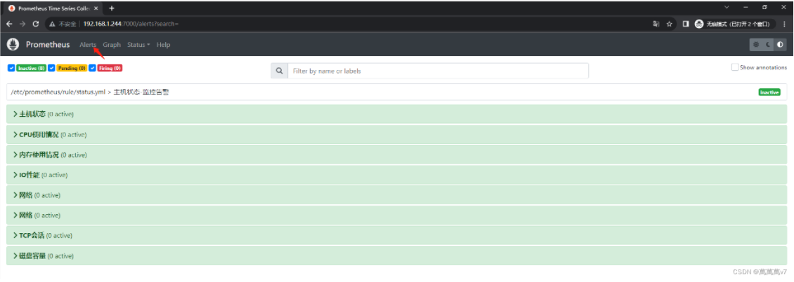](https://qn.wanwancloud.cn/typora/image-20230830102612391.png)

image-20230830102612391


**测试**

```
docker stop node-exporter

CRMSH
```

**稍等一会** **此时已经检测到 现在是黄色 持续一分钟将变成红色**[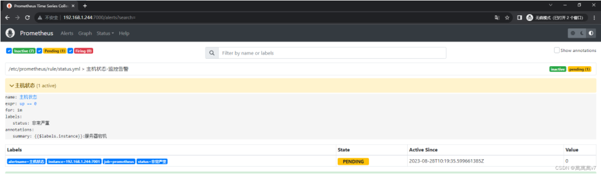](https://qn.wanwancloud.cn/typora/image-20230830102628741.png)

image-20230830102628741

**变红访问IP：7003可以看到已经触发通知**[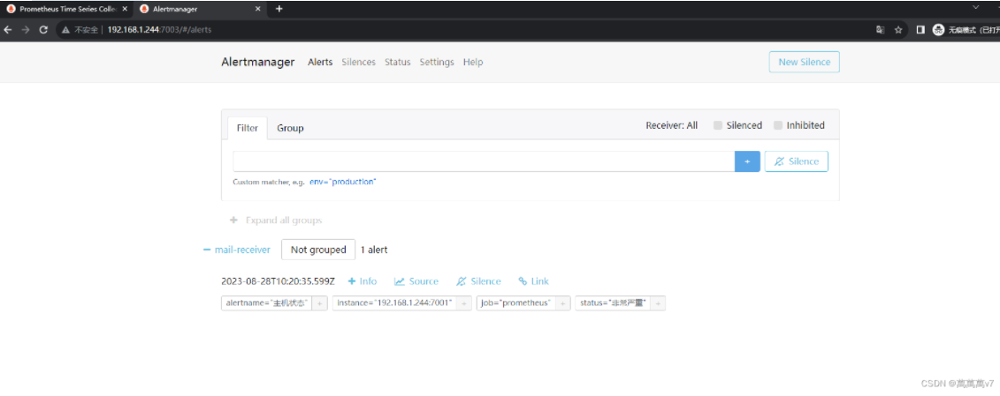](https://qn.wanwancloud.cn/typora/image-20230830102650729.png)

image-20230830102650729

**收到邮件**


[](https://qn.wanwancloud.cn/typora/image-20230925115255527.png)

image-20230925115255527


**其他服务器只需要部署node-exporter容器，并在prometheus配置文件中加入IP节点，重启prometheus即可自动完成面板节点的加入和报警**

------


