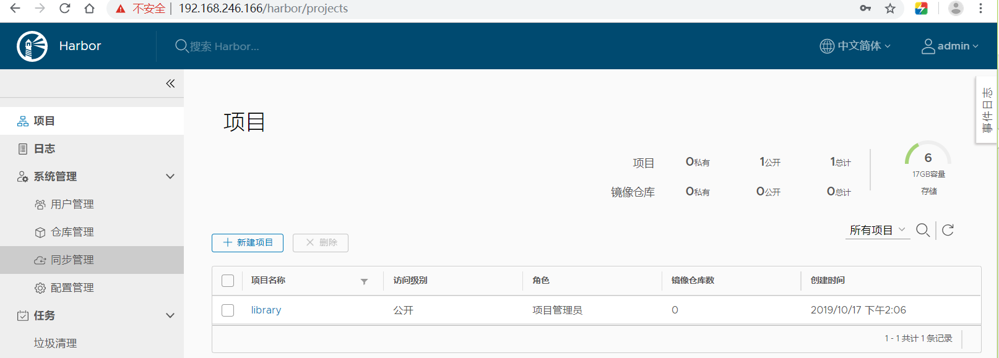

## Harbor镜像仓库部署

```shell
下面一步需要翻墙（用的1.8.0版本的harbor）
[root@kub-k8s-master ~]# wget https://storage.googleapis.com/harbor-releases/release-1.8.0/harbor-offline-installer-v1.8.0.tgz

[root@kub-k8s-master ~]# curl -L https://github.com/docker/compose/releases/download/1.22.0/docker-compose-`uname -s`-`uname -m` -o /usr/local/bin/docker-compose

我们选择了上传这两个软件包，所以要更改名称，移动路径
[root@k8s-master ~]# mv docker-compose-Linux-x86_64 /usr/local/bin/docker-compose
[root@kub-k8s-master ~]# chmod +x /usr/local/bin/docker-compose

[root@kub-k8s-master ~]# tar xf harbor-offline-installer-v1.8.0.tgz

[root@kub-k8s-master ~]# cd harbor

http访问方式的配置：
[root@kub-k8s-master harbor]# vim harbor.yml #主机名要可以解析(需要部署dns服务器，用/etc/hosts文件没有用)，如果不可以解析，可以使用IP地址,需要修改的内容如下
hostname: 192.168.246.166

[root@kub-k8s-master harbor]# ./install.sh  #需要等待下载镜像
如果安装失败，重启docker服务，重新安装即可；
```


```plain
浏览器访问测试：
http://192.168.246.166
```





## 配置https访问

```shell
[root@kub-k8s-master ~]# mkdir -p /data/cert/
[root@kub-k8s-master ~]# cd /data/cert
[root@kub-k8s-master cert]# openssl genrsa -out /data/cert/server.key 2048
Generating RSA private key, 2048 bit long modulus
............................................+++
............+++
e is 65537 (0x10001)
[root@kub-k8s-master cert]# openssl req -x509 -new -nodes -key /data/cert/server.key -subj "/CN=192.168.246.166" -days 3650 -out /data/cert/server.crt
[root@kub-k8s-master ~]# ll -a /data/cert
[root@kub-k8s-master ~]# cd /root/harbor
[root@kub-k8s-master harbor]# vim harbor.yml   #编辑如下
```


```shell
重启
[root@kub-k8s-master harbor]# ./prepare 
prepare base dir is set to /root/harbor
Clearing the configuration file: /config/log/logrotate.conf
Clearing the configuration file: /config/nginx/nginx.conf
Clearing the configuration file: /config/core/env
Clearing the configuration file: /config/core/app.conf
Clearing the configuration file: /config/registry/config.yml
Clearing the configuration file: /config/registry/root.crt
Clearing the configuration file: /config/registryctl/env
Clearing the configuration file: /config/registryctl/config.yml
Clearing the configuration file: /config/db/env
Clearing the configuration file: /config/jobservice/env
Clearing the configuration file: /config/jobservice/config.yml
Generated configuration file: /config/log/logrotate.conf
Generated configuration file: /config/nginx/nginx.conf
Generated configuration file: /config/core/env
Generated configuration file: /config/core/app.conf
Generated configuration file: /config/registry/config.yml
Generated configuration file: /config/registryctl/env
Generated configuration file: /config/db/env
Generated configuration file: /config/jobservice/env
Generated configuration file: /config/jobservice/config.yml
loaded secret from file: /secret/keys/secretkey
Generated configuration file: /compose_location/docker-compose.yml
Clean up the input dir

如果出错，重启Docker服务，再次执行./prepare 
[root@kub-k8s-master harbor]# docker-compose down
Stopping nginx             ... done
Stopping harbor-portal     ... done
Stopping harbor-jobservice ... done
Stopping harbor-core       ... done
Stopping harbor-db         ... done
Stopping redis             ... done
Stopping registryctl       ... done
Stopping registry          ... done
Stopping harbor-log        ... done
Removing nginx             ... done
Removing harbor-portal     ... done
Removing harbor-jobservice ... done
Removing harbor-core       ... done
Removing harbor-db         ... done
Removing redis             ... done
Removing registryctl       ... done
Removing registry          ... done
Removing harbor-log        ... done
Removing network harbor_harbor
[root@kub-k8s-master harbor]# docker-compose up -d  #放后台
```


## 访问


**客户端配置(每个访问harbor的机器上都要配置)**


```shell
在client上面操作：
[root@kub-k8s-node1 ~]# vim /etc/docker/daemon.json   #编辑文件
{
"insecure-registries": ["192.168.246.166"]   #该ip为部署仓库机器的ip
}
[root@kub-k8s-node1 ~]# systemctl restart docker
```


## 创建项目


**创建账号**


换gebeier用户登录查看


## 项目授权


再次使用gebeier用户登录


## 测试

```shell
1.登录
[root@kub-k8s-node1 ~]# docker login 192.168.246.166
Username: gebeier
Password: 
Login Succeeded
2.下载一个测试的镜像
[root@kub-k8s-node1 ~]# docker pull daocloud.io/library/centos:7
3.查看
[root@kub-k8s-node1 ~]# docker images
REPOSITORY                     TAG       IMAGE ID            CREATED        SIZE
daocloud.io/library/centos    7   98ebf73aba75        3 months ago    109MB
4.打个tag
[root@kub-k8s-node1 ~]# docker tag daocloud.io/library/centos:7 192.168.91.140/centos/centos:7.4
5.上传到仓库
[root@kub-k8s-node1 ~]# docker push 192.168.91.140/centos/centos:7.4
```


在web界面中查看镜像是否被上传到仓库中


拉取测试


来到node2

```shell
[root@k8s-node2 ~]# cat /etc/docker/daemon.json 
{
	"insecure-registries": ["192.168.246.166"]
}
[root@k8s-node2 ~]# systemctl restart docker
[root@k8s-node2 ~]# docker login 192.168.246.166 --username='gebeier' --password='***'
```


```shell
[root@k8s-node2 ~]# 192.168.91.140/centos/centos:7.4
```