# Docker-Compose

## 1.Compose介绍

Docker Compose是一个用来定义和运行复杂应用的Docker工具。一个使用Docker容器的应用，通常由多个容器组成。使用Docker Compose不再需要使用shell脚本来启动容器。 


Compose 通过一个配置文件来管理多个Docker容器，在配置文件中，所有的容器通过services来定义，然后使用docker-compose脚本来启动，停止和重启应用，和应用中的服务以及所有依赖服务的容器，非常适合组合使用多个容器进行开发的场景。

官方教程：https://docs.docker.com/compose/

## 2.Compose和Docker兼容性

compose文件格式版本	docker版本

3.4						17.09.0+

3.3						17.06.0+

3.2						17.04.0+

3.1						1.13.1+

3.0						1.13.0+

2.3						17.06.0+

2.2						1.13.0+

2.1						1.12.0+

2.0						1.10.0+

1.0						1.9.1.+


### Docker版本变化说明：

Docker从1.13.x版本开始，版本分为企业版EE和社区版CE，版本号也改为按照时间线来发布，比如17.03就是2017年3月。

Docker的linux发行版的软件仓库从以前的https://apt.dockerproject.org和https://yum.dockerproject.org变更为目前的https://download.docker.com, 软件包名字改为docker-ce和docker-ee。

## 3、Docker安装

```shell
[root@docker-compose ~]# wget https://mirrors.aliyun.com/docker-ce/linux/centos/docker-ce.repo
[root@docker-compose ~]# mv docker-ce.repo /etc/yum.repos.d/
[root@docker-compose ~]# yum -y install docker-ce
[root@docker-compose ~]# systemctl start docker-ce && systemctl enable docker
[root@docker-compose ~]# docker -v
Docker version 20.10.16, build aa7e414
```

### 配置国内镜像源

```shell
[root@docker-compose ~]# vi /etc/docker/daemon.json
{ "registry-mirrors": ["https://cq20bk8v.mirror.aliyuncs.com"] }
```

## 4、Docker-compose安装

### pip3安装

```shell
[root@docker-compose ~]# yum install epel-release
[root@docker-compose ~]# yum install python3-pip 
[root@docker-compose ~]# pip3 install --upgrade pip 
[root@docker-compose ~]# pip3 install docker-compose 

这里会报错：ModuleNotFoundError: No module named 'setuptools_rust'
解决方法：pip3 install -U pip setuptools
 
 
[root@docker-compose ~]# docker-compose --version
```

## [ ](https://blog.csdn.net/pushiqiang/article/details/78682323)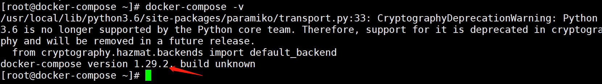

### 二进制安装

从[github](https://so.csdn.net/so/search?q=github&spm=1001.2101.3001.7020)上下载docker-compose二进制文件安装

- 下载最新版的docker-compose文件 

```shell
# sudo curl -L https://github.com/docker/compose/releases/download/1.16.1/docker-compose-`uname -s`-`uname -m` -o /usr/local/bin/docker-compose
```

- 若是github访问太慢，可以用daocloud下载

http://get.daocloud.io/

[Docker Compose](https://docs.docker.com/compose/install/)存放在Git Hub，不太稳定。

你可以也通过执行下面的命令，高速安装Docker Compose。

```shell
curl -L https://get.daocloud.io/docker/compose/releases/download/v2.5.0/docker-compose-`uname -s`-`uname -m` > /usr/local/bin/docker-compose chmod +x /usr/local/bin/docker-compose
```

你可以通过修改URL中的版本，可以自定义您的需要的版本。


## 5.docker-compose文件结构和示例

### docker-compose文件结构

docker-compose.yml:[

](https://blog.csdn.net/pushiqiang/article/details/78682323)

```shell
version: "3"
services:
 
  redis:
    image: redis:alpine
    ports:
      - "6379"
    networks:
      - frontend
    deploy:
      replicas: 2
      update_config:
        parallelism: 2
        delay: 10s
      restart_policy:
        condition: on-failure
 
  db:
    image: postgres:9.4
    volumes:
      - db-data:/var/lib/postgresql/data
    networks:
      - backend
    deploy:
      placement:
        constraints: [node.role == manager]
 
  vote:
    image: dockersamples/examplevotingapp_vote:before
    ports:
      - 5000:80
    networks:
      - frontend
    depends_on:
      - redis
    deploy:
      replicas: 2
      update_config:
        parallelism: 2
      restart_policy:
        condition: on-failure
 
  result:
    image: dockersamples/examplevotingapp_result:before
    ports:
      - 5001:80
    networks:
      - backend
    depends_on:
      - db
    deploy:
      replicas: 1
      update_config:
        parallelism: 2
        delay: 10s
      restart_policy:
        condition: on-failure
 
  worker:
    image: dockersamples/examplevotingapp_worker
    networks:
      - frontend
      - backend
    deploy:
      mode: replicated
      replicas: 1
      labels: [APP=VOTING]
      restart_policy:
        condition: on-failure
        delay: 10s
        max_attempts: 3
        window: 120s
      placement:
        constraints: [node.role == manager]
 
  visualizer:
    image: dockersamples/visualizer:stable
    ports:
      - "8080:8080"
    stop_grace_period: 1m30s
    volumes:
      - "/var/run/docker.sock:/var/run/docker.sock"
    deploy:
      placement:
        constraints: [node.role == manager]
 
networks:
  frontend:
  backend:
 
volumes:
  db-data:
```


### docker-compose使用示例

通过docker-compose构建一个在docker中运行的基于python flask框架的web应用。

**注意：**确保你已经安装了Docker Engine和Docker Compose。 您不需要安装Python或Redis，因为这两个都是由Docker镜像提供的。

#### Step 1: 定义python应用

1 .创建工程目录

```shell
$ mkdir compose_test
$ cd compose_test
$ mkdir src      # 源码文件夹
$ mkdir docker  # docker配置文件夹
```

目录结构如下： 

```shell
└── compose_test
    ├── docker
    │   └── docker-compose.yml
    ├── Dockerfile
    └── src
        ├── app.py
        └── requirements.txt
```

2.在compose_test/src/目录下创建python flask应用 compose_test/src/app.py文件：

```shell
[root@docker ~]# cat compose_test/src/app.py
from flask import Flask
from redis import Redis
 
app = Flask(__name__)
redis = Redis(host='redis', port=6379)
 
@app.route('/')
def hello():
    count = redis.incr('hits')
    return 'Hello World! I have been seen {} times.\n'.format(count)
 
if __name__ == "__main__":
    app.run(host="0.0.0.0", debug=True)
```

3.创建python 需求文件 compose_test/src/requirements.txt

```shell
[root@docker ~]# cat compose_test/src/requirements.txt 
flask
redis
```

#### Step 2: 创建容器的Dockerfile文件

一个容器一个Dockerfile文件，在compose_test/目录中创建Dockerfile文件：

```shell
[root@docker ~]# cat compose_test/Dockerfile 
FROM python:3.7
 
COPY src/ /opt/src
WORKDIR /opt/src
 
RUN pip install -r requirements.txt
CMD ["python", "app.py"]
```

注释：

Dockerfile文件告诉docker如下信息：

从Python 3.7的镜像开始构建一个容器镜像。 

复制src（即compose_test/src）目录到容器中的/opt/src目录。 

将容器的工作目录设置为/opt/src（通过docker exec -it your_docker_container_id bash 进入容器后的默认目录）。 

安装Python依赖关系。

将容器的默认命令设置为python app.py。

#### Step 3: 定义docker-compose脚本

在compose_test/docker/目录下创建docker-compose.yml文件，并在里面定义服务，内容如下：

```shell
version: '3'
services:
  web:
    build: ../
    ports:
     - "5000:5000"
  redis:
    image: redis:3.0.7
```

这个compose文件定义了两个服务，即定义了web和redis两个容器。 

web容器： 

使用当前docker-compose.yml文件所在目录的上级目录（compose_test/Dockerfile）中的Dockerfile构建映像。 

将容器上的暴露端口5000映射到主机上的端口5000。 我们使用Flask Web服务器的默认端口5000。 

redis容器： 

redis服务使用从Docker Hub提取的官方redis镜像3.0.7版本。

#### Step 4: 使用Compose构建并运行您的应用程序

在compose_test/docker/目录下执行docker-compose.yml文件：

```shell
$ docker-compose up
# 若是要后台运行： $ docker-compose up -d
# 若不使用默认的docker-compose.yml 文件名：
$ docker-compose -f server.yml up -d 
```

然后在浏览器中输入http://0.0.0.0:5000/查看运行的应用程序。

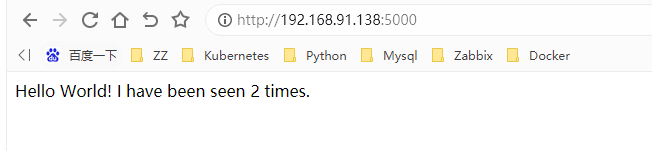

#### Step 5: 编辑compose文件以添加文件绑定挂载

上面的代码是在构建时静态复制到容器中的，即通过Dockerfile文件中的COPY src /opt/src命令实现物理主机中的源码复制到容器中，这样在后续物理主机src目录中代码的更改不会反应到容器中。 

可以通过volumes 关键字实现物理主机目录挂载到容器中的功能（同时删除Dockerfile中的COPY指令，不需要创建镜像时将代码打包进镜像，而是通过volums动态挂载，容器和物理host共享数据卷）：

```shell
version: '3'
services:
  web:
    build: ../
    ports:
     - "5000:5000"
    volumes:
     - ../src:/opt/src
  redis:
    image: "redis:3.0.7"
```

通过volumes（卷）将主机上的项目目录（compose_test/src）挂载到容器中的/opt/src目录，允许您即时修改代码，而无需重新构建镜像。

**Step 6: 重新构建和运行应用程序**

```shell
$ docker-compose up -d
```

## 6.compose常用服务配置参考

Compose文件是一个定义服务，网络和卷的YAML文件。 Compose文件的默认文件名为docker-compose.yml。

提示：您可以对此文件使用.yml或.yaml扩展名。 他们都工作

与docker运行一样，默认情况下，Dockerfile中指定的选项（例如，CMD，EXPOSE，VOLUME，ENV）都被遵守，你不需要在docker-compose.yml中再次指定它们。

同时你可以使用类似Bash的$ {VARIABLE} 语法在配置值中使用环境变量，有关详细信息，请参阅变量替换。

本节包含版本3中服务定义支持的所有配置选项。

### build

准备：

```shell
[root@docker ~]# mkdir test
[root@docker ~]# mkdir test/docker
[root@docker test]# tree docker/
docker/
├── dir
│   ├── Dockerfile
│   └── index.html
├── docker-compose.yaml

[root@docker test]# cat docker/dir/Dockerfile 
FROM centos:7
MAINTAINER "youngfit"
WORKDIR /usr/local/src/ 
ENV NG_VERSION nginx-1.21.0 
RUN yum -y install epel-release &&  yum -y install wget && wget http://nginx.org/download/$NG_VERSION.tar.gz && tar xzvf $NG_VERSION.tar.gz && yum install -y gcc gcc-c++ glibc make autoconf openssl openssl-devel && yum install -y pcre-devel libxslt-devel gd-devel GeoIP GeoIP-devel GeoIP-data
RUN yum clean all 
RUN useradd -M -s /sbin/nologin nginx 
WORKDIR /usr/local/src/$NG_VERSION 
RUN ./configure --user=nginx --group=nginx --prefix=/usr/local/nginx --with-file-aio --with-http_ssl_module --with-http_realip_module --with-http_addition_module --with-http_xslt_module --with-http_image_filter_module --with-http_geoip_module --with-http_sub_module --with-http_dav_module --with-http_flv_module --with-http_mp4_module --with-http_gunzip_module --with-http_gzip_static_module --with-http_auth_request_module --with-http_random_index_module --with-http_secure_link_module --with-http_degradation_module --with-http_stub_status_module && make && make install
ADD ./index.html /usr/local/nginx/html 
VOLUME /usr/local/nginx/html 
ENV PATH /usr/local/nginx/sbin:$PATH 
EXPOSE 80/tcp 
ENTRYPOINT ["nginx"]
CMD ["-g","daemon off;"]

[root@docker test]# cat docker/dir/index.html 
youngfit

[root@docker test]# cat docker/docker-compose.yaml 
version: '2'
services:
  webapp:
    build: ./dir
```


build 可以指定包含构建上下文的路径：

```shell
[root@docker test]# cat docker/docker-compose.yaml 
version: '2'
services:
  webapp:
    build: ./dir
[root@docker docker]# docker-compose up -d
```


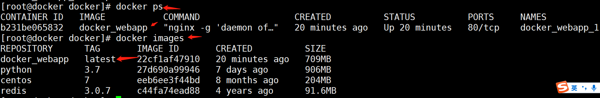

或者，作为一个对象，该对象具有上下文路径和指定的Dockerfile文件：

```shell
[root@docker docker]# cat docker-compose.yaml 
version: '2'
services:
  webapp:
    build:
      context: ./dir
      dockerfile: dockerfile-abc
[root@docker docker]# ls dir/
dockerfile-abc  index.html
```

webapp服务将会通过./dir目录下的Dockerfile-alternate文件构建容器镜像。 


如果你同时指定image和build，则compose会通过build指定的目录构建容器镜像，而构建的镜像名为image中指定的镜像名和标签。

```shell
build: ./dir
image: webapp:tag

[root@docker docker]# cat docker-compose.yaml 
version: '2'
services:
  webapp:
    image: nginx:v1.1
    build: ./dir
    [root@docker docker]# docker-compose up -d
```

这将由./dir构建的名为webapp和标记为tag的镜像。可以认为是指定镜像名称；


context

包含Dockerfile文件的目录路径，或者是git仓库的URL。 

当提供的值是相对路径时，它被解释为相对于当前compose文件的位置。 该目录也是发送到Docker守护程序构建镜像的上下文。


dockerfile

备用Docker文件。Compose将使用备用文件来构建。 还必须指定构建路径。


args

添加构建镜像的参数，环境变量只能在构建过程中访问。 

首先，在Dockerfile中指定要使用的参数：

```shell
ARG buildno
ARG password

RUN echo "Build number: $buildno"
RUN script-requiring-password.sh "$password"
```

然后在args键下指定参数。 你可以传递映射或列表：

```shell
build:
  context: .
  args:
    buildno: 1
    password: secret
 
build:
  context: .
  args:
    - buildno=1
    - password=secret
```

** 注意：YAML布尔值（true，false，yes，no，on，off）必须用引号括起来，以便解析器将它们解释为字符串。

### image

指定启动容器的镜像，可以是镜像仓库/标签或者镜像id（或者id的前一部分）

```shell
image: redis
image: ubuntu:14.04
image: tutum/influxdb
image: example-registry.com:4000/postgresql
image: a4bc65fd
```

例子：

```shell
[root@docker docker]# cat docker-compose.yaml 
version: '2'
services:
  webapp:
    image: eeb6ee3f44bd
    build:
      context: ./dir
[root@docker docker]# docker-compose up -d
```


如果镜像不存在，Compose将尝试从官方镜像仓库将其pull下来，如果你还指定了build，在这种情况下，它将使用指定的build选项构建它，并使用image指定的名字和标记对其进行标记。

### container_name

指定一个自定义容器名称，而不是生成的默认名称。

```shell
[root@docker docker]# cat docker-compose.yaml 
version: '2'
services:
  webapp:
    image: nginx:v1.1
    build:
      context: ./dir
    container_name: nginx_web #指定容器名称
[root@docker docker]# docker-compose up -d
```


### volumes

卷挂载路径设置。可以设置宿主机路径 （HOST:CONTAINER） 或加上访问模式 （HOST:CONTAINER:ro）,挂载数据卷的默认权限是读写（rw），可以通过ro指定为只读。 

你可以在主机上挂载相对路径，该路径将相对于当前正在使用的Compose配置文件的目录进行扩展。 相对路径应始终以 . 或者 .. 开始。

```shell
volumes:
  # 只需指定一个路径，让引擎创建一个卷
  - /var/lib/mysql
 
  # 指定绝对路径映射
  - /opt/data:/var/lib/mysql
 
  # 相对于当前compose文件的相对路径
  - ./cache:/tmp/cache
 
  # 用户家目录相对路径
  - ~/configs:/etc/configs/:ro
 
  # 命名卷
  - datavolume:/var/lib/mysql
```

例子：

```shell
[root@docker docker]# cat docker-compose.yaml 
version: '2'
services:
  web1:
    image: nginx:v1.1
    build:
      context: ./dir
    container_name: nginx_web
    volumes:
     - /opt/data:/usr/share/nginx/html
[root@docker docker]# docker-compose up -d
[root@docker docker]# ls /opt/data/
[root@docker docker]# docker exec -it nginx_web bash
[root@fdc9321da669 nginx-1.21.0]# ls /usr/share/nginx/html/
[root@fdc9321da669 nginx-1.21.0]# touch a.txt
[root@fdc9321da669 nginx-1.21.0]# touch /usr/share/nginx/html/a.txt
[root@fdc9321da669 nginx-1.21.0]# 退出容器
[root@docker docker]# ls /opt/data/
a.txt
```

但是，如果要跨多个服务并重用挂载卷，请在顶级volumes关键字中命名挂在卷，但是并不强制，如下的示例亦有重用挂载卷的功能，但是不提倡。

```shell
[root@docker docker]# cat docker-compose.yaml 
version: "3"
 
services:
  web1:
    build: ./dir
    volumes:
      - /opt/data:/usr/share/nginx/html
  web2:
    build: ./dir
    volumes:
      - /opt/data:/usr/share/nginx/html
```


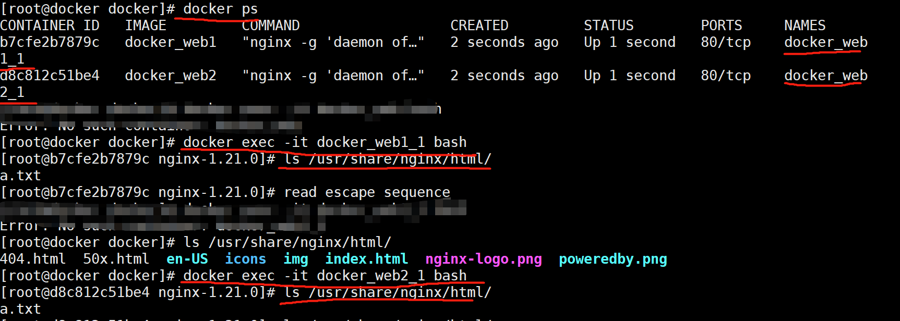

 注意：通过顶级volumes定义一个挂载卷，并从每个服务的卷列表中引用它， 这会替换早期版本的Compose文件格式中volumes_from。

```shell
# 实现2个容器目录同步；
[root@docker docker]# cat docker-compose.yaml 
version: "3"
services:
  web1:
    build: ./dir
    volumes:
      - data-volume:/usr/share/nginx/html
  web2:
    build: ./dir
    volumes:
      - data-volume:/usr/share/nginx/www
volumes:
  data-volume:
[root@docker docker]# docker-compose up -d
```

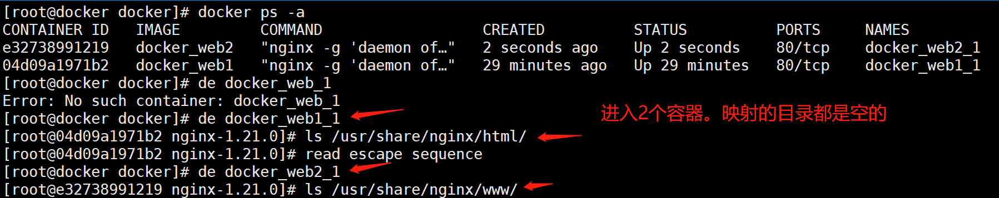

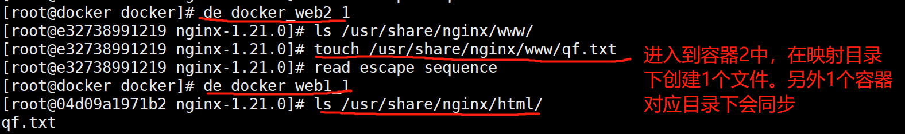

### command

```shell
[root@docker ~]# tree compose_test/
compose_test/
├── docker
│   ├── docker-compose.yaml
│   
├── Dockerfile
└── src
    ├── app.py
    └── requirements.txt
    
[root@docker ~]# cat compose_test/Dockerfile 
FROM python:3.7
 
COPY src/ /opt/src
WORKDIR /opt/src
 
RUN pip install -r requirements.txt
CMD ["python", "app.py"]

[root@docker ~]# cat compose_test/src/app.py 
from flask import Flask
from redis import Redis
 
app = Flask(__name__)
redis = Redis(host='redis', port=6379)
 
@app.route('/')
def hello():
    count = redis.incr('hits')
    return 'Hello World! I have been seen {} times.\n'.format(count)
 
if __name__ == "__main__":
    app.run(host="0.0.0.0", debug=True)
    
[root@docker ~]# cat compose_test/src/requirements.txt 
flask
redis

[root@docker ~]# cat compose_test/docker/docker-compose.yaml 
version: '2'
services:
  prj1:
    build:
      context: ../
      dockerfile: Dockerfile
    environment:
      SERVER_LISTEN_URI: "tcp://0.0.0.0:9000"
    #执行多条指令
    command: /bin/bash -c "touch /opt/src/a.txt && python -u /opt/src/app.py"
    #目录映射
    volumes:
      - ..:/app
      - ./tmp:/var/tmp
    ports:
      - "9000:9000"
[root@docker docker]# pwd
/root/compose_test/docker      
[root@docker docker]# docker-compose up -d
```

### links

链接到另一个服务中的容器。 请指定服务名称和链接别名（SERVICE：ALIAS），或者仅指定服务名称。

```shell
web:
  links:
   - db
   - db:database
   - redis
```

例子：

```shell
[root@docker docker]# cat docker-compose.yaml 
version: "3"
services:
  web1:
    build: ./dir
    volumes:
    - data-volume:/usr/share/nginx/html
  web2:
    build: ./dir
    links:
      - web1
volumes:
  data-volume:
[root@docker docker]# docker-compose up -d
```

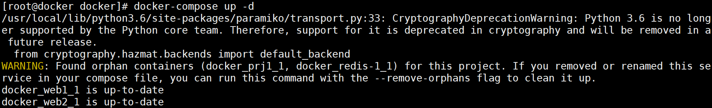 

```shell
[root@docker docker]# docker exec -it docker_web2_1 /bin/bash
[root@395f627f2155 nginx-1.21.0]# ping web1
PING web1 (172.18.0.5) 56(84) bytes of data.
64 bytes from docker_web1_1.docker_default (172.18.0.5): icmp_seq=1 ttl=64 time=0.026 ms
64 bytes from docker_web1_1.docker_default (172.18.0.5): icmp_seq=2 ttl=64 time=0.034 ms
[root@docker docker]# cat docker-compose.yaml 
version: "3"
services:
  web1:
    build: ./dir
    volumes:
    - data-volume:/usr/share/nginx/html
  web2:
    build: ./dir
    links:
      - web1:nginx_web1
volumes:
  data-volume:
```


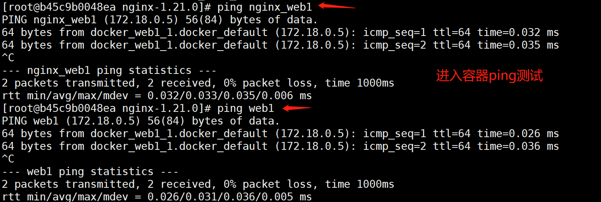

在当前的web服务的容器中可以通过链接的db服务的别名database访问db容器中的数据库应用，如果没有指定别名，则可直接使用服务名访问。


链接不需要启用服务进行通信 - 默认情况下，任何服务都可以以该服务的名称到达任何其他服务。 （实际是通过设置/etc/hosts的域名解析，从而实现容器间的通信。故可以像在应用中使用localhost一样使用服务的别名链接其他容器的服务，前提是多个服务容器在一个网络中可路由联通）


links也可以起到和depends_on相似的功能，即定义服务之间的依赖关系，从而确定服务启动的顺序。

### external_links

链接到docker-compose.yml 外部的容器，甚至并非 Compose 管理的容器。参数格式跟 links 类似。

```shell
external_links:
 - redis_1
 - project_db_1:mysql
 - project_db_1:postgresql
```

### expose

暴露端口，但不映射到宿主机，只被连接的服务访问。 
仅可以指定内部端口为参数

```shell
expose:
 - "3000"
 - "8000"
```

### ports

暴露端口信息。 
常用的简单格式：使用宿主：容器 （HOST:CONTAINER）格式或者仅仅指定容器的端口（宿主将会随机选择端口）都可以。

注意：当使用 HOST:CONTAINER 格式来映射端口时，如果你使用的容器端口小于 60 你可能会得到错误得结果，因为 YAML 将会解析 xx:yy 这种数字格式为 60 进制。所以建议采用字符串格式

简单的短格式：

```shell
ports:
 - "3000"
 - "3000-3005"
 - "8000:8000"
 - "9090-9091:8080-8081"
 - "49100:22"
 - "127.0.0.1:8001:8001"
 - "127.0.0.1:5000-5010:5000-5010"
 - "6060:6060/udp"
```

在v3.2中ports的长格式的语法允许配置不能用短格式表示的附加字段。 
长格式：

```shell
ports:
  - target: 80
    published: 8080
    protocol: tcp
    mode: host
```

target：容器内的端口 
published：物理主机的端口 
protocol：端口协议（tcp或udp） 
mode：host 和ingress 两总模式，host用于在每个节点上发布主机端口，ingress 用于被负载平衡的swarm模式端口

案例：

```shell
[root@docker docker]# pwd
/root/test/docker
[root@docker docker]# cat docker-compose.yaml 
version: "3"
services:
  web1:
    build: ./dir
    volumes:
      - data-volume:/usr/share/nginx/html
    ports:
     - "80:80"
  web2:
    build: ./dir
    volumes:
      - data-volume:/usr/share/nginx/www
volumes:
  data-volume:

[root@docker docker]# docker-compose up -d
```


### restart

no是默认的重启策略，在任何情况下都不会重启容器。 指定为always时，容器总是重新启动。 如果退出代码指示出现故障错误，则on-failure将重新启动容器。

```shell
restart: "no"
restart: always
restart: on-failure
restart: unless-stopped #在容器退出时总是重启容器，但是不考虑在Docker守护进程启动时就已经停止了的容器。
```

在没设置restart: always之前，容器不会随着docker服务启动而自启；

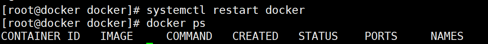

```shell
[root@docker docker]# cat docker-compose.yaml 
version: "3"
services:
  web1:
    build: ./dir
    volumes:
      - data-volume:/usr/share/nginx/html
    restart: always
    ports:
     - "80:80"
  web2:
    build: ./dir
    volumes:
      - data-volume:/usr/share/nginx/www
    links:
      - web1:nginx_web1
volumes:
  data-volume:

[root@docker docker]# docker-compose up -d
[root@docker docker]# systemctl restart docker
```


### environment

添加环境变量。 你可以使用数组或字典两种形式。 任何布尔值; true，false，yes，no需要用引号括起来，以确保它们不被YML解析器转换为True或False。 

只给定名称的变量会自动获取它在 Compose 主机上的值，可以用来防止泄露不必要的数据。

```shell
environment:
  RACK_ENV: development
  SHOW: 'true'
  SESSION_SECRET:
 
environment:
  - RACK_ENV=development
  - SHOW=true
  - SESSION_SECRET
```

案例：

```shell
[root@docker docker]# cat docker-compose.yaml 
version: "3"
services:
  web1:
    build: ./dir
    volumes:
      - data-volume:/usr/share/nginx/html
    restart: always
    ports:
     - "80:80"
    environment:
      username: root
      password: youngfit@2022
  web2:
    build: ./dir
    volumes:
      - data-volume:/usr/share/nginx/www
    links:
      - web1:nginx_web1
volumes:
  data-volume:
[root@docker docker]# docker-compose up -d
```

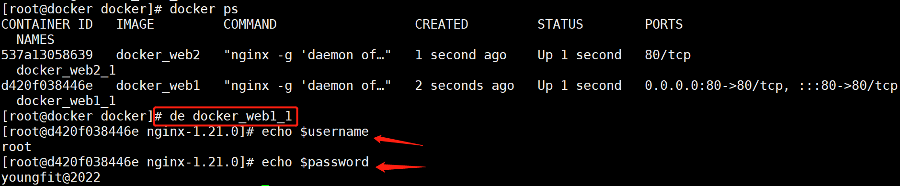

注意：如果你的服务指定了build选项，那么在构建过程中通过environment定义的环境变量将不会起作用。 将使用build的args子选项来定义构建时的环境变量。

但是这句话，哥暂时没有合适的案例

### pid

将PID模式设置为主机PID模式。 这就打开了容器与主机操作系统之间的共享PID地址空间。 使用此标志启动的容器将能够访问和操作裸机的命名空间中的其他容器，反之亦然。即打开该选项的容器可以相互通过进程 ID 来访问和操作。

```shell
pid: "host"
```

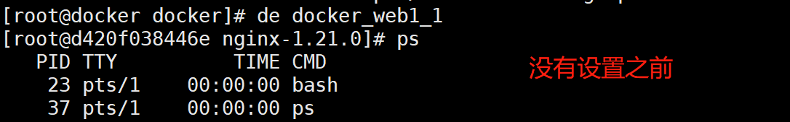

案例：


### dns

配置 DNS 服务器。可以是一个值，也可以是一个列表。

```shell
dns: 8.8.8.8
dns:
  - 8.8.8.8
  - 9.9.9.9
```

案例：

```shell
[root@docker docker]# cat docker-compose.yaml 
version: "3"
services:
  web1:
    build: ./dir
    volumes:
      - data-volume:/usr/share/nginx/html
    restart: always
    dns: 8.8.8.8   #指定DNS，但是容器中并不会显示。
    ports:
     - "80:80"
    environment:
      username: root
      password: youngfit@2022
  web2:
    build: ./dir
    volumes:
      - data-volume:/usr/share/nginx/www
    links:
      - web1:nginx_web1
volumes:
  data-volume:
```

## 7.docker-compose制作MySQL容器

```shell
[root@docker mysql]# tree /root/mysql/
/root/mysql/
├── docker-compose.yaml
├── mysql
└── mysql-initdb

[root@docker mysql]# cat docker-compose.yaml 
version: "2"
services:
  dns-proxy-server:
    image: defreitas/dns-proxy-server:latest
    hostname: dns.ailand
    restart: always
    container_name: ailand-dns
    networks:
      - ailand
    volumes:
      - /var/run/docker.sock:/var/run/docker.sock
      - /etc/resolv.conf:/etc/resolv.conf

  mysql:
      image: mysql:5.7
      container_name: mysql
      hostname: mysql.ailand
      command: --default-authentication-plugin=mysql_native_password --character-set-server=utf8mb4 --collation-server=utf8mb4_unicode_ci
      restart: always
      environment:
        MYSQL_ROOT_PASSWORD: Youngfit@2022
      networks:
        - ailand
      volumes:
        - ./mysql-initdb/:/docker-entrypoint-initdb.d/
        - mysql:/var/lib/mysql
        - /etc/localtime/:/etc/localtime/
  
volumes:
  mysql:

networks:
  ailand:
    external: true


[root@docker mysql]# docker network create ailand
[root@docker mysql]# docker-compose up -d
```


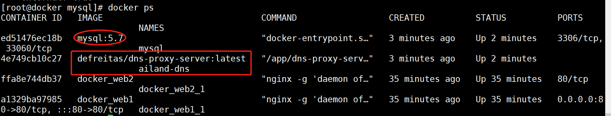


## 8.docker-compose制作Rabbitmq

```shell
[root@docker rabbitmq]# tree /root/rabbitmq/
/root/rabbitmq/
└── docker-compose.yaml

[root@docker rabbitmq]# cat docker-compose.yaml 
version: "3"

services:

  dns-proxy-server:
    image: defreitas/dns-proxy-server:latest
    hostname: dns.ailand
    restart: always
    container_name: ailand-dns
    networks:
      - ailand
    volumes:
      - /var/run/docker.sock:/var/run/docker.sock
      - /etc/resolv.conf:/etc/resolv.conf

  rabbitmq:
    image: rabbitmq:3-management
    restart: always
    networks: 
      - ailand 
    hostname: rabbitmq.ailand
    container_name: rabbitmq
    ports: 
      - "5672:5672"
      - "15672:15672"
    environment:
      RABBITMQ_DEFAULT_USER: ehome
      RABBITMQ_DEFAULT_PASS: ehome


networks:
  ailand:
    external: true
    
[root@docker rabbitmq]# docker-compose up -d
```


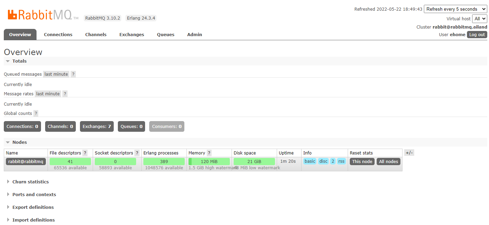

## 9.docker-compose制作微服务

服务包：

[📎tensquare_gathering.sql](https://www.yuque.com/attachments/yuque/0/2023/sql/35797528/1683018465942-867d3eb7-2490-4b90-99f5-e2c10021d428.sql)[📎tensquare_user.sql](https://www.yuque.com/attachments/yuque/0/2023/sql/35797528/1683018465942-4fadf6cf-65a8-4e13-b402-b4ea43c72c24.sql)

```shell
[root@docker ~]# mkdir spring
[root@docker spring]# tree /root/spring/
/root/spring/
├── admin
│   ├── Dockerfile
│   └── tensquare_admin_service-1.0-SNAPSHOT.jar
├── docker-compose.yaml
├── Dockerfile
├── eureka
│   ├── Dockerfile
│   ├── jdk-8u211-linux-x64.tar.gz
│   └── tensquare_eureka_server-1.0-SNAPSHOT.jar
├── gathering
│   ├── Dockerfile
│   └── tensquare_gathering-1.0-SNAPSHOT.jar
├── mysql
│   ├── Dockerfile
│   ├── tensquare_gathering.sql
│   └── tensquare_user.sql
├── mysql-initdb
├── nginx
│   ├── dist.tar.gz
│   └── Dockerfile
└── zuul
    ├── Dockerfile
    └── tensquare_zuul-1.0-SNAPSHOT.jar
    
[root@docker spring]# cat eureka/Dockerfile 
FROM daocloud.io/ld00000/jdk-8:latest
MAINTAINER youngfit
ENV JAVA_HOME /usr/local/java/
ENV PATH $PATH:$JAVA_HOME/bin
COPY tensquare_eureka_server-1.0-SNAPSHOT.jar /usr/local
EXPOSE 10086
CMD java -jar /usr/local/tensquare_eureka_server-1.0-SNAPSHOT.jar

[root@docker spring]# cat admin/Dockerfile 
FROM daocloud.io/ld00000/jdk-8:latest
MAINTAINER youngfit
ENV JAVA_HOME /usr/local/java/
ENV PATH $PATH:$JAVA_HOME/bin
COPY tensquare_admin_service-1.0-SNAPSHOT.jar /usr/local
EXPOSE 9001
CMD java -jar /usr/local/tensquare_admin_service-1.0-SNAPSHOT.jar

[root@docker spring]# cat gathering/Dockerfile 
FROM daocloud.io/ld00000/jdk-8:latest
MAINTAINER youngfit
ENV JAVA_HOME /usr/local/java/
ENV PATH $PATH:$JAVA_HOME/bin
COPY tensquare_gathering-1.0-SNAPSHOT.jar /usr/local
EXPOSE 9001
CMD java -jar /usr/local/tensquare_gathering-1.0-SNAPSHOT.jar

[root@docker spring]# cat zuul/Dockerfile 
FROM daocloud.io/ld00000/jdk-8:latest
MAINTAINER youngfit
ENV JAVA_HOME /usr/local/java/
ENV PATH $PATH:$JAVA_HOME/bin
COPY tensquare_zuul-1.0-SNAPSHOT.jar /usr/local
EXPOSE 9001
CMD java -jar /usr/local/tensquare_zuul-1.0-SNAPSHOT.jar

[root@docker spring]# cat nginx/Dockerfile 
FROM nginx:1.22.0-perl
RUN rm -rf /usr/share/nginx/html/*
ADD dist.tar.gz /usr/share/nginx/html
RUN chmod 777 /usr/share/nginx/html -R
EXPOSE 80
[root@docker spring]# cat docker-compose.yaml 
version: "2"
services:
  dns-proxy-server:
    image: defreitas/dns-proxy-server:latest
    hostname: dns.ailand
    restart: always
    container_name: ailand-dns
    networks:
      - ailand
    volumes:
      - /var/run/docker.sock:/var/run/docker.sock
      - /etc/resolv.conf:/etc/resolv.conf

  mysql:
      image: mysql:5.7
      container_name: mysql
      hostname: mysql.ailand
      command: --default-authentication-plugin=mysql_native_password --character-set-server=utf8mb4 --collation-server=utf8mb4_unicode_ci
      restart: always
      environment:
        MYSQL_ROOT_PASSWORD: Youngfit@2022
      networks:
        - ailand
      volumes:
        - ./mysql-initdb/:/docker-entrypoint-initdb.d/
        - mysql:/var/lib/mysql
        - /etc/localtime/:/etc/localtime/

  eureka:
    build: ./eureka
    container_name: eureka
#    volumes:
#      - data-volume:/usr/share/nginx/html
    restart: always
    networks:
      - ailand
    ports:
     - "30020:10086"
  
  zuul:
    build: ./zuul
    container_name: zuul
    restart: always
    networks:
      - ailand
    ports:
     -  "30021:10020"

  admin:
    build: ./admin
    container_name: admin
    networks:
      - ailand
    ports:
     - "30024:9001"

  gathering:
    build: ./gathering
    container_name: gathering
    networks:
      - ailand
    ports:
     - "30023:9002"
  
  nginx:
    build: ./nginx
    container_name: nginx
    networks:
      - ailand
    ports:
      - "80:80"
volumes:
  mysql:

networks:
  ailand:
    external: true
```

## 10.docker-compose制作Redis集群


企业真实案例：

[📎docker-compose(1).yml](https://www.yuque.com/attachments/yuque/0/2023/yml/35797528/1683018466041-afc86864-171f-4983-b2b5-20316f8f1653.yml)

[📎docker-compose.yml](https://www.yuque.com/attachments/yuque/0/2023/yml/35797528/1683018466040-10330737-440c-4534-aeb4-d8e3d517e470.yml)