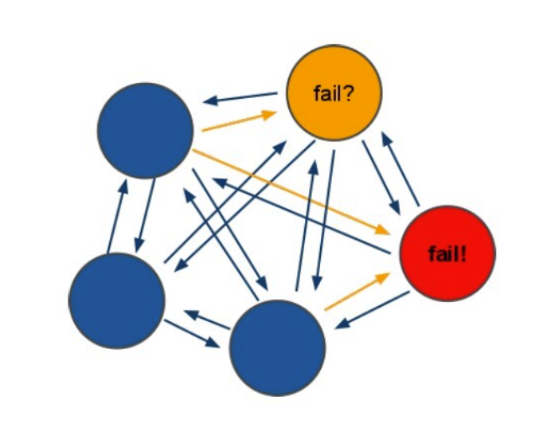
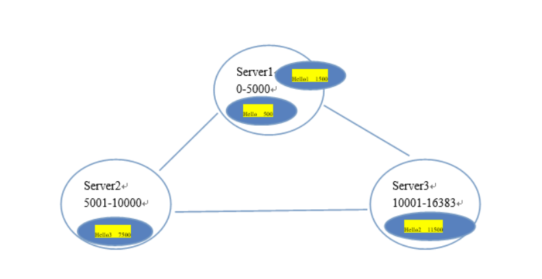

# redis集群搭建

# **Redis集群**


### 一、redis-cluster架构图


### 二、 redis-cluster投票:容错





### 三、架构细节:


(1)所有的redis节点彼此互联(PING-PONG机制),内部使用二进制协议优化传输速度和带宽.
(2)节点的fail是通过集群中超过半数的节点检测失效时才生效.
(3)客户端与redis节点直连,不需要中间proxy层.客户端不需要连接集群所有节点,连接集群中任何一个可用节点即可
(4)redis-cluster把所有的物理节点映射到[0-16383]slot上,cluster 负责维护node<->slot<->value
Redis 集群中内置了 16384 个哈希槽，当需要在 Redis 集群中放置一个 key-value 时，redis 先对 key 使用 crc16 算法算出一个结果，然后把结果对 16384 求余数，这样每个 key 都会对应一个编号在 0-16383 之间的哈希槽，redis 会根据节点数量大致均等的将哈希槽映射到不同的节点.


**面试题：为什么是16384(2^14)个槽呢？**

 

(1)如果槽位为65536，发送心跳信息的消息头达8k，发送的心跳包过于庞大。

 

如上所述，在消息头中，最占空间的是`myslots[CLUSTER_SLOTS/8]`。 当槽位为65536时，这块的大小是: `65536÷8÷1024=8kb` 因为每秒钟，redis节点需要发送一定数量的ping消息作为心跳包，如果槽位为65536，这个ping消息的消息头太大了，浪费带宽。

 

(2)redis的集群主节点数量基本不可能超过1000个。

 

如上所述，集群节点越多，心跳包的消息体内携带的数据越多。如果节点过1000个，也会导致网络拥堵。因此redis作者，不建议redis cluster节点数量超过1000个。 那么，对于节点数在1000以内的redis cluster集群，16384个槽位够用了。没有必要拓展到65536个。

 

(3)槽位越小，节点少的情况下，压缩比高

 

Redis主节点的配置信息中，它所负责的哈希槽是通过一张bitmap的形式来保存的，在传输过程中，会对bitmap进行压缩，但是如果bitmap的填充率slots / N很高的话(N表示节点数)，bitmap的压缩率就很低。 如果节点数很少，而哈希槽数量很多的话，bitmap的压缩率就很低。





### 四、集群搭建


我们本次使用docker-compose来搭建，更加方便，快捷


#### 4.1 下载Docker依赖的环境


想安装Docker，需要先将依赖的环境全部下载，就像Maven依赖JDK一样

 

参考：https://developer.aliyun.com/article/110806

 

如果之前安装过，可以先卸载docker

 

[root[@localhost ]() ~]# yum -y remove docker-ce 


```shell
[root@localhost local]# yum -y install yum-utils device-mapper-persistent-data lvm2
```


如果安装不成功，可以先删除yum.pid

 

[root[@localhost ]() ~]# rm -rf /var/run/yum.pid 


#### 4.2 指定Docker镜像源


默认下载Docker回去国外服务器下载，速度较慢，我们可以设置为阿里云镜像源，速度更快


```shell
[root@localhost ~]# yum-config-manager --add-repo http://mirrors.aliyun.com/docker-ce/linux/centos/docker-ce.repo
```


#### 4.3 安装Docker


依然采用yum的方式安装


```shell
[root@localhost ~]# yum makecache fast
[root@localhost ~]# yum -y install docker-ce
```


#### 4.4 启动Docker


安装成功后，需要手动启动


```shell
# 启动Docker服务
[root@localhost ~]# service docker start
```


注：关闭防火墙之后docker需要重启


```shell
[root@localhost ~]# systemctl stop firewalld
[root@localhost ~]# service docker restart
```


#### 4.5 安装docker-compose


使用daocloud下载，速度较快（推荐使用）


```shell
[root@iz8vbdmrir2n6xqzrbd93hz ~]# curl -L https://get.daocloud.io/docker/compose/releases/download/1.29.2/docker-compose-`uname -s`-`uname -m` -o /usr/local/bin/docker-compose
```


注：如果无法下载，可以找到课件中docker-compose文件目录下，把下载好的docker-compose拷贝到/usr/local/bin目录下即可


#### 4.6 授权


设置该文件为可执行文件，设置之前可以切换到 /usr/local/bin目录下查看一下，文件会变颜色


```shell
[root@iz8vbdmrir2n6xqzrbd93hz ~]# chmod +x /usr/local/bin/docker-compose
```


#### 4.7 查看版本


切换到 /usr/local/bin目录下执行以下命令，会显示版本：docker-compose version 1.29.2, build 5becea4c


```shell
[root@iz8vbdmrir2n6xqzrbd93hz  bin]# docker-compose --version
```


#### 4.8 Redis的去中心化模式


去中心化模式：有多个master 组成，每个maser 只负责一部分数据的存储查询。

 

三主三从，四主四从

 

重点：master选举

 

slot：数据槽主要用来数据的管理和迁移


##### 4.8.1 创建在/opt目录下创建docker_redis_cluster目录


```shell
[root@localhost ~]# cd /
[root@localhost /]# cd opt
[root@localhost opt]# mkdir docker_redis_cluster
```


##### 4.8.2 创建docker-compose.yml并编写以下内容：


```shell
[root@localhost opt]# cd docker_redis_cluster/
[root@localhost docker_redis_cluster]# vim docker-compose.yml
```


```shell
version: "3.1"
services:
  redis1:
    image: daocloud.io/library/redis:5.0.7
    restart: always
    container_name: redis1
    environment:
      - TZ=Asia/Shanghai
    ports:
      - 7001:7001
      - 17001:17001
    volumes:
      - ./conf/redis1.conf:/usr/local/redis/redis.conf
    command: ["redis-server","/usr/local/redis/redis.conf"]
  redis2:
    image: daocloud.io/library/redis:5.0.7
    restart: always
    container_name: redis2
    environment:
      - TZ=Asia/Shanghai
    ports:
      - 7002:7002
      - 17002:17002
    volumes:
      - ./conf/redis2.conf:/usr/local/redis/redis.conf
    command: ["redis-server","/usr/local/redis/redis.conf"]  
  redis3:
    image: daocloud.io/library/redis:5.0.7
    restart: always
    container_name: redis3
    environment:
      - TZ=Asia/Shanghai
    ports:
      - 7003:7003
      - 17003:17003
    volumes:
      - ./conf/redis3.conf:/usr/local/redis/redis.conf
    command: ["redis-server","/usr/local/redis/redis.conf"]  
  redis4:
    image: daocloud.io/library/redis:5.0.7
    restart: always
    container_name: redis4
    environment:
      - TZ=Asia/Shanghai
    ports:
      - 7004:7004
      - 17004:17004
    volumes:
      - ./conf/redis4.conf:/usr/local/redis/redis.conf
    command: ["redis-server","/usr/local/redis/redis.conf"]  
  redis5:
    image: daocloud.io/library/redis:5.0.7
    restart: always
    container_name: redis5
    environment:
      - TZ=Asia/Shanghai
    ports:
      - 7005:7005
      - 17005:17005
    volumes:
      - ./conf/redis5.conf:/usr/local/redis/redis.conf
    command: ["redis-server","/usr/local/redis/redis.conf"]  
  redis6:
    image: daocloud.io/library/redis:5.0.7
    restart: always
    container_name: redis6
    environment:
      - TZ=Asia/Shanghai
    ports:
      - 7006:7006
      - 17006:17006
    volumes:
      - ./conf/redis6.conf:/usr/local/redis/redis.conf
    command: ["redis-server","/usr/local/redis/redis.conf"]
```


##### 4.8.3 在docker_redis_cluster目录下创建conf目录，


```shell
[root@localhost docker_redis_cluster]# mkdir conf
```


##### 4.8.4 在conf目录下创建redis1.conf ~ redis6.conf（共六个文件）


```shell
[root@localhost docker_redis_cluster]# cd conf
[root@localhost conf]# vim redis1.conf
```


依次编写文件中的内容（注意：IP地址改成自己的）：


```shell
# redis.conf
# 指定redis的端口号
port 7001
# 开启Redis集群
cluster-enabled yes
# 集群信息的文件
cluster-config-file nodes-7001.conf
# 集群的对外ip地址 linux ip
cluster-announce-ip 192.168.25.130
# 集群的对外port
cluster-announce-port 7001
# 集群的总线端口
cluster-announce-bus-port 17001
```


```shell
# redis.conf
# 指定redis的端口号
port 7002
# 开启Redis集群
cluster-enabled yes
# 集群信息的文件
cluster-config-file nodes-7002.conf
# 集群的对外ip地址 linux ip
cluster-announce-ip 192.168.25.130
# 集群的对外port
cluster-announce-port 7002
# 集群的总线端口
cluster-announce-bus-port 17002
```


```shell
# redis.conf
# 指定redis的端口号
port 7003
# 开启Redis集群
cluster-enabled yes
# 集群信息的文件
cluster-config-file nodes-7003.conf
# 集群的对外ip地址 linux ip
cluster-announce-ip 192.168.25.130
# 集群的对外port
cluster-announce-port 7003
# 集群的总线端口
cluster-announce-bus-port 17003
```


```shell
# redis.conf
# 指定redis的端口号
port 7004
# 开启Redis集群
cluster-enabled yes
# 集群信息的文件
cluster-config-file nodes-7004.conf
# 集群的对外ip地址 linux ip
cluster-announce-ip 192.168.25.130
# 集群的对外port
cluster-announce-port 7004
# 集群的总线端口
cluster-announce-bus-port 17004
```


```shell
# redis.conf
# 指定redis的端口号
port 7005
# 开启Redis集群
cluster-enabled yes
# 集群信息的文件
cluster-config-file nodes-7005.conf
# 集群的对外ip地址 linux ip
cluster-announce-ip 192.168.25.130
# 集群的对外port
cluster-announce-port 7005
# 集群的总线端口
cluster-announce-bus-port 17005
```


```shell
# redis.conf
# 指定redis的端口号
port 7006
# 开启Redis集群
cluster-enabled yes
# 集群信息的文件
cluster-config-file nodes-7006.conf
# 集群的对外ip地址 linux ip
cluster-announce-ip 192.168.25.130
# 集群的对外port
cluster-announce-port 7006
# 集群的总线端口
cluster-announce-bus-port 17006
```


##### 4.8.5 在docker_redis_cluster目录下启动


```shell
[root@localhost docker_redis_cluster]# docker-compose up -d
Creating network "docker_redis_cluster_default" with the default driver
Pulling redis1 (daocloud.io/library/redis:5.0.7)...
5.0.7: Pulling from library/redis
68ced04f60ab: Pull complete
7ecc253967df: Pull complete
765957bf98d4: Pull complete
52f16772e1ca: Pull complete
2e43ba99c3f3: Pull complete
d95576c71392: Pull complete
Digest: sha256:ee1d00c5250b5a886b09be2d5f9506add35dfb557f1ef37a7e4b8f0138f32956
Status: Downloaded newer image for daocloud.io/library/redis:5.0.7
Creating redis4 ... done
Creating redis2 ... done
Creating redis3 ... done
Creating redis1 ... done
Creating redis6 ... done
Creating redis5 ... done
```


##### 4.8.6 随意进入一台容器，进行集群组网，执行以下命令（ 注意：端口号改成自己的 ）


命令解释：--cluster-replicas 1  表示创建的集群每个master有 1 个从机 （因为是6台，所以是三主三从，如果是：--cluster-replicas 2 则是二主四从）


```shell
[root@localhost docker_redis_cluster]# docker exec -it da155 bash
root@da1554cdcff6:/data# redis-cli --cluster create 192.168.25.130:7001 192.168.25.130:7002 192.168.25.130:7003 192.168.25.130:7004 192.168.25.130:7005 192.168.25.130:7006 --cluster-replicas 1
>>> Performing hash slots allocation on 6 nodes...
Master[0] -> Slots 0 - 5460
Master[1] -> Slots 5461 - 10922
Master[2] -> Slots 10923 - 16383
Adding replica 192.168.25.138:7005 to 192.168.25.138:7001
Adding replica 192.168.25.138:7006 to 192.168.25.138:7002
Adding replica 192.168.25.138:7004 to 192.168.25.138:7003
>>> Trying to optimize slaves allocation for anti-affinity
[WARNING] Some slaves are in the same host as their master
M: 0b1cb33fb1494f6eabf522e3a56a8f4c1623f69c 192.168.25.138:7001
   slots:[0-5460] (5461 slots) master
M: dbc83d01d336194407c6c085e5e668da1ef84262 192.168.25.138:7002
   slots:[5461-10922] (5462 slots) master
M: 8d1ffcd0028adfb7305495548274c609cc02b3b7 192.168.25.138:7003
   slots:[10923-16383] (5461 slots) master
S: 8dd0fd5edbd9464d95535f3efb62c7ef2308c308 192.168.25.138:7004
   replicates dbc83d01d336194407c6c085e5e668da1ef84262
S: 1e4e186a899066443137adc22028152a4c361866 192.168.25.138:7005
   replicates 8d1ffcd0028adfb7305495548274c609cc02b3b7
S: ae7047b36685bf12ea3bc5933a7a501d6180b55f 192.168.25.138:7006
   replicates 0b1cb33fb1494f6eabf522e3a56a8f4c1623f69c
Can I set the above configuration? (type 'yes' to accept):
```


##### 4.8.7 输入：yes


```shell
Can I set the above configuration? (type 'yes' to accept): yes
>>> Nodes configuration updated
>>> Assign a different config epoch to each node
>>> Sending CLUSTER MEET messages to join the cluster
Waiting for the cluster to join
...
>>> Performing Cluster Check (using node 192.168.25.138:7001)
M: 0b1cb33fb1494f6eabf522e3a56a8f4c1623f69c 192.168.25.138:7001
   slots:[0-5460] (5461 slots) master
   1 additional replica(s)
M: dbc83d01d336194407c6c085e5e668da1ef84262 192.168.25.138:7002
   slots:[5461-10922] (5462 slots) master
   1 additional replica(s)
M: 8d1ffcd0028adfb7305495548274c609cc02b3b7 192.168.25.138:7003
   slots:[10923-16383] (5461 slots) master
   1 additional replica(s)
S: 1e4e186a899066443137adc22028152a4c361866 192.168.25.138:7005
   slots: (0 slots) slave
   replicates 8d1ffcd0028adfb7305495548274c609cc02b3b7
S: 8dd0fd5edbd9464d95535f3efb62c7ef2308c308 192.168.25.138:7004
   slots: (0 slots) slave
   replicates dbc83d01d336194407c6c085e5e668da1ef84262
S: ae7047b36685bf12ea3bc5933a7a501d6180b55f 192.168.25.138:7006
   slots: (0 slots) slave
   replicates 0b1cb33fb1494f6eabf522e3a56a8f4c1623f69c
[OK] All nodes agree about slots configuration.
>>> Check for open slots...
>>> Check slots coverage...
[OK] All 16384 slots covered.
```


##### 4.8.9 集群搭建成功，然后进入redis 集群命令进行测试


-c  集群模式执行命令
-h  要登录哪一个节点 ip（对应自己IP地址）
-p 7001  节点对应的端口


```shell
root@da1554cdcff6:/data# redis-cli -c -h 192.168.25.130 -p 7001
192.168.25.130:7001> set k1 v1
-> Redirected to slot [12706] located at 192.168.25.130:7003
OK
192.168.25.130:7003> get k1
"v1"
```


### 五、集群测试


#### 5.1.连接单机版


第一步：创建一个Jedis对象。需要指定服务端的ip及端口。
第二步：使用Jedis对象操作数据库，每个redis命令对应一个方法。
第三步：打印结果。
第四步：关闭Jedis


```java
@Test
public void testJedis() throws Exception {
	// 第一步：创建一个Jedis对象。需要指定服务端的ip及端口。
	Jedis jedis = new Jedis("10.0.135.131", 6379);
	// 第二步：使用Jedis对象操作数据库，每个redis命令对应一个方法。
	String result = jedis.get("hello");
	// 第三步：打印结果。
	System.out.println(result);
	// 第四步：关闭Jedis
	jedis.close();
}
```


2.连接单机版使用连接池
第一步：创建一个JedisPool对象。需要指定服务端的ip及端口。
第二步：从JedisPool中获得Jedis对象。
第三步：使用Jedis操作redis服务器。
第四步：操作完毕后关闭jedis对象，连接池回收资源。
第五步：关闭JedisPool对象。


```java
@Test
public void testJedisPool() throws Exception {
	// 第一步：创建一个JedisPool对象。需要指定服务端的ip及端口。
	JedisPool jedisPool = new JedisPool("10.0.135.131", 6379);
	// 第二步：从JedisPool中获得Jedis对象。
	Jedis jedis = jedisPool.getResource();
	// 第三步：使用Jedis操作redis服务器。
	jedis.set("jedis", "test");
	String result = jedis.get("jedis");
	System.out.println(result);
	// 第四步：操作完毕后关闭jedis对象，连接池回收资源。
	jedis.close();
	// 第五步：关闭JedisPool对象。
	jedisPool.close();
}
```


3.连接集群版
第一步：使用JedisCluster对象。需要一个Set参数。Redis节点的列表。
第二步：直接使用JedisCluster对象操作redis。在系统中单例存在。
第三步：打印结果
第四步：系统关闭前，关闭JedisCluster对象。


```java
@Test
public void testJedisCluster() throws Exception {
    // 第一步：使用JedisCluster对象。需要一个Set<HostAndPort>参数。Redis节点的列表。
    Set<HostAndPort> nodes = new HashSet<>();
    nodes.add(new HostAndPort("192.168.25.130", 7001));
    nodes.add(new HostAndPort("192.168.25.130", 7002));
    nodes.add(new HostAndPort("192.168.25.130", 7003));
    nodes.add(new HostAndPort("192.168.25.130", 7004));
    nodes.add(new HostAndPort("192.168.25.130", 7005));
    nodes.add(new HostAndPort("192.168.25.130", 7006));
    JedisCluster jedisCluster = new JedisCluster(nodes);
    // 第二步：直接使用JedisCluster对象操作redis。在系统中单例存在。
    jedisCluster.set("hello", "100");
    String result = jedisCluster.get("hello");
    // 第三步：打印结果
    System.out.println(result);
    // 第四步：系统关闭前，关闭JedisCluster对象。
    jedisCluster.close();
}
```


封装和整合spring

 

接口封装
	常用的操作redis的方法提取出一个接口，分别对应单机版和集群版创建两个实现类。

 

接口定义


```java
package com.qf.utils;

public interface JedisClient {
    String set(String key, String value);
	String get(String key);
	Boolean exists(String key);
	Long expire(String key, int seconds);
	Long ttl(String key);
	Long incr(String key);
	Long hset(String key, String field, String value);
	String hget(String key, String field);
	Long hdel(String key, String... field);
}
```


单机版实现类


```java
package com.qf.utils;

import org.springframework.beans.factory.annotation.Autowired;
import org.springframework.stereotype.Service;
import redis.clients.jedis.Jedis;
import redis.clients.jedis.JedisPool;

@Service
public class JedisClientPool implements JedisClient {
	@Autowired
	private JedisPool jedisPool;

	public void setJedisPool(JedisPool jedisPool) {
		this.jedisPool = jedisPool;
	}

	@Override
	public String set(String key, String value) {
		Jedis jedis = jedisPool.getResource();
		String result = jedis.set(key, value);
		jedis.close();
		return result;
	}

	@Override
	public String get(String key) {
		Jedis jedis = jedisPool.getResource();
		String result = jedis.get(key);
		jedis.close();
		return result;
	}

	@Override
	public Boolean exists(String key) {
		Jedis jedis = jedisPool.getResource();
		Boolean result = jedis.exists(key);
		jedis.close();
		return result;
	}

	@Override
	public Long expire(String key, int seconds) {
		Jedis jedis = jedisPool.getResource();
		Long result = jedis.expire(key, seconds);
		jedis.close();
		return result;
	}

	@Override
	public Long ttl(String key) {
		Jedis jedis = jedisPool.getResource();
		Long result = jedis.ttl(key);
		jedis.close();
		return result;
	}

	@Override
	public Long incr(String key) {
		Jedis jedis = jedisPool.getResource();
		Long result = jedis.incr(key);
		jedis.close();
		return result;
	}

	@Override
	public Long hset(String key, String field, String value) {
		Jedis jedis = jedisPool.getResource();
		Long result = jedis.hset(key, field, value);
		jedis.close();
		return result;
	}

	@Override
	public String hget(String key, String field) {
		Jedis jedis = jedisPool.getResource();
		String result = jedis.hget(key, field);
		jedis.close();
		return result;
	}

	@Override
	public Long hdel(String key, String... field) {
		Jedis jedis = jedisPool.getResource();
		Long result = jedis.hdel(key, field);
		jedis.close();
		return result;
	}

}
```


配置：applicationContext-redis.xml


```xml
<?xml version="1.0" encoding="UTF-8"?>
<beans xmlns="http://www.springframework.org/schema/beans"
       xmlns:context="http://www.springframework.org/schema/context" xmlns:p="http://www.springframework.org/schema/p"
       xmlns:aop="http://www.springframework.org/schema/aop" xmlns:tx="http://www.springframework.org/schema/tx"
       xmlns:xsi="http://www.w3.org/2001/XMLSchema-instance"
       xsi:schemaLocation="http://www.springframework.org/schema/beans http://www.springframework.org/schema/beans/spring-beans-4.3.xsd
	http://www.springframework.org/schema/context http://www.springframework.org/schema/context/spring-context-4.3.xsd
	http://www.springframework.org/schema/aop http://www.springframework.org/schema/aop/spring-aop-4.3.xsd http://www.springframework.org/schema/tx http://www.springframework.org/schema/tx/spring-tx-4.3.xsd
	http://www.springframework.org/schema/util http://www.springframework.org/schema/util/spring-util-4.3.xsd">

    <!-- 配置单机版的连接 -->
    <bean id="jedisPool" class="redis.clients.jedis.JedisPool">
        <constructor-arg name="host" value="192.168.25.137"></constructor-arg>
        <constructor-arg name="port" value="6381"></constructor-arg>
    </bean>
    <bean id="jedisClientPool" class="com.qf.utils.JedisClientPool">
        <property name="jedisPool" ref="jedisPool"></property>
     </bean>

</beans>
```


集群版实现类


```java
package com.qf.utils;

import org.springframework.beans.factory.annotation.Autowired;
import org.springframework.stereotype.Service;
import redis.clients.jedis.JedisCluster;

@Service
public class JedisClientCluster implements JedisClient {
	@Autowired
	private JedisCluster jedisCluster;

	public void setJedisCluster(JedisCluster jedisCluster) {
		this.jedisCluster = jedisCluster;
	}

	@Override
	public String set(String key, String value) {
		return jedisCluster.set(key, value);
	}

	@Override
	public String get(String key) {
		return jedisCluster.get(key);
	}

	@Override
	public Boolean exists(String key) {
		return jedisCluster.exists(key);
	}

	@Override
	public Long expire(String key, int seconds) {
		return jedisCluster.expire(key, seconds);
	}

	@Override
	public Long ttl(String key) {
		return jedisCluster.ttl(key);
	}

	@Override
	public Long incr(String key) {
		return jedisCluster.incr(key);
	}

	@Override
	public Long hset(String key, String field, String value) {
		return jedisCluster.hset(key, field, value);
	}

	@Override
	public String hget(String key, String field) {
		return jedisCluster.hget(key, field);
	}

	@Override
	public Long hdel(String key, String... field) {
		return jedisCluster.hdel(key, field);
	}

}
```


Spring的配置


```xml
<?xml version="1.0" encoding="UTF-8"?>
<beans xmlns="http://www.springframework.org/schema/beans"
       xmlns:context="http://www.springframework.org/schema/context" xmlns:p="http://www.springframework.org/schema/p"
       xmlns:aop="http://www.springframework.org/schema/aop" xmlns:tx="http://www.springframework.org/schema/tx"
       xmlns:xsi="http://www.w3.org/2001/XMLSchema-instance"
       xsi:schemaLocation="http://www.springframework.org/schema/beans http://www.springframework.org/schema/beans/spring-beans-4.3.xsd
	http://www.springframework.org/schema/context http://www.springframework.org/schema/context/spring-context-4.3.xsd
	http://www.springframework.org/schema/aop http://www.springframework.org/schema/aop/spring-aop-4.3.xsd http://www.springframework.org/schema/tx http://www.springframework.org/schema/tx/spring-tx-4.3.xsd
	http://www.springframework.org/schema/util http://www.springframework.org/schema/util/spring-util-4.3.xsd">

    <!-- 配置单机版的连接 -->
<!--    <bean id="jedisPool" class="redis.clients.jedis.JedisPool">-->
<!--        <constructor-arg name="host" value="192.168.25.137"></constructor-arg>-->
<!--        <constructor-arg name="port" value="6381"></constructor-arg>-->
<!--    </bean>-->
<!--    <bean id="jedisClientPool" class="com.qf.utils.JedisClientPool">-->
<!--        <property name="jedisPool" ref="jedisPool"></property>-->
<!--     </bean>-->


    <!-- 集群版的配置 -->
    <bean id="jedisCluster" class="redis.clients.jedis.JedisCluster">
        <constructor-arg>
            <set>
                <bean class="redis.clients.jedis.HostAndPort">
                    <constructor-arg name="host" value="192.168.25.130"></constructor-arg>
                    <constructor-arg name="port" value="7001"></constructor-arg>
                </bean>
                <bean class="redis.clients.jedis.HostAndPort">
                    <constructor-arg name="host" value="192.168.25.130"></constructor-arg>
                    <constructor-arg name="port" value="7002"></constructor-arg>
                </bean>
                <bean class="redis.clients.jedis.HostAndPort">
                    <constructor-arg name="host" value="192.168.25.130"></constructor-arg>
                    <constructor-arg name="port" value="7003"></constructor-arg>
                </bean>
                <bean class="redis.clients.jedis.HostAndPort">
                    <constructor-arg name="host" value="192.168.25.130"></constructor-arg>
                    <constructor-arg name="port" value="7004"></constructor-arg>
                </bean>
                <bean class="redis.clients.jedis.HostAndPort">
                    <constructor-arg name="host" value="192.168.25.130"></constructor-arg>
                    <constructor-arg name="port" value="7005"></constructor-arg>
                </bean>
                <bean class="redis.clients.jedis.HostAndPort">
                    <constructor-arg name="host" value="192.168.25.130"></constructor-arg>
                    <constructor-arg name="port" value="7006"></constructor-arg>
                </bean>
            </set>
        </constructor-arg>
    </bean>
    <bean id="jedisClientCluster" class="com.qf.utils.JedisClientCluster">
        <property name="jedisCluster" ref="jedisCluster"></property>
    </bean>
    <!--注意：单机版和集群版不能共存，使用单机版时注释集群版的配置。使用集群版，把单机版注释。-->

</beans>
```