        Prometheus是一个开源监控系统，它前身是SoundCloud的警告工具包。从2012年开始，许多公司和组织开始 使用Prometheus。该项目的开发人员和用户社区非常活跃，越来越多的开发人员和用户参与到该项目中。目前 它是一个独立的开源项目，且不依赖与任何公司。 为了强调这点和明确该项目治理结构，Prometheus在2016年 继Kurberntes之后，加入了Cloud Native Computing Foundation。

Prometheus的主要特征有：

1.多维度数据模型

2.灵活的查询语言

3.不依赖分布式存储，单个服务器节点是自主的

4.以HTTP方式，通过pull模型拉去时间序列数据

5.也通过中间网关支持push模型

6.通过服务发现或者静态配置，来发现目标服务对象

7.支持多种多样的图表和界面展示，grafana也支持它

主要组件：

Prometheus生态包括了很多组件，它们中的一些是可选的：

主服务Prometheus Server负责抓取和存储时间序列数据

客户库负责检测应用程序代码

支持短生命周期的PUSH网关

基于Rails/SQL仪表盘构建器的GUI

多种导出工具，可以支持Prometheus存储数据转化为HAProxy、StatsD、Graphite等工具所需要的数据存 储格式

警告管理器

命令行查询工具

其他各种支撑工具

多数Prometheus组件是Go语言写的，这使得这些组件很容易编译和部署。

使用的服务器 192.168.11.192  192.168.11.193  192.168.11.194

全部关闭防火墙，禁用selinux

```
systemctl stop firewalld ;setenforce 0
```

先拉取需要用到的镜像

```
docker pull prom/prometheus    192服务器拉取

docker pull grafana/grafana 192服务器拉取

docker pull prom/node-exporter 三台都拉取

docker pull google/cadvisor 三台都拉取
```

离线环境的话可以在外网拉取打包下来打包命令

```
docker save -o prometheus.tar  docker.io/prom/prometheus:  latest
```

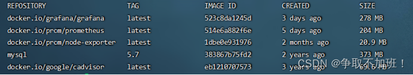

3个节点，全部部署node-EXporter（收集硬件和系统信息）,和cAdvisor（收集节点容器信息）

```
docker run -d  --name node-exporter -v /proc:/host/proc -v /sys:/host/sys -v /:/rootfs --net=host docker.io/prom/node-exporter:latest --path.procfs /host/proc --path.sysfs /host/sys --collector.filesystem.ignored-mount-points "^/(sys|proc|dev|host|etc)($|/)"
```

这里使用了–net=host， 这样Prometheus Server可以直接与Node-EXporter通信

访问三个服务器ip+9100验证一下

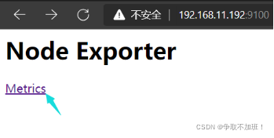


部署安装cAdvisor,收集节点容器信息

```
docker run -v /:/rootfs:ro -v /var/run:/var/run/:rw -v /sys:/sys:ro -v /var/lib/docker:/var/lib/docker:ro --detach=true --name=cadvisor --net=host docker.io/google/cadvisor:latest
```

启动cadvisor报错的话

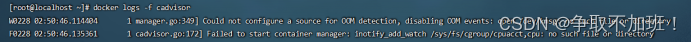

执行

```
mount -o remount,rw '/sys/fs/cgroup'

ln -s /sys/fs/cgroup/cpu,cpuacct /sys/fs/cgroup/cpuacct,cpu
```

执行完以上两个命令后重启容器即可 

```
docker restart cadvisor
```

访问三个服务器ip+8080验证一下

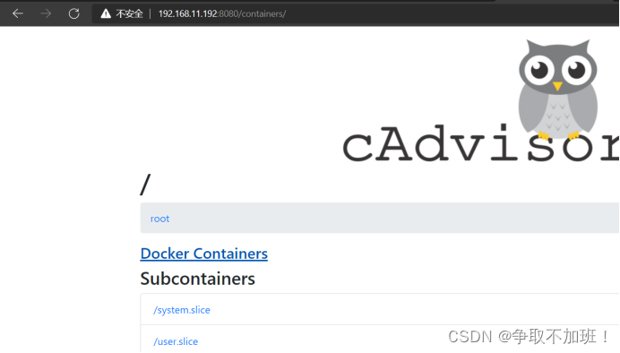


然后在192.168.11.192上部署Prometheus Server服务

 在部署prometheus之前，我们需要对它的配置文件进行修改,所以我们先运行一个容器，先将其配置文件拷贝出来。

```
docker run -d --name prometheus --net=host docker.io/prom/prometheus:latest
```

拷贝出来prometheus配置文件

```
docker cp prometheus:/etc/prometheus/prometheus.yml . 
```

然后修改配置文件这里指定了prometheus的监控项，包括它也会监控自己收集到的数据

大概在29行第一张不清楚看第二张


重新运行prometheus容器

删除刚刚的容器 docker rm  prometheus 

运行新的prometheus容器

```
docker run -d --name prometheus --net=host -v /root/prometheus.yml:/etc/prometheus/prometheus.yml docker.io/prom/prometheus:latest
```

访问192.169.11.192:9090  查看状态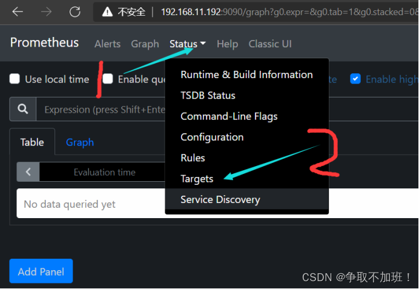

在这里可以看到我们配置文件里添加的ip+端口监控状态 ，可以随意停掉一个容器刷新看看状态在重新启动，重启后等一会在刷新有十几秒的延迟

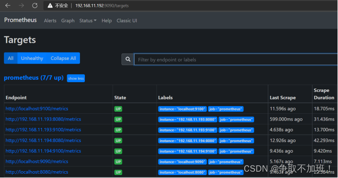

#### 

`在192.168.11.192上，部署grafana服务，用来展示prometheus收集到的数据`

创建一个收集数据的目录 权限给个777

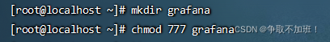

```
docker run -d --net=host --name grafana -v /root/grafana:/var/lib/grafana -e "GF_SECURITY_ADMIN_PASSWORD=123456" docker.io/grafana/grafana:latest
```

访问192.168.11.192:3000     默认用户admin 密码是启动容器的参数设置的 我是123456

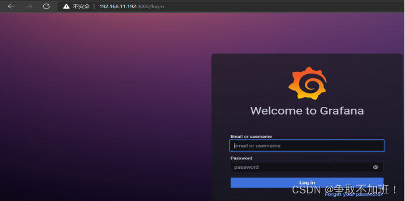

按照步骤添加数据源

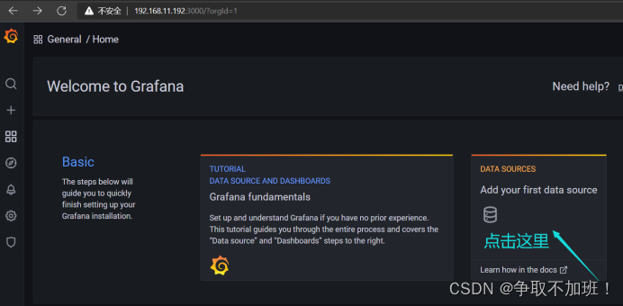

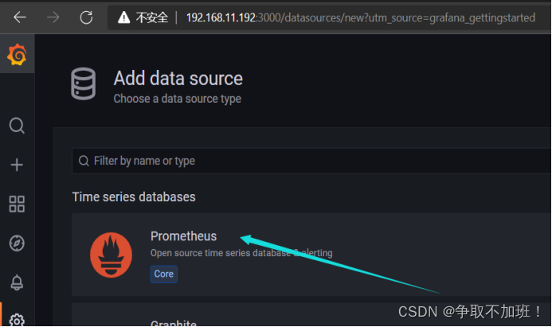


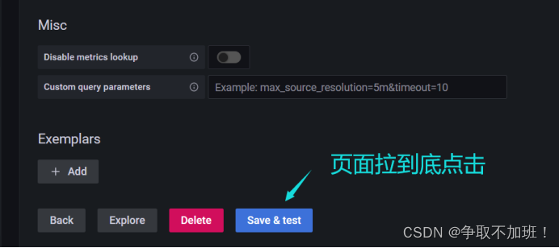

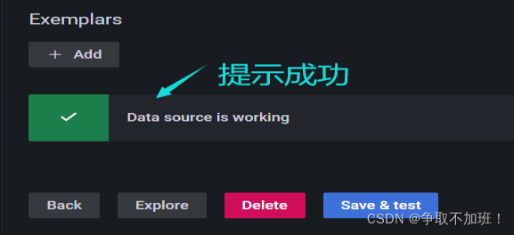

此时，虽然grafana收集到了数据，但怎么显示它,仍然是个问题，grafana支持自定 义显示信息,不过要自定义起来非常麻烦，不过好在，grafana官方为我们提供了- -些模板，来供我们使用。

官方模板下载地址  

https://grafana.com/grafana/dashboards/


选中一款模板通过JSON文件使用模板


下载完成之后，来到grafana控制台


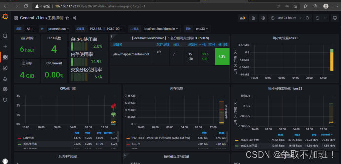