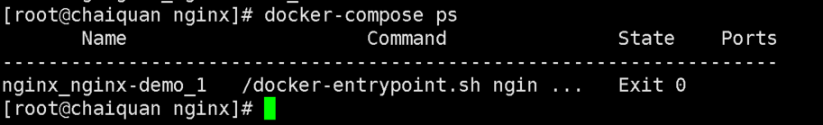
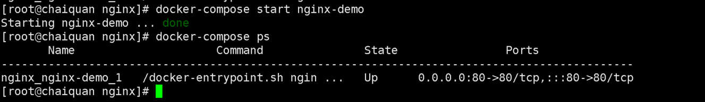
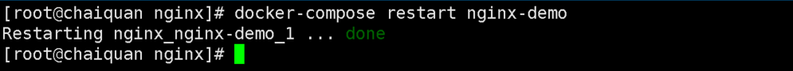
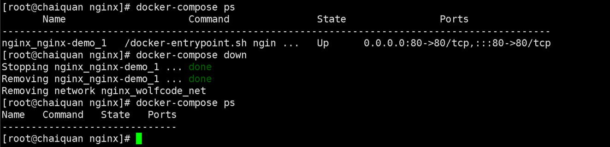

# 容器编排

**是什么？**

```
容器编排：就是针对容器生命周期的管理，对容器的生命周期进行更快速方便的方式进行管理
```

**为什么需要？**

```
依赖管理，当一个容器必须在另一个容器运行完成后，才能运行时，就需要进行依赖管理

副本数控制，容器有时候也需要集群，快的对容器集群进行弹性伸缩

配置共享，通过配置文件统一描述需要运行的服务相关信息，自动化的解析配置内容，并构建对应的服务
```


## Docker Compose(单机)

### Compose 简介

Compose 是用于定义和运行多容器 Docker 应用程序的工具。通过 Compose，您可以使用 YML 文件来配置应用程序需要的所有服务。然后，使用一个命令，就可以从 YML 文件配置中创建并启动所有服务。

### Compose 安装

```shell
sudo curl -L "http://mirrors.aliyun.com/docker-toolbox/linux/compose/1.21.2/docker-compose-$(uname -s)-$(uname -m)" -o /usr/local/bin/docker-compose
```

将可执行权限应用于二进制文件：

```shell
sudo chmod +x /usr/local/bin/docker-compose
```

创建软链：

```shell
sudo ln -s /usr/local/bin/docker-compose /usr/bin/docker-compose
```

测试是否安装成功：

```shell
docker-compose --version
```

**注意**： 对于 alpine，需要以下依赖包： py-pip，python-dev，libffi-dev，openssl-dev，gcc，libc-dev，和 make。


### 配置文件

#### 版本简述

```
docker-compose 的 api 版本与大版本一致，compose 版本与 docker 版本之间存在一定关联

compose 版本				docker 版本
​	3.4					17.09.0+
​	3.3					17.06.0+
​	3.2					17.04.0+
​	3.1					1.13.1+
​	3.0					1.13.0+
​	2.3					17.06.0+
​	2.2					1.13.0+

https://docs.docker.com/compose/compose-file/compose-file-v2/
```

#### 服务 services

```
需要运行的容器配置，可以理解为原先用 docker run 命令后面跟的一系列配置信息，都陪在这个下面
```

#### 网络 networks

```
docker-compose 公共自定义网络管理，配置好以后，可以直接在 services 中引用该网络配置，这个配置可以多个 service 使用
```

#### 数据卷 volumes

```
docker-compose 下的统一数据卷管理，可以给多个 service 使用
```

**事例**

```
version: "2.1"
services:
  #这是其中一个services配置
  nginx-demo:
    image: "nginx"
    restart: "always"
    networks: 
      - wolfcode_net
    volumes:
      - /www/nginx:/usr/share/nginx/html
    environment:
      APP_ENV: dev
    dns:
      - 114.114.114.114

networks:
  wolfcode_net:
    driver: bridge
    ipam:
      driver: default
      config: 
        - subnet: 172.16.233.0/24
          gateway: 172.16.233.1

#volumes:
#  wolfcode_volumes:
#    - /www/nginx:/usr/share/nginx/html

```


### 常用命令

#### 验证yml格式是否正确

```
docker-compose config
```

这样表示验证通过


#### 创建容器

```
#将当前目录下的yml文件把services下面所有服务都创建出来
docker-compose create

#将当前目录下的yml文件把services下面名为nginx-demo服务创建出来
docker-compose create nginx-demo
```


创建出来的容器状态为退出



#### 创建并启动容器

```
#将当前目录下的yml文件把services下面所有服务都启动起来
docker-compose up -d

#将当前目录下的yml文件把services下面名为nginx-demo服务启动起来
docker-compose up -d nginx-demo
```

启动时发现依赖nginx_wolfcode_net网络，所以启动时自动创建了起来


#### 查看启动的容器

```
dockerps
```

但是发现启动的容器没进行80端口的暴露，所以在yml文件里面加入端口暴露


##### 重新读取yml配置

```
docker-compose up -d nginx-demo
```


#### 停止容器

```
docker-composr stop nginx-demo
```


#### 启动容器

```
docker-compose start nginx-demo
```



#### 重新启动容器

```
docker-compose restart nginx
```



#### 停止并删除容器

```
docker-compose down
```



#### 启动多个相同容器

**这时不能指定名字和固定暴露出来的窗口**

```
docker-compose scale nginx-demo=3
```


#### 构建镜像

```
docker-compose build
```

因为是基于yml文件内写的是基于nginx镜像启动起来所以build时跳过构建了

