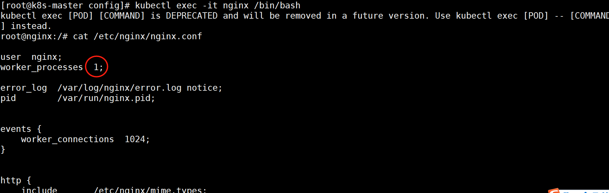
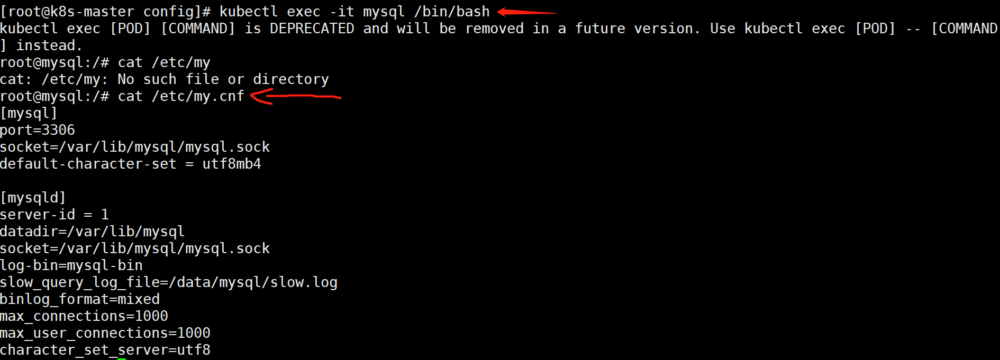
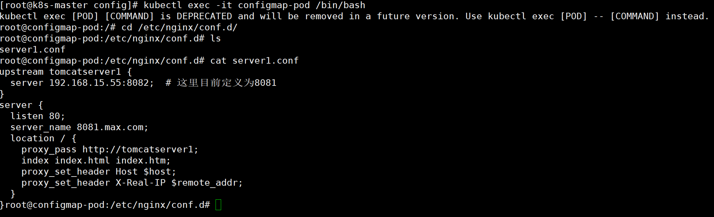
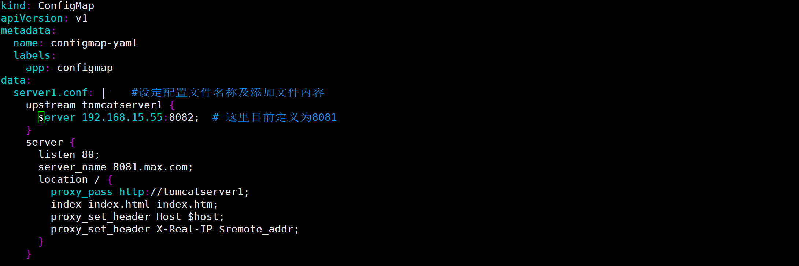

# **ConfigMap介绍**

```shell
ConfigMap 与 Secret 类似，用来存储配置文件的kubernetes资源对象，所有的配置内容都存储在etcd中。
```


与 Secret 的区别：

```shell
ConfigMap 保存的是不需要加密的、应用所需的配置信息。

ConfigMap 的用法几乎与 Secret 完全相同：可以使用 kubectl create configmap 从文件或者目录创建 ConfigMap，也可以直接编写 ConfigMap 对象的 YAML 文件。
```


### **创建ConfigMap**

```shell
创建ConfigMap的方式有4种：

命令行方式
方式1：通过直接在命令行中指定configmap参数创建，即--from-literal
方式2：通过指定文件创建，即将一个配置文件创建为一个ConfigMap，--from-file=<文件>
方式3：通过指定目录创建，即将一个目录下的所有配置文件创建为一个ConfigMap，--from-file=<目录>
方式4：事先写好标准的configmap的yaml文件，然后kubectl create -f 创建
```


**1.1 通过命令行参数--from-literal创建**

创建命令：

```shell
[root@kub-k8s-master prome]# kubectl create configmap test-configmap --from-literal=user=admin --from-literal=pass=1122334
```


结果如下面的data内容所示：

```shell
[root@kub-k8s-master prome]# kubectl get configmap test-configmap -o yaml
```


**1.2 通过指定文件创建**

编辑配置文件app.properties内容如下：

```shell
[root@kub-k8s-master prome]# vim app.properties
property.1 = value-1
property.2 = value-2
property.3 = value-3
property.4 = value-4
[mysqld]
!include /home/wing/mysql/etc/mysqld.cnf
port = 3306
socket = /home/wing/mysql/tmp/mysql.sock
pid-file = /wing/mysql/mysql/var/mysql.pid
basedir = /home/mysql/mysql
datadir = /wing/mysql/mysql/var
```


创建（可以有多个--from-file）：

```shell
[root@kub-k8s-master prome]# kubectl create configmap test-config2 --from-file=app.properties 
```


结果如下面data内容所示：

```shell
[root@kub-k8s-master prome]# kubectl get configmap test-config2 -o yaml
```


通过指定文件创建时，configmap会创建一个key/value对，key是文件名，value是文件内容。


**1.3 指定目录创建**

configs 目录下的config-1和config-2内容如下所示：

```shell
[root@kub-k8s-master prome]# mkdir config
[root@kub-k8s-master prome]# cd config/
[root@kub-k8s-master config]# vim config1
aaa
bbb
c=d
[root@kub-k8s-master config]# vim config2
eee
fff
h=k
```


创建：

```shell
[root@kub-k8s-master config]# cd ..
[root@kub-k8s-master prome]# kubectl create configmap test-config3 --from-file=./config
```


结果下面data内容所示：

```shell
[root@kub-k8s-master prome]# kubectl get configmap test-config3 -o yaml
```

指定目录创建时，configmap内容中的各个文件会创建一个key/value对，**key是文件名，value是文件内容。**


**1.4 通过事先写好configmap的标准yaml文件创建**

yaml文件内容如下： 注意其中一个key的value有多行内容时的写法

```shell
[root@kub-k8s-master prome]# vim configmap.yaml
---
apiVersion: v1
kind: ConfigMap
metadata:
  name: test-config4
  namespace: default
data:
  cache_host: memcached-gcxt
  cache_port: "11211"
  cache_prefix: gcxt
  my.cnf: |
   [mysqld]
   log-bin = mysql-bin
   haha = hehe
```


创建：


```shell
[root@kub-k8s-master prome]# kubectl apply -f configmap.yaml 
```


结果如下面data内容所示：


```shell
[root@kub-k8s-master prome]# kubectl get configmap test-config4 -o yaml
```


查看configmap的详细信息：


```shell
[root@kub-k8s-master prome]# kubectl describe configmap  test-config4
```


### **使用ConfigMap**

```shell
使用ConfigMap有三种方式，一种是通过环境变量的方式，直接传递pod，另一种是通过在pod的命令行下运行的方式，第三种是使用volume的方式挂载入到pod内
```


示例ConfigMap文件：

```shell
[root@kub-k8s-master prome]# vim config-map.yml
---
apiVersion: v1
kind: ConfigMap
metadata:
  name: config-map
  namespace: default
data:
  special.how: very
  special.type: charm  

创建  
[root@kub-k8s-master prome]# kubectl apply -f config-map.yml
```


**2.1 通过环境变量使用**

(1) 使用valueFrom、configMapKeyRef、name、key指定要用的key:

```shell
[root@kub-k8s-master prome]# vim testpod.yml
---
apiVersion: v1
kind: Pod
metadata:
  name: dapi-test-pod
spec:
  containers:
    - name: test-container
      image: daocloud.io/library/nginx
      env:   #专门在容器里面设置变量的关键字
        - name: SPECIAL_LEVEL_KEY   #这里的-name,是容器里设置的新变量的名字
          valueFrom:
            configMapKeyRef:
              name: config-map   #这里是来源于哪个configMap
              key: special.how      #configMap里的key
        - name: SPECIAL_TYPE_KEY
          valueFrom:
            configMapKeyRef:
              name: config-map
              key: special.type
  restartPolicy: Never

创建pod
[root@kub-k8s-master prome]# kubectl apply -f testpod.yml 
pod/dapi-test-pod created
```


测试：


```shell
[root@kub-k8s-master prome]# kubectl exec -it dapi-test-pod /bin/bash
root@dapi-test-pod:/# echo $SPECIAL_TYPE_KEY
charm
```


**(2) 通过envFrom、configMapRef、name使得configmap中的所有key/value对儿  都自动变成环境变量：**

```shell
[root@kub-k8s-master prome]# kubectl delete -f testpod.yml 
[root@kub-k8s-master prome]# cp testpod.yml testpod.yml.bak
[root@kub-k8s-master prome]# vim testpod.yml
---
apiVersion: v1
kind: Pod
metadata:
 name: dapi-test-pod
spec:
 containers:
   - name: test-container
     image: daocloud.io/library/nginx
     envFrom:
     - configMapRef:
         name: config-map
```


这样容器里的变量名称直接使用configMap里的key名：

```shell
[root@kub-k8s-master prome]# kubectl apply -f testpod.yml
pod/dapi-test-pod created.
[root@kub-k8s-master prome]# kubectl exec -it dapi-test-pod /bin/bash
root@dapi-test-pod:/# env
HOSTNAME=dapi-test-pod
NJS_VERSION=0.3.3
NGINX_VERSION=1.17.1
KUBERNETES_PORT_443_TCP_PROTO=tcp
KUBERNETES_PORT_443_TCP_ADDR=10.96.0.1
PKG_RELEASE=1~stretch
KUBERNETES_PORT=tcp://10.96.0.1:443
PWD=/
special.how=very
HOME=/root
KUBERNETES_SERVICE_PORT_HTTPS=443
KUBERNETES_PORT_443_TCP_PORT=443
KUBERNETES_PORT_443_TCP=tcp://10.96.0.1:443
TERM=xterm
SHLVL=1
KUBERNETES_SERVICE_PORT=443
PATH=/usr/local/sbin:/usr/local/bin:/usr/sbin:/usr/bin:/sbin:/bin
special.type=charm
KUBERNETES_SERVICE_HOST=10.96.0.1
_=/usr/bin/env
```


**2.2 作为volume挂载使用**

(1) 把1.4中test-config4所有key/value挂载进来：

```shell
[root@kub-k8s-master prome]# kubectl delete -f testpod.yml

[root@kub-k8s-master prome]# vim volupod.yml
---
apiVersion: v1
kind: Pod
metadata:
  name: nginx-configmap
spec:
  containers:
  - name: nginx-configmap
    image: daocloud.io/library/nginx
    volumeMounts:
    - name: config-volume4
      mountPath: "/tmp/config4"
  volumes:
  - name: config-volume4
    configMap:
      name: test-config4
          
创建pod
[root@kub-k8s-master prome]# kubectl apply -f volupod.yml 
pod/nginx-configmap created
```


进入容器中/tmp/config4查看：


```shell
[root@kub-k8s-master prome]#  kubectl  exec -it nginx-configmap /bin/bash
root@nginx-configmap:/# ls /tmp/config4/
cache_host  cache_port	cache_prefix  my.cnf
root@nginx-configmap:/# cat /tmp/config4/cache_host 
memcached-gcxt
root@nginx-configmap:/#
```


可以看到，在config4文件夹下以每一个key为文件名value为值创建了多个文件。

### ConfigMap实际Nginx/Mysql应用

#### subPath的使用

在Linux中，将目录A挂载到目录B，则目录B原有的文件都会被目录A下的文件覆盖。

那么在k8s中，如何将configmap挂载到容器中某个目录的文件中呢？答案是使用subPath。

subPath可以将configMap和secret作为文件挂载到容器中而不覆盖挂载目录下的文件。

话不多说，直接看一个例子。

```shell
[root@k8s-master config]# pwd
/root/config
[root@k8s-master config]# ls conf
my.cnf  nginx.conf

[root@k8s-master config]# cat conf/my.cnf 
[mysql]
port=3306
socket=/var/lib/mysql/mysql.sock
default-character-set = utf8mb4

[mysqld]
server-id = 1
datadir=/var/lib/mysql
socket=/var/lib/mysql/mysql.sock
log-bin=mysql-bin
slow_query_log_file=/data/mysql/slow.log
binlog_format=mixed
max_connections=1000
max_user_connections=1000
character_set_server=utf8

[root@k8s-master config]# cat conf/nginx.conf 
user  nginx;
worker_processes  1;

error_log  /var/log/nginx/error.log notice;
pid        /var/run/nginx.pid;


events {
    worker_connections  1024;
}


http {
    include       /etc/nginx/mime.types;
    default_type  application/octet-stream;

    log_format  main  '$remote_addr - $remote_user [$time_local] "$request" '
                      '$status $body_bytes_sent "$http_referer" '
                      '"$http_user_agent" "$http_x_forwarded_for"';

    access_log  /var/log/nginx/access.log  main;

    #sendfile        on;
    #tcp_nopush     on;

    keepalive_timeout  65;

    #gzip  on;

    include /etc/nginx/conf.d/*.conf;
}
[root@k8s-master config]# kubectl create configmap nginx-mysql --from-file=./conf
[root@k8s-master config]# cat testpod.yml 
---
apiVersion: v1
kind: Pod
metadata:
  name: nginx
spec:
  containers:
  - name: nginx
    image: daocloud.io/library/nginx
    volumeMounts:
    - name: nginx
      mountPath: /etc/nginx/nginx.conf
      subPath: nginx.conf
  volumes:
   - name: nginx
     configMap:
       name: nginx-mysql
       items:
       - key: nginx.conf
         path: nginx.conf
---
apiVersion: v1
kind: Pod
metadata:
  name: mysql
spec:
  containers:
  - name: mysql
    image: mysql:5.7
    env:
     - name: MYSQL_ROOT_PASSWORD
       valueFrom:
        secretKeyRef:
         name: mysql-user-pass
         key: password
    volumeMounts:
    - name: mysql
      mountPath: /etc/my.cnf
      subPath: my.cnf
  volumes:
   - name: mysql
     configMap:
       name: nginx-mysql
       items:
       - key: my.cnf    # 可以理解为原文件名称
         path: my.cnf   # 修改之后的文件名
[root@k8s-master config]# kubectl apply -f testpod.yml
```







#### configmap热更新

\#configmap的热更新


 1>使用该 ConfigMap 挂载的 Env 不会同步更新

 2>使用该 ConfigMap 挂载的 Volume 中的数据需要一段时间（实测大概10秒）才能同步更新

而且必须是yaml文件的方式创建出来的ConfigMap才可以；


ps： 当ConfigMap以数据卷的形式挂载进Pod时，更新ConfigMap（或删掉重建ConfigMap），Pod内挂载的配置信息会热更新，但使用环境变量方式加载到pod，则不会自动更新（ENV 是在容器启动的时候注入的，启动之后 kubernetes 就不会再改变环境变量的值）。且同一个 namespace 中的 pod 的环境变量是不断累加的


```shell
[root@k8s-master configmap]# pwd
/root/configmap

[root@k8s-master configmap]# cat cm.yaml 
#编写资源清单
kind: ConfigMap
apiVersion: v1
metadata:
  name: configmap-yaml
  labels:
    app: configmap
data:
  server1.conf: |-   #设定配置文件名称及添加文件内容
    upstream tomcatserver1 {
      server 192.168.15.55:8081;  # 这里目前定义为8081
    }
    server {
      listen 80;
      server_name 8081.max.com;
      location / {
        proxy_pass http://tomcatserver1;
        index index.html index.htm;
        proxy_set_header Host $host;
        proxy_set_header X-Real-IP $remote_addr;
      }
    }
---
kind: Pod
apiVersion: v1
metadata:
  name: configmap-pod
  labels:
    app: configmap-pod
spec:
  containers:
    - name: nginx
      image: daocloud.io/library/nginx:latest
      imagePullPolicy: IfNotPresent
      ports:
        - containerPort: 80
      volumeMounts:
        - mountPath: /etc/nginx/conf.d
          name: conf-name
  volumes:
    - name: conf-name
      configMap:
        name: configmap-yaml
        items:
          - key: server1.conf
            path: server1.conf
[root@k8s-master configmap]# kubectl apply -f cm.yaml
```


```shell
再次进入pod中查看，是否会更新
[root@k8s-master configmap]# kubectl exec -it configmap-pod /bin/bash
```


```shell
vim cm.yml
```

```shell
kind: ConfigMap
apiVersion: v1
metadata:
  name: configmap-yaml
  labels:
    app: configmap
data:
  server1.conf: |-   #设定配置文件名称及添加文件内容
    upstream tomcatserver1 {
      server 192.168.15.55:8082;  # 这里目前定义为8081
    }
    server {
      listen 80;
      server_name 8081.max.com;
      location / {
        proxy_pass http://tomcatserver1;
        index index.html index.htm;
        proxy_set_header Host $host;
        proxy_set_header X-Real-IP $remote_addr;
      }
    }

```

```shell
vim nginx.yml
```

```shell
---
kind: Pod
apiVersion: v1
metadata:
  name: configmap-pod
  labels:
    app: configmap-pod
spec:
  containers:
    - name: nginx
      image: daocloud.io/library/nginx:latest
      imagePullPolicy: IfNotPresent
      ports:
        - containerPort: 80
      volumeMounts:
        - mountPath: /etc/nginx/conf.d
          name: conf-name
  volumes:
    - name: conf-name
      configMap:
        name: configmap-yaml
        items:
          - key: server1.conf
            path: server1.conf

```

```
kubectl  apply -f cm.yml
```

```shell
kubectl apply -f nginx.yml
```

```shell
kubectl exec -it configmap-pod /bin/bash
```



```shell
vim cm.yml  ##修改端口
```



```
kubectl  apply -f cm.yml
```

```shell
kubectl exec -it configmap-pod /bin/bash
```

```
再次查看端口就改变了
```

