容器编排之战

```shell
Kubernetes是谷歌严格保密十几年的秘密武器—Borg的一个开源版本，是Docker分布式系统解决方案。2014年由Google公司启动
```

# **Kubernetes核心概念**

k8s-master  负责任务调度，控制节点

k8s-node1  承载运行pod(容器)

k8s-node2  承载运行pod(容器)

Master

```shell
Master主要负责资源调度，控制副本，和提供统一访问集群的入口。--核心节点也是管理节点
```


Node

```shell
Node是Kubernetes集群架构中运行Pod的服务节点。Node是Kubernetes集群操作的单元，用来承载被分配Pod的运行，是Pod运行的宿主机，由Master管理，并汇报容器状态给Master，同时根据Master要求管理容器生命周期。
```


Node IP

```shell
   Node节点的IP地址，是Kubernetes集群中每个节点的物理网卡的IP地址，是真实存在的物理网络，所有属于这个网络的服务器之间都能通过这个网络直接通信；
```


Pod

```shell
Pod直译是豆荚，可以把容器想像成豆荚里的豆子，把一个或多个关系紧密的豆子包在一起就是豆荚（一个Pod）。在k8s中我们不会直接操作容器，而是把容器包装成Pod再进行管理运行于Node节点上， 若干相关容器的组合。Pod内包含的容器运行在同一宿主机上，使用相同的网络命名空间、IP地址和端口，能够通过localhost进行通信。Pod是k8s进行创建、调度和管理的最小单位，它提供了比容器更高层次的抽象，使得部署和管理更加灵活。一个Pod可以包含一个容器或者多个相关容器。

   Pod 就是 k8s 集群里的"应用"；而一个平台应用，可以由多个容器组成。
```


pause容器

```plain
每个Pod中都有一个pause容器，pause容器做为Pod的网络接入点，Pod中其他的容器会使用容器映射模式启动并接入到这个pause容器。

属于同一个Pod的所有容器共享网络的namespace。

如果Pod所在的Node宕机，会将这个Node上的所有Pod重新调度到其他节点上
```


Pod Volume

```shell
Docker Volume对应Kubernetes中的Pod Volume；

数据卷，挂载宿主机文件、目录或者外部存储到Pod中，为应用服务提供存储，也可以解决Pod中容器之间共享数据。
```


资源限制：

   每个Pod可以设置限额的计算机资源有CPU和Memory；


Event

```shell
    是一个事件记录，记录了事件最早产生的时间、最后重复时间、重复次数、发起者、类型，以及导致此事件的原因等信息。Event通常关联到具体资源对象上，是排查故障的重要参考信息
```


Pod IP

```shell
   Pod的IP地址，是Docker Engine根据docker0网桥的IP地址段进行分配的，通常是一个虚拟的二层网络，位于不同Node上的Pod能够彼此通信，需要通过Pod IP所在的虚拟二层网络进行通信，而真实的TCP流量则是通过Node IP所在的物理网卡流出的。
```


Namespace

```shell
命名空间将资源对象逻辑上分配到不同Namespace，可以是不同的项目、用户等区分管理，并设定控制策略，从而实现多租户。命名空间也称为虚拟集群。
```


Replica Set

```shell
确保任何给定时间指定的Pod副本数量，并提供声明式更新等功能。
```


Deployment 

```shell
Deployment是一个更高层次的API/资源对象，它管理ReplicaSets和Pod，并提供声明式更新等功能。

官方建议使用Deployment管理ReplicaSets，而不是直接使用ReplicaSets，这就意味着可能永远不需要直接操作ReplicaSet对象，因此Deployment将会是使用最频繁的资源对象。
```


RC-Replication Controller

```shell
Replication  Controller用来管理Pod的副本，保证集群中存在指定数量的Pod副本。集群中副本的数量大于指定数量，则会停止指定数量之外的多余pod数量，反之，则会启动少于指定数量个数的容器，保证数量不变。Replication  Controller是实现弹性伸缩、动态扩容和滚动升级的核心。
```


部署和升级Pod，声明某种Pod的副本数量在任意时刻都符合某个预期值；


​    • Pod期待的副本数；

​    • 用于筛选目标Pod的Label Selector；

​    • 当Pod副本数量小于预期数量的时候，用于创建新Pod的Pod模板（template）；


Service

Deployment 副本：3 (标签选择器 app: tomcat)

tomcat pod1  app: tomcat

tomcat pod2  app: tomcat

tomcat pod3  app: tomcat

```shell
Service定义了Pod的逻辑集合和访问该集合的策略，是真实服务的抽象。Service提供了一个统一的服务访问入口以及服务代理和发现机制，用户不需要了解后台Pod是如何运行。

一个service定义了访问pod的方式，就像单个固定的IP地址和与其相对应的DNS名之间的关系。
```


   Service其实就是我们经常提起的微服务架构中的一个"微服务"，通过分析、识别并建模系统中的所有服务为微服务——Kubernetes Service，最终我们的系统由多个提供不同业务能力而又彼此独立的微服务单元所组成，服务之间通过TCP/IP进行通信，从而形成了我们强大而又灵活的弹性网络，拥有了强大的分布式能力、弹性扩展能力、容错能力；


如图示，每个Pod都提供了一个独立的Endpoint（Pod IP+ContainerPort）以被客户端访问，多个Pod副本组成了一个集群来提供服务，一般的做法是部署一个负载均衡器来访问它们，为这组Pod开启一个对外的服务端口如8000，并且将这些Pod的Endpoint列表加入8000端口的转发列表中，客户端可以通过负载均衡器的对外IP地址+服务端口来访问此服务。运行在Node上的kube-proxy其实就是一个智能的软件负载均衡器，它负责把对Service的请求转发到后端的某个Pod实例上，并且在内部实现服务的负载均衡与会话保持机制。Service不是共用一个负载均衡器的IP地址，而是每个Servcie分配一个全局唯一的虚拟IP地址，这个虚拟IP被称为Cluster IP。


Cluster IP

```shell
Service的IP地址,特性： 

仅仅作用于Kubernetes Servcie这个对象，并由Kubernetes管理和分配IP地址；

无法被Ping，因为没有一个"实体网络对象"来响应；

只能结合Service Port组成一个具体的通信端口；

Node IP网、Pod IP网域Cluster IP网之间的通信，采用的是Kubernetes自己设计的一种编程方式的特殊的路由规则，与IP路由有很大的不同
```


Label

Kubernetes中的任意API对象都是通过Label进行标识，Label的实质是一系列的K/V键值对。Label是Replication Controller和Service运行的基础，二者通过Label来进行关联Node上运行的Pod。


   一个label是一个被附加到资源上的键/值对，譬如附加到一个Pod上，为它传递一个用户自定的并且可识别的属性.Label还可以被应用来组织和选择子网中的资源


Endpoint（podIP+ContainerPort）

标识服务进程的访问点；

注：Node、Pod、Replication Controller和Service等都可以看作是一种"资源对象"，几乎所有的资源对象都可以通过Kubernetes提供的kubectl工具执行增、删、改、查等操作并将其保存在etcd中持久化存储。

# **Kubernetes架构和组件**

架构:


主从分布式架构，Master/Node


组件:

```shell
Kubernetes Master：

集群控制节点，负责整个集群的管理和控制，基本上Kubernetes所有的控制命令都是发给它，它来负责具体的执行过程，我们后面所有执行的命令基本都是在Master节点上运行的；

包含如下组件:
1.Kubernetes API Server
作为Kubernetes系统的入口，其封装了核心对象的增删改查操作，以RESTful API接口方式提供给外部客户和内部组件调用。维护的REST对象持久化到Etcd中存储。

2.Kubernetes Scheduler
为新建立的Pod进行节点(node)选择(即分配机器)，负责集群的资源调度。组件抽离，可以方便替换成其他调度器。

3.Kubernetes Controller
负责执行各种控制器，目前已经提供了很多控制器来保证Kubernetes的正常运行。
   - Replication Controller
       管理维护Replication Controller，关联Replication Controller和Pod，保证Replication Controller定义的副本数量与实际运行Pod数量一致。

  - Deployment Controller
       管理维护Deployment，关联Deployment和Replication  Controller，保证运行指定数量的Pod。当Deployment更新时，控制实现Replication  Controller和　Pod的更新。

   - Node Controller
      管理维护Node，定期检查Node的健康状态，标识出(失效|未失效)的Node节点。

   - Namespace Controller
      管理维护Namespace，定期清理无效的Namespace，包括Namesapce下的API对象，比如Pod、Service等。

   - Service Controller
      管理维护Service，提供负载以及服务代理。

   - EndPoints Controller
      管理维护Endpoints，关联Service和Pod，创建Endpoints为Service的后端，当Pod发生变化时，实时更新Endpoints。

   - Service Account Controller
      管理维护Service Account，为每个Namespace创建默认的Service Account，同时为Service Account创建Service Account Secret。

   - Persistent Volume Controller
      管理维护Persistent Volume和Persistent Volume  Claim，为新的Persistent Volume Claim分配Persistent Volume进行绑定，为释放的Persistent  Volume执行清理回收。

   - Daemon Set Controller
      管理维护Daemon Set，负责创建Daemon Pod，保证指定的Node上正常的运行Daemon Pod。

　　- Job Controller
      管理维护Job，为Jod创建一次性任务Pod，保证完成Job指定完成的任务数目

   - Pod Autoscaler Controller
      实现Pod的自动伸缩，定时获取监控数据，进行策略匹配，当满足条件时执行Pod的伸缩动作。

 

Kubernetes Node：
除了Master，Kubernetes集群中的其他机器被称为Node节点，Node节点才是Kubernetes集群中的工作负载节点，每个Node都会被Master分配一些工作负载（Docker容器），当某个Node宕机，其上的工作负载会被Master自动转移到其他节点上去；

包含如下组件:
　　1.Kubelet
　　　　负责管控容器，Kubelet会从Kubernetes API Server接收Pod的创建请求，启动和停止容器，监控容器运行状态并汇报给Kubernetes API Server。

　　2.Kubernetes Proxy
　　　　负责为Pod创建代理服务，Kubernetes Proxy会从Kubernetes API  Server获取所有的Service信息，并根据Service的信息创建代理服务，实现Service到Pod的请求路由和转发，从而实现Kubernetes层级的虚拟转发网络。

　　3.Docker Engine（docker），Docker引擎，负责本机的容器创建和管理工作；  
　　
　　4.Flanneld网络插件
      

数据库

etcd数据库，可以部署到master、node上，推荐独立部署
分布式键值存储系统。用于保存集群状态数据，比如Pod、Service等对象信息
```


docker只是k8s支持的底层容器的一种，k8s还支持另外一种容器技术，名为rocket。


# **常用镜像仓库**


daocloud的docker镜像库:


   daocloud.io/library


docker-hub的k8s镜像库：


   mirrorgooglecontainers


aliyun的k8s镜像库：


```shell
registry.cn-hangzhou.aliyuncs.com/google-containers
```


aliyun的docker镜像库web页面：


   https://cr.console.aliyun.com/cn-hangzhou/images


google的镜像库web页面：


   https://console.cloud.google.com/gcr/images/google-containers?project=google-containers


# Kubernetes集群部署方式


方式1. minikube

```shell
Minikube是一个工具，可以在本地快速运行一个单点的Kubernetes，尝试Kubernetes或日常开发的用户使用。不能用于生产环境。

官方地址：https://kubernetes.io/docs/setup/minikube/
```


方式2. kubeadm

```shell
Kubeadm也是一个工具，提供kubeadm init和kubeadm join，用于快速部署Kubernetes集群。

官方地址：https://kubernetes.io/docs/reference/setup-tools/kubeadm/kubeadm/
```


方式3. 直接使用epel-release yum源，缺点就是版本较低 1.5


方式4. 二进制包


从官方下载发行版的二进制包，手动部署每个组件，组成Kubernetes集群。

```shell
官方也提供了一个互动测试环境供大家测试：https://kubernetes.io/cn/docs/tutorials/kubernetes-basics/cluster-interactive/
```


二进制方式部署k8s集群

```shell
目标任务：

1、Kubernetes集群部署架构规划

2、部署Etcd数据库集群

3、在Node节点安装Docker

4、部署Flannel网络插件

5、在Master节点部署组件（api-server,schduler,controller-manager）

6、在Node节点部署组件（kubelet,kube-proxy）

7、查看集群状态

8、运行一个测试示例

9、部署Dashboard（Web UI） 可选
```


1、Kubernetes集群部署架构规划


```shell
操作系统：
CentOS7.4_x64

软件版本：
 Docker	19.09.0-ce
 Kubernetes	1.13
```


```shell
服务器角色、IP、组件：
k8s-master1	     
192.168.246.162	kube-apiserver，kube-controller-manager，kube-scheduler，etcd
k8s-master2	     
192.168.246.163	kube-apiserver，kube-controller-manager，kube-scheduler，etcd
k8s-node1	        
192.168.246.164	kubelet，kube-proxy，docker，flannel，etcd
k8s-node2	        
192.168.246.165	kubelet，kube-proxy，docker，flannel
Master负载均衡	  
192.168.246.166	    LVS
镜像仓库	             
10.206.240.188	Harbor
机器配置要求：
3G  
主机名称 必须改  必须相互解析
[root@k8s-master1 ~]# vim /etc/hosts
192.168.246.162 k8s-master1
192.168.246.163 k8s-master2
192.168.246.164 k8s-node1
192.168.246.165 k8s-node2
192.168.246.166 lvs-server
关闭防火墙和selinux
```


负载均衡器：


```shell
云环境：
可以采用slb

非云环境：
主流的软件负载均衡器，例如LVS、HAProxy、Nginx
```


这里采用Nginx作为apiserver负载均衡器，架构图如下：


```shell
2.安装nginx使用stream模块作4层反向代理配置如下：
user  nginx;
worker_processes  4;

error_log  /var/log/nginx/error.log warn;
pid        /var/run/nginx.pid;

events {
   worker_connections  1024;
}

stream {

   log_format  main  '$remote_addr $upstream_addr - [$time_local] $status $upstream_bytes_sent';
   access_log  /var/log/nginx/k8s-access.log  main;

   upstream k8s-apiserver {
       server 192.168.246.162:6443;
       server 192.168.246.163:6443;
   }
   server {
       listen 6443;
       proxy_pass k8s-apiserver;
   }
}
```


准备环境


```shell
三台机器,所有机器相互做解析  centos7.4
关闭防火墙和selinux

[root@k8s-master ~]# vim /etc/hosts
192.168.96.134 k8s-master
192.168.96.135 k8s-node1
192.168.96.136 k8s-node2
```


## 部署Etcd集群

使用cfssl来生成自签证书,任何机器都行，证书这块儿知道怎么生成、怎么用即可，暂且不用过多研究（这个证书随便在那台机器生成都可以。哪里用将证书拷贝到哪里就可以了。）

```shell
下载cfssl工具：下载的这些是可执行的二进制命令直接用就可以了
[root@k8s-master1 ~]# wget https://pkg.cfssl.org/R1.2/cfssl_linux-amd64
[root@k8s-master1 ~]# wget https://pkg.cfssl.org/R1.2/cfssljson_linux-amd64
[root@k8s-master1 ~]# wget https://pkg.cfssl.org/R1.2/cfssl-certinfo_linux-amd64
[root@k8s-master1 ~]# chmod +x cfssl_linux-amd64 cfssljson_linux-amd64 cfssl-certinfo_linux-amd64
[root@k8s-master1 ~]# mv cfssl_linux-amd64 /usr/local/bin/cfssl
[root@k8s-master1 ~]# mv cfssljson_linux-amd64 /usr/local/bin/cfssljson
[root@k8s-master1 ~]# mv cfssl-certinfo_linux-amd64 /usr/bin/cfssl-certinfo

生成Etcd证书:
创建以下三个文件：
[root@k8s-master1 ~]# mkdir cert
[root@k8s-master1 ~]# cd cert/
[root@k8s-master1 cert]# vim ca-config.json  #生成ca中心的
[root@k8s-master1 cert]# cat ca-config.json
{
  "signing": {
    "default": {
      "expiry": "87600h"
    },
    "profiles": {
      "www": {
         "expiry": "87600h",
         "usages": [
            "signing",
            "key encipherment",
            "server auth",
            "client auth"
        ]
      }
    }
  }
}

[root@k8s-master1 cert]# vim ca-csr.json  #生成ca中心的证书请求文件
[root@k8s-master1 cert]# cat ca-csr.json
{
    "CN": "etcd CA",
    "key": {
        "algo": "rsa",
        "size": 2048
    },
    "names": [
        {
            "C": "CN",
            "L": "Beijing",
            "ST": "Beijing"
        }
    ]
}

[root@k8s-master1 cert]# vim server-csr.json #生成服务器的证书请求文件
[root@k8s-master1 cert]# cat server-csr.json
{
    "CN": "etcd",
    "hosts": [
    "192.168.246.162",
    "192.168.246.163",
    "192.168.246.164"
    ],
    "key": {
        "algo": "rsa",
        "size": 2048
    },
    "names": [
        {
            "C": "CN",
            "L": "BeiJing",
            "ST": "BeiJing"
        }
    ]
}

生成证书：
[root@k8s-master1 cert]# cfssl gencert -initca ca-csr.json | cfssljson -bare ca -
[root@k8s-master1 cert]# cfssl gencert -ca=ca.pem -ca-key=ca-key.pem -config=ca-config.json -profile=www server-csr.json | cfssljson -bare server
[root@k8s-master1 cert]# ls *pem
ca-key.pem  ca.pem  server-key.pem  server.pem
```


安装Etcd:
二进制包下载地址：
https://github.com/coreos/etcd/releases/tag/v3.2.12


```shell
以下部署步骤在规划的三个etcd节点操作一样，唯一不同的是etcd配置文件中的服务器IP要写当前的：
解压二进制包：
以下步骤三台机器都操作：
# wget https://github.com/etcd-io/etcd/releases/download/v3.2.12/etcd-v3.2.12-linux-amd64.tar.gz
# mkdir /opt/etcd/{bin,cfg,ssl} -p
# tar zxvf etcd-v3.2.12-linux-amd64.tar.gz
# mv etcd-v3.2.12-linux-amd64/{etcd,etcdctl} /opt/etcd/bin/

创建etcd配置文件：
# vim  /opt/etcd/cfg/etcd  
#[Member]
ETCD_NAME="etcd01"   #节点名称，各个节点不能相同
ETCD_DATA_DIR="/var/lib/etcd/default.etcd"
ETCD_LISTEN_PEER_URLS="https://192.168.246.162:2380"   #写每个节点的ip
ETCD_LISTEN_CLIENT_URLS="https://192.168.246.162:2379" #写每个节点的ip

#[Clustering]
ETCD_INITIAL_ADVERTISE_PEER_URLS="https://192.168.246.162:2380" #写每个节点的ip
ETCD_ADVERTISE_CLIENT_URLS="https://192.168.246.162:2379"  #写每个节点的ip
ETCD_INITIAL_CLUSTER="etcd01=https://192.168.246.162:2380,etcd02=https://192.168.246.164:2380,etcd03=https://192.168.246.165:2380"

ETCD_INITIAL_CLUSTER_TOKEN="etcd-cluster"
ETCD_INITIAL_CLUSTER_STATE="new"

参数解释：
* ETCD_NAME 节点名称,每个节点名称不一样
* ETCD_DATA_DIR 存储数据目录(他是一个数据库，不是存在内存的，存在硬盘中的，所有和k8s有关的信息都会存到etcd里面的)
* ETCD_LISTEN_PEER_URLS 集群通信监听地址
* ETCD_LISTEN_CLIENT_URLS 客户端访问监听地址
* ETCD_INITIAL_ADVERTISE_PEER_URLS 集群通告地址
* ETCD_ADVERTISE_CLIENT_URLS 客户端通告地址
* ETCD_INITIAL_CLUSTER 集群节点地址
* ETCD_INITIAL_CLUSTER_TOKEN 集群Token
* ETCD_INITIAL_CLUSTER_STATE 加入集群的当前状态，new是新集群，existing表示加入已有集群

systemd管理etcd：
# vim /usr/lib/systemd/system/etcd.service
[Unit]
Description=Etcd Server
After=network.target
After=network-online.target
Wants=network-online.target

[Service]
Type=notify
EnvironmentFile=/opt/etcd/cfg/etcd
ExecStart=/opt/etcd/bin/etcd \
--name=${ETCD_NAME} \
--data-dir=${ETCD_DATA_DIR} \
--listen-peer-urls=${ETCD_LISTEN_PEER_URLS} \
--listen-client-urls=${ETCD_LISTEN_CLIENT_URLS},http://127.0.0.1:2379 \
--advertise-client-urls=${ETCD_ADVERTISE_CLIENT_URLS} \
--initial-advertise-peer-urls=${ETCD_INITIAL_ADVERTISE_PEER_URLS} \
--initial-cluster=${ETCD_INITIAL_CLUSTER} \
--initial-cluster-token=${ETCD_INITIAL_CLUSTER_TOKEN} \
--initial-cluster-state=new \
--cert-file=/opt/etcd/ssl/server.pem \
--key-file=/opt/etcd/ssl/server-key.pem \
--peer-cert-file=/opt/etcd/ssl/server.pem \
--peer-key-file=/opt/etcd/ssl/server-key.pem \
--trusted-ca-file=/opt/etcd/ssl/ca.pem \
--peer-trusted-ca-file=/opt/etcd/ssl/ca.pem
Restart=on-failure
LimitNOFILE=65536

[Install]
WantedBy=multi-user.target

把刚才生成的证书拷贝到配置文件中的位置：(将master上面生成的证书scp到剩余两台机器上面)
# cd /root/cert/
# cp ca*pem server*pem /opt/etcd/ssl
直接拷贝到剩余两台etcd机器：
[root@k8s-master cert]# scp ca*pem server*pem k8s-node1:/opt/etcd/ssl
[root@k8s-master cert]# scp ca*pem server*pem k8s-node2:/opt/etcd/ssl

全部启动并设置开启启动：
# systemctl daemon-reload
# systemctl start etcd
# systemctl enable etcd

都部署完成后，三台机器都检查etcd集群状态：
# /opt/etcd/bin/etcdctl --ca-file=/opt/etcd/ssl/ca.pem --cert-file=/opt/etcd/ssl/server.pem --key-file=/opt/etcd/ssl/server-key.pem --endpoints="https://192.168.246.162:2379,https://192.168.246.164:2379,https://192.168.246.165:2379" cluster-health

member 18218cfabd4e0dea is healthy: got healthy result from https://10.206.240.111:2379
member 541c1c40994c939b is healthy: got healthy result from https://10.206.240.189:2379
member a342ea2798d20705 is healthy: got healthy result from https://10.206.240.188:2379
cluster is healthy

如果输出上面信息，就说明集群部署成功。

如果有问题第一步先看日志：/var/log/messages 或 journalctl -u etcd

报错：
Jan 15 12:06:55 k8s-master1 etcd: request cluster ID mismatch (got 99f4702593c94f98 want cdf818194e3a8c32)
解决：因为集群搭建过程，单独启动过单一etcd,做为测试验证，集群内第一次启动其他etcd服务时候，是通过发现服务引导的，所以需要删除旧的成员信息，所有节点作以下操作
[root@k8s-master1 default.etcd]# pwd
/var/lib/etcd/default.etcd
[root@k8s-master1 default.etcd]# rm -rf member/
========================================================
在Node节点安装Docker

# yum remove docker \
docker-client \
docker-client-latest \
docker-common \
docker-latest \
docker-latest-logrotate \
docker-logrotate \
docker-selinux \
docker-engine-selinux \
docker-engine

# yum install -y yum-utils device-mapper-persistent-data lvm2 git
# yum-config-manager --add-repo http://mirrors.aliyun.com/docker-ce/linux/centos/docker-ce.repo
# yum install docker-ce -y

启动设置开机自启

# curl -sSL https://get.daocloud.io/daotools/set_mirror.sh | sh -s http://bc437cce.m.daocloud.io   #配置加速器
```


## 部署Flannel网络插件

```shell
Flannel要用etcd存储自身一个子网信息，所以要保证能成功连接Etcd，写入预定义子网段：
在node节点部署，如果没有在master部署应用，那就不要在master部署flannel，他是用来给所有的容器用来通信的。
```


```shell
[root@k8s-master ~]# scp -r cert/ k8s-node1:/root/  #将生成的证书copy到剩下的机器上面
[root@k8s-master ~]# scp -r cert/ k8s-node2:/root/
[root@k8s-master ~]# cd cert/
/opt/etcd/bin/etcdctl \
--ca-file=ca.pem --cert-file=server.pem --key-file=server-key.pem \
--endpoints="https://192.168.246.162:2379,https://192.168.246.164:2379,https://192.168.246.165:2379" \
set /coreos.com/network/config  '{ "Network": "172.17.0.0/16", "Backend": {"Type": "vxlan"}}'

========================================================================================
#注：以下部署步骤在规划的每个node节点都操作。
下载二进制包：
# wget https://github.com/coreos/flannel/releases/download/v0.10.0/flannel-v0.10.0-linux-amd64.tar.gz
# tar zxvf flannel-v0.10.0-linux-amd64.tar.gz
# mkdir -pv /opt/kubernetes/bin
# mv flanneld mk-docker-opts.sh /opt/kubernetes/bin

配置Flannel：
# mkdir -p /opt/kubernetes/cfg/
# vim /opt/kubernetes/cfg/flanneld
# cat /opt/kubernetes/cfg/flanneld
FLANNEL_OPTIONS="--etcd-endpoints=https://192.168.246.162:2379,https://192.168.246.164:2379,https://192.168.246.165:2379 -etcd-cafile=/opt/etcd/ssl/ca.pem -etcd-certfile=/opt/etcd/ssl/server.pem -etcd-keyfile=/opt/etcd/ssl/server-key.pem"

systemd管理Flannel：
# vim /usr/lib/systemd/system/flanneld.service
# cat /usr/lib/systemd/system/flanneld.service
[Unit]
Description=Flanneld overlay address etcd agent
After=network-online.target network.target
Before=docker.service

[Service]
Type=notify
EnvironmentFile=/opt/kubernetes/cfg/flanneld
ExecStart=/opt/kubernetes/bin/flanneld --ip-masq $FLANNEL_OPTIONS
ExecStartPost=/opt/kubernetes/bin/mk-docker-opts.sh -k DOCKER_NETWORK_OPTIONS -d /run/flannel/subnet.env
Restart=on-failure

[Install]
WantedBy=multi-user.target

配置Docker启动指定子网段：可以将源文件直接覆盖掉
# vim /usr/lib/systemd/system/docker.service
[Unit]
Description=Docker Application Container Engine
Documentation=https://docs.docker.com
After=network-online.target firewalld.service
Wants=network-online.target

[Service]
Type=notify
EnvironmentFile=/run/flannel/subnet.env
ExecStart=/usr/bin/dockerd $DOCKER_NETWORK_OPTIONS
ExecReload=/bin/kill -s HUP $MAINPID
LimitNOFILE=infinity
LimitNPROC=infinity
LimitCORE=infinity
TimeoutStartSec=0
Delegate=yes
KillMode=process
Restart=on-failure
StartLimitBurst=3
StartLimitInterval=60s

[Install]
WantedBy=multi-user.target

从master节点拷贝证书文件到node1和node2上：因为node1和2上没有证书，但是flanel需要证书
# mkdir -pv /opt/etcd/ssl/
# scp /opt/etcd/ssl/*  k8s-node1:/opt/etcd/ssl/

重启flannel和docker：
# systemctl daemon-reload
# systemctl start flanneld
# systemctl enable flanneld docker
# systemctl restart docker

注意：如果flannel启动不了请检查设置ip网段是否正确

检查是否生效：
[root@k8s-node1 ~]# ps -ef | grep docker
root       3632      1  1 22:19 ?        00:00:00 /usr/bin/dockerd --bip=172.17.77.1/24 --ip-masq=false --mtu=1450
# ip a
3: docker0: <NO-CARRIER,BROADCAST,MULTICAST,UP> mtu 1500 qdisc noqueue state DOWN 
    link/ether 02:42:cd:f6:c9:cc brd ff:ff:ff:ff:ff:ff
    inet 172.17.77.1/24 brd 172.17.77.255 scope global docker0
       valid_lft forever preferred_lft forever
4: flannel.1: <BROADCAST,MULTICAST,UP,LOWER_UP> mtu 1450 qdisc noqueue state UNKNOWN 
    link/ether ba:96:dc:cc:25:e0 brd ff:ff:ff:ff:ff:ff
    inet 172.17.77.0/32 scope global flannel.1
       valid_lft forever preferred_lft forever
    inet6 fe80::b896:dcff:fecc:25e0/64 scope link 
       valid_lft forever preferred_lft forever
      
注：
1.	确保docker0与flannel.1在同一网段。
2.	测试不同节点互通，在当前节点访问另一个Node节点docker0 IP
案例：node1机器ping  node2机器的docker0上面的ip地址
[root@k8s-node1 ~]# ping 172.17.33.1
PING 172.17.33.1 (172.17.33.1) 56(84) bytes of data.
64 bytes from 172.17.33.1: icmp_seq=1 ttl=64 time=0.520 ms
64 bytes from 172.17.33.1: icmp_seq=2 ttl=64 time=0.972 ms
64 bytes from 172.17.33.1: icmp_seq=3 ttl=64 time=0.642 ms
如果能通说明Flannel部署成功。如果不通检查下日志：journalctl -u flannel(快照吧！！！)
```


## **在Master节点部署组件**

在部署Kubernetes之前一定要确保etcd、flannel、docker是正常工作的，否则先解决问题再继续。

### **生成证书**

```shell
master节点操作--给api-server创建的证书。别的服务访问api-server的时候需要通过证书认证
创建CA证书：
[root@k8s-master1 ~]# mkdir -p /opt/crt/
[root@k8s-master1 ~]# cd /opt/crt/
# vim ca-config.json
{
  "signing": {
    "default": {
      "expiry": "87600h"
    },
    "profiles": {
      "kubernetes": {
         "expiry": "87600h",
         "usages": [
            "signing",
            "key encipherment",
            "server auth",
            "client auth"
        ]
      }
    }
  }
}

# vim ca-csr.json
{
    "CN": "kubernetes",
    "key": {
        "algo": "rsa",
        "size": 2048
    },
    "names": [
        {
            "C": "CN",
            "L": "Beijing",
            "ST": "Beijing",
            "O": "k8s",
            "OU": "System"
        }
    ]
}

[root@k8s-master1 crt]# cfssl gencert -initca ca-csr.json | cfssljson -bare ca -

生成apiserver证书：
[root@k8s-master1 crt]# vim server-csr.json
# cat server-csr.json
{
    "CN": "kubernetes",
    "hosts": [
      "10.0.0.1",         //这是后面dns要使用的虚拟网络的网关，不用改，就用这个切忌
      "127.0.0.1",
      "192.168.246.162",    // master的IP地址。
      "192.168.246.164",
      "192.168.246.165",
      "kubernetes",
      "kubernetes.default",
      "kubernetes.default.svc",
      "kubernetes.default.svc.cluster",
      "kubernetes.default.svc.cluster.local"
    ],
    "key": {
        "algo": "rsa",
        "size": 2048
    },
    "names": [
        {
            "C": "CN",
            "L": "BeiJing",
            "ST": "BeiJing",
            "O": "k8s",
            "OU": "System"
        }
    ]
}

[root@k8s-master1 crt]# cfssl gencert -ca=ca.pem -ca-key=ca-key.pem -config=ca-config.json -profile=kubernetes server-csr.json | cfssljson -bare server

生成kube-proxy证书：
[root@k8s-master1 crt]# vim kube-proxy-csr.json
# cat kube-proxy-csr.json
{
  "CN": "system:kube-proxy",
  "hosts": [],
  "key": {
    "algo": "rsa",
    "size": 2048
  },
  "names": [
    {
      "C": "CN",
      "L": "BeiJing",
      "ST": "BeiJing",
      "O": "k8s",
      "OU": "System"
    }
  ]
}

[root@k8s-master1 crt]# cfssl gencert -ca=ca.pem -ca-key=ca-key.pem -config=ca-config.json -profile=kubernetes kube-proxy-csr.json | cfssljson -bare kube-proxy

最终生成以下证书文件：
[root@k8s-master1 crt]# ls *pem
ca-key.pem  ca.pem  kube-proxy-key.pem  kube-proxy.pem  server-key.pem  server.pem
```


### 部署apiserver组件

---在master节点进行
下载二进制包：https://github.com/kubernetes/kubernetes/blob/master/CHANGELOG-1.11.md
下载这个包（kubernetes-server-linux-amd64.tar.gz）就够了，包含了所需的所有组件。


```shell
# wget https://dl.k8s.io/v1.11.10/kubernetes-server-linux-amd64.tar.gz
# mkdir /opt/kubernetes/{bin,cfg,ssl} -pv
# tar zxvf kubernetes-server-linux-amd64.tar.gz
# cd kubernetes/server/bin
# cp kube-apiserver kube-scheduler kube-controller-manager kubectl /opt/kubernetes/bin

从生成证书的机器拷贝证书到master1,master2:----由于证书在master1上面生成的，因此这一步不用scp。
# scp server.pem  server-key.pem ca.pem ca-key.pem k8s-master1:/opt/kubernetes/ssl/
# scp server.pem  server-key.pem ca.pem ca-key.pem k8s-master2:/opt/kubernetes/ssl/

如下操作：
[root@k8s-master1 bin]# cd /opt/crt/
# cp server.pem server-key.pem ca.pem ca-key.pem /opt/kubernetes/ssl/

创建token文件：
[root@k8s-master1 crt]# cd /opt/kubernetes/cfg/
# vim token.csv
# cat /opt/kubernetes/cfg/token.csv
674c457d4dcf2eefe4920d7dbb6b0ddc,kubelet-bootstrap,10001,"system:kubelet-bootstrap"
第一列：随机字符串，自己可生成
第二列：用户名
第三列：UID
第四列：用户组

创建apiserver配置文件：
[root@k8s-master1 cfg]# pwd
/opt/kubernetes/cfg
[root@k8s-master1 cfg]# vim kube-apiserver
[root@k8s-master1 cfg]# cat kube-apiserver 
KUBE_APISERVER_OPTS="--logtostderr=true \
--v=4 \
--etcd-servers=https://192.168.246.162:2379,https://192.168.246.164:2379,https://192.168.246.165:2379 \
--bind-address=192.168.246.162 \  #master的ip地址，就是安装api-server的机器地址
--secure-port=6443 \
--advertise-address=192.168.246.162 \
--allow-privileged=true \
--service-cluster-ip-range=10.0.0.0/24 \    #这里就用这个网段切记不要修改
--enable-admission-plugins=NamespaceLifecycle,LimitRanger,ServiceAccount,ResourceQuota,NodeRestriction \
--authorization-mode=RBAC,Node \
--enable-bootstrap-token-auth \
--token-auth-file=/opt/kubernetes/cfg/token.csv \
--service-node-port-range=30000-50000 \
--tls-cert-file=/opt/kubernetes/ssl/server.pem  \
--tls-private-key-file=/opt/kubernetes/ssl/server-key.pem \
--client-ca-file=/opt/kubernetes/ssl/ca.pem \
--service-account-key-file=/opt/kubernetes/ssl/ca-key.pem \
--etcd-cafile=/opt/etcd/ssl/ca.pem \
--etcd-certfile=/opt/etcd/ssl/server.pem \
--etcd-keyfile=/opt/etcd/ssl/server-key.pem"

配置好前面生成的证书，确保能连接etcd。

参数说明：
* --logtostderr 启用日志
* --v 日志等级
* --etcd-servers etcd集群地址
* --bind-address 监听地址
* --secure-port https安全端口
* --advertise-address 集群通告地址
* --allow-privileged 启用授权
* --service-cluster-ip-range Service虚拟IP地址段
* --enable-admission-plugins 准入控制模块
* --authorization-mode 认证授权，启用RBAC授权和节点自管理
* --enable-bootstrap-token-auth 启用TLS bootstrap功能，后面会讲到
* --token-auth-file token文件
* --service-node-port-range Service Node类型默认分配端口范围

systemd管理apiserver：
[root@k8s-master1 cfg]# cd /usr/lib/systemd/system
# vim kube-apiserver.service
# cat /usr/lib/systemd/system/kube-apiserver.service 
[Unit]
Description=Kubernetes API Server
Documentation=https://github.com/kubernetes/kubernetes

[Service]
EnvironmentFile=-/opt/kubernetes/cfg/kube-apiserver
ExecStart=/opt/kubernetes/bin/kube-apiserver $KUBE_APISERVER_OPTS
Restart=on-failure

[Install]
WantedBy=multi-user.target


启动：
# systemctl daemon-reload
# systemctl enable kube-apiserver
# systemctl start kube-apiserver
# systemctl status kube-apiserver
```


### 部署schduler组件---master节点

```shell
创建schduler配置文件：
[root@k8s-master1 cfg]# vim  /opt/kubernetes/cfg/kube-scheduler
# cat /opt/kubernetes/cfg/kube-scheduler 
KUBE_SCHEDULER_OPTS="--logtostderr=true \
--v=4 \
--master=127.0.0.1:8080 \
--leader-elect"
参数说明：
* --master 连接本地apiserver
* --leader-elect 当该组件启动多个时，自动选举（HA）

systemd管理schduler组件：
[root@k8s-master1 cfg]# cd /usr/lib/systemd/system/
# vim kube-scheduler.service
# cat /usr/lib/systemd/system/kube-scheduler.service 
[Unit]
Description=Kubernetes Scheduler
Documentation=https://github.com/kubernetes/kubernetes

[Service]
EnvironmentFile=/opt/kubernetes/cfg/kube-scheduler
ExecStart=/opt/kubernetes/bin/kube-scheduler $KUBE_SCHEDULER_OPTS
Restart=on-failure

[Install]
WantedBy=multi-user.target

启动：
# systemctl daemon-reload
# systemctl enable kube-scheduler 
# systemctl start kube-scheduler 
# systemctl status kube-scheduler
```


### 部署controller-manager组件--控制管理组件

```shell
master节点操作：创建controller-manager配置文件：
[root@k8s-master1 ~]# cd /opt/kubernetes/cfg/
[root@k8s-master1 cfg]# vim kube-controller-manager
# cat /opt/kubernetes/cfg/kube-controller-manager 
KUBE_CONTROLLER_MANAGER_OPTS="--logtostderr=true \
--v=4 \
--master=127.0.0.1:8080 \
--leader-elect=true \
--address=127.0.0.1 \
--service-cluster-ip-range=10.0.0.0/24 \    //这是后面dns要使用的虚拟网络，不用改，就用这个  切忌
--cluster-name=kubernetes \
--cluster-signing-cert-file=/opt/kubernetes/ssl/ca.pem \
--cluster-signing-key-file=/opt/kubernetes/ssl/ca-key.pem  \
--root-ca-file=/opt/kubernetes/ssl/ca.pem \
--service-account-private-key-file=/opt/kubernetes/ssl/ca-key.pem"

systemd管理controller-manager组件：
[root@k8s-master1 cfg]# cd /usr/lib/systemd/system/
[root@k8s-master1 system]# vim kube-controller-manager.service
# cat /usr/lib/systemd/system/kube-controller-manager.service 
[Unit]
Description=Kubernetes Controller Manager
Documentation=https://github.com/kubernetes/kubernetes

[Service]
EnvironmentFile=-/opt/kubernetes/cfg/kube-controller-manager
ExecStart=/opt/kubernetes/bin/kube-controller-manager $KUBE_CONTROLLER_MANAGER_OPTS
Restart=on-failure

[Install]
WantedBy=multi-user.target

启动：
# systemctl daemon-reload
# systemctl enable kube-controller-manager
# systemctl start kube-controller-manager
# systemctl status kube-controller-manager.service
所有组件都已经启动成功，通过kubectl工具查看当前集群组件状态：
[root@k8s-master1 ~]# /opt/kubernetes/bin/kubectl get cs
NAME                 STATUS    MESSAGE              ERROR
scheduler            Healthy   ok                   
controller-manager   Healthy   ok                   
etcd-2               Healthy   {"health": "true"}   
etcd-0               Healthy   {"health": "true"}   
etcd-1               Healthy   {"health": "true"}
如上输出说明组件都正常。

配置Master负载均衡
所谓的Master HA，其实就是APIServer的HA，Master的其他组件controller-manager、scheduler都是可以通过etcd做选举（--leader-elect），而APIServer设计的就是可扩展性，所以做到APIServer很容易，只要前面加一个负载均衡轮询转发请求即可。
在私有云平台添加一个内网四层LB，不对外提供服务，只做apiserver负载均衡，配置如下：
```


```shell
其他公有云LB配置大同小异，只要理解了数据流程就好配置了。

在Node节点部署组件
Master apiserver启用TLS认证后，Node节点kubelet组件想要加入集群，必须使用CA签发的有效证书才能与apiserver通信，当Node节点很多时，签署证书是一件很繁琐的事情，因此有了TLS Bootstrapping机制，kubelet会以一个低权限用户自动向apiserver申请证书，kubelet的证书由apiserver动态签署。
认证大致工作流程如图所示：
```


```shell
----------------------下面这些操作在master节点完成：---------------------------
将kubelet-bootstrap用户绑定到系统集群角色
[root@k8s-master1 ~]# /opt/kubernetes/bin/kubectl create clusterrolebinding kubelet-bootstrap \
  --clusterrole=system:node-bootstrapper \
  --user=kubelet-bootstrap

创建kubeconfig文件:
在生成kubernetes证书的目录下执行以下命令生成kubeconfig文件：
[root@k8s-master1 ~]# cd /opt/crt/
指定apiserver 内网负载均衡地址
[root@k8s-master1 crt]# KUBE_APISERVER="https://192.168.246.162:6443"  #写你master的ip地址，集群中就写负载均衡的ip地址
[root@k8s-master1 crt]# BOOTSTRAP_TOKEN=674c457d4dcf2eefe4920d7dbb6b0ddc

# 设置集群参数
[root@k8s-master1 crt]# /opt/kubernetes/bin/kubectl config set-cluster kubernetes \
  --certificate-authority=ca.pem \
  --embed-certs=true \
  --server=${KUBE_APISERVER} \
  --kubeconfig=bootstrap.kubeconfig

# 设置客户端认证参数
[root@k8s-master crt]# /opt/kubernetes/bin/kubectl config set-credentials kubelet-bootstrap \
  --token=${BOOTSTRAP_TOKEN} \
  --kubeconfig=bootstrap.kubeconfig

# 设置上下文参数
[root@k8s-master crt]# /opt/kubernetes/bin/kubectl config set-context default \
  --cluster=kubernetes \
  --user=kubelet-bootstrap \
  --kubeconfig=bootstrap.kubeconfig

# 设置默认上下文
[root@k8s-master crt]# /opt/kubernetes/bin/kubectl config use-context default --kubeconfig=bootstrap.kubeconfig

#====================================================================================

# 创建kube-proxy kubeconfig文件

[root@k8s-master1 crt]# /opt/kubernetes/bin/kubectl config set-cluster kubernetes \
  --certificate-authority=ca.pem \
  --embed-certs=true \
  --server=${KUBE_APISERVER} \
  --kubeconfig=kube-proxy.kubeconfig

[root@k8s-master1 crt]# /opt/kubernetes/bin/kubectl config set-credentials kube-proxy \
  --client-certificate=kube-proxy.pem \
  --client-key=kube-proxy-key.pem \
  --embed-certs=true \
  --kubeconfig=kube-proxy.kubeconfig

[root@k8s-master1 crt]# /opt/kubernetes/bin/kubectl config set-context default \
  --cluster=kubernetes \
  --user=kube-proxy \
  --kubeconfig=kube-proxy.kubeconfig

[root@k8s-master1 crt]# /opt/kubernetes/bin/kubectl config use-context default --kubeconfig=kube-proxy.kubeconfig


[root@k8s-master1 crt]# ls *.kubeconfig
bootstrap.kubeconfig  kube-proxy.kubeconfig

#必看：将这两个文件拷贝到Node节点/opt/kubernetes/cfg目录下。
[root@k8s-master1 crt]# scp *.kubeconfig k8s-node1:/opt/kubernetes/cfg/
[root@k8s-master1 crt]# scp *.kubeconfig k8s-node2:/opt/kubernetes/cfg/
```


```shell
----------------------下面这些操作在node节点完成：---------------------------
部署kubelet组件
#将前面下载的二进制包中的kubelet和kube-proxy拷贝到/opt/kubernetes/bin目录下。
将master上面的包拷贝过去
[root@k8s-master1 ~]# scp kubernetes-server-linux-amd64.tar.gz k8s-node1:/root/
[root@k8s-master1 ~]# scp kubernetes-server-linux-amd64.tar.gz k8s-node2:/root/
[root@k8s-node1 ~]# tar xzf kubernetes-server-linux-amd64.tar.gz
[root@k8s-node1 ~]# cd kubernetes/server/bin/
[root@k8s-node1 bin]# cp kubelet kube-proxy /opt/kubernetes/bin/
#=====================================================================================
在两个node节点创建kubelet配置文件：
[root@k8s-node1 ~]# vim /opt/kubernetes/cfg/kubelet
KUBELET_OPTS="--logtostderr=true \
--v=4 \
--hostname-override=192.168.246.164 \   #每个节点自己的ip地址
--kubeconfig=/opt/kubernetes/cfg/kubelet.kubeconfig \
--bootstrap-kubeconfig=/opt/kubernetes/cfg/bootstrap.kubeconfig \
--config=/opt/kubernetes/cfg/kubelet.config \
--cert-dir=/opt/kubernetes/ssl \
--pod-infra-container-image=registry.cn-hangzhou.aliyuncs.com/google-containers/pause-amd64:3.0"  #这个镜像需要提前下载

[root@k8s-node1 ~]# docker pull registry.cn-hangzhou.aliyuncs.com/google-containers/pause-amd64:3.0
[root@k8s-node2 ~]# docker pull registry.cn-hangzhou.aliyuncs.com/google-containers/pause-amd64:3.0
参数说明：
* --hostname-override 在集群中显示的主机名
* --kubeconfig 指定kubeconfig文件位置，会自动生成
* --bootstrap-kubeconfig 指定刚才生成的bootstrap.kubeconfig文件
* --cert-dir 颁发证书存放位置
* --pod-infra-container-image 管理Pod网络的镜像

其中/opt/kubernetes/cfg/kubelet.config配置文件如下：
[root@k8s-node1 ~]# vim /opt/kubernetes/cfg/kubelet.config
kind: KubeletConfiguration
apiVersion: kubelet.config.k8s.io/v1beta1
address: 192.168.246.164   #写你机器的ip地址
port: 10250
readOnlyPort: 10255
cgroupDriver: cgroupfs
clusterDNS: ["10.0.0.2"]      #不要改，就是这个ip地址
clusterDomain: cluster.local.
failSwapOn: false
authentication:
  anonymous:
    enabled: true
  webhook:
    enabled: false
    
systemd管理kubelet组件：
# vim /usr/lib/systemd/system/kubelet.service 
[Unit]
Description=Kubernetes Kubelet
After=docker.service
Requires=docker.service

[Service]
EnvironmentFile=/opt/kubernetes/cfg/kubelet
ExecStart=/opt/kubernetes/bin/kubelet $KUBELET_OPTS
Restart=on-failure
KillMode=process

[Install]
WantedBy=multi-user.target

启动：
# systemctl daemon-reload
# systemctl enable kubelet
# systemctl start kubelet
[root@k8s-master ~]# /opt/kubernetes/bin/kubectl get csr
NAME                                                   AGE       REQUESTOR           CONDITION
node-csr-F5AQ8SeoyloVrjPuzSbzJnFKQaUsier7EGvNFXLKTqM   17s       kubelet-bootstrap   Pending
node-csr-bjeHSWXOuUDSHganJPL_hDz_8jjYhM2FQyTkbA9pM0Q   18s       kubelet-bootstrap   Pending

在Master审批Node加入集群：
启动后还没加入到集群中，需要手动允许该节点才可以。在Master节点查看请求签名的Node：
[root@k8s-master1 ~]# /opt/kubernetes/bin/kubectl certificate approve XXXXID
注意：xxxid 指的是上面的NAME这一列
[root@k8s-master1 ~]# /opt/kubernetes/bin/kubectl get csr
NAME                                                   AGE       REQUESTOR           CONDITION
node-csr--1TVDzcozo7NoOD3WS2t9xLQqNunsVXj_i2AQ5x1mbs   1m        kubelet-bootstrap   Approved,Issued
node-csr-L0wqvr69oy8rzXwFm1u1uNx4aEMOOvd_RWPxaAERn_w   27m       kubelet-bootstrap   Approved,Issued


查看集群节点信息：
[root@k8s-master1 ~]# /opt/kubernetes/bin/kubectl get node
NAME              STATUS    ROLES     AGE       VERSION
192.168.246.164   Ready     <none>    1m        v1.11.10
192.168.246.165   Ready     <none>    17s       v1.11.10
```


### 部署kube-proxy组件

```shell
创建kube-proxy配置文件：还是在所有node节点
[root@k8s-node1 ~]# vim /opt/kubernetes/cfg/kube-proxy
# cat /opt/kubernetes/cfg/kube-proxy
KUBE_PROXY_OPTS="--logtostderr=true \
--v=4 \
--hostname-override=192.168.246.164 \   #写每个node节点ip
--cluster-cidr=10.0.0.0/24 \           //不要改，就是这个ip
--kubeconfig=/opt/kubernetes/cfg/kube-proxy.kubeconfig"

systemd管理kube-proxy组件：
[root@k8s-node1 ~]# cd /usr/lib/systemd/system
# cat /usr/lib/systemd/system/kube-proxy.service 
[Unit]
Description=Kubernetes Proxy
After=network.target

[Service]
EnvironmentFile=-/opt/kubernetes/cfg/kube-proxy
ExecStart=/opt/kubernetes/bin/kube-proxy $KUBE_PROXY_OPTS
Restart=on-failure

[Install]
WantedBy=multi-user.target

启动：

# systemctl daemon-reload
# systemctl enable kube-proxy
# systemctl start kube-proxy

在master查看集群状态
[root@k8s-master1 ~]# /opt/kubernetes/bin/kubectl get node
NAME              STATUS    ROLES     AGE       VERSION
192.168.246.164   Ready     <none>    19m       v1.11.10
192.168.246.165   Ready     <none>    18m       v1.11.10

查看集群状态
[root@k8s-master1 ~]# /opt/kubernetes/bin/kubectl get cs
NAME                 STATUS    MESSAGE              ERROR
scheduler            Healthy   ok                   
controller-manager   Healthy   ok                   
etcd-0               Healthy   {"health": "true"}   
etcd-1               Healthy   {"health": "true"}   
etcd-2               Healthy   {"health": "true"}
=====================================================================================
```


**部署Dashboard（Web UI）**


```shell
* dashboard-deployment.yaml     	#部署Pod，提供Web服务
* dashboard-rbac.yaml               #授权访问apiserver获取信息
* dashboard-service.yaml            #发布服务，提供对外访问

创建一个目录
[root@k8s-master ~]# mkdir webui
[root@k8s-master ~]# cd webui/
[root@k8s-master webui]# cat dashboard-deployment.yaml 
apiVersion: apps/v1beta2
kind: Deployment
metadata:
  name: kubernetes-dashboard
  namespace: kube-system
  labels:
    k8s-app: kubernetes-dashboard
    kubernetes.io/cluster-service: "true"
    addonmanager.kubernetes.io/mode: Reconcile
spec:
  selector:
    matchLabels:
      k8s-app: kubernetes-dashboard
  template:
    metadata:
      labels:
        k8s-app: kubernetes-dashboard
      annotations:
        scheduler.alpha.kubernetes.io/critical-pod: ''
    spec:
      serviceAccountName: kubernetes-dashboard
      containers:
      - name: kubernetes-dashboard
        image: registry.cn-hangzhou.aliyuncs.com/kube_containers/kubernetes-dashboard-amd64:v1.8.1
        resources:
          limits:
            cpu: 100m
            memory: 300Mi
          requests:
            cpu: 100m
            memory: 100Mi
        ports:
        - containerPort: 9090
          protocol: TCP
        livenessProbe:
          httpGet:
            scheme: HTTP
            path: /
            port: 9090
          initialDelaySeconds: 30
          timeoutSeconds: 30
      tolerations:
      - key: "CriticalAddonsOnly"
        operator: "Exists"
        
[root@k8s-master webui]# cat dashboard-rbac.yaml
apiVersion: v1
kind: ServiceAccount
metadata:
  labels:
    k8s-app: kubernetes-dashboard
    addonmanager.kubernetes.io/mode: Reconcile
  name: kubernetes-dashboard
  namespace: kube-system
---

kind: ClusterRoleBinding
apiVersion: rbac.authorization.k8s.io/v1beta1
metadata:
  name: kubernetes-dashboard-minimal
  namespace: kube-system
  labels:
    k8s-app: kubernetes-dashboard
    addonmanager.kubernetes.io/mode: Reconcile
roleRef:
  apiGroup: rbac.authorization.k8s.io
  kind: ClusterRole
  name: cluster-admin
subjects:
  - kind: ServiceAccount
    name: kubernetes-dashboard
    namespace: kube-system

[root@k8s-master webui]# cat dashboard-service.yaml
apiVersion: v1
kind: Service
metadata:
  name: kubernetes-dashboard
  namespace: kube-system
  labels:
    k8s-app: kubernetes-dashboard
    kubernetes.io/cluster-service: "true"
    addonmanager.kubernetes.io/mode: Reconcile
spec:
  type: NodePort
  selector:
    k8s-app: kubernetes-dashboard
  ports:
  - port: 80
    targetPort: 9090

[root@k8s-master webui]# /opt/kubernetes/bin/kubectl create -f dashboard-rbac.yaml
[root@k8s-master webui]# /opt/kubernetes/bin/kubectl create -f dashboard-deployment.yaml
[root@k8s-master webui]# /opt/kubernetes/bin/kubectl create -f dashboard-service.yaml
等待数分钟，查看资源状态：

查看名称空间：
[root@k8s-master webui]# /opt/kubernetes/bin/kubectl get all -n kube-system
NAME                                       READY     STATUS    RESTARTS   AGE
pod/kubernetes-dashboard-d9545b947-442ft   1/1       Running   0          21m

NAME                           TYPE       CLUSTER-IP   EXTERNAL-IP   PORT(S)        AGE
service/kubernetes-dashboard   NodePort   10.0.0.143   <none>        80:47520/TCP   21m

NAME                                   DESIRED   CURRENT   UP-TO-DATE   AVAILABLE   AGE
deployment.apps/kubernetes-dashboard   1         1         1            1           21m

NAME                                             DESIRED   CURRENT   READY     AGE
replicaset.apps/kubernetes-dashboard-d9545b947   1         1         1         21m
查看访问端口：

查看指定命名空间的服务
[root@k8s-master webui]# /opt/kubernetes/bin/kubectl get svc -n kube-system
NAME                   TYPE       CLUSTER-IP   EXTERNAL-IP   PORT(S)        AGE
kubernetes-dashboard   NodePort   10.0.0.143   <none>        80:47520/TCP   22m
```


访问node节点的ip


**测试**


```shell
==========================================================
运行一个测试示例--在master节点先安装docker服务
创建一个Nginx Web，判断集群是否正常工
# /opt/kubernetes/bin/kubectl run nginx --image=daocloud.io/nginx --replicas=3
# /opt/kubernetes/bin/kubectl expose deployment nginx --port=88 --target-port=80 --type=NodePort

# /opt/kub.../bin/kubectl delete -f  deployment  --all 

在master上面查看：
查看Pod，Service：
# /opt/kubernetes/bin/kubectl get pods  #需要等一会
NAME                                 READY     STATUS    RESTARTS   AGE
nginx-64f497f8fd-fjgt2       1/1      Running   3          28d
nginx-64f497f8fd-gmstq       1/1      Running   3          28d
nginx-64f497f8fd-q6wk9       1/1      Running   3          28d

查看pod详细信息：
# /opt/kubernetes/bin/kubectl describe pod nginx-64f497f8fd-fjgt2 

# /opt/kubernetes/bin/kubectl get svc
NAME         TYPE        CLUSTER-IP   EXTERNAL-IP   PORT(S)                        AGE
kubernetes     ClusterIP     10.0.0.1     <none>        443/TCP                        28d
nginx          NodePort     10.0.0.175   <none>        88:38696/TCP                   28d

访问nodeip加端口
打开浏览器输入：http://192.168.246.164:38696


恭喜你，集群部署成功！
============================
```


# **kubeadm方式部署k8s集群**

官方文档：

https://kubernetes.io/docs/setup/production-environment/tools/kubeadm/install-kubeadm/

切记要关闭防火墙和selinux，cpu核心数至少为2；内存4G

kubeadm部署k8s高可用集群的官方文档：

https://kubernetes.io/docs/setup/production-environment/tools/kubeadm/high-availability/

## **获取镜像**

在docker hub拉取相应的镜像并重新打标：

```shell
docker pull mirrorgooglecontainers/kube-apiserver:v1.16.1
docker tag mirrorgooglecontainers/kube-apiserver:v1.16.1 k8s.gcr.io/kube-apiserver:v1.16.1
docker pull mirrorgooglecontainers/kube-controller-manager:v1.16.1
docker tag mirrorgooglecontainers/kube-controller-manager:v1.16.1 k8s.gcr.io/kube-controller-manager:v1.16.1
docker pull mirrorgooglecontainers/kube-scheduler:v1.16.1
docker tag mirrorgooglecontainers/kube-scheduler:v1.16.1 k8s.gcr.io/kube-scheduler:v1.16.1
docker pull mirrorgooglecontainers/kube-proxy:v1.16.1
docker tag mirrorgooglecontainers/kube-proxy:v1.16.1 k8s.gcr.io/kube-proxy:v1.16.1
docker pull mirrorgooglecontainers/pause:3.1
docker tag mirrorgooglecontainers/pause:3.1 k8s.gcr.io/pause:3.1
docker pull mirrorgooglecontainers/etcd:3.3.10
docker tag mirrorgooglecontainers/etcd:3.3.10  k8s.gcr.io/etcd:3.3.10-1
docker pull coredns/coredns:1.3.1
docker tag coredns/coredns:1.3.1 k8s.gcr.io/coredns:1.3.1
```


从docker hub拉取google的镜像也非常慢，慢的不行，没有拉取下来


下载镜像

```shell
docker pull k8s.gcr.io/kube-apiserver:v1.16.1
docker pull k8s.gcr.io/kube-proxy:v1.16.1
docker pull k8s.gcr.io/kube-controller-manager:v1.16.1
docker pull k8s.gcr.io/kube-scheduler:v1.16.1
docker pull k8s.gcr.io/etcd:3.3.15
docker pull k8s.gcr.io/pause:3.1
docker pull k8s.gcr.io/coredns:1.6.2

由于镜像每个版本都会更新，所以下载时需要根据k8s版本，拉取对应版本的docker镜像
```


**阿里云Docker镜像仓库下载**

我们一般都是从阿里云下载，然后重新打标签。因为kubeadm初始化k8s集群，只识别它默认的官网镜像名称。镜像其实在初始化的时候会自动拉取，所以我们也可以不拉取镜像，但是默认是从k8s官网上拉取，总是拉取失败；我们不清楚有些镜像版本，可以让看她初始化拉取镜像失败之后的报错，里面会显示镜像的全称；

我这里部署k8sv1.19.1版本

```shell
[root@k8s-master ~]# vim dockerPullv1.19.1.sh
#!/bin/bash
docker pull registry.cn-hangzhou.aliyuncs.com/google_containers/kube-controller-manager:v1.19.1
docker pull registry.cn-hangzhou.aliyuncs.com/google_containers/kube-proxy:v1.19.1
docker pull registry.cn-hangzhou.aliyuncs.com/google_containers/kube-apiserver:v1.19.1
docker pull registry.cn-hangzhou.aliyuncs.com/google_containers/kube-scheduler:v1.19.1
docker pull registry.cn-hangzhou.aliyuncs.com/google_containers/coredns:1.7.0
docker pull registry.cn-hangzhou.aliyuncs.com/google_containers/etcd:3.4.13-0
docker pull registry.cn-hangzhou.aliyuncs.com/google_containers/pause:3.2


下载完了之后需要将aliyun下载下来的所有镜像打成k8s.gcr.io/kube-controller-manager:v1.19.1这样的tag
[root@k8s-master ~]# vim tagv1.19.1.sh
#!/bin/bash
docker tag registry.cn-hangzhou.aliyuncs.com/google_containers/kube-controller-manager:v1.19.1 k8s.gcr.io/kube-controller-manager:v1.19.1
docker tag registry.cn-hangzhou.aliyuncs.com/google_containers/kube-proxy:v1.19.1 k8s.gcr.io/kube-proxy:v1.19.1
docker tag registry.cn-hangzhou.aliyuncs.com/google_containers/kube-apiserver:v1.19.1 k8s.gcr.io/kube-apiserver:v1.19.1
docker tag registry.cn-hangzhou.aliyuncs.com/google_containers/kube-scheduler:v1.19.1 k8s.gcr.io/kube-scheduler:v1.19.1
docker tag registry.cn-hangzhou.aliyuncs.com/google_containers/coredns:1.7.0 k8s.gcr.io/coredns:1.7.0
docker tag registry.cn-hangzhou.aliyuncs.com/google_containers/etcd:3.4.13-0 k8s.gcr.io/etcd:3.4.13-0
docker tag registry.cn-hangzhou.aliyuncs.com/google_containers/pause:3.2 k8s.gcr.io/pause:3.2
```


所有节点都必须有镜像


**安装docker--三台机器都操作**


```shell
# yum remove docker \
docker-client \
docker-client-latest \
docker-common \
docker-latest \
docker-latest-logrotate \
docker-logrotate \
docker-selinux \
docker-engine-selinux \
docker-engine
# yum install -y yum-utils device-mapper-persistent-data lvm2 git
# yum-config-manager --add-repo http://mirrors.aliyun.com/docker-ce/linux/centos/docker-ce.repo

# yum install docker-ce -y
启动并设置开机启动
```


## 完整安装过程

准备三台机器

```shell
192.168.246.166   k8s-master
192.168.246.167   k8s-node1
192.168.246.169   k8s-node2

制作本地解析，修改主机名。相互解析
# vim /etc/hosts
```

所有机器系统配置

```shell
1.关闭防火墙：
# systemctl stop firewalld
# systemctl disable firewalld
2.禁用SELinux：
# setenforce 0
3.编辑文件/etc/selinux/config，将SELINUX修改为disabled，如下：
# sed -i 's/SELINUX=permissive/SELINUX=disabled/' /etc/sysconfig/selinux
SELINUX=disabled
```

关闭系统Swap：1.5之后的新规定

Kubernetes 1.8开始要求关闭系统的Swap，如果不关闭，默认配置下kubelet将无法启动。方法一,通过kubelet的启动参数–fail-swap-on=false更改这个限制。方法二,关闭系统的Swap。

```shell
[root@localhost /]# swapoff -a
修改/etc/fstab文件，注释掉SWAP的自动挂载，使用free -m确认swap已经关闭。
2.注释掉swap分区：
[root@localhost /]# sed -i 's/.*swap.*/#&/' /etc/fstab
# free -m
             total        used        free      shared  buff/cache   available
Mem:           3935         144        3415           8         375        3518
Swap:             0           0           0
```


**使用kubeadm部署Kubernetes**

在**所有**节点安装kubeadm和kubelet、kubectl：

```shell
配置源
# cat <<EOF > /etc/yum.repos.d/kubernetes.repo
[kubernetes]
name=Kubernetes
baseurl=https://mirrors.aliyun.com/kubernetes/yum/repos/kubernetes-el7-x86_64
enabled=1
gpgcheck=0
repo_gpgcheck=0
gpgkey=https://mirrors.aliyun.com/kubernetes/yum/doc/yum-key.gpg https://mirrors.aliyun.com/kubernetes/yum/doc/rpm-package-key.gpg
EOF

提醒：如果下载失败，关闭认证，再次下载
```


```shell
所有节点：
1.安装
# yum makecache fast
# yum install -y kubelet kubeadm kubectl ipvsadm
======================================================================
[root@k8s-master ~]# yum install -y kubelet-1.19.1-0.x86_64 kubeadm-1.19.1-0.x86_64 kubectl-1.19.1-0.x86_64 ipvsadm

2.加载ipvs相关内核模块
如果重新开机，需要重新加载（可以写在 /etc/rc.local 中开机自动加载）
# modprobe ip_vs
# modprobe ip_vs_rr
# modprobe ip_vs_wrr
# modprobe ip_vs_sh
# modprobe nf_conntrack_ipv4
3.编辑文件添加开机启动
# vim /etc/rc.local 
# chmod +x /etc/rc.local


4.配置：
配置转发相关参数，否则可能会出错
# cat <<EOF >  /etc/sysctl.d/k8s.conf
net.bridge.bridge-nf-call-ip6tables = 1
net.bridge.bridge-nf-call-iptables = 1
vm.swappiness=0
EOF

5.使配置生效
# sysctl --system

6.如果net.bridge.bridge-nf-call-iptables报错，加载br_netfilter模块
# modprobe br_netfilter
# sysctl -p /etc/sysctl.d/k8s.conf


7.查看是否加载成功
# lsmod | grep ip_vs
```


### 配置启动kubelet（所有节点）


```shell
1.配置kubelet使用pause镜像
获取docker的驱动cgroups
# DOCKER_CGROUPS=`docker info|grep "Cgroup Driver"|awk '{print $3}'`

这个是使用国内的源。-###注意我们使用谷歌的镜像--操作下面的第3标题
2.配置kubelet的cgroups
# cat >/etc/sysconfig/kubelet<<EOF
KUBELET_EXTRA_ARGS="--cgroup-driver=$DOCKER_CGROUPS --pod-infra-container-image=registry.cn-hangzhou.aliyuncs.com/google_containers/pause-amd64:3.2"
EOF

3.配置kubelet的cgroups
# cat >/etc/sysconfig/kubelet<<EOF
KUBELET_EXTRA_ARGS="--cgroup-driver=$DOCKER_CGROUPS --pod-infra-container-image=k8s.gcr.io/pause:3.2"
EOF

# cat >/etc/sysconfig/kubelet<<EOF
KUBELET_EXTRA_ARGS="--cgroup-driver=cgroupfs --pod-infra-container-image=k8s.gcr.io/pause:3.2"
EOF
```


```shell
启动
# systemctl daemon-reload
# systemctl enable kubelet && systemctl restart kubelet
在这里使用 # systemctl status kubelet，你会发现报错误信息；

10月 11 00:26:43 node1 systemd[1]: kubelet.service: main process exited, code=exited, status=255/n/a
10月 11 00:26:43 node1 systemd[1]: Unit kubelet.service entered failed state.
10月 11 00:26:43 node1 systemd[1]: kubelet.service failed.

运行 # journalctl -xefu kubelet 命令查看systemd日志才发现，真正的错误是：
    unable to load client CA file /etc/kubernetes/pki/ca.crt: open /etc/kubernetes/pki/ca.crt: no such file or directory
#这个错误在运行kubeadm init 生成CA证书后会被自动解决，此处可先忽略。
#简单地说就是在kubeadm init 之前kubelet会不断重启。
```


### master节点初始化

```shell
运行初始化过程如下：
初始化之前，切记要关闭防火墙和selinux，cpu核心数至少为2
[root@master ～]# kubeadm init --kubernetes-version=v1.19.1 --pod-network-cidr=10.244.0.0/16 --apiserver-advertise-address=192.168.246.166 --ignore-preflight-errors=Swap
注：
apiserver-advertise-address=192.168.246.166    ---master的ip地址。
--kubernetes-version=v1.19.1   --更具具体版本进行修改
注意在检查一下swap分区是否关闭
```


镜像准备好之后，再次进行初始化

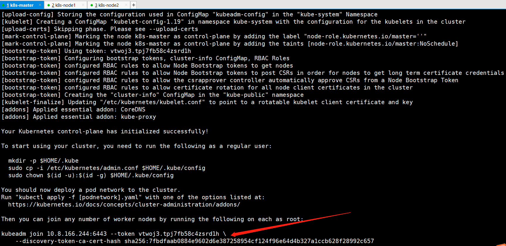

记下来上面的内容；

```shell
kubeadm join 192.168.91.151:6443 --token mtw6bh.x0k51vyvlpy8nz6w \
    --discovery-token-ca-cert-hash sha256:041e713abfd4d8d4242c4bf60e8cd2f9af4cd8694b5cd6cdd95def14c0a3f593
[root@k8s-master ~]# mkdir -p $HOME/.kube
[root@k8s-master ~]# cp -i /etc/kubernetes/admin.conf $HOME/.kube/config
[root@k8s-master ~]# chown $(id -u):$(id -g) $HOME/.kube/config
查看node节点
[root@k8s-master ~]# kubectl get nodes
NAME         STATUS     ROLES    AGE     VERSION
k8s-master   NotReady   master   2m41s   v1.17.4
[root@k8s-master ~]# kubectl get pod -n kube-system
```

### 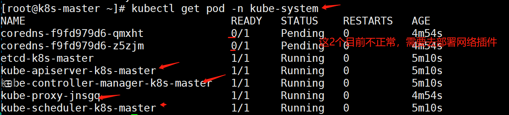

### 配置使用网络插件（第1种方式）

kube-flannel.yaml

```shell
在master节点操作
下载配置
# cd ~ && mkdir flannel && cd flannel
# curl -O https://raw.githubusercontent.com/coreos/flannel/master/Documentation/kube-flannel.yml

修改配置文件kube-flannel.yml:
此处的ip配置要与上面kubeadm的pod-network一致，本来就一致，不用改
  net-conf.json: |
    {
      "Network": "10.244.0.0/16",
      "Backend": {
        "Type": "vxlan"
      }
    }
# 这里注意kube-flannel.yml这个文件里的flannel的镜像是0.11.0，quay.io/coreos/flannel:v0.11.0-amd64
# 默认的镜像是quay.io/coreos/flannel:v0.11.0-amd64，需要提前pull下来。


# 如果Node有多个网卡的话，参考flannel issues 39701，
# https://github.com/kubernetes/kubernetes/issues/39701
# 目前需要在kube-flannel.yml中使用--iface参数指定集群主机内网网卡的名称，
# 否则可能会出现dns无法解析。容器无法通信的情况，需要将kube-flannel.yml下载到本地，
# flanneld启动参数加上--iface=<iface-name>
    containers:
      - name: kube-flannel
        image: quay.io/coreos/flannel:v0.11.0-amd64
        command:
        - /opt/bin/flanneld
        args:
        - --ip-masq
        - --kube-subnet-mgr
        - --iface=ens33
        - --iface=eth0
        
⚠️⚠️⚠️--iface=ens33 的值，是你当前的网卡,或者可以指定多网卡

# 1.12版本的kubeadm额外给node1节点设置了一个污点(Taint)：node.kubernetes.io/not-ready:NoSchedule，
# 很容易理解，即如果节点还没有ready之前，是不接受调度的。可是如果Kubernetes的网络插件还没有部署的话，节点是不会进入ready状态的。
# 因此修改以下kube-flannel.yaml的内容，加入对node.kubernetes.io/not-ready:NoSchedule这个污点的容忍：
    - key: beta.kubernetes.io/arch
                    operator: In
                    values:
                      - arm64
      hostNetwork: true
      tolerations:
      - operator: Exists
        effect: NoSchedule
      - key: node.kubernetes.io/not-ready  #添加如下三行---在261行左右
        operator: Exists
        effect: NoSchedule
      serviceAccountName: flannel
```


上面的这个镜像，是解决网络问题的flannel镜像，每个节点都要拉取


```plain
# docker pull quay.io/coreos/flannel:v0.12.0-amd64 #其实，它也会自动拉取。
```


```plain
启动：
[root@k8s-master ~]# kubectl apply -f ~/flannel/kube-flannel.yml  #启动完成之后需要等待一会
```

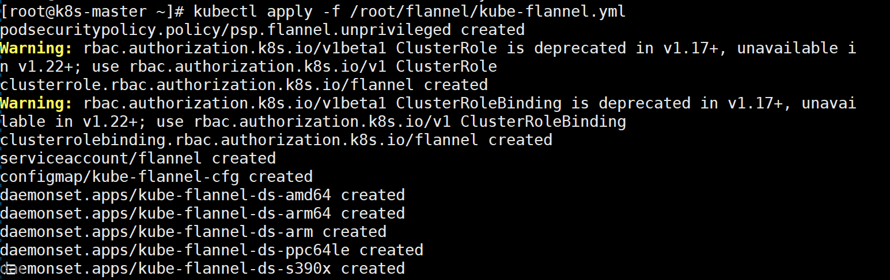

```plain
[root@k8s-master ~]# kubectl get pods -n kube-system
NAME                                     READY   STATUS    RESTARTS   AGE
coredns-5644d7b6d9-sm8hs                 1/1     Running   0          9m18s
coredns-5644d7b6d9-vddll                 1/1     Running   0          9m18s
etcd-kub-k8s-master                      1/1     Running   0          8m14s
kube-apiserver-kub-k8s-master            1/1     Running   0          8m17s
kube-controller-manager-kub-k8s-master   1/1     Running   0          8m20s
kube-flannel-ds-amd64-9wgd8              1/1     Running   0          8m42s
kube-proxy-sgphs                         1/1     Running   0          9m18s
kube-scheduler-kub-k8s-master            1/1     Running   0          8m10s

查看：
# kubectl get pods -n kube-system
# kubectl get service
# kubectl get svc --namespace kube-system
只有网络插件也安装配置完成之后，才能会显示为ready状态
```

### 配置使用网络插件（第2种方式）

用这个网络插件的配置文件kube-flannelv1.19.1.yaml

```shell
[root@k8s-master ~]# vim kube-flannelv1.19.1.yaml
:% s/namespace: kube-flannel/namespace: kube-system/g
```


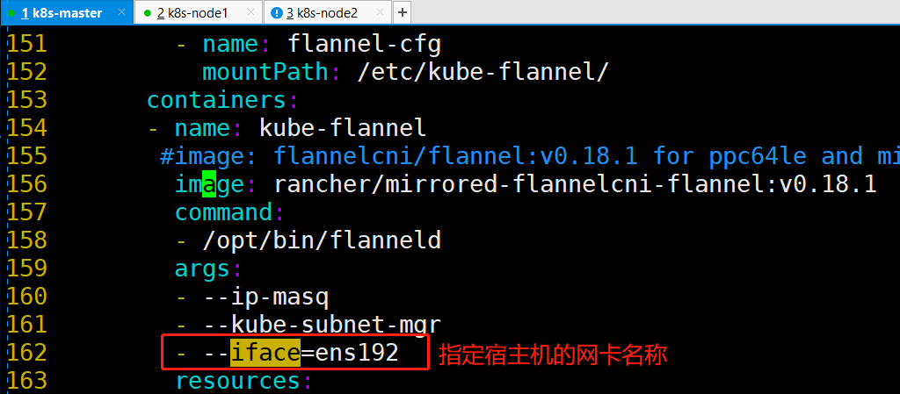

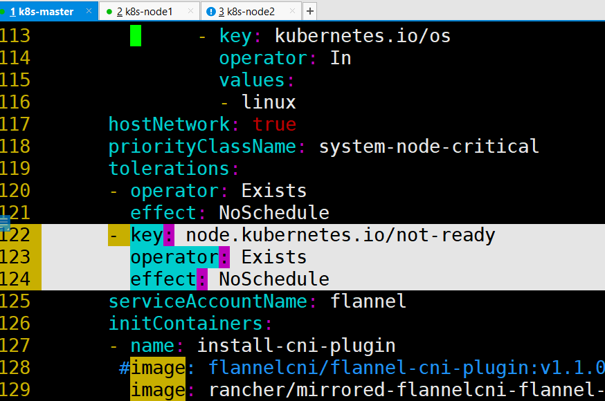

```shell
       - key: node.kubernetes.io/not-ready
         operator: Exists
         effect: NoSchedule
```


```shell
# docker pull rancher/mirrored-flannelcni-flannel:v0.18.1
# docker pull rancher/mirrored-flannelcni-flannel-cni-plugin:v1.1.0
拉取速度较慢，耐心等待。。。。
[root@k8s-master ~]# kubectl apply -f kube-flannelv1.19.1.yaml
[root@k8s-master ~]# kubectl get pod -n kube-system
```

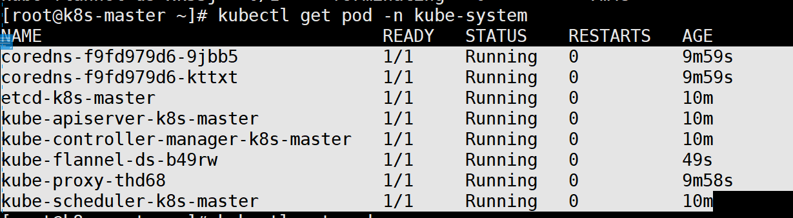

### 所有node节点加入集群

```shell
配置node节点加入集群：
如果报错开启ip转发：
# sysctl -w net.ipv4.ip_forward=1

在所有node节点操作，此命令为初始化master成功后返回的结果
# kubeadm join 192.168.246.166:6443 --token 93erio.hbn2ti6z50he0lqs \
    --discovery-token-ca-cert-hash sha256:3bc60f06a19bd09f38f3e05e5cff4299011b7110ca3281796668f4edb29a56d9
```


**在master操作：**

```shell
各种检测：
1.查看pods:
[root@kub-k8s-master ~]# kubectl get pods -n kube-system
NAME                                     READY   STATUS    RESTARTS   AGE
coredns-5644d7b6d9-sm8hs                 1/1     Running   0          39m
coredns-5644d7b6d9-vddll                 1/1     Running   0          39m
etcd-kub-k8s-master                      1/1     Running   0          37m
kube-apiserver-kub-k8s-master            1/1     Running   0          38m
kube-controller-manager-kub-k8s-master   1/1     Running   0          38m
kube-flannel-ds-amd64-9wgd8              1/1     Running   0          38m
kube-flannel-ds-amd64-lffc8              1/1     Running   0          2m11s
kube-flannel-ds-amd64-m8kk2              1/1     Running   0          2m2s
kube-proxy-dwq9l                         1/1     Running   0          2m2s
kube-proxy-l77lz                         1/1     Running   0          2m11s
kube-proxy-sgphs                         1/1     Running   0          39m
kube-scheduler-kub-k8s-master            1/1     Running   0          37m

2.查看异常pod信息：
[root@kub-k8s-master ~]# kubectl  describe pod kube-flannel-ds-sr6tq -n  kube-system
Name:               kube-flannel-ds-sr6tq
Namespace:          kube-system
Priority:           0
PriorityClassName:  <none>
。。。。。
Events:
  Type     Reason     Age                  From               Message
  ----     ------     ----                 ----               -------
  Normal   Pulling    12m                  kubelet, node2     pulling image "registry.cn-shanghai.aliyuncs.com/gcr-k8s/flannel:v0.10.0-amd64"
  Normal   Pulled     11m                  kubelet, node2     Successfully pulled image "registry.cn-shanghai.aliyuncs.com/gcr-k8s/flannel:v0.10.0-amd64"
  Normal   Created    11m                  kubelet, node2     Created container
  Normal   Started    11m                  kubelet, node2     Started container
  Normal   Created    11m (x4 over 11m)    kubelet, node2     Created container
  Normal   Started    11m (x4 over 11m)    kubelet, node2     Started container
  Normal   Pulled     10m (x5 over 11m)    kubelet, node2     Container image "registry.cn-shanghai.aliyuncs.com/gcr-k8s/flannel:v0.10.0-amd64" already present on machine
  Normal   Scheduled  7m15s                default-scheduler  Successfully assigned kube-system/kube-flannel-ds-sr6tq to node2
  Warning  BackOff    7m6s (x23 over 11m)  kubelet, node2     Back-off restarting failed container

3.遇到这种情况直接 删除异常pod:
[root@kub-k8s-master ~]# kubectl delete pod kube-flannel-ds-sr6tq -n kube-system
pod "kube-flannel-ds-sr6tq" deleted

4.查看pods:
[root@kub-k8s-master ~]# kubectl get pods -n kube-system
NAME                                     READY   STATUS    RESTARTS   AGE
coredns-5644d7b6d9-sm8hs                 1/1     Running   0          44m
coredns-5644d7b6d9-vddll                 1/1     Running   0          44m
etcd-kub-k8s-master                      1/1     Running   0          42m
kube-apiserver-kub-k8s-master            1/1     Running   0          43m
kube-controller-manager-kub-k8s-master   1/1     Running   0          43m
kube-flannel-ds-amd64-9wgd8              1/1     Running   0          43m
kube-flannel-ds-amd64-lffc8              1/1     Running   0          7m10s
kube-flannel-ds-amd64-m8kk2              1/1     Running   0          7m1s
kube-proxy-dwq9l                         1/1     Running   0          7m1s
kube-proxy-l77lz                         1/1     Running   0          7m10s
kube-proxy-sgphs                         1/1     Running   0          44m
kube-scheduler-kub-k8s-master            1/1     Running   0          42m

5.查看节点：
[root@kub-k8s-master ~]# kubectl get nodes
NAME             STATUS   ROLES    AGE     VERSION
kub-k8s-master   Ready    master   43m     v1.16.1
kub-k8s-node1    Ready    <none>   6m46s   v1.16.1
kub-k8s-node2    Ready    <none>   6m37s   v1.16.1
到此集群配置完成
```


**错误整理**

```shell
错误
问题1：服务器时间不一致会报错
查看服务器时间
=====================================
问题2：kubeadm init不成功,发现如下提示，然后超时报错
[wait-control-plane] Waiting for the kubelet to boot up the control plane as static Pods from directory "/etc/kubernetes/manifests". This can take up to 4m0s

查看kubelet状态发现如下错误，主机master找不到和镜像下载失败，发现pause镜像是从aliyuncs下载的，其实我已经下载好了官方的pause镜像，按着提示的镜像名称重新给pause镜像打个ali的tag，最后重置kubeadm的环境重新初始化，错误解决
[root@master manifests]# systemctl  status kubelet -l
● kubelet.service - kubelet: The Kubernetes Node Agent
   Loaded: loaded (/etc/systemd/system/kubelet.service; enabled; vendor preset: disabled)
  Drop-In: /etc/systemd/system/kubelet.service.d
           └─10-kubeadm.conf
   Active: active (running) since 四 2019-01-31 15:20:32 CST; 5min ago
     Docs: https://kubernetes.io/docs/
 Main PID: 23908 (kubelet)
    Tasks: 19
   Memory: 30.8M
   CGroup: /system.slice/kubelet.service
           └─23908 /usr/bin/kubelet --bootstrap-kubeconfig=/etc/kubernetes/bootstrap-kubelet.conf --kubeconfig=/etc/kubernetes/kubelet.conf --config=/var/lib/kubelet/config.yaml --cgroup-driver=cgroupfs --network-plugin=cni --pod-infra-container-image=k8s.gcr.io/pause:3.1 --cgroup-driver=cgroupfs --pod-infra-container-image=registry.cn-hangzhou.aliyuncs.com/google_containers/pause-amd64:3.1

1月 31 15:25:41 master kubelet[23908]: E0131 15:25:41.432357   23908 kubelet.go:2266] node "master" not found
1月 31 15:25:41 master kubelet[23908]: E0131 15:25:41.532928   23908 kubelet.go:2266] node "master" not found
1月 31 15:25:41 master kubelet[23908]: E0131 15:25:41.633192   23908 kubelet.go:2266] node "master" not found
1月 31 15:25:41 master kubelet[23908]: I0131 15:25:41.729296   23908 kubelet_node_status.go:278] Setting node annotation to enable volume controller attach/detach
1月 31 15:25:41 master kubelet[23908]: E0131 15:25:41.733396   23908 kubelet.go:2266] node "master" not found
1月 31 15:25:41 master kubelet[23908]: E0131 15:25:41.740110   23908 remote_runtime.go:96] RunPodSandbox from runtime service failed: rpc error: code = Unknown desc = failed pulling image "registry.cn-hangzhou.aliyuncs.com/google_containers/pause-amd64:3.1": Error response from daemon: Get https://registry.cn-hangzhou.aliyuncs.com/v2/: dial tcp 0.0.0.80:443: connect: invalid argument
1月 31 15:25:41 master kubelet[23908]: E0131 15:25:41.740153   23908 kuberuntime_sandbox.go:68] CreatePodSandbox for pod "kube-controller-manager-master_kube-system(e8f43404e60ae844e375d50b1e39d91e)" failed: rpc error: code = Unknown desc = failed pulling image "registry.cn-hangzhou.aliyuncs.com/google_containers/pause-amd64:3.1": Error response from daemon: Get https://registry.cn-hangzhou.aliyuncs.com/v2/: dial tcp 0.0.0.80:443: connect: invalid argument
1月 31 15:25:41 master kubelet[23908]: E0131 15:25:41.740166   23908 kuberuntime_manager.go:662] createPodSandbox for pod "kube-controller-manager-master_kube-system(e8f43404e60ae844e375d50b1e39d91e)" failed: rpc error: code = Unknown desc = failed pulling image "registry.cn-hangzhou.aliyuncs.com/google_containers/pause-amd64:3.1": Error response from daemon: Get https://registry.cn-hangzhou.aliyuncs.com/v2/: dial tcp 0.0.0.80:443: connect: invalid argument
1月 31 15:25:41 master kubelet[23908]: E0131 15:25:41.740207   23908 pod_workers.go:190] Error syncing pod e8f43404e60ae844e375d50b1e39d91e ("kube-controller-manager-master_kube-system(e8f43404e60ae844e375d50b1e39d91e)"), skipping: failed to "CreatePodSandbox" for "kube-controller-manager-master_kube-system(e8f43404e60ae844e375d50b1e39d91e)" with CreatePodSandboxError: "CreatePodSandbox for pod \"kube-controller-manager-master_kube-system(e8f43404e60ae844e375d50b1e39d91e)\" failed: rpc error: code = Unknown desc = failed pulling image \"registry.cn-hangzhou.aliyuncs.com/google_containers/pause-amd64:3.1\": Error response from daemon: Get https://registry.cn-hangzhou.aliyuncs.com/v2/: dial tcp 0.0.0.80:443: connect: invalid argument"
1月 31 15:25:41 master kubelet[23908]: E0131 15:25:41.833981   23908 kubelet.go:2266] node "master" not found
```


**解决方式**

```shell
重置kubeadm环境
整个集群所有节点(包括master)重置/移除节点
1.驱离k8s-node-1节点上的pod（master上）
[root@kub-k8s-master ~]# kubectl drain kub-k8s-node1 --delete-local-data --force --ignore-daemonsets

2.删除节点（master上）
[root@kub-k8s-master ~]# kubectl delete node kub-k8s-node1

3.重置节点(node上-也就是在被删除的节点上)
[root@kub-k8s-node1 ~]# kubeadm reset

注1：需要把master也驱离、删除、重置，这里给我坑死了，第一次没有驱离和删除master，最后的结果是查看结果一切正常，但coredns死活不能用，搞了整整1天，切勿尝试

注2：master上在reset之后需要删除如下文件
# rm -rf /var/lib/cni/ $HOME/.kube/config

###注意：如果整个k8s集群都做完了，需要重置按照上面步骤操作。如果是在初始化出错只需要操作第三步
```


**重新生成token**

```shell
kubeadm 生成的token过期后，集群增加节点

通过kubeadm初始化后，都会提供node加入的token:
You should now deploy a pod network to the cluster.
Run "kubectl apply -f [podnetwork].yaml" with one of the options listed at:
  https://kubernetes.io/docs/concepts/cluster-administration/addons/

You can now join any number of machines by running the following on each node
as root:

  kubeadm join 192.168.246.166:6443 --token n38l80.y2icehgzsyuzkthi \
    --discovery-token-ca-cert-hash sha256:5fb6576ef82b5655dee285e0c93432aee54d38779bc8488c32f5cbbb90874bac
默认token的有效期为24小时，当过期之后，该token就不可用了。

~~~~~~~~~~~~~~~~~~~~~~~~~~~~~~~~~

解决方法：
1. 重新生成新的token:
[root@node1 flannel]# kubeadm  token create
kiyfhw.xiacqbch8o8fa8qj
[root@node1 flannel]# kubeadm  token list
TOKEN                     TTL         EXPIRES                     USAGES                   DESCRIPTION   EXTRA GROUPS
gvvqwk.hn56nlsgsv11mik6   <invalid>   2018-10-25T14:16:06+08:00   authentication,signing   <none>        system:bootstrappers:kubeadm:default-node-token
kiyfhw.xiacqbch8o8fa8qj   23h         2018-10-27T06:39:24+08:00   authentication,signing   <none>        system:bootstrappers:kubeadm:default-node-token

2. 获取ca证书sha256编码hash值:
[root@node1 flannel]# openssl x509 -pubkey -in /etc/kubernetes/pki/ca.crt | openssl rsa -pubin -outform der 2>/dev/null | openssl dgst -sha256 -hex | sed 's/^.* //'
5417eb1b68bd4e7a4c82aded83abc55ec91bd601e45734d6aba85de8b1ebb057

3. 节点加入集群:
  kubeadm join 18.16.202.35:6443 --token kiyfhw.xiacqbch8o8fa8qj --discovery-token-ca-cert-hash sha256:5417eb1b68bd4e7a4c82aded83abc55ec91bd601e45734d6aba85de8b1ebb057
几秒钟后，您应该注意到kubectl get nodes在主服务器上运行时输出中的此节点。

上面的方法比较繁琐，一步到位：
kubeadm token create --print-join-command

第二种方法：
token=$(kubeadm token generate)
kubeadm token create $token --print-join-command --ttl=0
```


## 集群操作--查看集群信息

```shell
1.查看集群信息：
[root@k8s-master ~]# kubectl get nodes
NAME         STATUS   ROLES    AGE   VERSION
k8s-master   Ready    master   22d   v1.19.1
k8s-node1    Ready    <none>   22d   v1.19.1
k8s-node2    Ready    <none>   22d   v1.19.1
2.删除节点（无效且显示的也可以删除）
[root@k8s-master ~]# kubectl delete node k8s-node2
3.单独查看某一个节点(节点名称可以用空格隔开写多个)
[root@k8s-master ~]# kubectl get node k8s-node1
NAME            STATUS   ROLES    AGE   VERSION
k8s-node1   Ready    <none>   15h   v1.16.1
```


使用 kubectl describe 命令，查看一个 API 对象的详细信息：


注意：Events（事件） 值得你特别关注


在 Kubernetes 执行的过程中，对 API 对象的所有重要操作，都会被记录在这个对象的 Events 里，并且显示在 kubectl describe 指令返回的结果中。


比如，对于这个 Pod，我们可以看到它被创建之后，被调度器调度（Successfully assigned）到了 node-1，拉取了指定的镜像（pulling image），然后启动了 Pod 里定义的容器（Started container）。


这个部分正是我们将来进行 Debug 的重要依据。如果有异常发生，一定要第一时间查看这些 Events，往往可以看到非常详细的错误信息。


**查看node的详细信息**


```shell
[root@kub-k8s-master ~]# kubectl describe node k8s-node1  #也可以查看pod的信息
Name:               k8s-node1
Roles:              <none>
...
  --------           --------   ------
  cpu                100m (2%)  100m (2%)
  memory             50Mi (1%)  50Mi (1%)
  ephemeral-storage  0 (0%)     0 (0%)
Events:              <none>
#注意:最后被查看的节点名称只能用get nodes里面查到的name!
```


**查看各组件信息:**

```shell
查看service的信息：
[root@kub-k8s-master ~]# kubectl get service
NAME         TYPE        CLUSTER-IP   EXTERNAL-IP   PORT(S)   AGE
kubernetes   ClusterIP   10.96.0.1    <none>        443/TCP   22h

在不同的namespace里面查看service：
[root@kub-k8s-master ~]# kubectl get service -n kube-system
-n:namespace名称空间

查看所有名称空间内的资源：
[root@kub-k8s-master ~]# kubectl get pods --all-namespaces

同时查看多种资源信息：
[root@kub-k8s-master ~]# kubectl get pod,service -n kube-system

查看主节点：
[root@k8s-master prome]# kubectl cluster-info

api查询：
[root@kub-k8s-master ~]# kubectl api-versions
```


#### **创建名称空间**

```shell
1. 编写yaml文件
[root@kub-k8s-master ~]# mkdir prome
[root@kub-k8s-master ~]# cd prome/
[root@kub-k8s-master prome]# vim namespace.yaml
---
apiVersion: v1   #api版本
kind: Namespace  #类型---固定的
metadata:     #元数据
  name: ns-monitor  #起个名字
  labels:
    name: ns-monitor
2. 创建资源
[root@kub-k8s-master prome]# kubectl apply -f namespace.yml
namespace/ns-monitor created
3. 查看资源
[root@kub-k8s-master prome]# kubectl get namespace
NAME              STATUS   AGE
default           Active   22h
kube-node-lease   Active   22h
kube-public       Active   22h
kube-system       Active   22h
ns-monitor        Active   34s
4.查看某一个namespace
[root@kub-k8s-master prome]# kubectl get namespace ns-monitor
5.查看某个namespace的详细信息
[root@kub-k8s-master prome]# kubectl describe namespace ns-monitor
6.删除名称空间
[root@kub-k8s-master prome]# kubectl delete -f namespace.yml

[root@k8s-master prome]# kubectl delete namespace ns-monitor
```


## 发布第一个容器化应用

1.有镜像

2.部署应用。--考虑做不做副本不做副本就是pod，做副本以deployment/RC/DaemonSet方式去创建。做了副本访问还需要做一个service，使用访问。

发布第一个容器化应用

扮演一个应用开发者的角色，使用这个 Kubernetes 集群发布第一个容器化应用。

```shell
1. 作为一个应用开发者，你首先要做的，是制作容器的镜像。
2. 有了容器镜像之后，需要按照 Kubernetes 项目的规范和要求，将你的镜像组织为它能够"认识"的方式，然后提交上去。
```


什么才是 Kubernetes 项目能"认识"的方式？

```shell
就是使用 Kubernetes 的必备技能：编写配置文件。
这些配置文件可以是 YAML 或者 JSON 格式的。
```


Kubernetes 跟 Docker 等很多项目最大的不同，就在于它不推荐你使用命令行的方式直接运行容器（虽然 Kubernetes 项目也支持这种方式，比如：kubectl run），而是希望你用 YAML 文件的方式，即：把容器的定义、参数、配置，统统记录在一个 YAML 文件中，然后用这样一句指令把它运行起来：


```shell
# kubectl create/apply -f 我的配置文件
```


好处：

```shell
你会有一个文件能记录下 Kubernetes 到底"run"了什么,方便自身以后查看记录
```


使用YAML创建Pod

```shell
YAML文件，对应到k8s中，就是一个API Object（API 对象）。当你为这个对象的各个字段填好值并提交给k8s之后，k8s就会负责创建出这些对象所定义的容器或者其他类型的API资源。
```


**编写yaml文件内容如下：**

```shell
[root@kub-k8s-master prome]# vim pod.yml
---
apiVersion: v1  #api版本，支持pod的版本
kind: Pod     #Pod，定义类型注意语法开头大写
metadata:     #元数据
  name: website   #这是pod的名字
  labels:
    app: website   #自定义，但是不能是纯数字
spec:    #属性
  containers:   #定义容器
    - name: test-website   #容器的名字，可以自定义
      image: daocloud.io/library/nginx   #镜像
      ports:
        - containerPort: 80   #容器暴露的端口
```


**创建pod**


```shell
[root@kub-k8s-master prome]# kubectl apply -f pod.yml
pod/website created
```


**查看pod**


```shell
[root@kub-k8s-master prome]# kubectl get pods
NAME      READY   STATUS    RESTARTS   AGE
website   1/1     Running   0          74s
=============================================================================
各字段含义：
NAME: Pod的名称
READY: Pod的准备状况，右边的数字表示Pod包含的容器总数目，左边的数字表示准备就绪的容器数目
STATUS: Pod的状态
RESTARTS: Pod的重启次数
AGE: Pod的运行时间
```


```shell
pod的准备状况指的是Pod是否准备就绪以接收请求，Pod的准备状况取决于容器，即所有容器都准备就绪了，Pod才准备就绪。这时候kubernetes的代理服务才会添加Pod作为后端，而一旦Pod的准备状况变为false(至少一个容器的准备状况为false),kubernetes会将Pod从代理服务的分发后端移除，即不会分发请求给该Pod。

一个pod刚被创建的时候是不会被调度的，因为没有任何节点被选择用来运行这个pod。调度的过程发生在创建完成之后，但是这个过程一般很快，所以你通常看不到pod是处于unscheduler状态的除非创建的过程遇到了问题。

pod被调度之后，分配到指定的节点上运行，这时候，如果该节点没有所需要的image，那么将会自动从默认的Docker Hub上pull指定的image，一切就绪之后，看到pod是处于running状态了
```


**查看pod运行在哪台机器上**


```shell
[root@kub-k8s-master prome]# kubectl get pods -o wide
```


```shell
可以测试访问:
[root@kub-k8s-master prome]# curl 10.244.1.3   #访问pod的ip
```


能访问到！！


**查看pods定义的详细信息**


```shell
查看pod的详细信息----指定pod名字
[root@kub-k8s-master prome]# kubectl get pod website -o yaml -n default
-o：output
yaml：yaml格式也可以是json格式
```


**查看kubectl describe 支持查询Pod的状态和生命周期事件**

```shell
[root@kub-k8s-master prome]# kubectl describe pod website
```


```shell
1.各字段含义：
Name: Pod的名称
Namespace: Pod的Namespace。
Image(s): Pod使用的镜像
Node: Pod所在的Node。
Start Time: Pod的起始时间
Labels: Pod的Label。
Status: Pod的状态。
Reason: Pod处于当前状态的原因。
Message: Pod处于当前状态的信息。
IP: Pod的PodIP
Replication Controllers: Pod对应的Replication Controller。
===============================
2.Containers:Pod中容器的信息
Container ID: 容器的ID
Image: 容器的镜像
Image ID:镜像的ID
State: 容器的状态
Ready: 容器的准备状况(true表示准备就绪)。
Restart Count: 容器的重启次数统计
Environment Variables: 容器的环境变量
Conditions: Pod的条件，包含Pod准备状况(true表示准备就绪)
Volumes: Pod的数据卷
Events: 与Pod相关的事件列表
=====
生命周期：指的是status通过# kubectl get pod
生命周期包括：running、Pending、completed、
```


**生命周期的介绍**


```shell
Pending：此状态表示Pod 的 YAML 文件已经提交给了 Kubernetes，API 对象已经被创建并保存在 Etcd 当中（准备状态）。但这个 Pod 里有些容器因为某种原因而不能被顺利创建。比如，调度不成功。

Running：此状态表示Pod 已经调度成功，跟一个具体的节点绑定。它包含的容器都已经创建成功，并且至少有一个正在运行中。

Succeeded：此状态表示 Pod 里的所有容器都正常运行完毕，并且已经退出了。这种情况在运行一次性任务时最为常见。

Failed：此状态表示 Pod 里至少有一个容器以不正常的状态（非 0 的返回码）退出。这个状态的出现，意味着你得想办法 Debug 这个容器的应用，比如查看 Pod 的 Events 和日志。

Unknown：这是一个异常状态(未知状态)，表示 Pod 的状态不能持续地被 kubelet 汇报给 kube-apiserver这很有可能是主从节点（Master 和 Kubelet）间的通信出现了问题
```

------

**其他状态**


```shell
CrashLoopBackOff： 容器退出，kubelet正在将它重启
InvalidImageName： 无法解析镜像名称
ImageInspectError： 无法校验镜像
ErrImageNeverPull： 策略禁止拉取镜像
ImagePullBackOff： 正在重试拉取
RegistryUnavailable： 连接不到镜像中心
ErrImagePull： 通用的拉取镜像出错
CreateContainerConfigError： 不能创建kubelet使用的容器配置
CreateContainerError： 创建容器失败
m.internalLifecycle.PreStartContainer  执行hook报错
RunContainerError： 启动容器失败
PostStartHookError： 执行hook报错 
ContainersNotInitialized： 容器没有初始化完毕
ContainersNotReady： 容器没有准备完毕 
ContainerCreating：容器创建中
PodInitializing：pod 初始化中 
DockerDaemonNotReady：docker还没有完全启动
NetworkPluginNotReady： 网络插件还没有完全启动
```


**进入Pod对应的容器内部**


```shell
通过pod名称
[root@kub-k8s-master prome]# kubectl exec -it website /bin/bash
root@website:/#
```


**删除pod**


```shell
[root@kub-k8s-master prome]# kubectl delete pod pod名1 pod名2   //单个或多个删除
[root@kub-k8s-master prome]# kubectl delete pod --all   //批量删除
举例：
[root@kub-k8s-master prome]# kubectl delete pod website
pod "website" deleted
[root@kub-k8s-master prome]# kubectl delete -f pod.yaml 
pod "website" deleted
```


**创建pod**

```shell
[root@k8s-master prome]# kubectl apply -f pod.yaml  #指定创建pod的yml文件名
[root@k8s-master prome]# kubectl apply -f pod.yaml  --validate 想看报错信息，加上--validate参数
```


**重新启动基于yaml文件的应用**(这里并不是重新启动服务)

```shell
# kubectl delete -f XXX.yaml   #删除
# kubectl apply -f XXX.yaml   #创建
```


**扩展**

```shell
create与apply的区别：
create创建的应用如果需要修改yml文件，必须先指定yml文件删除，在创建新的pod。
如果是apply创建的应用可以直接修改yml文件，继续apply创建，不用先删掉。
```


# **Yaml文件语法解析**


除了某些强制性的命令，如：kubectl run或者expose等，k8s还允许通过配置文件的方式来创建这些操作对象。


通常，使用配置文件的方式会比直接使用命令行更可取，因为这些文件可以进行版本控制，而且文件的变化和内容也可以进行审核，当使用及其复杂的配置来提供一个稳健、可靠和易维护的系统时，这些点就显得非常重要。


在声明定义配置文件的时候，所有的配置文件都存储在YAML或者JSON格式的文件中并且遵循k8s的资源配置方式。


YAML是专门用来写配置文件的语言，非常简洁和强大，使用比json更方便。它实质上是一种通用的数据串行化格式。


kubernetes中用来定义YAML文件创建Pod和创建Deployment等资源对象。


```shell
使用YAML用于K8s的定义的好处：
便捷性：不必添加大量的参数到命令行中执行命令
可维护性：YAML文件可以通过源头控制，跟踪每次操作
灵活性：YAML可以创建比命令行更加复杂的结构
```


```shell
YAML语法规则：
    1. 大小写敏感/区分大小写
    2. 使用缩进表示层级关系
    3. 缩进时不允许使用Tab键，只允许使用空格
    4. 缩进的空格数不重要，只要相同层级的元素左侧对齐即可
    5. " 表示注释，从这个字符一直到行尾，都会被解析器忽略
```


```shell
在 k8s 中，只需要知道两种结构类型：
1.Lists
2.Maps
```


```shell
字典
    a={key:value, key1:{key2:{value2}}, key3:{key4:[1,{key5:value5},3,4,5]}}
```


```shell
key: value
key1:
   key2: value2
key3:
   key4:
      - 1
      - key5: value5
      - 3
      - 4
      - 5

YAML  Maps
Map指的是字典，即一个Key:Value 的键值对信息。
例如：
---
apiVersion: v1
kind: Pod

注：--- 为可选的分隔符 ，当需要在一个文件中定义多个结构的时候需要使用。上述内容表示有两个键apiVersion和kind，分别对应的值为v1和Pod。

Maps的value既能够对应字符串也能够对应一个Maps。
例如：
---
apiVersion: v1
kind: Pod
metadata:
  name: kube100-site
  labels:
    app: web    
 
{apiVersion:v1,kind:Pod,Metadata:{name:kube100-site,labels:{app:web}}}  
注：上述的YAML文件中，metadata这个KEY对应的值为一个Maps，而嵌套的labels这个KEY的值又是一个Map。实际使用中可视情况进行多层嵌套。

YAML处理器根据行缩进来知道内容之间的关联。上述例子中，使用两个空格作为缩进，但空格的数据量并不重要，只是至少要求一个空格并且所有缩进保持一致的空格数 。例如，name和labels是相同缩进级别，因此YAML处理器知道他们属于同一map；它知道app是lables的值因为app的缩进更大。
注意：在YAML文件中绝对不要使用tab键
```


```shell
YAML   Lists
List即列表，就是数组
例如：
args:
 - beijing
 - shanghai
 - shenzhen
 - guangzhou

可以指定任何数量的项在列表中，每个项的定义以连字符（-）开头，并且与父元素之间存在缩进。

在JSON格式中，表示如下：
{
"args": ["beijing", "shanghai", "shenzhen", "guangzhou"]
}
```


# Pod API属性详解


Pod API 对象

```shell
Pod是 k8s 项目中的最小编排单位。将这个设计落实到 API 对象上，容器（Container）就成了 Pod 属性里一个普通的字段。
```


问题：

   通过yaml文件创建pod的时候里面有容器，这个文件里面到底哪些属性属于 Pod 对象，哪些属性属于 Container？

解决：

```shell
   Pod 扮演的是传统环境里"虚拟机"的角色。是为了使用户从传统环境（虚拟机环境）向 k8s（容器环境）的迁移，更加平滑。
   把 Pod 看成传统环境里的"机器"、把容器看作是运行在这个"机器"里的"用户程序"，那么很多关于 Pod 对象的设计就非常容易理解了。
凡是调度、网络、存储，以及安全相关的属性，基本上是 Pod 级别的
```


   共同特征是，它们描述的是"机器"这个整体，而不是里面运行的"程序"。

```shell
比如：

配置这个"机器"的网卡（即：Pod 的网络定义）

配置这个"机器"的磁盘（即：Pod 的存储定义）

配置这个"机器"的防火墙（即：Pod 的安全定义）

这台"机器"运行在哪个服务器之上（即：Pod 的调度）
```


```shell
kind：指定了这个 API 对象的类型（Type），是一个 Pod，根据实际情况，此处资源类型可以是Deployment、Job、Ingress、Service等。

metadata：包含Pod的一些meta信息，比如名称、namespace、标签等信息.

spec：specification of the resource content 指定该资源的内容,包括一些container，storage，volume以及其他Kubernetes需要的参数，以及诸如是否在容器失败时重新启动容器的属性。可在特定Kubernetes API找到完整的Kubernetes Pod的属性。

specification----->[spesɪfɪˈkeɪʃn]
```


容器可选的设置属性：

除了上述的基本属性外，还能够指定复杂的属性，包括容器启动运行的命令、使用的参数、工作目录以及每次实例化是否拉取新的副本。 还可以指定更深入的信息，例如容器的退出日志的位置。


容器可选的设置属性包括：

```shell
"name"、"image"、"command"、"args"、"workingDir"、"ports"、"env"、resource、"volumeMounts"、livenessProbe、readinessProbe、livecycle、terminationMessagePath、"imagePullPolicy"、securityContext、stdin、stdinOnce、tty
```


**跟"机器"相关的配置**

```shell
[root@kub-k8s-master ~]# cd prome/
[root@kub-k8s-master prome]# kubectl get pods
NAME      READY   STATUS    RESTARTS   AGE
website   1/1     Running   0          2d23h
[root@kub-k8s-master prome]# kubectl get pod -o wide   #查看pod运行在哪台机器上面
```


```shell
nodeSelector
nodeName
这两个属性的功能是一样的都是用于人工干预调度器
```


**实战**

### 指定节点调度Pod

```shell
将node1上面的pod删除掉
[root@kub-k8s-master prome]# kubectl delete -f pod.yml 
pod "website" deleted
===========================================
nodeName：是一个供用户将 Pod 与 Node 进行绑定的字段，用法：
现在指定将pod创在node1上面：
[root@kub-k8s-master prome]# vim pod.yml
kind: Pod
apiVersion: v1
metadata:
  namespace: kube-system   #指定创建到哪个命名空间
  name: nginx
  labels:
    app: nginx
spec:
  nodeName: k8s-node1  #指定node名称
  containers:
    - image: daocloud.io/library/nginx:1.12.0-alpine
      name: nginx
      ports:
        - containerPort: 80
创建
[root@kub-k8s-master prome]# kubectl apply -f pod.yml 
[root@kub-k8s-master prome]# kubectl get pod -n kube-system -o wide
```

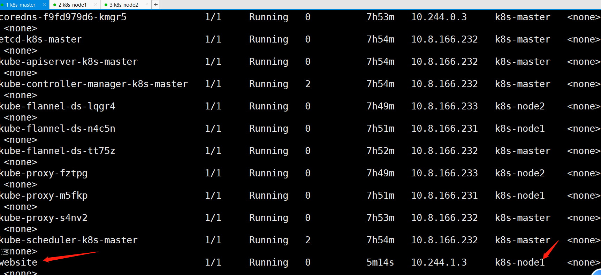


```shell
NodeName：
一旦 Pod 的这个字段被赋值，k8s就会被认为这个 Pod 已经经过了调度，调度的结果就是赋值的节点名字。这个字段一般由调度器负责设置，用户也可以设置它来"骗过"调度器，这个做法一般是在测试或者调试的时候才会用到。
```


**第二种方式通过node标签**

首先我们需要知道node2上面你的标签有哪些？

```shell
1.查看node2上面的标签
[root@kub-k8s-master prome]# kubectl describe node k8s-node2
```


```shell
1.重新创建一个新的pod
"nodeSelector：是一个供用户将 Pod 与 Node 进行绑定的字段"，，通过指定标签来指定

[root@kub-k8s-master prome]# vim tomcat.yml
---
apiVersion: v1
kind: Pod
metadata:
  name: tomcat
  labels:
    app: tomcat
spec:
  containers:
    - name: test-tomcat
      image: daocloud.io/library/tomcat:8
      ports:
        - containerPort: 8080
  nodeSelector:      #指定标签
    kubernetes.io/hostname: kub-k8s-node2
2.创建pod   
[root@kub-k8s-master prome]# kubectl apply -f tomcat.yml 
pod/tomcat created
```


```shell
表示这个 Pod 永远只能运行在携带了"kubernetes.io/hostname: kub-k8s-node2"标签（Label）的节点上；否则，它将调度失败。
```


**第三个方式主机别名**

设置pod容器里面的hosts文件内容，也是做本地解析

```shell
HostAliases：定义 Pod 的 hosts 文件（比如 /etc/hosts）里的内容，用法：
```


```shell
1.首先先将刚创建的pod删除掉
[root@kub-k8s-master prome]# kubectl delete -f tomcat.yml 
pod "tomcat" deleted
[root@kub-k8s-master prome]# vim tomcat.yml
---
apiVersion: v1
kind: Pod
metadata:
  name: tomcat
  labels:
    app: tomcat
spec:
  hostAliases:
  - ip: "192.168.246.113"   #给哪个ip做解析。实验环境下这个ip自定义的
    hostnames:
    - "foo.remote"    #解析的名字。用引号引起来可以写多个
    - "bar.remote"
  containers:
    - name: test-tomcat
      image: daocloud.io/library/tomcat:8
      ports:
        - containerPort: 8080
2.创建pod
[root@kub-k8s-master prome]# kubectl apply -f tomcat.yml 
pod/tomcat created
3.连接pod
[root@kub-k8s-master prome]# kubectl exec -it tomcat /bin/bash 
root@tomcat:/usr/local/tomcat# cat /etc/hosts   #查看hosts文件
```


   


```shell
注意：在 k8s 中，如果要设置 hosts 文件里的内容，一定要通过这种方法。否则，如果直接修改了 hosts 文件，在 Pod 被删除重建之后，kubelet 会自动覆盖掉被修改的内容。
```


**凡是跟容器的 Linux Namespace 相关的属性，也一定是 Pod 级别的**


原因：Pod 的设计，就是要让它里面的容器尽可能多地共享 Linux Namespace，仅保留必要的隔离和限制能力。这样，Pod 模拟出的效果，就跟虚拟机里程序间的关系非常类似了。


举例，一个 Pod 定义 yaml 文件如下：


```shell
[root@kub-k8s-master prome]# kubectl delete -f pod.yml
pod "website" deleted
[root@kub-k8s-master prome]# vim pod.yml   #修改如下。最好是提前将镜像pull下来。
---
apiVersion: v1
kind: Pod
metadata:
  name: website
  labels:
    app: website
spec:
  shareProcessNamespace: true  #共享进程名称空间
  containers:
    - name: test-web
      image: daocloud.io/library/nginx
      ports:
        - containerPort: 80
    - name: busybos
      image: daocloud.io/library/busybox
      stdin: true
      tty: true
      
2.创建
[root@kub-k8s-master prome]# kubectl apply -f pod.yml 
pod/website created
```


```shell
1. 定义了 shareProcessNamespace=true
表示这个 Pod 里的容器要共享进程(PID Namespace)如果是false则为不共享。
2. 定义了两个容器：
一个 nginx 容器
一个开启了 tty 和 stdin 的 busybos 容器

在 Pod 的 YAML 文件里声明开启它们俩，等同于设置了 docker run 里的 -it（-i 即 stdin，-t 即 tty）参数。
可以直接认为 tty 就是 Linux 给用户提供的一个常驻小程序，用于接收用户的标准输入，返回操作系统的标准输出。为了能够在 tty 中输入信息，需要同时开启 stdin（标准输入流）。

此 Pod 被创建后，就可以使用 shell 容器的 tty 跟这个容器进行交互了。
```


查看运行在那台机器上面：


我们登录node1的机器连接busybox的容器


```shell
[root@kub-k8s-node1 ~]# docker exec -it f684bd1d05b5 /bin/sh
```


在容器里不仅可以看到它本身的 ps 指令，还可以看到 nginx 容器的进程，以及 Infra 容器的 /pause 进程。也就是说整个 Pod 里的每个容器的进程，对于所有容器来说都是可见的：**它们共享了同一个 PID Namespace。**


```shell
[root@kub-k8s-master prome]# kubectl delete -f pod.yml
[root@kub-k8s-master prome]# vim pod.yml
将shareProcessNamespace=true修改为false
[root@kub-k8s-master prome]# kubectl apply -f pod.yml 
pod/website created
```


验证：


**凡是 Pod 中的容器要共享宿主机的 Namespace，也一定是 Pod 级别的定义。**


```shell
刚才的都是pod里面容器的Namespace，并没有和本机的Namespace做共享，接下来我们可以做与本机的Namespace共享，可以在容器里面看到本机的进程。

[root@kub-k8s-master prome]# kubectl delete -f pod.yml 
pod "website" deleted
[root@kub-k8s-master prome]# vim pod.yml #修改如下
---
apiVersion: v1
kind: Pod
metadata:
  name: website
  labels:
    app: website
spec:
  hostNetwork: true  #共享宿主机网络
  hostIPC: true  #共享ipc通信
  hostPID: true  #共享宿主机的pid
  containers:
    - name: test-web
      image: daocloud.io/library/nginx
      ports:
        - containerPort: 80
    - name: busybos
      image: daocloud.io/library/busybox
      stdin: true
      tty: true
创建pod
[root@kub-k8s-master prome]# kubectl apply -f pod.yml
pod/website created
```


验证：


定义了共享宿主机的 Network、IPC 和 PID Namespace。这样，此 Pod 里的所有容器，会直接使用宿主机的网络、直接与宿主机进行 IPC 通信、看到宿主机里正在运行的所有进程。


##### **容器属性：**


**Pod 里最重要的字段"Containers"：**


```shell
"Containers"和"Init Containers"这两个字段都属于 Pod 对容器的定义，内容也完全相同，只是 Init Containers 的生命周期，会先于所有的 Containers，并且严格按照定义的顺序执行.
```


**k8s 对 Container 的定义，和 Docker 相比并没有什么太大区别。**


```shell
Docker中Image（镜像）、Command（启动命令）、workingDir（容器的工作目录）、Ports（容器要开发的端口），以及 volumeMounts（容器要挂载的 Volume）都是构成 k8s 中 Container 的主要字段。
```


**其他的容器属性：**


```shell
ImagePullPolicy 字段:定义镜像的拉取策略。之所以是一个 Container 级别的属性，是因为容器镜像本来就是 Container 定义中的一部分。

默认值： Always:表示每次创建 Pod 都重新拉取一次镜像。 
1.镜像存在而且已经是最新版本就不在拉取镜像
2.如果不存在下载镜像
3.如果镜像存在但是版本不是新版本也会下载镜像
避免：不用latest，下载镜像的时候直接指定版本
#但是有bug，当容器的镜像是类似于 nginx 或者 nginx:latest 这样的名字时，ImagePullPolicy 也会被认为 Always。

值：
Never:表示Pod永远不会主动拉取这个镜像。
IfNotPresent:表示只在宿主机上不存在这个镜像时才拉取。

Lifecycle 字段：定义 Container Lifecycle Hooks。作用是在容器状态发生变化时触发一系列"钩子"。

注：
lifecycle  /laɪf ˈsaɪkl/ n   生命周期
```


案例：这是 k8s 官方文档的一个 Pod YAML 文件


在这个例子中，容器成功启动之后，在 /usr/share/message 里写入了一句"欢迎信息"（即 postStart 定义的操作）。而在这个容器被删除之前，我们则先调用了 nginx 的退出指令（即 preStop 定义的操作），从而实现了容器的"优雅退出"。


```shell
[root@kub-k8s-master prome]# kubectl delete -f pod.yml 
pod "website" deleted
[root@kub-k8s-master prome]# cp pod.yml pod.yml.bak
[root@kub-k8s-master prome]# vim pod.yml
---
apiVersion: v1
kind: Pod
metadata:
 name: lifecycle-demo
spec:
 containers:
 - name: lifecycle-demo-container
   image: daocloud.io/library/nginx
   lifecycle:
     postStart:  #容器启动之后
       exec: 
         command: ["/bin/sh", "-c", "echo Hello from the postStart handler > /usr/share/message"]
     preStop:  #容器关闭之前
       exec: 
         command: ["/usr/sbin/nginx","-s","quit"]
```


验证：


```shell
[root@kub-k8s-node1 ~]# docker exec -it 3d404e658 /bin/bash
root@lifecycle-demo:~# cat /usr/share/message 
Hello from the postStart handler
```


```shell
1. 定义了一个 nginx 镜像的容器
2. 设置了一个 postStart 和 preStop 参数

postStart:是在容器启动后，立刻执行一个指定的操作。
注意：postStart 定义的操作，虽然是在 Docker 容器 ENTRYPOINT 执行之后，但它并不严格保证顺序。也就是说，在 postStart 启动时，ENTRYPOINT 有可能还没有结束。
如果 postStart执行超时或者错误，k8s 会在该 Pod 的 Events 中报出该容器启动失败的错误信息，导致 Pod 也处于失败的状态。

preStop:是容器被杀死之前（比如，收到了 SIGKILL 信号）。
注意：preStop 操作的执行，是同步的。
所以，它会阻塞当前的容器杀死流程，直到这个 Hook 定义操作完成之后，才允许容器被杀死，这跟 postStart 不一样。

=======================================================================================

一个Pod 对象在 Kubernetes 中的生命周期:

Pod 生命周期的变化，主要体现在 Pod API 对象的Status 部分，这是除了 Metadata 和 Spec 之外的第三个重要字段。其中，pod.status.phase，就是 Pod 的当前状态，有如下几种可能的情况：

Pending：此状态表示Pod 的 YAML 文件已经提交给了 Kubernetes，API 对象已经被创建并保存在 Etcd 当中（准备状态）。但这个 Pod 里有些容器因为某种原因而不能被顺利创建。比如，调度不成功。

Running：此状态表示Pod 已经调度成功，跟一个具体的节点绑定。它包含的容器都已经创建成功，并且至少有一个正在运行中。

Succeeded：此状态表示 Pod 里的所有容器都正常运行完毕，并且已经退出了。这种情况在运行一次性任务时最为常见。

Failed：此状态表示 Pod 里至少有一个容器以不正常的状态（非 0 的返回码）退出。这个状态的出现，意味着你得想办法 Debug 这个容器的应用，比如查看 Pod 的 Events 和日志。

Unknown：这是一个异常状态(未知状态)，表示 Pod 的状态不能持续地被 kubelet 汇报给 kube-apiserver
这很有可能是主从节点（Master 和 Kubelet）间的通信出现了问题
```


扩展：


```shell
Pod 对象的 Status 字段，还可以再细分出一组 Conditions：
这些细分状态的值包括：PodScheduled、Ready、Initialized，以及 Unschedulable
它们主要用于描述造成当前 Status 的具体原因是什么。

比如, Pod 当前的 Status 是 Pending，对应的 Condition 是 Unschedulable，这表示它的调度出现了问题。

比如, Ready 这个细分状态表示 Pod 不仅已经正常启动（Running 状态），而且已经可以对外提供服务了。这两者之间（Running 和 Ready）是有区别的，仔细思考一下。

Pod 的这些状态信息，是判断应用运行情况的重要标准，尤其是 Pod 进入了非"Running"状态后，一定要能迅速做出反应，根据它所代表的异常情况开始跟踪和定位，而不是去手忙脚乱地查阅文档。


有基础的可以仔细阅读 $GOPATH/src/k8s.io/kubernetes/vendor/k8s.io/api/core/v1/types.go 里，type Pod struct ，尤其是 PodSpec 部分的内容。
```


**投射数据卷 Projected Volume**


```shell
注：Projected Volume 是 Kubernetes v1.11 之后的新特性
```


**什么是Projected Volume？**


```shell
在 k8s 中，有几种特殊的 Volume，它们的意义不是为了存放容器里的数据，也不是用来进行容器和宿主机之间的数据交换。
"而是为容器提供预先定义好的数据。"

从容器的角度来看，这些 Volume 里的信息仿佛是被 k8s "投射"（Project）进入容器当中的。
```


**k8s 支持的 Projected Volume 一共有四种：**


```shell
Secret
ConfigMap
Downward API
ServiceAccount
```


# **Downward API**

```shell
Downward API
用于在容器中获取 POD 的基本信息，kubernetes支持

Downward API提供了两种方式用于将 POD 的信息注入到容器内部：
1.环境变量：用于单个变量，可以将 POD 信息和容器信息直接注入容器内部。
2.Volume挂载：将 POD 信息生成为文件，直接挂载到容器内部中去。

环境变量的方式：
通过Downward API来将 POD 的 IP、名称以及所对应的 namespace 注入到容器的环境变量中去，然后在容器中打印全部的环境变量来进行验证
```


使用fieldRef获取 POD 的基本信息：


```shell
[root@kub-k8s-master prome]# vim test-env-pod.yml
---
apiVersion: v1
kind: Pod
metadata:
    name: test-env-pod
    namespace: kube-system
spec:
    containers:
    - name: test-env-pod
      image: daocloud.io/library/nginx
      env:
      - name: POD_NAME   #第一个环境变量的名字
        valueFrom:      #使用valueFrom方式设置
          fieldRef:    #关联一个字段metadata.name
            fieldPath: metadata.name  #这个字段从当前运行的pod详细信息查看
      - name: POD_NAMESPACE
        valueFrom:
          fieldRef:
            fieldPath: metadata.namespace
      - name: POD_IP
        valueFrom:
          fieldRef:
            fieldPath: status.podIP
```


```shell
注意： POD 的 name 和 namespace 属于元数据，是在 POD 创建之前就已经定下来了的，所以使用 metadata 获取就可以了，但是对于 POD 的 IP 则不一样，因为POD IP 是不固定的，POD 重建了就变了，它属于状态数据，所以使用 status 去获取：
所有基本信息可以使用下面的方式去查看（describe方式看不出来）：
# kubectl  get pod first-pod -o yaml
```


创建上面的 POD：


```shell
[root@kub-k8s-master prome]#  kubectl apply -f test-env-pod.yml
pod/test-env-pod created
```


POD 创建成功后，查看：


```shell
[root@kub-k8s-master prome]# kubectl exec -it test-env-pod /bin/bash -n kube-system
root@test-env-pod:/# env | grep POD
POD_NAME=test-env-pod
POD_NAMESPACE=kube-system
POD_IP=10.244.1.27
root@test-env-pod:/#
```


**Volume挂载**


通过Downward API将 POD 的 Label、Annotation 等信息通过 Volume 挂载到容器的某个文件中去，然后在容器中打印出该文件的值来验证。


```shell
[root@kub-k8s-master prome]# vim test-volume-pod.yaml
---
apiVersion: v1
kind: Pod
metadata:
   name: test-volume-pod
   namespace: kube-system
   labels:
       k8s-app: test-volume
       node-env: test
spec:
   containers:
   - name: test-volume-pod-container
     image: daocloud.io/library/nginx
     volumeMounts:
     - name: podinfo
       mountPath: /etc/podinfo
   volumes:
   - name: podinfo
     downwardAPI:
       items:
       - path: "labels"
         fieldRef:
           fieldPath: metadata.labels
```


将元数据 labels 和 annotaions 以文件的形式挂载到了/etc/podinfo目录下，创建上面的 POD ：


```shell
[root@kub-k8s-master prome]# kubectl apply -f test-volume-pod.yaml 
pod/test-volume-pod created
[root@kub-k8s-master prome]# kubectl get pod -n kube-system
[root@k8s-master prome]# kubectl exec -it test-volume-pod /bin/bash -n kube-system
root@test-volume-pod:/# cd /etc/podinfo/
root@test-volume-pod:/etc/podinfo# ls
labels
root@test-volume-pod:/etc/podinfo# cat labels 
k8s-app="test-volume"
node-env="test"
```


在实际应用中，如果你的应用有获取 POD 的基本信息的需求，就可以利用Downward API来获取基本信息，然后编写一个启动脚本或者利用initContainer将 POD 的信息注入到容器中去，然后在自己的应用中就可以正常的处理相关逻辑了。


```shell
目前 Downward API 支持的字段：
1. 使用 fieldRef 可以声明使用:
spec.nodeName - 宿主机名字
status.hostIP - 宿主机 IP
metadata.name - Pod 的名字
metadata.namespace - Pod 的 Namespace
status.podIP - Pod 的 IP
spec.serviceAccountName - Pod 的 Service Account 的名字
metadata.uid - Pod 的 UID
metadata.labels['<KEY>'] - 指定 <KEY> 的 Label 值
metadata.annotations['<KEY>'] - 指定 <KEY> 的 Annotation 值
metadata.labels - Pod 的所有 Label
metadata.annotations - Pod 的所有 Annotation

上面这个列表的内容，随着 Kubernetes 项目的发展肯定还会不断增加。所以这里列出来的信息仅供参考，在使用 Downward API 时，还是要记得去查阅一下官方文档。
```


```shell
Secret、ConfigMap，以及 Downward API 这三种 Projected Volume 定义的信息，大多还可以通过环境变量的方式出现在容器里。但是，通过环境变量获取这些信息的方式，不具备自动更新的能力。一般情况下，建议使用 Volume 文件的方式获取这些信息。
```


# ServiceAccount详解

官方文档地址：https://kubernetes.io/docs/tasks/configure-pod-container/configure-service-account/


```shell
k8s中提供了良好的多租户认证管理机制，如RBAC、ServiceAccount还有各种Policy等。
```


什么是 Service Account ？


```shell
当用户访问集群（例如使用kubectl命令）时，apiserver 会将用户认证为一个特定的 User Account（目前通常是admin，除非系统管理员自定义了集群配置）。

Pod 容器中的进程也可以与 apiserver 联系。 当它们在联系 apiserver 的时候，它们会被认证为一个特定的Service Account（例如default）。
```


使用场景：


```shell
    Service Account它并不是给kubernetes集群的用户使用的，而是给pod里面的进程使用的，它为pod提供必要的身份认证。----专门为pod里面的进程和apiserver通信提供认证的。
```


Service account与User account区别：


```shell
1. User account是为用户设计的，而service account则是为Pod中的进程调用Kubernetes API或其他外部服务而设计的

2. User account是跨namespace的，而service account则是仅局限它所在的namespace；

3. 每个namespace都会自动创建一个default service account    

4. Token controller检测service account的创建，并为它们创建secret    

5. 开启ServiceAccount Admission Controller后:
 5.1 每个Pod在创建后都会自动设置spec.serviceAccount为default（除非指定了其他ServiceAccout）
 5.2 验证Pod引用的service account已经存在，否则拒绝创建
 5.3 如果Pod没有指定ImagePullSecrets，则把service account的ImagePullSecrets加到Pod中
 5.4 每个container启动后都会挂载该service account的token和ca.crt到/run/secrets/kubernetes.io/serviceaccount/   
 
 每一个pod启动之后都会有一个和认证相关的东西存在pod里面，，存在到哪里呢？
```


查看系统的config配置：


```shell
这里用到的token就是被授权过的SeviceAccount账户的token,集群利用token来使用ServiceAccount账户
[root@kub-k8s-master prome]# cat /root/.kube/config
```


## Service Account应用示例


Service Account（服务账号）测试示例


因为平时系统会使用默认service account，我们不需要自己创建，感觉不到service account的存在，本实验是使用自己手动创建的service account


```shell
1、创建serviceaccount
[root@kub-k8s-master ~]# kubectl create serviceaccount mysa
serviceaccount/mysa created
2、查看mysa
[root@kub-k8s-master ~]# kubectl describe sa mysa
Name:                mysa
Namespace:           default
Labels:              <none>
Annotations:         <none>
Image pull secrets:  <none>
Mountable secrets:   mysa-token-cknwf
Tokens:              mysa-token-cknwf
Events:              <none>
3、查看mysa自动创建的secret
[root@kub-k8s-master ~]# kubectl  get secret
NAME                  TYPE                                  DATA   AGE
db-user-pass          Opaque                                2      11h
default-token-6svwp   kubernetes.io/service-account-token   3      4d23h
mysa-token-cknwf      kubernetes.io/service-account-token   3      76s
mysecret              Opaque                                2      11h
mysecret-01           Opaque                                2      6h58m
pass                  Opaque                                1      7h6m
user                  Opaque                                1      7h7m
4、使用mysa的sa资源配置pod
[root@kub-k8s-master ~]# cd prome/
[root@kub-k8s-master prome]# vim mysa-pod.yaml
---
apiVersion: v1
kind: Pod
metadata:
 name: nginx-pod
 labels:
   app: my-pod
spec:
 containers:
 - name: my-pod
   image: daocloud.io/library/nginx
   ports:
   - name: http
     containerPort: 80
 serviceAccountName: mysa   #指定serviceaccount的名称
 
5、导入
[root@kub-k8s-master prome]# kubectl apply -f  mysa-pod.yaml
pod/nginx-pod created
6、查看
[root@kub-k8s-master prome]# kubectl describe pod nginx-pod
7、查看使用的token和secret（使用的是mysa的token）
[root@kub-k8s-master prome]# kubectl get pod nginx-pod -o jsonpath={".spec.volumes"}
[map[name:mysa-token-cknwf secret:map[defaultMode:420 secretName:mysa-token-cknwf]]]
[root@kub-k8s-master prome]#
```


# RBAC 详解(基于角色的访问控制)

## 一个实验搞定RBAC

```shell
RBAC基于角色的访问控制--全拼Role-Based Access Control

Service Account为服务提供了一种方便的认证机制，但它不关心授权的问题。可以配合RBAC来为Service Account鉴权

在Kubernetes中，授权有ABAC（基于属性的访问控制）、RBAC（基于角色的访问控制）、Webhook、Node、AlwaysDeny（一直拒绝）和AlwaysAllow（一直允许）这6种模式。
从1.6版本起，Kubernetes 默认启用RBAC访问控制策略。从1.8开始，RBAC已作为稳定的功能。通过设置–authorization-mode=RBAC，启用RABC。所以RBAC也就成了一种默认选用的授权模式。

在RBAC API中，通过如下的步骤进行授权：
1）定义角色role：在定义角色时会指定此角色对于资源的访问控制的规则。
2）绑定角色：将主体与角色进行绑定，对用户进行访问授权。
```

**对于RBAC里的几个概念进行简要介绍**


```plain
用户
K8S有两种用户：User和Service Account。其中，User给人用，Service Account给进程用，让进程有相关权限。如Dashboard就是一个进程，我们就可以创建一个Service Account给它

角色
Role是一系列权限的集合，例如一个Role可包含读取和列出 Pod的权限【ClusterRole 和 Role 类似，其权限范围是整个集群】

角色绑定
RoleBinding把角色映射到用户，从而让这些用户拥有该角色的权限【ClusterRoleBinding 和RoleBinding 类似，可让用户拥有 ClusterRole 的权限】

Secret
Secret是一个包含少量敏感信息如密码，令牌，或秘钥的对象。把这些信息保存在 Secret对象中，可以在这些信息被使用时加以控制，并可以降低信息泄露的风险


Role与ClusterRole
 Role:角色可以由命名空间内的Role对象定义,一个Role对象只能用于授予对某一单一命名空间中资源的访问权限。
 ClusterRole:整个Kubernetes集群范围内有效的角色则通过ClusterRole对象实现。
```


```shell
简介
role:
    1、允许的操作，如get,list等

    2、允许操作的对象，如pod,service等

rolebinding:

    将哪个用户绑定到哪个role

clusterrole：(集群角色)
clusterrolebinding:(绑定到集群)
```


**创建k8s账号与RBAC授权使用**

```shell
创建账号/用户
1、创建私钥
[root@kub-k8s-master ~]# (umask 077; openssl genrsa -out soso.key 2048)
Generating RSA private key, 2048 bit long modulus
...............................+++
..........................+++
e is 65537 (0x10001)
用此私钥创建一个csr(证书签名请求)文件
[root@kub-k8s-master ~]# openssl  req -new -key soso.key -out soso.csr -subj  "/CN=soso"

拿着私钥和请求文件生成证书
[root@kub-k8s-master ~]# openssl x509 -req -in soso.csr -CA  /etc/kubernetes/pki/ca.crt  -CAkey /etc/kubernetes/pki/ca.key -CAcreateserial -out soso.crt -days 365
Signature ok
subject=/CN=soso
Getting CA Private Key
2、查看证书内容
[root@kub-k8s-master ~]# openssl  x509 -in soso.crt -text -noout
生成账号
[root@kub-k8s-master ~]# kubectl config set-credentials soso --client-certificate=soso.crt --client-key=soso.key --embed-certs=true

3、设置上下文环境--指的是这个账号只能在这个环境中才能用
[root@kub-k8s-master ~]# kubectl config set-context soso@kubernetes --cluster=kubernetes --user=soso

查看当前的工作上下文
[root@kub-k8s-master ~]# kubectl config view
apiVersion: v1
clusters:
- cluster:
    certificate-authority-data: DATA+OMITTED
    server: https://192.168.246.166:6443
....
4、切换用户（切换上下文）
[root@kub-k8s-master ~]# kubectl  config use-context soso@kubernetes
Switched to context "soso@kubernetes".
验证是否已经切换到了新的上下文
[root@kub-k8s-master ~]# kubectl config current-context
soso@kubernetes
5.测试（还未赋予权限）
[root@kub-k8s-master ~]# kubectl  get pod
Error from server (Forbidden): pods is forbidden: User "soso" cannot list resource "pods" in API group "" in the namespace "default"
```


```shell
创建一个角色（role）---权限
1.先切回管理帐号
[root@kub-k8s-master ~]# kubectl  config use-context kubernetes-admin@kubernetes

创建角色：
[root@kub-k8s-master ~]# kubectl  create role  myrole  --verb=get,list,watch --resource=pod,svc

--verb： 相当于是权限
--resource：给什么资源使用


2.绑定用户soso（上面创建的用户），绑定role为myrole
[root@kub-k8s-master ~]# kubectl  create  rolebinding myrole-binding  --role=myrole  --user=soso
rolebinding.rbac.authorization.k8s.io/myrole-binding created

3.切换用户
[root@kub-k8s-master ~]# kubectl  config use-context soso@kubernetes
Switched to context "soso@kubernetes".

4.查看权限（只授权了default名称空间pod和svc的get，list，watch权限）
[root@kub-k8s-master ~]# kubectl  get pod
NAME                    READY   STATUS    RESTARTS   AGE
lifecycle-demo          1/1     Running   1          22h
mypod                   1/1     Running   0          8h
nginx-configmap         1/1     Running   0          4h29m
nginx-pod               1/1     Running   0          39m
[root@kub-k8s-master ~]#  kubectl  get pod -n kube-system  #无权访问kube-system
Error from server (Forbidden): pods is forbidden: User "soso" cannot list resource "pods" in API group "" in the namespace "kube-system"
[root@kub-k8s-master ~]# kubectl  delete pod nginx-pod   #无权限删除
Error from server (Forbidden): pods "nginx-pod" is forbidden: User "soso" cannot delete resource "pods" in API group "" in the namespace "default"

5.切换用户
[root@kub-k8s-master ~]# kubectl  config use-context kubernetes-admin@kubernetes
Switched to context "kubernetes-admin@kubernetes".


实验二

6.删除soso账号之前绑定的rolebinding
[root@kub-k8s-master ~]# kubectl  delete rolebinding myrole-binding 

7.创建clusterrole #可以访问全部的namespace
[root@kub-k8s-master ~]# kubectl create clusterrole myclusterrole --verb=get,list,watch --resource=pod,svc


8.绑定集群角色到用户soso
[root@kub-k8s-master ~]# kubectl  create clusterrolebinding my-cluster-rolebinding   --clusterrole=myclusterrole --user=soso


8.切换账号
[root@kub-k8s-master ~]# kubectl  config use-context soso@kubernetes
Switched to context "soso@kubernetes".

9.查看权限 查看kube-system空间的pod
[root@kub-k8s-master ~]# kubectl  get pod -n kube-system
NAME                                     READY   STATUS    RESTARTS   AGE
coredns-5644d7b6d9-sm8hs                 1/1     Running   0          5d
coredns-5644d7b6d9-vddll                 1/1     Running   0          5d
etcd-kub-k8s-master                      1/1     Running   0          5d
... 

注意：10.切换为管理员用户
[root@kub-k8s-master ~]# kubectl  config use-context kubernetes-admin@kubernetes
```


### **设置上下文和账户切换**

设置工作上下文（前提得有用户）

```shell
[root@kub-k8s-master ~]# kubectl  config   set-context  soso@kubernetes --cluster=kubernetes --user=soso
```

查看当前的工作上下文

```shell
[root@kub-k8s-master ~]# kubectl config view
```

切换上下文（切换用户）

```shell
[root@kub-k8s-master ~]# kubectl config use-context soso@kubernetes
```

切换为管理员用户

```shell
[root@kub-k8s-master prome]# kubectl  config use-context kubernetes-admin@kubernetes
```


## 容器监控检查及恢复机制

   在 k8s 中，可以为 Pod 里的容器定义一个健康检查"探针"（Probe）。kubelet 就会根据这个 Probe 的返回值决定这个容器的状态，而不是直接以容器是否运行（来自 Docker 返回的信息）作为依据。这种机制，是生产环境中保证应用健康存活的重要手段。


注：

```shell
k8s 中并没有 Docker 的 Stop 语义。所以如果容器被探针检测到有问题，查看状态虽然看到的是 Restart，但实际却是重新创建了容器。
```


**命令模式探针：**Kubernetes 文档中的例子:

```shell
[root@kub-k8s-master ~]# cd prome/
[root@kub-k8s-master prome]# vim test-liveness-exec.yaml
---
apiVersion: v1
kind: Pod
metadata:
  labels:
    test: liveness
  name: test-liveness-exec
spec:
  containers:
  - name: liveness
    image: daocloud.io/library/nginx
    args:
    - /bin/sh
    - -c  
    - touch /tmp/healthy; sleep 30; rm -rf /tmp/healthy; sleep 50
    livenessProbe:    #探针，健康检查
      exec:    #类型
        command:  #命令
        - cat 
        - /tmp/healthy
      initialDelaySeconds: 5   #健康检查，在容器启动 5 s 后开始执行
      periodSeconds: 5   #每 5 s 执行一次
```


```shell
它在启动之后做的第一件事是在 /tmp 目录下创建了一个 healthy 文件，以此作为自己已经正常运行的标志。而 30 s 过后，它会把这个文件删除掉。
```


```shell
与此同时，定义了一个这样的 livenessProbe（健康检查）。它的类型是 exec，它会在容器启动后，在容器里面执行一句我们指定的命令，比如："cat /tmp/healthy"。这时，如果这个文件存在，这条命令的返回值就是 0，Pod 就会认为这个容器不仅已经启动，而且是健康的。这个健康检查，在容器启动 5 s 后开始执行（initialDelaySeconds: 5），每 5 s 执行一次（periodSeconds: 5）。
```


创建Pod：

```shell
[root@kub-k8s-master prome]# kubectl apply -f test-liveness-exec.yaml 
pod/test-liveness-exec created
```


查看 Pod 的状态：

```shell
[root@kub-k8s-master prome]# kubectl get pod 
NAME                    READY   STATUS    RESTARTS   AGE
nginx-configmap         1/1     Running   0          16h
nginx-pod               1/1     Running   0          12h
test-liveness-exec      1/1     Running   0          75s
```


由于已经通过了健康检查，这个 Pod 就进入了 Running 状态。


然后30 s 之后，再查看一下 Pod 的 Events：

```shell
[root@kub-k8s-master prome]# kubectl describe pod test-liveness-exec
```


发现，这个 Pod 在 Events 报告了一个异常：

```shell
Events:
  Type     Reason     Age                  From                    Message
  ----     ------     ----                 ----                    -------
Warning  Unhealthy  54s (x9 over 3m34s)  kubelet, kub-k8s-node1  Liveness probe failed: cat: /tmp/healthy: No such file or directory
```


这个健康检查探查到 /tmp/healthy 已经不存在了，所以它报告容器是不健康的。那么接下来会发生什么呢？


再次查看一下这个 Pod 的状态：

```shell
[root@kub-k8s-master prome]# kubectl get pod test-liveness-exec
NAME                 READY   STATUS    RESTARTS   AGE
test-liveness-exec   1/1     Running   4          5m19s
```


这时发现，Pod 并没有进入 Failed 状态，而是保持了 Running 状态。这是为什么呢？


```shell
RESTARTS 字段从 0 到 1 的变化，就明白原因了：这个异常的容器已经被 Kubernetes 重启了。在这个过程中，Pod 保持 Running 状态不变。
```


注意：Kubernetes 中并没有 Docker 的 Stop 语义。所以虽然是 Restart（重启），但实际却是重新创建了容器。


```shell
这个功能就是 Kubernetes 里的Pod 恢复机制，也叫 restartPolicy。它是 Pod 的 Spec 部分的一个标准字段（pod.spec.restartPolicy），默认值是 Always，即：任何时候这个容器发生了异常，它一定会被重新创建。
```


小提示：


```shell
    Pod 的恢复过程，永远都是发生在当前节点上，而不会跑到别的节点上去。事实上，一旦一个 Pod 与一个节点（Node）绑定，除非这个绑定发生了变化（pod.spec.node 字段被修改），否则它永远都不会离开这个节点。
```


**http get方式探针**


```shell
[root@kub-k8s-master prome]# vim liveness-httpget.yaml
---
apiVersion: v1
kind: Pod
metadata:
  name: liveness-httpget-pod
  namespace: default
spec:
  containers:
    - name: liveness-exec-container
      image: daocloud.io/library/nginx:latest
      imagePullPolicy: IfNotPresent
      ports:
        - containerPort: 80
          name: http
      livenessProbe:  #探针，健康检查
        httpGet:
          port: http
          path: /index.html
        initialDelaySeconds: 1
        periodSeconds: 3
```


创建该pod


```shell
[root@kub-k8s-master prome]# kubectl create -f liveness-httpget.yaml
```


查看当前pod的状态


```shell
[root@kub-k8s-master prome]# kubectl describe pod liveness-httpget-pod
...
Liveness:       http-get http://:http/index.html delay=1s timeout=1s period=3s #success=1 #failure=3
...
```


测试将容器内的index.html删除掉


登陆容器


```shell
[root@kub-k8s-master prome]# kubectl exec -it liveness-httpget-pod /bin/bash
root@liveness-httpget-pod:/# mv /usr/share/nginx/html/index.html index.html
root@liveness-httpget-pod:/# command terminated with exit code 137
```


可以看到，当把index.html移走后，这个容器立马就退出了。


此时，查看pod的信息


```shell
[root@kub-k8s-master prome]# kubectl describe pod liveness-httpget-pod
...
Normal   Killing    49s                  kubelet, kub-k8s-node2  Container liveness-exec-container failed liveness probe, will be restarted
  Normal   Pulled     49s                  kubelet, kub-k8s-node2  Container image "daocloud.io/library/nginx" already present on machine
...
```


看输出，容器由于健康检查未通过，pod会被杀掉，并重新创建


```shell
[root@kub-k8s-master prome]#  kubectl get pods
NAME                    READY   STATUS             RESTARTS   AGE
lifecycle-demo          1/1     Running            1          34h
liveness-httpget-pod    1/1     Running            1          5m42s
```


restarts 为 1

**重新登陆容器查看**


重新登陆容器，发现index.html又出现了，证明容器是被重拉了。

```shell
[root@kub-k8s-master prome]# kubectl exec -it liveness-httpget-pod /bin/bash
root@liveness-httpget-pod:/# cat /usr/share/nginx/html/index.html
```

## **POD 的恢复策略**

```shell
Pod 的恢复策略：
可以通过设置 restartPolicy，改变 Pod 的恢复策略。一共有3种：
    1. Always：      在任何情况下，只要容器不在运行状态，就自动重启容器。
    2. OnFailure:    只在容器异常时才自动重启容器。
    3. Never:        从来不重启容器。
实际使用时，需要根据应用运行的特性，合理设置这三种恢复策略。
```

## Deployment 资源详解


```shell
使用yaml创建Deployment
k8s deployment资源创建流程：
1. 用户通过 kubectl 创建 Deployment。
2. Deployment 创建 ReplicaSet。
3. ReplicaSet 创建 Pod。
```


```shell
对象的命名方式是：子对象的名字 = 父对象名字 + 随机字符串或数字
```


**Deployment是一个定义及管理多副本应用（即多个副本 Pod）的新一代对象，与Replication Controller相比，它提供了更加完善的功能，使用起来更加简单方便。**

```shell
如果Pod出现故障，对应的服务也会挂掉，所以Kubernetes提供了一个Deployment的概念 ，目的是让Kubernetes去管理一组Pod的副本，也就是副本集 ，这样就能够保证一定数量的副本一直可用，不会因为某一个Pod挂掉导致整个服务挂掉。
Deployment 还负责在 Pod 定义发生变化时，对每个副本进行滚动更新（Rolling Update）。

这样使用一种 API 对象（Deployment）管理另一种 API 对象（Pod）的方法，在 k8s 中，叫作"控制器"模式（controller pattern）。Deployment 扮演的正是 Pod 的控制器的角色。
```


```shell
例1：
apiVersion: apps/v1
kind: Deployment
metadata:
 name: nginx-deployment
 namespace: default
spec:
 selector:
   matchLabels:
     app: nginx
 replicas: 2
 template:
   metadata:
     labels:
       app: nginx
   spec:
     containers:
     - name: nginx
       image: nginx:1.7.9
       ports:
       - containerPort: 80
```


```shell
例2：在上面yaml的基础上添加了volume $$$
[root@kub-k8s-master prome]# vim deployment.yaml
apiVersion: apps/v1
kind: Deployment
metadata:
  name: nginx-deployment
spec:
  selector:
   matchLabels:
     app: nginx
  replicas: 2
  template:
    metadata:
      labels:
        app: nginx
    spec:
      containers:
      - name: nginx
        image: daocloud.io/library/nginx
        ports:
        - containerPort: 80
        volumeMounts:  #定义挂载卷
        - name: nginx-vol
          mountPath: "/usr/share/nginx/html"
      volumes:   #定义共享卷
      - name: nginx-vol
        emptyDir: {}
```


```shell
创建Deployment：
将上述的YAML文件保存为deployment.yaml，然后创建Deployment：
[root@kub-k8s-master prome]# kubectl apply -f deployment.yaml

检查Deployment的列表：启动之后需要创建时间比较长
通过 kubectl get 命令检查这个 YAML 运行起来的状态：
[root@kub-k8s-master prome]# kubectl get deployments
NAME               READY   UP-TO-DATE   AVAILABLE   AGE
nginx-deployment   2/2     2            2           2m22s

[root@kub-k8s-master prome]# kubectl get pods -l app=nginx
NAME                                READY   STATUS    RESTARTS   AGE
nginx-deployment-59c4b86474-2llrt   1/1     Running   0          2m51s
nginx-deployment-59c4b86474-n2r2m   1/1     Running   0          2m51s

在这里加上了一个 -l 参数，即获取所有匹配 app: nginx 标签的 Pod。需要注意的是，在命令行中，所有 key-value 格式的参数，都使用"="而非":"表示。

删除Deployment:
[root@k8s-master ~]# kubectl delete deployments nginx-deployment
或者
[root@k8s-master ~]# kubectl delete -f deployment.yaml
```


```shell
apiVersion:注意这里apiVersion对应的值是extensions/v1beta1或者apps/v1.这个版本号需要根据安装的Kubernetes版本和资源类型进行变化，记住不是写死的。此值必须在kubectl apiversion中 
[root@kub-k8s-master prome]# kubectl api-versions
    apps/v1beta1
    authentication.k8s.io/v1beta1
    authorization.k8s.io/v1beta1
    autoscaling/v1
    batch/v1
    certificates.k8s.io/v1alpha1
    extensions/v1beta1
    policy/v1beta1
    rbac.authorization.k8s.io/v1alpha1
    storage.k8s.io/v1beta1
    v1

kind:资源类型:这里指定为Deployment。

metadata：指定一些meta信息，包括名字或标签之类的。每一个 API 对象都有一个叫作 Metadata 的字段，这个字段是 API 对象的"标识"，即元数据，也是我们从 Kubernetes 里找到这个对象的主要依据。

labels:Labels是最主要的字段,是一组 key-value 格式的标签,k8s中的所有资源都支持携带label,默认情况下，pod的label会复制rc的label
    k8s使用用户自定义的key-value键值对来区分和标识资源集合（就像rc、pod等资源），这种键值对称为label。
     像 Deployment 这样的控制器对象，就可以通过这个 Labels 字段从 Kubernetes 中过滤出它所关心的被控制对象。
    
    关于Annotations：在 Metadata 中，还有一个与 Labels 格式、层级完全相同的字段叫 Annotations，它专门用来携带 key-value 格式的内部信息。所谓内部信息，指的是对这些信息感兴趣的，是 Kubernetes 组件本身，而不是用户。所以大多数 Annotations，都是在 Kubernetes 运行过程中，被自动加在这个 API 对象上。

selector:过滤规则的定义，是在 Deployment 的"spec.selector.matchLabels"字段。一般称之为：Label Selector。
    pod的label会被用来创建一个selector，用来匹配过滤携带这些label的pods。

使用labels定位pods
[root@kub-k8s-master prome]# kubectl get pods -l app=nginx -o wide
NAME                                READY   STATUS    RESTARTS   AGE   IP            NODE       
nginx-deployment-59c4b86474-2llrt   1/1     Running   0          16m   10.244.2.15   kub-k8s-node2   
nginx-deployment-59c4b86474-n2r2m   1/1     Running   0          16m   10.244.1.39   kub-k8s-node1   

检查你的Pod的IPs：
[root@kub-k8s-master prome]# kubectl get pods -l app=nginx -o json | grep podIP
                "podIP": "10.244.2.15",
                "podIPs": [
                "podIP": "10.244.1.39",
                "podIPs": [

spec ： 一个 k8s 的 API 对象的定义，大多可以分为 Metadata 和 Spec 两个部分。前者存放的是这个对象的元数据，对所有 API 对象来说，这一部分的字段和格式基本上是一样的；而后者存放的，则是属于这个对象独有的定义，用来描述它所要表达的功能。
这里定义需要两个副本，此处可以设置很多属性，主要是受此Deployment影响的Pod的选择器

replicas：定义的 Pod 副本个数 (spec.replicas) 是：2

template：定义了一个 Pod 模版（spec.template），这个模版描述了想要创建的 Pod 的细节。例子里，这个 Pod 里只有一个容器，这个容器的镜像（spec.containers.image）是 nginx:latest，这个容器监听端口（containerPort）是 80。

volumes：是属于 Pod 对象的一部分。需要修改 template.spec 字段
    例2中，在 Deployment 的 Pod 模板部分添加了一个 volumes 字段，定义了这个 Pod 声明的所有 Volume。它的名字叫作 nginx-vol，类型是 emptyDir。
    
关于emptyDir 类型：等同于 Docker 的隐式 Volume 参数，即：不显式声明宿主机目录的 Volume。所以，Kubernetes 也会在宿主机上创建一个临时目录，这个目录将来就会被绑定挂载到容器所声明的 Volume 目录上。
k8s 的 emptyDir 类型，只是把 k8s 创建的临时目录作为 Volume 的宿主机目录，交给了 Docker。这么做的原因，是 k8s 不想依赖 Docker 自己创建的那个 _data 目录。

volumeMounts:Pod 中的容器，使用的是 volumeMounts 字段来声明自己要挂载哪个 Volume，并通过 mountPath 字段来定义容器内的 Volume 目录，比如：/usr/share/nginx/html。

hostPath:k8s 也提供了显式的 Volume 定义，它叫做 hostPath。比如下面的这个 YAML 文件：
    ...   
        volumes:
          - name: nginx-vol
            hostPath: 
              path: /var/data
    这样，容器 Volume 挂载的宿主机目录，就变成了 /var/data
```

## 创建SERVICE

```shell
三台安装iptables：      $$$$$$
[root@kub-k8s-master prome]# yum install -y iptables iptables-services
1.创建一个depl
[root@kub-k8s-master prome]# kubectl delete -f deployment.yaml
[root@kub-k8s-master prome]# vim nginx-depl.yml
apiVersion: apps/v1
kind: Deployment
metadata:
  name: dep01
spec:
  selector:
    matchLabels:	#必须设定的
      app: web
  replicas: 2
  template:
      metadata:
        name: testnginx9
        labels:
          app: web
      spec:
        containers:
          - name: testnginx9
            image: daocloud.io/library/nginx
            ports:
              - containerPort: 80
[root@kub-k8s-master prome]# kubectl apply -f nginx-depl.yml 
deployment.apps/nginx-deployment created
2. 创建service并且以nodePort的方式暴露端口给外网：
[root@kub-k8s-master prome]# vim nginx_svc.yaml
apiVersion: v1
kind: Service
metadata:
  name: mysvc
spec:
  type: NodePort  #类型
  ports:
    - port: 8080  #ClusterIP的端口
      nodePort: 30001  #node节点暴露的端口
      targetPort: 80    #pod的端口
  selector:   #选择器 
    app: web  #nginx

[root@kub-k8s-master prome]# kubectl apply -f nginx_svc.yaml 

3.测试
[root@kub-k8s-master prome]# kubectl get svc
NAME         TYPE        CLUSTER-IP       EXTERNAL-IP   PORT(S)          AGE
kubernetes   ClusterIP   10.96.0.1        <none>        443/TCP          5d18h
mysvc        NodePort    10.100.166.208   <none>        8080:30001/TCP   21s
```

```
[root@k8s-master prome]# kubectl get endpoints
```

**端口详解**

安装iptables(但是需要关闭iptables),创建service之后k8s会自动添加规则到Iptables里面，而且会生效(虽然iptables处于关闭状态)

```shell
服务中的3个端口设置
这几个port的概念很容易混淆，比如创建如下service：
apiVersion: v1
kind: Service
metadata:
  name: mysvc
spec:
  type: NodePort
  ports:
    - port: 8080
      nodePort: 30001
      targetPort: 80
  selector:
    app: web
```


```shell
port
这里的port表示：service暴露在cluster ip上的端口，cluster ip:port 是提供给集群内部客户访问service的入口。
```


```shell
nodePort
首先，nodePort是kubernetes提供给集群外部客户访问service入口的一种方式（另一种方式是LoadBalancer），所以，<nodeIP>:nodePort 是提供给集群外部客户访问service的入口。
```


```shell
targetPort
targetPort很好理解，targetPort是pod上的端口，从port和nodePort上到来的数据最终经过kube-proxy流入到后端pod的targetPort上进入容器。
```


```shell
port、nodePort总结
总的来说，port和nodePort都是service的端口，前者暴露给集群内客户访问服务，后者暴露给集群外客户访问服务。从这两个端口到来的数据都需要经过反向代理kube-proxy流入后端pod的targetPod，从而到达pod上的容器内。
```


**kube-proxy反向代理**


kube-proxy与iptables


当service有了port和nodePort之后，就可以对内/外提供服务。那么其具体是通过什么原理来实现的呢？原因就在kube-proxy在本地node上创建的iptables/ipvsadm规则。


Kube-Proxy 通过配置 DNAT  规则（从容器出来的访问，从本地主机出来的访问两方面），将到这个服务地址的访问映射到本地的kube-proxy端口（随机端口）。然后  Kube-Proxy 会监听在本地的对应端口，将到这个端口的访问给代理到远端真实的 pod 地址上去。


不管是通过集群内部服务入口:port还是通过集群外部服务入口:nodePort的请求都将重定向到本地kube-proxy端口（随机端口）的映射，然后将到这个kube-proxy端口的访问给代理到远端真实的  pod 地址上去。

# RC资源(了解)

```shell
Replication Controller(简称rc)用来管理Pod的副本，保证集群中存在指定数量的Pod副本。集群中副本的数量大于指定数量，则会停止指定数量之外的多余容器数量，反之，则会启动少于指定数量个数的容器，保证数量不变。Replication Controller是实现弹性伸缩、动态扩容和滚动升级的核心。

RC 的主要功能点：
确保pod数量：指定某个服务在Kubernetes中有相应数量的Pod在运行；
确保pod健康：当pod不健康，运行出错或者无法提供服务时，会杀死不健康pod并重新创建，保持pod数量一致；
弹性伸缩：当业务高峰期的时候可以设置扩增pod数量，配合监控就可以做自动伸缩了；
滚动升级：也就是蓝绿发布，当一个pod使用的镜像更新，采用滚动升级模式，RC会自动一个个pod的进行升级，关闭一个pod的同时进行升级，且在原镜像基础上创建一个新pod，当一个pod更新完成再关闭一个旧镜像pod。
```


1.使用yaml创建并启动replicas集合


```shell
k8s通过Replication Controller来创建和管理各个不同的重复容器集合（实际上是重复的pods）。
Replication Controller会确保pod的数量在运行的时候会一直保持在一个特殊的数字，即replicas的设置。
```


```shell
[root@kub-k8s-master ~]# cd prome/                                               $$$$
[root@kub-k8s-master prome]# vim nginx-rc.yaml
---
apiVersion: v1
kind: ReplicationController
metadata:
 name: my-nginx
spec:
 replicas: 2
 template:
   metadata:
     labels:
       app: nginx
   spec:
     containers:
     - name: nginx
       image: daocloud.io/library/nginx
       ports:
       - containerPort: 80
```


```shell
和定义一个pod的YAML文件相比，不同的只是kind的值为ReplicationController，replicas的值需要指定，pod的相关定义在template中，pod的名字不需要显式地指定，因为它们会在rc中创建并赋予名字
```


**创建rc:**


```shell
[root@kub-k8s-master prome]# kubectl apply -f nginx-rc.yml 
replicationcontroller/my-nginx created
```


和直接创建pod不一样，rc将会替换因为任何原因而被删除或者停止运行的Pod，比如说pod依赖的节点挂了。所以我们推荐使用rc来创建和管理复杂应用，即使你的应用只要使用到一个pod，在配置文件中忽略replicas字段的设置即可


**2、查看Replication Controller的状态**


```shell
[root@kub-k8s-master prome]# kubectl get rc
NAME       DESIRED   CURRENT   READY   AGE
my-nginx   2         2         2       11
```


这个状态表示，你创建的rc将会确保你一直有两个nginx的副本。


也可以和直接创建Pod一样查看创建的Pod状态信息：


```shell
[root@kub-k8s-master prome]# kubectl get pods
NAME                                READY   STATUS             RESTARTS   AGE
dep01-58f6d4d4cb-g6vtg              1/1     Running            0          3h8m
dep01-58f6d4d4cb-k6z47              1/1     Running            0          3h8m
my-nginx-7kbwz                      1/1     Running            0          2m49s
my-nginx-jkn8l                      1/1     Running            0          2m49s
```


**3、删除Replication Controller**

```shell
当你想停止你的应用，删除你的rc，可以使用：
[root@kub-k8s-master prome]# kubectl delete rc my-nginx
replicationcontroller "my-nginx" deleted
```


默认的，这将会删除所有被这个rc管理的pod，如果pod的数量很大，将会花一些时间来完成整个删除动作，如果你想使这些pod停止运行，请指定--cascade=false。


如果你在删除rc之前尝试删除pod，rc将会立即启动新的pod来替换被删除的pod


### K8S之暴露IP给外网


**转发K8S后端服务的四种方式**


```shell
方式1：ClusterIP 

此类型会提供一个集群内部的虚拟IP（与Pod不在同一网段)，以供集群内部的pod之间通信使用。ClusterIP也是Kubernetes service的默认类型。
```


```shell
方式2：NodePort
外网client--->nodeIP+nodePort--->podIP+PodPort
```


为每个节点暴露一个端口，通过nodeip + nodeport可以访问这个服务，同时服务依然会有cluster类型的ip+port。内部通过clusterip方式访问，外部通过nodeport方式访问。


```shell
方式3：loadbalance
LoadBalancer在NodePort基础上，K8S可以请求底层云平台创建一个负载均衡器，将每个Node作为后端，进行服务分发。
```


方式4：Ingress


   Ingress是一种HTTP方式的路由转发机制，为K8S服务配置HTTP负载均衡器，通常会将服务暴露给K8S群集外的客户端。


```plain
作业：
1.用deployment+service方式  暴露tomcat容器，要求用web浏览器访问到
2.用rc+service方式  暴露tomcat容器，要求用web浏览器访问到
3.用deployment+service方式  暴露jenkins容器，要求用web浏览器访问到
```


#### 完整TOMCAT实例


注意：本文中和上文中的NodePort没有完全解决外部访问Service的所有问题，比如负载均衡，假如我们又10个Node，则此时最好有一个负载均衡器，外部的请求只需访问此负载均衡器的IP地址，由负载局衡器负责转发流量到后面某个Node的NodePort上。这个负载均衡器可以是硬件，也可以是软件方式，例如HAProxy或者Nginx；


Java Web应用


注：Tomcat有可能无法正常启动，原因是虚机的内存和CPU设置过小，请酌情调大！


**下载镜像**


```shell
[root@kub-k8s-node1 ~]#  docker pull daocloud.io/library/tomcat
```


**构建Tomcat RC定义文件**


```shell
[root@kub-k8s-master prome]# vim myweb.rc.yml
---
apiVersion: v1
kind: ReplicationController
metadata:
 name: myweb
spec:
 replicas: 2
 selector:
   app: myweb
 template:
   metadata:
     labels:
       app: myweb
   spec:
     containers:
       - name: myweb
         image: daocloud.io/library/tomcat:7
         ports:
         - containerPort: 8080  #在8080端口上启动容器进程，PodIP与容器端口组成Endpoint，代表着一个服务进程对外通信的地址
```


**发布到Kubernetes集群**


**创建RC**


```shell
[root@kub-k8s-master prome]# kubectl apply -f myweb.rc.yml 
replicationcontroller/myweb created
```


**查看RC**


```shell
[root@kub-k8s-master prome]# kubectl get rc
NAME       DESIRED   CURRENT   READY   AGE
myweb      1         1         1       20s
```


**查看Pod**


```shell
[root@kub-k8s-master prome]# kubectl get pods
NAME                                READY   STATUS             RESTARTS   AGE
myweb-shjfn                         1/1     Running            0          52s
```


**构建Tomcat Kubernetes Service定义文件**


```shell
[root@kub-k8s-master prome]# vim myweb-svc.yaml
apiVersion: v1
kind: Service
metadata: 
 name: myweb
spec:
 type: NodePort
 ports:
   - port: 8081
     nodePort: 30009
     targetPort: 8080
 selector:
   app: myweb
```


**创建**


```shell
[root@kub-k8s-master prome]# kubectl apply -f myweb-svc.yaml 
service/myweb created
```


**查看SVC**


```shell
[root@kub-k8s-master prome]# kubectl get svc
NAME         TYPE        CLUSTER-IP       EXTERNAL-IP   PORT(S)          AGE
kubernetes   ClusterIP   10.96.0.1        <none>        443/TCP          5d22h
mysvc        NodePort    10.110.160.108   <none>        8080:30001/TCP   3h37m
myweb        NodePort    10.96.19.61      <none>        8081:30009/TCP   33s
```


**运行**


浏览器中输入http://虚拟机IP:30009即可呈现如下内容：


注意在节点（node）中访问，不是master


```shell
[root@kub-k8s-node1 ~]# curl 192.168.246.166:30009
```


**以上不行，应该是镜像的问题：**


换成nginx镜像，创建rc：


```shell
创建rc
[root@k8s-master prome]# cat nginx-rc.yml 
---
apiVersion: v1
kind: ReplicationController
metadata:
  name: my-nginx
spec:
  replicas: 2
  template:
    metadata:
      labels:
        app: nginx
    spec:
      containers:
      - name: nginx
        image: daocloud.io/library/nginx
        ports:
        - containerPort: 80
[root@k8s-master prome]# kubectl apply -f nginx-rc.yml
通过创建service暴露端口
[root@k8s-master prome]# cat nginx-svc.yml 
apiVersion: v1
kind: Service
metadata: 
  name: mynginx
spec:
  type: NodePort
  ports:
    - port: 8082
      nodePort: 30010
      targetPort: 80
  selector:
    app: nginx
[root@k8s-master prome]# kubectl apply -f nginx-svc.yml
```


访问测试：


换一个Tomcat镜像测试


```shell
创建关于tomcat的rc
[root@k8s-master prome]# cat myweb.rc.yml 
---
apiVersion: v1
kind: ReplicationController
metadata:
  name: myweb
spec:
  replicas: 2
  selector:
    app: myweb
  template:
    metadata:
      labels:
        app: myweb
    spec:
      containers:
        - name: myweb
          image: hub.c.163.com/public/tomcat:7.0.28
          ports:
          - containerPort: 8080
[root@k8s-master prome]# kubectl apply -f myweb.rc.yml  

创建service通过NodePort的方式暴露tomcat容器的端口到外网
[root@k8s-master prome]# cat myweb-svc.yaml 
apiVersion: v1
kind: Service
metadata: 
  name: myweb
spec:
  type: NodePort
  ports:
    - port: 8081
      nodePort: 30009
      targetPort: 8080
  selector:
    app: myweb
[root@k8s-master prome]# kubectl apply -f myweb-svc.yml
```


**访问测试，成功**：


# **控制器模式解析**


```shell
 k8s 项目通过一个称作"控制器模式"（controller pattern）的设计方法，来统一地实现对各种不同的对象或者资源进行的编排操作。#k8s核心就是用一个东西去控制另一个东西，所有的内容都是被控制的。
 容器镜像虽然好用，但是容器这样一个"沙盒"的概念，对于描述应用来说太过简单。好比，集装箱固然好用，如果它四面都光秃秃的，吊车还怎么把这个集装箱吊起来并摆放好呢？

   所以，Pod 对象，其实就是容器的升级版。它对容器进行了组合，添加了更多的属性和字段。这就好比给集装箱四面安装了吊环，使得 Kubernetes 这架"吊车"，可以更轻松地操作它。

   而 k8s 操作这些"集装箱"的逻辑，都由控制器（Controller）完成
```


回顾 Deployment 这个最基本的控制器对象。之前讲过一个 nginx-deployment 的例子：


```shell
例1：
apiVersion: apps/v1
kind: Deployment
metadata:
  name: nginx-deployment
spec:
  selector:
    matchLabels:
      app: nginx
  replicas: 2
  template:
    metadata:
      labels:
        app: nginx
    spec:
      containers:
      - name: nginx
        image: nginx:1.7.9
        ports:
        - containerPort: 80
```


这个 Deployment 定义的编排动作为：


```shell
确保携带了 app=nginx 标签的 Pod 的个数，永远等于 spec.replicas 指定的个数，即 2 个。如果在这个集群中，携带 app=nginx 标签的 Pod 的个数大于 2 的时候，就会有旧的 Pod 被删除；反之，就会有新的 Pod 被创建。
```


究竟是 Kubernetes 项目中的哪个组件，在执行这些操作呢？


**kube-controller-manager 组件：这个组件，就是一系列控制器的集合**


所有控制器：


```shell
deployment             job                   podautoscaler          
cloud                  disruption             namespace              
replicaset             serviceaccount         volume
cronjob                garbagecollector       nodelifecycle          replication            statefulSet            daemonSet
```


上面的每一个控制器，都以独有的方式负责某种编排功能。而Deployment，正是这些控制器中的一种。

```shell
而被控制对象的定义，则来自于一个"模板"。比如，Deployment 里的 template 字段。

Deployment 这个 template 字段里的内容，跟一个标准的 Pod 对象的 API 定义，丝毫不差。而所有被这个 Deployment 管理的 Pod 实例，都是根据这个 template 字段的内容创建出来的。
```


对 Deployment 以及其他类似的控制器，做一个总结：


如图，类似 Deployment 的一个控制器，都是由两部分组成：

```shell
上半部分的控制器定义（包括期望状态）
下半部分的被控制对象的模板组成的。
```


也正是在这个统一的编排框架下，不同的控制器可以在具体执行过程中，设计不同的业务逻辑，从而达到不同的编排效果。


这个实现思路，正是 k8s 进行容器编排的核心原理。


# 项目:Nginx使用卷挂载

```shell
1.node1节点创建将要挂载目录，并写index.html
[root@k8s-node1 ~]# mkdir /var/data
[root@k8s-node1 ~]# cat /var/data/index.html
linux
[root@k8s-node1 ~]# chmod 777 /var/data/index.html
2.创建deployment
[root@k8s-master prome]# cat nginx-dep1.yaml
apiVersion: apps/v1
kind: Deployment
metadata:
  name: nginx-deployment
spec:
  selector:
    matchLabels:
      app: nginx
  replicas: 1
  template:
    metadata:
      labels:
        app: nginx
    spec:
      nodeName: k8s-node1		#必须指定调度到node1上，因为node1上才有/var/data目录
      containers:
      - name: nginx
        image: daocloud.io/library/nginx
        ports:
        - containerPort: 80
        volumeMounts:  #定义挂载卷
        - mountPath: "/usr/share/nginx/html"
          name: nginx-vol
      volumes:   #定义共享卷
      - name: nginx-vol
        hostPath:
          path: /var/data
3.创建service      
[root@k8s-master prome]# cat nginx_svc.yaml 
apiVersion: v1
kind: Service
metadata:
  name: nginx-svc
spec:
  type: NodePort
  ports:
    - port: 8081
      nodePort: 30010
      targetPort: 80
  selector:
    app: nginx
```


4.访问测试

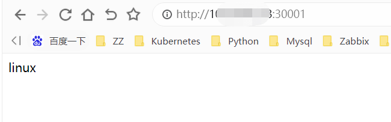


# **弹性伸缩/滚动升级**

概念：

```shell
将一个集群中正在运行的多个 Pod 版本，交替地逐一升级的过程，就是"滚动更新"。
```


实验：

```shell
[root@kub-k8s-master prome]# kubectl get deploy
NAME               READY   UP-TO-DATE   AVAILABLE   AGE
dep01              2/2     2            2           4h41m
nginx-deployment   2/2     2            2           5h13m

我们将nginx-deploument的副本数量变成4个，现在2个
[root@kub-k8s-master prome]# vim deployment.yaml  #修改如下内容
将replicas: 2
修改为：
replicas: 4
```


创建上节儿的：nginx-deployment

```shell
[root@kub-k8s-master prome]# kubectl apply -f deployment.yaml --record

--record  记录下每次操作所执行的命令，以方便后面查看
```


检查nginx-deployment 创建后的状态信息：

```shell
[root@kub-k8s-master prome]# kubectl get deploy
NAME               READY   UP-TO-DATE   AVAILABLE   AGE
dep01              2/2     2            2           4h53m
nginx-deployment   4/4     4            4           5h25m
```


返回结果中四个状态字段含义：

```shell
NAME:
名称

READY：
当前处于 Running 状态的 Pod 的个数；

UP-TO-DATE：
当前处于最新版本的 Pod 的个数，所谓最新版本指的是 Pod 的 Spec 部分与 Deployment 里 Pod 模板里定义的完全一致；

AVAILABLE：
当前已经可用的 Pod 的个数，即：既是 Running 状态，又是最新版本，并且已经处于 Ready（健康检查正确）状态的 Pod 的个数。只有这个字段，描述的才是用户所期望的最终状态。
```


修改 Deployment：

```shell
[root@kub-k8s-master prome]# kubectl get deploy
NAME               READY   UP-TO-DATE   AVAILABLE   AGE
dep01              2/2     2            2           4h59m
nginx-deployment   4/4     4            4           5h32m

将dep01的副本将2变为3个
[root@kub-k8s-master prome]# kubectl edit deployment dep01

# reopened with the relevant failures.
#
apiVersion: apps/v1
...
spec:
  progressDeadlineSeconds: 600
  replicas: 3   #将这里原来的2改为3
  revisionHistoryLimit: 10
  selector:
    matchLabels:
...
保存退出，vim的方式
[root@kub-k8s-master prome]# kubectl edit deployment/dep01
deployment.apps/dep01 edited
```


```shell
[root@kub-k8s-master prome]# kubectl get deploy
NAME               READY   UP-TO-DATE   AVAILABLE   AGE
dep01              3/3     3            3           5h16m
nginx-deployment   4/4     4            4           5h48m
```


进行版本的升级

```shell
创建一个新的deploy
[root@kub-k8s-master prome]# cp nginx-depl.yml nginx-depl02.yml
[root@kub-k8s-master prome]# vim nginx-depl02.yml
apiVersion: apps/v1
kind: Deployment
metadata:
  name: dep02 #注意修改
spec:
  selector:
    matchLabels:
      app: web1
  replicas: 2
  template:
      metadata:
        name: testnginx9
        labels:
          app: web1
      spec:
        containers:
          - name: testnginx9
            image: daocloud.io/library/nginx:1.14 #注意修改
            ports:
              - containerPort: 80
[root@kub-k8s-master prome]# kubectl apply -f nginx-depl02.yml 
deployment.apps/dep02 created
[root@kub-k8s-master prome]# kubectl get pods
NAME                                READY   STATUS    RESTARTS   AGE
dep01-58f6d4d4cb-997jw              1/1     Running   0          16m
dep01-58f6d4d4cb-g6vtg              1/1     Running   0          5h32m
dep02-78dbd944fc-47czr              1/1     Running   0          44s
dep02-78dbd944fc-4snsj              1/1     Running   0          25s

[root@k8s-node1 ~]# docker exec -it 7e491bb33dcd  /bin/bash
root@dep02-8594cd6447-z5mzs:/# nginx -v
nginx version: nginx/1.14.2

将nginx的版本从1.14升级到1.16
[root@kub-k8s-master prome]# kubectl edit deployment/dep02
# Please edit the object below. Lines beginning with a '#' will be ignored,
# and an empty file will abort the edit. If an error occurs while saving this file will be
...
spec:
      containers:
      - image: daocloud.io/library/nginx:1.16  #将这里原来的nginx:1.14修改为nginx:1.16
        imagePullPolicy: Always
        name: testnginx9
        ports:
        - containerPort: 80
...
保存退出，vim的方式
[root@kub-k8s-master prome]# kubectl edit deployment/dep01
deployment.apps/dep01 edited
```


这时可以通过查看 Deployment 的 Events，看到这个"滚动更新"的流程：

```shell
[root@kub-k8s-master prome]# kubectl describe deployment dep02
...
Events:
  Type    Reason             Age   From                   Message
  ----    ------             ----  ----                   -------
  Normal  ScalingReplicaSet  50s   deployment-controller  Scaled up replica set dep02-846bf8775b to 2
  Normal  ScalingReplicaSet  9s    deployment-controller  Scaled up replica set dep02-58f8d5678 to 1
  Normal  ScalingReplicaSet  8s    deployment-controller  Scaled down replica set dep02-846bf8775b to 1
  Normal  ScalingReplicaSet  8s    deployment-controller  Scaled up replica set dep02-58f8d5678 to 2
  Normal  ScalingReplicaSet  5s    deployment-controller  Scaled down replica set dep02-846bf8775b to 0
```


```shell
如此交替进行，新 ReplicaSet 管理的 Pod 副本数，从 0 个变成 1 个，再变成 2 个，最后变成 3 个。而旧的 ReplicaSet 管理的 Pod 副本数则从 3 个变成 2 个，再变成 1 个，最后变成 0 个。这样，就完成了这一组 Pod 的版本升级过程。
```


验证

```shell
[root@kub-k8s-master prome]# kubectl get pods
NAME                                READY   STATUS    RESTARTS   AGE
dep02-78dbd944fc-69t8x              1/1     Running   0          11h
dep02-78dbd944fc-7cn86              1/1     Running   0          11h
[root@kub-k8s-master prome]# kubectl exec -it dep02-78dbd944fc-69t8x /bin/bash 
root@dep02-78dbd944fc-69t8x:/# nginx -v 
nginx version: nginx/1.16.1
root@dep02-78dbd944fc-69t8x:/# exit
```


"滚动更新"的好处：


   在升级刚开始的时候，集群里只有 1 个新版本的 Pod。如果这时，新版本 Pod 有问题启动不起来，那么"滚动更新"就会停止，从而允许开发和运维人员介入。而在这个过程中，由于应用本身还有两个旧版本的 Pod 在线，所以服务并不会受到太大的影响。


# **版本回滚**


**查看版本历史**

```shell
[root@kub-k8s-master prome]# kubectl rollout history deployment/dep02
deployment.apps/dep02 
REVISION  CHANGE-CAUSE
1         <none>
2         <none>
```


**回滚到以前的旧版本：**

   把整个 Deployment 回滚到上一个版本：

```shell
[root@kub-k8s-master prome]# kubectl rollout undo deployment dep02
deployment.apps/dep02 rolled back
```


查看回滚状态

```shell
[root@kub-k8s-master prome]# kubectl rollout status deployment/dep02
deployment "dep02" successfully rolled out
```


验证：

```shell
[root@kub-k8s-master prome]# kubectl get pods
NAME                                READY   STATUS             RESTARTS   AGE
dep02-8594cd6447-pqtxk              1/1     Running            0          55s
dep02-8594cd6447-tt4h4              1/1     Running            0          51s
[root@kub-k8s-master prome]# kubectl exec -it dep02-8594cd6447-tt4h4 /bin/bash 
root@dep02-8594cd6447-tt4h4:/# nginx -v 
nginx version: nginx/1.14.2
```


**回滚到更早之前的版本:**


1. 使用 kubectl rollout history 命令查看每次 Deployment 变更对应的版本。

```shell
[root@kub-k8s-master prome]# kubectl rollout history deployment/dep02
deployment.apps/dep02
REVISION  CHANGE-CAUSE
2         <none>
3         <none>
```


**由于在创建这个 Deployment 的时候，指定了--record 参数，所以创建这些版本时执行的 kubectl 命令，都会被记录下来。**


 查看每个版本对应的 Deployment 的 API 对象的细节：

```shell
[root@kub-k8s-master prome]# kubectl rollout history deployment/dep02 --revision=3
deployment.apps/dep02 with revision #3
Pod Template:
  Labels:	app=web1
	pod-template-hash=8594cd6447
  Containers:
   testnginx9:
    Image:	daocloud.io/library/nginx:1.14
    Port:	80/TCP
    Host Port:	0/TCP
    Environment:	<none>
    Mounts:	<none>
  Volumes:	<none>
```


**2.在 kubectl rollout undo 命令行最后，加上要回滚到的指定版本的版本号，就可以回滚到指定版本了。**

```shell
[root@kub-k8s-master prome]# kubectl rollout undo deployment/dep02 --to-revision=2
```


验证：

```shell
[root@kub-k8s-master prome]# kubectl get pods
NAME                                READY   STATUS             RESTARTS   AGE
dep02-78dbd944fc-8nvxl              1/1     Running            0          86s
dep02-78dbd944fc-sb9sj              1/1     Running            0          88s
[root@kub-k8s-master prome]# kubectl exec -it dep02-78dbd944fc-8nvxl /bin/bash 
root@dep02-78dbd944fc-8nvxl:/# nginx -v
nginx version: nginx/1.16.1
```


课后了解

你听说过金丝雀发布（Canary Deployment）和蓝绿发布（Blue-Green Deployment）吗？你能说出它们是什么意思吗？


# **部署DASHBOARD应用**

pod  页面应用提权<----- serviceacoount<-->clusterrole(pod,svc,ns,secret....     ;  get list watch delete create ...)

pod  页面应用    ---> default命名空间下：nginx pod

nodePort

```shell
注意：最后部署成功之后，因为有5种方式访问dashboard：我们这里只使用Nodport方式访问
1. Nodport方式访问dashboard，service类型改为NodePort
2. loadbalancer方式，service类型改为loadbalacer
3. Ingress方式访问dashboard
4. API server方式访问 dashboard
5. kubectl proxy方式访问dashboard
```


**1.下载yaml文件：**

```shell
可以自己下载，也可以使用子目录中的内容自己创建
[root@kub-k8s-master ~]# wget https://raw.githubusercontent.com/kubernetes/dashboard/v2.4.0/aio/deploy/recommended.yaml

将名称空间修改为默认kube-system
[root@kub-k8s-master ~]# sed -i '/namespace/ s/kubernetes-dashboard/kube-system/g' recommended.yaml
```


**2.下载镜像**

```shell
由于yaml配置文件中指定的镜像
node节点机器都下载镜像，不下载，node节点会自动拉取
[root@kub-k8s-master ~]# docker pull kubernetesui/dashboard:v2.4.0
[root@kub-k8s-master ~]# docker pull kubernetesui/metrics-scraper:v1.0.7
```


**3.修改yaml文件**

```shell
NodePort方式：为了便于本地访问，修改yaml文件，将service改为NodePort 类型：
[root@kub-k8s-master ~]# vim recommended.yaml
...
30 ---
 31 
 32 kind: Service
 33 apiVersion: v1
 34 metadata:
 35   labels:
 36     k8s-app: kubernetes-dashboard
 37   name: kubernetes-dashboard
 38   namespace: kube-system
 39 spec:
 40   type: NodePort   #增加type: NodePort
 41   ports:
 42     - port: 443
 43       targetPort: 8443
 44       nodePort: 31260  #增加nodePort: 31260
 45   selector:
 46     k8s-app: kubernetes-dashboard
 47 
 48 ---
```


**4.创建应用：**


```shell
[root@kub-k8s-master ~]# kubectl apply -f recommended.yaml
namespace/kubernetes-dashboard created
serviceaccount/kubernetes-dashboard created
service/kubernetes-dashboard created
secret/kubernetes-dashboard-certs created
secret/kubernetes-dashboard-csrf created
secret/kubernetes-dashboard-key-holder created
configmap/kubernetes-dashboard-settings created
role.rbac.authorization.k8s.io/kubernetes-dashboard created
clusterrole.rbac.authorization.k8s.io/kubernetes-dashboard created
rolebinding.rbac.authorization.k8s.io/kubernetes-dashboard created
clusterrolebinding.rbac.authorization.k8s.io/kubernetes-dashboard created
deployment.apps/kubernetes-dashboard created
service/dashboard-metrics-scraper created
deployment.apps/dashboard-metrics-scraper created
```


**查看Pod 的状态为running说明dashboard已经部署成功：**


```shell
[root@kub-k8s-master ~]# kubectl get pod -n kube-system -o wide | grep dashboard
```


**Dashboard 会在 kube-system namespace 中创建自己的 Deployment 和 Service：**


```shell
[root@kub-k8s-master ~]# kubectl get deployment kubernetes-dashboard -n kube-system
```


```shell
[root@kub-k8s-master ~]# kubectl get service kubernetes-dashboard -n kube-system
```


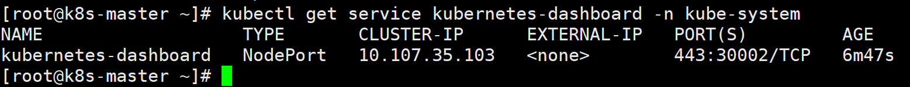


**5.访问dashboard**


官方参考文档：


https://kubernetes.io/docs/tasks/access-application-cluster/web-ui-dashboard/#accessing-the-dashboard-ui


查看service，TYPE类型已经变为NodePort，端口为31260


```shell
[root@kub-k8s-master ~]# kubectl get service -n kube-system | grep dashboard
kubernetes-dashboard   NodePort    10.108.97.179   <none>        443:31260/TCP            101s
```


查看dashboard运行在那台机器上面


```shell
[root@kub-k8s-master ~]# kubectl get pods -n kube-system -o wide
```


通过浏览器访问：[https://nodeIP:31260](https://master:31260)


因为我的应用运行在node上，又是NodePort方式，所以直接访问node的地址


登录界面如下：如果不行，请更换浏览器

https://10.8.166.231:31260/


**Dashboard 支持 Kubeconfig 和 Token 两种认证方式，这里选择Token认证方式登录：**


上面的Token先空着，不要往下点，接下来制作token


**创建登录用户**


官方参考文档：


https://github.com/kubernetes/dashboard/wiki/Creating-sample-user


**创建dashboard-adminuser.yaml：**


```shell
[root@kub-k8s-master ~]# vim dashboard-adminuser.yaml
---
apiVersion: v1
kind: ServiceAccount
metadata:
  name: admin-user
  namespace: kube-system
---
apiVersion: rbac.authorization.k8s.io/v1
kind: ClusterRoleBinding
metadata:
  name: admin-user
roleRef:
  apiGroup: rbac.authorization.k8s.io
  kind: ClusterRole
  name: cluster-admin
subjects:
- kind: ServiceAccount
  name: admin-user
  namespace: kube-system
```


**执行yaml文件：**


```shell
[root@kub-k8s-master ~]# kubectl create -f dashboard-adminuser.yaml
```


说明：上面创建了一个叫admin-user的服务账号，并放在kube-system命名空间下，并将cluster-admin角色绑定到admin-user账户，这样admin-user账户就有了管理员的权限。默认情况下，kubeadm创建集群时已经创建了cluster-admin角色，直接绑定即可。


**查看admin-user账户的token**

```shell
[root@kub-k8s-master ~]# kubectl -n kube-system describe secret $(kubectl -n kube-system get secret | grep admin-user | awk '{print $1}')
```


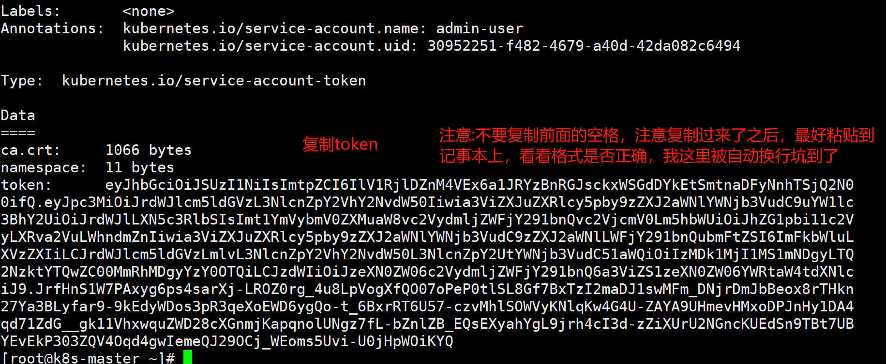


**把获取到的Token复制到登录界面的Token输入框中:**


**成功登陆dashboard:**


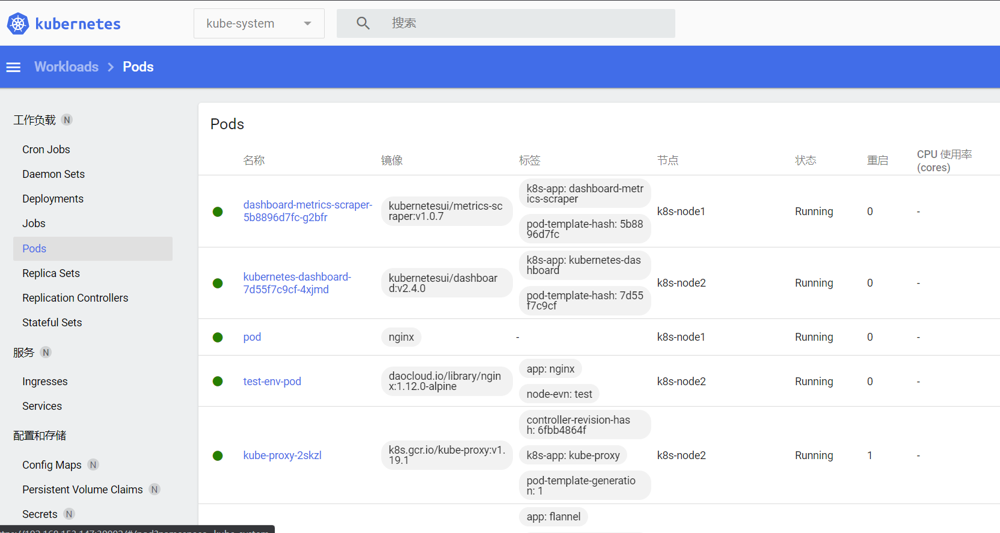


使用Dashboard


Dashboard 界面结构分为三个大的区域:


1.  顶部操作区，在这里用户可以搜索集群中的资源、创建资源或退出。 
2.  左边导航菜单，通过导航菜单可以查看和管理集群中的各种资源。菜单项按照资源的层级分为两类：Cluster 级别的资源 ，Namespace 级别的资源 ，默认显示的是 default Namespace，可以进行切换 
3.  中间主体区，在导航菜单中点击了某类资源，中间主体区就会显示该资源所有实例，比如点击 Pods。 


# K8s持久化存储PV和PVC

## 1.PV和PVC的引入

```plain
Volume 提供了非常好的数据持久化方案，不过在可管理性上还有不足。
拿前面 AWS EBS 的例子来说，要使用 Volume，Pod 必须事先知道如下信息：
当前 Volume 来自 AWS EBS。
EBS Volume 已经提前创建，并且知道确切的 volume-id。
Pod 通常是由应用的开发人员维护，而 Volume 则通常是由存储系统的管理员维护。开发人员要获得上面的信息：
要么询问管理员。
要么自己就是管理员。
这样就带来一个管理上的问题：应用开发人员和系统管理员的职责耦合在一起了。如果系统规模较小或者对于开发环境这样的情况还可以接受。但当集群规模变大，特别是对于生成环境，考虑到效率和安全性，这就成了必须要解决的问题。

Kubernetes 给出的解决方案是 PersistentVolume 和 PersistentVolumeClaim。
PersistentVolume (PV) 是外部存储系统中的一块存储空间，由管理员创建和维护。与 Volume 一样，PV 具有持久性，生命周期独立于 Pod。
PersistentVolumeClaim (PVC) 是对 PV 的申请 (Claim)。PVC 通常由普通用户创建和维护。需要为 Pod 分配存储资源时，用户可以创建一个 PVC，指明存储资源的容量大小和访问模式（比如只读）等信息，Kubernetes 会查找并提供满足条件的 PV。
有了 PersistentVolumeClaim，用户只需要告诉 Kubernetes 需要什么样的存储资源，而不必关心真正的空间从哪里分配，如何访问等底层细节信息。这些 Storage Provider 的底层信息交给管理员来处理，只有管理员才应该关心创建 PersistentVolume 的细节信息。
```

## 2.通过NFS实现持久化存储

### 2.1 配置nfs

k8s-master nfs-server

k8s-node1 k8s-node2 nfs-client

所有节点安装nfs

```shell
yum install -y nfs-common nfs-utils
```


在nfs-server节点创建共享目录

```shell
[root@k8s-master k8s]# mkdir /nfsdata
```


授权共享目录

```shell
[root@k8s-master k8s]# chmod 666 /nfsdata
```


编辑exports文件

```shell
[root@k8s-master k8s]# vim /etc/exports
/nfsdata *(rw,no_root_squash,no_all_squash,sync)
```


**配置生效**

**启动rpc和nfs（注意顺序）**

```shell
[root@k8s-master k8s]# systemctl start rpcbind
[root@k8s-master k8s]# systemctl start nfs
```


作为准备工作，我们已经在 k8s-master 节点上搭建了一个 NFS 服务器，目录为 `/nfsdata`：


测试NFS挂载是否可用

```shell
[root@k8s-node2 ~]# mkdir /test
[root@k8s-node2 ~]# mount -t nfs 10.8.166.252:/nfsdata /test/
[root@k8s-node2 ~]# df -Th|grep "/test"
10.8.166.252:/nfsdata   nfs4       19G  9.9G  9.0G  53% /test
[root@k8s-node2 ~]# touch /test/ip.txt
[root@k8s-node2 ~]# ls /test/
ip.txt
```

来到nfs-server查看，成功

```shell
[root@k8s-master ~]# ls /nfsdata/
ip.txt

[root@k8s-node2 ~]# umount /test  #测试完成之后，就可以卸载了
```

### 2.2 创建PV

下面创建一个 PV `mypv1`，配置文件 `nfs-pv1.yml` 如下：

```shell
[root@k8s-master ~]# vim nfs-pv1.yml 
apiVersion: v1
kind: PersistentVolume
metadata:
  name: mypv1
spec:
  capacity:
    storage: 1Gi
  accessModes:
    - ReadWriteOnce
  persistentVolumeReclaimPolicy: Recycle
  storageClassName: nfs
  nfs:
    path: /nfsdata
    server: 192.168.153.148  #指定nfs目录所在的机器的地址
```


① `capacity` 指定 PV 的容量为 1G。


② `accessModes` 指定访问模式为 `ReadWriteOnce`，支持的访问模式有：
ReadWriteOnce – PV 能以 read-write 模式 mount 到单个节点。
ReadOnlyMany – PV 能以 read-only 模式 mount 到多个节点。
ReadWriteMany – PV 能以 read-write 模式 mount 到多个节点。


③ `persistentVolumeReclaimPolicy` 指定当 PV 的回收策略为 `Recycle`，支持的策略有：
Retain – 需要管理员手工回收。
Recycle – 清除 PV 中的数据，效果相当于执行 `rm -rf /nfsdata/*`。
Delete – 删除 Storage Provider 上的对应存储资源，例如 AWS EBS、GCE PD、Azure Disk、OpenStack Cinder Volume 等。


④ `storageClassName` 指定 PV 的 class 为 `nfs`。相当于为 PV 设置了一个分类，PVC 可以指定 class 申请相应 class 的 PV。


⑤ 指定 PV 在 NFS 服务器上对应的目录。


创建 `mypv1`：


```shell
[root@k8s-master ~]# kubectl apply -f nfs-pv1.yml
```


`STATUS` 为 `Available`，表示 `mypv1` 就绪，可以被 PVC 申请。

### 2.3 创建PVC

接下来创建 PVC `mypvc1`，配置文件 `nfs-pvc1.yml` 如下：

```shell
[root@k8s-master ~]# cat nfs-pvc1.yml 
apiVersion: v1
kind: PersistentVolumeClaim
metadata:
  name: mypvc1
spec:
  accessModes:
    - ReadWriteOnce
  resources:
    requests:
      storage: 1Gi
  storageClassName: nfs
```


PVC 就很简单了，只需要指定 PV 的容量，访问模式和 class。


执行命令创建 `mypvc1`：


```shell
[root@k8s-master ~]# kubectl apply -f nfs-pvc1.yml
```


从 `kubectl get pvc` 和 `kubectl get pv` 的输出可以看到 `mypvc1` 已经 Bound 到 `mypv1`，申请成功。


### 2.4 创建pod

上面已经创建好了pv和pvc，pod中直接使用这个pvc即可

```shell
[root@k8s-master ~]# cat pod1.yml 
apiVersion: v1
kind: Pod
metadata:
  name: mypod1
  labels:
    app: youngfit
spec:
  containers:
    - name: mypod1
      image: 10.8.166.241/nginx/nginx:v1.1
      ports:
      - containerPort: 80
      volumeMounts:
      - mountPath: "/usr/share/nginx/html"
        name: mydata
  volumes:
   - name: mydata
     persistentVolumeClaim:
       claimName: mypvc1
```


与使用普通 Volume 的格式类似，在 `volumes` 中通过 `persistentVolumeClaim` 指定使用 `mypvc1` 申请的 Volume。


通过命令创建`mypod1`：

```shell
[root@k8s-master ~]# kubectl apply -f pod1.yml
```


### 2.5验证

```shell
[root@k8s-master ~]# kubectl exec -it mypod1 /bin/sh
/ # ls /usr/share/nginx/html
/ # echo "youngfit shuai" > /usr/share/nginx/html/index.html

[root@k8s-master ~]# ls /nfsdata/    #也可在nfs的共享目录中查看到，说明卷共享成功
index.html
[root@k8s-master ~]# cat /nfsdata/index.html 
youngfit shuai
可见，在 Pod 中创建的文件 /usr/share/nginx/html/index.html 确实已经保存到了 NFS 服务器目录 /nfsdata中。
如果不再需要使用 PV，可用删除 PVC 回收 PV。

在这里，可以尝试在任何一方删除文件，文件在两端都会消失；
```

### 2.6访问测试和暴露

```shell
[root@k8s-master ~]# chmod 777 /nfsdata/index.html
```


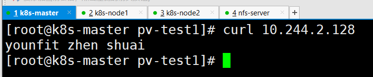

```shell
[root@k8s-master ~]# cat nginx-svc.yml 
kind: Service
apiVersion: v1
metadata:
  name: youngfitsvc
spec:
  type: NodePort
  ports:
    - nodePort: 30011
      port: 8085
      targetPort: 80
  selector:
    app: youngfit
```


## 3.PV的回收

当 PV 不再需要时，可通过删除 Pod, PVC 回收。未删除pvc之前 pv的状态是Bound


删除pod

```plain
[root@k8s-master pvc]# kubectl delete pod mypod1
```


删除pvc

```plain
[root@k8s-master pvc]# kubectl delete pvc mypvc1
```


再次查看pv的状态

```shell
[root@k8s-master pvc]# kubectl get pv
```

删除pvc之后pv的状态变为Released（前提：pv回收策略是自动清除，删除的pvc之前被pod引用过），，此时解除绑定后则可以被新的 PVC 申请。

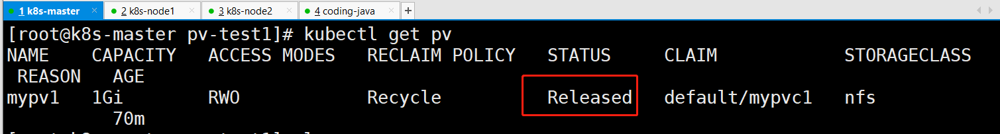

```shell
[root@k8s-master pv-test1]# kubectl apply -f nfs-pvc1.yaml
```


再次删除pvc

```shell
[root@k8s-master pv-test1]# kubectl delete pvc mypvc1
```


原来一旦删除pvc，但是现在不会了。因为Recycle策略已经被废弃。

之前 PV 的回收策略设置为 `Recycle`，所以数据会被清除，


但这可能不是我们想要的结果。如果我们希望保留数据，可以将策略设置为 `Retain`

```plain
#先将pvc和pv都清除
[root@k8s-master pv-test1]# kubectl delete -f nfs-pvc1.yaml 
[root@k8s-master pv-test1]# kubectl delete -f nfs-pv1.yaml 

#重新创建pv，将策略设置为Retain，手动回收
[root@k8s-master pvc]# vim nfs-pv1.yml
```


```plain
[root@k8s-master pvc]# kubectl apply -f nfs-pv1.yml
```


回收策略已经变为 `Retain`，通过下面步骤验证其效果：

```shell
重新创建mypvc1
[root@k8s-master pvc]# kubectl apply -f nfs-pvc1.yml
重新创建pod，引用mypvc1
[root@k8s-master pvc]# kubectl apply -f pod1.yml
进入pod中，创建文件
[root@k8s-master pvc]# kubectl exec -it mypod1 /bin/sh
/ # echo "youngfit" > /usr/share/nginx/html/index.html

在nfs目录下检验
[root@k8s-master pvc]# ls /nfsdata/
index.html
[root@k8s-master pvc]# cat /nfsdata/index.html
youngfit

删除pod
[root@k8s-master pvc]# kubectl delete -f pod1.yml 
pod "mypod1" deleted
[root@k8s-master pvc]# cat /nfsdata/index.html 
youngfit
删除pvc（mypvc1）
[root@k8s-master pvc]# kubectl delete pvc mypvc1

[root@k8s-master pvc]# cat /nfsdata/index.html 
youngfit

发现数据仍然保留
```


虽然 `mypv1` 中的数据得到了保留，但其 PV 状态会一直处于 `Released`，不能被其他 PVC 申请。为了重新使用存储资源，可以删除并重新创建 `mypv1`。删除操作只是删除了 PV 对象，存储空间中的数据并不会被删除。

```shell
[root@k8s-master pvc]# ls /nfsdata/
index.html
[root@k8s-master pvc]# kubectl delete pv mypv1
persistentvolume "mypv1" deleted
[root@k8s-master pvc]# ls /nfsdata/
index.html
[root@k8s-master pvc]# kubectl apply -f nfs-pv1.yml 
persistentvolume/mypv1 created
[root@k8s-master pvc]# kubectl get pv
```


新建的 `mypv1` 状态为 `Available`，已经可以被 PVC 申请。

PV 还支持 `Delete` 的回收策略，会删除 PV 在 Storage Provider 上对应存储空间。NFS 的 PV 不支持 `Delete`，支持 `Delete` 的 Provider 有 AWS EBS、GCE PD、Azure Disk、OpenStack Cinder Volume 等。

## 4. PV/PVC的静态供应

```shell
所有节点下载nfs
yum install -y nfs-common nfs-utils 

master节点作为nfs服务端
[root@k8s-master k8s]# cat /etc/exports
/data/opv *(rw,no_root_squash,no_all_squash,sync)
[root@k8s-master k8s]# mkdir /data/opv
[root@k8s-master k8s]# chmod 777 -R /data/opv
[root@docker-server ~]# systemctl restart nfs

master节点操作
#1.定义pv
[root@k8s-master pvc2]# cat pv-pod.yaml 
apiVersion: v1
kind: PersistentVolume
metadata:
  name: my-pv
spec:
  capacity:
    storage: 1Gi
  accessModes:
    - ReadWriteMany
  nfs:
    path: /data/opv  #nfs服务端共享的目录
    server: 192.168.153.148   #nfs服务器的地址
[root@k8s-master pvc2]# kubectl apply -f pv-pod.yaml

#2.定义pvc和deployment
[root@k8s-master pvc2]# cat pvc-pod.yaml 
apiVersion: apps/v1
kind: Deployment
metadata:
  name: nginx-deployment
spec:
  replicas: 2
  selector:
    matchLabels:
      app: nginx
  template:
    metadata:
      labels:
        app: nginx
    spec:
      containers:
      - name: nginx
        image: daocloud.io/library/nginx
        #启用数据卷的名字为wwwroot,并挂载到nginx的html目录下
        volumeMounts:
        - name: wwwroot
          mountPath: /usr/share/nginx/html
        ports:
        - containerPort: 80
    #定义数据卷名字为wwwroot,类型为pvc
      volumes:
      - name: wwwroot
        persistentVolumeClaim:
          claimName: my-pvc


---
# 定义pvc的数据来源,根据容量大小来匹配pv
apiVersion: v1
kind: PersistentVolumeClaim
metadata:
  #对应上面的名字
  name: my-pvc
spec:
  accessModes:
    - ReadWriteMany
  resources:
    requests:
      storage: 1G
[root@k8s-master pvc2]# kubectl apply -f pvc-pod.yaml

#3，暴露一下端口
[root@k8s-master pvc2]# cat pv-service.yaml 
apiVersion: v1
kind: Service
metadata:
  name: pv-svc
spec:
  type: NodePort
  ports:
    - port: 8080
      nodePort: 30001
      targetPort: 80
  selector:   #选择器
    app: nginx

#4.nfs服务器操作
[root@k8s-master pvc2]# echo youngfit >> /data/opv/index.html 
#5.访问，看效果
```


## 5.PV的动态供应

前面的例子中，我们提前创建了 PV，然后通过 PVC 申请 PV 并在 Pod 中使用，这种方式叫做静态供应（Static Provision）。


与之对应的是动态供应（Dynamical Provision），即如果没有满足 PVC 条件的 PV，会动态创建 PV。相比静态供给，动态供给有明显的优势：不需要提前创建 PV，减少了管理员的工作量，效率高。


动态供给是通过 StorageClass 实现的，StorageClass 定义了如何创建 PV，下面是两个例子。


StorageClass `standard`


StorageClass `slow`：


这两个 StorageClass 都会动态创建 AWS EBS，不同在于 `standard` 创建的是 `gp2` 类型的 EBS，而 `slow` 创建的是 `io1` 类型的 EBS。不同类型的 EBS 支持的参数可参考 AWS 官方文档。


StorageClass 支持 `Delete` 和 `Retain` 两种 `reclaimPolicy`，默认是 `Delete`。


与之前一样，PVC 在申请 PV 时，只需要指定 StorageClass 和容量以及访问模式，比如：


除了 AWS EBS，Kubernetes 支持其他多种动态供给 PV 的 Provisioner，完整列表请参考 https://kubernetes.io/docs/concepts/storage/storage-classes/#provisioner


## 6.PV&PVC在应用中的持久化存储


```shell
[root@k8s-master pv]# kubectl delete -f pod1.yml
[root@k8s-master pv]# cat pod1.yml 
apiVersion: apps/v1
kind: Deployment
metadata:
  name: mydep
spec:
  selector:
    matchLabels:
      app: busy
  replicas: 1
  template:
    metadata:
      labels:
        app: busy
    spec:
      containers:
        - name: mypod1
          image: busybox
          args:
          - /bin/sh
          - -c
          - sleep 30000
          volumeMounts:
          - mountPath: "/mydata"
            name: mydata
      volumes:
        - name: mydata
          persistentVolumeClaim:
            claimName: mypvc1
            
[root@k8s-master pv]# kubectl apply -f pod1.yml 
[root@k8s-master pv]# kubectl exec -it mydep-6b4f9c68b9-mqtcl /bin/sh
/ # echo youngfit > mydata/qf.txt
/ # exit
```


查看pod运行在了哪个节点，将节点关闭。发现另外一个节点，会接手，而且数据仍然存在


## 7.PV&PVC在应用在Mysql的持久化存储实战项目


下面演示如何为 MySQL 数据库提供持久化存储，步骤为：


1. 创建 PV 和 PVC。
2. 部署 MySQL。
3. 向 MySQL 添加数据。
4. 模拟节点宕机故障，Kubernetes 将 MySQL 自动迁移到其他节点。
5. 验证数据一致性。


首先创建 PV 和 PVC，配置如下：


mysql-pv.yml

```shell
[root@k8s-master mysqlpv]# cat mysql-pv.yml 
apiVersion: v1
kind: PersistentVolume
metadata:
  name: mysql-pv
spec:
  capacity:
    storage: 1Gi
  accessModes:
    - ReadWriteOnce
  persistentVolumeReclaimPolicy: Retain
  storageClassName: nfs
  nfs:
    path: /nfsdata/mysql-pv
    server: 192.168.153.148
[root@k8s-master mysqlpv]# kubectl apply -f mysqlpv.yml
```


mysql-pvc.yml

```shell
[root@k8s-master mysqlpv]# cat mysql-pvc.yml 
apiVersion: v1
kind: PersistentVolumeClaim
metadata:
  name: mysql-pvc
spec:
  accessModes:
    - ReadWriteOnce
  resources:
    requests:
      storage: 1Gi
  storageClassName: nfs

[root@k8s-master mysqlpv]# kubectl apply -f mysql-pvc.yml
```


接下来部署 MySQL，配置文件如下：

```yaml
[root@k8s-master mysqlpv]# cat mysqlpod.yml 
apiVersion: v1
kind: Service
metadata:
  name: mysql
spec:
  ports:
  - port: 3306
  selector:
    app: mysql
---
apiVersion: apps/v1
kind: Deployment
metadata:
  name: mysql
spec:
  selector:
    matchLabels:
      app: mysql
  template:
    metadata:
      labels:
        app: mysql
    spec:
      containers:
      - image: daocloud.io/library/mysql:5.7.5-m15 #这里的镜像一定要选对，能确保拉取到，而且能使用变量
        name: mysql
        env:
        - name: MYSQL_ROOT_PASSWORD
          value: password
        ports:
        - containerPort: 3306
          name: mysql
        volumeMounts:
        - name: mysql-persistent-storage
          mountPath: /var/lib/mysql
      volumes:
      - name: mysql-persistent-storage
        persistentVolumeClaim:
          claimName: mysql-pvc
          
[root@k8s-master mysqlpv]# kubectl apply -f mysqlpod.yml
```


PVC `mysql-pvc` Bound 的 PV `mysql-pv` 将被 mount 到 MySQL 的数据目录 `/var/lib/mysql`。


MySQL 被部署到 `k8s-node1`


① 切换到数据库 mysql。


② 创建数据库表 my_id。


③ 插入一条数据。


④ 确认数据已经写入。


关闭 `k8s-node1`，模拟节点宕机故障。


```shell
[root@k8s-master mysqlpv]# kubectl exec -it mysql-6654fcb867-mqtcl /bin/bash
root@mysql-6654fcb867-mqtcl:/# mysql -uroot -p'password'
mysql> create database feige;
mysql> create table feige.t1(id int);
mysql> insert into feige.t1 values(2);
```


```plain
[root@k8s-node1 ~]# poweroff
```


验证数据的一致性：

第一种：

删除deployment，pvc，pv；然后重新创建pv，pvc，deployment；数据在Mysql中，仍然挂载成功；

第二种：

由于node1节点已经宕机，node2节点接管了这个任务,pod转移，需要等待一段时间，我这里等待了8分钟左右。。


```shell
进入新的pod中，数据仍然存在，持久化成功。很安全
[root@k8s-master mysqlpv]# kubectl exec -it mysql-6654fcb867-mqtcl /bin/bash
root@mysql-6654fcb867-mqtcl:/# mysql -uroot -p'password'
mysql> select * from feige.t1;
+------+
| id   |
+------+
|    1 |
|    2 |
+------+
2 rows in set (0.01 sec)
```


MySQL 服务恢复，数据也完好无损。


## 8.PV/PVC动态供应项目实战

提前说明：由于本次动态实战，我在v1.22.2版本中，尝试多次未成功，采用了v1.19.0版本的k8s集群；


Dynamic Provisioning机制工作的核心在于StorageClass的API对象。
StorageClass声明存储插件，用于自动创建PV


当我们k8s业务上来的时候，大量的pvc,此时我们人工创建匹配的话，工作量就会非常大了，需要动态的自动挂载相应的存储。
我们需要使用到StorageClass，来对接存储，靠他来自动关联pvc,并创建pv。
Kubernetes支持动态供给的存储插件：
https://kubernetes.io/docs/concepts/storage/storage-classes/
因为NFS不支持动态存储，所以我们需要借用这个存储插件。
nfs动态相关部署可以参考：
https://github.com/kubernetes-incubator/external-storage/tree/master/nfs-client/deploy
部署步骤：


### 8.0部署nfs

```shell
3个节点都下载：
# yum -y install nfs-utils rpcbind
主节点配置nfs服务端
[root@master pvc-test]# mkdir /opt/container_data
[root@master pvc-test]# chmod 777  -R /opt/container_data
[root@master pvc-test]# cat /etc/exports
/opt/container_data *(rw,no_root_squash,no_all_squash,sync)
[root@master pvc-test]# systemctl start rpcbind
[root@master pvc-test]# systemctl restart nfs
```


### 8.1定义一个storage

```shell
[root@master pvc-test]# cat storageclass-nfs.yaml 
apiVersion: storage.k8s.io/v1
kind: StorageClass
metadata:
  name: managed-nfs-storage
provisioner: fuseim.pri/ifs
```


### 8.2部署授权

因为storage自动创建pv需要经过kube-apiserver,所以要进行授权

创建1个sa(serviceaccount)

创建1个clusterrole，并赋予应该具有的权限，比如对于一些基本api资源的增删改查；

创建1个clusterrolebinding，将sa和clusterrole绑定到一起；这样sa就有权限了；

然后pod中再使用这个sa，那么pod再创建的时候，会用到sa，sa具有创建pv的权限，便可以自动创建pv；

```shell
[root@master pvc-test]# cat rbac.yaml 
apiVersion: v1
kind: ServiceAccount
metadata:
  name: nfs-client-provisioner

---

kind: ClusterRole
apiVersion: rbac.authorization.k8s.io/v1
metadata:
  name: nfs-client-provisioner-runner
rules:
  - apiGroups: [""]
    resources: ["persistentvolumes"]
    verbs: ["get", "list", "watch", "create", "delete"]
  - apiGroups: [""]
    resources: ["persistentvolumeclaims"]
    verbs: ["get", "list", "watch", "update"]
  - apiGroups: ["storage.k8s.io"]
    resources: ["storageclasses"]
    verbs: ["get", "list", "watch"]
  - apiGroups: [""]
    resources: ["events"]
    verbs: ["list", "watch", "create", "update", "patch"]
---

kind: ClusterRoleBinding
apiVersion: rbac.authorization.k8s.io/v1
metadata:
  name: run-nfs-client-provisioner
subjects:
  - kind: ServiceAccount
    name: nfs-client-provisioner
    namespace: default
roleRef:
  kind: ClusterRole
  name: nfs-client-provisioner-runner
  apiGroup: rbac.authorization.k8s.io
```


### 8.3部署一个自动创建pv的pod服务

这里自动创建pv的服务由nfs-client-provisioner 完成

```shell
[root@master pvc-test]# cat deployment-nfs.yaml 
kind: Deployment
apiVersion: apps/v1
metadata:
  name: nfs-client-provisioner
spec:
  selector:
    matchLabels:
      app: nfs-client-provisioner
  replicas: 1
  strategy: 
    type: Recreate
  template:
    metadata:
      labels:
        app: nfs-client-provisioner
    spec:
    #  imagePullSecrets:
    #    - name: registry-pull-secret
      serviceAccount: nfs-client-provisioner
      containers:
        - name: nfs-client-provisioner
          #image: quay.io/external_storage/nfs-client-provisioner:latest
          image: lizhenliang/nfs-client-provisioner:v2.0.0
          volumeMounts:
            - name: nfs-client-root
              mountPath: /persistentvolumes
          env:
            - name: PROVISIONER_NAME
              #这个值是定义storage里面的那个值
              value: fuseim.pri/ifs
            - name: NFS_SERVER
              value: 172.17.0.21
            - name: NFS_PATH
              value: /opt/container_data
      volumes:
        - name: nfs-client-root
          nfs:
            server: 172.17.0.21
            path: /opt/container_data
            
参数解释：            
  strategy: 
    type: Recreate   
==========================================================================================
Recreate：设置spec.strategy.type=Recreate，该策略下将杀掉正在运行的Pod，然后创建新的。
RollingUpdate：设置spec.strategy.type=RollingUpdate，滚动更新，即逐渐减少旧Pod的同时逐渐增加新Pod。
其中默认的RollingUpdate滚动更新策略的“边删除边更新”保证了在更新期间的服务可用性，在使用这个策略时，有两个可定义参数：
spec.strategy.RollingUpdate.maxUnavailable：更新过程中Pod数量可以低于Pod期望副本的数量或百分比（默认25%）
spec.strategy.RollingUpdate.maxSurge：更新过程中Pod数量可以超过Pod期望副本的数量或百分比（默认25%）
```


创建：


```shell
[root@master pvc-test]# kubectl apply -f storageclass-nfs.yaml
[root@master pvc-test]# kubectl apply -f rbac.yaml
[root@master pvc-test]# kubectl apply -f deployment-nfs.yaml
```


查看创建好的storage:


```shell
[root@master storage]# kubectl get sc
```


nfs-client-provisioner 会以pod运行在k8s中，


```shell
[root@master storage]# kubectl get pod
NAME                                      READY   STATUS    RESTARTS   AGE
nfs-client-provisioner-855887f688-hrdwj   1/1     Running   0          77s
```


4、部署有状态服务，测试自动创建pv
部署yaml文件参考：https://kubernetes.io/docs/tutorials/stateful-application/basic-stateful-set/
我们部署一个nginx服务，让其html下面自动挂载数据卷，


```shell
[root@master pvc-test]# cat nginx.yaml
apiVersion: v1
kind: Service
metadata:
  name: nginx
  labels:
    app: nginx
spec:
  ports:
  - port: 80
    name: web
  clusterIP: None
  selector:
    app: nginx
---
apiVersion: apps/v1
kind: StatefulSet
metadata:
  name: web
spec:
  serviceName: "nginx"
  replicas: 2
  selector:
   matchLabels:
      app: nginx
  template:
    metadata:
      labels:
        app: nginx
    spec:
      containers:
      - name: nginx
        image: daocloud.io/library/nginx:1.13.0-alpine
        ports:
        - containerPort: 80
          name: web
        volumeMounts:
        - name: www
          mountPath: /usr/share/nginx/html
  volumeClaimTemplates:
  - metadata:
      name: www
    spec:
      accessModes: [ "ReadWriteOnce" ]
      storageClassName: "managed-nfs-storage"
      resources:
        requests:
          storage: 1Gi
          
[root@master pvc-test]# kubectl apply -f nginx.yaml
```


进入其中一个容器，创建一个文件：

```shell
[root@master pvc-test]# kubectl exec -it web-0 /bin/sh
# cd /usr/share/nginx/html
# touch 1.txt
```


直接在web-1的目录下，创建一个文件：


```shell
[root@master pvc-test]# touch /opt/container_data/default-www-web-1-pvc-5efd9492-c13d-414b-8df3-68b0c37961dd/2.txt
```


而且，删除一个pod  web-0，数据仍然存在，不会丢失。保证了数据持久化；


## **小结**


本章我们讨论了 Kubernetes 如何管理存储资源。


emptyDir和 hostPath 类型的 Volume 很方便，但可持久性不强，Kubernetes 支持多种外部存储系统的 Volume。


PV 和 PVC 分离了管理员和普通用户的职责，更适合生产环境。我们还学习了如何通过 StorageClass 实现更高效的动态供给。


最后，我们演示了如何在 MySQL 中使用 PersistentVolume 实现数据持久性。