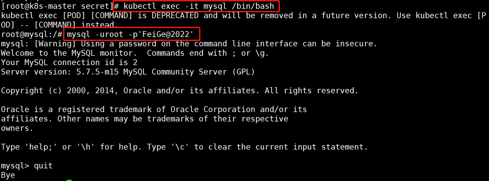

## Secret介绍

```shell
secret用来保存小片敏感数据的k8s资源对象，例如密码，token，或者秘钥。这类数据当然也可以存放在Pod或者镜像中，但是放在Secret中是为了更方便的控制如何使用数据，并减少暴露的风险。

用户可以创建自己的secret，系统也会有自己的secret。
Pod需要先引用才能使用某个secret
```


## Pod有2种方式来使用secret：

```shell
1. 作为volume的一个域被一个或多个容器挂载
2. 在拉取镜像的时候被kubelet引用。
```


內建的Secrets:

```shell
由ServiceAccount创建的API证书附加的秘钥k8s自动生成的用来访问apiserver的Secret，所有Pod会默认使用这个Secret与apiserver通信
```


创建自己的Secret:

```shell
方式1：使用kubectl create secret命令
方式2：yaml文件创建Secret
```


### 命令方式创建secret:


假如某个Pod要访问数据库，需要用户名密码，分别存放在2个文件中：username.txt，password.txt

例子：

```shell
[root@kub-k8s-master ~]# echo -n 'admin' > ./username.txt
[root@kub-k8s-master ~]# echo -n "Cloud@2204" > password.txt
```


kubectl create secret指令将用户名密码写到secret中，并在apiserver创建Secret

```shell
[root@kub-k8s-master ~]# kubectl create secret generic db-user-pass --from-file=./username.txt --from-file=./password.txt
```


查看创建结果：

```shell
[root@kub-k8s-master ~]# kubectl get secrets
NAME                  TYPE                                  DATA   AGE
db-user-pass          Opaque                                2      54s
default-token-6svwp   kubernetes.io/service-account-token   3      4d11h

注： opaque：英[əʊˈpeɪk] 美[oʊˈpeɪk]  模糊
# Opaque类型的数据是一个map类型，要求value是base64编码格式
```


查看详细信息：


```shell
[root@kub-k8s-master ~]# kubectl describe secret db-user-pass
Name:         db-user-pass
Namespace:    default
Labels:       <none>
Annotations:  <none>

Type:  Opaque

Data
====
password.txt:  12 bytes
username.txt:  5 bytes
```


describe指令不会展示secret的实际内容，这是出于对数据的保护的考虑，如果想查看实际内容使用命令：


```shell
[root@kub-k8s-master ~]# kubectl get secret db-user-pass -o yaml
```


**base64解码：**

```shell
[root@kub-k8s-master ~]# echo -n 'Q2xvdWRAMjIwNA==' | base64 --decode
Cloud@2204
```


### yaml方式创建Secret

```shell
创建一个secret.yaml文件，内容用base64编码:明文显示容易被别人发现，这里先转码。
[root@kub-k8s-master ~]# echo -n 'admin' | base64
YWRtaW4=
[root@kub-k8s-master ~]# echo -n '123456' | base64
MTIzNDU2
```


创建一个secret.yaml文件，内容用base64编码

```shell
[root@kub-k8s-master prome]# vim secret.yml  
---
apiVersion: v1
kind: Secret
metadata:
  name: mysecret
type: Opaque  #模糊
data:
  username: YWRtaW4=
  password: MTIzNDU2
```


创建：


```shell
[root@kub-k8s-master prome]# kubectl apply -f secret.yml 
secret/mysecret created
```


解析Secret中内容,还是经过编码的---需要解码


```shell
[root@kub-k8s-master ~]# kubectl get secrets
NAME                  TYPE                                  DATA   AGE
default-token-7vc82   kubernetes.io/service-account-token   3      30h
mysecret              Opaque                                2      6s

[root@kub-k8s-master prome]# kubectl get secret mysecret -o yaml -n default
apiVersion: v1
data:
  password: MWYyZDFlMmU2N2Rm
  username: YWRtaW4=
kind: Secret
metadata:
  creationTimestamp: "2019-10-21T03:07:56Z"
  name: mysecret
  namespace: default
  resourceVersion: "162855"
  selfLink: /api/v1/namespaces/default/secrets/mysecret
  uid: 36bcd07d-92eb-4755-ac0a-a5843ed986dd
type: Opaque
```


## 引用Secret

### 卷挂载

一个Pod中引用Secret的例子：

```shell
[root@kub-k8s-master prome]# vim pod_use_secret.yaml
apiVersion: v1
kind: Pod
metadata:
  name: mypod
spec:
  containers:
  - name: testredis
    image: daocloud.io/library/redis
    volumeMounts:    #挂载一个卷
    - name: foo     #这个名字需要与定义的卷的名字一致
      mountPath: "/etc/foo"  #挂载到容器里哪个目录下，随便写
      readOnly: true
  volumes:     #数据卷的定义
  - name: foo   #卷的名字这个名字自定义
    secret:    #卷是直接使用的secret。
      secretName: mysecret   #调用刚才定义的secret

创建：
[root@kub-k8s-master prome]# kubectl apply -f pod_use_secret.yaml 
pod/mypod created
[root@kub-k8s-master prome]# kubectl exec -it mypod /bin/bash
root@mypod:/data# cd /etc/foo/
root@mypod:/etc/foo# ls
password  username
root@mypod:/etc/foo# cat password 
1f2d1e2e67df
```


```shell
每一个被引用的Secret都要在spec.volumes中定义
 如果Pod中的多个容器都要引用这个Secret那么每一个容器定义中都要指定自己的volumeMounts，但是Pod定义中声明一次spec.volumes就好了。
```


### 映射secret key到指定的路径

```shell
[root@kub-k8s-master prome]# kubectl delete -f pod_use_secret.yaml

[root@kub-k8s-master prome]# vim pod_use_secret.yaml
---
apiVersion: v1
kind: Pod
metadata:
 name: mypod
spec:
 containers:
 - name: testredis
   image: daocloud.io/library/redis
   volumeMounts:
   - name: foo
     mountPath: "/etc/foo"
     readOnly: true
 volumes:
 - name: foo
   secret:
     secretName: mysecret
     items:   #定义一个items
      - key: username   #将那个key重新定义到那个目录下
        path: my-group/my-username  #相对路径，相对于/etc/foo的路径
       
2.创建
[root@kub-k8s-master prome]# kubectl apply -f pod_use_secret.yaml 
pod/mypod created
3.从volume中读取secret的值
[root@kub-k8s-master prome]# kubectl exec -it mypod /bin/bash                         
root@mypod:/data# cd /etc/foo/my-group
root@mypod:/etc/foo/my-group# ls
my-username
root@mypod:/etc/foo/my-group# cat my-username 
admin
```


username被映射到了文件/etc/foo/my-group/my-username而不是/etc/foo/username


**被挂载的secret内容自动更新**

也就是如果修改一个Secret的内容，那么挂载了该Secret的容器中也将会取到更新后的值，但是这个时间间隔是由kubelet的同步时间决定的。

```shell
1.设置base64加密
[root@kub-k8s-master prome]# echo -n "qianfeng" | base64
cWlhbmZlbmc=
2.将admin替换成qianfeng
[root@kub-k8s-master prome]# vim secret.yml
---
apiVersion: v1
kind: Secret
metadata:
  name: mysecret
type: Opaque
data:
  username: cWlhbmZlbmc=   #修改为qianfeng的base64加密后的
  password: MWYyZDFlMmU2N2Rm

1.创建
[root@kub-k8s-master prome]# kubectl apply -f secret.yml 

2.连接pod容器
[root@kub-k8s-master prome]# kubectl exec -it mypod /bin/bash
root@mypod:/data# cd /etc/foo/my-group
root@mypod:/etc/foo/my-group# ls
my-username
root@mypod:/etc/foo/my-group# cat my-username 
qianfeng
```


### 以环境变量的形式使用Secret

环境变量的方式：如果secret更新，pod引用中，并不会自动更新；

```shell
[root@kub-k8s-master prome]# kubectl delete -f pod_use_secret.yaml

[root@k8s-master secret]# pwd
/root/secret
[root@k8s-master secret]# echo -n 'root' | base64
cm9vdA==
[root@k8s-master secret]# echo -n 'FeiGe@2022' | base64
RmVpR2VAMjAyMg==

[root@k8s-master secret]# cat mysql-sec.yaml 
kind: Secret
apiVersion: v1
metadata:
  name: mysql-user-pass
type: Opaque
data:
  username: cm9vdA==
  password: RmVpR2VAMjAyMg==
[root@k8s-master secret]# kubectl create -f mysql-sec.yaml
[root@k8s-master secret]# cat pod_secret.yaml 
apiVersion: v1
kind: Pod
metadata:
  name: mysql
spec:
  containers:
  - name: mysql
    image: mysql:5.7
    env:
     - name: MYSQL_ROOT_PASSWORD  #创建新的环境变量名称
       valueFrom:
        secretKeyRef:   #调用的key是什么
         name: mysql-user-pass  #变量的值来自于mysecret
         key: password       #username里面的值

[root@k8s-master secret]# kubectl apply -f pod_secret.yaml 
```




## docker私仓secret应用

kubernetes.io/dockerconfigjson

用**来存储私有docker registry的认证信息**

**如果说Pod中的镜像经常从私仓中进行更新，那么需要用此资源对象**

```shell
[root@k8s-node2 ~]# cat /etc/docker/daemon.json  #仓库地址要提前配置
{
"insecure-registries": ["10.8.166.241"]
}
[root@k8s-node2 ~]# systemctl restart docker
```

定义

```shell
#定义变量
export DOCKER_REGISTRY_SERVER=10.0.0.100  #仓库地址
export DOCKER_USER=root					   #仓库用户
export DOCKER_PASSWORD=root@123    #用户密码
export DOCKER_EMAIL=root@123.com   #用户邮箱


#创建secret命令
[root@k8s-master ~]# kubectl create secret docker-registry myregistrykey --docker-server=$DOCKER_REGISTRY_SERVER --docker-username=$DOCKER_USER --docker-password=$DOCKER_PASSWORD --docker-email=$DOCKER_EMAIL
```

测试

先展示一下。等待后续


```shell
[root@k8s-master secret]# kubectl apply -f tomcat.yaml
```

阿里云镜像方法

```shell
apiVersion: v1
kind: Pod
metadata:
  name: mypod
spec:
  imagePullSecrets:
  - name: aliyunsecret
  containers:
  - name: aliyunsecret
    image: registry.cn-hangzhou.aliyuncs.com/asuka1997/nginx:latest
    volumeMounts:
    - name: foo
      mountPath: /etc/foo
      readOnly: true
  volumes:
  - name: foo
    secret:
      secretName: mysecret
      items:
       - key: username
         path: my-group/user.txt
       - key: password
         path: my-group/pass.txt

```

