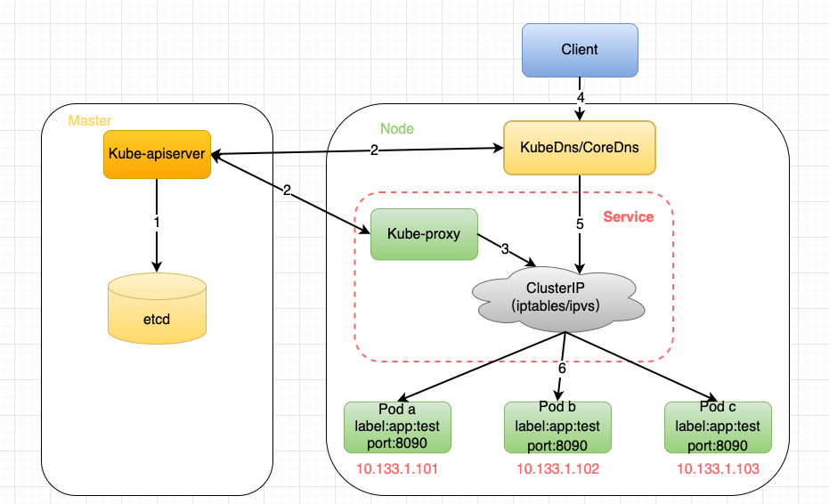
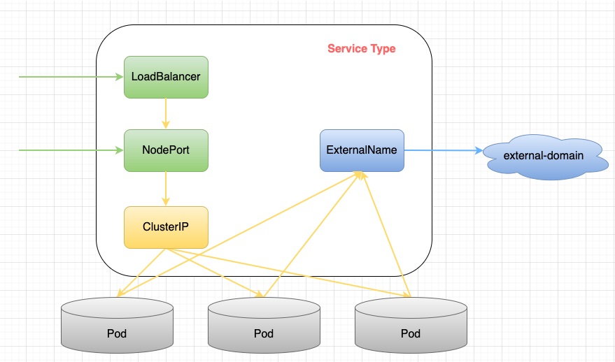
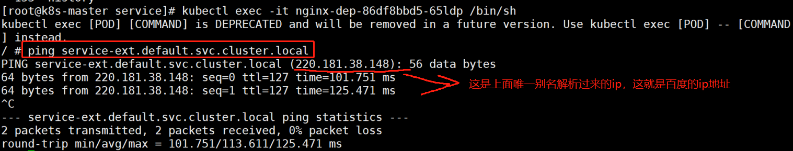
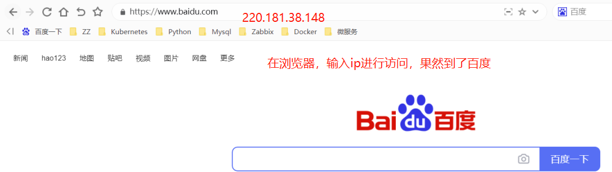
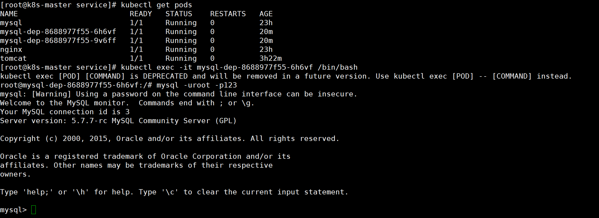

# 什么是service？

在说明Service是什么之前先了解下Service的使用场景：

- 当客户端想要访问K8S集群中的pod时，需要知道pod的ip以及端口，那K8S中如何在不知道pod的地址信息的情况下进行pod服务的快速连接？

- 若某一node上的pod发生故障，K8S最大的特点就是能够给感知和重启该pod，但是pod重启后ip会发生变化，那么客户端如何感知并保持对pod的访问？

- 如果多个pod组合在一起形成pod组，如何在被访问时达到负载均衡的效果？


针对上面三种需求，K8S提出了Service的概念，意在解决上述三个问题和场景，下面俩看看Service的定义：

- Kubernetes Service是为了管理具有相同功能的一组Pod而定义的一种资源对象，Service具体的作用和场景如下：


通过Pod的Label Selector访问Pod组。


- Service的IP保持不变(Headless Servcie除外，下面会单独讲)，保证了访问接口的稳定性，屏蔽了Pod的IP地址变化带来的影响，进而实现解耦合。虽然这样，还是建议使用ServiceName进行访问。

- Service通过kube-proxy借助iptables/ipvs提供负载均衡的能力，实现反向代理，将请求转发到合适的Pod上。

## Service的工作机制



首先根据我对整个Service工作流程的理解，画了这张图，下面就围绕这张图进行展开来说明下：

1.master上的kube-apiserver会处理service的创建，以及Service与通过label匹配与Pod绑定而产生的endpoints对象，并将这些元数据内容存储到etcd中。

2.node上的kube-proxy通过实时监听kube-apiserver上service以及endpoints的变化情况来感知相关事件并更新本地的service和endpoint的映射关系；同时node上的kubedns/coredns服务也会同时将service的域名信息与IP的对应关系存储起来供dns解析之用。

3.kube-proxy将从apiserver获取到的service和endpoint的映射关系保存在本地的iptables/ipvs中供后续查询使用

4.client发起对服务的访问，首先kubedns/coredns将服务名称解析成一个虚拟IP（ClusterIP）

5.然后使用这个IP去iptables/ipvs中去找service和endpoint的映射关系

6.找到映射关系后，通过iptables/ipvs的负载均衡算法（典型也是最简单的就是roundrobin算法）匹配到一个合适的Pod进行访问即可


service提供pod的负载均衡的能力，但是只提供4层负载均衡的能力，而没有7层功能，只能到ip层面。

下面看一个例子：


上图就是一个service的详细信息，先对照上面的流程找一下对应关系：


service和endpoint的映射关系：web（10.107.134.17）=> 10.244.1.13:80,10.244.2.29:80，这些数据会存储到iptables/ipvs中


service的域名信息与IP的对应关系：web => 10.107.134.17,这些数据会存储到kubedns/coredns中


负载均衡反向代理： 10.244.1.13:80,10.244.2.29:80 这两个Pod就是需要进行负载均衡以及反向代理的两个Pod,iptables/ipvs会根据自身的负载均衡算法来完成此过程


整体的数据访问流程即 web => 10.107.134.17 => 10.244.1.13:80

[
](https://blog.csdn.net/microGP/article/details/123176410)

## service的几种类型

K8S中Service分为四类，分别是ClusterIP，NodePort，LoadBalancer以及ExternalName。下面一张图描述了他们之间的关系以及服务类型：



其中绿色的代表从外向内的访问模式；蓝色的代表从内向外的访问模式，黄色代表集群内部的访问模式。可以看到，除了ExternalName类型之外，其余三种类型都是逐层封装而来的。下面就分类讲一讲这四种类型：

### ClusterIP

- 默认类型，自动分配一个仅可在内部访问的虚拟IP。应用方式：内部服务访问
- 这是K8S默认的服务类型，只能在K8S中进行服务通信。在ClusterIP中，K8S会在Service创建完毕后提供一个内部IP作为ClusterIP，K8S内部服务可以通过ClusterIP或者ServiceName来访问该服务。

```shell
# 创建deployment   nginx2个pod副本
[root@k8s-master service]# pwd
/root/service

[root@k8s-master service]# cat nginx-dep.yaml 
apiVersion: apps/v1
kind: Deployment
metadata:
 name: nginx-dep
spec:
 selector:
   matchLabels:
     app: nginx
 replicas: 2
 template:
   metadata:
     labels:
       app: nginx
   spec:
     containers:
     - name: nginx
       image: daocloud.io/library/nginx:1.12.0-alpine
       ports:
       - containerPort: 80
[root@k8s-master service]# kubectl create -f nginx-dep.yaml

kubectl describe pod  []   ##查看错误原因
```


```shell
# 创建一个ClusterIP类型的Service
[root@k8s-master service]# cat nginx-svc.yaml 
apiVersion: v1
kind: Service
metadata:
  name: nginx-svc-clusterip
spec:
  type: ClusterIP
  selector:
    # 选择app=nginx标签的pod
    app: nginx
  ports:
    - protocol: TCP
      # service对外提供的端口
      port: 80
      # 代理的容器的端口 
      targetPort: 80
      # clusterIP: 10.233.3.127 ##可配可不配，不配的话系统会分配一个随机的IP并保持不变
[root@k8s-master service]# kubectl create -f nginx-svc.yaml
```


#### 测试ClusterIP

```shell
# 创建1个带有curl命令的pod
[root@k8s-master service]# cat centos.yaml 
---
apiVersion: v1
kind: Pod
metadata:
 name: website
 labels:
  app: website
spec:
  containers:
   - name: test-website
     image: daocloud.io/library/nginx
     ports:
       - containerPort: 80
[root@k8s-master service]# kubectl create -f centos.yaml
```


进入到第一个nginx的pod中，修改默认页面。与另外一个不同即可；为了看效果而已；

```shell
[root@k8s-master service]# kubectl exec -it nginx-dep-86df8bbd5-65ldp /bin/sh
# cd /usr/share/nginx/html/
/usr/share/nginx/html # echo "hello1" > index.html
```


进入到带有curl命令的pod中。用curl访问ClusterIP的80端口；

```shell
[root@k8s-master service]# kubectl exec -it website /bin/bash
```

这是第一个pod页面

这是第二个pod页面；


通过serviename访问测试


### NodePort

- 在ClusterIP的基础之上，为集群内的每台物理机绑定一个端口，外网通过任意节点的物理机IP:端口来访问服务。应用方式：外服访问服务

```shell
[root@k8s-master service]# cat nginx-nodeport-svc.yaml
apiVersion: v1
kind: Service
metadata:
  name: service-nodeport
spec:
  type: NodePort
  selector:
    app: nginx
  ports:
    - protocol: TCP
      # service对外提供的端口
      port: 80
      # 代理的容器的端口 
      targetPort: 80
      # 在物理机上开辟的端口，从30000开始
      nodePort: 32138
[root@k8s-master service]# kubectl create -f nginx-nodeport-svc.yaml
```

#### 测试NodePort


清下缓存，继续访问另外一个node


### LoadBalancer

- 在NodePort基础之上，提供外部负载均衡器与外网统一IP，此IP可以将请求转发到对应服务上。这个是各个云厂商提供的服务。应用方式：外服访问服务

```shell
apiVersion: v1
kind: Service
metadata:
  name: loadbalance-test
spec:
  ports:
  - name: loadbalance-port
    #service对外提供的端口
    port: 80
    # 代理的容器的端口 
    targetPort: 80
    # 在物理机上开辟的端口，从30000开始
    nodePort: 32138
  selector:
    app: nginx
  type: LoadBalancer
status:
  loadBalancer:
    ingress:
    - ip:  云厂商LoadbalanceIP
[root@ master ~]# kubectl get  svc -n test
NAME                TYPE           CLUSTER-IP      EXTERNAL-IP   PORT(S)        AGE
loadbalance-test    LoadBalancer   172.21.10.152   LoadbalanceIP 80:32138/TCP   4m
```

### ExternalName

- 引入集群外部的服务，可以在集群内部通过别名方式访问（通过 serviceName.namespaceName.svc.cluster.local访问）

```shell
[root@k8s-master service]# cat nginx-externalName.yaml 
apiVersion: v1
kind: Service
metadata:
  name: service-ext
spec:
  type: ExternalName
  # 引入外部服务
  externalName: baidu.com
```


任意找个pod来访问服务，通过kubectl exec -it podname sh 来对pod执行sh命令，这样可以进入容器内部


```shell
[root@k8s-master service]# kubectl exec -it nginx-dep-86df8bbd5-65ldp /bin/sh
```





所以ExternalName也就是给另外一个网站的域名，起了一个内部使用的别名而已；

一般来讲，这个外部服务，是公司的服务，只不过不在k8s集群之外；用ExternalName可以屏蔽了外部服务的真实信息，外部服务对内部服务透明，外部服务的修改基本上不会影响到内部服务的访问。

### Headless Service

上面我们讲解了service的使用方法和实现逻辑，主要就是代理一组pod容器提供负载均衡以及反向代理服务。但是有时候我们不需要这种负载均衡，比如下面的两个场景：


- K8S部署某个kafka集群，此时就不需要service来负载均衡，客户端需要的是一组pod所有ip的列表。


- 客户端自己处理负载均衡的逻辑，比如K8S部署两个mysql，客户端自己处理负载请求，或者根本不处理这种负载，就要两套mysql然后手动控制读写请求。


基于上面的两个场景，K8S提供了headless serivce功能，字面意思是无头service，其实就是该service不显式的对外提供IP。


创建该类型Service的yaml例子如下：

```shell
apiVersion: v1
kind: Service
metadata:
  name: service-headless
spec:
 # type: NodePort
  ports:
    - port: 3000
      protocol: TCP
      targetPort: 80
 #     nodePort: 30080    
  clusterIP: None
  selector:
    app: nginx
```

headless service一般结合StatefulSet控制器来部署有状态的应用，比如大数据组件或者nosql数据库等，这种分布式的系统需要headless service来获取所有节点ip的列表供业务场景使用。后面我们会进行讲解


Service作为外部系统与K8S解耦合的关键组件，对外能够简化外系统调用K8S服务的复杂度，屏蔽K8S内部的实现细节；对内提供K8S内部的复杂均衡以及反向代理，是K8S的核心内容，需要重点且优先掌握。


# 什么是endpoint

 endpoint是k8s集群中的一个资源对象，存储在etcd中，用来记录一个service对应的所有pod的访问地址。


service配置selector，endpoint controller才会自动创建对应的endpoint对象；否则，不会生成endpoint对象.


例如，k8s集群中创建一个名为nginx-svc的service，就会生成一个同名的endpoint对象，ENDPOINTS就是service关联的pod的ip地址和端口。

```shell
[root@k8s-master prome]# cat nginx-dep1.yaml 
apiVersion: apps/v1
kind: Deployment
metadata:
  name: nginx-deployment
spec:
  selector:
    matchLabels:
      app: nginx
  replicas: 1
  template:
    metadata:
      labels:
        app: nginx
    spec:
      nodeName: k8s-node1               #必须指定调度到node1上，因为node1上才有/var/data目录
      containers:
      - name: nginx
        image: 10.8.166.241/nginx/nginx:v1.1
        ports:
        - containerPort: 80
        volumeMounts:  #定义挂载卷
        - name: nginx-vol
          mountPath: "/usr/share/nginx/html"
      volumes:   #定义共享卷
      - name: nginx-vol
        hostPath:
          path: /var/data
---
apiVersion: v1
kind: Service
metadata:
  name: nginx-svc
spec:
  type: NodePort
  ports:
    - port: 8081
      nodePort: 30010
      targetPort: 80
  selector:
    app: nginx
[root@k8s-master prome]# kubectl apply -f nginx-dep1.yaml
```


一个 Service 由一组 backend Pod 组成。

这些 Pod 通过 endpoints 暴露出来。

Service Selector 将持续评估，结果被 POST 到一个名称为 Service-hello 的 Endpoint 对象上。

当 Pod 终止后，它会自动从 Endpoint 中移除，新的能够匹配上 Service Selector 的 Pod 将自动地被添加到 Endpoint 中。

检查该 Endpoint，注意到 IP 地址与创建的 Pod 是相同的。

现在，能够从集群中任意节点上使用 curl 命令请求 nginx-svc Service

[
](https://blog.51cto.com/u_12606610/5614159)

k8s创建Mysql的Deployment，用Service的CLusterIP暴露，访问测试

```shell
[root@k8s-master service]# vim mysql-dep.yaml 
---
kind: Deployment
apiVersion: apps/v1
metadata:
 name: mysql-dep
spec:
 selector:
   matchLabels:
     app: mysql
 replicas: 2
 template:
   metadata:
     labels:
       app: mysql
   spec:
     containers:
     - name: mysql
       image:  daocloud.io/library/mysql:5.7.7
       env:
        - name: MYSQL_ROOT_PASSWORD
          value: "123"
       ports:
       - containerPort: 3306

```

```shell
[root@k8s-master service]# vim mysql-svc.yaml
---
apiVersion: v1
kind: Service
metadata:
  name: mysql-svc
spec:
 ports:
   - port: 3306
     targetPort: 3306
 selector:
   app: mysql
```

```shell
kubectl apply -f mysql-dep.yaml 
kubectl apply -f mysql-svc.yaml
```



