# 一、什么是控制器


kubernetes中内建了很多controller（控制器），这些相当于一个状态机，用来控制pod的具体状态和行为。


部分控制器类型如下：
ReplicationController 和 ReplicaSet
Deployment
DaemonSet
StatefulSet
Job/CronJob
HorizontalPodAutoscaler


## 二、DaemonSet控制器

```plain
DaemonSet 确保全部（或者某些）节点上运行一个 Pod 的副本。当有节点加入集群时，会为他们新增一个 Pod。当有节点从集群移除时，这些 Pod 也会被回收。删除 DaemonSet 将会删除它创建的所有 Pod。

DaemonSet 的一些典型用法：
在每个节点上运行集群存储 DaemonSet，例如 glusterd、ceph。
在每个节点上运行日志收集 DaemonSet，例如 fluentd、logstash、filebeat。
在每个节点上运行监控 DaemonSet，例如 Prometheus Node Exporter、Flowmill、Sysdig 代理、collectd、Dynatrace OneAgent、AppDynamics 代理、Datadog 代理、New Relic 代理、Ganglia gmond 或者 Instana 代理。
一个简单的用法是在所有的节点上都启动一个 DaemonSet，并作为每种类型的 daemon 使用。

一个稍微复杂的用法是单独对每种 daemon 类型使用一种DaemonSet。这样有多个 DaemonSet，但具有不同的标识，并且对不同硬件类型具有不同的内存、CPU 要求。
```

------

备注：DaemonSet 中的 Pod 可以使用 hostPort，从而可以通过节点 IP 访问到 Pod；因为DaemonSet模式下Pod不会被调度到其他节点。使用示例如下：


```yaml
 ports:
    - name: httpd
      containerPort: 80
      #除非绝对必要，否则不要为 Pod 指定 hostPort。 将 Pod 绑定到hostPort时，它会限制 Pod 可以调度的位置数；DaemonSet除外
      #一般情况下 containerPort与hostPort值相同
      hostPort: 8090     #可以通过宿主机+hostPort的方式访问该Pod。例如：pod在/调度到了k8s-node02			                      【192.168.153.147】，那么该Pod可以通过192.168.153.147:8090方式进行访问。
      protocol: TCP
```


下面举个栗子：


##### 1.创建DaemonSet


DaemonSet的描述文件和Deployment非常相似，只需要修改Kind，并去掉副本数量的配置即可

当然，我们这里的pod运行的是nginx，作为案例；

```shell
[root@k8s-master daemonset]# cat nginx-daemonset.yml 
apiVersion: apps/v1
kind: DaemonSet
metadata:
  name: nginx-daemonset
  labels:
    app: nginx
spec:
  selector:
    matchLabels:
      app: nginx
  template:
    metadata:
      labels:
        app: nginx
    spec:
      containers:
      - name: nginx
        image: nginx
        ports:
        - name: nginx
          containerPort: 80
          hostPort: 8090
          protocol: TCP
```


##### 2.测试效果

用宿主机node的ip+8090端口，即可访问到：


下面来看DaemonSet的效果；

也可以看到，每个node上，都会有一个DaemonSet的pod


尝试删除，也会重建

```shell
[root@k8s-master daemonset]# kubectl delete pod nginx-daemonset-5trrn
```


## 三、StatefulSet控制器

本次实验基于k8s-v1.19.0版本


StatefulSet 是用来管理有状态应用的工作负载 API 对象。


StatefulSet 中的 Pod 拥有一个具有黏性的、独一无二的身份标识。这个标识基于 StatefulSet 控制器分配给每个 Pod 的唯一顺序索引。Pod 的名称的形式为- 。例如：web的StatefulSet 拥有2个副本，所以它创建了两个 Pod：web-0和web-1。


和 Deployment 相同的是，StatefulSet 管理了基于相同容器定义的一组 Pod。但和 Deployment 不同的是，StatefulSet 为它们的每个 Pod 维护了一个固定的 ID。这些 Pod 是基于相同的声明来创建的，但是不能相互替换：无论怎么调度，每个 Pod 都有一个永久不变的 ID。


【使用场景】StatefulSets 对于需要满足以下一个或多个需求的应用程序很有价值：


1.  稳定的、唯一的网络标识符，即Pod重新调度后其PodName和HostName不变【当然IP是会变的】 命名方式：StatefulSetName-index.PodName.Namespace.svc.cluster.local
2.  稳定的、持久的存储，即Pod重新调度后还是能访问到相同的持久化数据，基于PVC实现
3.  有序的、优雅的部署和缩放 
4.  有序的、自动的滚动更新
   如上面，稳定意味着 Pod 调度或重调度的整个过程是有持久性的。 


如果应用程序不需要任何稳定的标识符或有序的部署、删除或伸缩，则应该使用由一组无状态的副本控制器提供的工作负载来部署应用程序，比如使用 Deployment 或者 ReplicaSet 可能更适用于无状态应用部署需要。


### 1.限制

给定 Pod 的存储必须由 PersistentVolume 驱动 基于所请求的 storage class 来提供，或者由管理员预先提供。
删除或者收缩 StatefulSet 并不会删除它关联的存储卷。这样做是为了保证数据安全，它通常比自动清除 StatefulSet 所有相关的资源更有价值。
StatefulSet 当前需要 headless 服务 来负责 Pod 的网络标识。你需要负责创建此服务。
当删除 StatefulSets 时，StatefulSet 不提供任何终止 Pod 的保证。为了实现 StatefulSet 中的 Pod 可以有序和优雅的终止，可以在删除之前将 StatefulSet 缩放为 0。
在默认 Pod 管理策略(OrderedReady) 时使用滚动更新，可能进入需要人工干预才能修复的损坏状态。
有序索引
对于具有 N 个副本的 StatefulSet，StatefulSet 中的每个 Pod 将被分配一个整数序号，从 0 到 N-1，该序号在 StatefulSet 上是唯一的。


StatefulSet 中的每个 Pod 根据 StatefulSet 中的名称和 Pod 的序号来派生出它的主机名。组合主机名的格式为-)(序号)。


### 2.部署和扩缩保证

对于包含 N 个 副本的 StatefulSet，当部署 Pod 时，它们是依次创建的，顺序为 0~(N-1)。
当删除 Pod 时，它们是逆序终止的，顺序为 (N-1)~0。
在将缩放操作应用到 Pod 之前，它前面的所有 Pod 必须是 Running 和 Ready 状态。
在 Pod 终止之前，所有的继任者必须完全关闭。
StatefulSet 不应将 pod.Spec.TerminationGracePeriodSeconds 设置为 0。这种做法是不安全的，要强烈阻止。


### 3.部署顺序

在下面的 nginx 示例被创建后，会按照 web-0、web-1、web-2 的顺序部署三个 Pod。在 web-0 进入 Running 和 Ready 状态前不会部署 web-1。在 web-1 进入 Running 和 Ready 状态前不会部署 web-2。


如果 web-1 已经处于 Running 和 Ready 状态，而 web-2 尚未部署，在此期间发生了 web-0 运行失败，那么 web-2 将不会被部署，要等到 web-0 部署完成并进入 Running 和 Ready 状态后，才会部署 web-2。


### 4.收缩顺序

如果想将示例中的 StatefulSet 收缩为 replicas=1，首先被终止的是 web-2。在 web-2 没有被完全停止和删除前，web-1 不会被终止。当 web-2 已被终止和删除；但web-1 尚未被终止，如果在此期间发生 web-0 运行失败，那么就不会终止 web-1，必须等到 web-0 进入 Running 和 Ready 状态后才会终止 web-1。


### 5.项目实战

提前说明：由于本地动态实战，我在v1.22.2版本中，尝试多次未成功，采用了v1.19.0版本的k8s集群；


Dynamic Provisioning机制工作的核心在于StorageClass的API对象。
StorageClass声明存储插件，用于自动创建PV


当我们k8s业务上来的时候，大量的pvc,此时我们人工创建匹配的话，工作量就会非常大了，需要动态的自动挂载相应的存储，‘
我们需要使用到StorageClass，来对接存储，靠他来自动关联pvc,并创建pv。
Kubernetes支持动态供给的存储插件：
https://kubernetes.io/docs/concepts/storage/storage-classes/
因为NFS不支持动态存储，所以我们需要借用这个存储插件。
nfs动态相关部署可以参考：
https://github.com/kubernetes-incubator/external-storage/tree/master/nfs-client/deploy
部署步骤：


#### 5.1部署nfs

```shell
3个节点都下载：
# yum -y install nfs-utils rpcbind
主节点配置nfs服务端
[root@master pvc-test]# mkdir /opt/container_data
[root@master pvc-test]# chmod 777  -R /opt/container_data
[root@master pvc-test]# cat /etc/exports
/opt/container_data *(rw,no_root_squash,no_all_squash,sync)
[root@master pvc-test]# systemctl start rpcbind && systemctl start nfs
```


#### 5.2定义一个storage

```shell
[root@master pvc-test]# cat storageclass-nfs.yaml 
apiVersion: storage.k8s.io/v1
kind: StorageClass
metadata:
  name: managed-nfs-storage
provisioner: fuseim.pri/ifs
```


#### 5.3部署授权

因为storage自动创建pv需要经过kube-apiserver,所以要进行授权

创建1个sa

创建1个clusterrole，并赋予应该具有的权限，比如对于一些基本api资源的增删改查；

创建1个clusterrolebinding，将sa和clusterrole绑定到一起；这样sa就有权限了；

然后pod中再使用这个sa，那么pod再创建的时候，会用到sa，sa具有创建pv的权限，便可以自动创建pv；

```shell
[root@master pvc-test]# cat rbac.yaml 
apiVersion: v1
kind: ServiceAccount
metadata:
  name: nfs-client-provisioner

---

kind: ClusterRole
apiVersion: rbac.authorization.k8s.io/v1
metadata:
  name: nfs-client-provisioner-runner
rules:
  - apiGroups: [""]
    resources: ["persistentvolumes"]
    verbs: ["get", "list", "watch", "create", "delete"]
  - apiGroups: [""]
    resources: ["persistentvolumeclaims"]
    verbs: ["get", "list", "watch", "update"]
  - apiGroups: ["storage.k8s.io"]
    resources: ["storageclasses"]
    verbs: ["get", "list", "watch"]
  - apiGroups: [""]
    resources: ["events"]
    verbs: ["list", "watch", "create", "update", "patch"]
---

kind: ClusterRoleBinding
apiVersion: rbac.authorization.k8s.io/v1
metadata:
  name: run-nfs-client-provisioner
subjects:
  - kind: ServiceAccount
    name: nfs-client-provisioner
    namespace: default
roleRef:
  kind: ClusterRole
  name: nfs-client-provisioner-runner
  apiGroup: rbac.authorization.k8s.io
```


#### 5.4部署一个自动创建pv的服务

这里自动创建pv的服务由nfs-client-provisioner 完成

```plain
[root@master pvc-test]# cat deployment-nfs.yaml 
kind: Deployment
apiVersion: apps/v1
metadata:
  name: nfs-client-provisioner
spec:
  selector:
    matchLabels:
      app: nfs-client-provisioner
  replicas: 1
  strategy:
    type: Recreate
  template:
    metadata:
      labels:
        app: nfs-client-provisioner
    spec:
    #  imagePullSecrets:
    #    - name: registry-pull-secret
      serviceAccount: nfs-client-provisioner
      containers:
        - name: nfs-client-provisioner
          #image: quay.io/external_storage/nfs-client-provisioner:latest
          image: lizhenliang/nfs-client-provisioner:v2.0.0
          volumeMounts:
            - name: nfs-client-root
              mountPath: /persistentvolumes
          env:
            - name: PROVISIONER_NAME
              #这个值是定义storage里面的那个值
              value: fuseim.pri/ifs
            - name: NFS_SERVER
              value: 172.17.0.21
            - name: NFS_PATH
              value: /opt/container_data
      volumes:
        - name: nfs-client-root
          nfs:
            server: 172.17.0.21
            path: /opt/container_data
```


创建：

```shell
[root@master pvc-test]# kubectl apply -f storageclass-nfs.yaml
[root@master pvc-test]# kubectl apply -f rbac.yaml
[root@master pvc-test]# kubectl apply -f deployment-nfs.yaml
```


查看创建好的storage:

```shell
[root@master storage]# kubectl get sc
```


nfs-client-provisioner 会以pod运行在k8s中，

```shell
[root@master storage]# kubectl get pod
NAME                                      READY   STATUS    RESTARTS   AGE
nfs-client-provisioner-855887f688-hrdwj   1/1     Running   0          77s
```


4、部署有状态服务，测试自动创建pv
部署yaml文件参考：https://kubernetes.io/docs/tutorials/stateful-application/basic-stateful-set/
我们部署一个nginx服务，让其html下面自动挂载数据卷，

```shell
[root@master pvc-test]# cat nginx.yaml 
apiVersion: v1
kind: Service
metadata:
  name: nginx
  labels:
    app: nginx
spec:
  ports:
  - port: 80
    name: web
  clusterIP: None
  selector:
    app: nginx
---
apiVersion: apps/v1
kind: StatefulSet
metadata:
  name: web
spec:
  serviceName: "nginx"
  replicas: 2
  selector:
   matchLabels:
      app: nginx
  template:
    metadata:
      labels:
        app: nginx
    spec:
      containers:
      - name: nginx
        image: nginx
        ports:
        - containerPort: 80
          name: web
        volumeMounts:
        - name: www
          mountPath: /usr/share/nginx/html
  volumeClaimTemplates:
  - metadata:
      name: www
    spec:
      accessModes: [ "ReadWriteOnce" ]
      storageClassName: "managed-nfs-storage"
      resources:
        requests:
          storage: 1Gi
          
[root@master pvc-test]# kubectl apply -f nginx.yaml
```


#### 5.5有序创建的特性


#### 5.6数据持久化特性

进入其中一个容器，创建一个文件：

```plain
[root@master pvc-test]# kubectl exec -it web-0 /bin/sh
# cd /usr/share/nginx/html
# echo "linux1" > index.html
```

来到nfs-server端查看


直接在web-1的目录下，创建一个文件：

```plain
[root@master pvc-test]# echo "linux2" /opt/container_data/default-www-web-1-pvc-627acb1d-5e34-4799-b17f-d44b2696684f/index.html
[root@master pvc-test]# kubectl exec -it web-1 /bin/bash
```


而且，删除一个pod  web-0，数据仍然存在，不会丢失。保证了数据持久化；


测试

```shell
[root@master container_data]# pwd
/opt/container_data
[root@master container_data]# kubectl get pod -o wide
```


#### 5.7 验证解析


每个 Pod 都拥有一个基于其顺序索引的稳定的主机名


使用 kubectl run 运行一个提供 nslookup 命令的容器，该命令来自于 dnsutils 包。通过对 Pod 的主机名执行 nslookup，你可以检查他们在集群内部的 DNS 地址


```shell
[root@master pvc-test]# cat pod.yaml 
apiVersion: v1
kind: Pod
metadata:
  name: testnginx
spec:
  containers:
  - name: testnginx
    image: daocloud.io/library/nginx:1.12.0-alpine
[root@master pvc-test]# kubectl apply -f pod.yaml
[root@master pvc-test]# kubectl exec -it testnginx /bin/sh
```

命名方式：PodName.serviceName.namespaceName.svc.cluster.local


重建pod会发现，pod中的ip已经发生变化，但是pod的名称并没有发生变化；这就是为什么不要在其他应用中使用 StatefulSet 中的 Pod 的 IP 地址进行连接，这点很重要


```plain
[root@master pvc-test]# kubectl delete pod -l app=nginx
pod "web-0" deleted
pod "web-1" deleted
[root@master pvc-test]# kubectl get pod -o wide
```


#### 5.8 写入稳定的存储


将 Pod 的主机名写入它们的index.html文件并验证 NGINX web 服务器使用该主机名提供服务


```plain
[root@k8s-master sts]# kubectl exec -it web-0 /bin/sh
# cd /usr/share/nginx/html
# echo youngfit-1 > index.html

[root@k8s-master sts]# kubectl exec -it web-1 /bin/sh
#  cd /usr/share/nginx/html
# echo youngfit-2 > index.html

[root@k8s-master sts]# ls /opt/container_data/default-www-web-0-pvc-ae99bd8d-a337-458d-a178-928cf4602713/
index.html
[root@k8s-master sts]# ls /opt/container_data/default-www-web-1-pvc-afac76ea-9faf-41ac-b03d-7ffc9e277029/
index.html
```


```shell
[root@k8s-master sts]# curl 10.244.4.5
youngfit-1
[root@k8s-master sts]# curl 10.244.1.4
youngfit-2

再次删除
[root@k8s-master sts]# kubectl delete pod -l app=nginx
pod "web-0" deleted
pod "web-1" deleted
[root@k8s-master sts]# kubectl apply -f  nginx.yaml
[root@k8s-master sts]# kubectl get pod
NAME                                     READY   STATUS    RESTARTS   AGE
nfs-client-provisioner-56cc44bd5-2hgxc   1/1     Running   0          27m
testnginx                                1/1     Running   0          6m20s
web-0                                    1/1     Running   0          13s
web-1                                    1/1     Running   0          6s
```


再次查看


#### 5.9 扩容/缩容 StatefulSet


扩容/缩容StatefulSet 指增加或减少它的副本数。这通过更新`replicas`字段完成。你可以使用kubectl scale 或者kubectl patch来扩容/缩容一个 StatefulSet。


## 四、基于k8s集群的redis-cluster集群

StatefulSet、pv的动态存储

### 1.提前准备好nfs存储

```plain
[root@k8s-master ~]# yum -y install nfs-utils nfs-common rpcbind
[root@k8s-master ~]# mkdir /data/nfs
[root@k8s-master ~]# chmod -R 777 /data/nfs
[root@k8s-master ~]# vim /etc/exports
/data/nfs *(rw,no_root_squash,sync,no_all_squash)
[root@k8s-master ~]# systemctl start rpcbind nfs
[root@k8s-master ~]# systemctl status nfs
其余节点下载nfs客户端,确保可以挂载
# yum -y install nfs-utils nfs-common
下载好之后，可以尝试用挂载命令试试，能否正常挂载
```


### 2.制作动态存储

安装helm工具

```plain
[root@k8s-master ~]# wget https://get.helm.sh/helm-v3.10.1-linux-amd64.tar.gz
[root@k8s-master ~]# tar -xvzf helm-v3.10.1-linux-amd64.tar.gz
[root@k8s-master ~]# cp linux-amd64/helm  /usr/bin/
[root@k8s-master ~]# helm version
```

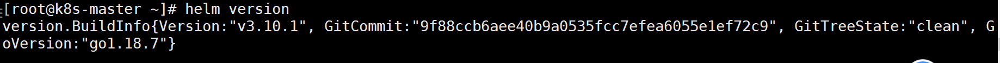

配置helm下载源

```plain
[root@k8s-master ~]# helm repo add stable http://mirror.azure.cn/kubernetes/charts
[root@k8s-master ~]# helm repo list
```


制作动态存储storageclass与nfs的共享目录相关联，这里我是用的helm工具。

```
helm ls --all-namespaces
helm uninstall phoenix-chart --namespace other
```


```plain
[root@k8s-master ~]# helm install nfs-redis stable/nfs-client-provisioner --set nfs.server=192.168.153.148 --set nfs.path=/data/nfs
[root@k8s-master ~]# helm list
```

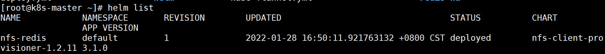


```plain
[root@k8s-master ~]# kubectl get storageclass
```


### 3.redis配置文件ConfigMap

```plain
#将redis配置文件内容
[root@k8s-master ~]# mkdir redis-ha
[root@k8s-master redis-ha]# pwd
/root/redis-ha
[root@k8s-master redis-ha]# cat redis.conf 
appendonly yes
cluster-enabled yes
cluster-config-file /var/lib/redis/nodes.conf
cluster-node-timeout 5000
dir /var/lib/redis
port 6379
[root@k8s-master redis-ha]# kubectl create configmap redis-conf --from-file=redis.conf
```


查看创建的configmap


### 4.创建Headless service

```plain
[root@k8s-master redis-ha]# vim  headless-service.yaml 
apiVersion: v1
kind: Service
metadata:
  name: redis-service
  labels:
    app: redis
spec:
  ports:
  - name: redis-port
    port: 6379
  clusterIP: None
  selector:
    app: redis
    appCluster: redis-cluster
[root@k8s-master redis-ha]# kubectl create -f headless-service.yml
```

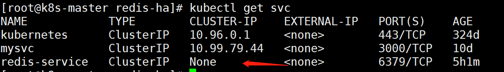

可以看到，服务名称为redis-service，其CLUSTER-IP为None，表示这是一个“无头”服务。

### 5.statefulSet运行redis实例


创建好Headless service后，就可以利用StatefulSet创建Redis 集群节点，这也是本文的核心内容。我们先创建redis.yml文件：

```plain
[root@k8s-master redis-ha]# cat redis.yaml 
apiVersion: apps/v1
kind: StatefulSet
metadata:
  name: redis-app
spec:
  serviceName: "redis-service"
  replicas: 6
  selector:
    matchLabels:
      app: redis
      appCluster: redis-cluster
  template:
    metadata:
      labels:
        app: redis
        appCluster: redis-cluster
    spec:
      terminationGracePeriodSeconds: 20
      affinity:
        podAntiAffinity:
          preferredDuringSchedulingIgnoredDuringExecution:
          - weight: 100
            podAffinityTerm:
              labelSelector:
                matchExpressions:
                - key: app
                  operator: In
                  values:
                  - redis
              topologyKey: kubernetes.io/hostname
      containers:
      - name: redis
        image: daocloud.io/library/redis:6-alpine3.12
        command:
          - "redis-server"
        args:
          - "/etc/redis/redis.conf"
          - "--protected-mode"
          - "no"
        resources:
          requests:
            cpu: "100m"
            memory: "100Mi"
        ports:
            - name: redis
              containerPort: 6379
              protocol: "TCP"
            - name: cluster
              containerPort: 16379
              protocol: "TCP"
        volumeMounts:
          - name: "redis-conf"
            mountPath: "/etc/redis"
          - name: "redis-data"
            mountPath: "/var/lib/redis"
      volumes:
      - name: "redis-conf"
        configMap:
          name: "redis-conf"
          items:
            - key: "redis.conf"
              path: "redis.conf"
  volumeClaimTemplates:
  - metadata:
      name: redis-data
    spec:
      accessModes: [ "ReadWriteMany" ]
      storageClassName: "nfs-client"
      resources:
        requests:
          storage: 200M
```


```plain
[root@k8s-master redis-ha]# kubectl apply -f redis.yaml
```


### 5.查看


```plain
[root@k8s-master redis-ha]# kubectl get pod
```


```plain
[root@k8s-master redis-ha]# kubectl get statefulSet
NAME        READY   AGE
redis-app   6/6     4h34m
```


### 6.验证唯一访问标识可用性


如上，总共创建了6个Redis节点(Pod)，其中3个将用于master，另外3个分别作为master的slave；Redis的配置通过volume将之前生成的redis-conf这个Configmap，挂载到了容器的/etc/redis/redis.conf；Redis的数据存储路径使用volumeClaimTemplates声明（也就是PVC），其会绑定到我们先前创建的PV上。
这里有一个关键概念——Affinity，请参考官方文档详细了解。其中，podAntiAffinity表示反亲和性，其决定了某个pod不可以和哪些Pod部署在同一拓扑域，可以用于将一个服务的POD分散在不同的主机或者拓扑域中，提高服务本身的稳定性。
而PreferredDuringSchedulingIgnoredDuringExecution 则表示，在调度期间尽量满足亲和性或者反亲和性规则，如果不能满足规则，POD也有可能被调度到对应的主机上。在之后的运行过程中，系统不会再检查这些规则是否满足。
在这里，matchExpressions规定了Redis Pod要尽量不要调度到包含app为redis的Node上，也即是说已经存在Redis的Node上尽量不要再分配Redis Pod了。但是，由于我们只有三个Node，而副本有6个，因此根据PreferredDuringSchedulingIgnoredDuringExecution，这些豌豆不得不得挤一挤，挤挤更健康~
另外，根据StatefulSet的规则，我们生成的Redis的6个Pod的hostname会被依次命名为 -)(序号) 如下图所示：


如上，可以看到这些Pods在部署时是以{0…N-1}的顺序依次创建的。注意，直到redis-app-0状态启动后达到Running状态之后，redis-app-1 才开始启动。
同时，每个Pod都会得到集群内的一个DNS域名，格式为.)(service name).$(namespace).svc.cluster.local ，也即是


```plain
redis-app-0.redis-service.default.svc.cluster.local
redis-app-1.redis-service.default.svc.cluster.local
...以此类推...
```


```plain
# 创建1个pod,测试完即可删除此pod
[root@k8s-master redis-ha]# cat busybox.yaml 
---
apiVersion: v1
kind: Pod
metadata:
  name: busybox
spec:
  containers:
    - name: busybox
      image: daocloud.io/library/busybox
      stdin: true
      tty: true
[root@k8s-master redis-ha]# kubectl apply -f busybox.yaml   
[root@k8s-master redis-ha]# kubectl exec -it busybox /bin/sh
/ # ping redis-app-0.redis-service.default.svc.cluster.local
# 说明：如果ping不同，请重启各个节点的docker服务。将flannel的pod全部删除。重新创建，我是因为频繁将机器挂起恢复，就会出现网络问题
# systemctl restart docker
# kubetclt delete -f kube-flannel.yaml  #等待1分钟
# kubetclt apply -f kube-flannel.yaml
```

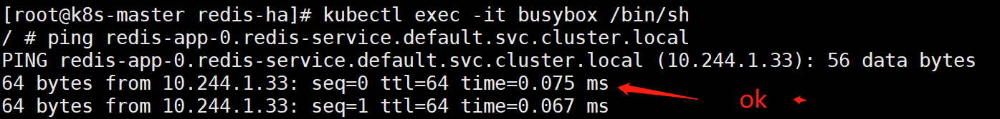

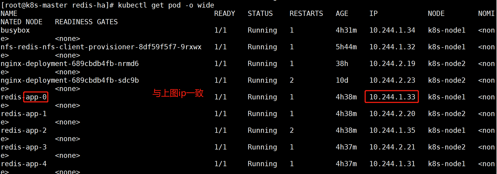

```plain
/ # ping redis-app-1.redis-service.default.svc.cluster.local
```

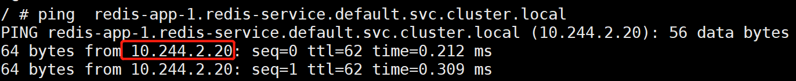

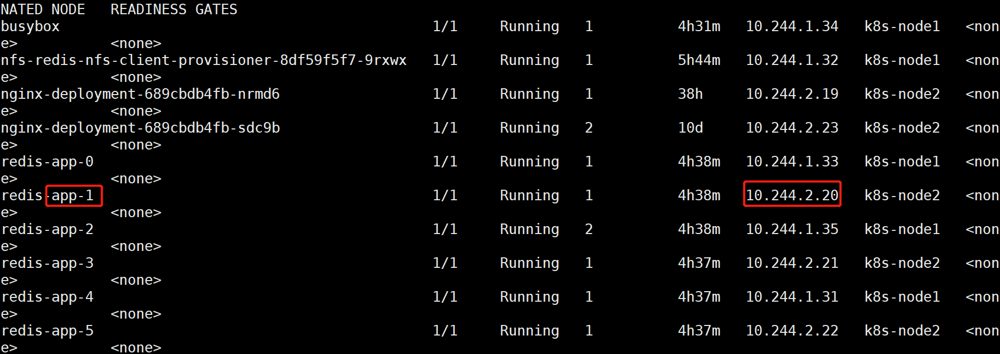

可以看到， redis-app-0的IP为10.244.1.33；redis-app-1的IP为10.244.2.20。当然，若Redis Pod迁移或是重启（我们可以手动删除掉一个Redis Pod来测试），IP是会改变的，但是Pod的域名、SRV records、A record都不会改变。


另外可以发现，我们之前创建的pv都被成功绑定了：

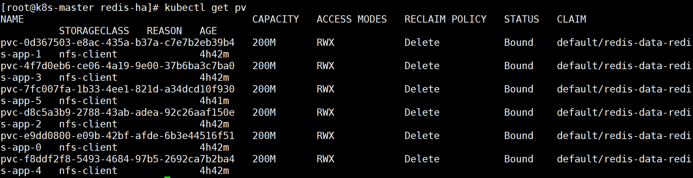


### 7.集群初始化


创建好6个Redis Pod后，我们还需要利用常用的Redis-tribe工具进行集群的初始化


创建Ubuntu容器
由于Redis集群必须在所有节点启动后才能进行初始化，而如果将初始化逻辑写入Statefulset中，则是一件非常复杂而且低效的行为。这里，哥不得不赞许一下原项目作者的思路，值得学习。也就是说，我们可以在K8S上创建一个额外的容器，专门用于进行K8S集群内部某些服务的管理控制。
这里，我们专门启动一个Ubuntu的容器，可以在该容器中安装Redis-tribe，进而初始化Redis集群，执行：


```plain
[root@k8s-master redis-ha]# kubectl run -it ubuntu --image=ubuntu --restart=Never /bin/bash
如果上面镜像下载失败：
[root@k8s-master redis-ha]# kubectl run -it ubuntu --image=daocloud.io/library/ubuntu:artful-20170619 --restart=Never /bin/bash
但是此镜像中没有ping和nslookup
```


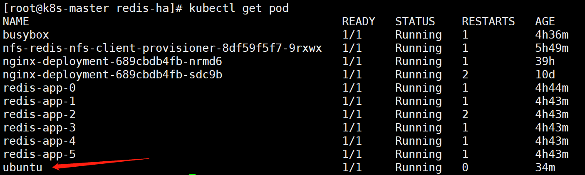


先试试ubuntu这个pod是否能与redis所有pod进行通信

```
apt-get update
apt-get install dnsutils
```


```plain
[root@k8s-master redis-ha]# kubectl exec -it ubuntu /bin/bash
root@ubuntu:/# nslookup redis-app-1.redis-service.default.svc.cluster.local
Server:		10.96.0.10
Address:	10.96.0.10#53

Name:	redis-app-1.redis-service.default.svc.cluster.local
Address: 10.244.2.20
```


我们使用阿里云的Ubuntu源，执行：


```plain
[root@k8s-master redis-ha]# kubectl exec -it ubuntu /bin/bash
root@ubuntu:/# cat > /etc/apt/sources.list << EOF
deb http://mirrors.aliyun.com/ubuntu/ bionic main restricted universe multiverse
deb-src http://mirrors.aliyun.com/ubuntu/ bionic main restricted universe multiverse

deb http://mirrors.aliyun.com/ubuntu/ bionic-security main restricted universe multiverse
deb-src http://mirrors.aliyun.com/ubuntu/ bionic-security main restricted universe multiverse

deb http://mirrors.aliyun.com/ubuntu/ bionic-updates main restricted universe multiverse
deb-src http://mirrors.aliyun.com/ubuntu/ bionic-updates main restricted universe multiverse

deb http://mirrors.aliyun.com/ubuntu/ bionic-proposed main restricted universe multiverse
deb-src http://mirrors.aliyun.com/ubuntu/ bionic-proposed main restricted universe multiverse
 
deb http://mirrors.aliyun.com/ubuntu/ bionic-backports main restricted universe multiverse
deb-src http://mirrors.aliyun.com/ubuntu/ bionic-backports main restricted universe multiverse
EOF
```


```plain
成功后，原项目要求执行如下命令安装基本的软件环境：
root@ubuntu:/# apt-get update
```


```plain
root@ubuntu:/# apt-get install -y vim wget python2.7 python-pip redis-tools dnsutils
```

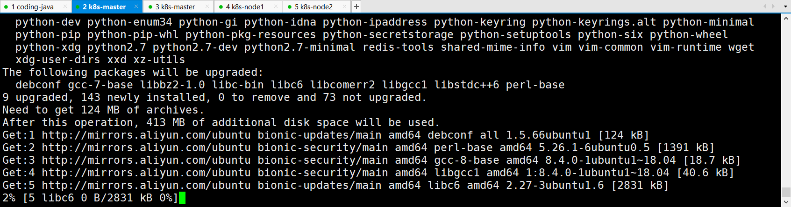


初始化集群
首先，我们需要安装`redis-trib`：

```plain
root@ubuntu:/# pip install redis-trib==0.5.1
```


然后，创建只有Master节点的集群：

```plain
root@ubuntu:/# redis-trib.py create \
  `dig +short redis-app-0.redis-service.default.svc.cluster.local`:6379 \
  `dig +short redis-app-1.redis-service.default.svc.cluster.local`:6379 \
  `dig +short redis-app-2.redis-service.default.svc.cluster.local`:6379
注释：dig +short返回简化结果
比如：
root@ubuntu:/# dig +short redis-app-0.redis-service.default.svc.cluster.local
10.244.2.84
```


其次，为每个Master添加Slave

```plain
root@ubuntu:/# redis-trib.py replicate \
  --master-addr `dig +short redis-app-0.redis-service.default.svc.cluster.local`:6379 \
  --slave-addr `dig +short redis-app-3.redis-service.default.svc.cluster.local`:6379

root@ubuntu:/# redis-trib.py replicate \
  --master-addr `dig +short redis-app-1.redis-service.default.svc.cluster.local`:6379 \
  --slave-addr `dig +short redis-app-4.redis-service.default.svc.cluster.local`:6379

root@ubuntu:/# redis-trib.py replicate \
  --master-addr `dig +short redis-app-2.redis-service.default.svc.cluster.local`:6379 \
  --slave-addr `dig +short redis-app-5.redis-service.default.svc.cluster.local`:6379
```


至此，我们的Redis集群就真正创建完毕了，连到任意一个Redis Pod中检验一下：

```plain
[root@k8s-master redis-ha]# kubectl exec -it ubuntu /bin/bash
root@ubuntu:/# exec attach failed: error on attach stdin: read escape sequence
command terminated with exit code 126
[root@k8s-master redis-ha]# kubectl exec -it redis-app-5 /bin/bash
root@redis-app-5:/data# /usr/local/bin/redis-cli -c
127.0.0.1:6379> CLUSTER NODES
```


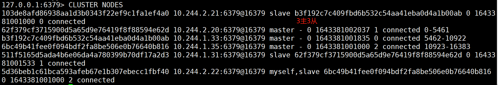


```plain
127.0.0.1:6379> CLUSTER info
```


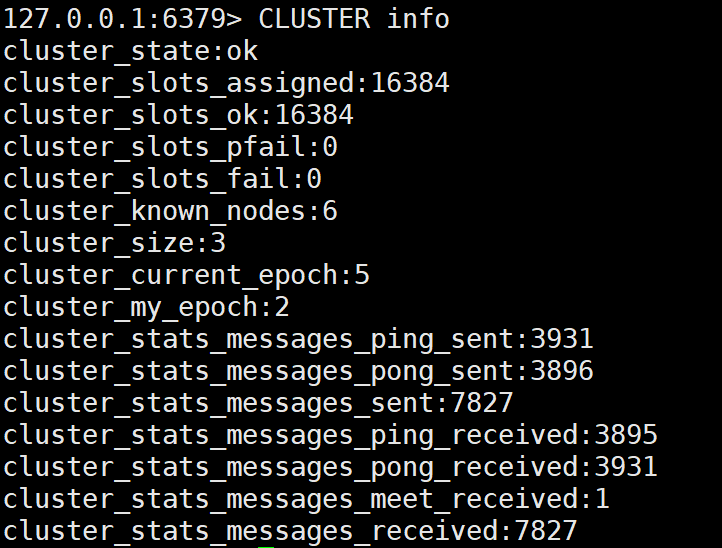


另外，还可以在NFS上查看Redis挂载的数据：


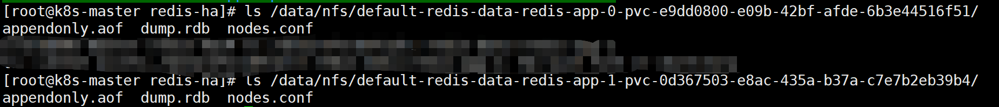


### 8.创建用于访问Service


前面我们创建了用于实现StatefulSet的Headless Service，但该Service没有Cluster IP，因此不能用于外界访问。所以，我们还需要创建一个Service，专用于为Redis集群提供访问和负载均衡：


```plain
[root@k8s-master redis-ha]# vim redis-access-service.yaml
apiVersion: v1
kind: Service
metadata:
  name: redis-access-service
  labels:
    app: redis
spec:
  ports:
  - name: redis-port
    protocol: "TCP"
    port: 6379
    targetPort: 6379
  selector:
    app: redis
    appCluster: redis-cluster
[root@k8s-master redis-ha]# kubectl apply -f redis-access-service.yaml
```


如上，该Service名称为 `redis-access-service`，在K8S集群中暴露6379端口，并且会对`labels name`为`app: redis`或`appCluster: redis-cluster`的pod进行负载均衡。


创建后查看：


### 9.测试主从切换


在K8S上搭建完好Redis集群后，我们最关心的就是其原有的高可用机制是否正常。这里，我们可以任意挑选一个Master的Pod来测试集群的主从切换机制，如`redis-app-0`：


说明：一般前3个为主节点，后三个为从节点。不过还是进去确认一下好


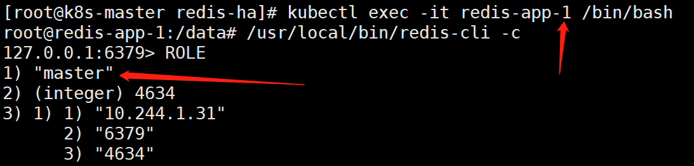


如上可以看到，`redis-app-0、redis-app-1、redis-app-2`为master


`redis-app-3、redis-app-4、redis-app-5`为slave。


而且可以确定：redis-app-0的从节点的ip是10.244.2.21是redis-app-3。


接着，我们手动删除`redis-app-0`主节点：


```plain
[root@k8s-master redis-ha]# kubectl delete pod redis-app-0
```


我们再进入`redis-app-0`内部查看：


```plain
[root@k8s-master redis-ha]# kubectl exec -it redis-app-0 /bin/bash
root@redis-app-0:/data# /usr/local/bin/redis-cli -c
```


我们再进入`redis-app-3`内部查看：


```plain
[root@k8s-master redis-ha]# kubectl exec -it redis-app-3 /bin/bash
root@redis-app-3:/data# /usr/local/bin/redis-cli -c
```


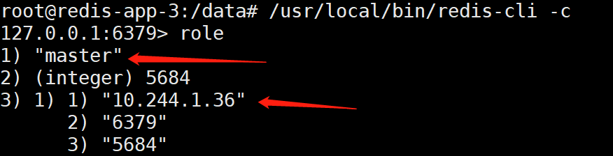


疑问拓展：


```plain
六、疑问
至此，大家可能会疑惑，那为什么没有使用稳定的标志，Redis Pod也能正常进行故障转移呢？这涉及了Redis本身的机制。因为，Redis集群中每个节点都有自己的NodeId（保存在自动生成的nodes.conf中），并且该NodeId不会随着IP的变化和变化，这其实也是一种固定的网络标志。也就是说，就算某个Redis Pod重启了，该Pod依然会加载保存的NodeId来维持自己的身份。我们可以在NFS上查看redis-app-1的nodes.conf文件：

[root@k8s-node2 ~]# cat /usr/local/k8s/redis/pv1/nodes.conf 96689f2018089173e528d3a71c4ef10af68ee462 192.168.169.209:6379@16379 slave d884c4971de9748f99b10d14678d864187a9e5d3 0 1526460952651 4 connected237d46046d9b75a6822f02523ab894928e2300e6 192.168.169.200:6379@16379 slave c15f378a604ee5b200f06cc23e9371cbc04f4559 0 1526460952651 1 connected
c15f378a604ee5b200f06cc23e9371cbc04f4559 192.168.169.197:6379@16379 master - 0 1526460952651 1 connected 10923-16383d884c4971de9748f99b10d14678d864187a9e5d3 192.168.169.205:6379@16379 master - 0 1526460952651 4 connected 5462-10922c3b4ae23c80ffe31b7b34ef29dd6f8d73beaf85f 192.168.169.198:6379@16379 myself,slave c8a8f70b4c29333de6039c47b2f3453ed11fb5c2 0 1526460952565 3 connected
c8a8f70b4c29333de6039c47b2f3453ed11fb5c2 192.168.169.201:6379@16379 master - 0 1526460952651 6 connected 0-5461vars currentEpoch 6 lastVoteEpoch 4
如上，第一列为NodeId，稳定不变；第二列为IP和端口信息，可能会改变。

这里，我们介绍NodeId的两种使用场景：

当某个Slave Pod断线重连后IP改变，但是Master发现其NodeId依旧， 就认为该Slave还是之前的Slave。

当某个Master Pod下线后，集群在其Slave中选举重新的Master。待旧Master上线后，集群发现其NodeId依旧，会让旧Master变成新Master的slave。

对于这两种场景，大家有兴趣的话还可以自行测试，注意要观察Redis的日志
```


有状态和无状态服务：https://www.jianshu.com/p/1abdbe8e557d


### 报错解决：

#### 1、sts无法删除

参考链接：https://blog.51cto.com/u_15127614/4392283

```shell
[root@k8s-master redis-ha]# kubectl delete -f redis.yml
删除sts，但是pod是以下状态
```


```shell
[root@k8s-master redis-ha]# kubectl describe pod redis-app-4
查看其中1个pod的详细信息。
```


```shell
[root@k8s-master redis-ha]# kubectl delete pod redis-app-3 --force
```

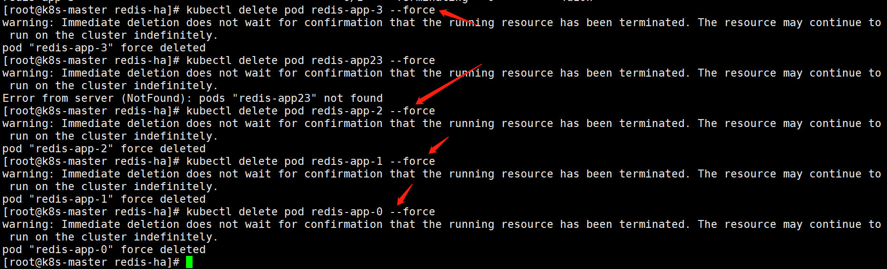