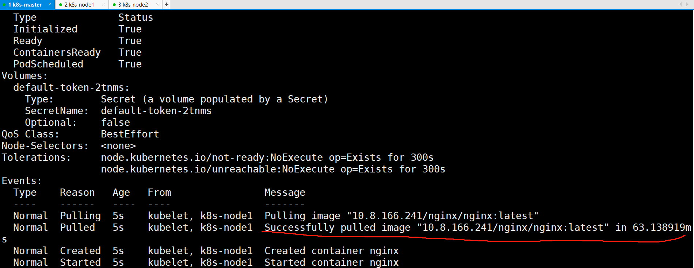
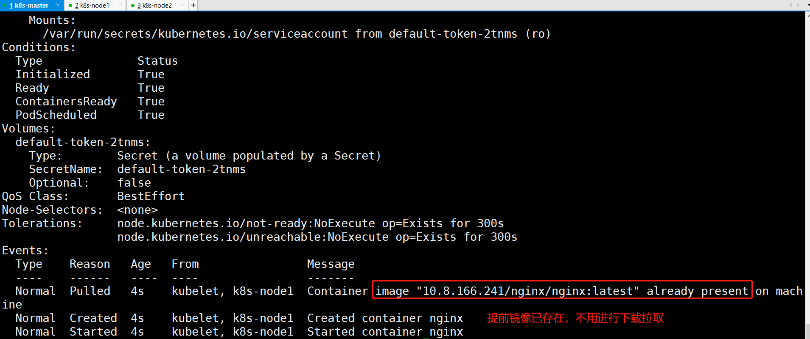
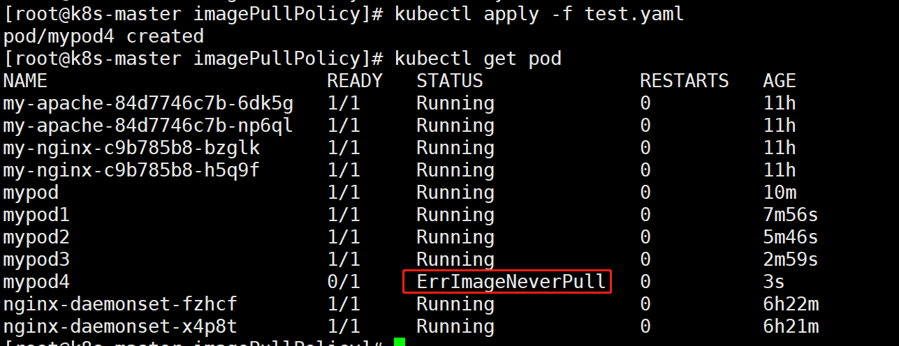

#  资源限制

​    Pod 是 kubernetes 中最小的资源管理组件，Pod 也是最小化运行容器化应用的资源对象。一个 Pod 代表着集群中运行的一个进程。kubernetes 中其他大多数组件都是围绕着 Pod 来进行支撑和扩展 Pod 功能的，例如用于管理 Pod 运行的 StatefulSet 和 Deployment 等控制器对象，用于暴露 Pod 应用的 Service 和 Ingress 对象，为 Pod 提供存储的 PersistentVolume 存储资源对象等。

## 概念

当定义 Pod 时可以选择性地为每个容器设定所需要的资源数量。最常见可设定资源是 CPU 和内存大小，以及其他类型的资源。

当为 Pod 中的容器指定了 request资源时，调度器就使用该信息来决定将 Pod 调度到哪个节点上。当还为容器指定了limit资源时，kubelet 就会确保运行的容器不会使用超出所设的 limit 资源量。kubelet 还会为容器预留所设的 request 资源量，供该容器使用。

如果 Pod 运行所在的节点具有足够的可用资源，容器可以使用超出所设置的 request 资源量。不过，容器不可以使用超出所设置的 limit 资源量。

如果给容器设置了内存的 limit 值，但未设置内存的 request 值，Kubernetes 会自动为其设置与内存 limit 相匹配的 request值。

类似的，如果给容器设置了 CPU 的 limit 值但未设置CPU 的 request 值，则 Kubernetes 自动为其设置 CPU 的 request 值 并使之与CPU 的 limit 值匹配。

### CPU资源单位

CPU 资源的 request 和 limit 以 cpu 为单位。Kubernetes 中的一个 cpu 相当于1个 vCPU（1个超线程）


Kubernetes 也支持带小数 CPU 的请求。spec.containers[].resources.requests.cpu 为0.5的容器能够获得一个 cpu 的一半 CPU资源（类似于Cgroup对CPU资源的时间分片）。表达式0.1等价于表达式 100m（毫秒），表示每1000毫秒内容器可以使用的CPU时间总量为0.1*1000 毫秒


### 内存资源单位

内存的 request 和 limit 以字节为单位。 可以以整数表示，或者以10为底数的指数的单位（E、P、T、G、M、K）来表示，或者以2为底数的指数的单位（Ei、Pi、Ti、Gi、Mi、Ki）来表示。如1KB=103=1000，1MB=106=1000000=1000KB，1GB=10^9=1000000000=1000MB 1KiB=2^10=1024, 1MiB=2^20=1048576=1024KiB


在买硬盘的时候，操作系统报的数量要比产品标出或商家号称的小一些，主要原因是标出的是以 MB、GB为单位的，1GB就是1,000,000,000Byte，而操作系统是以2进制为处理单位的，，因此检查硬盘容量时是以MiB、GiB为单位，1GB=2^30=1,073,741,824，相比较而言，1GiB要比1GB多出1,073,741,824-1,000,000,000=73,741,824Byte，所以检测实际结果要比标出的少—些


### CPU和内存的Requests和Limits的特点

Requests和Limits都是可选的。在Pod创建和更新时，如果未设置Requests和Limits，则使用系统提供的默认值，该默认值取决于集群配置。

如果Requests没有配置，默认被设置等于Limits。

requests 是创建容器时需要预留的资源量。如果无法满足，则pod 无法调度。但是，这不是容器运行实际使用的资源，容器实际运行使用的资源可能比这个大，也可能比这个小。

Limit 是限制pod容器可以使用资源的上限。容器使用的资源无法高于这个限制任何情况下Limits都应该设置为大于或等于Requests。

## 案例

```shell
[root@k8s-master ~]# vim test.yaml
apiVersion: v1
kind: Pod
metadata:
  name: frontend
spec:
  containers:
  - name: web
    image: nginx
    env:
    - name: WEB_ROOT_PASSWORD
      value: "password"
    resources:
      #此容器预分配资源：内存为 64Mi ; 每个cpu 分配250m
      requests:
        memory: "64Mi"
        cpu: "250m"
      #此容器限制使用资源（最大）： 内存最大使用128Mi，每个cpu最大分配500m
      limits:
        memory: "128Mi"
        cpu: "500m"
  - name: db
    image: mysql
    env:
    - name: MYSQL_ROOT_PASSWORD
      value: "abc123"
    resources:
     #此容器的预分配资源:内存预分配为512Mi;cpu预分配为每个cpu的50%，即1000*50%=500m
      requests:
        memory: "512Mi"
        cpu: "0.5"
     #此容器的限制使用资源配额为：内存最大使用1Gi;cpu最大使用1000m   
      limits:
        memory: "1Gi"
        cpu: "1"
 
#pod有两个容器，web 和db。所以，总的请求资源和限制资源为 web 和db 请求，限制资源总和。
#其中，cpu 的资源请求和限制，是以单个cpu 资源进行计算的。如果有多个cpu，则最终的结果是数值*N
```

# 镜像拉取策略（imagePullPolicy）

IfNotPresent:在镜像已经存在的情况下，kubelet将不再去拉取镜像，

仅当本地缺失时才会从仓库中拉取，默认的镜像拉取策略。

 

Alaways:每次创建Pod都会重新拉取一次镜像

 

Never:Pod不会主动拉取这个镜像，仅使用本地镜像。

 

注意：对于标签为latest的镜像文件，其默认的镜像获取策略即为Always；

而对于其他标签的镜像，其默认策略则为IfNotPresent。

## 使用always策略下载镜像

```shell
[root@k8s-master imagePullPolicy]# cat test.yaml
apiVersion: v1
kind: Pod
metadata:
  name: mypod
spec:
  nodeName: k8s-node1
  containers:
    - name: nginx
      image: 10.8.166.241/nginx/nginx:latest
      imagePullPolicy: Always
```

首先，Harbor仓库中有个标签为latest的nginx镜像；

当然也可以用公有的仓库；


```shell
[root@k8s-master imagePullPolicy]# kubectl apply -f test.yaml
[root@k8s-master imagePullPolicy]# kubectl describe pod mypod
```



修改pod名称，再次创建

```shell
[root@k8s-master imagePullPolicy]# cat test.yaml 
apiVersion: v1
kind: Pod
metadata:
  name: mypod1  #修改为mypod1
spec:
  nodeName: k8s-node1
  containers:
    - name: nginx
      image: 10.8.166.241/nginx/nginx:latest 
      imagePullPolicy: Always
```


## 使用IfNotPresent策略下载镜像

```shell
[root@k8s-master imagePullPolicy]# cat test.yaml
apiVersion: v1
kind: Pod
metadata:
  name: mypod2
spec:
  nodeName: k8s-node1
  containers:
    - name: nginx
      image: 10.8.166.241/nginx/nginx:latest 
      imagePullPolicy: IfNotPresent
[root@k8s-master imagePullPolicy]# kubectl apply -f test.yaml
[root@k8s-master imagePullPolicy]# kubectl describe pod mypod2
```



删除本地镜像，并再次修改yaml文件的pod名
在node节点删除镜像

```shell
[root@k8s-master imagePullPolicy]# cat test.yaml 
apiVersion: v1
kind: Pod
metadata:
  name: mypod3
spec:
  nodeName: k8s-node1
  containers:
    - name: nginx
      image: 10.8.166.241/nginx/nginx:latest 
      imagePullPolicy: IfNotPresent
```


## 使用Never策略，镜像拉取

删除本地镜像，再次修改yaml文件

```shell
[root@k8s-master imagePullPolicy]# cat test.yaml 
apiVersion: v1
kind: Pod
metadata:
  name: mypod4
spec:
  nodeName: k8s-node1
  containers:
    - name: nginx
      image: 10.8.166.241/nginx/nginx:latest 
      imagePullPolicy: Never
```

