# nacos部署文档

详细介绍请参考官方文档：https://nacos.io/zh-cn/docs/what-is-nacos.html


欢迎来到 Nacos 的世界！

Nacos /nɑ:kəʊs/ 是 Dynamic Naming and Configuration Service的首字母简称，一个更易于构建云原生应用的动态服务发现、配置管理和服务管理平台。

Nacos 致力于帮助您发现、配置和管理微服务。Nacos 提供了一组简单易用的特性集，帮助您快速实现动态服务发现、服务配置、服务元数据及流量管理。

Nacos 帮助您更敏捷和容易地构建、交付和管理微服务平台。 Nacos 是构建以“服务”为中心的现代应用架构 (例如微服务范式、云原生范式) 的服务基础设施。


### 一、安装环境


#### 1.安装jdk（已有安装包）


##### nacos需要用到jdk环境，这里使用的jdk版本是1.8


```shell
# tar xvzf jdk-8u333-linux-x64.tar.gz -C /app
# 直接解压进app目录下
# 最好给jdk配置环境变量
```


#### 2.安装nacos（已有安装包）


```shell
# tar xvzf nacos-server-2.1.0.tar.gz -C /app
```


#### 3.安装数据库（这里使用的mysql5.7、linux自建的mysql、也可以使用可视化的数据库Navicat）


```shell
1.数据库创建好之后需要创建一个新的库，然后将初始化文件导入新库即可（初始化文件在此压缩文件夹里面）
linux的mysql导入库的命令：# mysql -uroot -p database < fileName.sql
其中database是库名，fileName.sql是初始化数据库名

2.数据库创建好之后需要将当前ip加入访问权限
```


### 二、修改配置文件


#### 1.修改nacos的配置文件


```shell
# vim /app/nacos/conf/application.properties
```


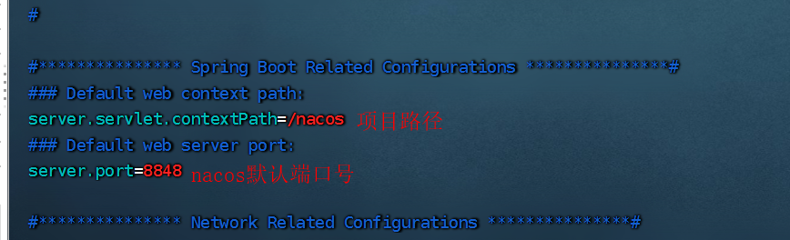


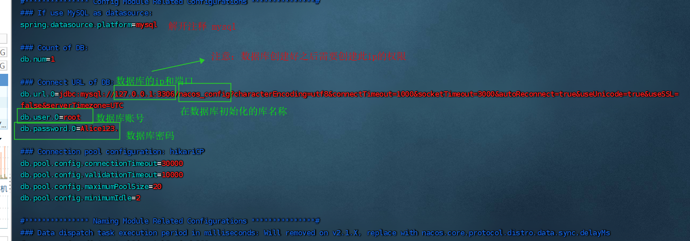


配置文件的其他的暂不修改！


### 三、启动nacos


```shell
#   cd /data/nacos/nacos/bin/
#   sh startup.sh -m standalone   以单节点方式启动nacos
```


启动之后需要等两分钟左右！


查看nacos的端口号和进程


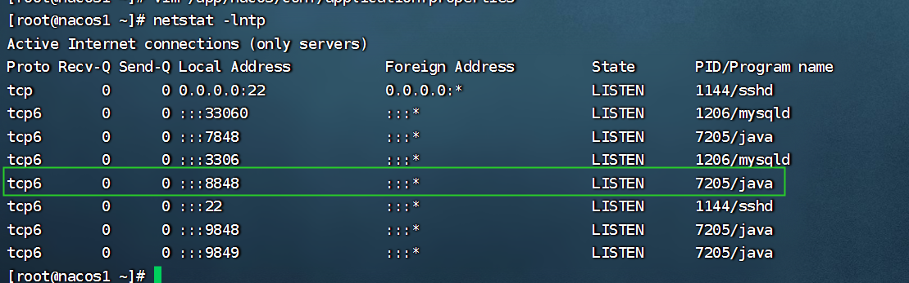


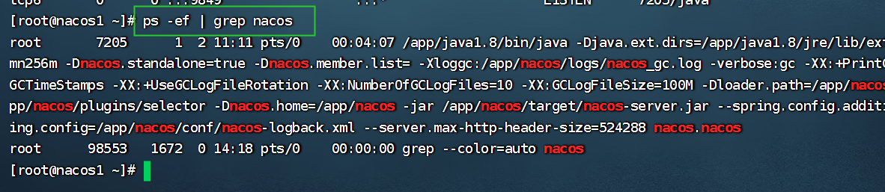


### 四、登录


# nacos集群部署

| 10.8.166.251 | mysql主节点 |
| ------------ | ----------- |
| 10.8.166.250 | mysql从节点 |
| 10.8.166.249 | nacos1      |
| 10.8.166.252 | nacos2      |

## 前言

本文主要介绍如何搭建nacos集群，示例使用2台服务器进行搭建。


 二、安装准备

Nacos 基于 java 开发的，运行依赖于 java 环境。依赖 64 bit JDK 1.8+，请自行先安装jdk。


1、下载


nacos项目下载，因受网络的影响从github上下载较慢，可以gitee进行下载

```plain
git clone https://gitee.com/mirrors/Nacos.git
```


2、编译


在下载好的nacos根目录执行打开命令行，执行mvn -Prelease-nacos -Dmaven.test.skip=true clean install -U进行编译打包（需要安装maven环境），建议下载官方已经编译好的包，地址为：[https://github.com/alibaba/nacos/releases/download/2.1.1/nacos-server-2.1.1.tar.gz](https://github.com/alibaba/nacos/releases/download/1.3.0/nacos-server-1.3.0.tar.gz)。

拷贝nacos/distribution/target/nacos-server-2.1.1.tar.gz到服务器server1的/app目录下。

解压tar -zxf nacos-server-2.1.1.tar.gz。

```plain
nacos2.1.1版本下载链接
链接：https://pan.baidu.com/s/1uCMAoqxH-fWZJC9k-6GJCA 
提取码：bf93 
```

我这里下载到本地，直接上传到虚拟机了


两台机器同步操作

```plain
[root@jenkins-server ~]# tar -xvzf nacos-server-2.1.1.tar.gz  -C /usr/local/
[root@jenkins-server conf]# pwd
/usr/local/nacos/conf
[root@jenkins-server conf]# mv cluster.conf.example cluster.conf
```

## 修改配置

```plain
[root@jenkins-server conf]# vim cluser.conf  #在最下面修改
10.8.166.249:8848
10.8.166.252:8848
```


修改数据源配置文件/app/nacos/conf/application.properties

```plain
[root@jenkins-server conf]# vim application.properties
```

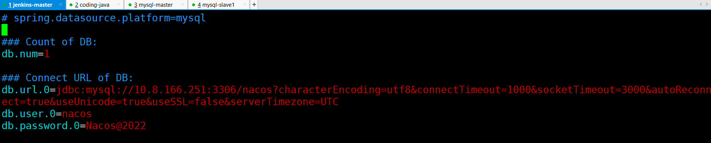

## 创建数据库

nacos，创建帐号nacos/nacos@2022

在mysql的主节点操作；

```plain
[root@mysql-master ~]# mysql -uroot -p'*****'
mysql> create database nacos;

mysql> CREATE USER 'nacos'@'%' IDENTIFIED BY 'Nacos@2022';

mysql> grant all on nacos.* to nacos@'%';
```

## 导入数据

```shell
[root@coding-start conf]# pwd
/usr/local/nacos/conf
[root@coding-start conf]# ls
1.4.0-ipv6_support-update.sql  application.properties.example  cluster.conf.example  nacos-mysql.sql
application.properties         cluster.conf                    nacos-logback.xml     schema.sql
[root@coding-start conf]# scp nacos-mysql.sql mysql-master:/root/
```

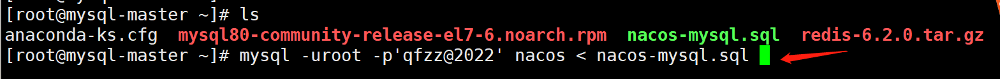

## 启动并登陆测试

启动2台机器的nacos应用

```plain
[root@jenkins-server bin]# pwd
/usr/local/nacos/bin
[root@jenkins-server bin]# ls
logs  shutdown.cmd  shutdown.sh  startup.cmd  startup.sh  work
[root@jenkins-server bin]# bash startup.sh
```

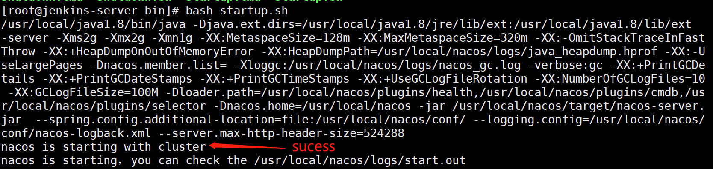

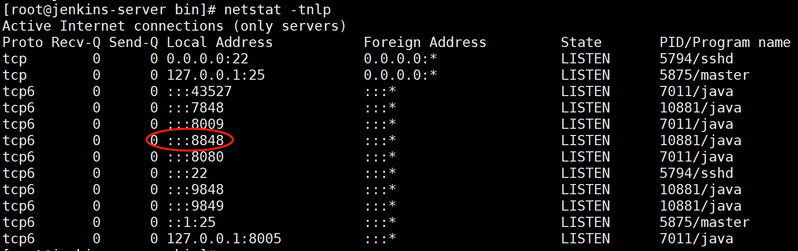

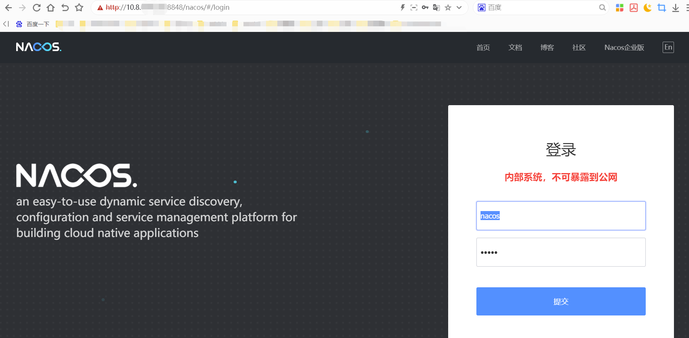

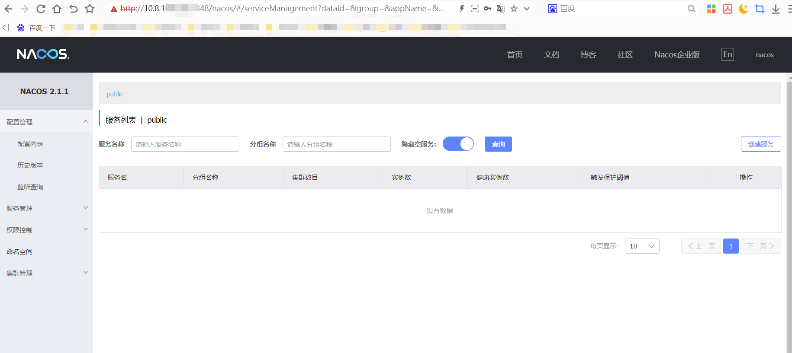


# 基于k8s的nacos集群

参考github文档：https://github.com/nacos-group/nacos-k8s  英文版

参考github文档： https://github.com/nacos-group/nacos-k8s/blob/master/README-CN.md 中文版

```plain
git clone https://github.com/nacos-group/nacos-k8s.git
```

我clone不下来，用本地电脑代理，下载到本地再上传虚拟机


```plain
[root@k8s-master nacos]# pwd
/root/nacos
[root@k8s-master nacos]# unzip nacos-k8s-master
[root@k8s-master nacos]# ls
nacos-k8s-master  nacos-k8s-master.zip
[root@k8s-master nacos]# cd nacos-k8s-master
```

## NFS构建

这里的nfs，准备作为pv/pvc的存储资源来使用

```plain
[root@coding-start ~]# yum -y install nfs-utils rpcbind
[root@coding-start ~]# mkdir -p /data/nfs-share
[root@coding-start ~]# mkdir -p /data/mysql
[root@coding-start ~]# chmod 777 /data/nfs-share
[root@coding-start ~]# chmod 777 /data/mysql/
配置NFS服务端共享目录
[root@coding-start ~]# cat /etc/exports
```

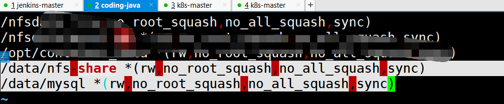

```plain
[root@coding-start ~]# systemctl enable nfs
[root@coding-start ~]# systemctl enable rpcbind

[root@coding-start ~]# systemctl start nfs
[root@coding-start ~]# systemctl start rpcbind
```

## 创建角色

如果的K8S命名空间不是**default**,请在部署RBAC之前执行以下脚本:

```plain
# Set the subject of the RBAC objects to the current namespace where the provisioner is being deployed
[root@k8s-master nacos-k8s-master]# pwd
/root/nacos/nacos-k8s-master
[root@k8s-master nacos-k8s-master]# NS=$(kubectl config get-contexts|grep -e "^\*" |awk '{print $5}')
[root@k8s-master nacos-k8s-master]# NAMESPACE=${NS:-default}
[root@k8s-master nacos-k8s-master]# sed -i '' "s/namespace:.*/namespace: $NAMESPACE/g" ./deploy/nfs/rbac.yaml
```

使用默认命名空间default，使用下面命令创建创建

```plain
[root@k8s-master nacos-k8s-master]# kubectl apply -f deploy/nfs/rbac.yaml
```


## 创建 ServiceAccount 和部署 NFS-Client Provisioner

```plain
[root@k8s-master nacos-k8s-master]# vim deploy/nfs/deployment.yaml
apiVersion: v1
kind: ServiceAccount
metadata:
  name: nfs-client-provisioner
---
kind: Deployment
apiVersion: apps/v1
metadata:
  name: nfs-client-provisioner
spec:
  replicas: 1
  strategy:
    type: Recreate
  selector:
    matchLabels:
      app: nfs-client-provisioner
  template:
    metadata:
      labels:
        app: nfs-client-provisioner
    spec:
      serviceAccount: nfs-client-provisioner
      nodeName: k8s-node1 #这里指定到node1
      containers:
        - name: nfs-client-provisioner
          image: quay.io/external_storage/nfs-client-provisioner:latest
          volumeMounts:
            - name: nfs-client-root
              mountPath: /persistentvolumes
          env:
            - name: PROVISIONER_NAME
              value: fuseim.pri/ifs
            - name: NFS_SERVER
              value: 10.8.166.252  #这里修改为nfs服务器的ip地址
            - name: NFS_PATH
              value: /data/nfs-share  #共享的目录对应好
      volumes:
        - name: nfs-client-root
          nfs:
            server: 10.8.166.252   #这里修改为nfs服务器的ip地址
            path: /data/nfs-share  #共享的目录对应好
```

这里指定pod会调度到node1。所以node1拉取一下镜像即可。

```plain
[root@k8s-node1 ~]# docker pull quay.io/external_storage/nfs-client-provisioner:latest
[root@k8s-node2 ~]# docker pull quay.io/external_storage/nfs-client-provisioner:latest
[root@k8s-master nacos-k8s-master]# kubectl apply -f deploy/nfs/deployment.yaml
```


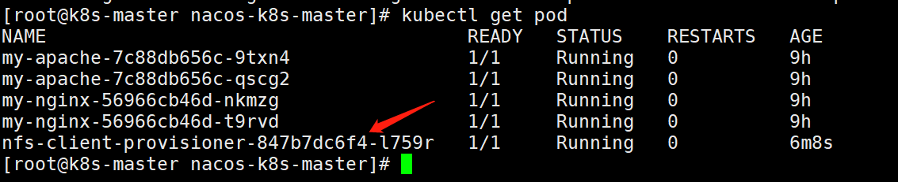

## 创建 NFS StorageClass

```plain
[root@k8s-master nacos-k8s-master]# cat deploy/nfs/class.yaml
apiVersion: storage.k8s.io/v1
kind: StorageClass
metadata:
  name: managed-nfs-storage
provisioner: fuseim.pri/ifs
parameters:
  archiveOnDelete: "false"
 [root@k8s-master nacos-k8s-master]# kubectl apply -f deploy/nfs/class.yaml 
storageclass.storage.k8s.io/managed-nfs-storage created
```


## 部署Mysql

```plain
[root@k8s-node1 ~]# docker pull nacos/nacos-mysql:5.7
```

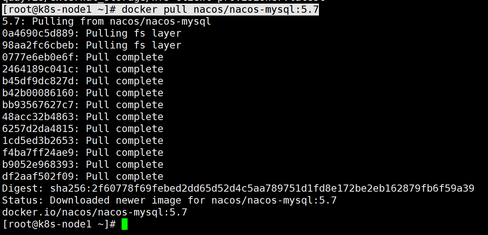

```plain
[root@k8s-master nacos-k8s-master]# cat deploy/mysql/mysql-nfs.yaml
apiVersion: v1
kind: ReplicationController
metadata:
  name: mysql
  labels:
    name: mysql
spec:
  replicas: 1
  selector:
    name: mysql
  template:
    metadata:
      labels:
        name: mysql
    spec:
      nodeName: k8s-node1   #因为只有node1上有镜像，所以这里指定调度
      containers:
      - name: mysql
        image: nacos/nacos-mysql:5.7
        ports:
        - containerPort: 3306
        volumeMounts:
        - name: mysql-data
          mountPath: /var/lib/mysql
        env:
        - name: MYSQL_ROOT_PASSWORD
          value: "root"
        - name: MYSQL_DATABASE
          value: "nacos_devtest"
        - name: MYSQL_USER
          value: "nacos"
        - name: MYSQL_PASSWORD
          value: "nacos"
      volumes:
      - name: mysql-data
        nfs:
          server: 10.8.166.252 #这里修改为nfs服务器的ip地址
          path: /data/mysql    #nfs共享的目录
---
apiVersion: v1
kind: Service
metadata:
  name: mysql
  labels:
    name: mysql
spec:
  ports:
  - port: 3306
    targetPort: 3306
  selector:
    name: mysql
```


进入到mysql数据库中检验一下

```plain
[root@k8s-master nacos-k8s-master]# kubectl exec -it mysql-bfjsk /bin/bash
root@mysql-bfjsk:/# mysql -uroot -proot
```

没问题。

## 部署Nacos

### 修改 deploy/nacos/nacos-pvc-nfs.yaml

```plain
[root@k8s-master nacos-k8s-master]# cat deploy/nacos/nacos-pvc-nfs.yaml 
---
apiVersion: v1
kind: Service
metadata:
  name: nacos-headless
  labels:
    app: nacos
  annotations:
    service.alpha.kubernetes.io/tolerate-unready-endpoints: "true"
spec:
  ports:
    - port: 8848
      name: server
      targetPort: 8848
    - port: 9848
      name: client-rpc
      targetPort: 9848
    - port: 9849
      name: raft-rpc
      targetPort: 9849
    ## 兼容1.4.x版本的选举端口
    - port: 7848
      name: old-raft-rpc
      targetPort: 7848
  clusterIP: None
  selector:
    app: nacos
---
apiVersion: v1
kind: ConfigMap
metadata:
  name: nacos-cm
data:
  mysql.db.name: "nacos_devtest"
  mysql.port: "3306"
  mysql.user: "nacos"
  mysql.password: "nacos"
---
apiVersion: apps/v1
kind: StatefulSet
metadata:
  name: nacos
spec:
  serviceName: nacos-headless
  replicas: 2
  template:
    metadata:
      labels:
        app: nacos
      annotations:
        pod.alpha.kubernetes.io/initialized: "true"
    spec:
      affinity:
        podAntiAffinity:
          requiredDuringSchedulingIgnoredDuringExecution:
            - labelSelector:
                matchExpressions:
                  - key: "app"
                    operator: In
                    values:
                      - nacos
              topologyKey: "kubernetes.io/hostname"
      serviceAccountName: nfs-client-provisioner
      initContainers:
        - name: peer-finder-plugin-install
          image: nacos/nacos-peer-finder-plugin:1.1
          imagePullPolicy: Always
          volumeMounts:
            - mountPath: /home/nacos/plugins/peer-finder
              name: data
              subPath: peer-finder
      containers:
        - name: nacos
          imagePullPolicy: Always
          image: nacos/nacos-server:latest
          resources:
            requests:
              memory: "2Gi"
              cpu: "500m"
          ports:
            - containerPort: 8848
              name: client-port
            - containerPort: 9848
              name: client-rpc
            - containerPort: 9849
              name: raft-rpc
            - containerPort: 7848
              name: old-raft-rpc
          env:
            - name: NACOS_REPLICAS
              value: "3"
            - name: SERVICE_NAME
              value: "nacos-headless"
            - name: DOMAIN_NAME
              value: "cluster.local"
            - name: POD_NAMESPACE
              valueFrom:
                fieldRef:
                  apiVersion: v1
                  fieldPath: metadata.namespace
            - name: MYSQL_SERVICE_DB_NAME
              valueFrom:
                configMapKeyRef:
                  name: nacos-cm
                  key: mysql.db.name
            - name: MYSQL_SERVICE_PORT
              valueFrom:
                configMapKeyRef:
                  name: nacos-cm
                  key: mysql.port
            - name: MYSQL_SERVICE_USER
              valueFrom:
                configMapKeyRef:
                  name: nacos-cm
                  key: mysql.user
            - name: MYSQL_SERVICE_PASSWORD
              valueFrom:
                configMapKeyRef:
                  name: nacos-cm
                  key: mysql.password
            - name: NACOS_SERVER_PORT
              value: "8848"
            - name: NACOS_APPLICATION_PORT
              value: "8848"
            - name: PREFER_HOST_MODE
              value: "hostname"
          volumeMounts:
            - name: data
              mountPath: /home/nacos/plugins/peer-finder
              subPath: peer-finder
            - name: data
              mountPath: /home/nacos/data
              subPath: data
            - name: data
              mountPath: /home/nacos/logs
              subPath: logs
  volumeClaimTemplates:
    - metadata:
        name: data
        annotations:
          volume.beta.kubernetes.io/storage-class: "managed-nfs-storage"
      spec:
        accessModes: [ "ReadWriteMany" ]
        resources:
          requests:
            storage: 20Gi
  selector:
    matchLabels:
      app: nacos
[root@k8s-master nacos-k8s-master]# kubectl apply -f deploy/nacos/nacos-pvc-nfs.yaml
```

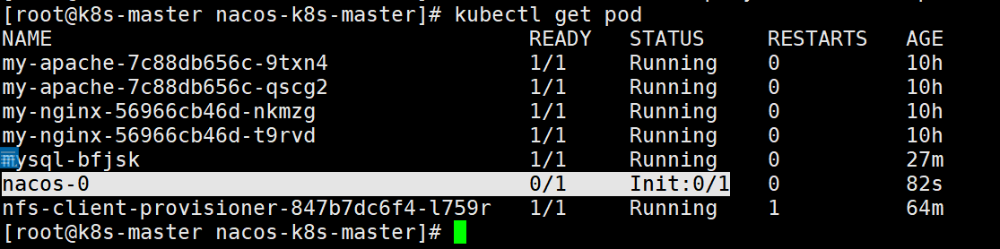

这里显示问题，用kubectl describe查看，显示镜像没有

我这里在node2上，提前拉取下来镜像

```plain
先删除把
[root@k8s-master nacos-k8s-master]# kubectl delete -f deploy/nacos/nacos-pvc-nfs.yaml
```

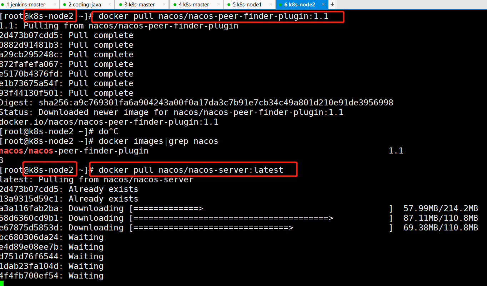


```plain
[root@k8s-master nacos-k8s-master]# vim deploy/nacos/nacos-pvc-nfs.yaml
```


```plain
[root@k8s-master nacos-k8s-master]# kubectl apply -f deploy/nacos/nacos-pvc-nfs.yaml
```

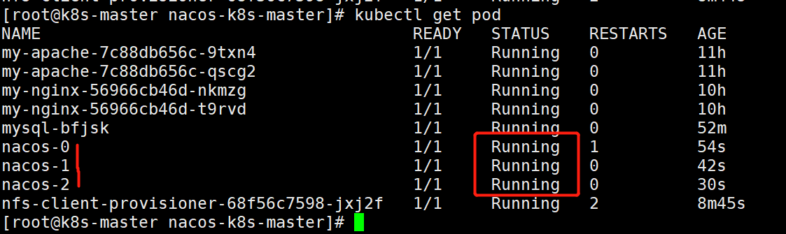


剩下如果想访问web页面；配置ingress即可