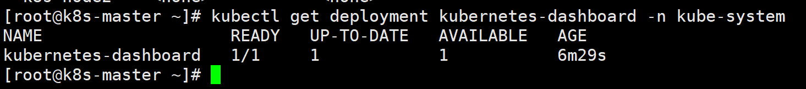
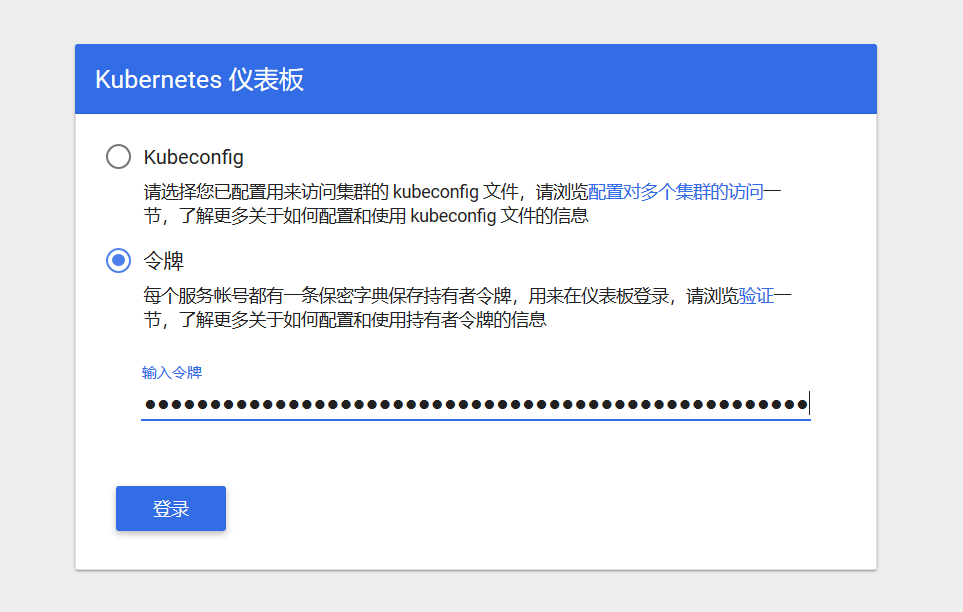
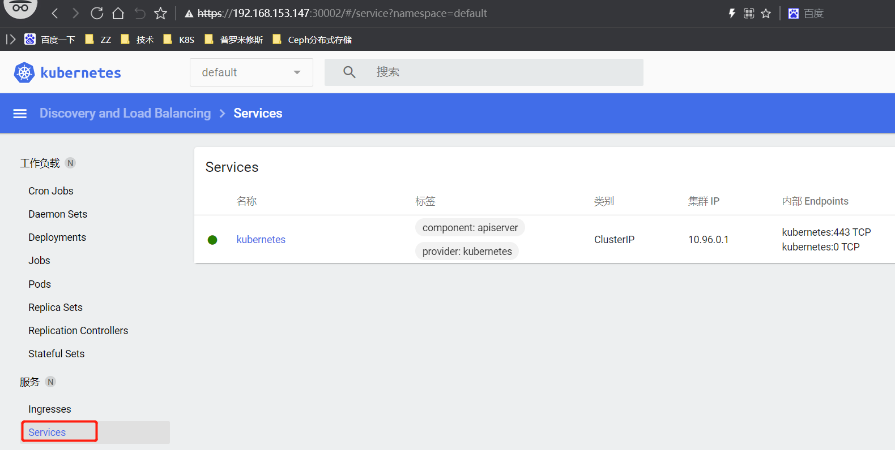
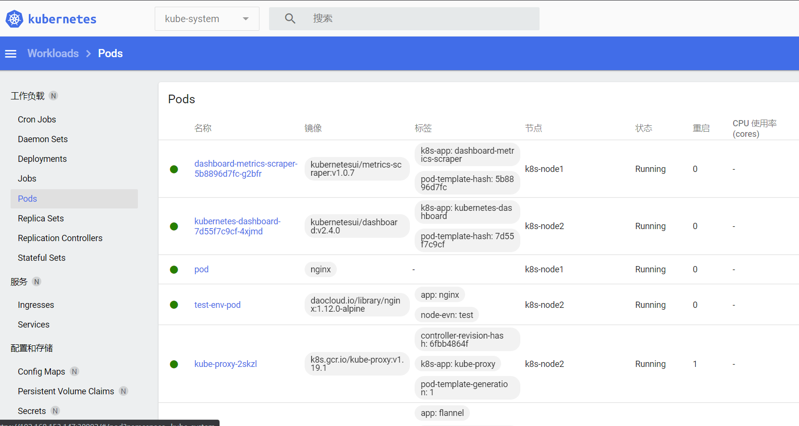

# 部署Dashboard应用

pod  页面应用提权<----- serviceaccount<-->clusterrole(pod,svc,ns,secret....     ;  get list watch delete create ...)

pod  页面应用    ---> default命名空间下：nginx pod

nodePort

```shell
注意：最后部署成功之后，因为有5种方式访问dashboard：我们这里只使用Nodport方式访问
1. Nodport方式访问dashboard，service类型改为NodePort
2. loadbalancer方式，service类型改为loadbalacer
3. Ingress方式访问dashboard
4. API server方式访问 dashboard
5. kubectl proxy方式访问dashboard
```


**1.下载yaml文件：**

```shell
可以自己下载，也可以使用子目录中的内容自己创建
[root@kub-k8s-master ~]# wget https://raw.githubusercontent.com/kubernetes/dashboard/v2.4.0/aio/deploy/recommended.yaml

将名称空间修改为默认kube-system
[root@kub-k8s-master ~]# sed -i '/namespace/ s/kubernetes-dashboard/kube-system/g' recommended.yaml
```


**2.下载镜像**

```shell
由于yaml配置文件中指定的镜像
node节点机器都下载镜像，不下载，node节点会自动拉取
[root@kub-k8s-master ~]# docker pull kubernetesui/dashboard:v2.4.0
[root@kub-k8s-master ~]# docker pull kubernetesui/metrics-scraper:v1.0.7
```


**3.修改yaml文件**

```shell
NodePort方式：为了便于本地访问，修改yaml文件，将service改为NodePort 类型：
[root@kub-k8s-master ~]# vim recommended.yaml
...
30 ---
 31 
 32 kind: Service
 33 apiVersion: v1
 34 metadata:
 35   labels:
 36     k8s-app: kubernetes-dashboard
 37   name: kubernetes-dashboard
 38   namespace: kube-system
 39 spec:
 40   type: NodePort   #增加type: NodePort
 41   ports:
 42     - port: 443
 43       targetPort: 8443
 44       nodePort: 31260  #增加nodePort: 31260
 45   selector:
 46     k8s-app: kubernetes-dashboard
 47 
 48 ---
```


**4.创建应用：**


```shell
[root@kub-k8s-master ~]# kubectl apply -f recommended.yaml
namespace/kubernetes-dashboard created
serviceaccount/kubernetes-dashboard created
service/kubernetes-dashboard created
secret/kubernetes-dashboard-certs created
secret/kubernetes-dashboard-csrf created
secret/kubernetes-dashboard-key-holder created
configmap/kubernetes-dashboard-settings created
role.rbac.authorization.k8s.io/kubernetes-dashboard created
clusterrole.rbac.authorization.k8s.io/kubernetes-dashboard created
rolebinding.rbac.authorization.k8s.io/kubernetes-dashboard created
clusterrolebinding.rbac.authorization.k8s.io/kubernetes-dashboard created
deployment.apps/kubernetes-dashboard created
service/dashboard-metrics-scraper created
deployment.apps/dashboard-metrics-scraper created
```


**查看Pod 的状态为running说明dashboard已经部署成功：**


```shell
[root@kub-k8s-master ~]# kubectl get pod -n kube-system -o wide | grep dashboard
```


**Dashboard 会在 kube-system namespace 中创建自己的 Deployment 和 Service：**


```shell
[root@kub-k8s-master ~]# kubectl get deployment kubernetes-dashboard -n kube-system
```





```shell
[root@kub-k8s-master ~]# kubectl get service kubernetes-dashboard -n kube-system
```


**5.访问dashboard**


官方参考文档：


https://kubernetes.io/docs/tasks/access-application-cluster/web-ui-dashboard/#accessing-the-dashboard-ui


查看service，TYPE类型已经变为NodePort，端口为31260


```shell
[root@kub-k8s-master ~]# kubectl get service -n kube-system | grep dashboard
kubernetes-dashboard   NodePort    10.108.97.179   <none>        443:31260/TCP            101s
```


查看dashboard运行在那台机器上面


```shell
[root@kub-k8s-master ~]# kubectl get pods -n kube-system -o wide
```


通过浏览器访问：[https://nodeIP:31260](https://master:31260)


因为我的应用运行在node上，又是NodePort方式，所以直接访问node的地址


登录界面如下：如果不行，请更换浏览器

https://10.8.166.231:31260/


**Dashboard 支持 Kubeconfig 和 Token 两种认证方式，这里选择Token认证方式登录：**


上面的Token先空着，不要往下点，接下来制作token


**创建登录用户**


官方参考文档：


https://github.com/kubernetes/dashboard/wiki/Creating-sample-user


**创建dashboard-adminuser.yaml：**


```shell
[root@kub-k8s-master ~]# vim dashboard-adminuser.yaml
---
apiVersion: v1
kind: ServiceAccount
metadata:
  name: admin-user
  namespace: kube-system
---
apiVersion: rbac.authorization.k8s.io/v1
kind: ClusterRoleBinding
metadata:
  name: admin-user
roleRef:
  apiGroup: rbac.authorization.k8s.io
  kind: ClusterRole
  name: cluster-admin
subjects:
- kind: ServiceAccount
  name: admin-user
  namespace: kube-system
```


**执行yaml文件：**


```shell
[root@kub-k8s-master ~]# kubectl create -f dashboard-adminuser.yaml
```


说明：上面创建了一个叫admin-user的服务账号，并放在kube-system命名空间下，并将cluster-admin角色绑定到admin-user账户，这样admin-user账户就有了管理员的权限。默认情况下，kubeadm创建集群时已经创建了cluster-admin角色，直接绑定即可。


**查看admin-user账户的token**

```shell
[root@kub-k8s-master ~]# kubectl -n kube-system describe secret $(kubectl -n kube-system get secret | grep admin-user | awk '{print $1}')
```


**把获取到的Token复制到登录界面的Token输入框中:**




**成功登陆dashboard:**








使用Dashboard


Dashboard 界面结构分为三个大的区域:


1.  顶部操作区，在这里用户可以搜索集群中的资源、创建资源或退出。 
2.  左边导航菜单，通过导航菜单可以查看和管理集群中的各种资源。菜单项按照资源的层级分为两类：Cluster 级别的资源 ，Namespace 级别的资源 ，默认显示的是 default Namespace，可以进行切换 
3.  中间主体区，在导航菜单中点击了某类资源，中间主体区就会显示该资源所有实例，比如点击 Pods。 