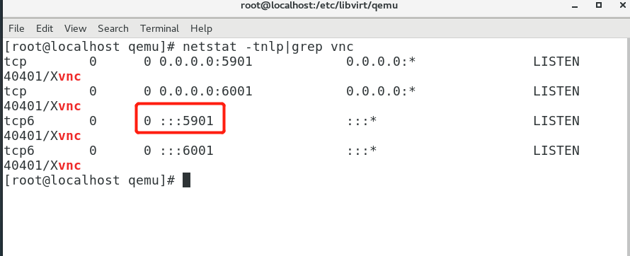

首先试试服务器装了VNC没


```shell
[root@linuxidc ~]# rpm -q tigervnc tigervnc-server
```


没安装的话会直接出现


```shell
package tigervnc is not installed package tigervnc-server is not installed
```


第一步，安装VNC packages：


```shell
[root@linuxidc ~]# yum -y install tigervnc-server
```


第二步，修改配置信息，在/etc/systemd/system/下建立文件夹vncserver@:1.service 把example config 文件从/lib/systemd/system/vncserver@.service复制到里面


```shell
[root@linuxidc ~]# cp /lib/systemd/system/vncserver@.service /etc/systemd/system/vncserver@:1.service
```


然后打开这个配置文件/etc/systemd/system/vncserver@:1.service替换掉默认用户名


找到这一行


```plain
ExecStart=/sbin/runuser -l -c "/usr/bin/vncserver %i" PIDFile=/home//.vnc/%H%i.pid
```


这里我直接用root 用户登录，所以我替换成


```plain
ExecStart=/sbin/runuser -l root -c "/usr/bin/vncserver %i" PIDFile=/root/.vnc/%H%i.pid
```


如果是其他用户的话比如john替换如下，我这里用的是这种方式


```plain
ExecStart=/sbin/runuser -l john -c "/usr/bin/vncserver %i" PIDFile=/home/john/.vnc/%H%i.pid
```


第三步，重加载 systemd


```plain
[root@linuxidc ~]# systemctl daemon-reload
```


第四步，为VNC设密码


```plain
[root@linuxidc ~]# vncpasswd
```


第六步设默认启动并开启VNC


```plain
[root@linuxidc ~]# systemctl enable vncserver@:1.service && systemctl start vncserver@:1.service
```


这样基本上Centos 端就设好了，Windows 端要去下一个VNC Viewer 的软件。连接一下试试看着有点简陋但是上去了的


**出现如下提示，可以先看看vnc的端口有没有被监听，如果有的话，可以忽略**


```plain
Job for vncserver@:1.service failed because a configured resource limit was exceeded. See "systemctl status vncserver@:1.service" and "journalctl -xe" for details.
```


**图像模糊**




客户端连接


