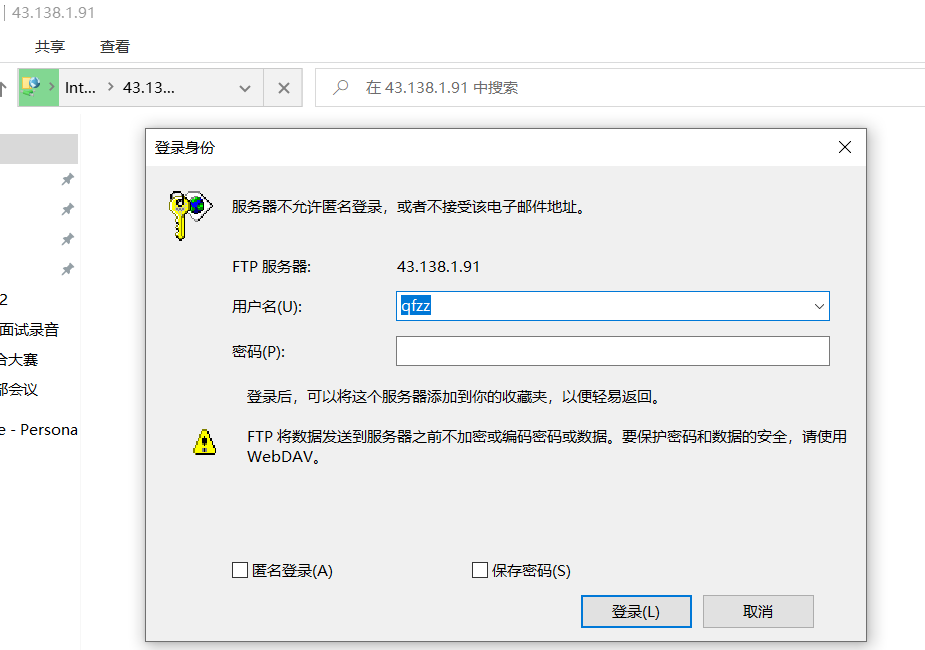
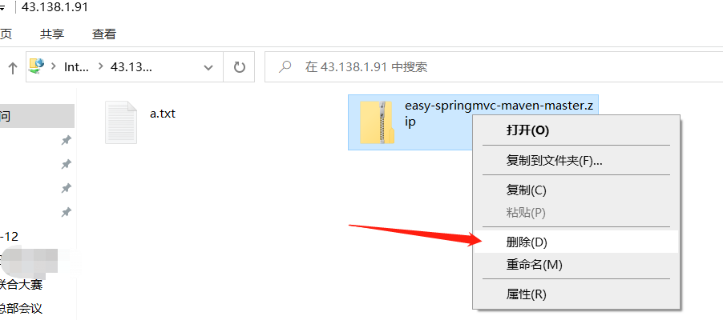
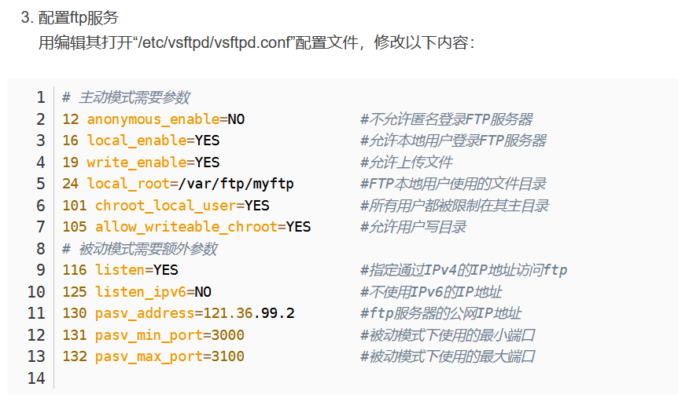
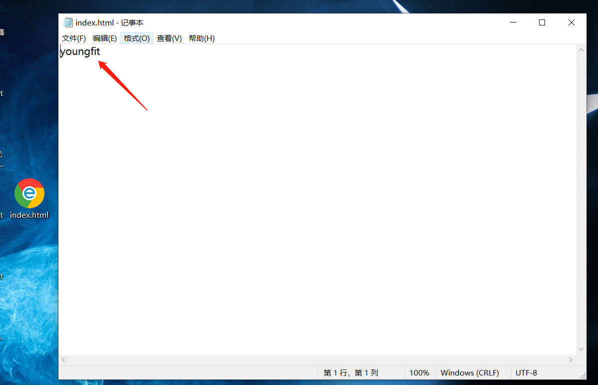
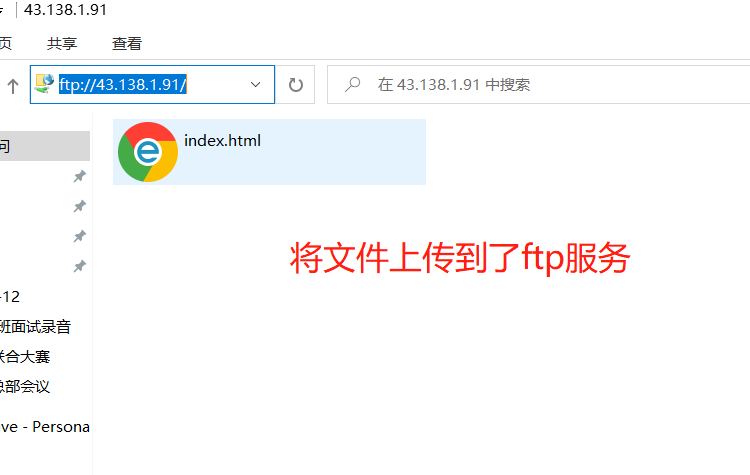

# Docker部署Minio

# 安装启动Dcoker服务

```plain
[root@centos ~]# yum install -y yum-utils device-mapper-persistent-data lvm2
[root@centos ~]# yum-config-manager --add-repo https://mirrors.aliyun.com/docker-ce/linux/centos/docker-ce.repo
[root@centos ~]# yum -y install docker-ce
[root@centos ~]#  systemctl start docker
```

# 拉取Minio镜像启动服务

```plain
[root@centos ~]# docker pull minio/minio
[root@centos ~]# docker run -p 9000:9000 -p 9001:9001 --name minio -d --restart=always -e "MINIO_ACCESS_KEY=admin" -e "MINIO_SECRET_KEY=admin123" -v /home/data:/data -v /home/config:/root/.minio minio/minio server --console-address ":9000" --address ":9001" /data
```

云服务器需要开启9000和9001端口号


# 前端需求：

## Nginx+FTP下载

```plain
[root@zabbix-agent2 ~]# cat /etc/yum.repos.d/nginx.repo 
[nginx-stable]
name=nginx stable repo
baseurl=http://nginx.org/packages/centos/$releasever/$basearch/
gpgcheck=1
enabled=1
gpgkey=https://nginx.org/keys/nginx_signing.key
module_hotfixes=true
[root@zabbix-agent2 ~]# yum -y install vsftpd nginx
```

## FTP配置

```plain
[root@zabbix-agent2 ~]# vim /etc/vsftpd/vsftpd.conf
anonymous_enable=no  		#关闭匿名登录，也就是必须使用用户名和密码登录
local_enable=YES				#允许本地创建的用户登录
anon_upload_enable=YES  #允许用户上传
anon_umask=022          #这个需要补上，在哪一行都可以。
anon_other_write_enable=yes  #允许其他人有写入权限，这个需要补上，在哪一行都可以。
anon_mkdir_write_enable=YES  #允许其他人创建目录
pasv_enable=YES   #开启被动模式
pasv_min_port=60000  #被动模式与客户端传输数据最小端口
pasv_max_port=60005  #被动模式与客户端传输数据最大端口

local_root=/home/qfzz    #用户登录进来，自动到哪个目录
[root@zabbix-agent2 ~]# useradd qfzz
[root@zabbix-agent2 ~]# passwd qfzz
密码设置为：QFzz@123456
[root@zabbix-agent2 ~]# systemctl start vsftpd
[root@zabbix-agent2 ~]# chmod -R 777 /home/qfzz
```

## 腾讯云服务器注意

云服务器，安全组开启21号，20端口；开启端口范围60000-60005

打开本地文件夹，尝试登录：




测试一下上传功能，随便将本地一个文件，拖进入，成功在把文件删除




## 华为云/阿里云服务器注意



安全区开放21 、20端口；和3000-3100端口号

## Nginx配置

```plain
[root@zabbix-agent2 ~]# vim /etc/nginx/conf.d/default.conf
location / {
        root   /home/qfzz;
        index  index.html index.htm;
        autoindex on;
        autoindex_exact_size off;
        autoindex_localtime on;
        charset utf-8,gbk;
    }
```


```plain
[root@zabbix-agent2 ~]# chmod -R 777 /home/qfzz
[root@zabbix-agent2 ~]# systemctl restart nginx
```

安全组开放80端口和21端口和20端口；






这就可以了


提供给前端人员：Nginx的访问地址

FTP的访问地址，用户名和密码