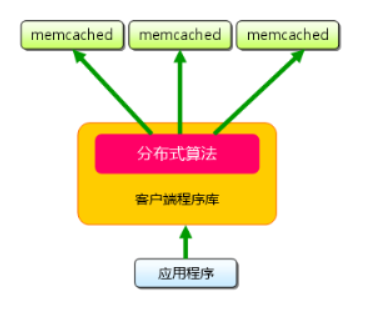
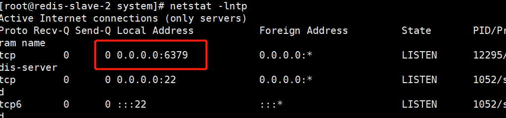

**Redis**

# Memcached&Redis构建缓存数据库


## **前言**


许多Web应用都将数据保存到关系型数据库( RDBMS)中，应用服务器从中读取数据并在浏览器中显示。但随着数据量的增大、访问的集中，就会出现RDBMS的负担加重、数据库响应恶化、 网站显示延迟等重大影响。**Memcached/redis是高性能的分布式内存缓存服务器,通过缓存数据库查询结果，减少对关系型数据库访问次数，以提高动态Web等应用的速度、 提高可靠性。**


RDBMS即关系数据库管理系统(Relational Database Management System)


#### **1、简介**


##### **1、nosql产品: redis,mongodb,memcached.**


NOSQL名词解释：非关系型数据库


**1.以键值对的方式存储数据---（**Key-Value**）的形式**


**2.缓存数据库**


##### 2、NoSQL的优点/缺点


```shell
优点:
- 高可扩展性
- 分布式计算
- 低成本
- 架构的灵活性
- 没有复杂的关系

缺点:
- 没有标准化
- 有限的查询功能（到目前为止）
```


**缓存服务器作用: 加快访问速度 ,缓解关系型数据库的读压力**


##### 3、关系型数据库与非关系型数据库的区别：---------面试高频率问题


```plain
1.首先了解一下 什么是关系型数据库？
关系型数据库最典型的数据结构是表，由二维表及其之间的联系所组成的一个数据组织。

优点：
1、易于维护：都是使用表结构，格式一致；
2、使用方便：SQL语言通用，可用于复杂查询；
3、复杂操作：支持SQL，可用于一个表以及多个表之间非常复杂的查询。
缺点：
1、读写性能比较差，尤其是海量数据的高效率读写；
2、固定的表结构，灵活度稍欠；
3、高并发读写需求，传统关系型数据库来说，硬盘I/O是一个很大的瓶颈；

二 非关系型数据库
什么非关系型数据库呢？

非关系型数据是一种数据结构化存储方法的集合，可以是文档或者键值对等

优点：
1、格式灵活：存储数据的格式可以是key,value形式、文档形式、图片形式等等，使用灵活，应用场景广泛，而关系型数据库则只支持基础类型。
2、速度快：nosql可以使用硬盘或者随机存储器作为载体，而关系型数据库只能使用硬盘；
3、高扩展性；
4、成本低：nosql数据库部署简单，基本都是开源软件。

缺点：
1、不提供sql支持，学习和使用成本较高；
2、无事务处理；
3、数据结构相对复杂，复杂查询方面稍欠。
```


## 2、Memcached


#### 1、特点


```shell
1.内置内存存储方式-----------为了提高性能，memcached中保存的数据都存储在memcache内置的内存存储空间中。由于数据仅存在于内存中，重启操作系统会导致全部数据消失
2.简单key/value存储---------------服务器不关心数据本身的意义及结构，只要是可序列化数据即可。存储项由“键、过期时间、可选的标志及数据”四个部分组成；
```





#### **2、服务框架**


**原理**


1、检查客户端的请求数据是否在memcached中，如有，直接把请求数据返回，不再对数据库进行任何操作，路径操作为①②③⑦。
2、如果请求的数据不在memcached中，就去查数据库，把从数据库中获取的数据返回给客户端，同时把数据缓存一份到memcached中（memcached客户端不负责，需要程序明确实现），路径操作为①②④⑤⑦⑥。


3、保持缓存的“新鲜性”，每当数据发生变化的时候（比如，数据有被修改，或被删除的情况下），要同步更新的缓存信息，确保用户不会在缓存取到旧的数据。


#### 3、配置安装Memcached


memcache能存放多少数据，取决于服务器本身的内存有多大。


```shell
1.安装----准备一台服务器
[root@memcached ~]# yum install memcached -y
[root@memcached ~]# systemctl start memcached  #启动
2.修改配置文件
[root@memcached ~]# vim /etc/sysconfig/memcached
PORT="11211"    ---监听的端口，默认11211.可以修改
USER="memcached"  -----用户
MAXCONN="1024"   -----默认并发，可以修改
CACHESIZE="64"    ------给的内存。默认是M
OPTIONS=""       ----监听的网络地址
然后把ip地址发给开发人员，开发的会使用api接口连接memcached.
测试：
[root@memcached ~]# yum install -y telnet   #安装telent
[root@memcached ~]# telnet 192.168.246.188 11211
Trying 192.168.246.188...
Connected to 192.168.246.188.
Escape character is '^]'.
set name 0 60 9    #设置名称为name的key      key   标记位(id号)   过期时间 大小
helloword        #给name的值
STORED         #出现stoped表示已经存储成功。
get name       #查询key值
VALUE name 0 9
helloword
END
quit   ---退出
参数解释:
name：key的名字 自己定义
0：key的id号，需要和其他的key不一样
60：缓存过期时间,单位为秒，0为永远
9：字符串最大长度

不用它的原因：存储的数据类型单一，而且数据只能存储在内存中。无法实现数据的持久化，服务器重启，数据将消失。
=================================================================
扩展:安装php支持memcached的扩展模块:
安装php7.0
[root@memcached ~]# rpm -Uvh https://mirror.webtatic.com/yum/el7/epel-release.rpm
[root@memcached ~]# rpm -Uvh https://mirror.webtatic.com/yum/el7/webtatic-release.rpm
[root@memcached ~]# yum install php70w.x86_64 php70w-cli.x86_64 php70w-common.x86_64 php70w-gd.x86_64 php70w-ldap.x86_64 php70w-mbstring.x86_64 php70w-mcrypt.x86_64 php70w-mysql.x86_64 php70w-pdo.x86_64 php70w-devel zlib-devel  -y
[root@memcached ~]# yum -y install php70w-fpm
[root@memcached ~]# yum install -y make gcc zlib-devel libmemcached-devel git
下载PHP Memcache 扩展包
[root@memcached ~]# yum install libmemcached -y
[root@memcached ~]# yum install php70w-pecl-memcached -y
```


```shell
安装nginx略，配置nginx的yum源。测试访问php的页面。
[root@memcached ~]# yum -y install nginx
[root@memcached ~]# vim /etc/nginx/conf.d/nginx.conf
server {
    listen       80;
    server_name  localhost;

    location ~ \.php$ {
        root           /usr/share/nginx/html;
        fastcgi_pass   127.0.0.1:9000;
        fastcgi_index  index.php;
        fastcgi_param SCRIPT_FILENAME $document_root$fastcgi_script_name;
        include        fastcgi_params;
    }
}
编辑php页面
[root@memcached ~]# cd /usr/share/nginx/html/
[root@memcached html]# vi index.php
<?php
phpinfo();
?>
启动nginx与php-fpm即可
浏览器访问
```


## 3、Redis服务


### 1、介绍


**redis是一个开源的、使用C语言编写的、支持网络交互的、可基于内存也可持久化的Key-Value数据库**


**redis的官网：**redis.io
注:域名后缀io属于国家域名，是british Indian Ocean territory，即英属印度洋领地


#### 1、redis的特点:


```shell
1.丰富的数据结构  -----String,list,set,hash等数据结构的存储
2.支持持久化
3.支持事务   ---------------事务是指“一个完整的动作，要么全部执行，要么什么也没有做”。
4.支持主从
```


#### 2、区别


```shell
redis和memcached比较 
1).Redis不仅仅支持简单的k/v类型的数据,同时还提供了list,set,zset,hash等数据结构的存储 
2).Redis支持master-slave(主-从)模式应用 
3).Redis支持数据的持久化
```


## 4、安装Redis


#### 1、安装单机版redis


```shell
[root@redis-master ~]# mkdir -p /data/application     ---创建工作目录
[root@redis-master ~]# wget https://download.redis.io/releases/redis-6.2.7.tar.gz   ---下载redis
[root@redis-master ~]# tar xzf redis-6.2.7.tar.gz -C /data/application/    ---解压
[root@redis-master ~]# cd /data/application/
[root@redis-master application]# mv redis-6.2.7/ redis
[root@redis-master application]# cd redis/
[root@redis-master redis]# yum install -y gcc make  #安装编译工具
[root@redis-master redis]# make
注：如果报错请将刚才解压的安装包删除掉，再次重新解压并进行make安装即可。
[root@redis-master redis]# mv redis.conf redis.conf.bak
[root@redis-master redis]# vim redis.conf     ---修改如下
bind 192.168.246.202　　#只监听内网IP
daemonize yes　　　　　#开启后台模式将no改为yes
port 6379                      #端口号
dir /data/application/redis/data　　#本地数据库存放持久化数据的目录该目录-----需要存在
创建存放数据的目录
[root@redis-master redis]# mkdir /data/application/redis/data
配置redis为systemctl启动
[root@redis-master redis]# cd /lib/systemd/system
[root@redis-master system]# vim redis.service
[Unit]
Description=Redis
After=network.target

[Service]
ExecStart=/data/application/redis/src/redis-server /data/application/redis/redis.conf  --daemonize no
ExecStop=/data/application/redis/src/redis-cli -h 127.0.0.1 -p 6379 shutdown

[Install]
WantedBy=multi-user.target
======================================================================================
参数详解:
• [Unit] 表示这是基础信息 
• Description 是描述
• After 是在那个服务后面启动，一般是网络服务启动后启动

• [Service] 表示这里是服务信息 
• ExecStart 是启动服务的命令
• ExecStop 是停止服务的指令

• [Install] 表示这是是安装相关信息 
• WantedBy 是以哪种方式启动：multi-user.target表明当系统以多用户方式（默认的运行级别）启动时，这个服务需要被自动运行。
=========================================================================================
8.启动服务:
[root@redis-master system]# systemctl daemon-reload  #重新加载
[root@redis-master system]# systemctl start redis.service
```


```shell
登陆redis
[root@redis-master system]# cd /data/application/redis/src/
[root@redis-master src]# ./redis-cli -h 192.168.246.202 -p 6379
192.168.246.202:6379> ping     ---测试redis是否可以用
PONG
192.168.246.202:6379> set name xiaoming    #设置key--name，并设置值
OK
192.168.246.202:6379> get name    #获取到key
"xiaoming"
192.168.246.202:6379>
单机版redis已经部署完成。将ip和端口发给开发就可以了。

192.168.246.202:6379> set key value [EX seconds] [PX milliseconds] [NX|XX]
EX seconds ： 将键的过期时间设置为 seconds 秒。 执行 SET key value EX seconds 的效果等同于执行 SETEX key seconds value。
PX milliseconds ： 将键的过期时间设置为 milliseconds 毫秒。 执行 SET key value PX milliseconds 的效果等同于执行 PSETEX key milliseconds value。
NX ： 只在键不存在时， 才对键进行设置操作。
XX ： 只在键已经存在时， 才对键进行设置操作。

使用 EX 选项：
[root@localhost src]# ./redis-cli -h 192.168.62.231 -p 6379
192.168.62.231:6379> set name1 xiaohong EX 10
OK
192.168.62.231:6379> get name1
"xiaohong"
等待10s，再次查看
192.168.62.231:6379> get name1
(nil)

使用 PX 选项：
192.168.62.231:6379> set name2 xiaohong PX 3233
OK
192.168.62.231:6379> get name2
"xiaohong"
等待3s，再次查看
192.168.62.231:6379> get name2
(nil)

使用 NX 选项：
192.168.62.231:6379> set class 2204 NX
OK # 键不存在，设置成功
192.168.62.231:6379> get class
"2204"
192.168.62.231:6379> set class 2205 NX
(nil)  # 键已经存在，设置失败
192.168.62.231:6379> get class
"2204"  # 维持原值不变

使用 XX 选项：
192.168.62.231:6379> set home taikang XX
(nil)  # 因为键不存在，设置失败
192.168.62.231:6379> set home taikang
OK # 先给键设置一个值
192.168.62.231:6379> set home zhengzhou XX
OK # 设置新值成功
192.168.62.231:6379> get home
"zhengzhou"

删除：
192.168.62.231:6379> del class
(integer) 1
192.168.62.231:6379> get class
(nil)
```


##### **redis的相关工具**


```shell
./redis-cli           #redis的客户端
./redis-server        #redis的服务端
./redis-check-aof     #用于修复出问题的AOF文件
./redis-sentinel      #用于集群管理
```


### 5、数据持久化


即把数据保存到可永久保存的存储设备中（如磁盘）。


##### **1、redis持久化 – 两种方式**


```shell
一、redis提供了两种持久化的方式，分别是RDB（Redis DataBase）和AOF（Append Only File）。
======================================================================================
RDB（Redis DataBase）：是在不同的时间点，将redis存储的数据生成快照并存储到磁盘等介质上；
特点:
1.周期性
2.不影响数据写入  #RDB会启动子进程，备份所有数据。当前进程，继续提供数据的读写。当备份完成，才替换老的备份文件。
3.高效     #一次性还原所有数据
4.完整性较差 #故障点到上一次备份，之间的数据无法恢复。
======================================================================================
AOF（Append Only File）则是换了一个角度来实现持久化，那就是将redis执行过的所有写指令记录下来，在下次redis重新启动时，只要把这些写指令从前到后再重复执行一遍，就可以实现数据恢复了。
特点:
1.实时性
2.完整性较好
3.体积大  #记录数据的指令，删除数据的指令都会被记录下来。
=======================================================================================
二、RDB和AOF两种方式也可以同时使用，在这种情况下，如果redis重启的话，则会优先采用AOF方式来进行数据恢复，这是因为AOF方式的数据恢复完整度更高。
三、如何选择方式？
缓存：不用开启任何持久方式
双开:因RDB数据不实时，但同时使用两者时服务器只会找AOF文件,所以RDB留作以防万一的手段。
官方的建议是两个同时使用。这样可以提供更可靠的持久化方案。
写入速度快 ------------AOF
写入速度慢 ------------RDB
```


##### 2、持久化配置


```shell
1、RDB默认开启：
[root@redis-master src]# cd ..
[root@redis-master redis]# vim redis.conf
#dbfilename：持久化数据存储在本地的文件
dbfilename dump.rdb
#dir：持久化数据存储在本地的路径
dir /data/application/redis/data
##snapshot触发的时机，save <seconds> <changes> 
##如下为900秒后，至少有一个变更操作，才会snapshot  
##对于此值的设置，需要谨慎，评估系统的变更操作密集程度  
##可以通过save “”来关闭snapshot功能  
#save时间，以下分别表示更改了1个key时间隔900s进行持久化存储；更改了10个key300s进行存储；更改10000个key60s进行存储。
save 900 1
save 300 10
save 60 10000 
##yes代表当使用bgsave命令持久化出错时候停止写RDB快照文件,no表明忽略错误继续写文件，“错误”可能因为磁盘已满/磁盘故障/OS级别异常等
stop-writes-on-bgsave-error yes
##是否启用rdb文件压缩，默认为“yes”，压缩往往意味着“额外的cpu消耗”，同时也意味着较短的网络传输时间  
rdbcompression yes 
注意:每次快照持久化都是将内存数据完整写入到磁盘一次，如果数据量大的话，而且写操作比较多，必然会引起大量的磁盘io操作，可能会严重影响性能。
```


```shell
3、AOF默认关闭--开启
[root@redis-master src]# cd ..
[root@redis-master redis]# vim redis.conf
修改如下:
```


```shell
1、此选项为aof功能的开关，默认为“no”，可以通过“yes”来开启aof功能,只有在“yes”下，aof重写/文件同步等特性才会生效
====================================
2、指定aof文件名称
appendfilename appendonly.aof  
====================================
3、指定aof操作中文件同步策略，有三个合法值：always everysec no,默认为everysec
appendfsync everysec
always     #每次有数据修改发生时都会写入AOF文件
everysec   #每秒钟同步一次，该策略为AOF的缺省策略/默认策略
no         #从不同步。高效但是数据不会被持久化
```


**开启持久化功能后，重启redis后，数据会自动通过持久化文件恢复**


拓展RDB快照备份恢复：


redis数据库备份与恢复（dump.rdb快照方式），两台机器


```plain
做备份机器的redis.conf配置文件内容：
bind 0.0.0.0
dbfilename dump.rdb
dir /data/application/redis/data
save 900 1
save 300 10
save 60 10000
stop-writes-on-bgsave-error yes
rdbcompression yes
```


```plain
备份数据：
[root@redis-slave-1 redis]# src/redis-cli 
127.0.0.1:6379> set name3 qianfeng
OK
127.0.0.1:6379> set name4 tianyun
OK
127.0.0.1:6379> BGSAVE   执行备份，或者敲SAVE
[root@redis-slave-1 redis]# ls data/
dump.rdb

[root@redis-slave-1 redis]# scp data/dump.rdb 192.168.62.135:/usr/local/redis/data/
先给被传的机器redis stop掉再scp
```


```plain
恢复数据的机器：
修改redis.conf配置文件
```


```shell
将dump.rdb数据文件存放到配置文件制定的目录下，直接启动即可
[root@redis-master redis]# src/redis-server redis.conf &
[root@redis-master redis]# src/redis-cli
[root@redis-master redis]#
127.0.0.1:6379> get name3
"qianfeng"
127.0.0.1:6379> get name4
"tianyun"
```


#### 6、Redis主从配置


#### 主从简介


##### **1、主从 – 用法**


像MySQL一样，redis是支持主从同步的，而且也支持一主多从以及多级从结构。

 

主从结构，一是为了纯粹的冗余备份，二是为了提升读性能，比如很消耗性能的操作就可以由从服务器来处理。
redis的主从同步是异步进行的，这意味着主从同步不会影响主逻辑，也不会降低redis的处理性能。
**主从架构中，可以考虑关闭主服务器的数据持久化功能，只让从服务器进行持久化，这样可以提高主服务器的处理性能。**


##### **2、主从同步原理**


```shell
主从 – 同步原理
从服务器会向主服务器发出SYNC指令，当主服务器接到此命令后，就会调用BGSAVE指令来创建一个子进程专门进行数据持久化工作，也就是将主服务器的数据写入RDB文件中。在数据持久化期间，主服务器将执行的写指令都缓存在内存中。

在BGSAVE指令执行完成后，主服务器会将持久化好的RDB文件发送给从服务器，从服务器接到此文件后会将其存储到磁盘上，然后再将其读取到内存中。这个动作完成后，主服务器会将这段时间缓存的写指令再以redis协议的格式发送给从服务器。


另外，要说的一点是，即使有多个从服务器同时发来SYNC指令，主服务器也只会执行一次BGSAVE，然后把持久化好的RDB文件发给多个从服务器。

而在2.8版本之后，redis支持了效率更高的增量同步策略，这大大降低了连接断开的恢复成本。主服务器会在内存中维护一个缓冲区，缓冲区中存储着将要发给从服务器的内容。从服务器在与主服务器出现网络瞬断之后，从服务器会尝试再次与主服务器连接，一旦连接成功，主服务器就会向从服务器发送增量内容。

增量同步功能，需要服务器端支持全新的PSYNC指令。这个指令，只有在redis-2.8之后才具有。
```


了解


```shell
BGSAVE指令:
在后台异步(Asynchronously)保存当前数据库的数据到磁盘。
BGSAVE 命令执行之后立即返回 OK ，然后 Redis fork 出一个新子进程，原来的 Redis 进程(父进程)继续处理客户端请求，而子进程则负责将数据保存到磁盘，然后退出。
```


##### 3、部署三台机器Redis---主从同步


```shell
redis-master----192.168.246.202
redis-slave-1-----192.168.246.203
redis-slave-2-----192.168.246.204
1.首先三台服务器将redis部署完成。
2.编辑master的redis配置文件:
[root@redis-master ~]# cd /data/application/redis/
[root@redis-master redis]# vim redis.conf
```


关闭protected-mode模式，此时外部网络可以直接访问


开启protected-mode保护模式，需配置bind ip或者设置访问密码


```shell
3.启动主节点redis服务
[root@redis-master src]# cd /data/application/redis/src
[root@redis-master src]# ./redis-server ../redis.conf &   会加载此文件中的配置信息
```


```shell
4.修改slave1的配置文件：
[root@redis-slave-1 ~]# cd /data/application/redis/
[root@redis-slave-1 redis]# vim redis.conf      ---修改如下：
```


```shell
5.启动从节点1的redis服务
[root@redis-slave-1 ~]# cd /data/application/redis/src/
[root@redis-slave-1 src]# ./redis-server ../redis.conf &
```


```shell
6.修改slave2的配置文件
[root@redis-slave-2 ~]# cd /data/application/redis/
[root@redis-slave-2 redis]# vim redis.conf       ---修改如下
```


```shell
7.启动从节点2的redis服务
[root@ansible-web2 ~]# cd /data/application/redis/src/
[root@ansible-web2 src]# ./redis-server ../redis.conf &
```


```shell
或者，配置到了系统管理工具里面直接可以以下操作
8.重启三台redis
[root@redis-master redis]# systemctl restart redis.service
[root@redis-slave-1 ~]# systemctl restart redis.service
[root@redis-slave-2 ~]# systemctl restart redis.service
```





```shell
9.测试主从
1.在master上面执行
[root@redis-master redis]# cd src/
[root@redis-master src]# ./redis-cli 
127.0.0.1:6379> ping
PONG
127.0.0.1:6379> set name jack
OK
127.0.0.1:6379> get name
"jack"
127.0.0.1:6379>

2.分别在slave-1和slave-2上面执行:
[root@redis-slave-1 redis]# cd src/
[root@redis-slave-1 src]# ./redis-cli 
127.0.0.1:6379> ping
PONG
127.0.0.1:6379> get name
"jack"
127.0.0.1:6379>
[root@redis-slave-2 src]# ./redis-cli 
127.0.0.1:6379> ping
PONG
127.0.0.1:6379> get name
"jack"
127.0.0.1:6379>
查看复制状态
master执行：
127.0.0.1:6379> info replication
# Replication
role:master
connected_slaves:2
slave0:ip=192.168.246.203,port=6379,state=online,offset=490,lag=0
slave1:ip=192.168.246.204,port=6379,state=online,offset=490,lag=1
==============================================================================
slave上面执行：
127.0.0.1:6379> info replication
# Replication
role:slave
master_host:192.168.246.202
master_port:6379
master_link_status:up
```


注意：从服务器一般默认禁止写入操作：slave-read-only yes


**主从同步部署完成！**


## **7.Redis-sentinel---哨兵模式**


##### 1、哨兵简介:Redis Sentinel


**Sentinel(哨兵)是用于监控Redis集群中Master状态的工具**，其已经被集成在redis2.4+的版本中是Redis官方推荐的高可用性(HA)解决方案。


##### 2、作用


1)：Master状态检测
2)：如果Master异常，则会进行Master-Slave切换，将其中一个Slave作为Master，将之前的Master作为Slave
3)：Master-Slave切换后，sentinel.conf的监控目标会随之调换


##### 3、工作模式


1)：每个Sentinel以每秒钟一次的频率向它所知的Master，Slave以及其他 Sentinel 实例发送一个 PING 命令


2)：如果一个实例（instance）距离最后一次有效回复 PING 命令的时间超过 down-after-milliseconds 选项所指定的值， 则这个实例会被 Sentinel 标记为主观下线。


3)：如果一个Master被标记为主观下线，则正在监视这个Master的所有 Sentinel 要以每秒一次的频率确认Master的确进入了主观下线状态。


4)：当有足够数量的 Sentinel（大于等于配置文件指定的值）在指定的时间范围内确认Master的确进入了主观下线状态， 则Master会被标记为客观下线 。


5): 主从切换

##### 4、主观下线和客观下线


主观下线：Subjectively Down，简称 SDOWN，指的是当前一个Sentinel 实例对某个redis服务器做出的下线判断。
客观下线：Objectively Down， 简称 ODOWN，指的是多个 Sentinel 实例在对Master Server做出 SDOWN  判断，并且通过 SENTINEL is-master-down-by-addr 命令互相交流之后，得出的Master  Server下线判断，然后开启failover/故障转移


##### 5、配置哨兵模式


```shell
1.每台机器上修改redis主配置文件redis.conf文件设置：bind 0.0.0.0   ---已经操作
2.每台机器上修改sentinel.conf配置文件：修改如下配置
[root@redis-master src]# cd ..
[root@redis-master redis]# vim sentinel.conf
sentinel monitor mymaster 10.0.0.137 6379 2 #当集群中有2个sentinel认为master死了时，才能真正认为该master已经不可用了。 (slave上面写的是master的ip，master写自己ip)
sentinel down-after-milliseconds mymaster 3000   #单位毫秒
sentinel failover-timeout mymaster 10000   #若sentinel在该配置值内未能完成failover(故障转移)操作（即故障时master/slave自动切换），则认为本次failover失败。
protected-mode no  #关闭加密模式--新添加到sentinel配置文件中
3.每台机器启动哨兵服务：
[root@redis-master redis]# ./src/redis-sentinel sentinel.conf 
注意:在生产环境下将哨兵模式启动放到后台执行:     ./src/redis-sentinel sentinel.conf &
```


将master的哨兵模式退出（Crtl+c），再将redis服务stop了，在两台slave上面查看其中一台是否切换为master:(没有优先级，为随机切换)


```shell
^C4854:signal-handler (1564349039) Received SIGINT scheduling shutdown...
4854:X 29 Jul 05:23:59.592 # User requested shutdown...
4854:X 29 Jul 05:23:59.592 # Sentinel is now ready to exit, bye bye...
[root@redis-master redis]# systemctl stop redis.service
或者用kill命令杀死
```


在slave机器上面查看:


扩展：php安装redis的模块


```shell
1.安装php7.0
[root@redis ~]# rpm -Uvh https://mirror.webtatic.com/yum/el7/epel-release.rpm
[root@redis ~]# rpm -Uvh https://mirror.webtatic.com/yum/el7/webtatic-release.rpm
[root@redis ~]# yum install php70w.x86_64 php70w-cli.x86_64 php70w-common.x86_64 php70w-gd.x86_64 php70w-ldap.x86_64 php70w-mbstring.x86_64 php70w-mcrypt.x86_64 php70w-mysql.x86_64 php70w-pdo.x86_64 php70w-devel zlib-devel php70w-fpm  -y
[root@redis ~]# yum install -y make gcc zlib-devel libmemcached-devel git
=================================================================================
[root@redis ~]# wget http://pecl.php.net/get/redis-4.0.0RC2.tgz #下载扩展
[root@redis ~]# tar xzf redis-4.0.0RC2.tgz
[root@redis ~]# cd redis-4.0.0RC2
[root@redis redis-4.0.0RC2]# /usr/bin/phpize   #---生成./configure 这个配置文件
[root@redis redis-4.0.0RC2]# ./configure -with-php-config=/usr/bin/php-config
...
configure: creating ./config.status
config.status: creating config.h
config.status: executing libtool commands
[root@ansible-web3 redis-4.0.0RC2]# make && make install  #编译，最后显示如下表示成功
Build complete.
Don't forget to run 'make test'.
Installing shared extensions:     /usr/lib64/php/modules/
=======================================
[root@redis ~]# vim /etc/php.ini #添加扩展
搜索: \.so
```


```shell
2.安装nginx，配置nginx的yum源--略
配置nginx连接php
[root@redis ~]# vim /etc/nginx/conf.d/nginx.conf
server {
    listen       80;
    server_name  localhost;

    location ~ \.php$ {
        root           /usr/share/nginx/html;
        fastcgi_pass   127.0.0.1:9000;
        fastcgi_index  index.php;
        fastcgi_param SCRIPT_FILENAME $document_root$fastcgi_script_name;
        include        fastcgi_params;
    }

}
编辑php页面
[root@redis ~]# cd /usr/share/nginx/html/
[root@redis html]# vi index.php
<?php
phpinfo();
?>
启动nginx与php
[root@redis ~]# systemctl start nginx
[root@redis ~]# systemctl start php-fpm
```


访问：


安装扩展完成！


## 面试:


```shell
redis有哪些优点
(1) 速度快，因为数据存在内存中。
(2) 支持丰富数据类型，支持string，list，set，hash等
(3) 支持事务，操作都是原子性，就是对数据的更改要么全部执行，要么全部不执行
(4) 丰富的特性：可用于缓存，消息，按key设置过期时间，过期后将会自动删除

redis相比memcached有哪些优势
(1) memcached所有的值均是简单的字符串，redis作为其替代者，支持更为丰富的数据类型
(2) redis可以持久化其数据

redis常见性能问题和解决方案
(1) Master最好不要做任何持久化工作，如RDB内存快照和AOF日志文件
(2) 如果数据比较重要，某个Slave开启AOF备份数据，策略设置为每秒同步一次
(3) 为了主从复制的速度和连接的稳定性，Master和Slave最好在同一个局域网内
(4) 尽量避免在压力很大的主库上增加从库
(5) 主从复制不要用树状结构，用单向链表结构更为稳定，即：Master（写） <- Slave1（读） <- Slave2（读） <- Slave3（读）...
这样的结构方便解决单点故障问题，实现Slave对Master的替换。如果Master挂了，可以立刻启用Slave1做Master，其他不变。
redis集群的工作原理
主多从+哨兵模式
```


了解:


redis--快照


```shell
快照，主要涉及的是redis的RDB持久化相关的配置

用如下的指令来让数据保存到磁盘上，即控制RDB快照功能：

save <seconds> <changes>

举例
save 900 1 //表示每15分钟且至少有1个key改变，就触发一次持久化
save 300 10 //表示每5分钟且至少有10个key改变，就触发一次持久化
save 60 10000 //表示每60秒至少有10000个key改变，就触发一次持久化

如果想禁用RDB持久化的策略，只要不设置任何save指令就可以，或者给save传入一个空字符串参数也可以达到相同效果，就像这样：

save ""
```


安全:为redis加密：


```shell
可以要求redis客户端在向redis-server发送请求之前，先进行密码验证。当你的redis-server处于一个不太可信的网络环境中时，相信你会用上这个功能。由于redis性能非常高，所以每秒钟可以完成多达15万次的密码尝试，所以你最好设置一个足够复杂的密码，否则很容易被黑客破解。

requirepass 123456

这里我们通过requirepass将密码设置成“123456”。
```