# 05-企业级Zabbix监控平台

# 企业自定义监控实战


```plain
前言：通过添加模板，zabbix自动为我们创建了很多监控项，但是往往模板中的监控项并不能满足我们业务需要，我们时常需要自己根据业务需要创建一系列的监控项，也成为自定义监控项。
```


## **(Zabbix监控数据库Mysql实战)**


### **一：环境准备**

| **服务器**     | **角色**                         |
| -------------- | -------------------------------- |
| **10.0.0.120** | **zabbix-server**                |
| **10.0.0.121** | **zabbix-agent（mysql-master）** |
| **10.0.0.122** | **zabbix-agent（mysql-slave）**  |


注意：需要事先准备好相应的服务器。


### **二：监控部署**


#### **1.监控mysql服务是否存活**


```shell
1、安装Mysql，部署Mysql主从复制集群
[root@zabbix-server ~]# wget https://dev.mysql.com/get/mysql80-community-release-el7-3.noarch.rpm
[root@zabbix-server ~]# rpm -ivh mysql80-community-release-el7-3.noarch.rpm
打开/etc/yum.repos.d的mysql-community.repo
打开5.7源地址，关闭8.0源地址，确保下载的数据库是mysql5.7；这里换位mariadb也可以
```


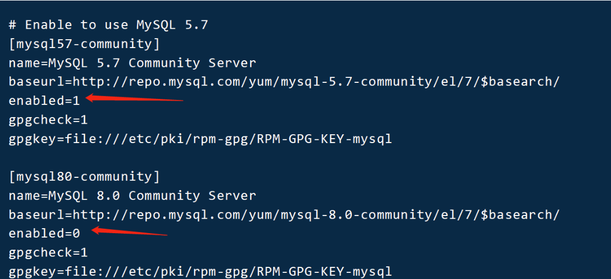


```shell
解析/etc/hosts
192.168.246.129  mysql-master
192.168.246.128  mysql-slave

mysql-master节点配置：
/etc/my.cnf
log-bin=/var/log/mysql/mysql-bin
server-id=1

[root@mysql-master ~]# mkdir /var/log/mysql/mysql-bin -p
[root@mysql-master ~]# chown -R mysql.mysql /var/log/mysql/

mysql-master:
启动，并且修改密码
[root@mysql-master ~]# systemctl start mysqld
[root@mysql-master ~]# grep password /var/log/mysqld.log
[root@mysql-master ~]# mysqladmin -uroot -p'Tq19xEZlS9.i' password 'QianFeng@123'
进入数据库，创建同步使用的用户
mysql> grant replication slave,reload,super on *.* to 'repl'@'%' identified by 'Repl@2021';
mysql> flush privileges;

mysql-slave节点配置：
/etc/my.cnf
[mysql]
host=127.0.0.1
user=root
password='QianFeng@123'   //这几行配置直接将用户/密码写入配置文件，命令行就不需要输入密码，就不会有警告提示

[mysqld]
server-id=2
[root@mysql-slave ~]# systemctl start mysqld
启动，并且修改密码,过程略
进入数据库，指定主节点；
mysql> \e
CHANGE MASTER TO
MASTER_HOST='mysql-master',
MASTER_USER='repl',
MASTER_PASSWORD='Repl@2021',
MASTER_LOG_FILE='mysql-bin.000001',
MASTER_LOG_POS=849;
    -> ;
mysql> start slave;
mysql> show slave status\G
```


```shell
2、被监控节点安装zabbix-agent应用，配置
[root@mysql-master ~]# rpm -Uvh https://repo.zabbix.com/zabbix/5.0/rhel/7/x86_64/zabbix-release-5.0-1.el7.noarch.rpm
[root@mysql-master ~]# yum -y install zabbix-agent zabbix-sender
[root@mysql-master ~]# cd /etc/zabbix/
[root@mysql-master zabbix]# cp zabbix_agentd.conf zabbix_agentd.bak
[root@mysql-master ~]# ls
zabbix_agentd.bak  zabbix_agentd.conf  zabbix_agentd.d
[root@mysql-master ~]# vim zabbix_agentd.conf   ----修改如下
Server=192.168.153.147 zabbix服务端的地址 
ServerActive=192.168.153.147 主动模式 zabbix-server-ip
Hostname=mysql-master 
UnsafeUserParameters=1 是否限制用户自定义 keys 使用特殊字符 1是可以启用特殊字符 0是不可以启用特殊字符
EnableRemoteCommands=1 是否允许别人执行远程操作命令，默认是禁用的，打开的话会有安全风险.
```


A：直接使用zabbix-server中自带的监控项模板net.tcp.port[port]


ip值为：msyql服务器的IP地址 10.0.0.122


port值为：mysql服务的端口号：3306


注意：在做这步之前需要先创建主机群组和主机，然后在进行监控项的创建


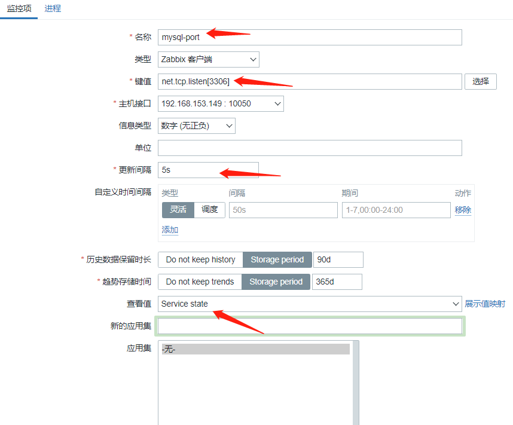


B：创建触发器，使用前一个值（值为1运行，值为0不运行）


C：创建图形（所有图形最后统一展示）


#### **2.监控Mysql主从复制状态**


A:使用自定义key的方式，先获取到主从状态的信息。


```shell
[root@mysql-slave zabbix]# mysql -uroot  -e "show slave status\G" | grep -E 'Slave_IO_Running: Yes|Slave_SQL_Running: Yes' |grep -c Yes //统计IO/SQL线程是YES的数量；
2
```


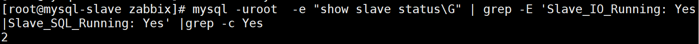


```shell
创建自定义key的文件在/etc/zabbix/zabbix.agent.d/status.conf,在文件中创建key为mysql.status
[root@mysql ~]# vim /etc/zabbix/zabbix_agentd.d/status.conf
UserParameter=mysql.status,mysql -u root -e "show slave status\G" | grep -E 'Slave_IO_Running: Yes|Slave_SQL_Running: Yes'  | grep -c Yes
设置完成后重新启动zabbix-agent
[root@mysql ~]# systemctl restart zabbix-agent
```


B:创建监控项


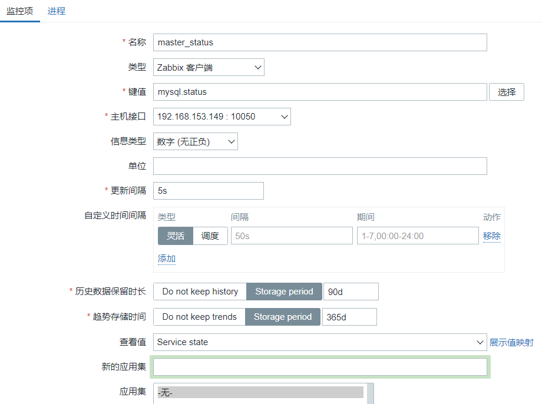


C:创建触发器（值=2，主从正常，值<2,主从失败）


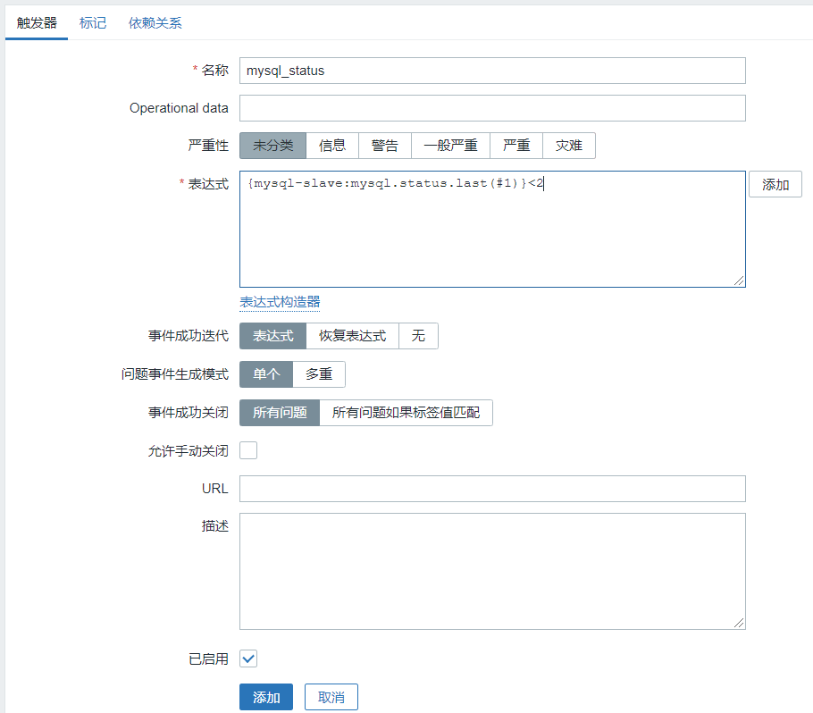


D：创建图形（所有图形最后统一展示）


#### **3.监控主从是否存在延迟**


A:使用自定义key的方式，先获取到主从延迟的信息。


```plain
获取SQL_Delay的值，不为0这出现主从延迟
[root@mysql-slave ~]# mysql -u root -e "show slave status\G" | grep SQL_Delay | awk -F : '{print $2}'
0
```


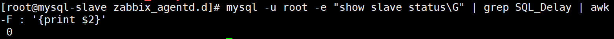


```shell
创建自定义key的文件在/etc/zabbix/zabbix.agent.d/status.conf,在文件中创建key为mysql.ab
[root@mysql ~]# cat /etc/zabbix/zabbix_agentd.d/status.conf 
UserParameter=mysql.ab,mysql -u root -e "show slave status\G" | grep "Seconds_Behind_Master" | awk -F: '{print $2}'
设置完成后重新启动zabbix-agent
[root@mysql ~]# systemctl restart zabbix-agent
```


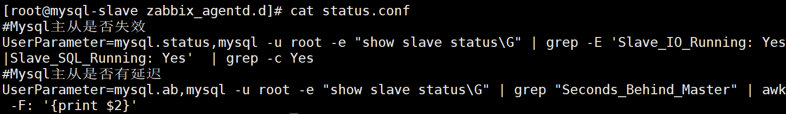


B:创建监控项


C:创建触发器（判断前一个值；值为0则没有延迟）


D:创建图形（所有图形最后统一展示）


#### **4.监控mysql吞吐量**


A:使用自定义key的方式，先获取到mysql吞吐量的信息（监控MYSQL的插入、查询、删除、更新等）。


注意：先修改数据库配置文件，在使用mysqladmin的时候不提示告警


```shell
[root@mysql-master ~]# cat /etc/my.cnf

如之前部署主从未设置：
进行下面操作：
从节点:
mysql> stop slave;
[root@mysql-slave zabbix_agentd.d]# systemctl stop mysqld

主节点：
添加配置
[root@mysql-master ~]# vim /etc/my.cnf
[client]
user=root
password='QianFeng@123'
[root@mysql-master ~]# systemctl restart mysqld

从节点：
[root@mysql-slave zabbix_agentd.d]# systemctl start mysqld
mysql> start slave
```


创建脚本获取对应的值


```shell
[root@mysql-master ~]# cat /etc/zabbix/zabbix_agentd.d/youngfit.sh 
#!/bin/bash
com_insert(){
mysqladmin extended-status | awk '/\<Com_insert\>/{print $4}'
}
com_slow(){
mysqladmin status | awk '{print $9}'
}
com_delete(){
mysqladmin extended-status | awk '/\<Com_delete\>/{print $4}'
}
com_update(){
mysqladmin extended-status | awk '/\<Com_update\>/{print $4}'
}
com_select(){
mysqladmin extended-status | awk '/\<Com_select\>/{print $4}'
}
$1
[root@mysql ~]# chmod 777 /etc/zabbix/zabbix_agentd.d/youngfit.sh
```


创建对应的key


```shell
[root@mysql-master ~]# cat /etc/zabbix/zabbix_agentd.d/status.conf 
UserParameter=mysql_status[*],bash /etc/zabbix/zabbix_agentd.d/youngfit.sh "$1"

重启zabbix-agent
[root@mysql ~]# systemctl restart zabbix-agent
```


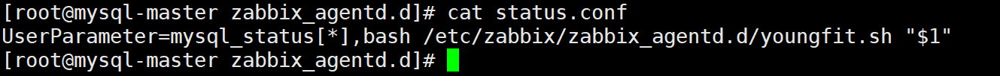


B:创建监控项


com_insert


com_delete


com_update


com_slow


com_select


C:创建图形


​         


​         


因没有大量操作，所以显示的有点简单。


#### **5.监控mysql的threads_connected**


```plain
Threads_connected
当前打开的连接的数量
这个是服务器状态变量
服务器维护许多提供操作相关信息的状态变量。你可以通过SHOW STATUS语句查看这些变量和它们的值：
```


A:使用自定义key的方式，先获取到threads_connected的信息。


```shell
[root@mysql-slave ~]# mysql -u root -e "select count(*) from performance_schema.threads where name like '%connection';" |grep -v count
```


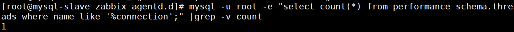


创建自定义key


```shell
[root@mysql-slave ~]# cat /etc/zabbix/zabbix_agentd.d/status.conf 
UserParameter=mysql_thread,mysql -u root -e "select count(*) from performance_schema.threads where name like '%connection';" |grep -v count
[root@mysql-slave ~]# systemctl restart zabbix-agent
```


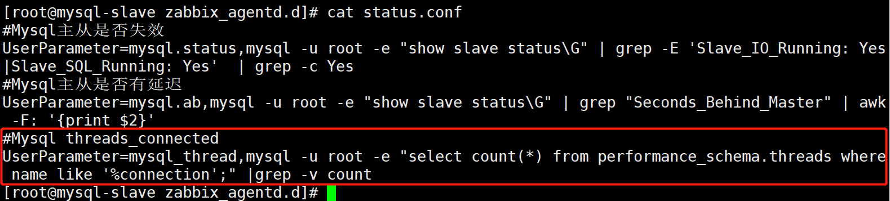


B:创建监控项


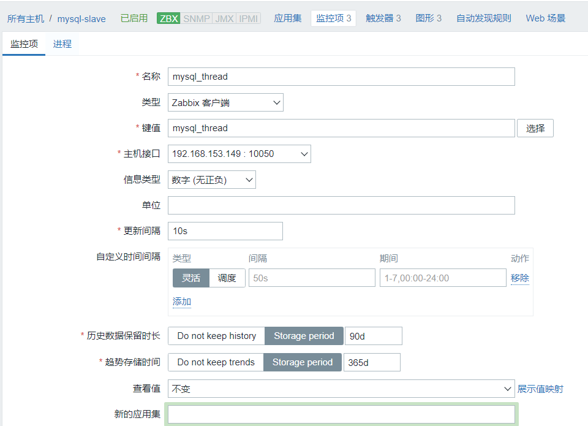


C:创建触发器，根据服务器的性能设置thread_connected的最大值

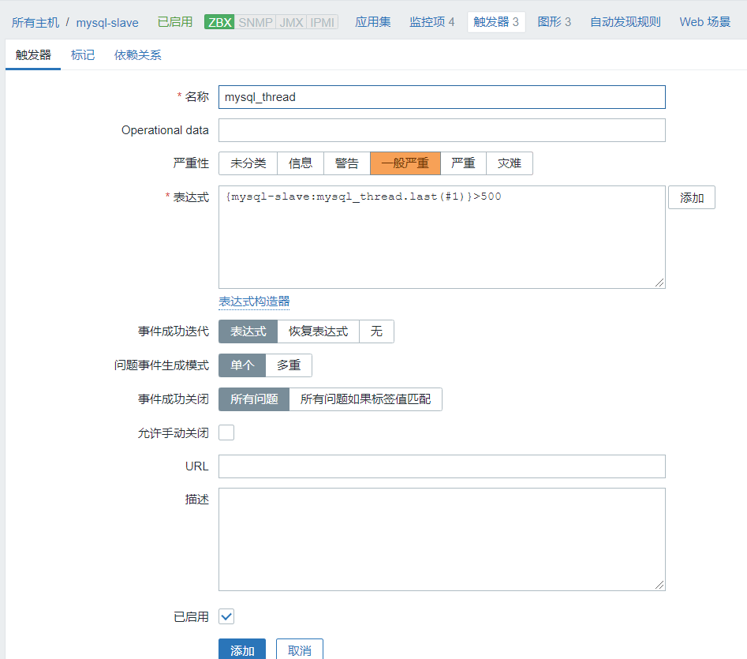

D:创建图形


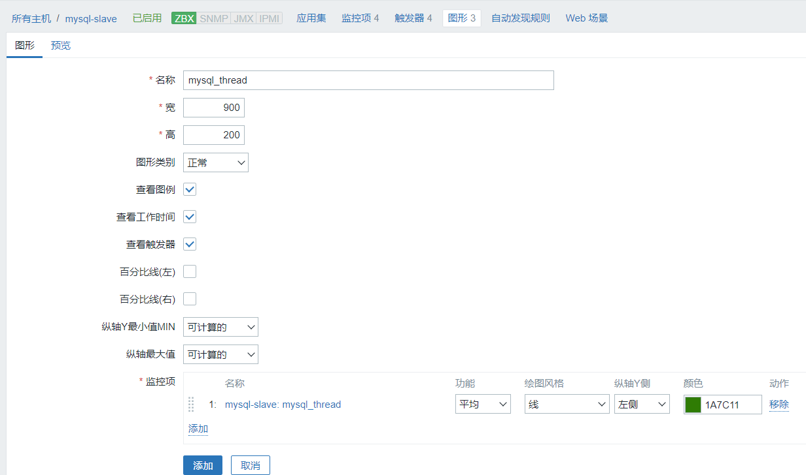

​         


#### **6.监控数据库的TPS**


```plain
TPS（Transactions Per Second，每秒处理事务数）
QPS（Queries Per Second，每秒查询数）
```


A:使用自定义key的方式，先获取到TPS的值；


计算公式：Com_commit/S+Com_rollback/S


```shell
创建一个获取tps的脚本
[root@mysql ~]# cat /etc/zabbix/zabbix_agentd.d/tps.sh 
#!/bin/bash
rollback=`mysqladmin -u root extended-status | awk  '/\<Com_rollback\>/{print $4}'`#事务回滚的次数
commit=`mysqladmin -u root extended-status | awk  '/\<Com_commit\>/{print $4}'` #事务提交的次数
s=`mysqladmin status| awk '{print $2}'`  #Mysql运行的总时长
echo $[($rollback+$commit)/$s]
[root@mysql ~]# chmod 777 /etc/zabbix/zabbix_agentd.d/tps.sh
```


创建自定义key


```shell
[root@mysql ~]# cat /etc/zabbix/zabbix_agentd.d/status.conf 
UserParameter=mysql.tps,bash /etc/zabbix/zabbix_agentd.d/tps.sh
[root@mysql ~]# systemctl restart zabbix-agent
```


B:创建监控项


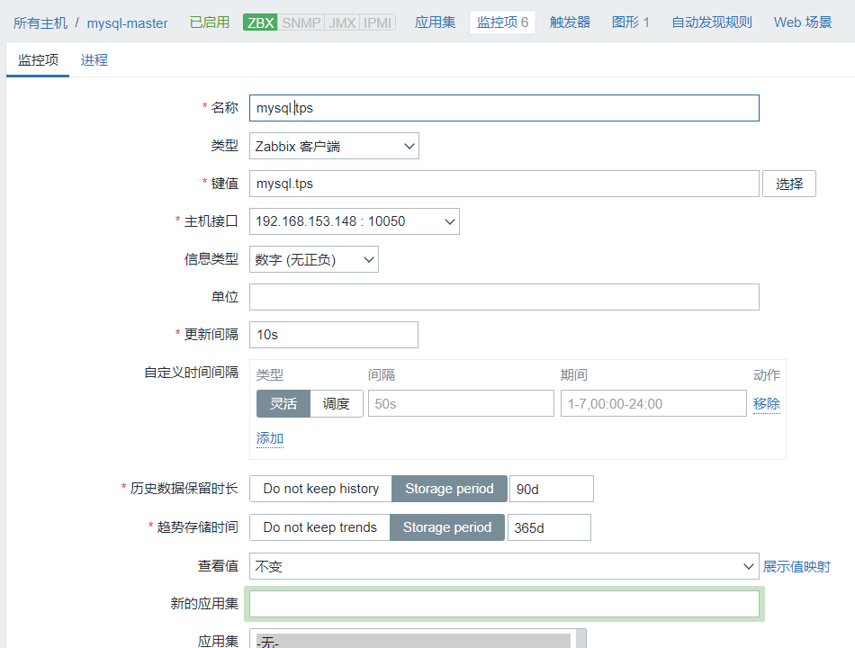

C:创建图形


​         


### **三：总结**


我们可以对数据库的监控很多，在企业中根据需求进行监控，下面是我们可以获取的能够对数据库进行监控的信息。


```plain
[root@mysql ~]# mysqladmin -u root extended-status | grep -i connections
| Connections                                   | 43187  
| Max_used_connections                          | 4
```


connections：试图连接MySQL服务器的次数


Max_used_connections：同时使用的连接的最大数目


```plain
[root@mysql ~]# mysqladmin -u root extended-status | grep -i flush_commands
| Flush_commands                                | 1
```


Flush_commands：执行flush命令的次数


```plain
[root@mysql ~]# mysqladmin -u root extended-status | grep -i open_tables | grep -iv com
| Open_tables                                   | 135
```


Open_tables：打开表的数量


## (Zabbix监控Redis实战)


### 一.安装配置redis服务


被监控端：


```shell
[root@redis-server ~]# yum -y install epel-reaease
[root@redis-server ~]# yum -y install redis
[root@redis-server ~]# vim /etc/redis.conf
```


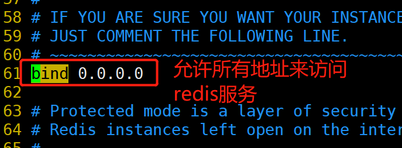


### **二.zabbix agent端配置监控redis的脚本**


##### **1.在命令行中查看数据redis的监控指标**


```shell
[root@redis-server ~]# systemct start redis
[root@redis-server ~]# yum -y install nmap-ncat
[root@redis-server ~]# echo -e "info\n quit" | nc 192.168.153.149 "6379" | grep -w redis_version
redis_version:3.2.12
# nc命令测试端口
# grep -w 精确匹配


[root@redis-server ~]# echo -e "info\n quit" | nc 192.168.153.149 "6379" | grep -w redis_version | awk -F ":" '{print $2}'
3.2.12

[root@redis-server ~]# echo -e "info\n quit" | nc 192.168.153.149 "6379" | grep -w os
os:Linux 3.10.0-693.el7.x86_64 x86_64

[root@redis-server ~]# echo -e "info\n quit" | nc 192.168.153.149 "6379" | grep -w os | awk -F ":" '{print $2}'
Linux 3.10.0-693.el7.x86_64 x86_64
```


##### **2.编写脚本获取redis的监控项数据**

```shell
[root@redis-server ~]# vim /etc/zabbix/zabbix_agentd.d/redis_monitoring.sh
#!/bin/bash

function redis_status(){
    R_PORT=$1
    R_COMMAND=$2
    (echo -en "INFO \r\n";sleep 1;) | nc 192.168.153.149 "$R_PORT" > /tmp/redis_"$R_PORT".tmp
    REDIS_STATUS_VALUE=$(grep -w "$R_COMMAND" /tmp/redis_"$R_PORT".tmp | cut -d ':' -f2)
    echo $REDIS_STATUS_VALUE
}

function help(){
    echo "${0} + redis_status+ PORT + COMMAND"
}

function main(){
    case $1 in
        redis_status)
            redis_status $2 $3
            ;;
        *)
            help
            ;;
    esac
}

main $1 $2 $3
```


## 三.自带模板监控

```shell
[root@redis-server ~]# systemctl stop zabbix-agent
[root@redis-server ~]# yum -y install zabbix-agent2
[root@zabbix-agent1 ~]# vim /etc/zabbix/zabbix_agent2.conf
Server=192.168.91.165 #监控端ip地址，打开被动模式
ServerActive=192.168.91.165 #监控端ip地址，打开主动模式
Hostname=zabbix-agent1  #定义主机名称
[root@redis-server ~]# systemctl start zabbix-agent2
```


## 监控Nginx性能状态

参考链接：https://www.cnblogs.com/bixiaoyu/p/9169319.html

Nginx在生产环境中的应用越来越广泛，所以需要对nginx的性能状态做一些监控，从而发现故障隐患，Ngnx的监控指标可分为：基本活动指标，错误指标，性能指标


监控Nginx思路：

1）首先，要想监控Nginx，需要状态模块的支持，也就是-with-http_stub_status_module；随后在nginx.conf配置开启status状态

2）通过awk取status的各个状态数值

3）自定义模板将取值status的状态写成脚本，放在UserParmeter后面，最后通过zabbix_get测试·agent端是否得到状态值

Accepts：接受的客户端请求数

Active：当前活跃的连接数

Handled：处理的请求数（正常服务器响应）

Requests：客户端处理的请求出（吞吐量）

Reading:当接收到的请求时，连接离开waiting状态，并且该请求本身使Reading状态统计数增加，这种状态下，nginx会读取客户端请求首部，请求首部是比较小的，因此这通常是一种快捷的操作

Writing：请求被读取之后，使得Writing状态计数增加，并保持在该状态，直到响应返回给客户端，这便意味着，该请求在writing状态时，一方面NGINX

### 安装nginx

```shell
[root@zabbix-agent-node1 ~]# cat /etc/yum.repos.d/nginx.repo 
[nginx-stable]
name=nginx stable repo
baseurl=http://nginx.org/packages/centos/$releasever/$basearch/
gpgcheck=1
enabled=1
gpgkey=https://nginx.org/keys/nginx_signing.key
module_hotfixes=true
[root@zabbix-agent-node1 ~]# yum -y install nginx

在配置的server模块中中，加入以下几行；
    location /status {
        stub_status on;
	      access_log off;
    }
[root@zabbix-agent-node1 ~]# systemctl start nginx
```


### 编写监控脚本

```shell
[root@zabbix-agent-node1 ~]# cat /etc/zabbix/zabbix_agentd.d/nginx_monitor.sh
NGINX_PORT=80 
NGINX_COMMAND=$1
nginx_active(){
     curl -s "http://127.0.0.1:"$NGINX_PORT"/status/" |awk '/Active/ {print $NF}'
}
nginx_reading(){
    /usr/bin/curl -s "http://127.0.0.1:"$NGINX_PORT"/status/" |awk '/Reading/ {print $2}'
}
nginx_writing(){
    /usr/bin/curl -s "http://127.0.0.1:"$NGINX_PORT"/status/" |awk '/Writing/ {print $4}'
 }
nginx_waiting(){
    /usr/bin/curl -s "http://127.0.0.1:"$NGINX_PORT"/status/" |awk '/Waiting/ {print $6}'
}
nginx_accepts(){
    /usr/bin/curl -s "http://127.0.0.1:"$NGINX_PORT"/status/" |awk 'NR==3 {print $1}'
}
nginx_handled(){
    /usr/bin/curl -s "http://127.0.0.1:"$NGINX_PORT"/status/" |awk 'NR==3 {print $2}'
}
nginx_requests(){
    /usr/bin/curl -s "http://127.0.0.1:"$NGINX_PORT"/status/" |awk 'NR==3 {print $3}'
}
case $NGINX_COMMAND in
active)
nginx_active;
;;
reading)
nginx_reading;
;;
writing)
nginx_writing;
;;
waiting)
nginx_waiting;
;;
accepts)
nginx_accepts;
;;
handled)
nginx_handled;
;;
requests)
nginx_requests;
;;
      *)
echo $"USAGE:$0 {active|reading|writing|waiting|accepts|handled|requests}"
    esac
[root@zabbix-agent-node1 ~]# chmod +x /etc/zabbix/zabbix_agentd.d/nginx_monitor.sh
[root@zabbix-agent-node1 zabbix_agentd.d]# cat nginx_monitor.conf 
UserParameter=nginx_status[*],/bin/bash /etc/zabbix/zabbix_agentd.d/nginx_monitor.sh "$1"
```

在zabbix-server端，或者zabbix-proxy端，测试一下能否获取到状态数值

```shell
[root@zbxproxy ~]# zabbix_get -s 192.168.91.139 -k "nginx_status[active]" -p 10050
1
[root@zbxproxy ~]# zabbix_get -s 192.168.91.139 -k "nginx_status[requests]" -p 10050
8
```

### 创建nginx监控模板

方便后续机器直接关联


### 创建图形


完事，加油~