# Zabbix飞书报警

### 1.创建群聊-->创建自定义机器人


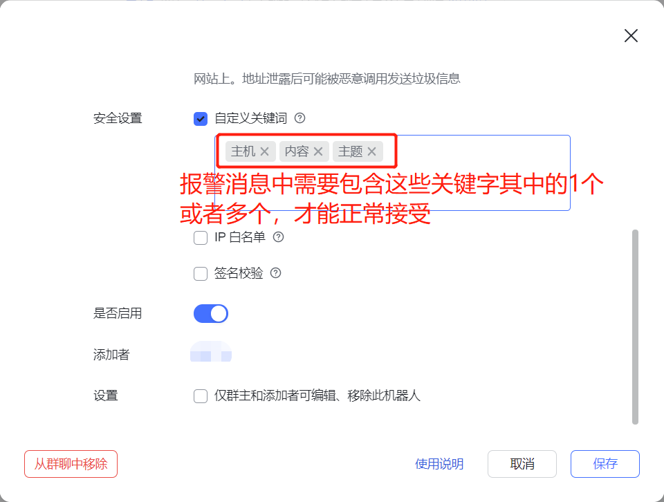

### 2.准备报警脚本

报警脚本，写在zabbix-server端

```plain
[root@zabbix-server alertscripts]# pwd
/usr/lib/zabbix/alertscripts

[root@zabbix-server alertscripts]# cat feishu.py 
#!/usr/local/python3/bin/python3
#我的pythone解释器的位置是安装到了上面，根据自己的安装位置指定解释器即可
import requests
import json
import sys
import os
import datetime

url = "https://open.feishu.cn/open-apis/bot/v2/hook/58cae8bb-a9d6-4d7a-8318-b45afaceebff"


def send_message(message):
    payload_message = {
        "msg_type": "text",
        "content": {
            "text": message
        }
    }
    headers = {
        'Content-Type': 'application/json'
    }

    response = requests.request("POST", url, headers=headers, data=json.dumps(payload_message))
    return response


if __name__ == '__main__':
    text = sys.argv[1]
    send_message(text)
```

### 3.安装python3

这里，我发现用python2.7执行脚本，是会失败的；所以我这里安装了python3.6.5的

```plain
[root@zabbix-server ~]# wget https://www.python.org/ftp/python/3.6.5/Python-3.6.5.tgz
[root@zabbix-server ~]# yum -y install gcc zlib-devel bzip2-devel openssl-devel ncurses-devel sqlite-devel readline-devel tk-devel gdbm-devel db4-devel libpcap-devel xz-devel libffi-devel
[root@zabbix-server ~]# mkdir /opt/python/
[root@zabbix-server ~]# tar -xvzf Python-3.6.5.tgz  -C /opt/python/
cd Python-3.6.5/
[root@zabbix-server ~]# cd /opt/python/Python-3.6.5/
[root@zabbix-server Python-3.6.5]# ./configure --prefix=/usr/local/python3
[root@zabbix-server Python-3.6.5]# make && make install
```

### 4.配置python环境变量

```plain
[root@zabbix-server Python-3.6.5]# tail -10 /etc/profile
```

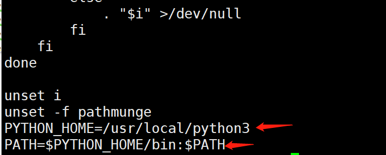

```plain
[root@zabbix-server Python-3.6.5]# source /etc/profile
```

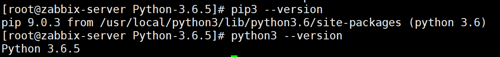

### 5.测试报警脚本

```plain
[root@zabbix-server ~]# pip3 install requests
[root@zabbix-server ~]# cd /usr/lib/zabbix/alertscripts/
[root@zabbix-server alertscripts]# python3 feishu.py "主机"
```


### 6.配置Zabbix

#### 给主机zabbix-agent1添加监控项

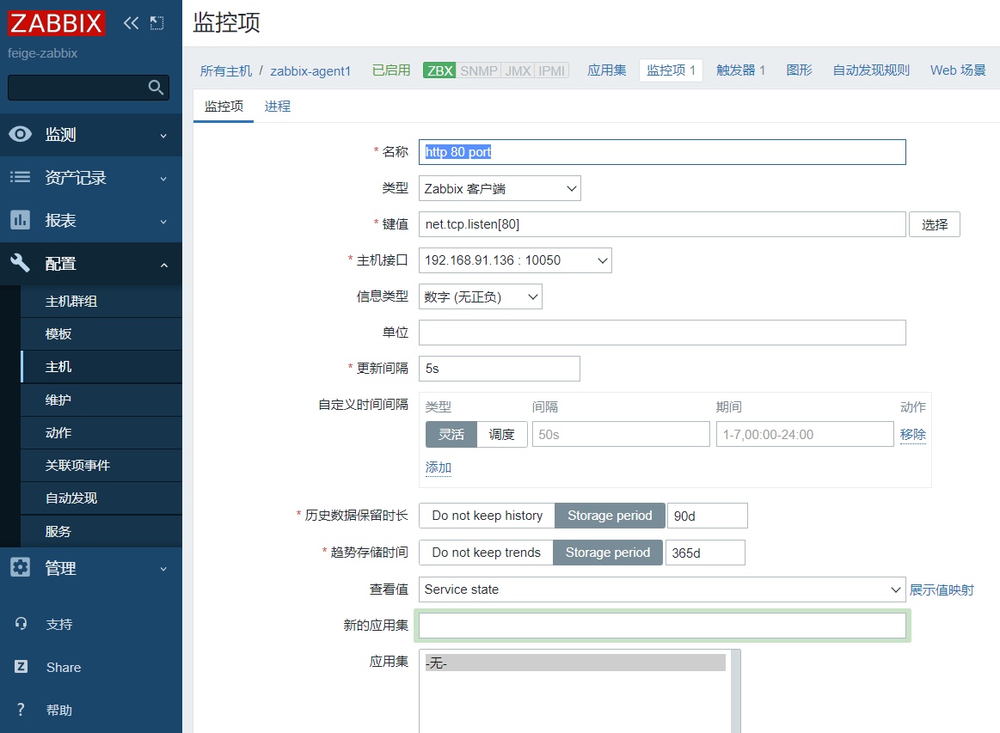

#### 添加触发器

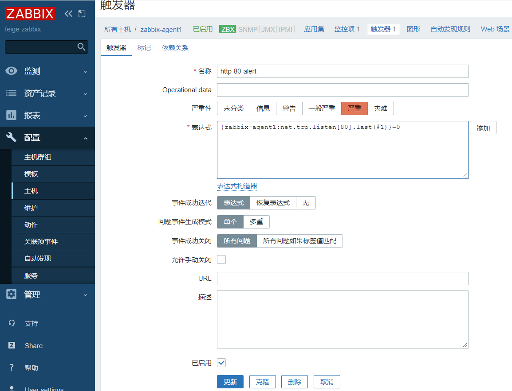

#### 添加报警媒介

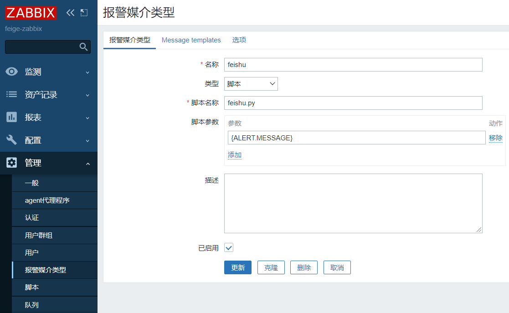

```plain
问题: {EVENT.NAME}
问题发生时间: {EVENT.TIME} on {EVENT.DATE}
问题: {EVENT.NAME}
主机: {HOST.NAME}
级别: {EVENT.SEVERITY}
数据: {EVENT.OPDATA}
事件: {EVENT.ID}
{TRIGGER.URL}
```

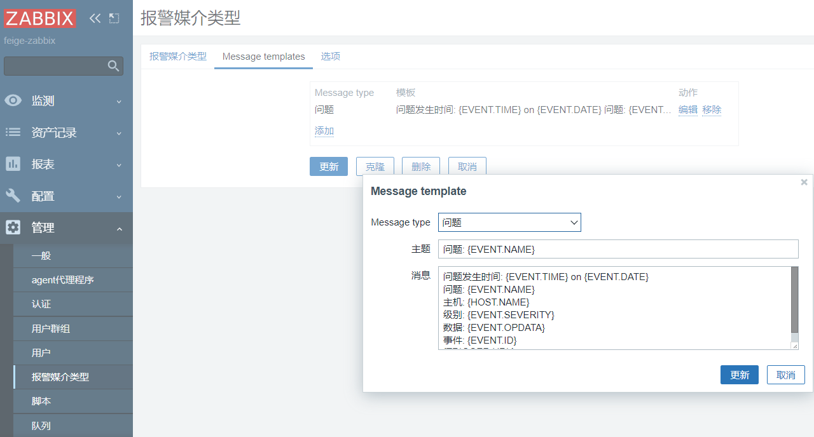

#### 添加动作

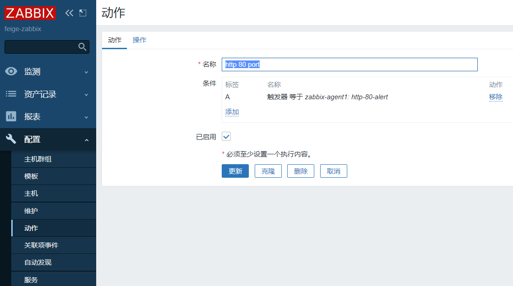

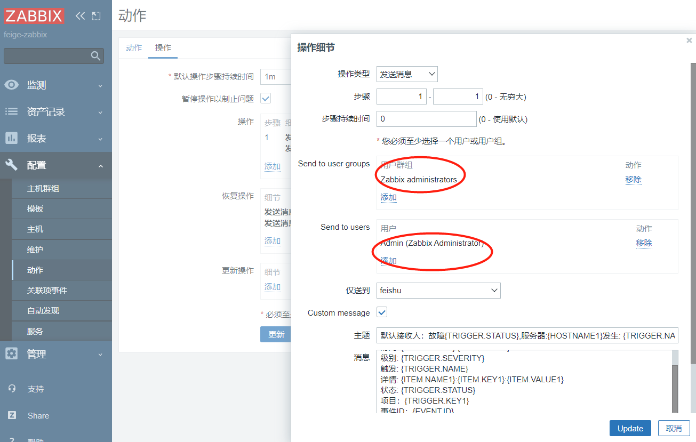

报警模板：

```plain
默认接收人：故障{TRIGGER.STATUS},服务器:{HOSTNAME1}发生: {TRIGGER.NAME}故障!
默认信息：
    告警主机:{HOSTNAME1}
    告警时间:{EVENT.DATE} {EVENT.TIME}
    告警等级:{TRIGGER.SEVERITY}
    告警信息: {TRIGGER.NAME}
    告警项目:{TRIGGER.KEY1}
    问题详情:{ITEM.NAME}:{ITEM.VALUE}
    当前状态:{TRIGGER.STATUS}:{ITEM.VALUE1}
    事件ID:{EVENT.ID}
```

#### 用户关联媒介

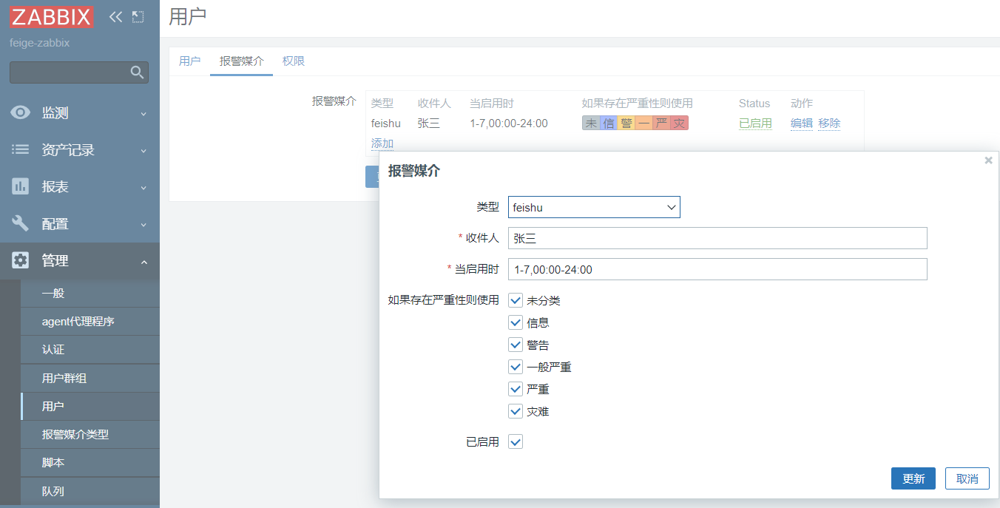

### 7.验证报警

```plain
[root@zabbix-agent1 ~]# systemctl stop httpd
```

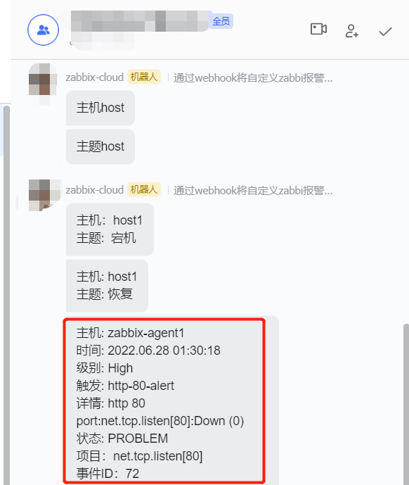