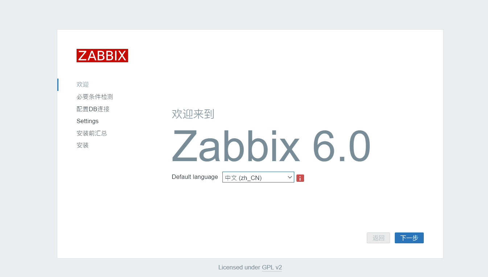
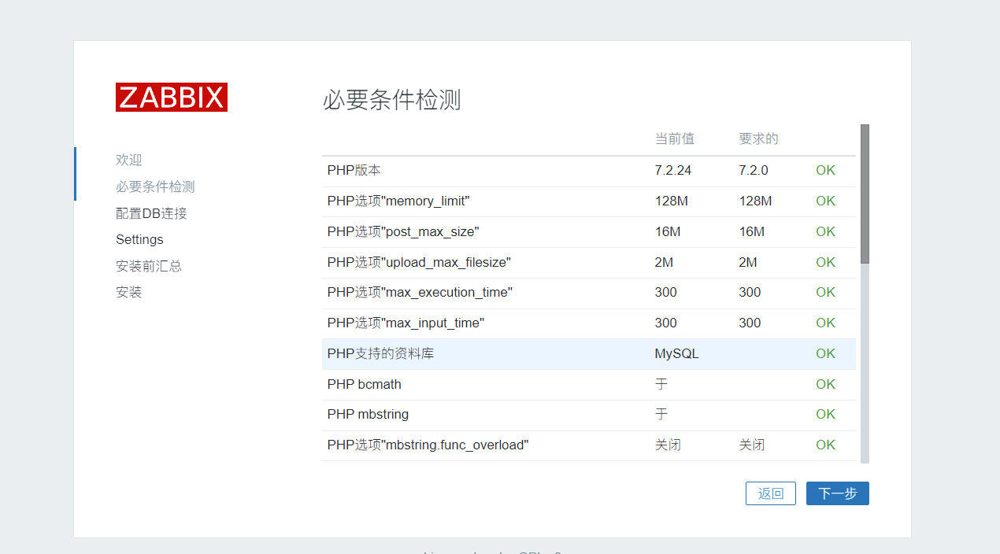
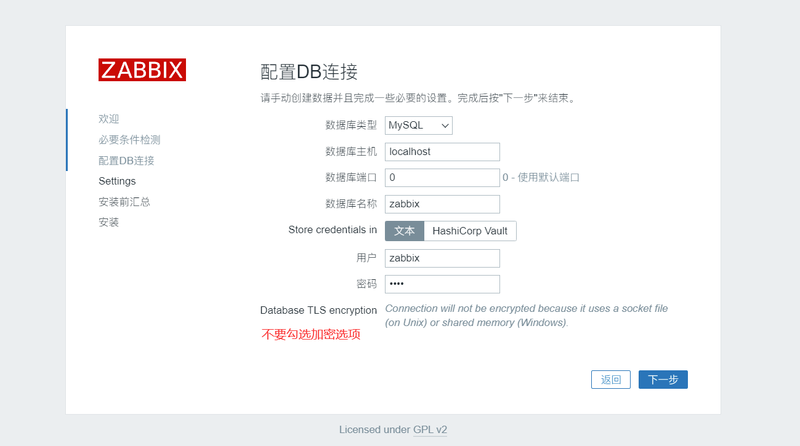
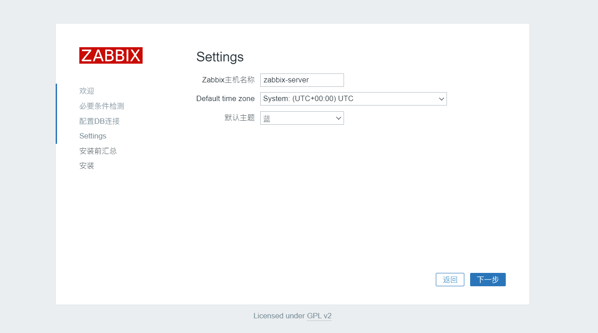
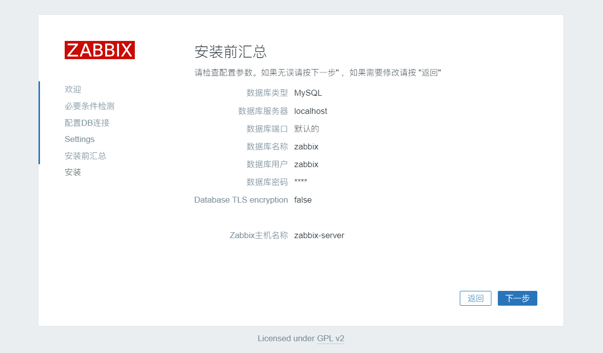
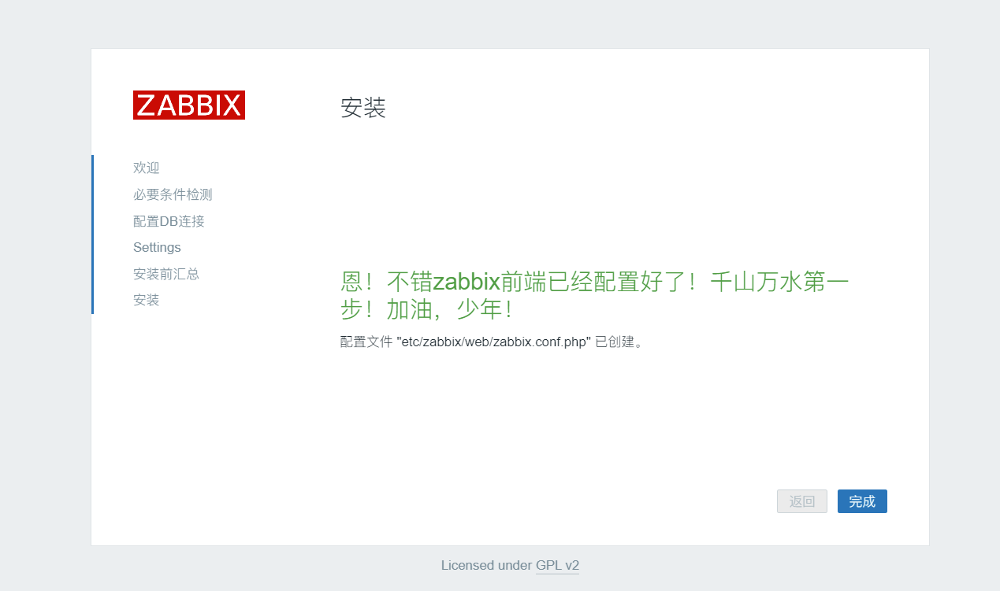
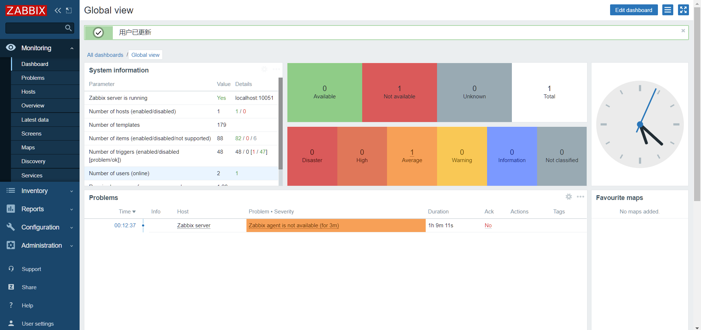

# zabbix 6.0部署

[TOC]


# 环境

| 系统    | ip              | zabbix版本 | 主机名        |
| ------- | --------------- | ---------- | ------------- |
| centos8 | 192.168.249.141 | 6.0        | zabbix-server |
| ceneto8 | 192.168.249.148 | 6.0        | zabbix-agent  |


1、关闭防火墙、selinux

 

2、修改系统主机名

 

3、配置静态ip地址


# 一、zabbix 6.0 部署


zabbix 6.0版本为长期支持版本，安装方式封装成都更高，web ui更加细致，喜人，本篇记录zabbix6.0安装细节


[官方部署文档，同样简单好用](https://www.zabbix.com/cn/download?zabbix=6.0&os_distribution=centos&os_version=8&db=mysql&ws=nginx)


### 1、安装yum源


```properties
[root@zabbix-server ~]# dnf install -y  https://repo.zabbix.com/zabbix/6.0/rhel/8/x86_64/zabbix-release-6.0-1.el8.noarch.rpm
[root@zabbix-server ~]# dnf clean all
[root@zabbix-server ~]# dnf makecache
```


### 2、安装相关软件


```properties
# 这里我们安装了比较多的包
[root@zabbix-server ~]# dnf install -y zabbix-server-mysql zabbix-web-mysql zabbix-nginx-conf zabbix-sql-scripts zabbix-selinux-policy zabbix-agent 
[root@zabbix-server ~]# dnf install -y langpacks-zh_CN
```


### 3、数据库安装和配置


```properties
# 配置yum源
[root@zabbix-server ~]# vim /etc/yum.repos.d/mariadb.repo
[mariadb]
name = MariaDB
baseurl = https://mirrors.aliyun.com/mariadb/yum/10.6/centos8-amd64
module_hotfixes=1
gpgkey=https://mirrors.aliyun.com/mariadb/yum/RPM-GPG-KEY-MariaDB
gpgcheck=1

# 安装
[root@zabbix-server ~]# dnf install -y MariaDB-server MariaDB-client

# mariadb 配置文件
[root@zabbix-server ~]# vim /etc/my.cnf.d/server.conf
[mysqld]
skip_name_resolve = ON          #跳过主机名解析
innodb_file_per_table = ON      #
innodb_buffer_pool_size = 256M  #缓存池大小
max_connections = 2000          #最大连接数
log-bin = master-log            #开启二进制日志

# 启动数据库
[root@zabbix-server ~]# systemctl restart mariadb

# 进入数据库进行数据初始化
MariaDB [(none)]> create database zabbix character set utf8 collate utf8_bin;  # 创建zabbix数据库
MariaDB [(none)]> delete from mysql.user where Password = '';
MariaDB [(none)]> grant all on zabbix.* to 'zabbix'@'%' identified by 'keer';  # 注意授权网段
MariaDB [(none)]> flush privileges;           # 刷新授权
```


### 4、数据表导入


```properties
# 让我们来看一下zabbix-server-mysql 这个包为我们安装了哪些内容
[root@localhost zabbix]# rpm -ql zabbix-server-mysql
/etc/logrotate.d/zabbix-server
/etc/zabbix/zabbix_server.conf
/usr/lib/.build-id
/usr/lib/.build-id/db
/usr/lib/.build-id/db/f77a67400ee2ff9f179d73c4e36742071a46c0
/usr/lib/systemd/system/zabbix-server.service
/usr/lib/tmpfiles.d/zabbix-server.conf
/usr/lib/zabbix/alertscripts
/usr/lib/zabbix/externalscripts
/usr/sbin/zabbix_server_mysql
/usr/share/doc/zabbix-server-mysql
/usr/share/doc/zabbix-server-mysql/AUTHORS
/usr/share/doc/zabbix-server-mysql/COPYING
/usr/share/doc/zabbix-server-mysql/ChangeLog
/usr/share/doc/zabbix-server-mysql/NEWS
/usr/share/doc/zabbix-server-mysql/README
/usr/share/man/man8/zabbix_server.8.gz
/var/log/zabbix
/var/run/zabbix


[root@zabbix-server ~]# zcat /usr/share/doc/zabbix-sql-scripts/mysql/server.sql.gz | mysql -uzabbix -p"keer" zabbix
```


### 5、修改配置，启动服务


```properties
[root@zabbix-server ~]# cd /etc/zabbix
[root@zabbix-server zabbix]# ls
web  zabbix_agentd.conf  zabbix_agentd.d  zabbix_server.conf
[root@zabbix-server zabbix]# cp zabbix_server.conf{,.bak} # 备份配置文件
[root@zabbix-server zabbix]# vim zabbix_server.conf  # 修改一下内容，其他配置可以参考4.4文档
ListenPort=10051            #默认监听端口
SourceIP=192.168.249.141     #发采样数据请求的IP
DBHost=192.168.249.141       #数据库对外的主机
DBName=zabbix               #数据库名称
DBUser=zabbix              #数据库用户
DBPassword=keer             #数据库密码
DBPort=3306                 #数据库启动端口

# 开启服务并检查
[root@zabbix-server zabbix]# systemctl start zabbix-server.service
[root@zabbix-master zabbix]# ss -nutl |grep 10051
tcp    LISTEN     0      128       *:10051                 *:*                  
tcp    LISTEN     0      128      :::10051                :::*
```


### 6、配置 web GUI


```properties
[root@zabbix-server ~]# vim /etc/nginx/nginx.conf
#将配置文件中的server模块删除掉
server {
...
} # 删除

# 启动服务
[root@zabbix-server ~]# systemctl restart zabbix-server zabbix-agent nginx php-fpm
[root@zabbix-server ~]# systemctl enable zabbix-server zabbix-agent nginx php-fpm
```


### 7、浏览器访问


```
http://192.168.249.141
```








#### 注意数据加密的选项不要勾

















### 8、配置agent端


```properties
[root@zabbix-agent ~]# yum install zabbix-agent zabbix-sender -y
```