# 云服务器上线QQ农场平台

## 1、先还原云服务器操作系统

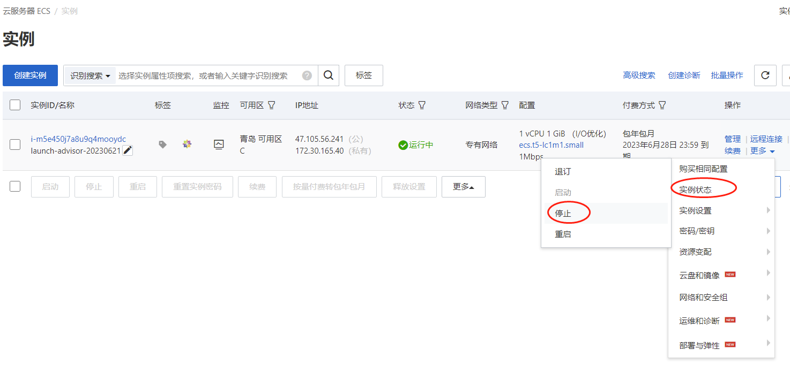


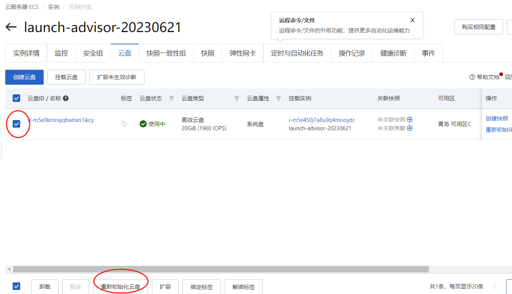

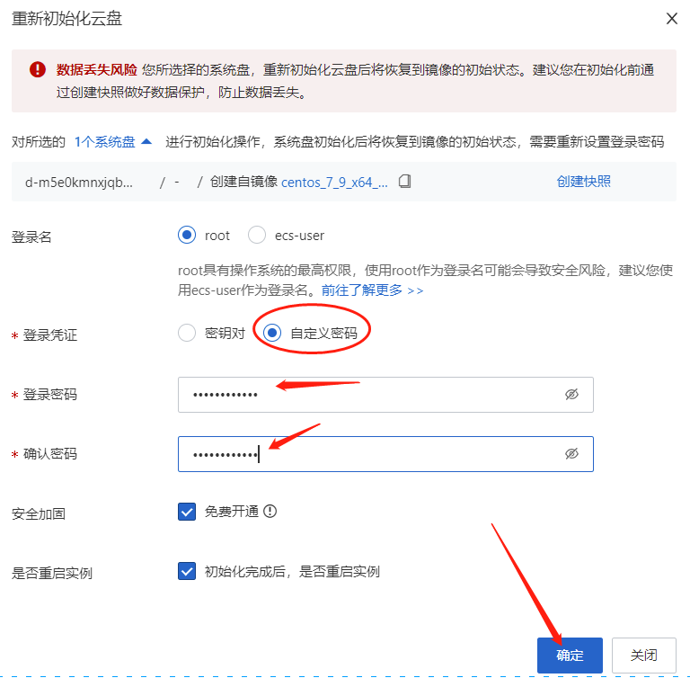


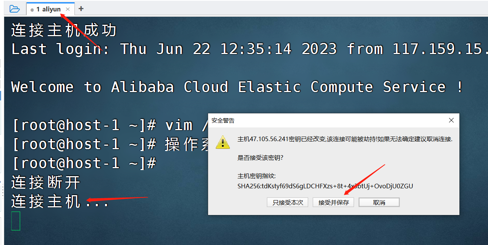

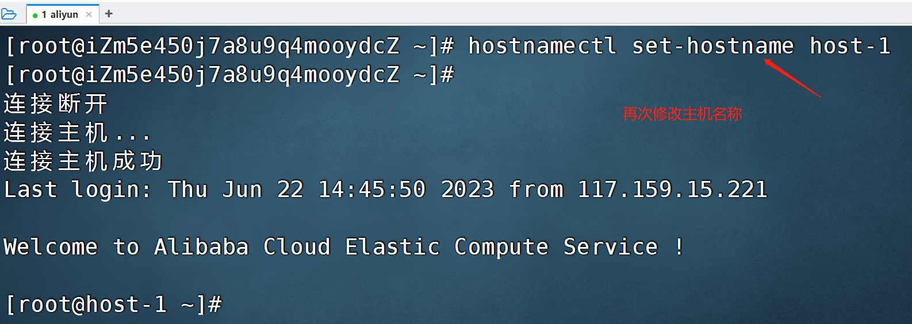


## 2、部署LNMP环境

```shell
LNMP = Linux操作系统  + Nginx网站服务  + MariaDB数据库  +  PHP后端服务
[root@host-1 ~]# yum -y install php php-fpm php-curl php-intl  php-mysql
软件包注释：
PHP-FPM是一个PHPFastCGI管理器
安装某些PHP源码时需求系统开启curl扩展
php-intl是ICU 库的一个包装器
php-mysql是连接数据库的模块
GD库是php处理图形的扩展库
```

## 3、安装MariaDB数据库

```shell
[root@host-1 ~]# yum -y install mariadb   mariadb-server
```

## 4、启动MariaDB数据库

```shell
[root@host-1 ~]# systemctl start mariadb
[root@host-1 ~]# systemctl status mariadb
```

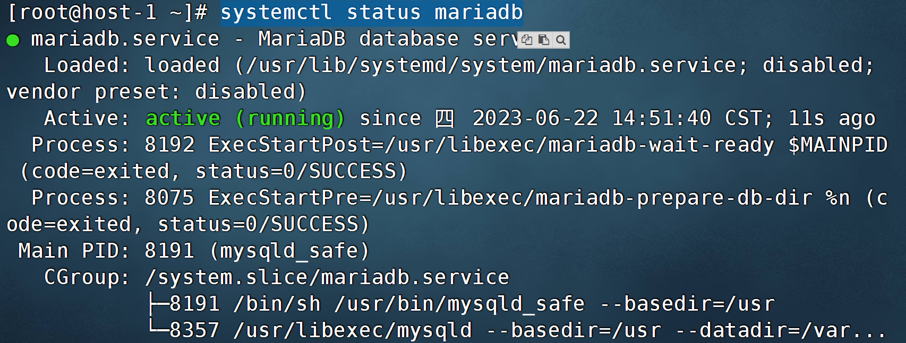

```shell
[root@host-1 ~]# systemctl enable mariadb
[root@host-1 ~]# mysql
MariaDB [(none)]> create database farm;  #创建1个库，库名为farm
MariaDB [(none)]> quit									  #退出
```

## 5、安装Nginx网站服务

```shell
[root@host-1 ~]# yum -y install nginx
[root@host-1 ~]# systemctl start nginx
[root@host-1 ~]# systemctl status nginx
```

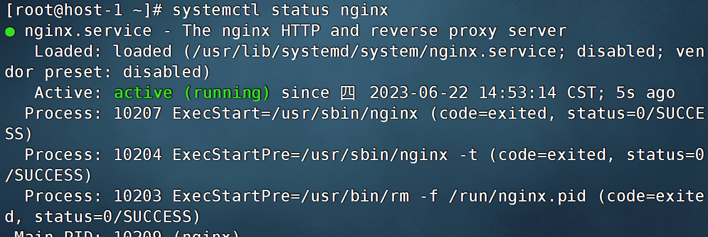

```shell
[root@host-1 ~]# systemctl enable nginx
```

## 6、访问测试Nginx

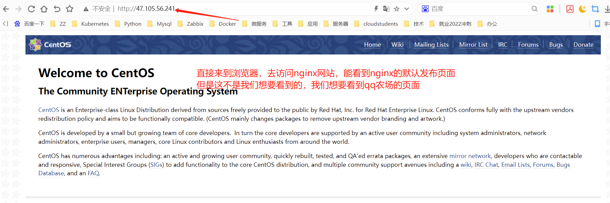

## 7、上线QQ农场项目

### 7.1 上传项目包

```shell
[root@host-1 ~]# yum -y install lrzsz  #下载上传工具
[root@host-1 ~]# rz
```

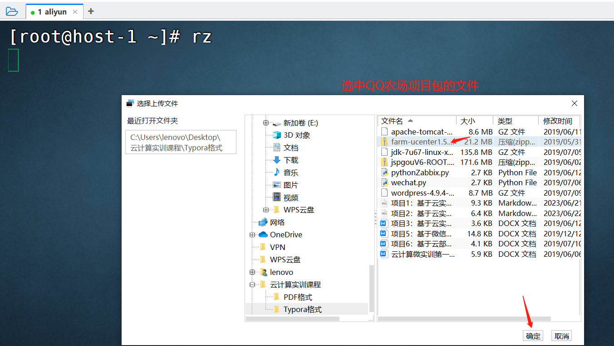

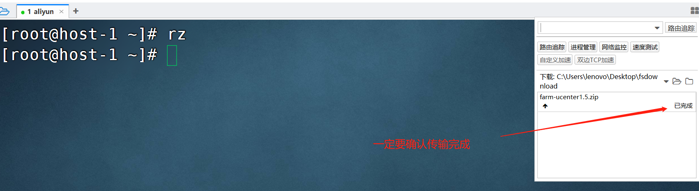

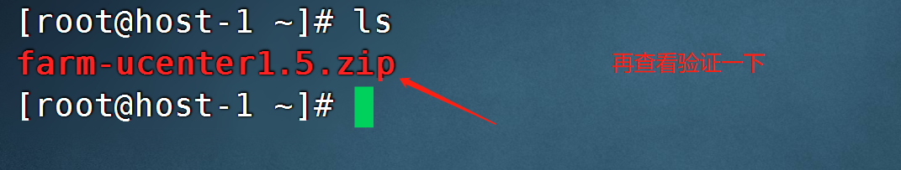

### 7.2 设置网站发布目录

```shell
[root@host-1 ~]# mkdir /farm
```

### 7.3 解压项目包

```shell
[root@youngfit ~]# yum -y install unzip   #下载解压工具
[root@host-1 ~]# unzip farm-ucenter1.5.zip
```

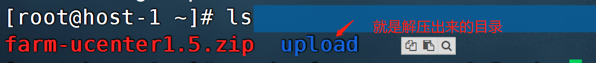

### 7.4 拷贝项目资源到默认发布目录/farm下

```shell
[root@host-1 ~]# cp -rf upload/* /farm/
```

### 7.5 修改Nginx配置

```shell
[root@host-1 ~]# rm -rf /etc/nginx/nginx.conf  #删除Nginx默认的主配置文件（因为这个文件内容过于繁琐）
[root@host-1 ~]# mv /etc/nginx/nginx.conf.default /etc/nginx/nginx.conf
[root@host-1 ~]# vim /etc/nginx/nginx.conf
```

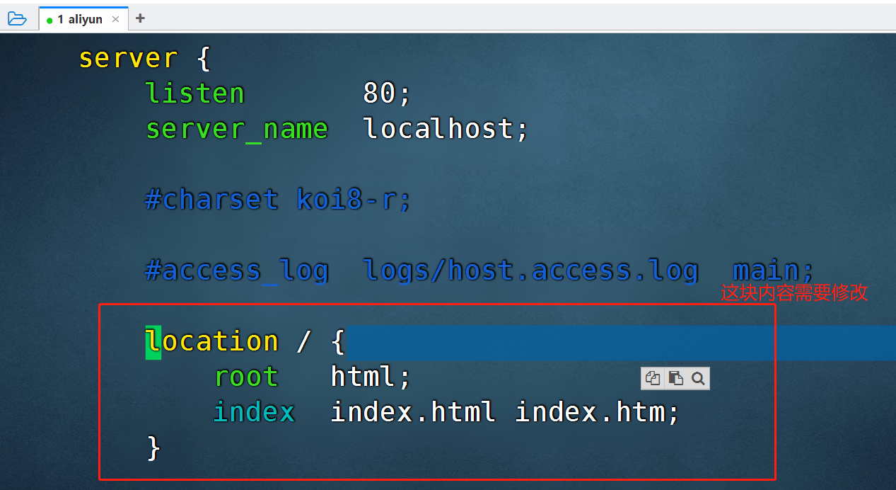

按小写的i进入编辑模式，修改为下图模样


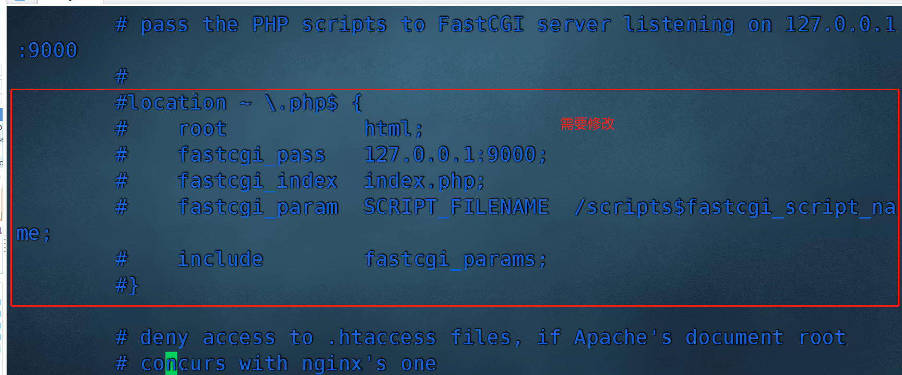

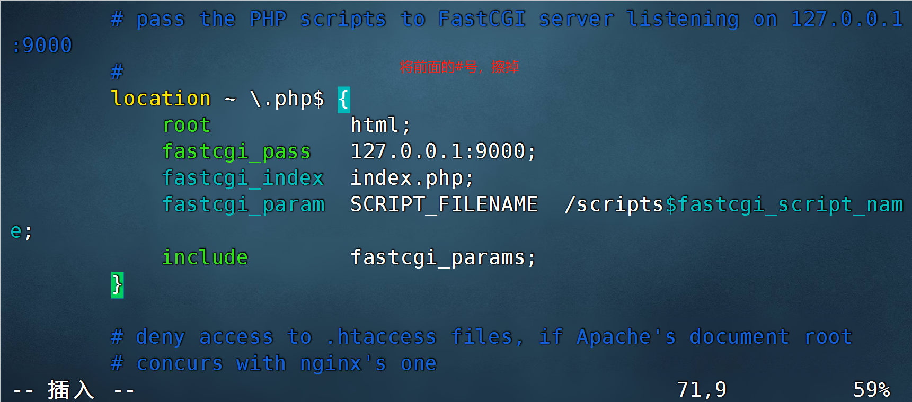

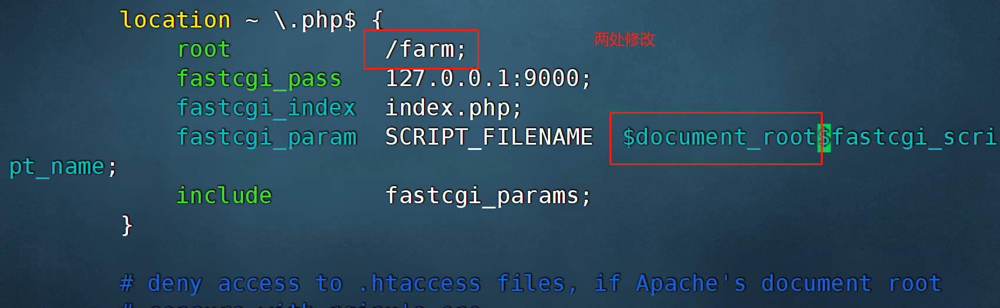

```shell
[root@host-1 ~]# systemctl restart nginx
```

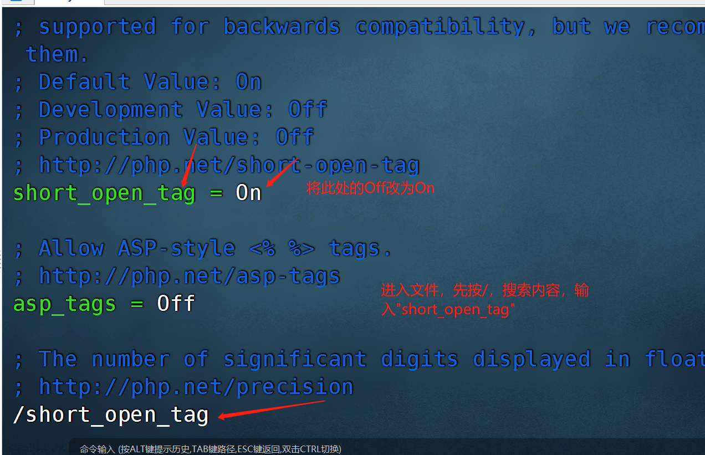

```shell
[root@host-1 ~]# systemctl restart php-fpm
[root@host-1 ~]# chmod -R 777 /farm/
```

### 7.6 再次访问

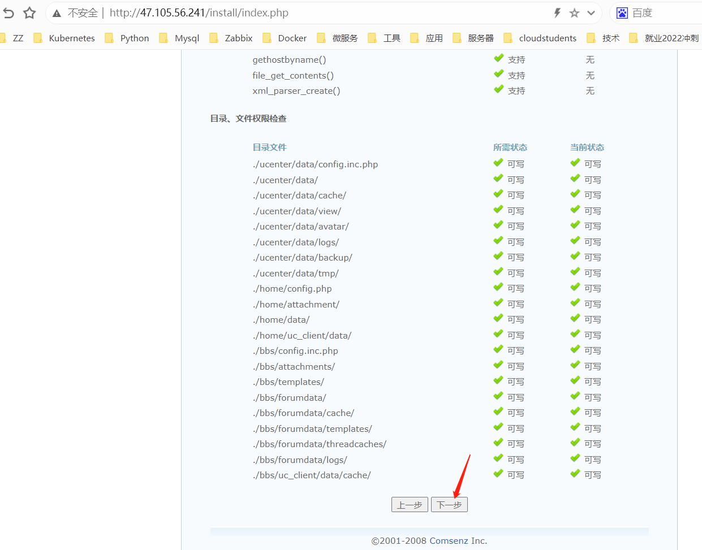

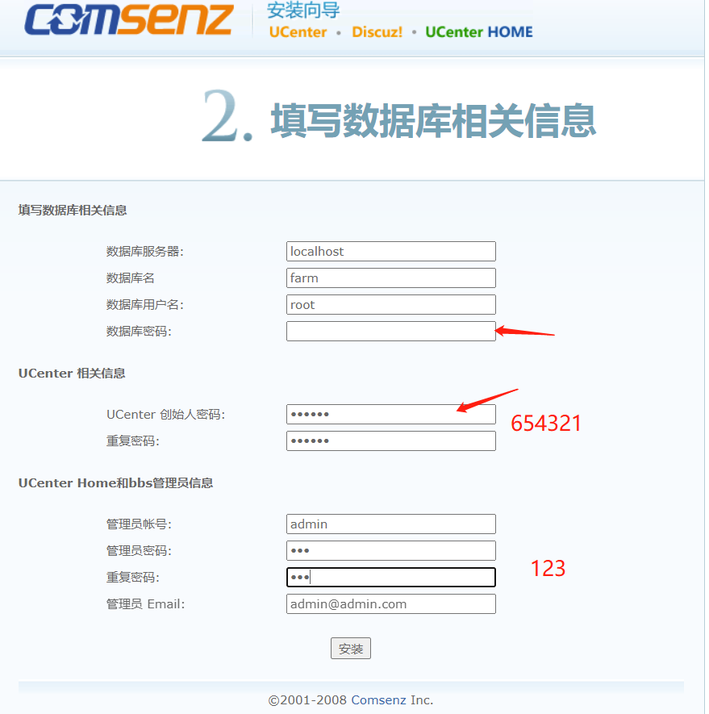


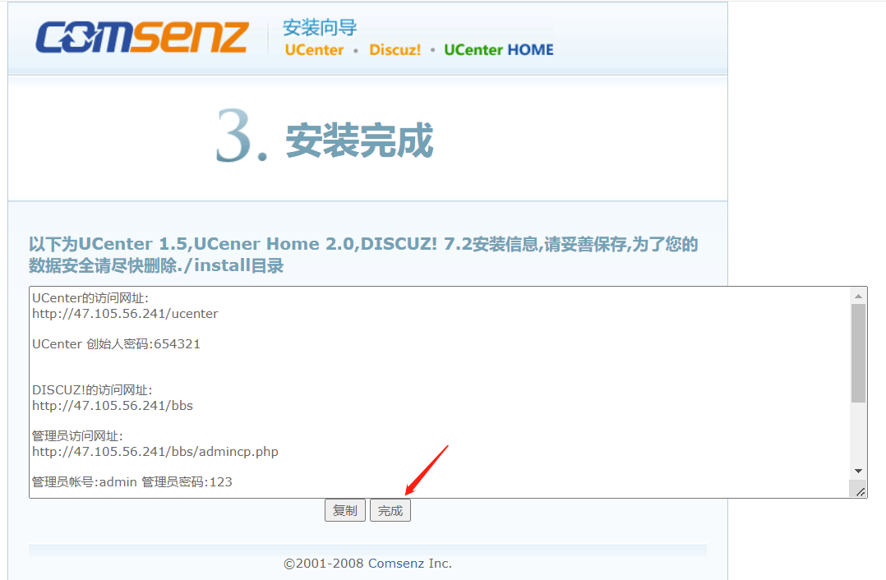