# 云服务器上线WordPress博客平台

## 1、部署LAMP架构

```shell
LAMP = Linux操作系统 + Apache网站服务 + MariaDB数据库 + PHP后端语言
```

## 2、安装Apache MariaDB PHP

```shell
[root@host-1 ~]# yum install httpd mariadb-server mariadb php php-mysql gd php-gd

httpd：就是apache的软件包名称
mariadb-server: 是Maridb服务安装包
maridb: 是连接数据库的客户端命令工具
php: php语言所依赖的基础环境
php-mysql: 能让php连接数据库
gd php-gd： 如果页面上有动态图，装上这两个软件包，能正常显示动态图效果
```

## 3、启动Apache

```shell
[root@host-1 ~]# systemctl start httpd   #启动apache
[root@host-1 ~]# systemctl status httpd  #查看apache的状态
```

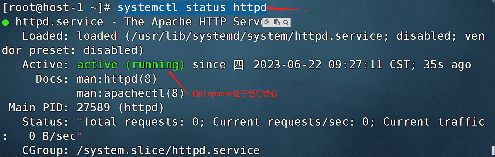

```shell
[root@host-1 ~]# systemctl enable httpd #将apache设置为开机自启
```

## 4、重启云服务器验证

```shell
[root@host-1 ~]# reboot   #重启当前机器
```

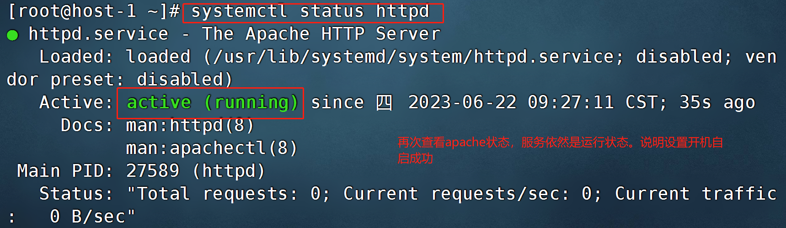

## 5、启动MariaDB数据库

```shell
[root@host-1 ~]# systemctl start mariadb   #启动MariaDB数据库
[root@host-1 ~]# systemctl status mariadb   #查看MariaDB数据库的状态
```

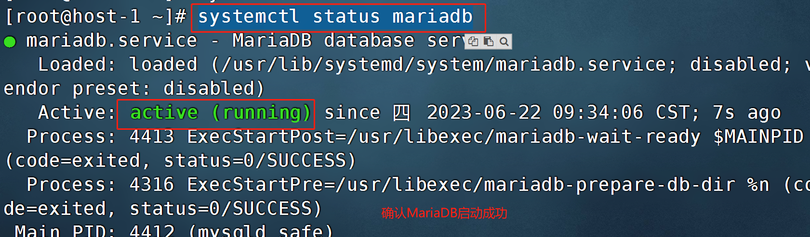

```shell
[root@host-1 ~]# systemctl enable mariadb   #将MariaDB数据库设置为开机自启
```

## 6、部署WordPress网站

### 6.1 准备数据库

```shell
[root@host-1 ~]# mysql
MariaDB [(none)]> create database wordpress;    #创建1个库，库名为wordpress
MariaDB [(none)]> \q   #退出
```

### 6.2 下载wordpress的源码包

```shell
[root@host-1 ~]# wget https://cn.wordpress.org/wordpress-4.9.4-zh_CN.tar.gz
```

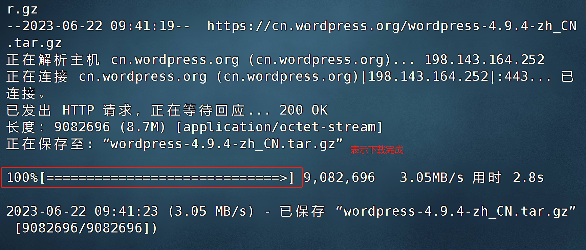

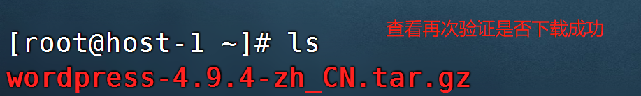

### 6.3 解压wordpress源码包

```shell
[root@host-1 ~]# tar xf wordpress-4.9.4-zh_CN.tar.gz
```


## 7、设置云服务器安全组策略

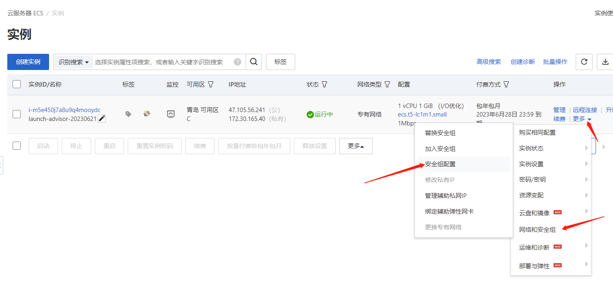

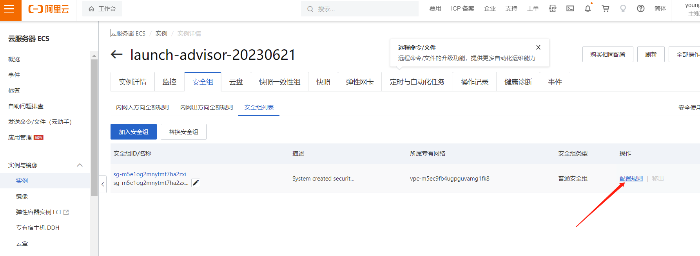

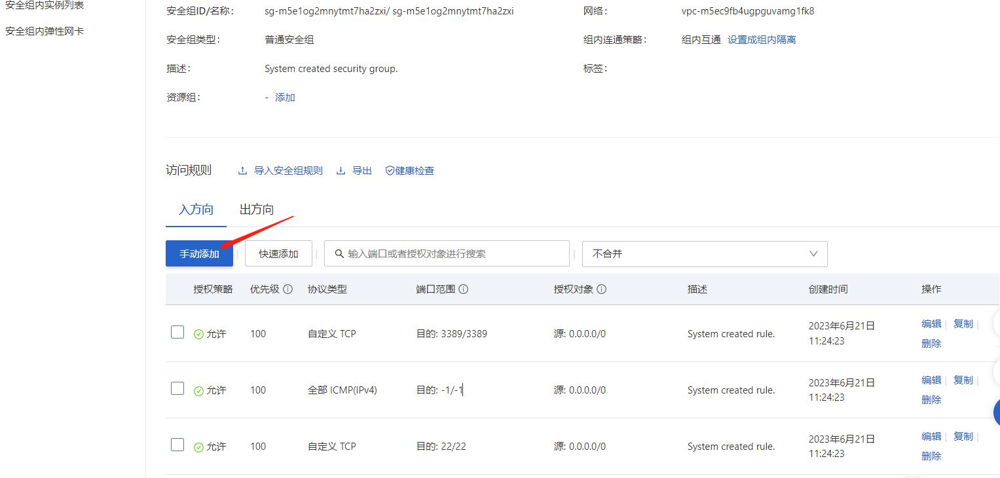

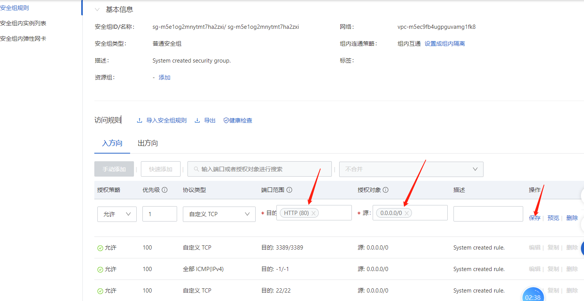

## 8、拷贝博客系统资源到网站发布目录

```shell
[root@host-1 ~]# cp -rf wordpress/* /var/www/html/
```

## 9、再次访问安装

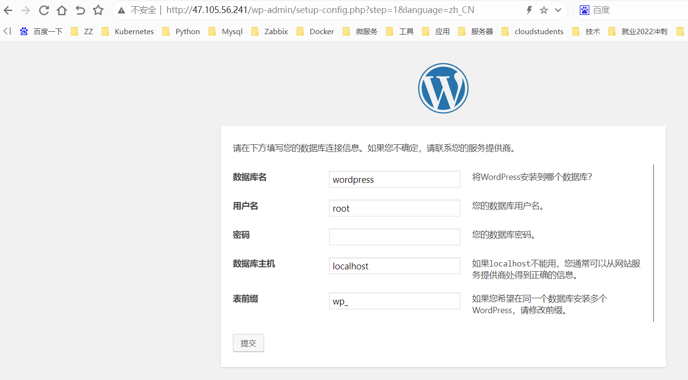

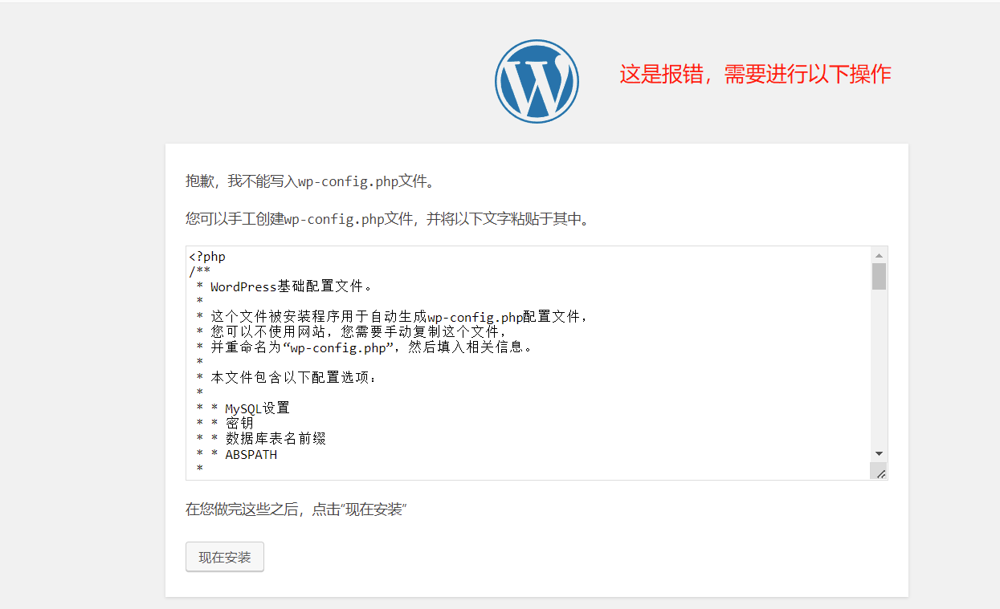

```shell
[root@host-1 ~]# vim /var/www/html/wp-config.php
按英文的冒号:
```

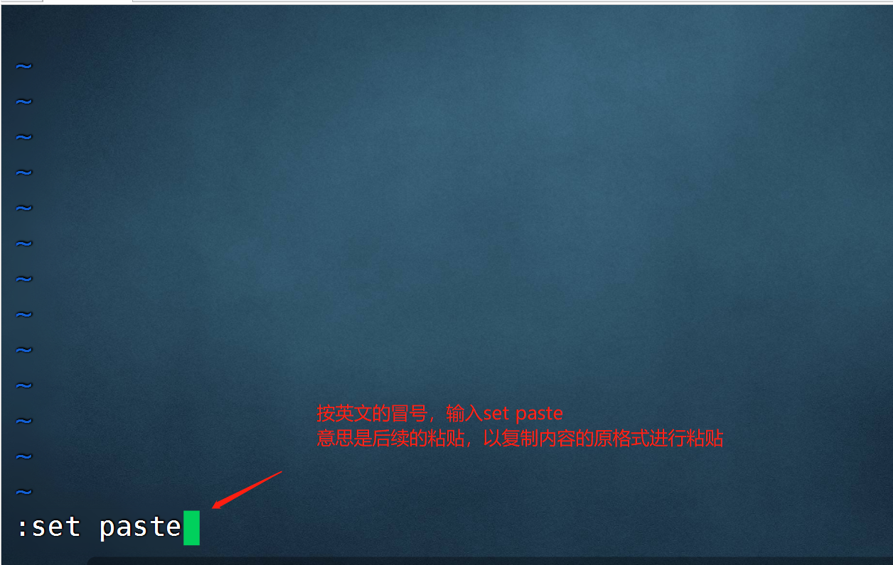

敲回车

再按小写的i

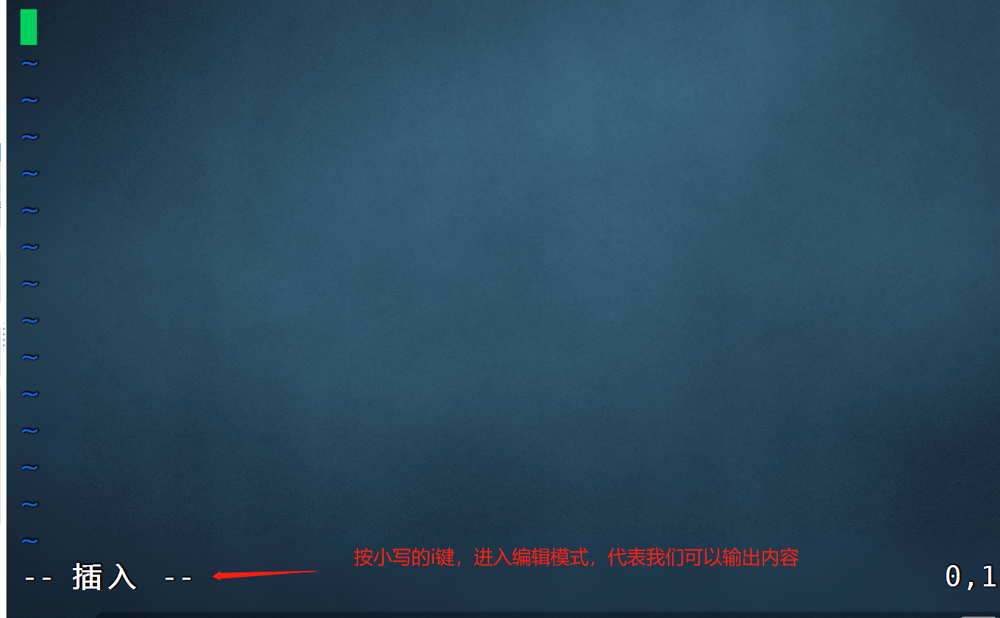

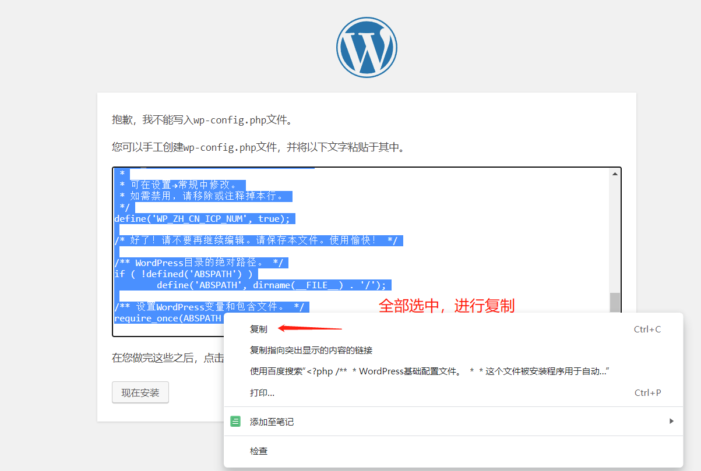

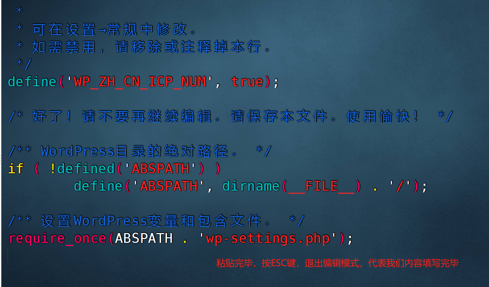

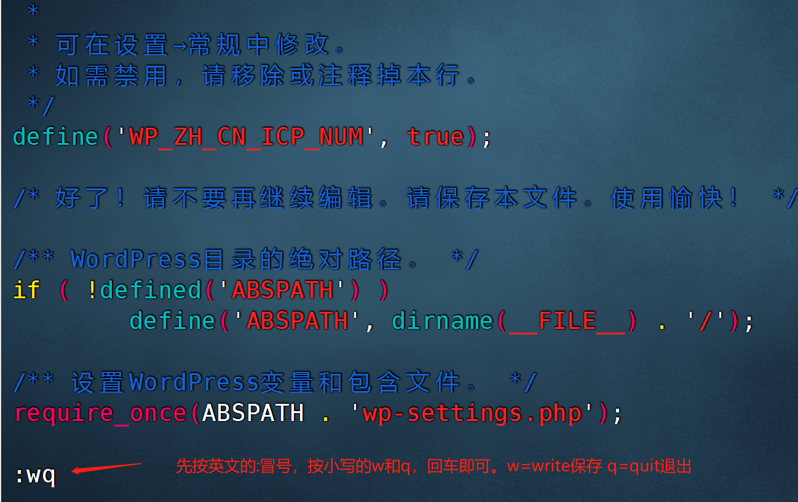

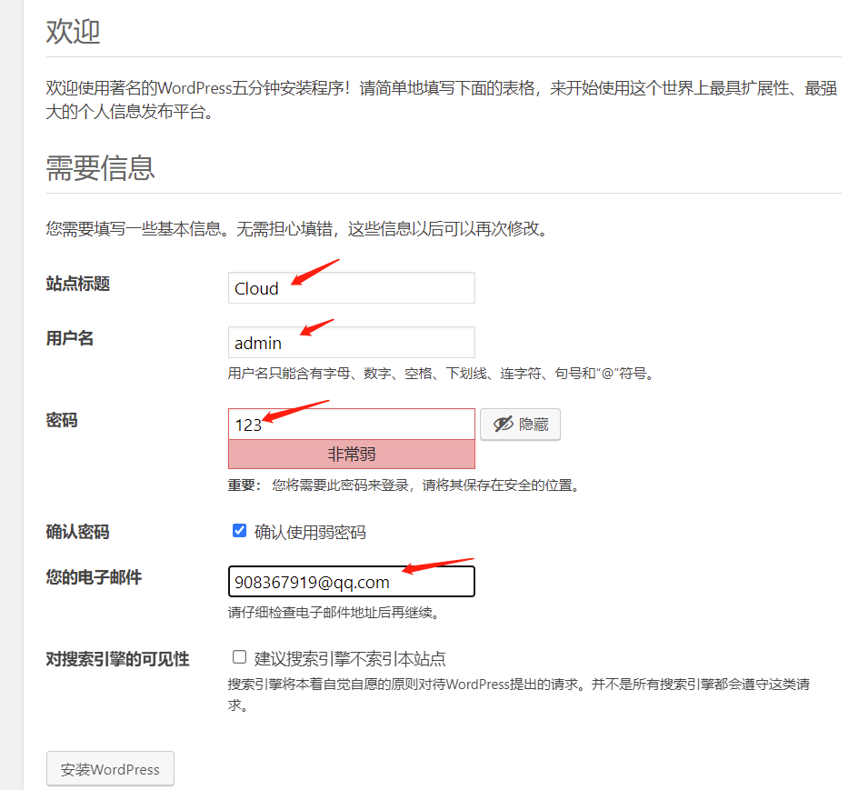

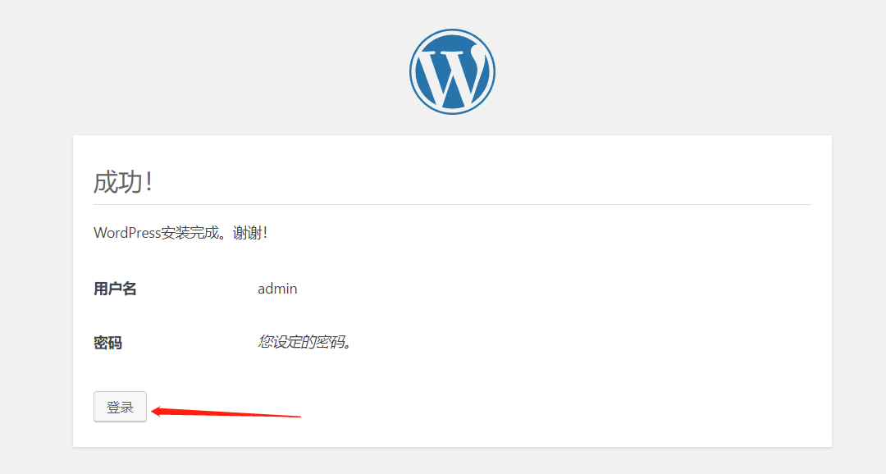

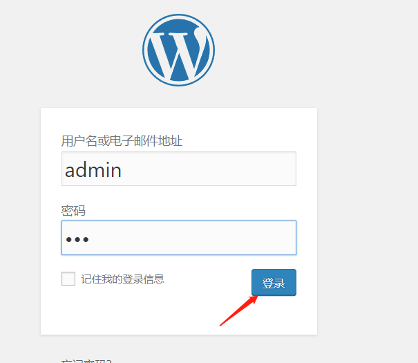

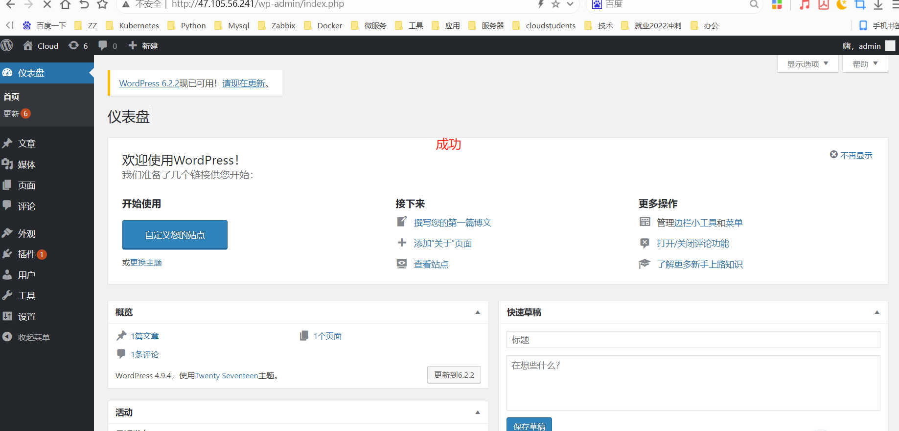