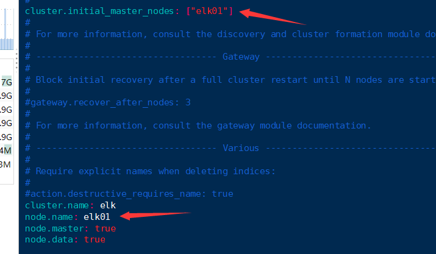
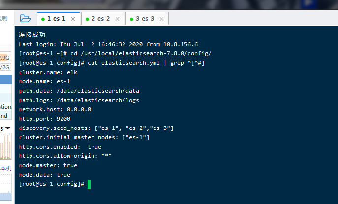
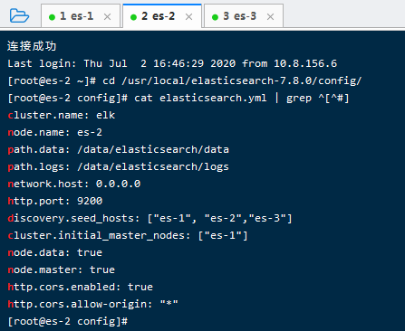
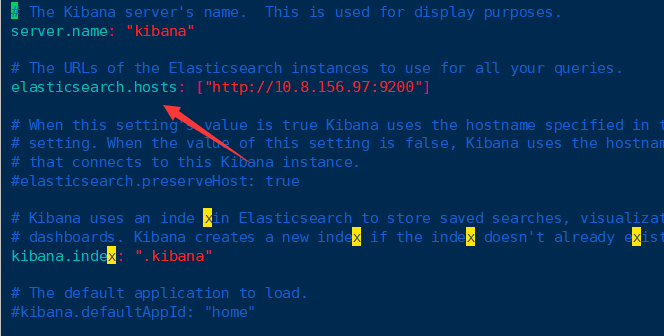
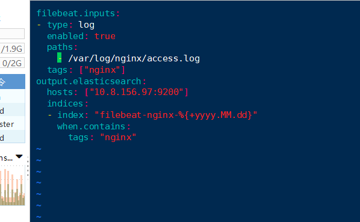

### EFK7.8版本部署踩坑集锦

##### 修改ES配置文件

假如ES为单节点：



```shell
cluster.initial_master_nodes: ["elk01"]     #集群主节点的名称
cluster.name: elk
node.name: elk01
node.master: true
node.data: true
path.data: /data/elasticsearch/data
path.logs: /data/elasticsearch/logs
bootstrap.memory_lock: false
bootstrap.system_call_filter: false
network.host: 0.0.0.0
http.port: 9200
#discovery.zen.ping.unicast.hosts: ["192.168.246.234", "192.168.246.231","192.168.246.235"]
#discovery.zen.minimum_master_nodes: 2
#discovery.zen.ping_timeout: 150s
#discovery.zen.fd.ping_retries: 10
#client.transport.ping_timeout: 60s
http.cors.enabled: true
http.cors.allow-origin: "*"
```

加入ES是集群（3节点都需要修改）

修改主节点配置文件：

```
cluster.initial_master_nodes: ["es-1"]     #集群主节点的名称
cluster.name: elk
node.name: es-1
node.master: true
node.data: true
path.data: /data/elasticsearch/data
path.logs: /data/elasticsearch/logs
bootstrap.memory_lock: false
bootstrap.system_call_filter: false
network.host: 0.0.0.0
http.port: 9200
discovery.seed.hosts: ["es-1", "es-2","es-3"]
#discovery.zen.ping.unicast.hosts: ["192.168.246.234", "192.168.246.231","192.168.246.235"]
##discovery.zen.minimum_master_nodes: 2
##discovery.zen.ping_timeout: 150s
##discovery.zen.fd.ping_retries: 10
##client.transport.ping_timeout: 60s
http.cors.enabled: true
http.cors.allow-origin: "*"
```



```
cluster.initial_master_nodes: ["es-1"]     #集群主节点的名称
cluster.name: elk
node.name: es-2
node.master: true
node.data: true
path.data: /data/elasticsearch/data
path.logs: /data/elasticsearch/logs
bootstrap.memory_lock: false
bootstrap.system_call_filter: false
network.host: 0.0.0.0
http.port: 9200
discovery.seed.hosts: ["es-1","es-2","es-3"]
#discovery.zen.ping.unicast.hosts: ["192.168.246.234", "192.168.246.231","192.168.246.235"]
###discovery.zen.minimum_master_nodes: 2
###discovery.zen.ping_timeout: 150s
###discovery.zen.fd.ping_retries: 10
###client.transport.ping_timeout: 60s
http.cors.enabled: true
http.cors.allow-origin: "*"
```



```
cluster.initial_master_nodes: ["es-1"]     #集群主节点的名称
cluster.name: elk
node.name: es-3
node.master: true
node.data: true
path.data: /data/elasticsearch/data
path.logs: /data/elasticsearch/logs
bootstrap.memory_lock: false
bootstrap.system_call_filter: false
network.host: 0.0.0.0
http.port: 9200
discovery.seed.hosts: ["es-1","es-2","es-3"]
#discovery.zen.ping.unicast.hosts: ["192.168.246.234", "192.168.246.231","192.168.246.235"]
###discovery.zen.minimum_master_nodes: 2
###discovery.zen.ping_timeout: 150s
###discovery.zen.fd.ping_retries: 10
###client.transport.ping_timeout: 60s
http.cors.enabled: true
http.cors.allow-origin: "*"
```


##### 启动Kibana 

要用普通用户启动   必须授权

```shell
[root@es-3-head-kib ~]# useradd  kibana
[root@es-3-head-kib ~]# chown -R kibana:kibana  /usr/local/kibana-7.8.0-linux-x86_64
```

root 用户启动，必须用强制命令    

```shell
[root@es-3-head-kib ~]# nohup ./bin/kibana --allow-root &
```

##### 修改Kibana的配置文件

找不到  elasticsearch.url   就改这个 elasticsearch.hosts: ["http://10.8.156.97:9200"]

```shell
[root@es-3-head-kib ~]#  vim config/kibana.yml
server.port: 5601
server.host: "192.168.246.235"     #kibana本机的地址
#elasticsearch.url: "http://192.168.246.234:9200"	#ES主节点地址+端口(6.5版本写法)
server.name: "kibana"
elasticsearch.hosts: ["http://192.168.246.234:9200"] #ES主节点地址+端口(7.8版本写法)
kibana.index: ".kibana"
```



##### Filebeat配置文件

```shell
filebeat.inputs:
- type: log
  enabled: true
  paths:
    - /var/log/nginx/access.log
  tags: ["nginx"]
output.elasticsearch:
  hosts: ["10.8.156.97:9200"]   #ES集群主节点ip
  indices:
  - index: "filebeat-nginx-%{+yyyy.MM.dd}"
    when.contains:
      tags: "nginx"
```



```

```

