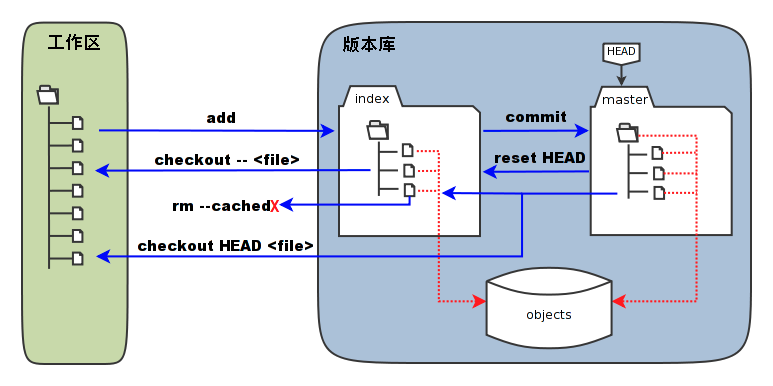

# Git部署



```shell
环境：
    git-server    192.168.246.214  充当中央服务器
    client        192.168.246.213

所有机器关闭防火墙和selinux

安装：所有机器都安装
   [root@git-server ~]# yum install -y git
   [root@git-server ~]# git --version 
   git version 1.8.3.1
   
准备：
    因为Git是分布式版本控制系统，所以，每个机器都必须自报家门：你的名字和Email地址。
    注意git config命令的--global参数，用了这个参数，表示你这台机器上所有的Git仓库都会使用这个配置。

所有的机器都添加，只要邮箱和用户不一样就可以。   
    # git config --global user.email "tian1364548672@gmail.com"     ----设置邮箱
    # git config --global user.name "jack"                   ----加添用户
    # cat /root/.gitconfig
    # git config --global color.ui true		#语法高亮
    # git config --list			#查看全局配置
    user.email=tian1364548672@gmail.com
	user.name=jack
	color.ui=true
```

# git使用

```shell
1、创建一个新目录：在中心服务器上创建
[root@git-server ~]# mkdir /git-test
[root@git-server ~]# useradd git   #创建一个git用户用来运行git
[root@git-server ~]# passwd git  #给用户设置密码
[root@git-server ~]# cd /git-test/
```

```shell
2、通过git init命令把这个目录变成Git可以管理的仓库：
 第1种情况：可以改代码，还能上传到别人的机器，别人也能从你这里下载但是别人不能上传代码到你的机器上。
 第2种情况：只是为了上传代码用，别人从这台机器上下载代码也可以上传代码到这台机器上，经常用于核心代码库。
```

```shell
3、创建裸库：适用于作为远程中心仓库使用
创建裸库才可以从别处push（传）代码过来，使用--bare参数------裸
[root@git-server git-test]# git init --bare testgit
Initialized empty Git repository in /git-test/testgit/
[root@git-server ~]# chown git.git /git-test -R  #修改权限
```

```shell
4、仓库创建完成后查看库目录：
[root@git-server git-test]# cd testgit/
[root@git-server testgit]# ls
branches  config  description  HEAD  hooks  info  objects  refs
```

# 客户端

```shell
1.配置免密登录
[root@client ~]# ssh-keygen    #生成秘钥
[root@client ~]# ssh-copy-id -i git@192.168.246.214   #将秘钥传输到git服务器中的git用户
```

```shell
2.克隆git仓库
[root@client ~]# yum install -y git
[root@client ~]# git clone git@192.168.246.214:/git-test/testgit/
Cloning into 'testgit'...
warning: You appear to have cloned an empty repository.
[root@client ~]# ls  #查看仓库已经克隆下来了
anaconda-ks.cfg    testgit
```

```shell
3、创建文件模拟代码提交到仓库
在testgit目录下创建一个测试文件test.txt
[root@client ~]# cd testgit/
[root@client testgit]# vim test.txt   #随便写点东西


把文件添加到暂存区：使用 "git add" 建立跟踪
[root@client testgit]# git add test.txt
注: 这里可以使用 git add * 或者 git add -A


提交文件到仓库分支：1
[root@client testgit]# git commit -m "test1"
[master (root-commit) 2b51ff9] test1
 1 file changed, 2 insertions(+)
 create mode 100644 test.txt
 -m:描述
 
 
查看git状态：
[root@client testgit]# git status 
# On branch master   #分支位于master


修改文件后再此查看状态：
[root@client testgit]# echo '1122334' >> test.txt
[root@client testgit]# git status
# 位于分支 master
# 尚未暂存以备提交的变更：
#   （使用 "git add <file>..." 更新要提交的内容）
#   （使用 "git checkout -- <file>..." 丢弃工作区的改动）
#
#	修改：      readme.txt
#
修改尚未加入提交（使用 "git add" 和/或 "git commit "


先add
[root@client testgit]# git add -A


再次提交commit：
[root@client testgit]# git commit  -m "add2" test.txt 
[master 73bf688] add2
 1 file changed, 1 insertion(+)
 [root@client testgit]# git status 
# On branch master
nothing to commit, working directory clean
```

# 版本回退

```shell
已经提交了不合适的修改到版本库时，想要撤销本次提交，使用版本回退，不过前提是没有推送到远程库。

查看现在的版本：
[root@client testgit]# git log
显示的哪个版本在第一个就是当前使用的版本。

版本回退(切换)
在Git中，当前版本是HEAD,上一个版本就HEAD^，上上一个版本就是HEAD^^，当然往上100个版本写100个比较容易数不过来，所以写成HEAD~100（一般使用id号来恢复）

回到上一个版本
[root@client testgit]# git reset --hard HEAD^ 
HEAD is now at 0126755 test1

回到指定的版本(根据版本号): 
[root@client testgit]# git reset --hard dd66ff
HEAD is now at dd66ff9 add2
==========================================================
注：消失的ID号：
回到早期的版本后再查看git log会发现最近的版本消失，可以使用reflog查看消失的版本ID，用于回退到消失的版本
[root@vm20 gittest]# git reflog
2a85982 HEAD@{0}: reset: moving to 2a859821a2385e136fe83f3a206b287eb0eb8c18
f5bc8c1 HEAD@{1}: commit: test-version2
2a85982 HEAD@{2}: commit (initial): test-version1

[root@git-client testgit]# git reset --hard f5bc8c1
```

# 删除文件

```shell
从工作区删除test.txt，并且从版本库一起删除
```

```shell
工作区删除：
[root@client testgit]# touch test.txt
[root@client testgit]# git status
# On branch master
# Untracked files:
#   (use "git add <file>..." to include in what will be committed)
#
#       as.txt
nothing added to commit but untracked files present (use "git add" to track)
[root@client testgit]# rm -rf test.txt  未添加到暂存区，可直接删除
[root@client testgit]# git status
# On branch master
nothing to commit, working directory clean

```

```shell
已从工作区提交到暂存区：
第一种方法
[root@client testgit]# touch test.txt
[root@client testgit]# git status
# On branch master
#
# Initial commit
#
# Untracked files:
#   (use "git add <file>..." to include in what will be committed)
#
#       test.txt
nothing added to commit but untracked files present (use "git add" to track)

[root@client testgit]# git add test.txt
[root@client testgit]# git status
# On branch master
#
# Initial commit
#
# Changes to be committed:
#   (use "git rm --cached <file>..." to unstage)
#
#       new file:   test.txt
#

[root@client testgit]#  git rm --cache test.txt #从暂存区移除
rm 'test.txt'
[root@client testgit]# ls
test.txt
[root@client testgit]# git status
# On branch master
#
# Initial commit
#
# Untracked files:
#   (use "git add <file>..." to include in what will be committed)
#
#       test.txt
nothing added to commit but untracked files present (use "git add" to track)
[root@client testgit]# rm -rf test.txt 
[root@client testgit]# git status
# On branch master
#
# Initial commit
#
nothing to commit (create/copy files and use "git add" to track)

第二种方法：
[root@client testgit]# touch  b.txt
[root@client testgit]# git add b.txt 
[root@client testgit]# git status
# On branch master
#
# Initial commit
#
# Changes to be committed:
#   (use "git rm --cached <file>..." to unstage)
#
#       new file:   b.txt
#
[root@client testgit]# git rm -f b.txt  ##这种删除连同工作区一块儿删除
rm 'b.txt'
[root@client testgit]# ls
[root@client testgit]# git status    
# On branch master
#
# Initial commit
#
nothing to commit (create/copy files and use "git add" to track)
```

```shell
直接在暂存区rm掉文件，如何解决
[root@client testgit]# touch c.txt
[root@client testgit]# git add c.txt 
[root@client testgit]# ls
c.txt
[root@client testgit]# git status
# On branch master
#
# Initial commit
#
# Changes to be committed:
#   (use "git rm --cached <file>..." to unstage)
#
#       new file:   c.txt
#
[root@client testgit]# rm -rf c.txt 
[root@client testgit]# git status
# On branch master
#
# Initial commit
#
# Changes to be committed:
#   (use "git rm --cached <file>..." to unstage)
#
#       new file:   c.txt
#
# Changes not staged for commit:
#   (use "git add/rm <file>..." to update what will be committed)
#   (use "git checkout -- <file>..." to discard changes in working directory)
#
#       deleted:    c.txt
#
[root@client testgit]# git rm --cache c.txt
rm 'c.txt'
[root@client testgit]# ls
[root@client testgit]# git status
# On branch master
#
# Initial commit
#
nothing to commit (create/copy files and use "git add" to track)
[root@client testgit]# 
```

# 修改文件

```shell
暂存区修改名称
[root@client testgit]# touch  a.txt
[root@client testgit]# git status
# On branch master
# Untracked files:
#   (use "git add <file>..." to include in what will be committed)
#
#       a.txt
nothing added to commit but untracked files present (use "git add" to track)
[root@client testgit]# git add a.txt 
[root@client testgit]# git status
# On branch master
# Changes to be committed:
#   (use "git reset HEAD <file>..." to unstage)
#
#       new file:   a.txt
#
[root@client testgit]# git mv a.txt  d.txt
[root@client testgit]# git status
# On branch master
# Changes to be committed:
#   (use "git reset HEAD <file>..." to unstage)
#
#       new file:   d.txt
#
[root@client testgit]# ls
d.txt  test.txt
[root@client testgit]# git rm --cache d.txt
[root@client testgit]# rm -rf d.txt
```

# 将代码上传到仓库的master分支

```shell
[root@client testgit]# vi a.txt   #创建一个新文件
hello world
[root@client testgit]# git add a.txt 
[root@client testgit]# git commit -m "add"
[root@client testgit]# git push origin master   #上传到中心仓库master分支
Counting objects: 11, done.
Compressing objects: 100% (4/4), done.
Writing objects: 100% (11/11), 828 bytes | 0 bytes/s, done.
Total 11 (delta 0), reused 0 (delta 0)
To git@192.168.246.214:/git-test/testgit/
 * [new branch]      master -> master
```

```shell
在客户端将仓库删除掉然后在克隆下来查看仓库中是否有文件
[root@client testgit]# cd
[root@client ~]# rm -rf testgit/
[root@client ~]# git clone git@192.168.246.214:/git-test/testgit/
Cloning into 'testgit'...
remote: Counting objects: 11, done.
remote: Compressing objects: 100% (4/4), done.
remote: Total 11 (delta 0), reused 0 (delta 0)
Receiving objects: 100% (11/11), done.
[root@client ~]# cd testgit/
[root@client testgit]# ls
a.txt
[root@client testgit]# cat a.txt 
hello world
```

# 创建分支并合并分支

```shell
每次提交，Git都把它们串成一条时间线，这条时间线就是一个分支。截止到目前，只有一条时间线，在Git里，这个分支叫主分支，即`master`分支。`HEAD`严格来说不是指向提交，而是指向`master`，`master`才是指向提交的，所以，`HEAD`指向的就是当前分支。
```

```shell
客户端操作
[root@client ~]# git clone git@192.168.246.214:/git-test/testgit/
[root@client testgit]# git status 
# On branch master   #当前所在为master分支
#
# Initial commit
#
nothing to commit (create/copy files and use "git add" to track)
注意：刚创建的git仓库默认的master分支要在第一次commit之后才会真正建立。然后先git add .添加所有项目文件到本地仓库缓存，再git commit -m "init commit"提交到本地仓库，之后就可以随心所欲地创建或切换分支了。
创建分支:
[root@client testgit]# git branch dev   #创建分支。
[root@client testgit]# git branch    #查看分支。*在哪里就表示当前是哪个分支
  dev
* master
切换分支:
[root@client testgit]# git checkout dev
Switched to branch 'dev'
[root@client testgit]# git branch 
* dev
  master
在dev分支创建一个文件；
[root@client testgit]# vi test.txt
[root@client testgit]# git add test.txt 
[root@client testgit]# git commit -m "add dev"
[dev f855bdf] add dev
 1 file changed, 1 insertion(+)
 create mode 100644 test.txt
现在，dev分支的工作完成，我们就可以切换回master分支：
 [root@client testgit]# git checkout master
Switched to branch 'master'
```

```shell
切换回`master`分支后，再查看一个`test.txt`文件，刚才添加的内容不见了！因为那个提交是在`dev`分支上，而`master`分支此刻的提交点并没有变：
```

```shell
[root@client testgit]# ls
a.txt
```

```shell
现在，我们把`dev`分支的工作成果合并到`master`分支上：
```

```shell
[root@client testgit]# git merge dev
Updating 40833e0..f855bdf
Fast-forward
 test.txt | 1 +
 1 file changed, 1 insertion(+)
 create mode 100644 test.txt
[root@client testgit]# ls
a.txt  test.txt
现在已经将dev分支的内容合并到master上。确认没有问题上传到远程仓库:
[root@client testgit]# git push origin master
```

```shell
`git merge`命令用于合并指定分支到当前分支。合并后，再查看`test.txt`的内容，就可以看到，和`dev`分支的最新提交是完全一样的。
```

```shell
合并完成后，就可以放心地删除`dev`分支了：
```

```shell
[root@client testgit]# git branch -d dev
Deleted branch dev (was f855bdf).
```

```shell
删除后，查看`branch`，就只剩下`master`分支了：
[root@client testgit]# git branch 
* master
```

# 部署gitlab服务

准备环境:  关闭防火墙和selinux

```shell
192.168.246.214  #gitlab服务器
```

1.配置yum源

```shell
[root@git-server ~]# cd /etc/yum.repos.d/
[root@git-server yum.repos.d]# vi gitlab-ce.repo
[gitlab-ce]
name=Gitlab CE Repository
baseurl=https://mirrors.tuna.tsinghua.edu.cn/gitlab-ce/yum/el$releasever
gpgcheck=0
enabled=1
安装相关依赖
https://mirrors.tuna.tsinghua.edu.cn/gitlab-ce/yum/el7/
[root@git-server yum.repos.d]# yum install -y postfix curl policycoreutils-python openssh-server
[root@git-server yum.repos.d]# systemctl enable sshd
[root@git-server yum.repos.d]# systemctl start sshd
安装postfix
[root@git-server yum.repos.d]# yum install postfix  -y   #安装邮箱
[root@git-server yum.repos.d]# systemctl enable postfix
[root@git-server yum.repos.d]# systemctl start postfix
[root@git-server yum.repos.d]# yum install -y gitlab-ce  #将会安装gitlab最新版本
```

配置gitlab登录链接

```shell
[root@git-server ~]# vim /etc/gitlab/gitlab.rb
1.# 添加对外的域名（gitlab.papamk.com请添加A记录指向本服务器的公网IP）：将原来的修改为
external_url 'http://192.168.246.214'
2.设置地区
gitlab_rails['time_zone'] = 'Asia/Shanghai'
```


将数据路径的注释去掉，可以更改


开启ssh服务:


初始化Gitlab:

```shell
[root@git-server ~]# gitlab-ctl reconfigure   #重新加载，需要等很长时间
```

...


...

启动Gitlab服务:

```shell
[root@git-server ~]# gitlab-ctl start  #启动
```


Gitlab 设置 HTTPS 方式

```
如果想要以上的 https 方式正常生效使用，则需要把 letsencrypt 自动生成证书的配置打开，这样在执行重
新让配置生效命令 (gitlab-ctl reconfigure) 的时候会自动给域名生成免费的证书并自动在 gitlab 自带的
 nginx 中加上相关的跳转配置，都是全自动的，非常方便。
letsencrypt['enable'] = true 
letsencrypt['contact_emails'] = ['caryyu@qq.com']     # 这应该是一组要添加为联系人的电子邮件地址
```

测试访问:[http://192.168.246.214](http://192.168.246.214/)


用户为:root

密码:本人设置的密码是12345678


需要创建秘钥


```shell
[root@client ~]# ssh-keygen
[root@client ~]# cd .ssh/
[root@client .ssh]# ls 
[root@client .ssh]# cat id_rsa.pub 
ssh-rsa AAAAB3NzaC1yc2EAAAADAQABAAABAQC0HeO8gaua13h9HCJK5RXVc/cjet9DpLYq2dqmQ0LXfP0Vwj6YjKxu7lE1i/4Y2cmu5lDe8bG22aikyaW38Fnz0bkGfEurdVZii/KCiHBz2lXS1ocuAdloJT4wnc2MUjh/gwc4FuNkWdYvpbMLXSSHIVjv8vB9YbHlPMTMy5N89kMwMmta5C87/8fBO5VtGijgGOueywM+xAzovlfoJbprV/ZBKkhiskSKz4fHyoGFGwllX3kMkNR/soGF5XXA+/99iO3UqSaloF0UzfUCgasMfMVB5zDHGIB6uTrMe6ccfKp9gnVyD7m4Zmk7MwouBwAfMLIiHmvekBGXqb1YCTgJ root@client
```


创建一个文件:

1.newfile:先新建一个文件。
2.uploadfile:再上传即可。


上传一个文件：


## 新建普通用户


新添加的用户创建成功！

## 在git客户端

```shell
[root@client ~]# git clone git@192.168.246.214:root/testapp.git
Cloning into 'testapp'...
remote: Enumerating objects: 6, done.
remote: Counting objects: 100% (6/6), done.
remote: Compressing objects: 100% (4/4), done.
remote: Total 6 (delta 0), reused 0 (delta 0)
Receiving objects: 100% (6/6), done.
[root@client ~]# ls
testapp
[root@client ~]# cd testapp/
[root@client testapp]# ls
test.txt  同步时间.txt
[root@client testapp]#
使用http的
[root@client ~]# rm -rf testgit/
[root@client ~]# git clone http://192.168.246.214/root/testapp.git
Cloning into 'testapp'...
Username for 'http://192.168.246.214': root
Password for 'http://root@192.168.246.214':12345678  #为自己设置的密码
remote: Enumerating objects: 6, done.
remote: Counting objects: 100% (6/6), done.
remote: Compressing objects: 100% (4/4), done.
remote: Total 6 (delta 0), reused 0 (delta 0)
Unpacking objects: 100% (6/6), done.
[root@client ~]# ls
testapp
```

```shell
提交到远程gitlab仓库
[root@client testapp]# vim update.txt
1000phone
[root@client testapp]# git add .
[root@client testapp]# git commit -m "update_version1"
[master 091798d] update_version1
 1 file changed, 2 insertions(+)
 create mode 100644 update.txt
[root@client testapp]# git push origin master
Username for 'http://192.168.62.166': ^C
[root@nginx-server testapp2]# git push origin master
Username for 'http://192.168.62.166': root
Password for 'http://root@192.168.62.166': 
Counting objects: 4, done.
Compressing objects: 100% (2/2), done.
Writing objects: 100% (3/3), 307 bytes | 0 bytes/s, done.
Total 3 (delta 0), reused 0 (delta 0)
To http://192.168.62.166/root/testapp2.git
   201f479..091798d  master -> master
```


## 调整上传文件的大小

## 


默认是10M，可根据情况调整


```shell
拓展：
1.cat /proc/swaps 查看swap分区是否启动（无）
2.创建 ：
dd if=/dev/zero of=/data/swap bs=512 count=8388616
创建swap大小为bs*count=4294971392(4G)；
/data/swap目录若无则找/mnt/swap
3.通过mkswap命令将上述空间制作成swap分区：
mkswap /data/swap
4.查看内核参数vm.swappiness中的数值是否为0，如果为0则根据实际需要调		 整成60：
查看： cat /proc/sys/vm/swappiness
设置： sysctl -w vm.swappiness=60
若想永久修改，则编辑/etc/sysctl.conf文件，改文件中有vm.swappiness变量配置，默认为0
5.启用分区：
swapon /data/swap
echo “/data/swap swap swap defaults 0 0” >> /etc/fstab
6.再次使用cat /proc/swaps 查看swap分区是否启动
```

# Gitlab 备份与恢复

## 1、查看系统版本和软件版本

```shell
[root@git-server ~]# cat /etc/redhat-release 
CentOS Linux release 7.4.1708 (Core)

[root@git-server ~]# cat /opt/gitlab/embedded/service/gitlab-rails/VERSION
8.15.4
```

## 2、数据备份

打开/etc/gitlab/gitlab.rb配置文件，查看一个和备份相关的配置项：

```shell
[root@git-server backups]# vim /etc/gitlab/gitlab.rb
gitlab_rails['backup_path'] = "/var/opt/gitlab/backups"	#备份的路径
gitlab_rails['backup_archive_permissions'] = 0644		#备份文件的默认权限
gitlab_rails['backup_keep_time'] = 604800				#保留时长，秒为单位
```

设置备份保留时常，防止每天执行备份，肯定有目录被爆满的风险，打开/etc/gitlab/gitlab.rb配置文件，找到如下配置

该项定义了默认备份出文件的路径，可以通过修改该配置，并执行 **gitlab-ctl reconfigure 或者 gitlab-ctl  restart** 重启服务生效。

```shell
[root@git-server backups]# gitlab-ctl reconfigure
或者
[root@git-server backups]# gitlab-ctl  restart
```

执行备份命令进行备份

```shell
[root@git-server backups]# /opt/gitlab/bin/gitlab-rake gitlab:backup:create
```


也可以添加到 crontab 中定时执行：

```shell
0 2 * * * /opt/gitlab/bin/gitlab-rake gitlab:backup:create
```

可以到/var/opt/gitlab/backups找到备份包，解压查看，会发现备份的还是比较全面的，数据库、repositories、build、upload等分类还是比较清晰的。

备份完成，会在备份目录中生成一个当天日期的tar包。

```shell
[root@git-server ~]# ll /var/opt/gitlab/backups/
```


## 3、数据恢复

特别注意：

- 备份目录和gitlab.rb中定义的备份目录必须一致
- GitLab的版本和备份文件中的版本必须一致，否则还原时会报错。

**在恢复之前，可以删除一个文件，以便查看效果**


执行恢复操作：

```shell
[root@git-server ~]# cd /var/opt/gitlab/backups
[root@git-server  backups]# gitlab-rake gitlab:backup:restore BACKUP=1588700546_2020_05_06_12.6.3
注意恢复文件的名称
```


恢复完成后，启动刚刚的两个服务，或者重启所有服务，再打开浏览器进行访问，发现数据和之前的一致：

**注意：通过备份文件恢复gitlab必须保证两台主机的gitlab版本一致，否则会提示版本不匹配**

查看gitlab端，可以看到数据恢复成功


# Github 远程仓库

1、github.com 注册账户

2、在github上创建仓库

本人账户：

用户名：yangge

邮箱：  [850439713@qq.com](mailto:850439713@qq.com)

密码：


3、客户端生成本地ssh key

```shell
[root@localhost ~]# ssh-keygen -t rsa -C 'meteor@163.com' # 邮箱要与github上注册的相同
Generating public/private rsa key pair.
Enter file in which to save the key (/root/.ssh/id_rsa): 
Enter passphrase (empty for no passphrase): 
Enter same passphrase again: 
Your identification has been saved in /root/.ssh/id_rsa.
Your public key has been saved in /root/.ssh/id_rsa.pub.
The key fingerprint is:
SHA256:RiE6UR1BtzV5avyE2uz6TNPsVHa2D2eHprghrJEkd/g meteor@163.com
The key's randomart image is:
+---[RSA 2048]----+
|    ..oo=o. o.   |
|     o ..o o...  |
|    o   . .. +   |
|     . o    = .  |
|    . + S  = o  =|
|     + *  . oo.=o|
|      o E ..o B.+|
|       o . =.* +o|
|      .   +++ . .|
+----[SHA256]-----+
[root@localhost ~]#
[root@localhost ~]# cat .ssh/id_rsa.pub 
ssh-rsa AAAAB3NzaC1yc2EAAAADAQABAAABAQDVThfq4brrlsPGtAknVB0TLPx+7Dd3qlxTbSIrUOsGC5Y8JuNqVTlIntZB4oNj8cSQrWvec9CKm0a8o7WwaJIiqpxurz+YpQHP2KbapftKIxsX4hPf/z+p0El1U6arQa35/xmNsq+cJLH/bDdRG+EMDhuCBmjVZOlLj/hEdeIT6s56AnnCkaWoF+sq58KCF7Tk54jRbs/YiyE4SN7FuA70r+07sA/uj0+lmuk4E190KtQUELhjX/E9stivlqiRhxnKvVUqXDywsjfM8Rtvbi4Fg9R8Wt9fpd4QwnWksYUoR5qZJFYXO4hSZrUnSMruPK14xXjDJcFDcP2eHIzKgLD1 meteor@163.com
```

4、复制以上的公钥，在github 中添加ssh key


创建好库之后，在库里创建几个文件，方便测试

5、测试：拉取github仓库

```shell
[root@localhost ~]# yum install git
[root@localhost ~]# git config --global user.name 'meteor_by'
[root@localhost ~]# git config --global user.email 'meteor@163.com'
[root@localhost tmp]# cd /tmp

[root@localhost tmp]# git clone git@github.com:yangge666a/yangge666.git
```


7、在本地添加远程仓库，并推送至github仓库

```shell
[root@localhost tmp]# cd /tmp/yangge666/
[root@localhost yangge]# ls
as.txt  README.md
[root@localhost yangge]# cat as.txt 
this is 2002 test file
[root@client yangge]# ls
as.txt  README.md
[root@localhost yangge]# vim pengge666.txt
[root@localhost yangge]# git add .
[root@localhost yangge]# git commit -m "oldsix"
[master 0f6a3de] laoyang
 1 file changed, 2 insertions(+)
 create mode 100644 a.txt
[root@client yangge]# git push origin main
Counting objects: 4, done.
Compressing objects: 100% (2/2), done.
Writing objects: 100% (3/3), 288 bytes | 0 bytes/s, done.
Total 3 (delta 0), reused 0 (delta 0)
To git@github.com:yangge/yangge.git
   ba8225d..0f6a3de  master -> master
```

去github界面查看


8、连接远程仓库方法

```shell
#[root@localhost testapp]# git remote -v 
#origin	git@github.com:meteor/python1804.git (fetch)
#origin	git@github.com:meteor/python1804.git (push)
#[root@localhost python1804]#
#[root@localhost python1804]#  git remote rm origin  (如果连接远程的方式不是ssh,可以删除重新添加)
#[root@localhost ~]# git remote add origin git@github.com:meteor/python1804.git
#或
#git remote add origin https://github.com/meteor/python1804.git
#git push -u origin master

[root@client yangge]# git remote -v
origin  git@github.com:yangge/yangge.git (fetch)
origin  git@github.com:yangge/yangge.git (push)
[root@client yangge]# git remote rm origin
[root@client yangge]# git remote add origin git@192.168.62.131:root/testapp.git
[root@client yangge]# ls
a.txt  as.txt  README.md
[root@client yangge]# pwd

[root@client ~]# cd /root/testapp/
[root@client testapp]# ls
test.sql  test.txt  update.txt
[root@client testapp]# vim modify.txt
[root@client testapp]# git add .
[root@client testapp]# git commit -m "modify gitlab from github"
[master fde12c2] modify gitlab from github
 1 file changed, 1 insertion(+)
 create mode 100644 modify.txt

[root@client testapp]# git push origin master
Username for 'http://192.168.62.131': root
Password for 'http://root@192.168.62.131': 
Counting objects: 4, done.
Compressing objects: 100% (2/2), done.
Writing objects: 100% (3/3), 337 bytes | 0 bytes/s, done.
Total 3 (delta 0), reused 0 (delta 0)
To http://192.168.62.131/root/testapp.git
   23bae45..fde12c2  master -> master
```

去自己部署的gitlab上查看


