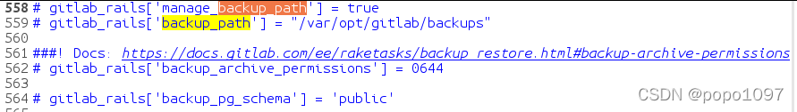
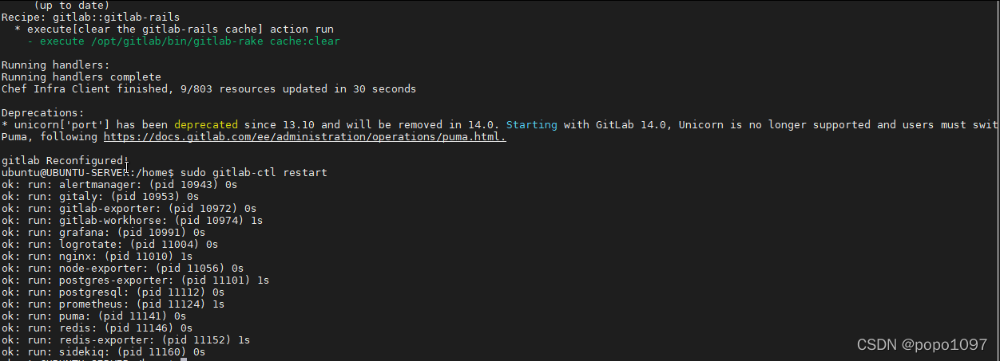
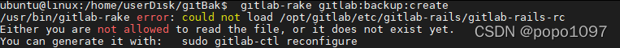
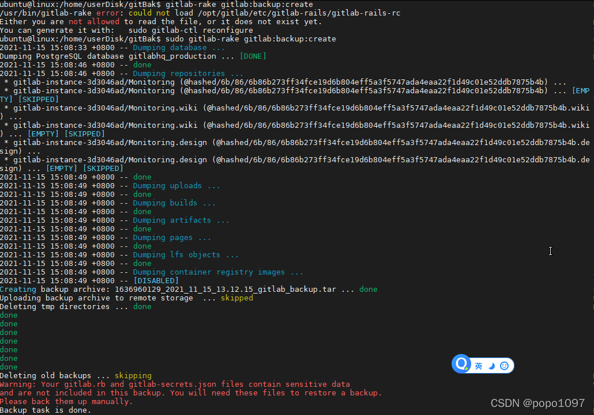
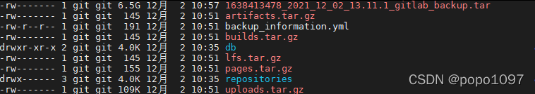
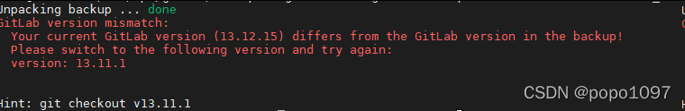
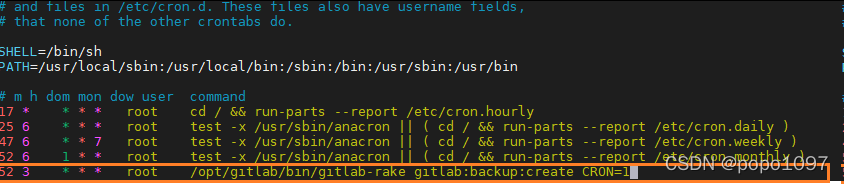
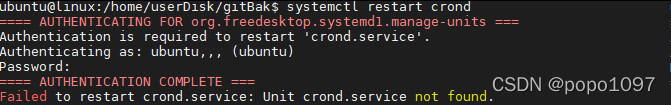

# gitLab数据备份

**自建的Gitlab服务器常常会因为使用时间的增长，其空间容量等硬件需求都需要升级，或者迁移至更高配置的服务器上。备份、迁移、恢复、升级过程如下**

## 一、gitlab备份

备份前gitlab的项目如图所示


#### 1.1 修改仓库存储位置

gitlab通过rpm包安装后，默认存储位置在/var/opt/gitlab/git-data/repositories，通常需要更改此路径到单独的一个分区来存储仓库的数据。

例如我这里把数据存放到/data/gitlab目录下

创建/data/gitlab目录
mkdir -p /data/gitlab

修改gitlab配置文件，找到git_data_dir
vim /etc/gitlab/gitlab.rb

在git_data_dir下面添加一句git_data_dir "/data/gitlab"


停止当前gitlab，重新加载配置
gitlab-ctl stop
gitlab-ctl reconfigure

重新加载后，会发现在/data/gitlab目录下多出一个repositories目录

最后启动gitlab即可
gitlab-ctl start

#### 1.2 修改备份文件目录

```shell
备份的位置可以更换,使用如下命令：(默认可以不修改,那么默认生成在/var/opt/gitlab/backups)
可以通过/etc/gitlab/gitlab.rb配置文件来修改默认存放备份文件的目录
vim /etc/gitlab/gitlab.rb
```



找到gitlab_rails['backup_path'] = "/data/gitBackup" 取消注释并修改为自定义备份路径
sudo gitlab-ctl reconfigure 重读配置
sudo gitlab-ctl restart 重启

```shell
1.修改上图backup_path的值即可，
2.使用sudo gitlab-ctl reconfigure使得配置生效
ps：备份文件的名称中1537261122_2018_09_18_9.2.5是此次备份的编号。该编号我们会在后续恢复gitlab数据使用到。
```



#### 1.4 通过gitlab-rake命令备份gitlab

```shell
备份时需要保持gitlab处于正常运行状态，直接执行gitlab-rake gitlab:backup:create进行备份(需要sudo权限,不然报错)
gitlab提供的备份命令为gitlab-rake，备份命令使用如下:
sudo gitlab-rake gitlab:backup:create

使用以上命令会在/var/opt/gitlab/backups目录下创建一个名称类似为1530156812\_2018\_06\_28\_10.8.4\_gitlab\_backup.tar的压缩包,
这个压缩包就是Gitlab整个的完整部分, 其中开头的1530156812\_2018\_06\_28\_10.8.4是备份创建的日期;
```





该命令会备份gitlab仓库、数据库、用户、用户组、用户密钥、权限等信息。
备份完成后备份文件会出现在/var/opt/gitlab/backups/



/etc/gitlab/gitlab.rb 配置文件须备份
/var/opt/gitlab/nginx/conf nginx配置文件
/etc/postfix/main.cfpostfix 邮件配置备份
红字部分表示 gitlab.rb 和 gitlab-secrets.json 两个文件包含敏感信息。未被备份到备份文件中。需要手动备份。



#### 1.2 设置备份过期时间

```shell
[root@gitlab ~\]# vim /etc/gitlab/gitlab.rb
gitlab\_rails\['backup\_keep\_time'\] = 604800        #以秒为单位
```

#### 1.3 gitlab自动备份

```shell
创建定时任务
\[root@gitlab ~\]# crontab -e
0 2 \* \* \* /opt/gitlab/bin/gitlab-rake gitlab:backup:create
```

#### 1.5 定时备份gitlab

```shell
如果要使gitlab自动进行备份的话，我们可以通过crontab命令来实现自动备份。
强烈建议使用系统crontab命令，而不是用户crontab。
```

```shell
crontab e 进入编辑模式
crontable -l 列出计划任务
/sbin/service crond start //启动服务
/sbin/service crond stop //关闭服务
/sbin/service crond restart //重启服务 //ubutnu18测试不通过!!!!
/sbin/service crond reload //重新载入配置

$ service crond start //启动服务
$ service crond stop //关闭服务
$ service crond restart //重启服务

2.linux发行版本没有service这个命令时：
/etc/init.d/cron stop
/etc/init.d/cron start
/etc/init.d/cron restart //ubutnu18测试通过
```


```shell
#minute： 表示分钟，可以是从0到59之间的任何整数。
#hour： 表示小时，可以是从0到23之间的任何整数。
#day： 表示日期，可以是从1到31之间的任何整数。
#month： 表示月份，可以是从1到12之间的任何整数。
#week： 表示星期几，可以是从0到7之间的任何整数，这里的0或7代表星期日。
#command：要执行的命令，可以是系统命令，也可以是自己编写的脚本文件。
```

**间隔2分钟执行**

```shell
*/2 * * * * /bin/echo "xlglvc" >> /data/tarTest/test1
```

**每月每天凌晨3点30分和中午12点20分执行test.sh脚本**

```shell
30 3,12 * * * /home/test.sh
```

**每月每天每隔6小时的每30分钟执行test.sh脚本**

```shell
30 */6 * * * /home/test.sh
```

**每月每天早上8点到下午18点每隔2小时的每30分钟执行test.sh脚本**

```shell
30 8-18/2 * * * /etc/init.d/network restart
```

**每月每天晚上21点30分执行test.sh脚本**

```shell
30 21 * * * /etc/init.d/network restart
```

**每月1号、10号、22号凌晨4点45分执行test.sh脚本**

```shell
45 4 1,10,22 * * /etc/init.d/network restart
```

**8月份周一、周日凌晨1点10分执行test.sh脚本**

```shell
10 1 * 8 6,0 /etc/init.d/network restart
```

**每月每天每小时整点执行test.sh脚本**

```shell
00 */1 * * * /etc/init.d/network restart
```

```shell
在书写 crontab 定时任务时，需要注意以下几个事项：
1、6 个选项都不能为空，必须填写。如果不确定，则使用"*"代表任意时间。
2、crontab 定时任务的最小有效时间是分钟，最大有效时间是月。像 2018 年某时执行、3 点 30 分 30 秒这样的时间都不能被识别。
3、在定义时间时，日期和星期最好不要在一条定时任务中出现，因为它们都以天为单位，非常容易让管理员混淆。
4、在定时任务中，不管是直接写命令，还是在脚本中写命令，最好都使用绝对路径。有时使用相对路径的命令会报错。
```

#### 方法1.每天自动备份gitlab，并只保留近7天备份

```shell
编辑备份脚本vim /var/opt/gitlab/gitbackup.sh

# !/bin/bash
gitlab-rake gitlab:backup:create CRON=1
将该脚本加入crontab中执行，每天凌晨1点备份
crontab -e：                                        //进入crontab编辑模式
0 1 * /var/opt/gitlab/gitbackup.sh &>/dev/null
vim /etc/gitlab/gitlab.rb
找到gitlab_rails['backup_keep_time'] = 604800取消注释,
gitlab-ctl reconfigure     重读配置
gitlab-ctl restart         重启
```

#### 方法2.以实现每天凌晨4点进行一次自动备份为例，系统的crontab配置如下:

```shell
vim /etc/crontab
0 4 * * * root /opt/gitlab/bin/gitlab-rake gitlab:backup:create CRON=1
```



然后重启crontab服务，如下：
systemctl restart crond



#### 1.6 保留部分备份文件

```shell
随着时间的推移gitlab备份文件越来越多，服务器的磁盘空间也不够大。
此时我们就要删除部分旧的备份文件，gitlab也提供了删除旧的备份文件功能。
该功能在gitlab的配置文件中，进行配置即可。
在此以保留7天之前的备份文件为例，如下：
vim /etc/gitlab/gitlab.rb
gitlab_rails[‘backup_keep_time’] = 604800
其中backup_keep_time是以秒为单位进行计算的，
执行命令gitlab-ctl reconfigure即可。
```

## 二、gitlab仓库恢复

```shell
要验证gitlab备份的有效性，我们可以把该备份文件复制到已经安装好gitlab服务器的/var/opt/gitlab/backups/目录下。
然后进行数据恢复，最后访问并查看其数据完整性即可。
通过gitlab备份文件可以恢复gitlab所有的信息，包括仓库、数据库、用户、用户组、用户密钥、权限等信息。
ps：新服务器上的gitlab的版本号必须与创建备份时的gitlab版本号相同。
gitlab数据恢复比较简单，具体步骤如下：
```

#### 2.1 停止相关数据连接服务

```shell
在gitlab服务器上停止相关数据连接服务，命令如下：
停止gitlab数据服务
gitlab-ctl stop unicorn
gitlab-ctl stop sidekiq
```

#### 2.2 恢复gitlab仓库

```shell
进入/var/opt/gitlab/backups
现在我们要从1537261122_2018_09_18_9.2.5这个备份编号中，恢复数据，命令如下：
gitlab-rake gitlab:backup:restore BACKUP=1537261122_2018_09_18_9.2.5
gitlab-rake gitlab:backup:restore BACKUP=1546916920_2019_01_08_10.5.1恢复数据
如果出现多个done的信息，说明整个gitlab数据就已经正常恢复完毕。
```

#### 2.3 启动gitlab服务

```shell
恢复完毕以后，我们现在来启动gitlab，使用以下命令：
gitlab-ctl start
强烈建议：重启该新服务器。
```