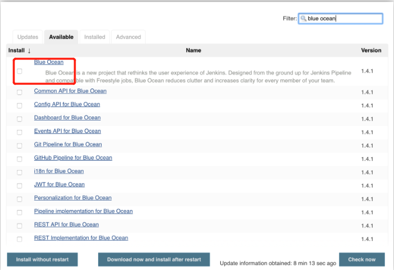

# Blue Ocean

参考链接：https://www.jenkins.io/zh/doc/book/blueocean/getting-started/#installing-blue-ocean

# Blue Ocean 入门 

本节将介绍如何开始使用BlueOcean。介绍如何 安装和配置Blue Ocean ， 进入Blue Ocean UI 和 返回 Jenkins 经典 UI.

## 安装 Blue Ocean

Blue Ocean 可以用以下方式安装：

- 作为 已有Jenkins实例上的一组插件
- Jenkins-Docker镜像的一部分

### 在已有Jenkins实例上安装

在大多数平台安装Jenkins时，默认情况下不安装 [Blue Ocean 插件](https://plugins.jenkins.io/blueocean) 及其所有其他依赖插件（组成Blue Ocean“插件套件”）。

要在现有的Jenkins实例上安装Blue Ocean插件套件，您的Jenkins实例必须运行Jenkins 2.7.x或更高版本。

任何拥有 **Administer** 权限（通过 **基于Matrix** 安全设置）的Jenkins用户都可以在Jenkins实例上安装插件 。 拥有次权限的Jenkins用户还可以配置系统上其他用户的权限。在 [管理安全性](https://www.jenkins.io/zh/doc/book/managing/security) 的 [授权](https://www.jenkins.io/zh/doc/book/managing/security/#authorization) 部分了解更多信息

要将Blue Ocean安装到您的Jenkins实例：

1. 如果需要，请确保您已经登录到jenkins(作为具有 **管理员** 权限的用户).
2. 从Jenkins主页（即Jenkins经典用户界面的仪表板），单机左侧的 **管理Jenkins** ，然后单击中心的 **管理插件** 。
3. 点击 **可用的** 选项卡，然后在 **过滤** 文本框键入 blue ocean ，将过两次插件列表为名称/描述包含“blue”和“ocean”的插件名单。



Blue Ocean 在安装后不需要额外的配置，现有的pipeline 和其他项目（如自由风格作业）将照常运行。

但是，请注意， 首次使用特定的 Git 服务（即GitHub，Bitbucket或普通Git服务器）在 Blue Ocean中创建pipeline 时，Blue Ocean会提示您输入credentials 以访问Git服务器上的存储库。在Blue Ocean可以将 ``Jenkinsfile`` 写入存储库之前


### 作为Jenkins-Docker镜像的一部分

```plain
[root@localhost ~]# docker pull jenkinsci/blueocean      //下载镜像

[root@localhost ~]# docker images
REPOSITORY                      TAG                      IMAGE ID            CREATED             SIZE
jenkinsci/blueocean             latest                   c522b7f778ef        21 hours ago        569MB           

[root@localhost ~]# docker run -itd -p 8080:8080 jenkinsci/blueocean 
```