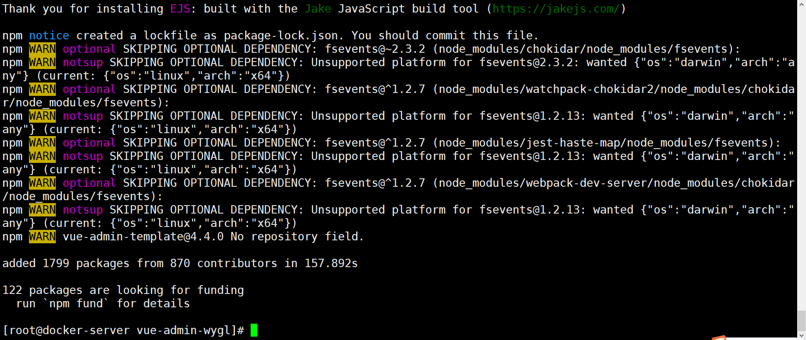
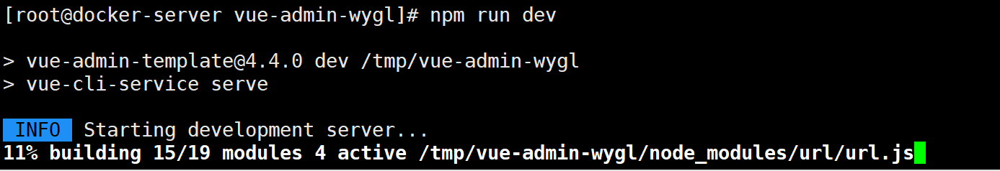
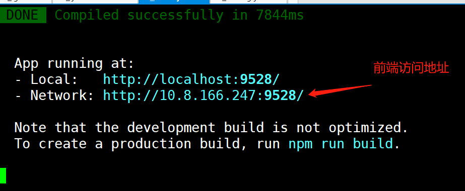
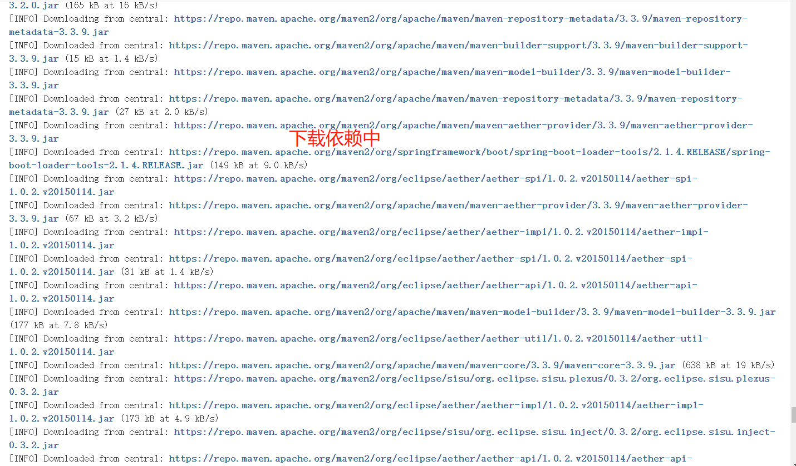
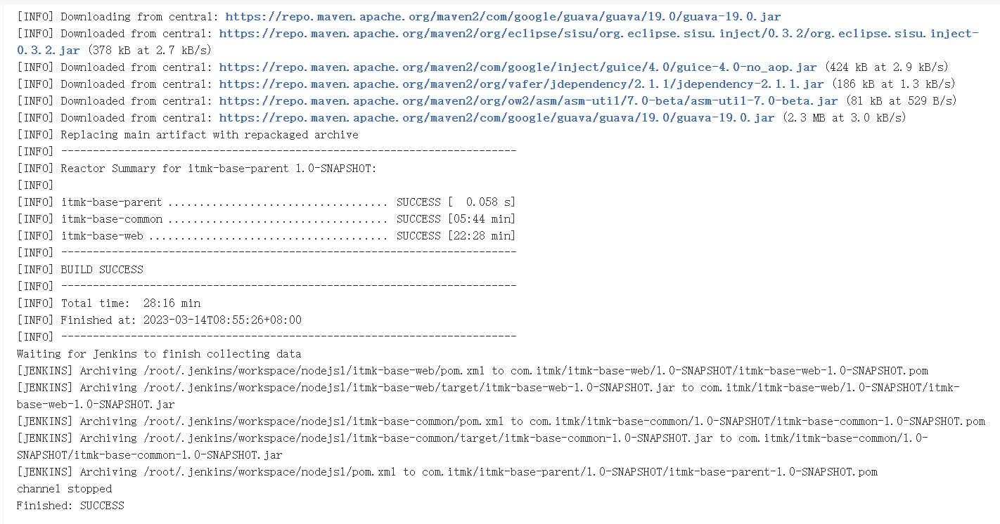

# Jenkins构建nodejs项目

前端vue项目。需要nodeJS基础环境；

```shell
[root@es-3-head-kib ~]# wget https://nodejs.org/dist/v14.17.6/node-v14.17.6-linux-x64.tar.xz
[root@es-3-head-kib ~]# tar xf node-v14.17.6-linux-x64.tar.xz -C /usr/local/
[root@es-3-head-kib nodejs]# vim /etc/profile
# 添加 如下配置
NODE_HOME=/usr/local/node-v14.17.6-linux-x64
JAVA_HOME=/usr/local/java
PATH=$NODE_HOME/bin:$JAVA_HOME/bin:$PATH
export JAVA_HOME PATH
```

设置淘宝源

```shell
npm config set registry https://registry.npm.taobao.org
#还原默认源：npm config set registry https://registry.npmjs.org/
```



```shell
[root@docker-server vue-admin-wygl]# nohup npm run dev &
```








