# Jenkins结合Ansible实战

## Jenkins机器安装ansbile

```shell
[root@jenkins ~]# yum -y install epel-release ; yum -y install ansible
[root@jenkins ~]# ansible --version
```

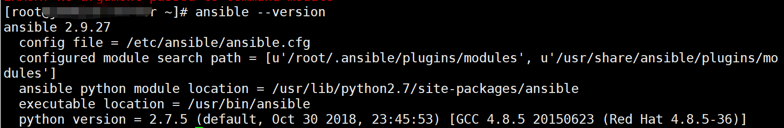

## 配置ansible主机清单

```shell
[root@jenkins ~]# cat /etc/hosts
192.168.91.135 tomcat1
[root@jenkins ~]# cat /etc/ansible/hosts
[tomcat-server]
tomcat1
[root@jenkins ~]# ssh-keygen  #一路回车
[root@jenkins ~]# ssh-copy-id  tomcat1
[root@jenkins ~]# ansible  tomcat1 -m ping
```

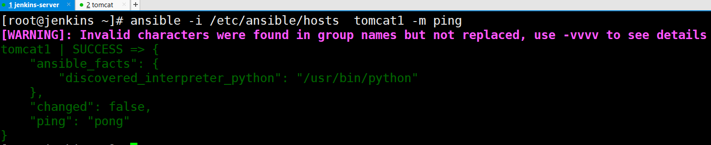

## jenkins安装ansible插件

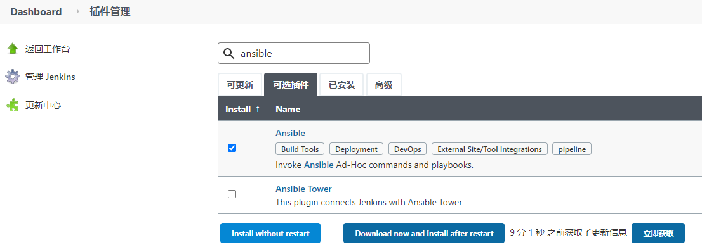

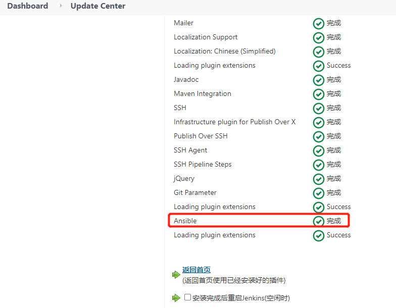

## jenkins配置ansible工具

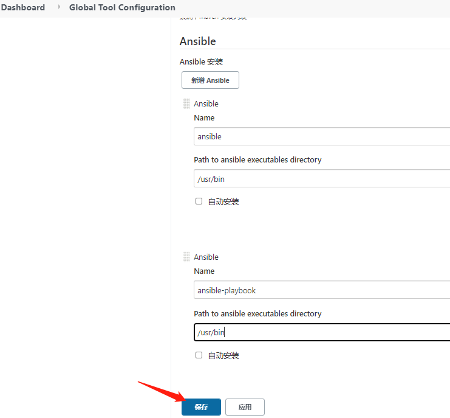

## Jenkins使用ansible命令

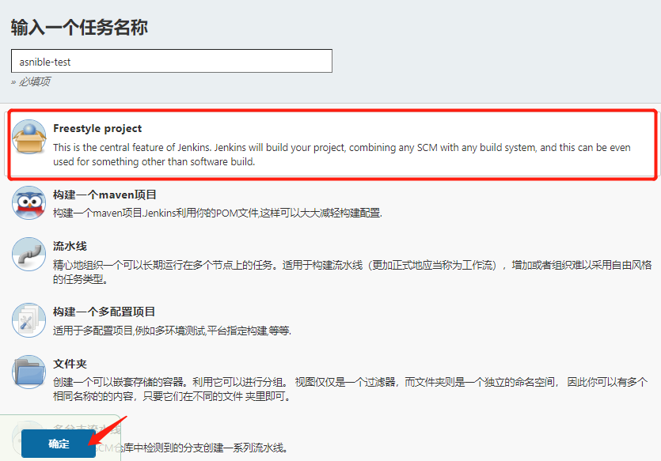

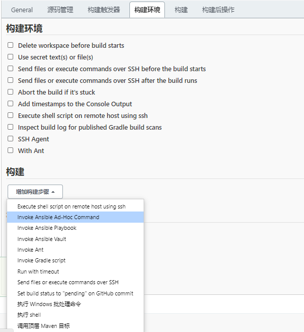

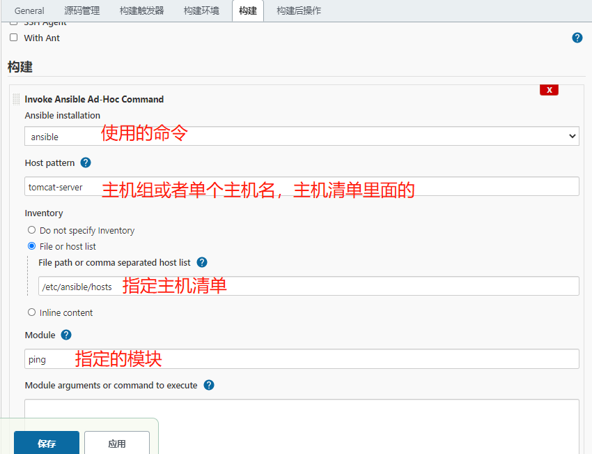

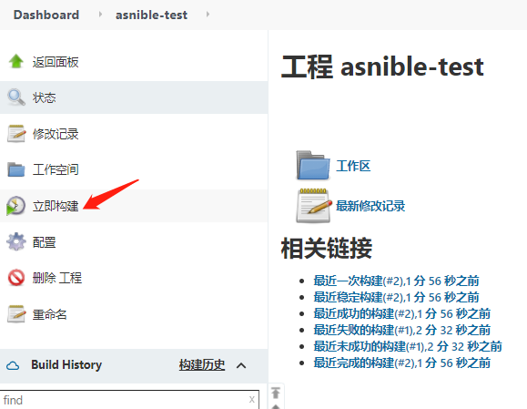

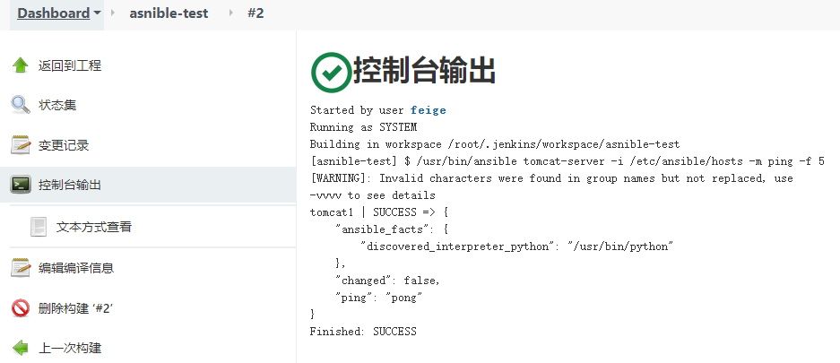


## jenkins使用ansible-playbook剧本

```shell
[root@jenkins ~]# cat /etc/ansible/test.yaml 
---
- hosts: tomcat-server
  tasks:
  - name: ip
    shell: ip a
    register: result   # 显示结果为"result"
  - debug: var=result  # 将显示结果var赋值给result
```

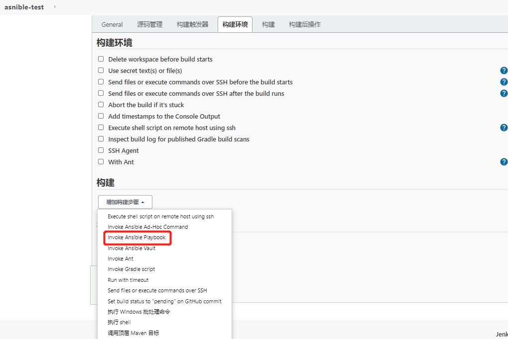

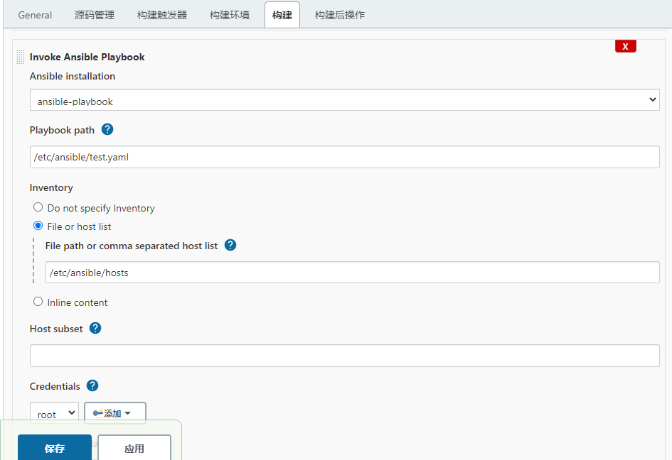

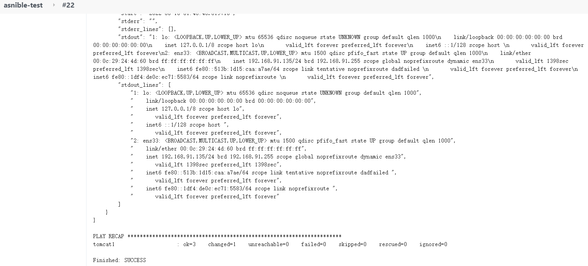

## jenkins+ansible构建maven项目

### jenkins安装git

```shell
[root@jenkins ~]# yum -y install git
```

### 添加maven和jdk工具

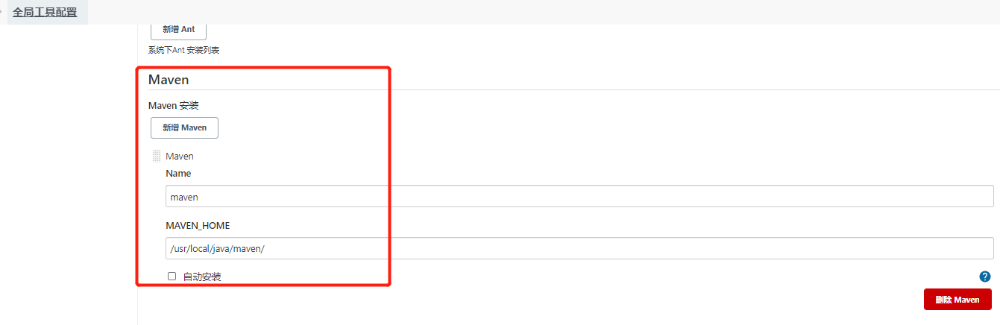

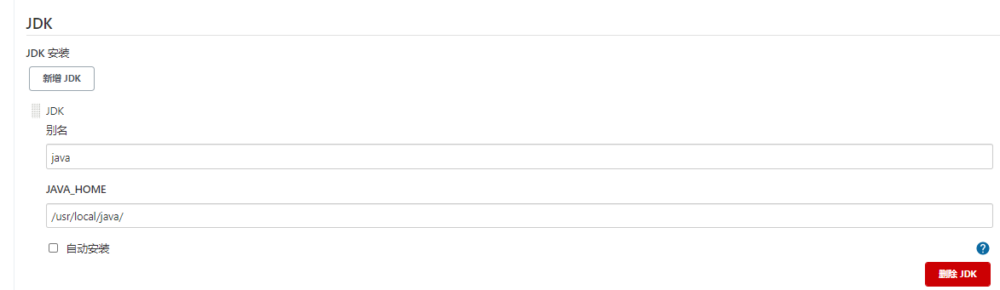

### jenkins配置gitee公钥

```shell
[root@jenkins ~]# cat /root/.ssh/id_rsa.pub
```

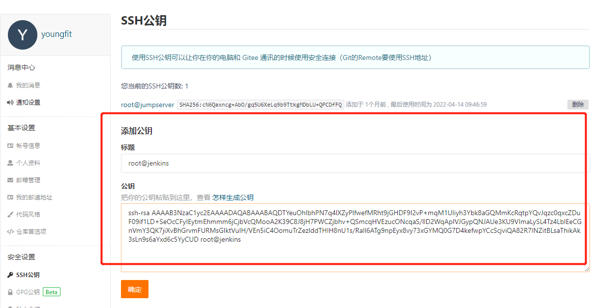

### 项目配置

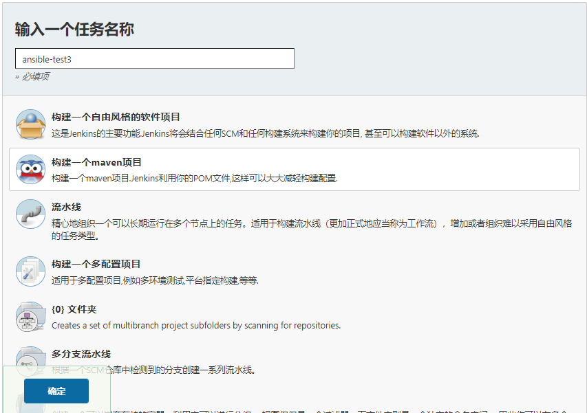

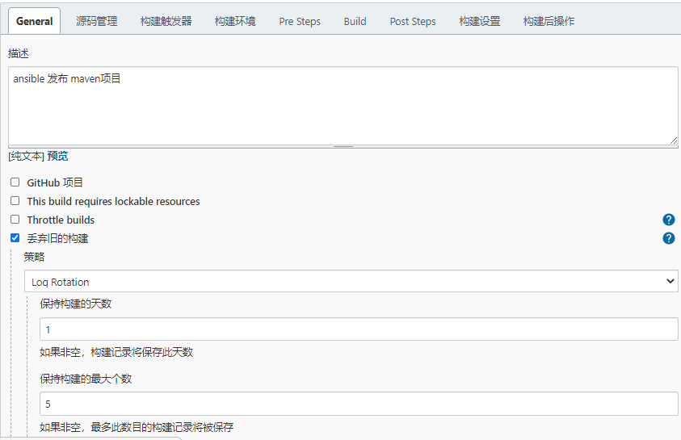

### git参数化构建

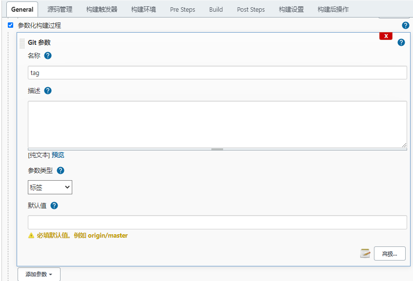

```shell
[root@jenkins ~]# cat /root/.ssh/id_rsa
```

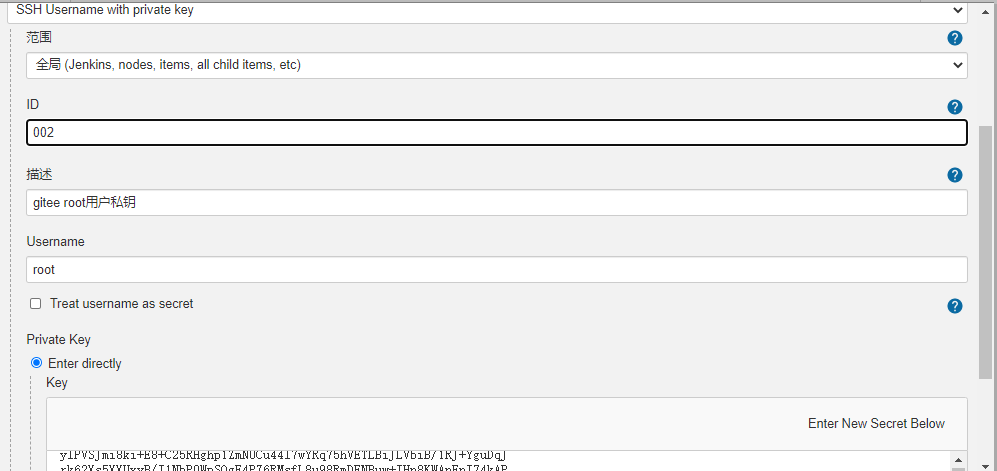

gitee仓库地址：git@gitee.com:youngfit/easy-springmvc-maven.git

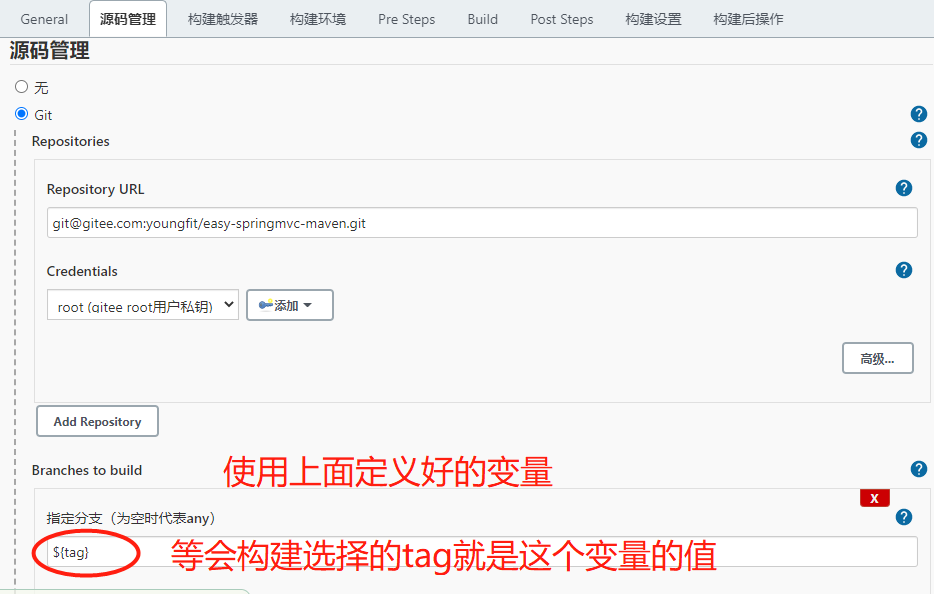

### 配置maven构建参数

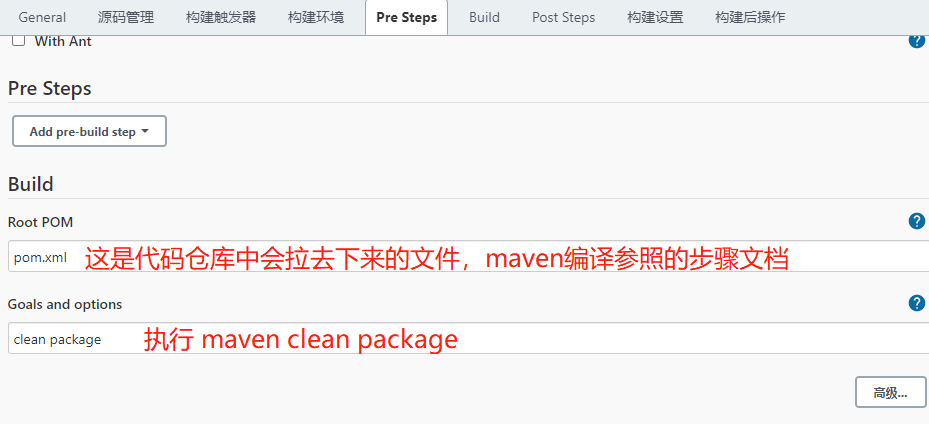

### 配置ansible运行指令

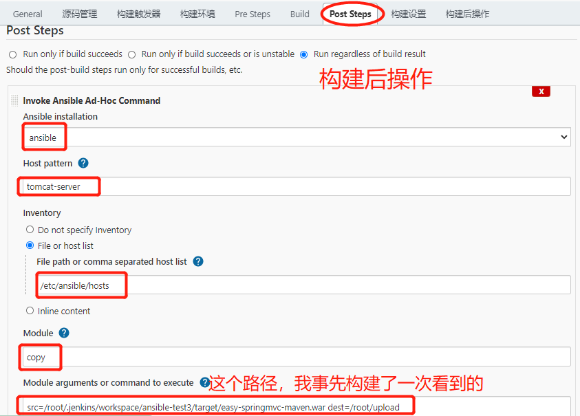

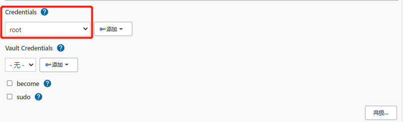


-->保存

### tomcat服务器配置

#### 安装jdk和tomcat

#### 配置环境变量

```shell
安装jdk8和tomcat
[root@tomcat local]# cat /etc/profile
TOMCAT_HOME=/data/application/tomcat
JAVA_HOME=/usr/local/java
MAVEN_HOME=/usr/local/java/maven
CLASSPATH=.:$JAVA_HOME/lib:$JAVA_HOME/jre/lib:$JAVA_HOME/lib/tools.jar
PATH=$PATH:$JAVA_HOME/bin:$MAVEN_HOME/bin
export PATH=$JAVA_HOME/bin:$JAVA_HOME/jre/bin:$PATH
```

#### 配置脚本

```shell
[root@tomcat local]# cat /opt/script/app-jenkins.sh
#!/usr/bin/bash
#本脚本适用于jenkins持续集成，实现备份war包到代码更新上线！使用时请注意全局变量。
#================
#Defining variables
export JAVA_HOME=/usr/local/java
webapp_path="/data/application/tomcat/webapps"
tomcat_run="/data/application/tomcat/bin"
updata_path="/data/update/`date +%F-%T`"
backup_path="/data/backup/`date +%F-%T`"
tomcat_pid=`ps -ef | grep tomcat | grep -v grep | awk '{print $2}'`
files_dir="easy-springmvc-maven"
files="easy-springmvc-maven.war"
job_path="/root/upload"

#Preparation environment
echo "Creating related directory"
mkdir -p $updata_path
mkdir -p $backup_path

echo "Move the uploaded war package to the update directory"
mv $job_path/$files $updata_path

echo "========================================================="
cd /opt
echo "Backing up java project"
if [ -f $webapp_path/$files ];then
	tar czf $backup_path/`date +%F-%H`.tar.gz $webapp_path
	if [ $? -ne 0 ];then
		echo "打包失败，自动退出"
		exit 1
	else
		echo "Checking if tomcat is started"
		if [ -n "$tomcat_pid" ];then
			kill -9 $tomcat_pid
			if [ $? -ne 0 ];then
				echo "tomcat关闭失败，将会自动退出"
				exit 2
			fi
		fi
		cd $webapp_path
		rm -rf $files && rm -rf $files_dir
		cp $updata_path/$files $webapp_path
		cd /opt
		$tomcat_run/startup.sh
		sleep 5
		echo "显示tomcat的pid"
		echo "`ps -ef | grep tomcat | grep -v grep | awk '{print $2}'`"
		echo "tomcat startup"
		echo "请手动查看tomcat日志。脚本将会自动退出"
	fi
else
	echo "Checking if tomcat is started"
        if [ -n "$tomcat_pid" ];then
        	kill -9 $tomcat_pid
                if [ $? -ne 0 ];then
                	echo "tomcat关闭失败，将会自动退出"
                       	exit 2
                fi
        fi
	cp $updata_path/$files $webapp_path
	$tomcat_run/startup.sh
        sleep 5
        echo "显示tomcat的pid"
        echo "`ps -ef | grep tomcat | grep -v grep | awk '{print $2}'`"
        echo "tomcat startup"
        echo "请手动查看tomcat日志。脚本将会自动退出"
fi
```

### 构建测试

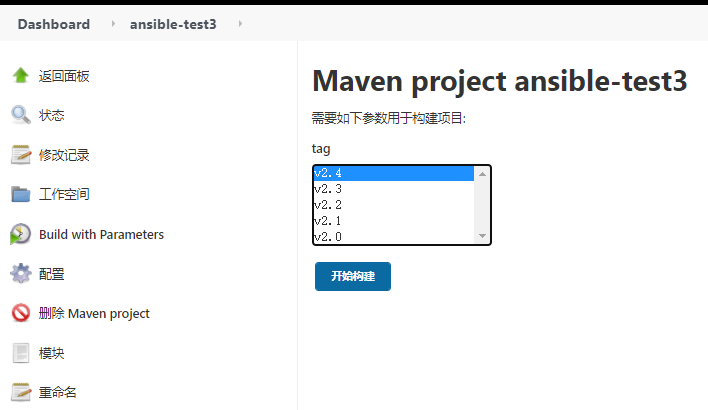

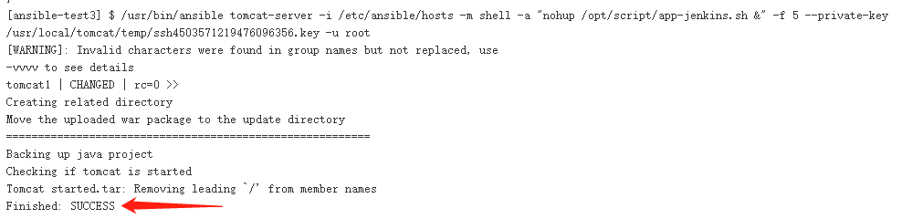

### 验证

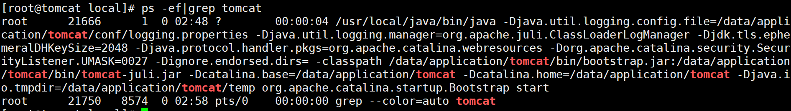

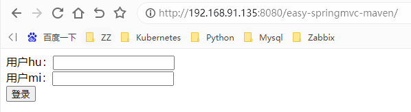

来一次版本回退试试

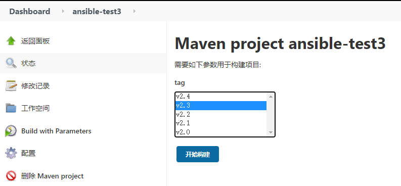

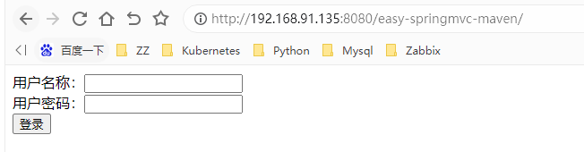

没毛病