# nexus搭建maven私服


# nexus搭建maven私服


##### 我安装的是非docker版本-放在了202服务器上面


```shell
https://maven.apache.org/guides/mini/guide-mirror-settings.html  #官网文档
```


我的包放到这个目录下面了


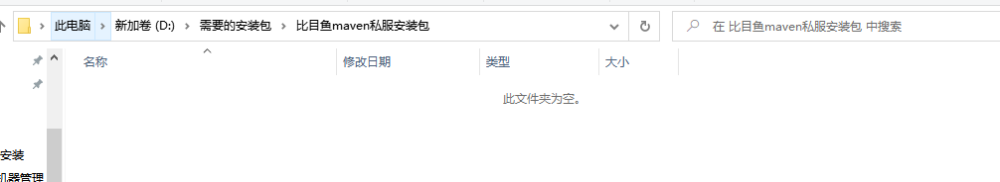


前提：已安装 JDK 并配置好了环境变量


1、下载最新版 Nexus（本教程使用的是：nexus-2.11.2-03-bundle.tar.gz）,下载地址：


要安装官网的，官网比较繁琐，我查找了好多资料


```shell
 http://www.sonatype.org/nexus/go/
```


```shell
Nexus 官网：http://xxw.ac.cn/2iMC
Nexus 下载（需要填写信息）：http://xxw.ac.cn/KD3X
Nexus 下载（不需要填写信息）：http://xxw.ac.cn/obGy
Nexus 历史下载：http://xxw.ac.cn/mKeA

视频中用到的 Nexus Linux 版本：http://xxw.ac.cn/2xOD
视频中用到的 Nexus Windows 版本：http://xxw.ac.cn/ha2M
Nexus Mac 版本：http://xxw.ac.cn/Z4Ih

软件免费下载：http://xxw.ac.cn/Vjrn

Nexus 历史版本下载：http://xxw.ac.cn/py6h

Nexus Windows 安装：http://xxw.ac.cn/WDAe
Nexus Linux 安装：http://xxw.ac.cn/cRG6

Nexus Windows 服务：http://xxw.ac.cn/wuQu
Nexus Linux 服务：http://xxw.ac.cn/e3Qr

设置仓库：
<repositories>
	<repository>
		<id>maven-public</id>
		<url>http://127.0.0.1:8081/repository/maven-public/</url>
	</repository>
</repositories>

开放端口：
firewall-cmd --zone=public --add-port=8081/tcp --permanent
firewall-cmd --reload
firewall-cmd --list-all
```


安装的是这个
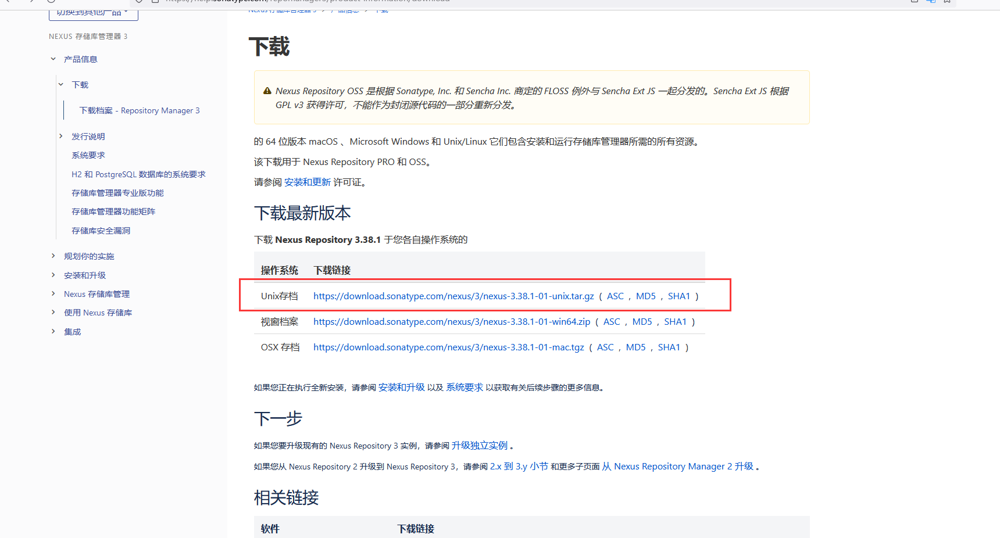


下载好的包名


##### 环境准备


```shell
 linux 系统、JDK8、Nexus 压缩包（unix）。

由于Nexus 是基于 Java 语言的，因此安装 Nexus 必须先安装好JAVA(JDK),注意：
        maven  安装  这个打包的时候需要，建议安装一下
        Nexus2 是基于 JDK7。

        Nexus3 是基于 JDK8 。
```


安装先看下本机服务占用的端口不要冲突了
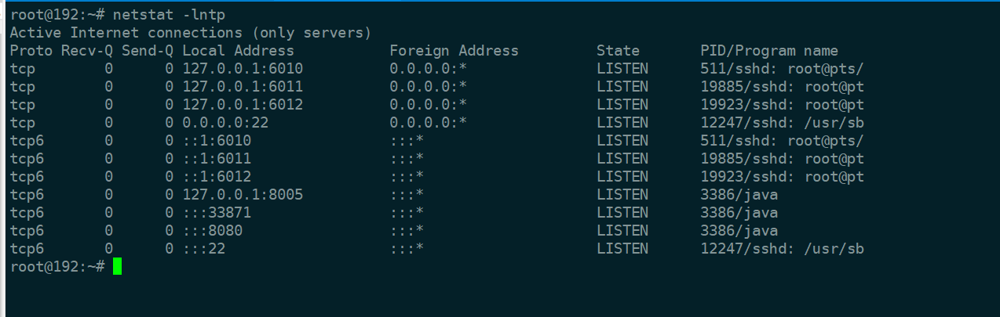


安装步骤


```shell
mkdir /nexus  #创建目录
```


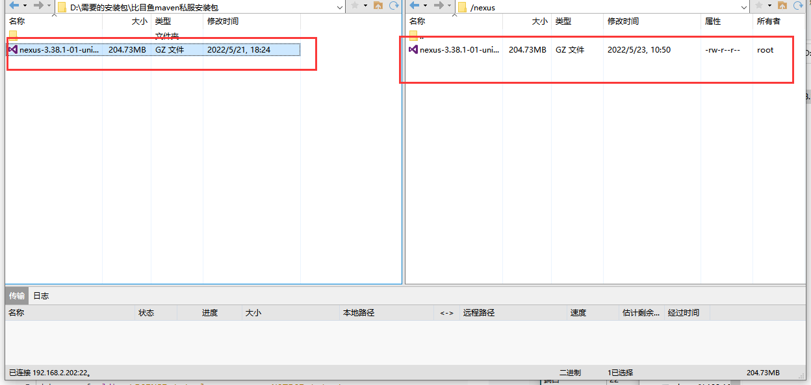


解压


```plain
tar -zxvf nexus-3.38.1-01-unix.tar.gz  #
```


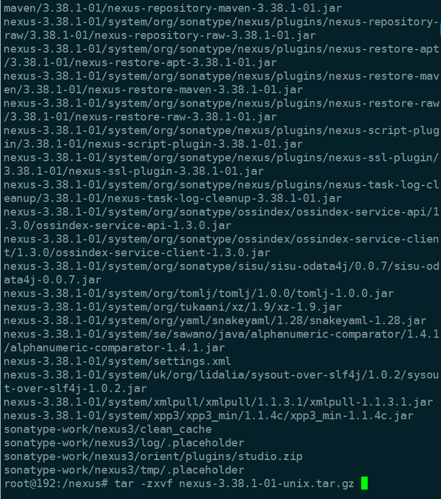


(一个 nexus 服务，一个私有库目录)


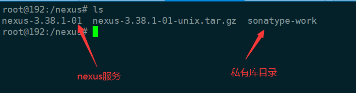


```shell
nexus-3.19.1-01 : nexus 应用程序目录

sonatype-work : 私服的仓库,里面存储的是私服上的各种构件
```


##### Nexus 服务的默认端口是 8081


默认端口是 8081，如果要修改，可以在 **sonatype-work/nexus3/etc** 目录下的 **nexus.properties** 配置文件，将 **application-port** 配置成你要的端口号即可：


下面是我的路径


```shell
/nexus/sonatype-work/nexus3/etc  #这个路径下面的文件是注释掉的

/nexus/nexus-3.38.1-01/etc #这个是引用的路径，这里解释一下我也不知道为什么有俩个路径，我是使用的这个

修改端口   application-port 配置成你要的端口号即可：
```


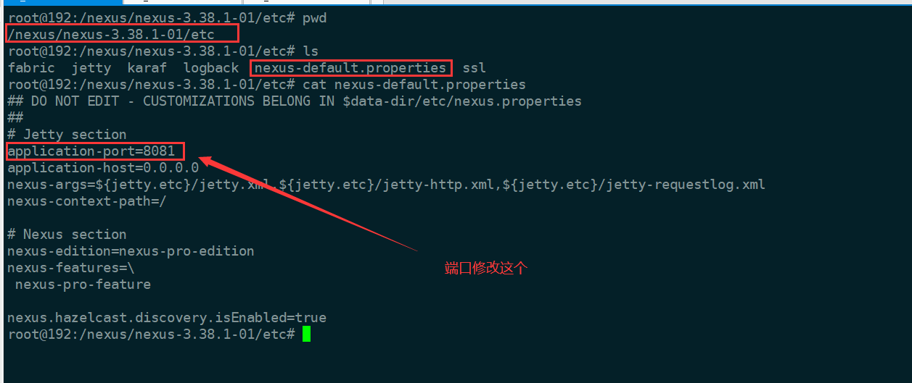


注释掉的文档
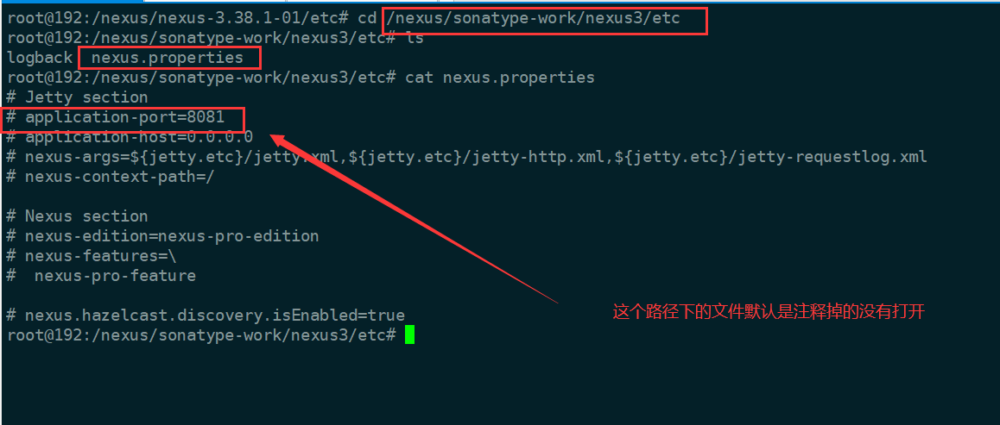


### 启动：


```shell
 进入 /nexus/nexus-3.38.1-01/bin  #目录，可以看见 nexus 文件，这就是 Nexus 服务的脚本文件:
 
通过观察该文件文本内容，可以看到 start 和 run 命令都可以用来启动 Nexus 服务；区别在于：
 
 
start 是后台启动，日志以文件形式保存；

run 是当前进程启动，直接打印在控制台；
```


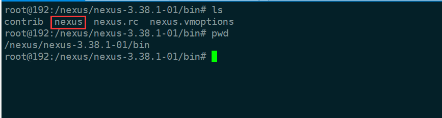


启动时候的差别


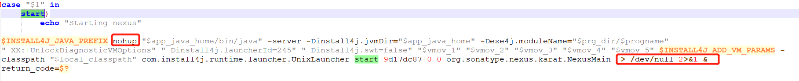


### **拓展：**


```shell
 1、其他常用命令还有：

stop 是停止服务；

restart 是重启服务；

status 是查看服务状态
```


### 启动方式（2种）：


**2.1 start命令启动（后台进程形式）**


   **在** /nexus/nexus-3.38.1-01/bin 目录下，**执行脚本命令，以后台进程的形式（不占用当前命令终端窗口），启动 Nexus 服务：**


```bash
root@192:/nexus/nexus-3.38.1-01/bin# ls
contrib  nexus	nexus.rc  nexus.vmoptions
root@192:/nexus/nexus-3.38.1-01/bin# pwd
/nexus/nexus-3.38.1-01/bin
root@192:/nexus/nexus-3.38.1-01/bin# ./nexus start
WARNING: ************************************************************
WARNING: Detected execution as "root" user.  This is NOT recommended!
WARNING: ************************************************************
Starting nexus
```


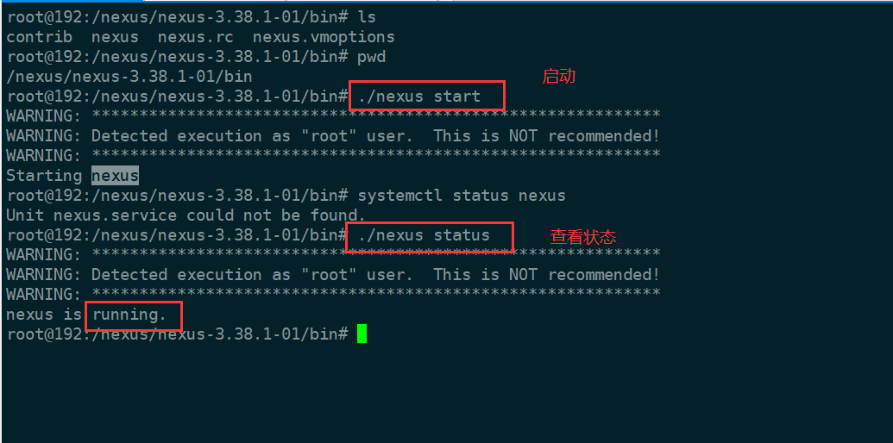


启动需要等待一段时间，可用浏览器访问 **linux 服务器ip:8081** 来验证服务是否启动好。


**2.1 cun命令启动（当前进程形式）**


```plain
    在 /nexus/nexus-3.38.1-01/bin 目录下，执行脚本命令，以当前进程形式（会占用当前命令终端窗口），启动 Nexus 服务：
```


./nexus run
等待一段时间后，看到类似如下信息，则为启动成功：
————————————————
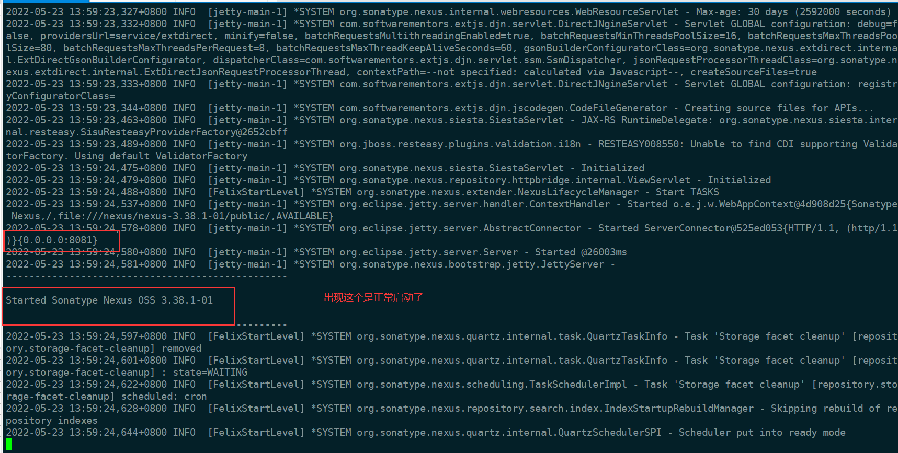


### 设置开机自启


###### 编辑配置文件


```shell
[Unitt]
Description=nexus service
After=network.target

[Service]
Type=forking
Environment=“JAVA_HOME=/usr/local/java/” ##jvm环境
ExecStart=/nexus/nexus-3.38.1-01/bin/nexus start ##nexus启动路径
ExecReload=/nexus/nexus-3.38.1-01/bin/nexus restart
ExecStop=/nexus/nexus-3.38.1-01/bin/nexus stop

[Install]
WantedBy=multi-user.target
```


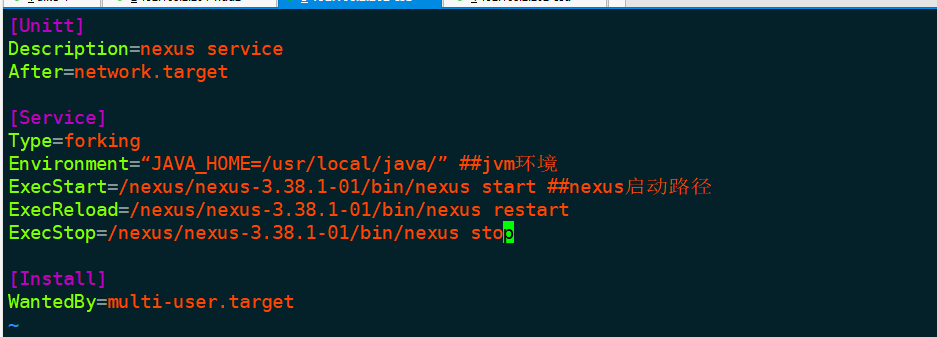


```shell
#systemctl daemon-reload
#systemctl start nexus3.service
#systemctl enable nexus3.service
```


### 总结：


   为了不占用当前命令终端窗口，推荐使用 **2.1 start命令启动（后台进程形式）Nexus 服务。**


### 开放端口：


最后一步，也是非常重要的一步，就是开放 linux 系统的防火墙端口，这里我使用了 Nexus 服务的 默认端口 8081，所以开放的就是 8081 端口：  我的操作系统是debian10的防火墙没有设置


**先查看所有开放的端口号（首次执行该操作需要输入当前用户密码）：**我这里跳过了


```shell
sudo firewall-cmd --zone=public --list-ports
```


**开放 8081 端口：**


```shell
sudo firewall-cmd --zone=public --add-port=8081/tcp --permanent
```


**重启防火墙服务：**


```shell
sudo firewall-cmd --reload
```


**再次查看所有开放的端口号，可以看到 8081 端口已经开放了：**


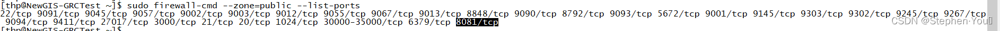


### 验证 Nexus服务：


   验证方式有很多种：


   1、linux 系统命令终端 查看 **8081 端口**所占用的进程：


```shell
第一种方法
netstat -lntp | grep 8081
tcp        0      0 0.0.0.0:8081            0.0.0.0:*               LISTEN      23278/java    
第二种方法
ps -ef | grep nexus
```


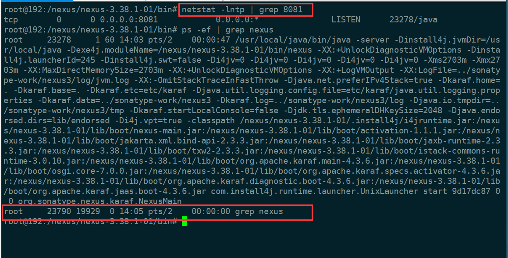


### （强烈推荐）**在浏览器访问 Nexus 的** Web 端首页**，输入** linux 服务器ip:8081


这个页面很炫酷
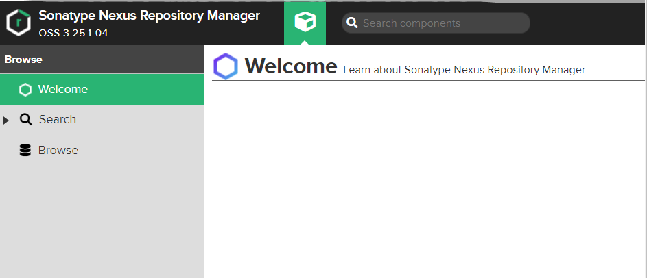


**出现类似以上3种信息，则说明 Nexus 服务已经启动成功了！！！**


### **登录并初始化 Nexus**


**浏览器访问 Nexus 的 Web 端首页，并登录，输入账号、密码：**


**注意：**


   有些 Nexus 的版本中，是有默认配置的**账号（admin）**、**密码（admin123）**的，如果登录失败的话，可以**在 sonatype-work/nexus3 目录下 的 admin.password 文件中查看初始化密码**。


在 linux 系统命令终端中执行：


```shell
root@192:/nexus/sonatype-work/nexus3# ls
blobs  db	      etc		 instances  karaf.pid  lock  orient  restore-from-backup
cache  elasticsearch  generated-bundles  kar	    keystores  log   port    tmp
root@192:/nexus/sonatype-work/nexus3# pwd
/nexus/sonatype-work/nexus3
#我的是再这个路径下面  有一个admin.password 文件文本内容，我修改玩密码之后就没有了
# 查看 admin.password 文件文本内容
cat admin.password
或
vi admin.password
或
vim admin.password
```


文件文本内容的第一行就是密码：


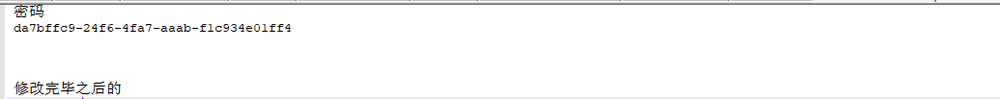


##### 登陆


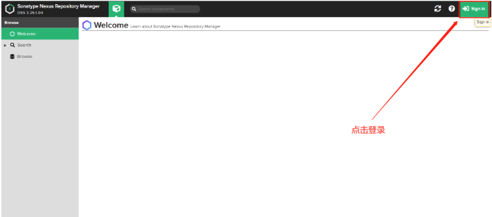


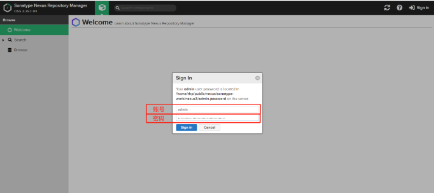


出现类似如下信息，则**登录成功：**
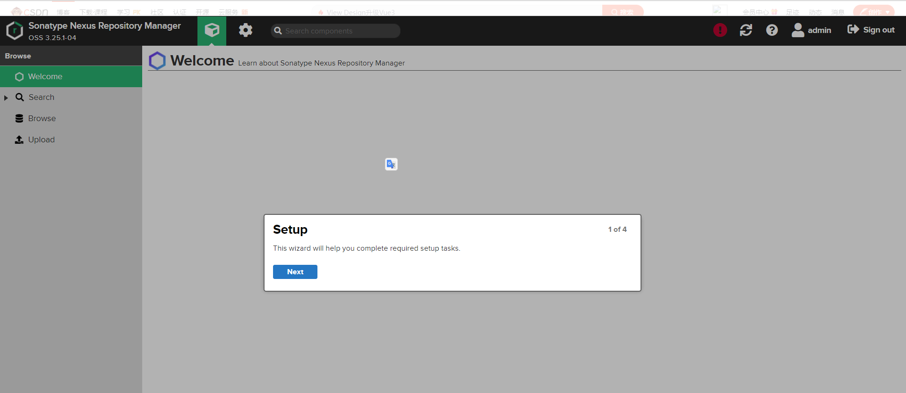


点击 Next 后，需要**重置密码：**


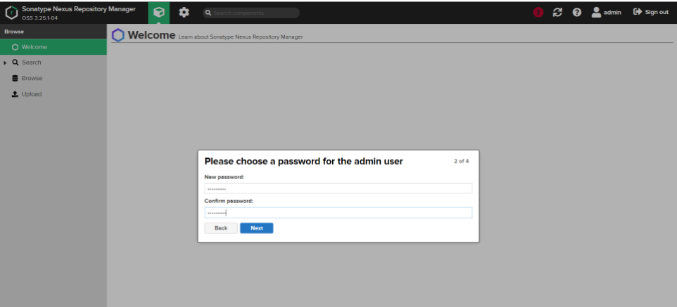


点击 Next 后，**配置匿名访问：**


配置完成：


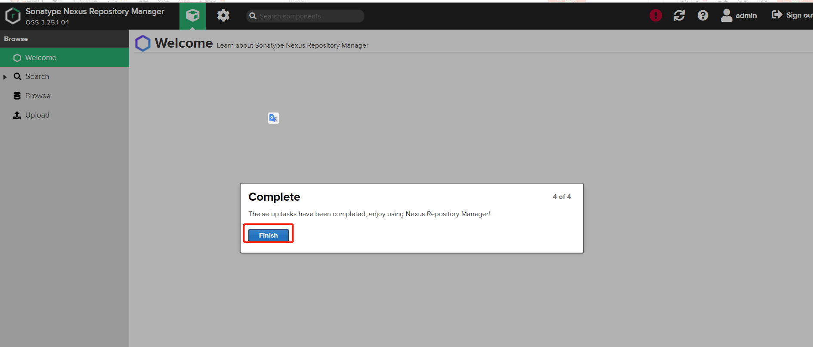


### **Nexus 后台管理界面** --介绍重点


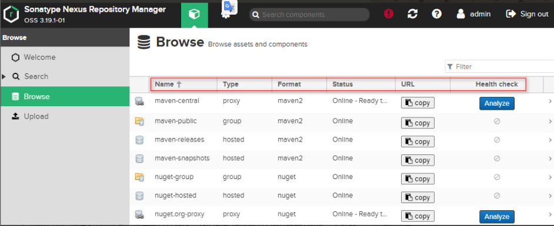


###### 首先说说他的类型


###### -Name


```shell
central: 该仓库代理 Maven 的中央仓库,策略为 Release ,只会下载和缓存中央仓库中的发布版本构件,我的理解:该仓库就是 Maven 中央仓库的中介,例如:你想从中央仓库中下载 jar 包,先必须要通过它,由它去帮你完成

public: 仓库组,将所有的仓库聚合并通过一致的地址提供服务.我的理解:就是一个可以可以将其它不同策略的仓库组合在一起的大仓库


releases: 策略为 Release 的宿主类型仓库,用来部署组织内部的发布版本构件.我的理解:就是公司内部项目发布的正式版本


snapshots: 策略为 Snapshots 的宿主类型仓库,用来部署组织内部的快照版本构件.我的理解:就是公司内部项目发布的测试版本


3rd party：一个策略为 Release 的宿主类型仓库,用来部署无法从公共仓库获得的第三方发布版本构件.我的理解:既不属于中央仓库,也不属于公司自己的,就是第三方jar包. Nexus3 没有了 3rd party 仓库,需要自己创建

nuget: .net 使用的仓库,可以忽略
```


###### -**Type**


```shell
group(仓库组类型)：又叫组仓库,用于方便开发人员自己设定的仓库(能够组合一个或者多个仓库为一个地址提供服务)

hosted(宿主类型)：内部项目的发布仓库(内部开发人员，发布上去存放的仓库)

proxy(代理类型)：从远程中央仓库中寻找数据的仓库(可以点击对应的仓库的 Configuration 页签下 Remote Storage Location 属性的值即被代理的远程仓库的路径)

virtual(虚拟类型)：虚拟仓库(这个基本用不到，重点关注上面三个仓库的使用)
```


###### **-Format**


```shell
maven2 是 JAVA 仓库

nuget 是 .net 仓库
```


###### **-Status**


```shell
online : 正常

oneline Ready To connect : 正常
```


###### **-URL**


```shell
可以点击 copy 选项复制某一个仓库的地址
```


## 使用创建仓库


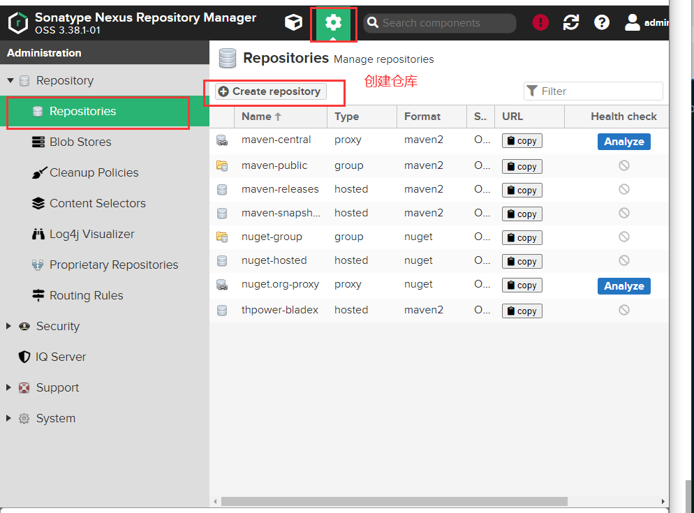


选择 maven2(hosted)：


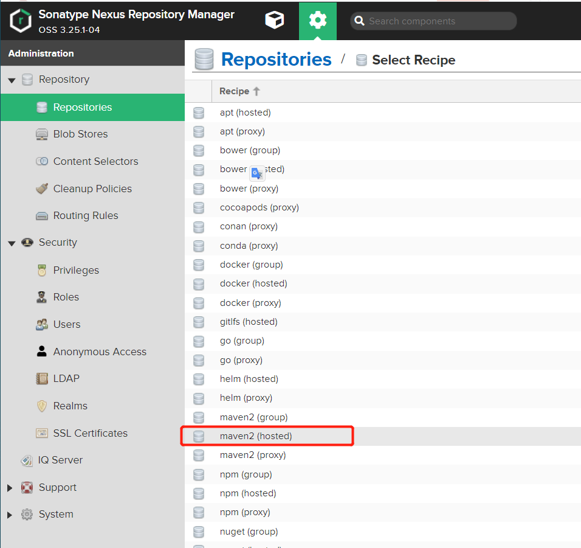


输入


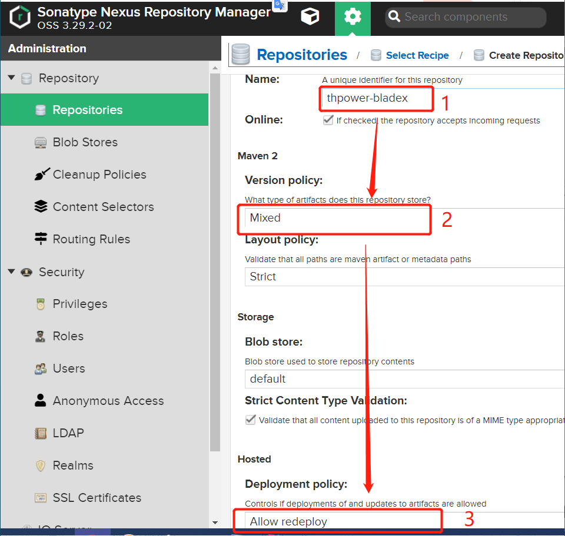


接着


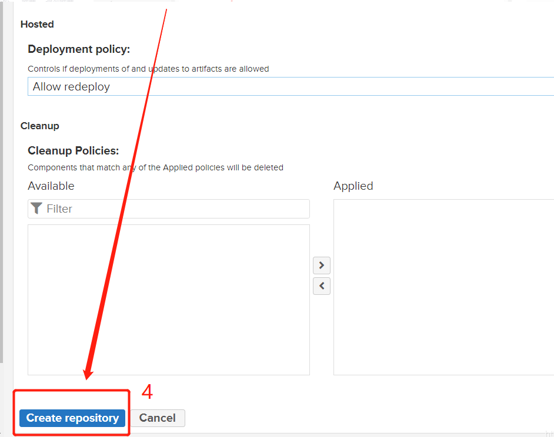


创建成功：


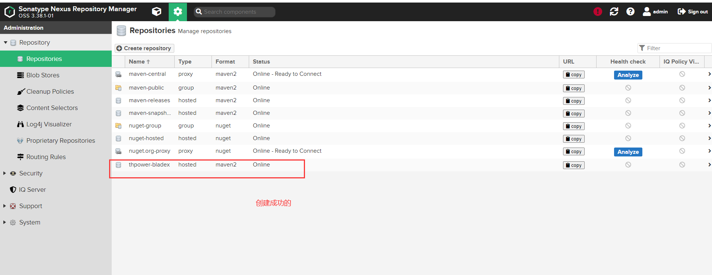


点击后能看见详情，url 就是新仓库的ip地址：
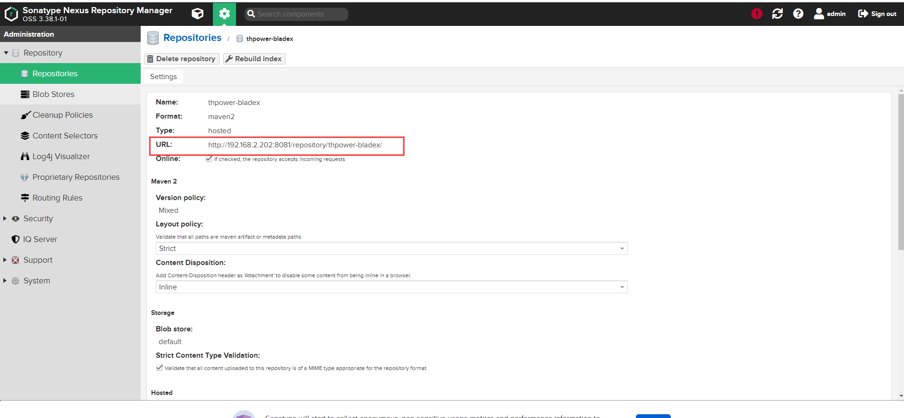


### 创建角色并权限配置（ 不建议分配删除权限）:


依次点击 **Repository 仓库管理**图标（齿轮）、 **Roles**、**Create role**、**Nexus role**：
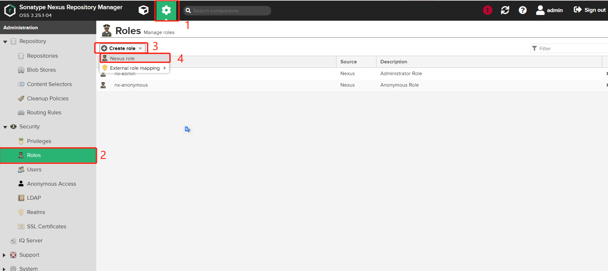


填写角色信息，检索 关键字：


```shell
nx-repository-admin-maven2-
```


赋予仓库的权限，这里我把maven2下 **central、public、release、snapshots 库**的**非删除权限（如：browse、edit、read权限）**，都赋予给 新建的角色，另外把 新建的 私库的 ** *权限（所有权限）*也赋予给该角色：
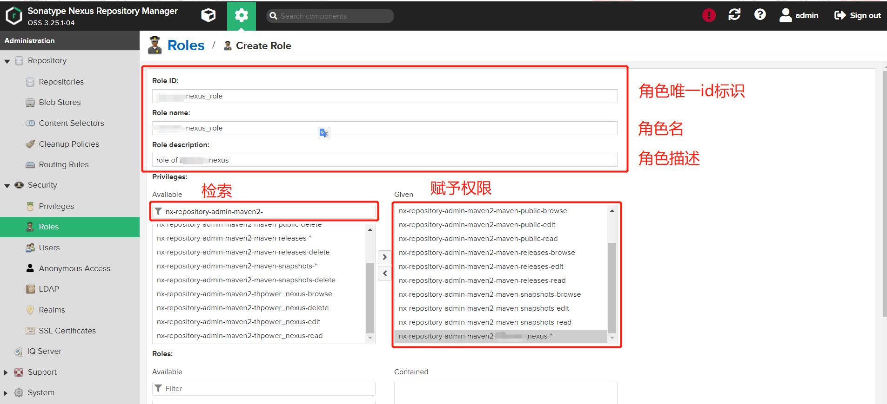


检索 **自定义仓库的库名**，赋予权限 **nx-repository-view-maven2-自定义库名-\***:


**注意：**


   **这些权限一定要配置完整，否则很容易导致各种问题（比如：maven项目上传依赖失败等）**


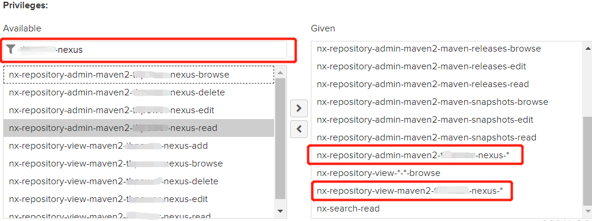


   点解 Create role 创建角色：


创建成功：


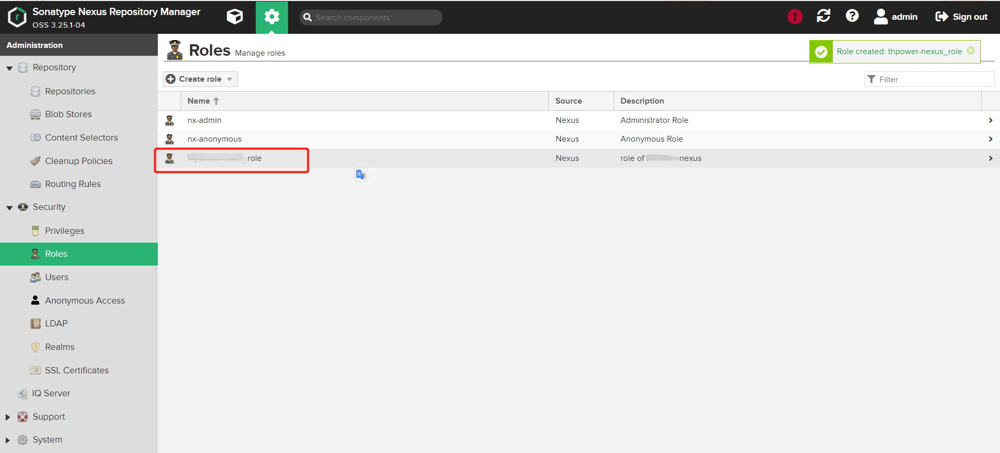


### 创建用户：


点击 Create local user 创建用户：


### 验证用户：


   点击右上角 Sign out ，退出 admin 账号的登录状态，并使用 刚刚创建的自定义用户登录试试：


登录成功后，需要输入一个凭证，可以随便输入点什么，也可以**直接 Cancel**：


### 拓展：


   可以看到虽然登录成功了，但权限比较少：


在首页中，可以 看到这个用户并没有 **Search**、**Browse** 和 **Upload 选项**：


解决：


```shell
    重新用 admin 账号登录后，找到我们之前创建的角色，并分别检索 search、browse、upload 关键字，把 nx-search-read、nx-repository-view-*-*.browse、nx-comopnet-upload 权限赋予给该角色：
```


再次以自定义用户登录，在首页中可以看到导航栏上出现了 **Search**、**Browse** 和 **Upload 选项了**：


### 上传依赖包：


### 1、手动上传


   依次点击**首页图标（箱子）** 、**Upload**、**最定义的私库：**


选择文件并填写相关信息，点击Upolad：


出现如下报错：


这是因为上传的jar包，不符合自定义仓库的 MIME 类型格式。


解决：


```shell
    回到仓库管理中，选择自定义仓库，并找到 Storage 下 的 Strict Content Type Validation:
```


把打勾的选项（Validate that all content uploaded to this repository is of a MIME type appropriate for the repository format）去掉。


   保存配置：


再次上传，出现如下信息则为上传成功：


### 查看已上传的 jar 文件：


   点击 上一图片中的 **view it now** ，或者直接点击左边导航栏中的 **Search** ，可以看见 jar 包已经手动上传成功：


2、自动上传：
主要是指在使用maven项目进行打包操作时，可以配置自定义的nexus仓库ip地址，并上传到该仓库中去，具体步骤如下：


1.修改 maven 的 settings.xml 配置文件：


```shell
root@192:/usr/local/java/maven/conf# pwd
/usr/local/java/maven/conf
root@192:/usr/local/java/maven/conf# ls
logging  settings.xml  toolchains.xml
vim settings.xml   #这个文件里面   126行
```


添加以下代码到 servers标签中：
也可以 yy  复制上面的


```shell
<server> 
	<id>自定义的Nexus仓库名（如：xxx-nexus）</id> 
	<username>自定义用户的账号（如：xxx）</username> 
	<password>自定义用户的密码（如：xxx）</password> 
</server>
```


保存并关闭settings.xml文件。


### 2. 项目上传 .jar 依赖包 到自定义的Nexus仓库 xxx-nexus ：


找到需要上传.jar包的模块中的pom文件（项目全部jar包都要上传，则可以在项目最外层的pom.xml）中加入以下代码到 project 标签下：


```shell
    <!--远程仓库地址-->
    <distributionManagement>
        <repository>
            <id>xxx-nexus</id>
            <name>Xxx Nexus3 Repository</name>
            <url>http://自定义仓库ip:8081/repository/xxx-nexus/</url>
        </repository>
    </distributionManagement>
```


打开 IDEA 的 右侧的 **Maven Projects** 窗口，依次点击 **左上角的 reimport图标**、**LifeCycle** 下的 **deploy**：


上传成功：


### maven配置访问nexus私服，从nexus私服下载依赖


###### 方式一、依赖查找顺序:本地仓库---->私服(镜像)----> Maven 中央仓库.


```shell
首先你要先了解这个，**Nexus 后台管理界面** --介绍重点，再文档上面

我这里讲一下，我之前maven连接自己的私服，遇到的问题，我一开始配置的是自己创建的仓库，发现他是不能直接使用的，要配置仓库组才能使用，这个是我踩过的坑，话不多说上案例

测试案例需要把你本地maven仓库里面的缓存先备份一下，你构建本地没有这些依赖来，他就会去你的私库里面拿，如果拿到了就证明是成功的。
```


```shell
root@192:/usr/local/java/maven# ls
bin   ch   conf  javax	LICENSE  NOTICE  README.txt  repository.bak
boot  com  io	 lib	net	 org	 repository
root@192:/usr/local/java/maven# pwd
/usr/local/java/maven   #我的路径
```


###### 再把你这些依赖都上传到私库里面，我这里引用的就是下面--内网上传maven依赖到 Nexus 库


###### 仓库组配置


1-


###### 第一步，私服nexus一般会设置鉴权，所以先添加server节点


我的配置文件,我这里是使用的工具是Code.exe - 快捷方式，编辑的maven配置文件，编辑好了直接上传到对应的目录引用，我觉得这样比vim方便一点，你们按照自己熟悉的去编写


/usr/local/java/maven/conf


```shell
        <server>
            <id>nexus</id>
            <username>admin</username>
            <password>pwd</password>
        </server>
```


这里需要特别注意id节点的值，这个值和后面很多节点相关联的。
对应的neuxs


###### 配置文件详解


```shell
<servers>
		<!--服务器元素包含配置服务器时需要的信息 -->
		<!--第一个nexus-xu要和下面的mirror中的id一致，代表拉取是也需要进行身份校验-->
        <server>
			<!--这是server的id（注意不是用户登陆的id），该id与distributionManagement中repository元素的id相匹配。 -->
            <id>nexus-xu</id>
			<!--鉴权用户名。鉴权用户名和鉴权密码表示服务器认证所需要的登录名和密码。 -->
            <username>admin</username>
			<!--鉴权密码 。鉴权用户名和鉴权密码表示服务器认证所需要的登录名和密码。密码加密功能已被添加到2.1.0 +。详情请访问密码加密页面 -->
            <password>bimuyu@11</password>
			<!--鉴权时使用的私钥位置。和前两个元素类似，私钥位置和私钥密码指定了一个私钥的路径（默认是${user.home}/.ssh/id_dsa）以及如果需要的话，一个密语。将来passphrase和password元素可能会被提取到外部，但目前它们必须在settings.xml文件以纯文本的形式声明。 -->
			<!-- <privateKey>${usr.home}/.ssh/id_dsa</privateKey> -->
			<!-- 鉴权时使用的私钥密码。 -->
			<!-- <passphrase>some_passphrase</passphrase> -->
			<!-- 文件被创建时的权限。如果在部署的时候会创建一个仓库文件或者目录，这时候就可以使用权限（permission）。这两个元素合法的值是一个三位数字，其对应了unix文件系统的权限，如664，或者775。 -->
			<!-- <filePermissions>664</filePermissions> -->
			<!-- 目录被创建时的权限。 -->
			<!-- <directoryPermissions>775</directoryPermissions> -->
        </server>
```


###### 第二部是配置镜像，也就是私服的镜像--重点


###### 重点--mirrorOf标签


mirror都是放到本地settings.xml的中进行配置的，其中的id，name，url和repository没啥两样，特别说说mirrorOf标签：
阿里云的配置模板


```shell
	 <mirror>
		<id>nexus-aliyun</id>
		<mirrorOf>central</mirrorOf>
		<name>Nexus aliyun</name>
		<url>http://maven.aliyun.com/nexus/content/groups/public</url>
	</mirror>
```


配置的mirrorOf标签为central，表示任何对于central中央仓库的请求都会被拦截并转发到这个阿里云的maven仓库中


```shell
还有一些其他的写法：

1. <mirrorOf>*</mirrorOf>使用*号匹配所有的远程仓库。

2.<mirrorOf>external:*</mirrorOf>匹配所有不在本机上的远程仓库。

3. <mirrorOf>repo1,repo2</mirrorOf>匹配仓库repo1和repo2.

4. <mirrorOf>*,!repo1</mirrorOf>匹配所有出了repo1之外的远程仓库。

注意！镜像仓库会完全屏蔽掉被镜像仓库，即镜像仓库失效后，maven不会再去访问被屏蔽掉的仓库。
```


下面是正常的配置模板


```shell
        <mirror>
            <id>nexus</id>
            <mirrorOf>*</mirrorOf>
            <name>nexus</name>
            <url>http://ip:port/repository/xg_public/</url>
        </mirror>
```


web页面的仓库地址


【第二步】在nexus中设置允许匿名下载，如果不允许将不会从私服中下载依赖


如果私服中没有对应的jar，会去中央仓库下载，速度很慢。可以配置让私服去阿里云中下载依赖。


注意，这里的id和上面server的id要保持一致，也就是访问这个镜像地址的时候，[maven](https://so.csdn.net/so/search?q=maven&spm=1001.2101.3001.7020)使用哪个server节点的用户名和密码去访问私服，如果没有配置或者id没有匹配上，访问nexus会报错401


###### 配置文件详解


###### 第三部是配置profile


在 setting.xml 中配置仓库
在客户端的 setting.xml 中配置私服的仓库，由于 setting.xml 中没有 repositories 的配置标签，需要使用 profile 定义仓库。


```shell
        <profile>
            <id>nexus</id>
            <repositories>
                <repository>
                    <id>central</id>
                    <url>http://central</url>
                    <releases><enabled>true</enabled></releases>
                    <snapshots><enabled>true</enabled></snapshots>
                </repository>
            </repositories>
            <pluginRepositories>
                <pluginRepository>
                    <id>central</id>
                    <url>http://central</url>
                    <releases><enabled>true</enabled></releases>
                    <snapshots><enabled>true</enabled></snapshots>
                </pluginRepository>
            </pluginRepositories>
        </profile>
```


配置文件详解


我的配置如下


注意，这里profile的id和上面镜像的id需要一致，也就是说，这个profile配置的仓库去哪个镜像下载。repository里面的url不重要，应为始终都要去镜像里面下载，镜像有地址了。


###### 最后一步就是配置指定哪个profile生效


使用 profile 定义仓库需要激活才可生效


```shell
    <activeProfiles>
        <activeProfile>nexus</activeProfile>
    </activeProfiles>
```


对应


###### 完成测试


我这里是直接到项目下面打包测试了一下


```shell
mvn clean package install -Dmaven.test.skip=true -DarchetypeCatalog=local -X
```


测试结果是成功


也可以直接使用jenkins直接构建


### 内网上传maven依赖到 Nexus 库


###### 1.下载依赖到本地


首先将业务系统所需要的依赖获取到，放到本地的某个文件夹。为了省事，可以直接将maven的 repository 下的所有依赖全部拷贝出来，放入固定文件夹（d: //repository）


###### 2.将依赖上传


在目标系统下，创建文件夹，用来存放d: //repository/ 下的文件，比如穿件/home/repository/,使用xshell 工具将d: //repository/ 下的文件 全部放入到 /home/repository/ 下


###### 3.创建推送脚本


推送脚本mavenInstall.sh 主要是使用命令将/home/repository/ 的文件都推送到Nexus去，在/home/repository/ 下创建 mavenInstall.sh ，具体写法如下：


```shell
#/bin/bash
#
#
while getopts ":r:u:p:" opt; do
case $opt in
r) REPO_URL="$OPTARG"
;;
u) USERNAME="$OPTARG"
;;
p) PASSWORD="$OPTARG"
;;
esac
done
find . -type f -not -path './mavenimport\.sh*' -not -path '*/\.*' -not -path '*/\^archetype\-catalog\.xml*' -not -path '*/\^maven\-metadata\-local*\.xml' -not -path '*/\^maven\-metadata\-deployment*\.xml' | sed "s|^\./||" | xargs -I '{}' curl -u "$USERNAME:$PASSWORD" -X PUT -v -T {} ${REPO_URL}/{};
```


一定要注意编码，linux 和windows 的编码格式，会导文件执行出错。


###### 4.编写执行命令


首先安装 curl


```shell
aptitude  -y   install  curl
```


```shell
执行命令的书写如下所示：

写法：

./mavenInstall.sh -u 用户名 -p 密码 -r 创库地址

样例：

./mavenInstall.sh -u admin -p bimuyu@11 -r http://192.168.2.202:8081/repository/3rd-party/
```


上传过程


###### 上传完成打开neuxs查看


此文章参考的这个大佬，我的有点不一样，但是整个过程都是差不多的
大佬一


[https://blog.csdn.net/weixin_42585386/article/details/122108563?ops_request_misc=&request_id=&biz_id=102&utm_term=linuxx操作系统nexus下载教程&utm_medium=distribute.pc_search_result.none-task-blog-2allsobaiduweb~default-1-122108563.142v10control,157v4control&spm=1018.2226.3001.4187]:


大佬二


[https://www.cnblogs.com/xiaomaomao/p/14170993.html]:


### 手动上传SNAPSHOT文件到[Maven](https://so.csdn.net/so/search?q=Maven&spm=1001.2101.3001.7020)私服Nexus的方法


```shell
公司用Nexus搭建的Maven私服，之前一直用代理方式链接兄弟公司的Maven私服，来使用他们的研发成果。最近他们出于安全考虑禁止了外部访问，改为直接把jar包发送给我们，而我们需要把jar包手动上传到我们的私服上供开发团队使用。
问题来了：他们提供的jar是SNAPSHOT版本，Nexus私服的Release仓库不允许上传SNAPSHOT版本，会报错，而SNAPSHOT仓库压根就不提供Web界面上传功能。
经过调查，找到的办法是通过Maven命令行直接上传文件。
```


命令行的完整写法如下：


```shell
mvn deploy:deploy-file -DgroupId=com.youcompany -DartifactId=your-artifactID -Dversion=1.0.0-SNAPSHOT -Dpackaging=jar -Dfile=F:\jar\your-jar-1.0.1-SNAPSHOT.jar -Durl=https://yourcompany.com/nexus/content/repositories/snapshots/ -DrepositoryId=snapshots
```


```shell
前面几个参数显而易见不解释，最后两个参数简单说一下：
url: 在nexus上的目标SNAPSHOT仓库的URL地址。
repositoryId: 在maven本地settings.xml中，与上述URL对应的节点中配置的id。
```


如果settings.xml配置的是：


```shell
<server>
    <id>releases</id>
    <username>admin</username>
    <password>123</password>
</server>
<server>
  <id>snapshots</id>
  <username>admin</username>
  <password>123</password>
</server>
```