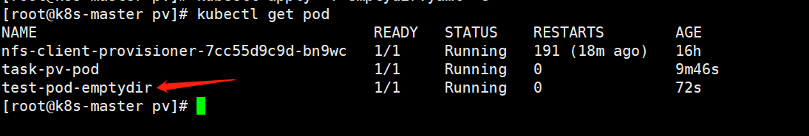
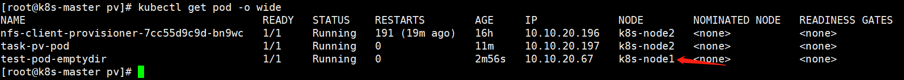
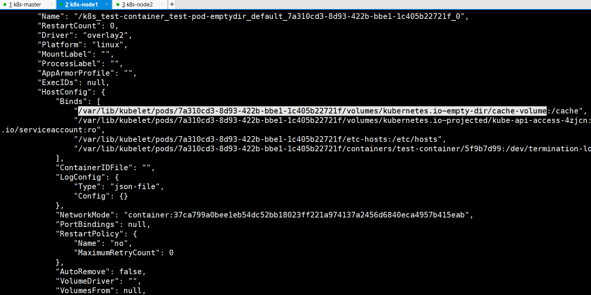
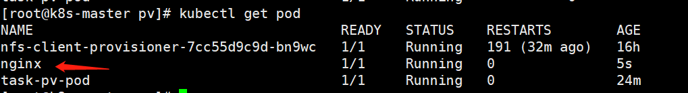
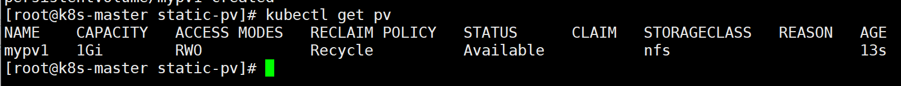
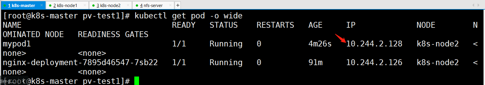
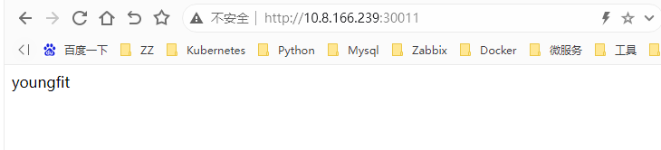
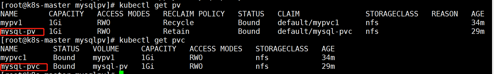

# K8S存储管理volume、PV/PVC

本章概述

K8S存储管理按照发展的历程，涉及到有Volume、PV/PVC、StorageClass，Volume是最早提出的存储卷，主要解决容器和数据存储的依赖关系，抽象底层驱动以及支持不同的存储类型，使用Voume需要了解底层存储细节，因此提出了PV，Persistent Volume是由k8s管理员定义的存储单元，应用端使用PersistentVolumeClaims声明去调用PV存储，进一步抽象了底层存储；随着PV数量的增加，管理员需要不停的定义PV的数量，衍生了通过StorageClass动态生成PV，StorageClass通过PVC中声明存储的容量，会调用底层的提供商生成PV。本文介绍Volume的使用，下篇文章介绍PV，PVC和StorageClass。


Volume 存储卷，独立于容器，后端和不同的存储驱动对接

PV Persistent Volume持久化存储卷，和node类似，是一种集群资源，由管理员定义，对接不同的存储

PVC PersistentVolumeClaims持久化存储声明，和pod类似，作为PV的使用者

StorageClass 动态存储类型，分为静态和动态两种类型，通过在PVC中定义存储类型，自动创建所需PV


存储的概述

kubernetes容器中的数据是临时的，即当重启重启或crash后容器的数据将会丢失，此外容器之间有共享存储的需求，所以kubernetes中提供了volume存储的抽象，volume后端能够支持多种不同的plugin驱动，通过.spec.volumes中定义一个存储，然后在容器中.spec.containers.volumeMounts调用，最终在容器内部以目录的形式呈现。


kubernetes内置能支持多种不同的驱动类型，大体上可以分为四种类型：


公/私有云驱动接口，如awsElasticBlockStore实现与aws EBS集成

开源存储驱动接口，如ceph rbd，实现与ceph rb块存储对接

本地临时存储，如hostPath

kubernetes对象API驱动接口，实现其他对象调用，如configmap，每种存储支持不同的驱动


# 本地临时存储

本地临时存储包括hostPath、emptyDir等。

emptyDir是一种临时存储，pod创建的时候会在node节点上为容器申请一个临时的目录，跟随容器的生命周期，如容器删除，emptyDir定义的临时存储空间也会随之删除，容器发生意外crash则不受影响，同时如果容器发生了迁移，其上的数据也会丢失，emptyDir一般用于测试，或者缓存场景。注意：一个容器崩溃了不会导致数据的丢失，因为容器的崩溃并不移除pod.


emptyDir 的一些用途：


缓存空间，例如基于磁盘的归并排序。

为耗时较长的计算任务提供检查点，以便任务能方便地从崩溃前状态恢复执行。

在 Web 服务器容器服务数据时，保存内容管理器容器获取的文件。

```shell
[root@k8s-master pv]# cat emptydir.yaml 
apiVersion: v1
kind: Pod
metadata:
  name: test-pod-emptydir
spec:
  containers:
  - image: busybox:1.27
    name: test-container
    command: ["/bin/sh","-c","sleep 600"]
    volumeMounts:
    - mountPath: /cache
      name: cache-volume
  volumes:
  - name: cache-volume
    emptyDir: {}
[root@k8s-master pv]# kubectl apply -f emptydir.yaml 
```



```shell
[root@k8s-master pv]# kubectl exec -it test-pod-emptydir /bin/sh
kubectl exec [POD] [COMMAND] is DEPRECATED and will be removed in a future version. Use kubectl exec [POD] -- [COMMAND] instead.
/ # cd /cache/
/cache # ls
/cache # echo "linux" > a.txt
/cache # cat a.txt 
linux
```

创建文件的路径可以通过如下步骤进行查找。首先查找改pod所在的node，然后登陆这台node，进行grep

```shell
[root@k8s-master pv]# kubectl get pod -o wide
```



```shell
docker [root@k8s-node1 ~]# docker inspect k8s_test-container_test-pod-emptydir_default_7a310cd3-8d93-422b-bbe1-1c405b22721f_0
```



```shell
[root@k8s-node1 ~]# cat /var/lib/kubelet/pods/7a310cd3-8d93-422b-bbe1-1c405b22721f/volumes/kubernetes.io~empty-dir/cache-volume/a.txt 
linux
```

备注：当删除完这个pod时，这个文件也会自动删除的。

```shell
[root@k8s-master pv]# kubectl delete pod test-pod-emptydir
pod "test-pod-emptydir" deleted
[root@k8s-node1 ~]# cat /var/lib/kubelet/pods/7a310cd3-8d93-422b-bbe1-1c405b22721f/volumes/kubernetes.io~empty-dir/cache-volume/a.txt 
cat: /var/lib/kubelet/pods/7a310cd3-8d93-422b-bbe1-1c405b22721f/volumes/kubernetes.io~empty-dir/cache-volume/a.txt: No such file or directory
```

# hostPath主机存储

hostPath 卷能将node宿主机节点文件系统上的文件或目录挂载到您的 Pod 中。例如，hostPath 的一些用法有：


运行一个需要访问 Docker 引擎内部机制的容器；请使用 hostPath 挂载 /var/lib/docker 路径。

在容器中运行 cAdvisor 时，以 hostPath 方式挂载 /sys。

允许 Pod 指定给定的 hostPath 在运行 Pod 之前是否应该存在，是否应该创建以及应该以什么方式存在。

除了必需的 path 属性之外，用户可以选择性地为 hostPath 卷指定 type。支持的 type 值如下：


无法复制加载中的内容


当使用这种类型的卷时要小心，因为：


具有相同配置（例如从 podTemplate 创建）的多个 Pod 会由于节点上文件的不同而在不同节点上有不同的行为。

当 Kubernetes 按照计划添加资源感知的调度时，这类调度机制将无法考虑由 hostPath 使用的资源。

基础主机上创建的文件或目录只能由 root 用户写入。您需要在特权容器中以 root 身份运行进程，或者修改主机上的文件权限以便容器能够写入 hostPath 卷。

```shell
[root@k8s-node1 ~]# mkdir /data
[root@k8s-node1 ~]# ls /data/
[root@k8s-master pv]# cat  hostpath.yml 
apiVersion: v1
kind: Pod
metadata:
  name: nginx
spec:
  containers:
  - image: nginx
    name: test-container
    volumeMounts:
    - mountPath: /test-pod
      name: test-volume
  volumes:
  - name: test-volume
    hostPath:
      path: /data
      type: Directory
[root@k8s-master pv]# kubectl create -f hostpath.yml 
pod/nginx created
[root@k8s-master pv]# kubectl get pod
```



```shell
[root@k8s-node1 ~]# echo "cloud" > /data/b.txt
[root@k8s-master pv]# kubectl exec -it nginx /bin/bash
kubectl exec [POD] [COMMAND] is DEPRECATED and will be removed in a future version. Use kubectl exec [POD] -- [COMMAND] instead.
root@nginx:/# cd /test-pod/
root@nginx:/test-pod# ls
b.txt
```

# 持久化存储PV和PVC

## 1.PV和PVC的引入

```plain
Volume 提供了非常好的数据持久化方案，不过在可管理性上还有不足。
拿前面 AWS EBS 的例子来说，要使用 Volume，Pod 必须事先知道如下信息：
当前 Volume 来自 AWS EBS。
EBS Volume 已经提前创建，并且知道确切的 volume-id。
Pod 通常是由应用的开发人员维护，而 Volume 则通常是由存储系统的管理员维护。开发人员要获得上面的信息：
要么询问管理员。
要么自己就是管理员。
这样就带来一个管理上的问题：应用开发人员和系统管理员的职责耦合在一起了。如果系统规模较小或者对于开发环境这样的情况还可以接受。但当集群规模变大，特别是对于生成环境，考虑到效率和安全性，这就成了必须要解决的问题。

Kubernetes 给出的解决方案是 PersistentVolume 和 PersistentVolumeClaim。
PersistentVolume (PV) 是外部存储系统中的一块存储空间，由管理员创建和维护。与 Volume 一样，PV 具有持久性，生命周期独立于 Pod。
PersistentVolumeClaim (PVC) 是对 PV 的申请 (Claim)。PVC 通常由普通用户创建和维护。需要为 Pod 分配存储资源时，用户可以创建一个 PVC，指明存储资源的容量大小和访问模式（比如只读）等信息，Kubernetes 会查找并提供满足条件的 PV。
有了 PersistentVolumeClaim，用户只需要告诉 Kubernetes 需要什么样的存储资源，而不必关心真正的空间从哪里分配，如何访问等底层细节信息。这些 Storage Provider 的底层信息交给管理员来处理，只有管理员才应该关心创建 PersistentVolume 的细节信息。
```

## 2.通过NFS实现持久化存储

### 2.1 配置nfs

k8s-master nfs-server

k8s-node1 k8s-node2 nfs-client

所有节点安装nfs

```shell
yum install -y nfs-common nfs-utils
```


在nfs-server节点创建共享目录

```shell
[root@k8s-master k8s]# mkdir /nfsdata
```


授权共享目录

```shell
[root@k8s-master k8s]# chmod 666 /nfsdata
```


编辑exports文件

```shell
[root@k8s-master k8s]# vim /etc/exports
/nfsdata *(rw,no_root_squash,no_all_squash,sync)
```


**配置生效**

**启动rpc和nfs（注意顺序）**

```shell
[root@k8s-master k8s]# systemctl start rpcbind
[root@k8s-master k8s]# systemctl start nfs
```


作为准备工作，我们已经在 k8s-master 节点上搭建了一个 NFS 服务器，目录为 `/nfsdata`：


测试NFS挂载是否可用

```shell
[root@k8s-node2 ~]# mkdir /test
[root@k8s-node2 ~]# mount -t nfs 10.8.166.252:/nfsdata /test/
[root@k8s-node2 ~]# df -Th|grep "/test"
10.8.166.252:/nfsdata   nfs4       19G  9.9G  9.0G  53% /test
[root@k8s-node2 ~]# touch /test/ip.txt
[root@k8s-node2 ~]# ls /test/
ip.txt
```

来到nfs-server查看，成功

```shell
[root@k8s-master ~]# ls /nfsdata/
ip.txt

[root@k8s-node2 ~]# umount /test  #测试完成之后，就可以卸载了
```

### 2.2 创建PV

下面创建一个 PV `mypv1`，配置文件 `nfs-pv1.yml` 如下：

```shell
[root@k8s-master ~]# vim nfs-pv1.yml 
apiVersion: v1
kind: PersistentVolume
metadata:
  name: mypv1
spec:
  capacity:
    storage: 1Gi
  accessModes:
    - ReadWriteOnce
  persistentVolumeReclaimPolicy: Recycle
  storageClassName: nfs
  nfs:
    path: /nfsdata
    server: 192.168.153.148  #指定nfs目录所在的机器的地址
```


① `capacity` 指定 PV 的容量为 1G。


② `accessModes` 指定访问模式为 `ReadWriteOnce`，支持的访问模式有：
ReadWriteOnce – PV 能以 read-write 模式 mount 到单个节点。
ReadOnlyMany – PV 能以 read-only 模式 mount 到多个节点。
ReadWriteMany – PV 能以 read-write 模式 mount 到多个节点。


③ `persistentVolumeReclaimPolicy` 指定当 PV 的回收策略为 `Recycle`，支持的策略有：
Retain – 需要管理员手工回收。
Recycle – 清除 PV 中的数据，效果相当于执行 `rm -rf /nfsdata/*`。
Delete – 删除 Storage Provider 上的对应存储资源，例如 AWS EBS、GCE PD、Azure Disk、OpenStack Cinder Volume 等。


④ `storageClassName` 指定 PV 的 class 为 `nfs`。相当于为 PV 设置了一个分类，PVC 可以指定 class 申请相应 class 的 PV。


⑤ 指定 PV 在 NFS 服务器上对应的目录。


创建 `mypv1`：


```shell
[root@k8s-master ~]# kubectl apply -f nfs-pv1.yml
```




`STATUS` 为 `Available`，表示 `mypv1` 就绪，可以被 PVC 申请。

### 2.3 创建PVC

接下来创建 PVC `mypvc1`，配置文件 `nfs-pvc1.yml` 如下：

```shell
[root@k8s-master ~]# cat nfs-pvc1.yml 
apiVersion: v1
kind: PersistentVolumeClaim
metadata:
  name: mypvc1
spec:
  accessModes:
    - ReadWriteOnce
  resources:
    requests:
      storage: 1Gi
  storageClassName: nfs
```

PVC 就很简单了，只需要指定 PV 的容量，访问模式和 class。

执行命令创建 `mypvc1`：

```shell
[root@k8s-master ~]# kubectl apply -f nfs-pvc1.yml
```


从 `kubectl get pvc` 和 `kubectl get pv` 的输出可以看到 `mypvc1` 已经 Bound 到 `mypv1`，申请成功。


### 2.4 创建pod

上面已经创建好了pv和pvc，pod中直接使用这个pvc即可

```shell
[root@k8s-master ~]# vim pod1.yml 
apiVersion: v1
kind: Pod
metadata:
  name: mypod1
  labels:
    app: youngfit
spec:
  containers:
    - name: mypod1
      image: 10.8.166.241/nginx/nginx:v1.1
      ports:
      - containerPort: 80
      volumeMounts:
      - mountPath: "/usr/share/nginx/html"
        name: mydata
  volumes:
   - name: mydata
     persistentVolumeClaim:
       claimName: mypvc1
```


与使用普通 Volume 的格式类似，在 `volumes` 中通过 `persistentVolumeClaim` 指定使用 `mypvc1` 申请的 Volume。


通过命令创建`mypod1`：

```shell
[root@k8s-master ~]# kubectl apply -f pod1.yml
```


### 2.5验证

```shell
[root@k8s-master ~]# kubectl exec -it mypod1 /bin/sh
/ # ls /usr/share/nginx/html
/ # echo "youngfit" > /usr/share/nginx/html/index.html

[root@k8s-master ~]# ls /nfsdata/    #也可在nfs的共享目录中查看到，说明卷共享成功
index.html
[root@k8s-master ~]# cat /nfsdata/index.html 
youngfit
可见，在 Pod 中创建的文件 /usr/share/nginx/html/index.html 确实已经保存到了 NFS 服务器目录 /nfsdata中。
如果不再需要使用 PV，可用删除 PVC 回收 PV。

在这里，可以尝试在任何一方删除文件，文件在两端都会消失；
```

### 2.6访问测试和暴露

```shell
[root@k8s-master ~]# chmod 777 /nfsdata/index.html
```



```shell
[root@k8s-master nfs-pv]# curl 10.244.2.128
youngfit
[root@k8s-master ~]# cat nginx-svc.yml 
kind: Service
apiVersion: v1
metadata:
  name: youngfitsvc
spec:
  type: NodePort
  ports:
    - nodePort: 30011
      port: 8085
      targetPort: 80
  selector:
    app: youngfit
```



## 3.PV的回收

当 PV 不再需要时，可通过删除 Pod, PVC 回收。未删除pvc之前 pv的状态是Bound


删除pod

```plain
[root@k8s-master pvc]# kubectl delete pod mypod1
```


删除pvc

```plain
[root@k8s-master pvc]# kubectl delete pvc mypvc1
```


再次查看pv的状态

```shell
[root@k8s-master pvc]# kubectl get pv
```


原来一旦删除pvc，但是现在不会了。因为Recycle策略已经被废弃。

之前 PV 的回收策略设置为 `Recycle`，所以数据会被清除，


如果根据之前版本，想换回收策略，可以将策略设置为 `Retain`

```plain
#先将pvc和pv都清除
[root@k8s-master pv-test1]# kubectl delete -f nfs-pvc1.yaml 
[root@k8s-master pv-test1]# kubectl delete -f nfs-pv1.yaml 

#重新创建pv，将策略设置为Retain，手动回收
[root@k8s-master pvc]# vim nfs-pv1.yml
```


```plain
[root@k8s-master pvc]# kubectl apply -f nfs-pv1.yml
```


回收策略已经变为 `Retain`，通过下面步骤验证其效果：

```shell
重新创建mypvc1
[root@k8s-master pvc]# kubectl apply -f nfs-pvc1.yml
重新创建pod，引用mypvc1
[root@k8s-master pvc]# kubectl apply -f pod1.yml
进入pod中，创建文件
[root@k8s-master pvc]# kubectl exec -it mypod1 /bin/sh
/ # echo "youngfit" > /usr/share/nginx/html/index.html

在nfs目录下检验
[root@k8s-master pvc]# ls /nfsdata/
index.html
[root@k8s-master pvc]# cat /nfsdata/index.html
youngfit

删除pod
[root@k8s-master pvc]# kubectl delete -f pod1.yml 
pod "mypod1" deleted
[root@k8s-master pvc]# cat /nfsdata/index.html 
youngfit
删除pvc（mypvc1）
[root@k8s-master pvc]# kubectl delete pvc mypvc1

[root@k8s-master pvc]# cat /nfsdata/index.html 
youngfit

发现数据仍然保留
```


## 4. PV/PVC的静态供应

## 5.PV&PVC在应用在Mysql的持久化存储实战项目


下面演示如何为 MySQL 数据库提供持久化存储，步骤为：


1. 创建 PV 和 PVC。
2. 部署 MySQL。
3. 向 MySQL 添加数据。
4. 模拟节点宕机故障，Kubernetes 将 MySQL 自动迁移到其他节点。
5. 验证数据一致性。


首先创建 PV 和 PVC，配置如下：


mysql-pv.yml

```shell
[root@k8s-master mysqlpv]# cat mysql-pv.yml 
apiVersion: v1
kind: PersistentVolume
metadata:
  name: mysql-pv
spec:
  capacity:
    storage: 1Gi
  accessModes:
    - ReadWriteOnce
  persistentVolumeReclaimPolicy: Retain
  storageClassName: nfs
  nfs:
    path: /nfsdata/mysql-pv
    server: 192.168.153.148
[root@k8s-master mysqlpv]# kubectl apply -f mysqlpv.yml
```


mysql-pvc.yml

```shell
[root@k8s-master mysqlpv]# cat mysql-pvc.yml 
apiVersion: v1
kind: PersistentVolumeClaim
metadata:
  name: mysql-pvc
spec:
  accessModes:
    - ReadWriteOnce
  resources:
    requests:
      storage: 1Gi
  storageClassName: nfs

[root@k8s-master mysqlpv]# kubectl apply -f mysql-pvc.yml
```





接下来部署 MySQL，配置文件如下：

```yaml
[root@k8s-master mysqlpv]# cat mysqlpod.yml 
apiVersion: v1
kind: Service
metadata:
  name: mysql
spec:
  ports:
  - port: 3306
  selector:
    app: mysql
---
apiVersion: apps/v1
kind: Deployment
metadata:
  name: mysql
spec:
  selector:
    matchLabels:
      app: mysql
  template:
    metadata:
      labels:
        app: mysql
    spec:
      containers:
      - image: daocloud.io/library/mysql:5.7.5-m15 #这里的镜像一定要选对，能确保拉取到，而且能使用变量
        name: mysql
        env:
        - name: MYSQL_ROOT_PASSWORD
          value: Youngfit@2023
        ports:
        - containerPort: 3306
          name: mysql
        volumeMounts:
        - name: mysql-persistent-storage
          mountPath: /var/lib/mysql
      volumes:
      - name: mysql-persistent-storage
        persistentVolumeClaim:
          claimName: mysql-pvc
          
[root@k8s-master mysqlpv]# kubectl apply -f mysqlpod.yml
```


PVC `mysql-pvc` Bound 的 PV `mysql-pv` 将被 mount 到 MySQL 的数据目录 `/var/lib/mysql`。


MySQL 被部署到 `k8s-node1`


① 切换到数据库 mysql。


② 创建数据库表 my_id。


③ 插入一条数据。


④ 确认数据已经写入。


关闭 `k8s-node1`，模拟节点宕机故障。


```shell
[root@k8s-master mysqlpv]# kubectl exec -it mysql-6654fcb867-mqtcl /bin/bash
root@mysql-6654fcb867-mqtcl:/# mysql -uroot -p'Youngfit@2023'
mysql> create database feige;
mysql> create table feige.t1(id int);
mysql> insert into feige.t1 values(2);

或者：由于给mysql pod创建了svc，也可以用clusterIP进行连接
[root@k8s-master mysql-pv]# yum -y install mysql
[root@k8s-master mysql-pv]# mysql -uroot -p'Youngfit@2023' -h 10.103.203.36
```


```plain
[root@k8s-node1 ~]# poweroff
```


验证数据的一致性：

第一种：

删除deployment，pvc，pv；然后重新创建pv，pvc，deployment；数据在Mysql中，仍然挂载成功；

第二种：

由于node1节点已经宕机，node2节点接管了这个任务,pod转移，需要等待一段时间，我这里等待了8分钟左右。。


```shell
进入新的pod中，数据仍然存在，持久化成功。很安全
[root@k8s-master mysqlpv]# kubectl exec -it mysql-6654fcb867-mqtcl /bin/bash
root@mysql-6654fcb867-mqtcl:/# mysql -uroot -p'password'
mysql> select * from feige.t1;
+------+
| id   |
+------+
|    1 |
|    2 |
+------+
2 rows in set (0.01 sec)
```


MySQL 服务恢复，数据也完好无损。

## 6.PV的动态供应

前面的例子中，我们提前创建了 PV，然后通过 PVC 申请 PV 并在 Pod 中使用，这种方式叫做静态供应（Static Provision）。


与之对应的是动态供应（Dynamical Provision），即如果没有满足 PVC 条件的 PV，会动态创建 PV。相比静态供给，动态供给有明显的优势：不需要提前创建 PV，减少了管理员的工作量，效率高。


动态供给是通过 StorageClass 实现的，StorageClass 定义了如何创建 PV，下面是两个例子。


StorageClass `standard`


StorageClass `slow`：


这两个 StorageClass 都会动态创建 AWS EBS，不同在于 `standard` 创建的是 `gp2` 类型的 EBS，而 `slow` 创建的是 `io1` 类型的 EBS。不同类型的 EBS 支持的参数可参考 AWS 官方文档。


StorageClass 支持 `Delete` 和 `Retain` 两种 `reclaimPolicy`，默认是 `Delete`。


与之前一样，PVC 在申请 PV 时，只需要指定 StorageClass 和容量以及访问模式，比如：


除了 AWS EBS，Kubernetes 支持其他多种动态供给 PV 的 Provisioner，完整列表请参考 https://kubernetes.io/docs/concepts/storage/storage-classes/#provisioner

## 7.PV/PVC动态供应项目实战

提前说明：由于本次动态实战，我在v1.22.2版本中，尝试多次未成功，采用了v1.19.0版本的k8s集群；


Dynamic Provisioning机制工作的核心在于StorageClass的API对象。
StorageClass声明存储插件，用于自动创建PV


当我们k8s业务上来的时候，大量的pvc,此时我们人工创建匹配的话，工作量就会非常大了，需要动态的自动挂载相应的存储。
我们需要使用到StorageClass，来对接存储，靠他来自动关联pvc,并创建pv。
Kubernetes支持动态供给的存储插件：
https://kubernetes.io/docs/concepts/storage/storage-classes/
因为NFS不支持动态存储，所以我们需要借用这个存储插件。
nfs动态相关部署可以参考：
https://github.com/kubernetes-incubator/external-storage/tree/master/nfs-client/deploy
部署步骤：

### 7.1部署nfs

```shell
3个节点都下载：
# yum -y install nfs-utils rpcbind
主节点配置nfs服务端
[root@master pvc-test]# mkdir /opt/container_data
[root@master pvc-test]# chmod 777  -R /opt/container_data
[root@master pvc-test]# cat /etc/exports
/opt/container_data *(rw,no_root_squash,no_all_squash,sync)
[root@master pvc-test]# systemctl restart rpcbind nfs
```

### 7.2定义一个storage

```shell
[root@master pvc-test]# cat storageclass-nfs.yaml 
apiVersion: storage.k8s.io/v1
kind: StorageClass
metadata:
  name: managed-nfs-storage
#provisioner: fuseim.pri/ifs
provisioner: k8s-sigs.io/nfs-subdir-external-provisioner #k8s1.27.4需要指定external存储类型，要不然后面会报错
#parameters:
#  pathPattern: "${.PVC.namespace}/${.PVC.annotations.nfs.io/storage-path}"
#  onDelete: delete
```

### 7.3部署授权

因为storage自动创建pv需要经过kube-apiserver,所以要进行授权

创建1个sa(serviceaccount)

创建1个clusterrole，并赋予应该具有的权限，比如对于一些基本api资源的增删改查；

创建1个clusterrolebinding，将sa和clusterrole绑定到一起；这样sa就有权限了；

然后pod中再使用这个sa，那么pod再创建的时候，会用到sa，sa具有创建pv的权限，便可以自动创建pv；

```shell
[root@master pvc-test]# cat rbac.yaml 
apiVersion: v1
kind: ServiceAccount
metadata:
  name: nfs-client-provisioner
  # replace with namespace where provisioner is deployed
  namespace: default
---
kind: ClusterRole
apiVersion: rbac.authorization.k8s.io/v1
metadata:
  name: nfs-client-provisioner-runner
rules:
  - apiGroups: [""]
    resources: ["nodes"]
    verbs: ["get", "list", "watch"]
  - apiGroups: [""]
    resources: ["persistentvolumes"]
    verbs: ["get", "list", "watch", "create", "delete"]
  - apiGroups: [""]
    resources: ["persistentvolumeclaims"]
    verbs: ["get", "list", "watch", "update"]
  - apiGroups: ["storage.k8s.io"]
    resources: ["storageclasses"]
    verbs: ["get", "list", "watch"]
  - apiGroups: [""]
    resources: ["events"]
    verbs: ["create", "update", "patch"]
---
kind: ClusterRoleBinding
apiVersion: rbac.authorization.k8s.io/v1
metadata:
  name: run-nfs-client-provisioner
subjects:
  - kind: ServiceAccount
    name: nfs-client-provisioner
    # replace with namespace where provisioner is deployed
    namespace: default
roleRef:
  kind: ClusterRole
  name: nfs-client-provisioner-runner
  apiGroup: rbac.authorization.k8s.io
---
kind: Role
apiVersion: rbac.authorization.k8s.io/v1
metadata:
  name: leader-locking-nfs-client-provisioner
  # replace with namespace where provisioner is deployed
  namespace: default
rules:
  - apiGroups: [""]
    resources: ["endpoints"]
    verbs: ["get", "list", "watch", "create", "update", "patch"]
---
kind: RoleBinding
apiVersion: rbac.authorization.k8s.io/v1
metadata:
  name: leader-locking-nfs-client-provisioner
  # replace with namespace where provisioner is deployed
  namespace: default
subjects:
  - kind: ServiceAccount
    name: nfs-client-provisioner
    # replace with namespace where provisioner is deployed
    namespace: default
roleRef:
  kind: Role
  name: leader-locking-nfs-client-provisioner
  apiGroup: rbac.authorization.k8s.io
```

### 7.4部署一个自动创建pv的pod服务

这里自动创建pv的服务由nfs-client-provisioner 完成

```shell
[root@k8s-master pvc-test]# cat deployment-nfs.yaml 
kind: Deployment
apiVersion: apps/v1
metadata:
  name: nfs-client-provisioner
spec:
  selector:
    matchLabels:
      app: nfs-client-provisioner
  replicas: 1
  strategy: 
    type: Recreate
  template:
    metadata:
      labels:
        app: nfs-client-provisioner
    spec:
    #  imagePullSecrets:
    #    - name: registry-pull-secret
      serviceAccount: nfs-client-provisioner
      containers:
        - name: nfs-client-provisioner
          #image: quay.io/external_storage/nfs-client-provisioner:latest
          #image: lizhenliang/nfs-client-provisioner:v2.0.0
          #image: registry.cn-hangzhou.aliyuncs.com/youngfit/nfs-client-provisioner:v2.0.0
          image: registry.cn-beijing.aliyuncs.com/pylixm/nfs-subdir-external-provisioner:v4.0.0
          volumeMounts:
            - name: nfs-client-root
              mountPath: /persistentvolumes
          env:
            - name: PROVISIONER_NAME
              #这个值是定义storage里面的那个值
              #value: fuseim.pri/ifs
              value: k8s-sigs.io/nfs-subdir-external-provisioner
            - name: NFS_SERVER
              value: 10.8.166.252
            - name: NFS_PATH
              value: /opt/container_data
      volumes:
        - name: nfs-client-root
          nfs:
            server: 10.8.166.252
            path: /opt/container_data

镜像使用：nfs-subdir-external-provisioner:v4.0.0；不用此镜像会报错
问题请参考：https://www.cnblogs.com/weiweirui/p/16610908.html
纠正请参考：https://blog.csdn.net/qq_30051761/article/details/131055705
参数解释：            
  strategy: 
    type: Recreate   
==========================================================================================
Recreate：设置spec.strategy.type=Recreate，该策略下将杀掉正在运行的Pod，然后创建新的。
RollingUpdate：设置spec.strategy.type=RollingUpdate，滚动更新，即逐渐减少旧Pod的同时逐渐增加新Pod。
其中默认的RollingUpdate滚动更新策略的“边删除边更新”保证了在更新期间的服务可用性，在使用这个策略时，有两个可定义参数：
spec.strategy.RollingUpdate.maxUnavailable：更新过程中Pod数量可以低于Pod期望副本的数量或百分比（默认25%）
spec.strategy.RollingUpdate.maxSurge：更新过程中Pod数量可以超过Pod期望副本的数量或百分比（默认25%）
```


创建：

```shell
[root@master pvc-test]# kubectl apply -f storageclass-nfs.yaml
[root@master pvc-test]# kubectl apply -f rbac.yaml
[root@master pvc-test]# kubectl apply -f deployment-nfs.yaml
```


查看创建好的storage:

```shell
[root@master storage]# kubectl get sc
```


nfs-client-provisioner 会以pod运行在k8s中

```shell
[root@k8s-master pvc-test]# kubectl get pod
NAME                                      READY   STATUS    RESTARTS   AGE
nfs-client-provisioner-6cc89ccb75-jnbj2   1/1     Running   0          26m
```

测试

### 7.5测试nfs storage class

创建一个PVC，创建文件nfs-pvc.yaml

```shell
[root@k8s-master pvc-test]# cat nfs-pvc.yml 
kind: PersistentVolumeClaim
apiVersion: v1
metadata:
  name: mypvc1
#  annotations:
#    nfs.io/storage-path: "test-path" # not required, depending on whether this annotation was shown in the storage class description
spec:
  storageClassName: managed-nfs-storage
  accessModes:
    - ReadWriteMany
  resources:
    requests:
      storage: 50Mi
[root@k8s-master pvc-test]# kubectl apply -f nfs-pvc.yml
[root@k8s-master pvc-test]# kubectl get pv
NAME                                       CAPACITY   ACCESS MODES   RECLAIM POLICY   STATUS   CLAIM            STORAGECLASS          REASON   AGE
pvc-85c64249-46c4-4143-84f7-b02be6d208cf   50Mi       RWX            Delete           Bound    default/mypvc1   managed-nfs-storage            18m
[root@k8s-master pvc-test]# kubectl get pvc
NAME     STATUS   VOLUME                                     CAPACITY   ACCESS MODES   STORAGECLASS          AGE
mypvc1   Bound    pvc-85c64249-46c4-4143-84f7-b02be6d208cf   50Mi       RWX            managed-nfs-storage   18m
```


```shell
[root@k8s-master pvc-test]# cat pod1.yml 
apiVersion: v1
kind: Pod
metadata:
  name: mypod1
  labels:
    app: youngfit
spec:
  containers:
    - name: mypod1
      image: nginx
      ports:
      - containerPort: 80
      volumeMounts:
      - mountPath: "/usr/share/nginx/html"
        name: mydata
  volumes:
   - name: mydata
     persistentVolumeClaim:
       claimName: mypvc1
[root@k8s-master pvc-test]# kubectl apply -f pod1.yml 
# 进入Pod中，创建一个文件
[root@k8s-master pvc-test]# kubectl exec -it mypod1 /bin/bash
kubectl exec [POD] [COMMAND] is DEPRECATED and will be removed in a future version. Use kubectl exec [POD] -- [COMMAND] instead.
root@mypod1:/# cd /usr/share/nginx/html/
root@mypod1:/usr/share/nginx/html# ls
root@mypod1:/usr/share/nginx/html# echo "nginx" > index.html

# 来到nfs服务器查看
[root@nfs-server container_data]# ls /opt/container_data/
default-mypvc1-pvc-85c64249-46c4-4143-84f7-b02be6d208cf
[root@nfs-server container_data]# ls /opt/container_data/default-mypvc1-pvc-85c64249-46c4-4143-84f7-b02be6d208cf/
index.html
[root@code-start container_data]# cat /opt/container_data/default-mypvc1-pvc-85c64249-46c4-4143-84f7-b02be6d208cf/index.html 
nginx

#  访问测试
[root@k8s-master pvc-test]# curl 10.10.20.207
nginx
```

### 7.6测试自动创建pv，部署有状态服务


部署yaml文件参考：https://kubernetes.io/docs/tutorials/stateful-application/basic-stateful-set/
我们部署一个nginx服务，让其html下面自动挂载数据卷，


```shell
[root@master pvc-test]# cat nginx.yaml
apiVersion: v1
kind: Service
metadata:
  name: nginx
  labels:
    app: nginx
spec:
  ports:
  - port: 80
    name: web
  clusterIP: None
  selector:
    app: nginx
---
apiVersion: apps/v1
kind: StatefulSet
metadata:
  name: web
spec:
  serviceName: "nginx"
  replicas: 2
  selector:
   matchLabels:
      app: nginx
  template:
    metadata:
      labels:
        app: nginx
    spec:
      containers:
      - name: nginx
        image: nginx
        ports:
        - containerPort: 80
          name: web
        volumeMounts:
        - name: www
          mountPath: /usr/share/nginx/html
  volumeClaimTemplates:
  - metadata:
      name: www
    spec:
      accessModes: [ "ReadWriteOnce" ]
      storageClassName: "managed-nfs-storage"
      resources:
        requests:
          storage: 1Gi
          
[root@master pvc-test]# kubectl apply -f nginx.yaml
```


进入其中一个容器，创建一个文件：

```shell
[root@k8s-master pvc-test]# kubectl exec -it web-0 /bin/bash
kubectl exec [POD] [COMMAND] is DEPRECATED and will be removed in a future version. Use kubectl exec [POD] -- [COMMAND] instead.
root@web-0:/# cd /usr/share/nginx/html/
root@web-0:/usr/share/nginx/html# ls
root@web-0:/usr/share/nginx/html# echo "web-0" > index.html
```

来到nfs-server服务端查看：


直接在nfs服务端的web-1的目录下，创建一个文件：


```shell
[root@code-start container_data]# echo "web-1" > /opt/container_data/default-www-web-1-pvc-495913e3-e476-477b-8ef1-e07077bf9801/index.html


#进入pod查看
[root@k8s-master pvc-test]# kubectl exec -it web-1 /bin/bash
kubectl exec [POD] [COMMAND] is DEPRECATED and will be removed in a future version. Use kubectl exec [POD] -- [COMMAND] instead.
root@web-1:/# cat /usr/share/nginx/html/index.html 
web-1

# 访问测试
[root@k8s-master pvc-test]# curl 10.10.20.208
web-0
[root@k8s-master pvc-test]# curl 10.10.20.75
web-1
```


而且，删除一个pod  web-0，数据仍然存在，不会丢失。保证了数据持久化；


删除nginx  的statefulset，删除pvc，pv；数据仍然保留

```shell
[root@k8s-master pvc-test]# kubectl delete -f nginx.yaml
[root@k8s-master pvc-test]# kubectl delete pvc www-web-0 www-web-1
[root@k8s-master pvc-test]# kubectl get pv
```


## **8.小结**

本章我们讨论了 Kubernetes 如何管理存储资源。

emptyDir和 hostPath 类型的 Volume 很方便，但可持久性不强，Kubernetes 支持多种外部存储系统的 Volume。

PV 和 PVC 分离了管理员和普通用户的职责，更适合生产环境。我们还学习了如何通过 StorageClass 实现更高效的动态供给。

最后，我们演示了如何在 MySQL 中使用 PersistentVolume 实现数据持久性。