# prometheus企业微信告警

##### Prometheus配合 alertmanager 使用企业微信告警（坑已平！！！）

部署Prometheus 和 Alertmanager略

### **首先编写prometheus告警规则**

mkdir prometheus/rules/

vim prometheus/rules/host_monitor.yml

groups:

\- name: node-up

  rules:

  \- alert: node-up

​    expr: up == 0

​    for: 10s

​    labels:

​      severity: warning

​      team: node

​    annotations:

​      summary: "运维部门的 {{ $labels.instance }} 服务已停止运行超过 10s！"

#### 配置企业微信报警

首先使用企业微信创建一个企业

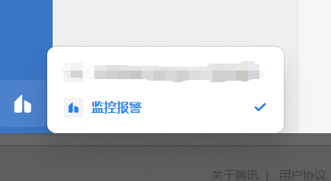

然后点击头像，选择管理企业

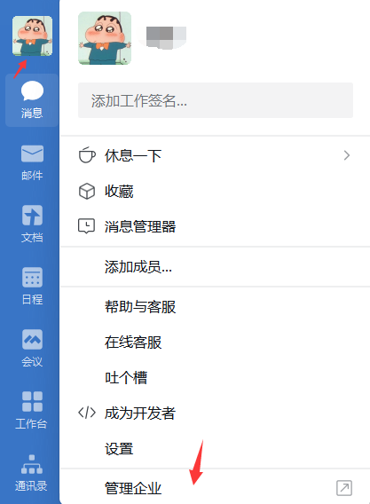

然后点击应用管理，选择创建应用

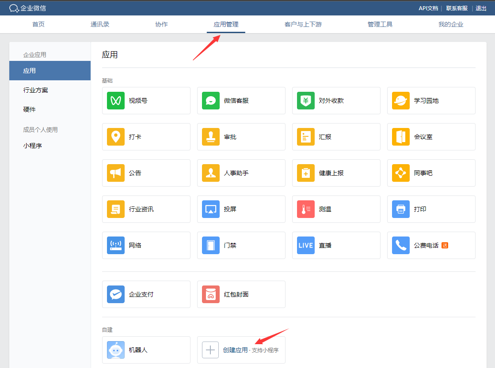

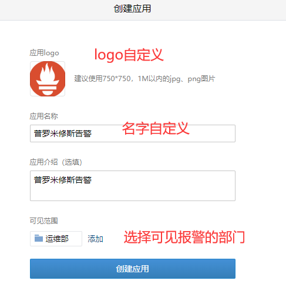

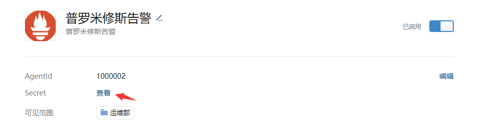

记录AgentId和Secret   

点击我的企业查看企业ID

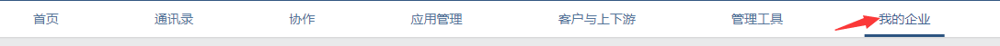

查看组ID

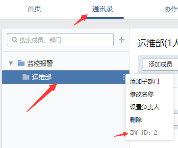

corp_id: 企业微信账号唯一 ID， 可以在我的企业中查看。

to_party: 需要发送的组(部门)。 可以在通讯录中查看

agent_id: 第三方企业应用的 ID 

api_secret: 第三方企业应用的密钥

企业id wwa9fa8a0ab8180c78

to_party 1

AgentId 1000002  

Secret lm-r9XLt8F4feyDonjDLLufx_dCjhcGr_w9xTHlObvE

然后编辑Alertmanager配置文件

vim alertmanager/alertmanager.yml

\# 定义路由树信息

route:

  group_by: ['alertname']	报警分组依据

  group_wait: 5s	最初即第一次等待多久时间发送一组警报的通知

  group_interval: 5m		在发送新警报前的等待时间

  repeat_interval: 5m		发送重复警报的周期 

  receiver: 'wechat'		发送警报的接收者的名称

receivers:

\- name: 'wechat'	和警报接收者名称一致

  wechat_configs:		企业微信配置

  \- corp_id: 'ww13cdaa9a2fa7e0af'

   to_party: '2'

   agent_id: '1000002'

   api_secret: 'F9LvwErjXM_Dn2IXr_nYEcvhgt1L-cBG9MmYX9QB3LI'

   send_resolved: true

   message: '{{ template "wechat.tmpl" . }}'

inhibit_rules: #抑制规则

  \- source_match: #源标签

​     severity: 'critical'

​    target_match:

​     severity: 'warning'

​    equal: ['alertname', 'dev', 'instance']

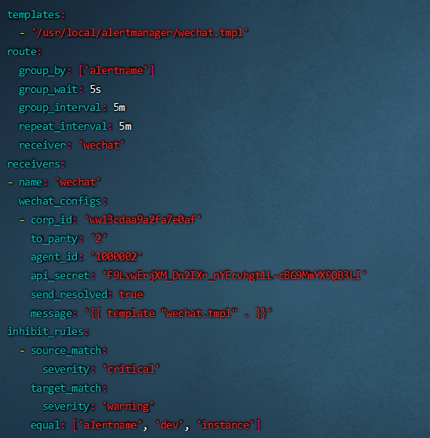

编写配置文件检测语法

./amtool check-config alertmanager.yml

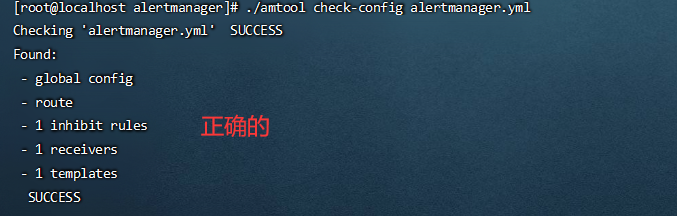

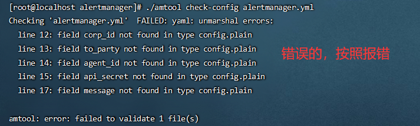

然后重启alertmanager 

systemctl restart alertmanager

systemctl stop node_exporter  停止node

然后发现并没有收到报警！！！经过排查发现

在配企业微信接收报警的时候发现多了一个企业可信ip

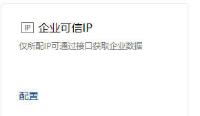

如果不配置这个的话没办法接收告警信息但是配了半天也没配成功，直接上配置流程。

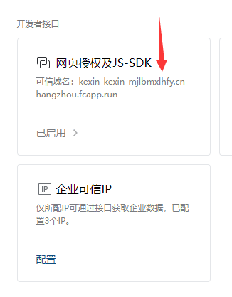

首先点开网页授权及JS-SDK 配置可信域名

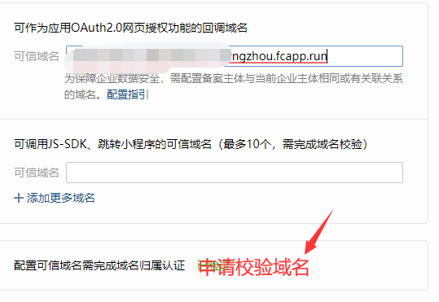

点击申请校验域名后有一条提示 请下载文件WW_verify_z0kAmKeNiJVAwe5c点击下载

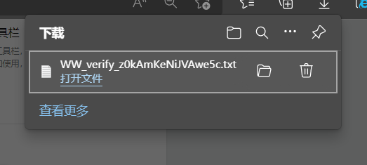

然后来到阿里云官网  搜索函数计算

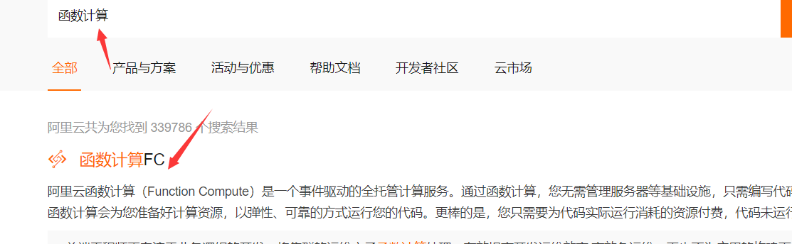

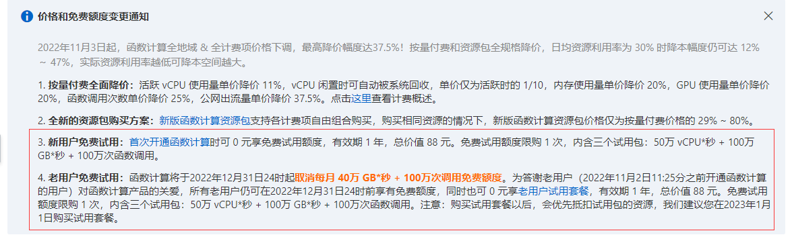

新用户或者老用户都有免费试用，点击开通试用

开通试用后点击任务 然后创建函数

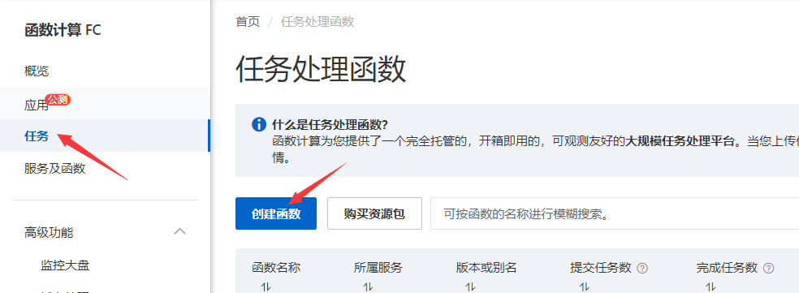

选择试用自定义运行

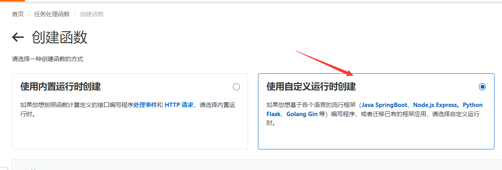

然后

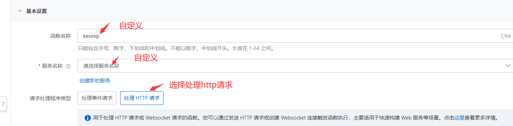

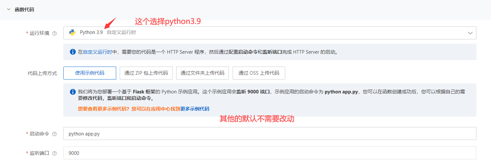

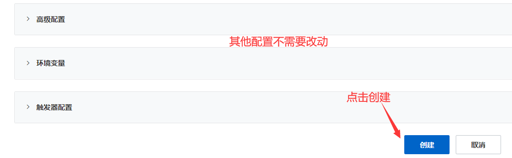

创建完成后会自动跳转到创建的任务

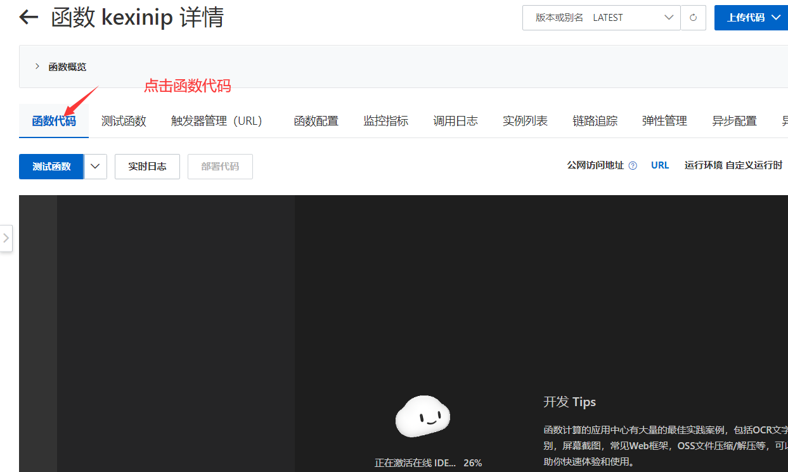

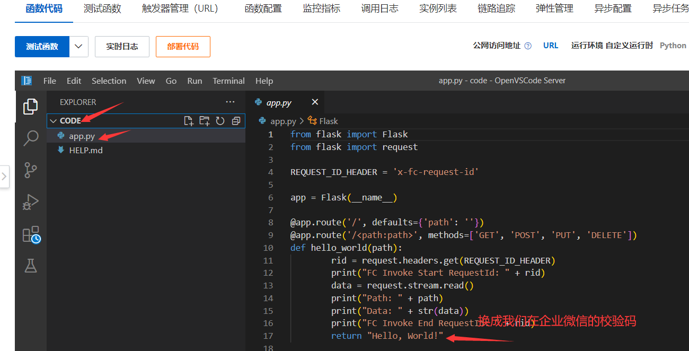

把第十七行的Hello, World!   换成 校验文件中的代码 z0k*****VAwe5c

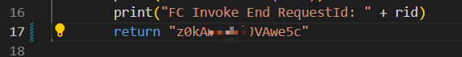

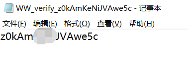

替换好以后点击部署代码

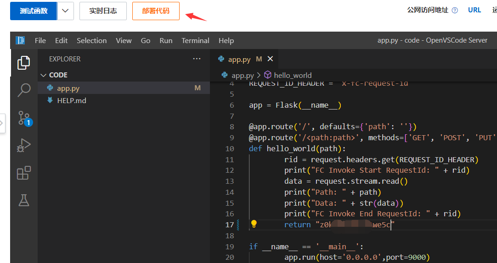

提示部署成功后点击     右侧的URL  然后复制这个链接

最后来到企业微信自建应用管理页面 把复制的链接去掉https的前缀  点击确定即可

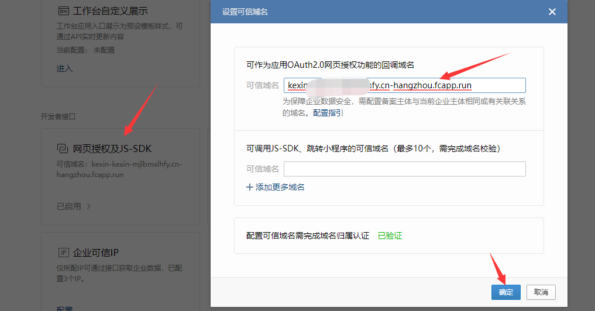

可信域名配好之后就可以配置可信ip了

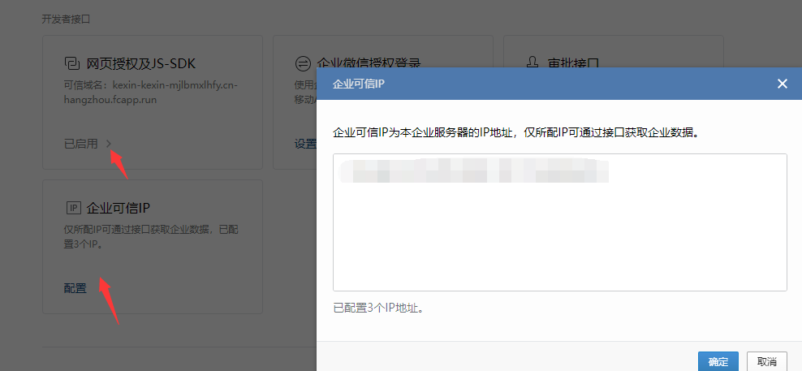

然后测试一下报警功能发现正常了

