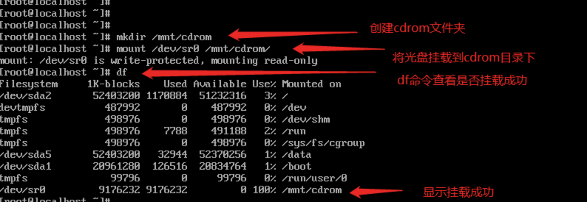
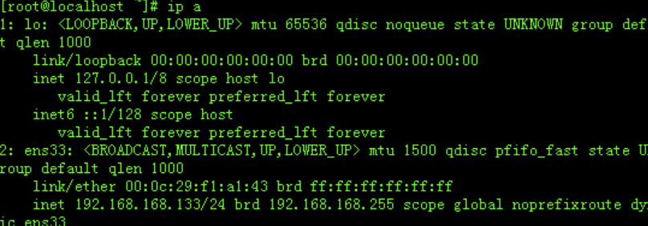

### 搭建企业yum仓库

很多时候不仅仅是一台机器无法上网，而是很多机器都无法上网，但都有联网下载软件的需求,这个时候难道每台机器都挂在光盘吗，当然可以，但如果软件出现了更新又该怎么办。所以我们需要构建一个企业级的 yum 仓库，为多台客户端提供服务。

本地光盘提供基础软件包:Base

yum缓存提供常用软件包: nginx,zabbix,docker

> 首先我们需要搭建本地服务器

> 1、首先在/mnt 目录下创建cdrom文件夹，并且将光盘挂载到此目录下：

> 2、在/etc/yum.repos.d/目录下创建一个名为test.repo的文件，文件后缀必须为.repo，在此文件中填入如图中的格式，完成后保存退出。

> 3、配置好仓库文件后，可以进行软件安装测试，安装一个httpd 服务，出现如图中所示，则可以正常安装软件，说明本地YUM源仓库已将创建成功。

> 4.安装httpd服务，可以将已安装http服务的主机当做服务器，制作成其他主机的YUM仓库服务器，服务安装完成后需启动服务，并将服务设置成开机启动.

> 5、输入ip a 命令查看本地网卡ens33的ip地址为192.168.168.133，打开浏览器，在浏览器中输入192.168.168.133 ，如果可以打开如下图的网页，则说明ftp服务启动成功（如显示打开失败，则输入iptables -F 清除防火墙规则，清除后即可打开）。

> 6、在http服务的家目录下创建相关yum源的目录，并将光盘挂载到此目录下，在浏览器地址栏中输入http://192.168.168.133/centos/ ，就可以看见创建的文件夹及挂载的光盘

> 7、重新开启一台新的centos7 系统，在新开的系统中配置好YUM仓库的客户端，服务地址指向YUM服务器地址，其中$releasever 和$basearch为两个变量，防止yum服务器中的版本号改变导致yum客户端无法正常访问服务器。

> 8、配置完成后可以安装软件测试YUM仓库是否可以正常连接。到此yum仓库就已经创建完毕。

