# 前言

# 一.MySQL8.0Mic高可用

```shell
mysql8.0作为一款新产品，其内置的mysq-innodb-cluster（MIC）高可用集群的技术确实惊艳，结合MySQLshell能够实施集群的快速部署，MySQL-router能够实现灾备快速切换，内置读写分离技术，负载均衡技术

MySQL Router接受前端应用程序请求后，根据不同的端口来区分读写，

把连接读写端口的所有写和查询发往主库，把连接只读端口的查询以轮询方式发往多个从库，从而实现读写分离的目的。

读写返回的结果会交给MySQL Router,由MySQL Router返回给客户端的应用程序
```

Mic三个组件：

```shell
**MySQL Shell：通过内置的管理API创建及管理集群。**
**MySQL Router：路由转发中间件，提供透明切换与读写分离能力。**
**MySQL Group Replication：底层的数据同步集群(MGR)，提供容错、故障恢复与弹性扩展
```

## 环境准备

关闭防火墙和seLinux

| 名称         | IP             |
| ------------ | -------------- |
| Mysql-master | 192.168.25.143 |
| Mysql-slave1 | 192.168.25.132 |
| Mysql-slave2 | 192.168.25.133 |

**准备工具****压缩包**

mysql-router-8.0.27-linux-glibc2.12-x86_64.tar.xz

mysql-shell-8.0.27-linux-glibc2.12-x86-64bit.tar.gz

## 利用mysql-shell搭建集群

**用****root用户分别在三台数据库上建用户并授权**

**使用时注意更改用户名和密码**

```shell
create user wcy identified by 'Wangchenyang@123';

GRANT BACKUP_ADMIN, CLONE_ADMIN, CREATE USER, EXECUTE, FILE, PERSIST_RO_VARIABLES_ADMIN, PROCESS, RELOAD, REPLICATION CLIENT, REPLICATION SLAVE, SELECT, SHUTDOWN, SUPER, SYSTEM_VARIABLES_ADMIN ON *.* TO 'wcy'@'%' WITH GRANT OPTION;

GRANT DELETE, INSERT, UPDATE ON mysql.* TO 'wcy'@'%' WITH GRANT OPTION;

GRANT ALTER, ALTER ROUTINE, CREATE, CREATE ROUTINE, CREATE TEMPORARY TABLES, CREATE VIEW, DELETE, DROP, EVENT, EXECUTE, INDEX, INSERT, LOCK TABLES, REFERENCES, SHOW VIEW, TRIGGER, UPDATE ON mysql_innodb_cluster_metadata.* TO 'wcy'@'%' WITH GRANT OPTION;

GRANT ALTER, ALTER ROUTINE, CREATE, CREATE ROUTINE, CREATE TEMPORARY TABLES, CREATE VIEW, DELETE, DROP, EVENT, EXECUTE, INDEX, INSERT, LOCK TABLES, REFERENCES, SHOW VIEW, TRIGGER, UPDATE ON mysql_innodb_cluster_metadata_bkp.* TO 'wcy'@'%' WITH GRANT OPTION;

GRANT ALTER, ALTER ROUTINE, CREATE, CREATE ROUTINE, CREATE TEMPORARY TABLES, CREATE VIEW, DELETE, DROP, EVENT, EXECUTE, INDEX, INSERT, LOCK TABLES, REFERENCES, SHOW VIEW, TRIGGER, UPDATE ON mysql_innodb_cluster_metadata_previous.* TO 'wcy'@'%' WITH GRANT OPTION;

grant all on *.* to 'wcy'@'%';

grant all privileges on *.* to wcy with grant option;

flush privileges;
```

```shell
#解压shell二进制文件
[root@localhost]# tar -xvf mysql-shell-8.0.27-linux-glibc2.12-x86-64bit.tar.gz
[root@localhost ~]# cd mysql-shell-8.0.27-linux-glibc2.12-x86-64bit/
[root@localhost mysql-shell-8.0.27-linux-glibc2.12-x86-64bit]# ls
bin  lib  share
[root@localhost mysql-shell-8.0.27-linux-glibc2.12-x86-64bit]# cd bin/
[root@localhost bin]# ls
mysql-secret-store-login-path  mysqlsh
[root@localhost bin]# ./mysqlsh 
	MySQL Shell 8.0.27

	Copyright (c) 2016, 2021, Oracle and/or its affiliates.
	Oracle is a registered trademark of Oracle Corporation and/or its affiliates.
	Other names may be trademarks of their respective owners.

	Type '\help' or '\?' for help; '\quit' to exit

```

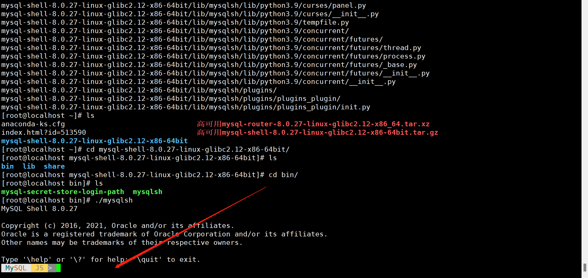

```shell
###连接192.168.25.143（连master）
###\c wcy@192.168.25.143:3306
###输入上面授权密码
MySQL  JS > \c wcy@192.168.25.143:3306
```

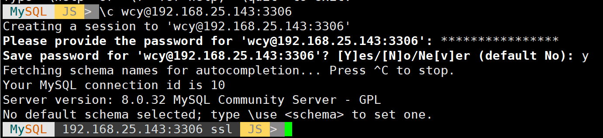

```shell
###检查配置信息
MySQL  192.168.25.143:3306 ssl  JS > dba.checkInstanceConfiguration()
```

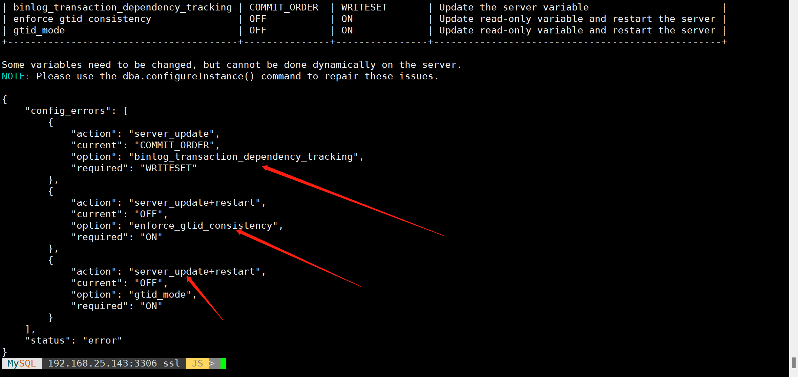

```shell
###确保集群内有三台机器
###配置持久化，用于集群管理，
MySQL  192.168.25.143:3306 ssl  JS > dba.configureInstance('wcy@192.168.25.143:3306')
MySQL  192.168.25.143:3306 ssl  JS > dba.configureInstance('wcy@192.168.25.132:3306')
MySQL  192.168.25.143:3306 ssl  JS > dba.configureInstance('wcy@192.168.25.133:3306')
```

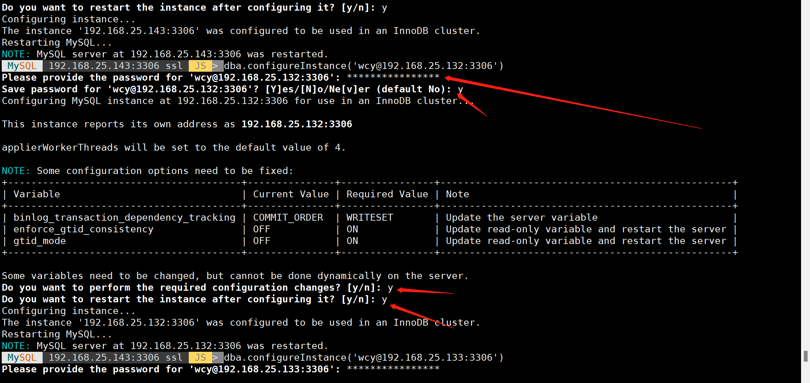

## 创建一个mysqlcluster的集群

```shell
#名字可自定义（三台服务器都需要是空白的）
 MySQL  192.168.25.143:3306 ssl  JS > var cluster=dba.createCluster('mysqlcluster');
```

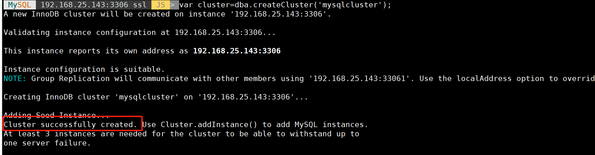

```shell
#查看集群信息
 MySQL  192.168.25.143:3306 ssl  JS > cluster.status()
# MySQL  192.168.25.143:3306 ssl  JS > 如果退出这个状态就要用一下查看集群信息
 MySQL  192.168.25.143:3306 ssl  JS > dba.getCluster().status()
```

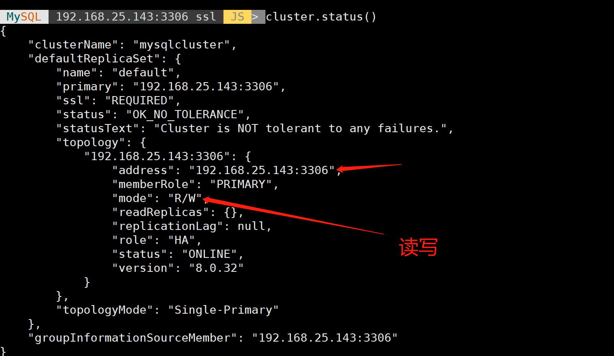

## 从机加入集群

```shell
 ###两台从机加入集群
 MySQL  192.168.25.143:3306 ssl  JS > cluster.addInstance('wcy@192.168.25.132:3306')
 MySQL  192.168.25.143:3306 ssl  JS > cluster.addInstance('wcy@192.168.25.133:3306')
 # 192.168.25.143:3306 ssl  JS > 如果退出这个状态就要用一下加入集群
 var cluster=dba.getCluster();cluster.addInstance('wcy@192.168.25.133:3306')
###添加实例过程中，会通过clone方式将11上的数据clone到10上，clone之后会重启10上的mysql。
###如果添加过程中添加失败，可以 执行cluster.rescan()重新扫描加入集群
###实例添加完成后，查看进行信息 
MySQL  192.168.25.143:3306 ssl  JS > cluster.status()
```


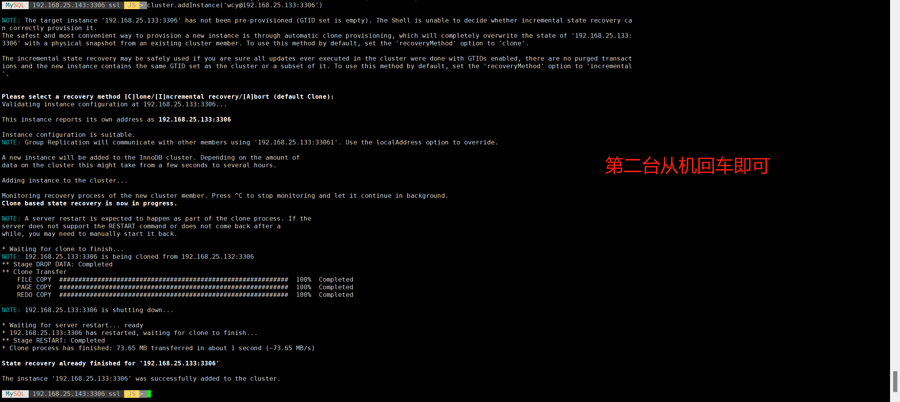


完成集群

# 二.利用mysql-router做故障恢复

```shell
###解压事先准备的包，故障恢复的工具
[root@localhost ~]# tar -xvf mysql-router-8.0.27-linux-glibc2.12-x86_64.tar.xz
[root@localhost ~]# cd mysql-router-8.0.27-linux-glibc2.12-x86_64/
[root@localhost mysql-router-8.0.27-linux-glibc2.12-x86_64]# ls
bin  lib  LICENSE.router  man  README.router  share
[root@localhost mysql-router-8.0.27-linux-glibc2.12-x86_64]# cd bin/
[root@localhost bin]# ls
mysqlrouter  mysqlrouter_keyring  mysqlrouter_passwd  mysqlrouter_plugin_info
[root@localhost ~]# ./mysqlrouter --bootstrap wcy@192.168.25.143:3306 --user=root
```

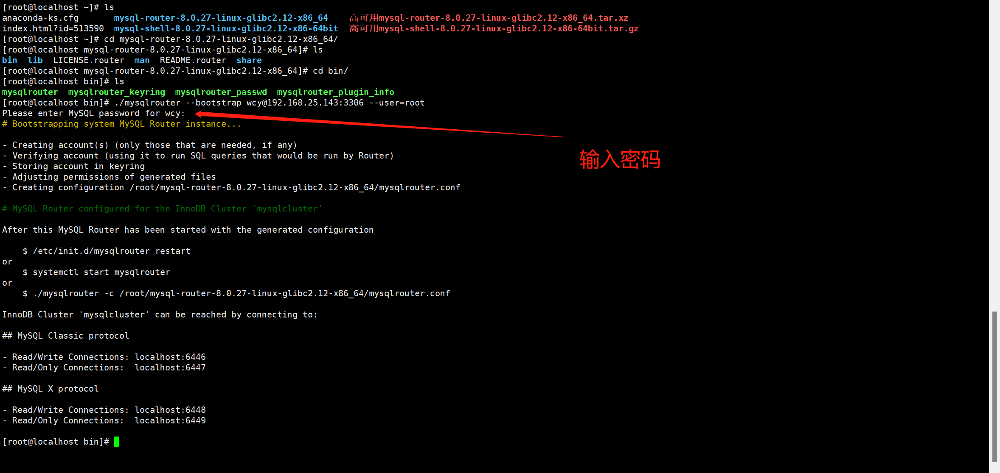

```shell
[root@localhost bin]# cd ..
[root@localhost mysql-router-8.0.27-linux-glibc2.12-x86_64]# ls
bin  lib  LICENSE.router  man  mysqlrouter.conf  mysqlrouter.key  mysqlrouter.log  README.router  share  var
[root@localhost mysql-router-8.0.27-linux-glibc2.12-x86_64]# vim mysqlrouter.conf

[metadata_cache:mysqlcluster]
bootstrap_server_addresses=mysql://192.168.25.143:3306,mysql://192.168.25.132:3306,mysql://192.168.25.133:3306

##保存退出
```

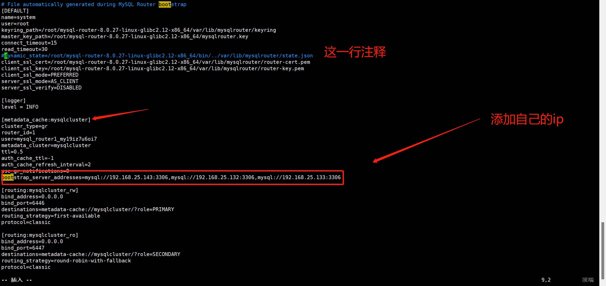

```shell
[root@localhost bin] ./mysqlrouter -c ../mysqlrouter.conf &      #-c  指定配置文件启动
[1] 12381
[root@localhost bin]# logging facility initialized, switching logging to loggers specified in configuration

[root@localhost bin]# netstat -lntp
Active Internet connections (only servers)
Proto Recv-Q Send-Q Local Address           Foreign Address         State       PID/Program name    
tcp        0      0 127.0.0.1:25            0.0.0.0:*               LISTEN      10137/master        
tcp        0      0 0.0.0.0:8443            0.0.0.0:*               LISTEN      12381/./mysqlrouter 
tcp        0      0 0.0.0.0:6446            0.0.0.0:*               LISTEN      12381/./mysqlrouter 
tcp        0      0 0.0.0.0:6447            0.0.0.0:*               LISTEN      12381/./mysqlrouter 
tcp        0      0 0.0.0.0:6448            0.0.0.0:*               LISTEN      12381/./mysqlrouter 
tcp        0      0 0.0.0.0:6449            0.0.0.0:*               LISTEN      12381/./mysqlrouter 
tcp        0      0 0.0.0.0:22              0.0.0.0:*               LISTEN      1150/sshd           
tcp6       0      0 ::1:25                  :::*                    LISTEN      10137/master        
tcp6       0      0 :::33060                :::*                    LISTEN      11993/mysqld        
tcp6       0      0 :::33061                :::*                    LISTEN      11993/mysqld        
tcp6       0      0 :::3306                 :::*                    LISTEN      11993/mysqld        
tcp6       0      0 :::22                   :::*                    LISTEN      1150/sshd 


######
默认6446端口为提供服务端口，可以修改mysqlrouter.conf修改
对外提供的mysql访问地址：mysqlrouter所在的ip:6446
例如：mysql -uwcy -p"Wangchenyang@123" -h 192.168.25.143 -P 6446  这个交给开发人员使用
```

## 故障测试

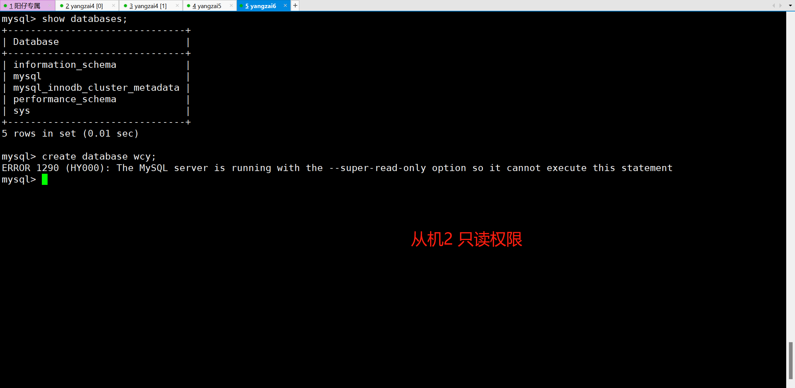

```shell
#停到主机进行测试
[root@localhost bin]# systemctl stop mysqld
[root@localhost bin]# ./mysqlsh 

#登录没被停掉的从机查看集群状态
MySQL  JS > \c wcy@192.168.25.132:3306
Creating a session to 'wcy@192.168.25.132:3306'
MySQL  192.168.25.132:3306 ssl  JS > dba.getCluster().status()
```

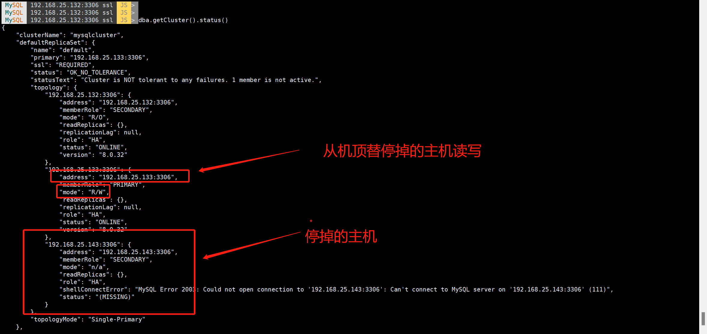

```shell
#恢复主机
[root@localhost bin]# systemctl start mysqld
MySQL  192.168.25.132:3306 ssl  JS > dba.getCluster().status()
```

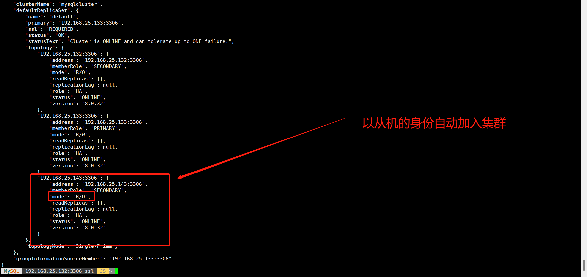

# 总结

Mysql8.0MIC高可用技术，不仅实现了数据库的读写分离，能够实现灾备快速切换，内置读写分离技术，负载均衡技术 ！！！

可谓是牛逼的技术！！！！