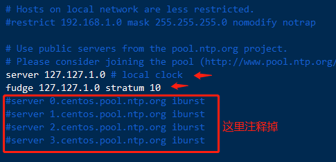
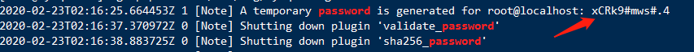
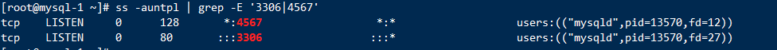
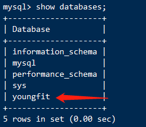
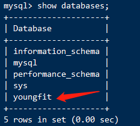

# MySQL Galera集群

### Galera Cluster 介绍


Galera是一个MySQL(也支持MariaDB，Percona)的同步多主集群软件。


主要功能
同步复制
Active-active的多主拓扑结构
真正的multi-master，即所有节点可以同时读写数据库
自动成员资格控制，失败节点从群集中删除
新节点加入数据自动复制
真正的并行复制，行级


```shell
项目，4台虚拟机
一定要固定ip地址
准备环境：
主机解析：
[root@mysql-1 ~]# cat /etc/hosts
127.0.0.1   localhost localhost.localdomain localhost4 localhost4.localdomain4
::1         localhost localhost.localdomain localhost6 localhost6.localdomain6
192.168.62.131 galera1 
192.168.62.231 galera2
192.168.62.168 galera3
192.168.62.166 galera4
```


分别修改主机名称：


```shell
[root@localhost ~] hostnamectl set-hostname mysql-1
[root@localhost ~] hostnamectl set-hostname mysql-2
[root@localhost ~] hostnamectl set-hostname mysql-3
[root@localhost ~] hostnamectl set-hostname mysql-4
```


所有机器关闭防火墙和selinux:


```shell
# setenforce 0 && systemctl stop firewalld
```


时间同步：
所有机器修改时区：


```shell
# ln -sf /usr/share/zoneinfo/Asia/Shanghai /etc/localtime
```


准备时间服务器：


galera1上操作


```shell
[root@mysql-1 ~]# yum -y install ntp		//时间服务
[root@mysql-1 ~]# vim /etc/ntp.conf			//将下面两行添加进去	
server 127.127.1.0 # local clock
fudge 127.127.1.0 stratum 10
```





```shell
[root@mysql-1 ~]# systemctl restart ntpd
[root@mysql-1 ~]# systemctl status ntpd
```


其余3台客户端同步时间：


```shell
[root@galera2 ~]# yum -y install ntp
[root@galera2 ~]# ntpdate galera1
```


下载和安装Galera（每台都需要安装）
注意：Galera有独立的补丁包，也有在mysql基础上打好补丁的完整包
我们要下载带wsrep扩展补丁的版本，比如：
MySQL 5.7.20 extended with wsrep patch version 25.13


所以：删除原版本mysql:


```shell
[root@mysql-1 yum.repos.d]# yum erase `rpm -qa | grep mysql` -y
```


根据官方下载提示找到下载路径，发现下载路径下是已经做好yum源的路径，所以可以直接修改yum配置文件使用yum安装


配置yum源：


```shell
[root@mysql-1 yum.repos.d]# yum -y install epel-release
[root@mysql-1 yum.repos.d]# cat galera.repo
[galera]
name=galera
baseurl=http://releases.galeracluster.com/mysql-wsrep-5.7/centos/7/x86_64/
enabled=1
gpgcheck=0

[root@mysql-1 yum.repos.d]# yum list | grep 'galera'
galera.x86_64 25.3.12-2.el7 epel
mysql-wsrep-5.7.x86_64 5.7.20-25.13.el7 galera
mysql-wsrep-client-5.7.x86_64 5.7.20-25.13.el7 galera
mysql-wsrep-common-5.7.x86_64 5.7.20-25.13.el7 galera
mysql-wsrep-devel-5.7.x86_64 5.7.20-25.13.el7 galera
mysql-wsrep-libs-5.7.x86_64 5.7.20-25.13.el7 galera
mysql-wsrep-libs-compat-5.7.x86_64 5.7.20-25.13.el7 galera
mysql-wsrep-server-5.7.x86_64 5.7.20-25.13.el7 galera
mysql-wsrep-test-5.7.x86_64 5.7.20-25.13.el7 galera
注意：需要epel源提供galera包
```


安装：


```shell
[root@mysql-1 yum.repos.d]# yum install mysql-wsrep-5.7.x86_64 galera rsync -y
```


4台全部启动：


```shell
[root@mysql-1 ~]# systemctl start mysqld
[root@mysql-1 ~]# grep password /var/log/mysqld.log
```





```shell
[root@mysql-1 ~]# mysqladmin -u root -p'xCRk9#mws#.4' password 'Qianfeng123!'
4台分别创建同步数据的用户
[root@mysql-1 ~]# mysql -u root -p'Qianfeng123!'
mysql> grant all on *.* to 'syncuser'@'%' identified by 'Qianfeng123!@';
mysql> flush privileges;
```


```shell
配置Galera Replication:
galera1配置：主配置文件/etc/my.cnf追加如下内容
server-id=1
binlog_format=row
innodb_file_per_table=1
innodb_autoinc_lock_mode=2

wsrep_on=ON
wsrep_provider=/usr/lib64/galera/libgalera_smm.so
wsrep_cluster_name='galera'
wsrep_cluster_address='gcomm://'
wsrep_node_name='galera1'
wsrep_node_address='192.168.245.133'
wsrep_sst_auth=syncuser:'Qianfeng123!@'
wsrep_sst_method=rsync


galera2配置：主配置文件my.cnf追加如下内容
server-id=2
binlog_format=row
innodb_file_per_table=1
innodb_autoinc_lock_mode=2

wsrep_on=ON
wsrep_provider=/usr/lib64/galera/libgalera_smm.so
wsrep_cluster_name='galera'
wsrep_cluster_address='gcomm://galera1,galera3,galera4'
wsrep_node_name='galera2'
wsrep_node_address='192.168.245.136'
wsrep_sst_auth=syncuser:'Qianfeng123!@'
wsrep_sst_method=rsync

galera3配置：主配置文件my.cnf追加如下内容
server-id=3
binlog_format=row
innodb_file_per_table=1
innodb_autoinc_lock_mode=2

wsrep_on=ON
wsrep_provider=/usr/lib64/galera/libgalera_smm.so
wsrep_cluster_name='galera'
wsrep_cluster_address='gcomm://galera1,galera2,galera4'
wsrep_node_name='galera3'
wsrep_node_address='192.168.245.10'
wsrep_sst_auth=syncuser:'Qianfeng123!@'
wsrep_sst_method=rsync

galera4配置：主配置文件my.cnf追加如下内容
server-id=4
binlog_format=row
innodb_file_per_table=1
innodb_autoinc_lock_mode=2

wsrep_on=ON
wsrep_provider=/usr/lib64/galera/libgalera_smm.so
wsrep_cluster_name='galera'
wsrep_cluster_address='gcomm://galera1,galera2,galera3'
wsrep_node_name='galera4'
wsrep_node_address='192.168.245.135'
wsrep_sst_auth=syncuser:'Qianfeng123!@'
wsrep_sst_method=rsync
```


重启服务：每台机器


```shell
[root@mysql-1 ~]# systemctl restart mysqld
```


查看端口：galera端口4567 mysql端口3306


```shell
[root@mysql-1 ~]# ss -auntpl | grep -E '3306|4567'
```





测试：


在任何一台机器上写入数据，其他机器全部会同步


```shell
[root@mysql-1 ~]# mysql -u root -p'Qianfeng123!'
mysql> create database youngfit;
[root@mysql-2 ~]# mysql -u root -p'Qianfeng123!'
mysql> show databases;
```





```shell
[root@mysql-3 ~]# mysql -u root -p'Qianfeng123!'
mysql> show databases;
```





```shell
[root@mysql-4 ~]# mysql -u root -p'Qianfeng123!'
mysql> show databases;
```


