# MySQL事务隔离级别

## Mysql 事务

MySQL 事务主要用于处理操作量大，复杂度高的数据。比如说，在人员管理系统中，你删除一个人员，你既需要删除人员的基本资料，也要删除和该人员相关的信息，如信箱，文章等等，这样，这些数据库操作语句就构成一个事务！

- 在 MySQL 中只有使用了 Innodb 数据库引擎的数据库或表才支持事务。
- 事务处理可以用来维护数据库的完整性，保证成批的 SQL 语句要么全部执行，要么全部不执行。
- 事务用来管理 insert,update,delete 语句

### **一、事务的基本要素（ACID）**


一般来说，事务是必须满足4个条件（ACID）：：原子性（**A**tomicity，或称不可分割性）、一致性（**C**onsistency）、隔离性（**I**solation，隔离性）、持久性（**D**urability）。

#### **原子性**

一个事务（transaction）中的所有操作，要么全部完成，要么全部不完成，不会结束在中间某个环节。事务在执行过程中发生错误，会被回滚（Rollback）到事务开始前的状态，就像这个事务从来没有执行过一样。

#### **一致性**

在事务开始之前和事务结束以后，数据库的完整性没有被破坏。这表示写入的资料必须完全符合所有的预设规则，这包含资料的精确度、串联性以及后续数据库可以自发性地完成预定的工作。

#### **隔离性**

数据库允许多个并发事务同时对其数据进行读写和修改的能力，隔离性可以防止多个事务并发执行时由于交叉执行而导致数据的不一致。事务隔离分为不同级别，包括读未提交（Read uncommitted）、读提交（read committed）、可重复读（repeatable read）和串行化（Serializable）。

#### **持久性**

事务处理结束后，对数据的修改就是永久的，即便系统故障也不会丢失；

### **二、事务的并发问题**

#### **脏读/脏数据**

事务A读取了事务B更新的数据，然后B回滚操作，那么A读取到的数据是脏数据

#### **不可重复读**

事务 A 多次读取同一数据，事务 B 在事务A多次读取的过程中，对数据作了更新并提交，导致事务A多次读取同一数据时，结果 不一致。

#### **幻读**

系统管理员A将数据库中所有学生的成绩从具体分数改为ABCDE等级，但是系统管理员B就在这个时候插入了一条具体分数的记录，当系统管理员A改结束后发现还有一条记录没有改过来，就好像发生了幻觉一样，这就叫幻读。

总结：不可重复读的和幻读很容易混淆，不可重复读侧重于修改，幻读侧重于新增或删除。解决不可重复读的问题只需锁住满足条件的行，解决幻读需要锁表

### 三、MySQL事务隔离级别

| 事务隔离级别                 | 脏读 | 不可重复读 | 幻读 |
| ---------------------------- | ---- | ---------- | ---- |
| 读未提交（read-uncommitted） | 是   | 是         | 是   |
| 不可重复读（read-committed） | 否   | 是         | 是   |
| 可重复读（repeatable-read）  | 否   | 否         | 是   |
| 串行化（serializable）       | 否   | 否         | 否   |


#### 查看事务隔离级别

Mysql默认的事务隔离级别为repeatable-read


1.查看当前会话Mysql事务隔离级别：

```plain
mysql> select @@tx_isolation;
+-----------------+
| @@tx_isolation  |
+-----------------+
| REPEATABLE-READ |
+-----------------+
1 row in set, 1 warning (0.00 sec)
```


2.查看系统当前隔离级别

```plain
mysql> select @@global.tx_isolation;
+-----------------------+
| @@global.tx_isolation |
+-----------------------+
| REPEATABLE-READ       |
+-----------------------+
1 row in set, 1 warning (0.00 sec)
```


#### 设置事务隔离级别


1.设置当前会话隔离级别

```plain
mysql> set session transaction isolation level repeatable read;
Query OK, 0 rows affected (0.00 sec)
```


2.设置系统当前隔离级别

```plain
mysql> set global transaction isolation level repeatable read;
Query OK, 0 rows affected (0.00 sec)
```


3.手动提交事务

```plain
mysql> commit;
```

#### 用案例说明各个隔离级别的情况

#### 提前准备测试数据

```plain
mysql> create database school;         #创建1个库
Query OK, 1 row affected (0.00 sec)

mysql> create table school.student(id int(10),name varchar(20), age int(3)); #在库下创建1个表
Query OK, 0 rows affected (0.18 sec)

#插入一些数据
mysql> insert into  school.student values('100',"孙悟空",'200');  
Query OK, 1 row affected (0.00 sec)

mysql> insert into  school.student values('101',"猪八戒",'250');
Query OK, 1 row affected (0.00 sec)

mysql> insert into  school.student values('102',"唐僧",'300');
Query OK, 1 row affected (0.00 sec)

mysql> select *  from school.student;
+------+-----------+------+
| id   | name      | age  |
+------+-----------+------+
|  100 | 孙悟空    |  200 |
|  101 | 猪八戒    |  250 |
|  102 | 唐僧      |  300 |
+------+-----------+------+
3 rows in set (0.00 sec)
```


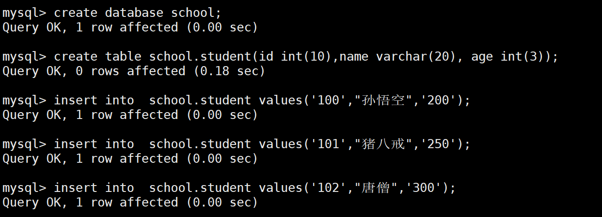


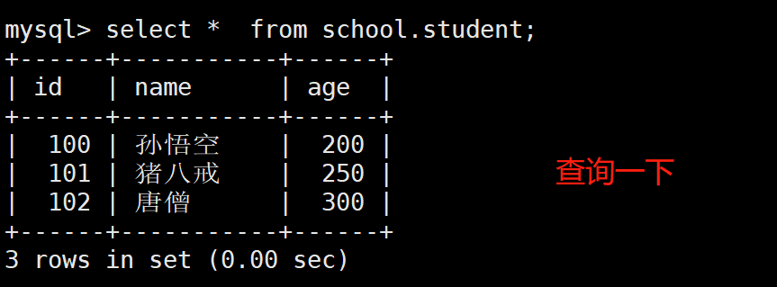


准备两个客户端连接，比作两个连接数据库的程序；


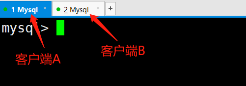


#### 1、读未提交：

（1）打开一个客户端A，并设置当前事务模式为read uncommitted（读未提交），查询表age的初始值：


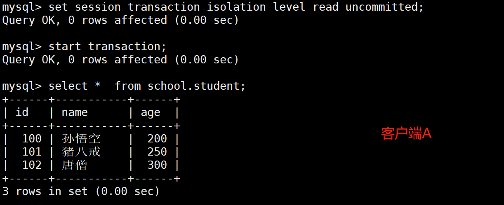


```plain
mysql> set session transaction isolation level read uncommitted;
Query OK, 0 rows affected (0.00 sec)

mysql> start transaction;
Query OK, 0 rows affected (0.00 sec)

mysql> select *  from school.student;
+------+-----------+------+
| id   | name      | age  |
+------+-----------+------+
|  100 | 孙悟空    |  200 |
|  101 | 猪八戒    |  250 |
|  102 | 唐僧      |  300 |
+------+-----------+------+
3 rows in set (0.00 sec)
```


（2）在客户端A的事务提交之前，打开另一个客户端B，更新表student：

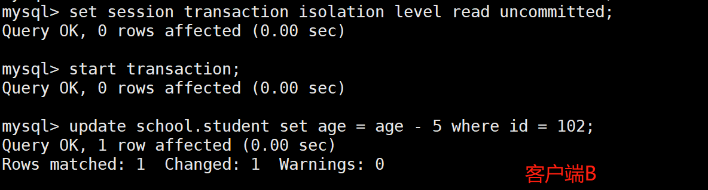


```plain
mysql> set session transaction isolation level read uncommitted;
Query OK, 0 rows affected (0.00 sec)

mysql> start transaction;
Query OK, 0 rows affected (0.00 sec)

mysql> update school.student set age = age - 5 where id = 102;
Query OK, 1 row affected (0.00 sec)
Rows matched: 1  Changed: 1  Warnings: 0

mysql> select * from school.student;
+------+-----------+------+
| id   | name      | age  |
+------+-----------+------+
|  100 | 孙悟空    |  200 |
|  101 | 猪八戒    |  250 |
|  102 | 唐僧      |  295 |
+------+-----------+------+
3 rows in set (0.00 sec)
```


（3）这时，虽然客户端B的事务还没提交，但是客户端A就可以查询到B已经更新的数据：

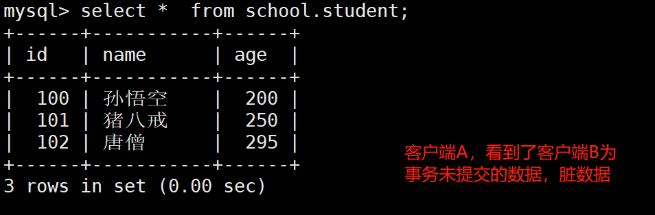


```plain
mysql> select *  from school.student;
+------+-----------+------+
| id   | name      | age  |
+------+-----------+------+
|  100 | 孙悟空    |  200 |
|  101 | 猪八戒    |  250 |
|  102 | 唐僧      |  295 |
+------+-----------+------+
3 rows in set (0.00 sec)
```


（4）一旦客户端B的事务因为某种原因回滚，所有的操作都将会被撤销，那刚才客户端A查询到的数据其实就是脏数据：


注意：撤销成功之后，唐僧的age仍是300；


```plain
mysql> rollback;
```


（5）在客户端A执行更新语句update school.student set age = age - 5 where id = 102;，唐僧的age没有变成290，居然是295，是不是很奇怪，数据不一致啊，如果你这么想就太天真 了，在应用程序中，我们会用295-5=290，并不知道其他会话回滚了，要想解决这个问题可以采用读已提交的隔离级别


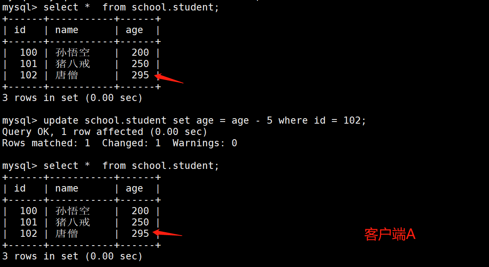


```plain
mysql> update school.student set age = age - 5 where id = 102;
Query OK, 1 row affected (0.00 sec)
Rows matched: 1  Changed: 1  Warnings: 0

mysql> select *  from school.student;
+------+-----------+------+
| id   | name      | age  |
+------+-----------+------+
|  100 | 孙悟空    |  200 |
|  101 | 猪八戒    |  250 |
|  102 | 唐僧      |  295 |
+------+-----------+------+
3 rows in set (0.00 sec)
```


#### 2、读已提交


可解决“脏读”的问题；


（1）打开一个客户端A，并设置当前事务模式为read committed（未提交读），查询表student的所有记录：


（2）在客户端A的事务提交之前，打开另一个客户端B，更新表student：

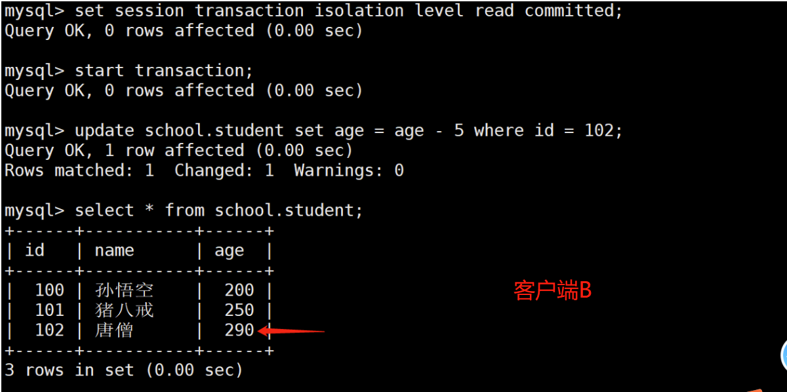


（3）这时，客户端B的事务还没提交，客户端A不能查询到B已经更新的数据，解决了脏读问题：

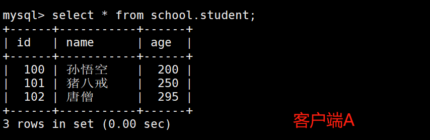


（4）客户端B的事务提交


（5）客户端A执行与上一步相同的查询，结果 与上一步不一致，即产生了不可重复读的问题

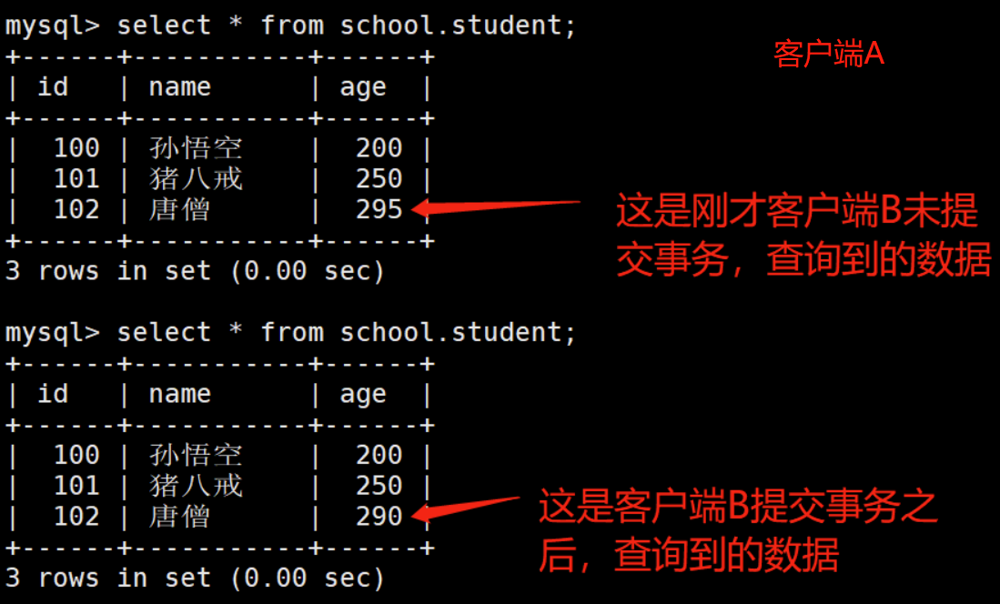


#### 3、可重复读

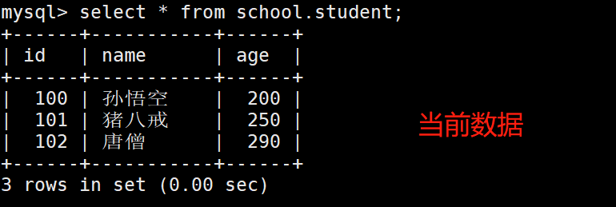


（1）打开一个客户端A，并设置当前事务模式为repeatable read，查询表student的所有记录

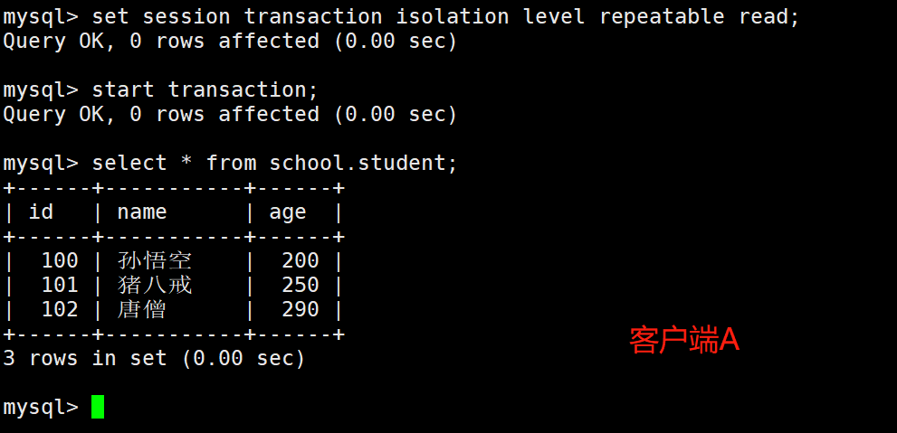


（2）在客户端A的事务提交之前，打开另一个客户端B，更新表student并提交

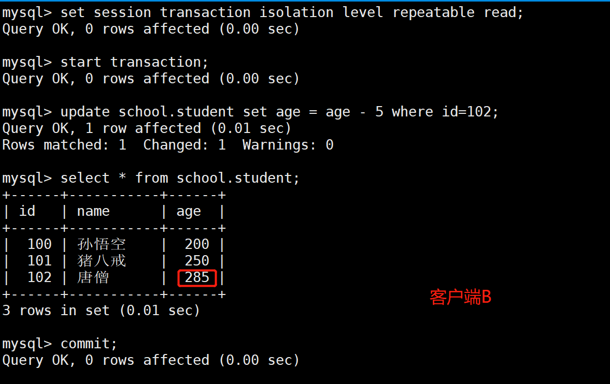


（3）在客户端A查询表student的所有记录，与步骤（1）查询结果一致，没有出现不可重复读的问题


（4）在客户端A，接着执行update student set age = age - 5 where id = 102;，age没有变成290-5=285，“唐僧”的age值用的是步骤（2）中的285来算的，所以是280，数据的一致性倒是没有被破坏。可重复读的隔离级别下使用了MVCC机制，select操作不会更新版本号，是快照读（历史版本）；insert、update和delete会更新版本号，是当前读（当前版本）。

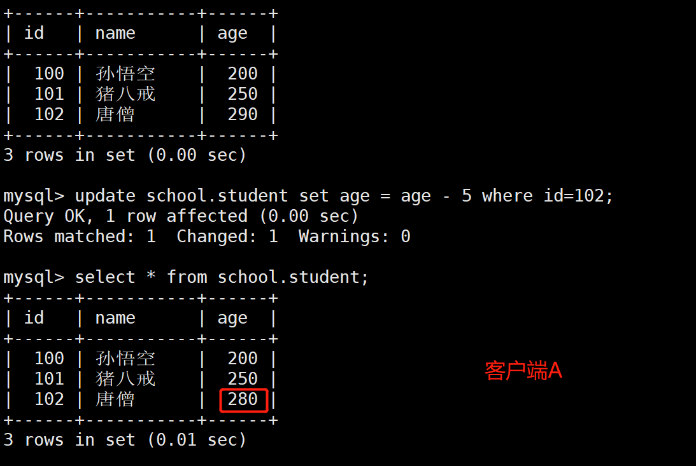


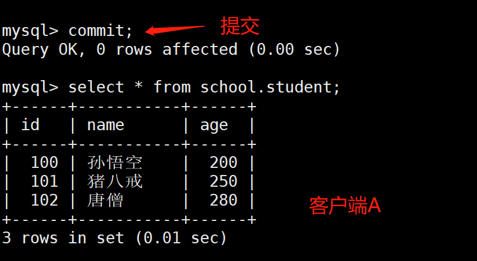


（5）重新打开客户端B，插入一条新数据后提交

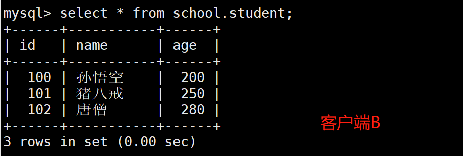


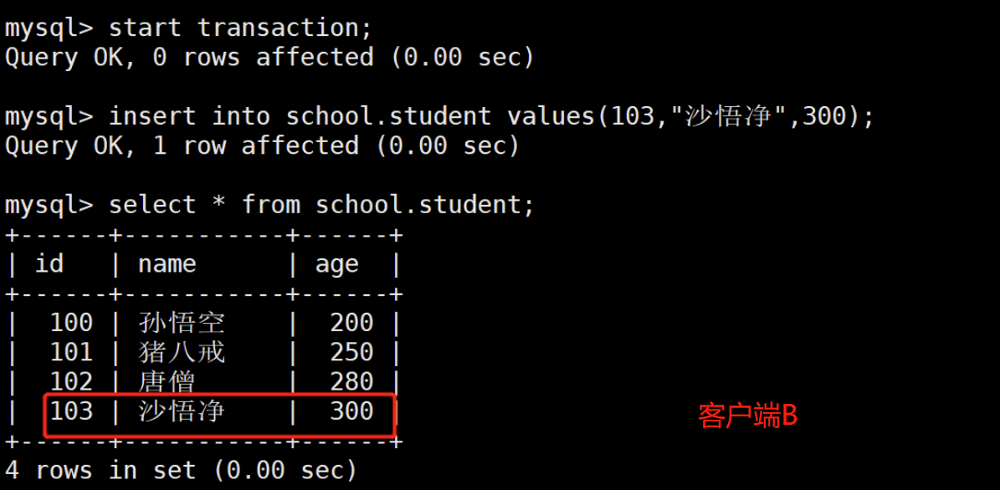


（6）在客户端A查询表account的所有记录，没有 查出 新增数据，所以没有出现幻读


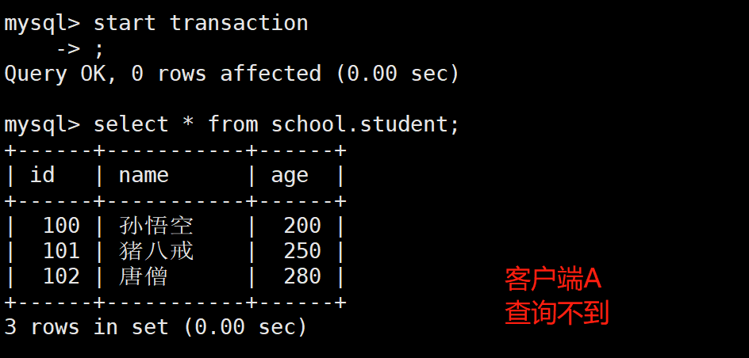