# 编译安装mysql

```shell
步骤：
1、清理安装环境
2、创建mysql用户
3、下载tar包
4、安装编译工具(gcc make .....)
5、创建mysql目录
6、解压
7、编译安装
8、初始化(记录初始密码，修改配置文件[指定安装目录、数据存放的目录])
9、启动mysql
10、登陆mysql
11、修改密码
12、添加环境变量(可做软连接)
13、配置mysql服务的管理工具
```


```shell
#!/bin/bash

# 下载安装包
wget https://dev.mysql.com/get/Downloads/MySQL-5.7/mysql-boost-5.7.27.tar.gz

# 清理安装编译环境
yum erase mariadb mariadb-server mariadb-libs mariadb-devel -y
userdel -r mysql
rm -rf /etc/my*
rm -rf /var/lib/mysql
rm -rf /var/log/mysqld.log
rm -rf /usr/local/mysql

# 创建mysql用户
useradd -r mysql -M -s /sbin/nologin

# 安装编译工具
yum -y install ncurses ncurses-devel openssl-devel bison gcc gcc-c++ make
yum -y install cmake

# 创建mysql目录
mkdir -p /usr/local/{data,mysql,log}

# 解压
tar xzvf mysql-boost-5.7.27.tar.gz -C /usr/local/

# 编译安装
cd /usr/local/mysql-5.7.27/
cmake . \
-DWITH_BOOST=boost/boost_1_59_0/ \
-DCMAKE_INSTALL_PREFIX=/usr/local/mysql \
-DSYSCONFDIR=/etc \
-DMYSQL_DATADIR=/usr/local/mysql/data \
-DINSTALL_MANDIR=/usr/share/man \
-DMYSQL_TCP_PORT=3306 \
-DMYSQL_UNIX_ADDR=/tmp/mysql.sock \
-DDEFAULT_CHARSET=utf8 \
-DEXTRA_CHARSETS=all \
-DDEFAULT_COLLATION=utf8_general_ci \
-DWITH_READLINE=1 \
-DWITH_SSL=system \
-DWITH_EMBEDDED_SERVER=1 \
-DENABLED_LOCAL_INFILE=1 \
-DWITH_INNOBASE_STORAGE_ENGINE=1

make && make install

# 初始化
cd /usr/local/mysql
chown -R mysql.mysql .

./bin/mysqld --initialize --user=mysql --basedir=/usr/local/mysql --datadir=/usr/local/mysql/data &>/password.txt
passwd=$(grep password /password.txt | awk 'NR==1{print $NF}')

cat >/etc/my.cnf<<-EOF
[client]
port = 3306
socket = /tmp/mysql.sock
default-character-set = utf8

[mysqld]
port = 3306
user = mysql
basedir = /usr/local/mysql
datadir = /usr/local/mysql/data
socket = /tmp/mysql.sock
character_set_server = utf8
EOF

# 配置mysqld服务的管理工具
ln -s /usr/local/mysql/bin/mysql /usr/bin
cd /usr/local/mysql/support-files/
cp mysql.server /etc/init.d/mysqld
chkconfig --add mysqld
chkconfig mysqld on
systemctl start mysqld
/usr/local/mysql/bin/mysqladmin -u root -p"$passwd" password '1' && echo "安装成功，密码为1"
```


```shell
关闭防火墙和selinux
编译安装mysql5.7
```

1、清理安装环境

```shell
# yum erase mariadb mariadb-server mariadb-libs mariadb-devel -y
# userdel -r mysql
# rm -rf /etc/my*
# rm -rf /var/lib/mysql
```

2、创建mysql用户

```shell
[root@mysql-server ~]# useradd -r mysql -M -s /bin/false

`useradd` 是一个 Linux 系统下创建用户的命令。下面是对该命令参数的解释：

- `-r` 表示创建系统用户，而非普通用户；
- `mysql` 是新创建的用户的用户名；
- `-M` 表示新用户不要创建家目录；
- `-s /bin/false` 表示该用户的登录 Shell 为 /bin/false，这意味着该用户是一个“虚拟用户”，可以登陆到系统但不能执行任何动作，仅仅作为某个服务的身份使用。
```

3、从官网下载tar包

```shell
[root@mysql-server ~]# wget https://dev.mysql.com/get/Downloads/MySQL-5.7/mysql-boost-5.7.27.tar.gz
```

4、安装编译工具

```shell
# yum -y install ncurses ncurses-devel openssl-devel bison gcc gcc-c++ make
#安装编译工具
# yum -y install cmake        #进行编译安装
```

5、创建mysql目录

```shell
[root@mysql-server ~]# mkdir -p /usr/local/{data,mysql,log}
```

6、解压

```shell
[root@mysql-server ~]# tar xzvf mysql-boost-5.7.27.tar.gz -C /usr/local/
注:如果安装的MySQL5.7及以上的版本，在编译安装之前需要安装boost,因为高版本mysql需要boots库的安装才可以正常运行。否则会报CMake Error at cmake/boost.cmake:81错误
安装包里面自带boost包
Boost库是为C++语言标准库提供扩展的一些C++程序库
```

7、编译安装

```shell
cd 解压的mysql目录
[root@mysql-server ~]# cd /usr/local/mysql-5.7.27/
[root@mysql-server mysql-5.7.27]# cmake . \
-DWITH_BOOST=boost/boost_1_59_0/ \
-DCMAKE_INSTALL_PREFIX=/usr/local/mysql \
-DSYSCONFDIR=/etc \
-DMYSQL_DATADIR=/usr/local/mysql/data \
-DINSTALL_MANDIR=/usr/share/man \
-DMYSQL_TCP_PORT=3306 \
-DMYSQL_UNIX_ADDR=/tmp/mysql.sock \
-DDEFAULT_CHARSET=utf8 \
-DEXTRA_CHARSETS=all \
-DDEFAULT_COLLATION=utf8_general_ci \
-DWITH_READLINE=1 \
-DWITH_SSL=system \
-DWITH_EMBEDDED_SERVER=1 \
-DENABLED_LOCAL_INFILE=1 \
-DWITH_INNOBASE_STORAGE_ENGINE=1

提示：boost也可以使用如下指令自动下载，如果不下载bost压缩包，把下面的这一条添加到配置中第二行
-DDOWNLOAD_BOOST=1/
参数详解:
-DCMAKE_INSTALL_PREFIX=/usr/local/mysql \   安装目录
-DSYSCONFDIR=/etc \   配置文件存放 （默认可以不安装配置文件）
-DMYSQL_DATADIR=/usr/local/mysql/data \   数据目录   错误日志文件也会在这个目录
-DINSTALL_MANDIR=/usr/share/man \     帮助文档 
-DMYSQL_TCP_PORT=3306 \     默认端口
-DMYSQL_UNIX_ADDR=/tmp/mysql.sock \  sock文件位置，用来做网络通信的，客户端连接服务器的时候用
-DDEFAULT_CHARSET=utf8 \    默认字符集。字符集的支持，可以调
-DEXTRA_CHARSETS=all \   扩展的字符集支持所有的
-DDEFAULT_COLLATION=utf8_general_ci \  支持的
-DWITH_READLINE=1 \    上下翻历史命令
-DWITH_SSL=system \    使用私钥和证书登陆（公钥）  可以加密。 适用与长连接。坏处：速度慢
-DWITH_EMBEDDED_SERVER=1 \   嵌入式数据库
-DENABLED_LOCAL_INFILE=1 \    从本地倒入数据，不是备份和恢复。
-DWITH_INNOBASE_STORAGE_ENGINE=1  默认的存储引擎，支持外键
```

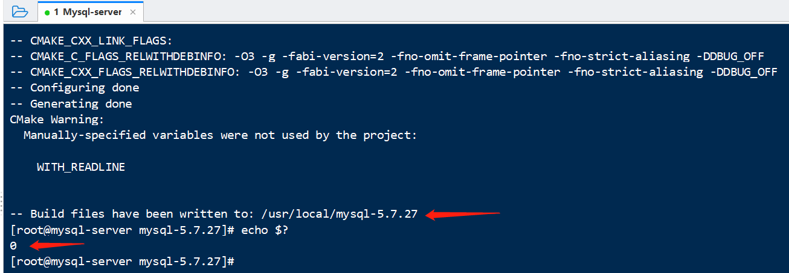

```shell
[root@mysql-server mysql-5.7.27]# make && make install
如果安装出错，想重新安装：
    不用重新解压，只需要删除安装目录中的缓存文件CMakeCache.txt
```

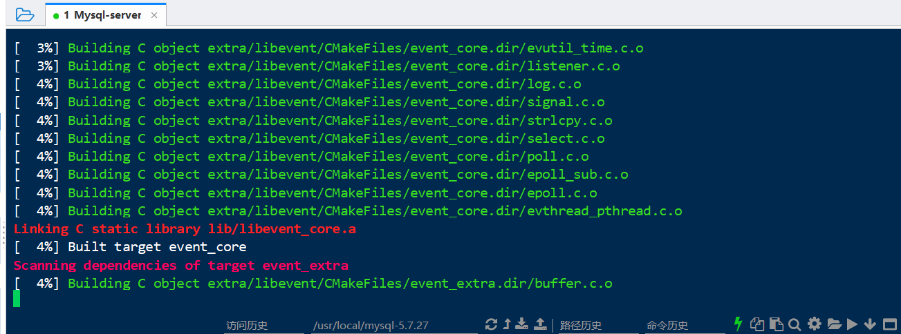

**需要很长时间！**大约半小时

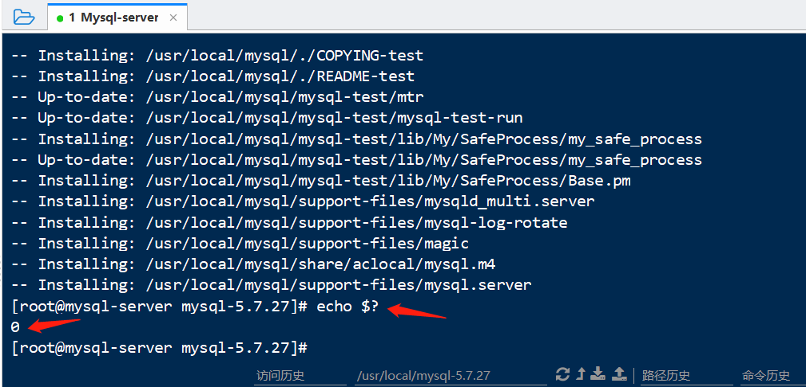

8、初始化

```shell
[root@mysql-server mysql-5.7.27]# cd /usr/local/mysql
[root@mysql-server mysql]# chown -R mysql.mysql .
[root@mysql-server mysql]# ./bin/mysqld --initialize --user=mysql --basedir=/usr/local/mysql --datadir=/usr/local/mysql/data     ---初始化完成之后，一定要记住提示最后的密码用于登陆或者修改密码
```

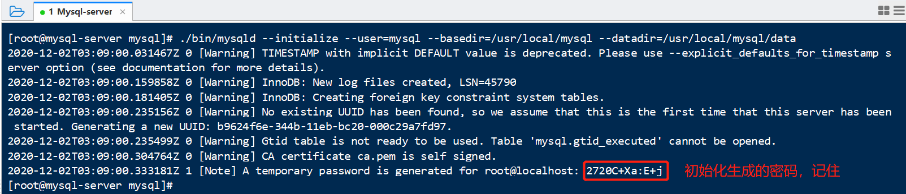

```
初始化,只需要初始化一次
```

```shell
[root@mysql-server ~]# vim /etc/my.cnf    ---将文件中所有内容注释掉在添加如下内容
[client]
port = 3306
socket = /tmp/mysql.sock
default-character-set = utf8

[mysqld]
port = 3306
user = mysql
basedir = /usr/local/mysql  #指定安装目录
datadir = /usr/local/mysql/data  #指定数据存放目录
socket = /tmp/mysql.sock
character_set_server = utf8


参数详解：
[client]
# 默认连接端口
port = 3306
# 用于本地连接的socket套接字
socket = /tmp/mysql.sock
# 编码
default-character-set = utf8

[mysqld]
# 服务端口号，默认3306
port = 3306
# mysql启动用户
user = mysql
# mysql安装根目录
basedir = /usr/local/mysql
# mysql数据文件所在位置
datadir = /usr/local/mysql/data
# 为MySQL客户端程序和服务器之间的本地通讯指定一个套接字文件
socket = /tmp/mysql.sock
# 数据库默认字符集,主流字符集支持一些特殊表情符号(特殊表情符占用4个字节)
character_set_server = utf8
```

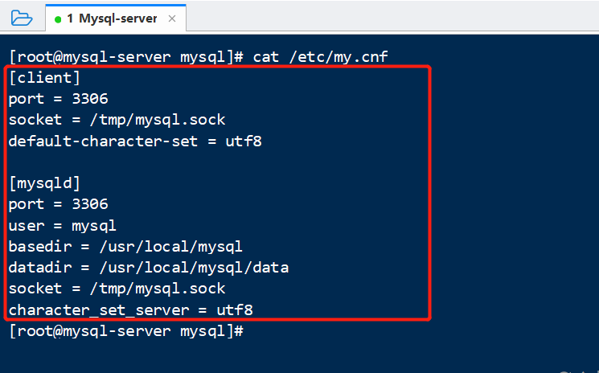

9、启动mysql

```shell
[root@mysql-server ~]# cd /usr/local/mysql
[root@mysql-server mysql]# ./bin/mysqld_safe --user=mysql &
```

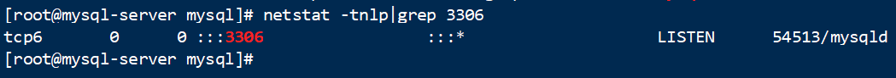

10、登录mysql

```shell
[root@mysql-server mysql]# /usr/local/mysql/bin/mysql -uroot -p'2720C+Xa:E+j'
mysql: [Warning] Using a password on the command line interface can be insecure.
Welcome to the MySQL monitor.  Commands end with ; or \g.
Your MySQL connection id is 2
Server version: 5.7.27

Copyright (c) 2000, 2019, Oracle and/or its affiliates. All rights reserved.

Oracle is a registered trademark of Oracle Corporation and/or its
affiliates. Other names may be trademarks of their respective
owners.

Type 'help;' or '\h' for help. Type '\c' to clear the current input statement.

mysql> exit
```

11、修改密码

```shell
[root@mysql-server mysql]# /usr/local/mysql/bin/mysqladmin -u root -p'2720C+Xa:E+j'  password '123'
mysqladmin: [Warning] Using a password on the command line interface can be insecure.
Warning: Since password will be sent to server in plain text, use ssl connection to ensure password safety.
```

12、添加环境变量

```shell
[root@mysql-server mysql]# vim /etc/profile    ---添加如下
PATH=$PATH:$HOME/bin:/usr/local/mysql/bin
[root@mysql-server mysql]# source /etc/profile
之后就可以在任何地方使用mysql命令登陆Mysql服务器：
[root@mysql-server mysql]# mysql --version
mysql  Ver 14.14 Distrib 5.7.27, for Linux (x86_64) using  EditLine wrapper
[root@mysql-server mysql]# mysql -uroot -p'123'
mysql: [Warning] Using a password on the command line interface can be insecure.
Welcome to the MySQL monitor.  Commands end with ; or \g.
Your MySQL connection id is 5
Server version: 5.7.27 Source distribution

Copyright (c) 2000, 2019, Oracle and/or its affiliates. All rights reserved.

Oracle is a registered trademark of Oracle Corporation and/or its
affiliates. Other names may be trademarks of their respective
owners.

Type 'help;' or '\h' for help. Type '\c' to clear the current input statement.

mysql> show databases;
+--------------------+
| Database           |
+--------------------+
| information_schema |
| mysql              |
| performance_schema |
| sys                |
+--------------------+
4 rows in set (0.00 sec)

mysql>exit
```

13、配置mysqld服务的管理工具

```shell
[root@mysql-server mysql]# cd /usr/local/mysql/support-files/
[root@mysql-server support-files]# cp mysql.server /etc/init.d/mysqld
[root@mysql-server support-files]# chkconfig --add mysqld
[root@mysql-server support-files]# chkconfig mysqld on
先将原来的进程杀掉
[root@mysql-server ~]# /etc/init.d/mysqld start 
Starting MySQL. SUCCESS! 
[root@mysql-server ~]# netstat -lntp 
Active Internet connections (only servers)
Proto Recv-Q Send-Q Local Address           Foreign Address         State       PID/Program name    
tcp        0      0 0.0.0.0:22              0.0.0.0:*               LISTEN      1087/sshd           
tcp6       0      0 :::22                   :::*                    LISTEN      1087/sshd           
tcp6       0      0 :::3306                 :::*                    LISTEN      31249/mysqld        
[root@mysql-server ~]# /etc/init.d/mysqld stop
```

数据库编译安装完成

# yum安装mysql


```shell
#!/bin/bash

# Download and install MySQL repository package
wget https://dev.mysql.com/get/mysql80-community-release-el7-3.noarch.rpm
rpm -ivh mysql80-community-release-el7-3.noarch.rpm

# Install required packages
yum -y install yum-utils

# Enable MySQL 5.7 repository and disable MySQL 8.0 repository
yum-config-manager --enable mysql57-community
yum-config-manager --disable mysql80-community

# Import MySQL GPG key
rpm --import https://repo.mysql.com/RPM-GPG-KEY-mysql-2022

# Install MySQL server
yum install -y mysql-community-server

# Start and enable MySQL service
systemctl start mysqld
systemctl enable mysqld

# Retrieve temporary password
temp_password=$(grep 'temporary password' /var/log/mysqld.log | awk '{print $NF}')

# Generate a secure password
new_password="MySecurePassword123!"

# Change password
mysqladmin --user=root --password="$temp_password" password "$new_password"

# Restart MySQL service
systemctl restart mysqld

echo "MySQL installed and password changed."
```


```shell
步骤：
闭防火墙和selinux
1、下载rpm包
2、安装mysql的yum仓库
3、配置yum源(1表示开启，0表示关闭)
4、安装数据库并启动服务
5、查找密码grep password /var/log/mysqld.log
6、修改密码
```

```shell
关闭防火墙和selinux

mysql的官方网站：www.mysql.com
```

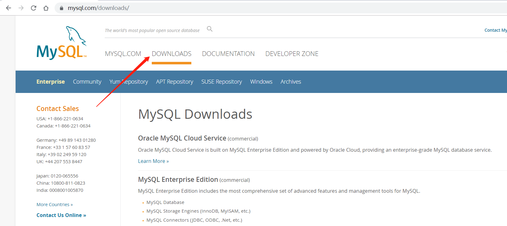

拉到底

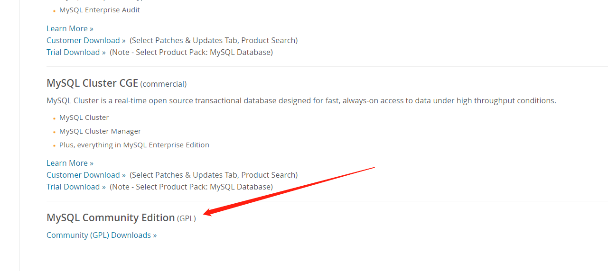

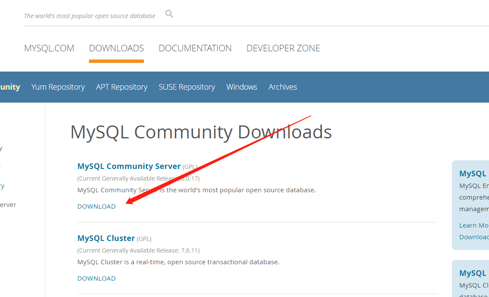

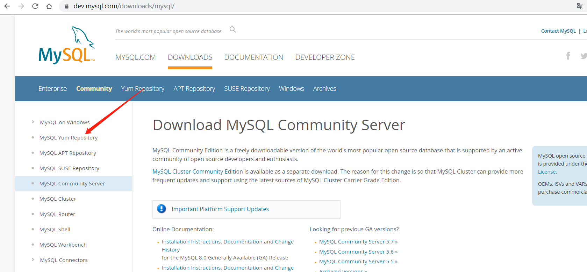

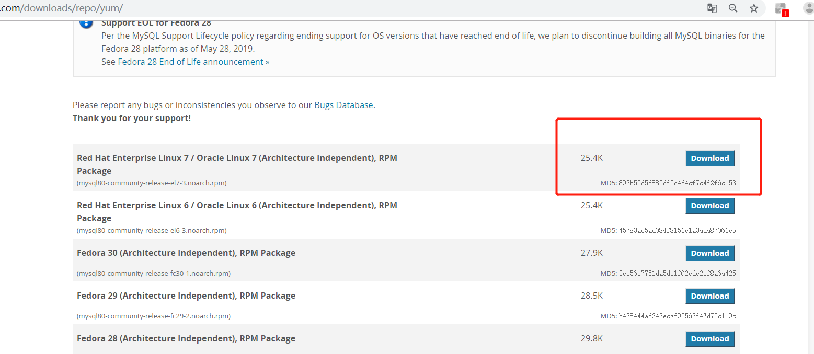

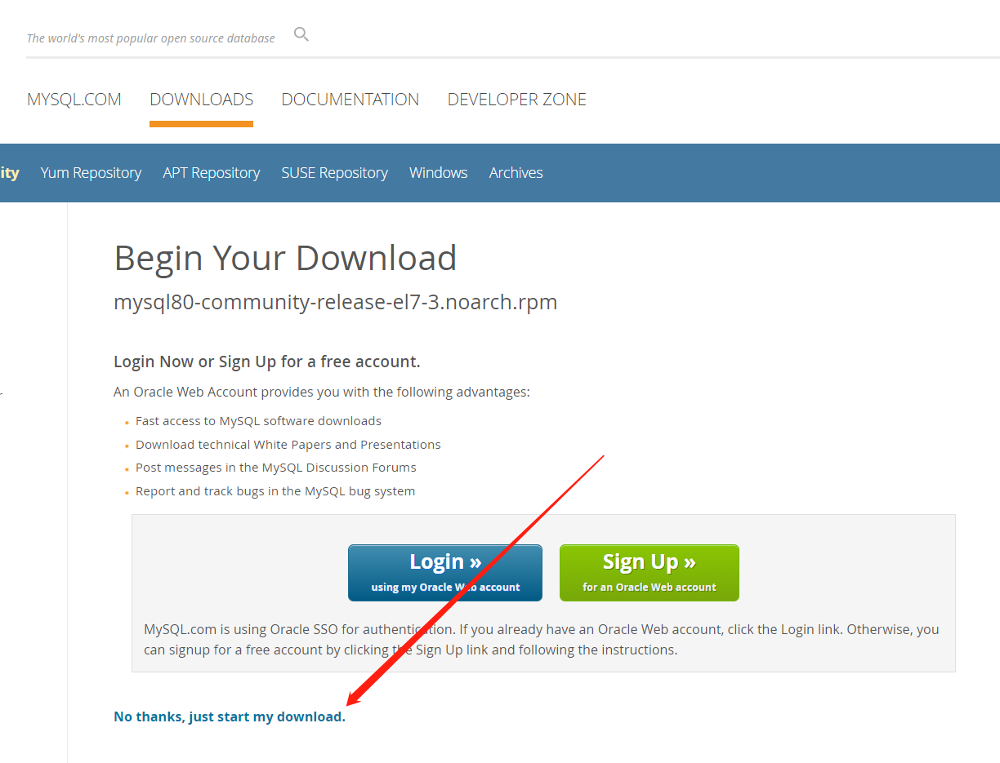

1、下载rpm包

```shell
[root@mysql-server ~]# wget https://dev.mysql.com/get/mysql80-community-release-el7-3.noarch.rpm
或者下载到本地上传到服务器
```

2.安装mysql的yum仓库

```shell
[root@mysql-server ~]# rpm -ivh mysql80-community-release-el7-3.noarch.rpm
[root@mysql-server ~]# yum -y install yum-utils    #安装yum工具包
```

3、配置yum源

```shell
[root@mysql-server ~]# vim /etc/yum.repos.d/mysql-community.repo   #修改如下
```

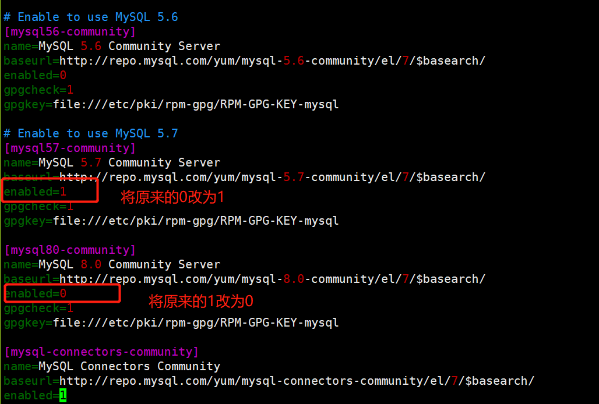

```shell
1表示开启，0表示关闭

或者
```

```shell
# yum-config-manager --enable mysql57-community   将禁用的yum源库启用
# yum-config-manager --disable mysql80-community   将启用的yum源库禁用
```

4、安装数据库

```shell
rpm --import https://repo.mysql.com/RPM-GPG-KEY-mysql-2022
```

```shell
[root@mysql-server ~]# yum install -y mysql-community-server
启动服务
[root@mysql-server ~]# systemctl start mysqld
设置开机启动
[root@mysql-server ~]# systemctl enable mysqld
```

5、查找密码

```shell
密码保存在日志文件中
[root@mysql-server ~]# grep password /var/log/mysqld.log
2019-08-18T14:03:51.991454Z 1 [Note] A temporary password is generated for root@localhost: woHtkMgau9,w
```

6、修改密码

```shell
两种方式：
第一种：
[root@mysql-server ~]# mysql -uroot -p'woHtkMgau9,w'   #登录
mysql: [Warning] Using a password on the command line interface can be insecure.
Welcome to the MySQL monitor.  Commands end with ; or \g.
Your MySQL connection id is 2
Server version: 5.7.27
....
mysql> alter user 'root'@'localhost' identified by '123';
Query OK, 0 rows affected (0.01 sec)
mysql> flush privileges;
Query OK, 0 rows affected (0.00 sec)
mysql> exit
Bye
[root@mysql-server ~]# mysql -uroot -p'123'
mysql: [Warning] Using a password on the command line interface can be insecure.
Welcome to the MySQL monitor.  Commands end with ; or \g.
Your MySQL connection id is 3
Server version: 5.7.27 MySQL Community Server (GPL)
...
mysql> exit
Bye

第二种：
# mysqladmin -u root -p'旧密码' password '新密码'
注：修改密码必须大小写数字和特殊符号都有。

简化密码
cd /etc/my.cnf
validate_password=off
```

# 扩展

```shell
通过配置文件设置密码强度
```

```shell
[root@mysql-server ~]# vim /etc/my.cnf   #在最后添加如下内容
validate_password=off
[root@mysql-server ~]# systemctl restart mysqld   #重启mysql生效
可以用第二种方式修改为简单的密码：
[root@mysql-server ~]# mysqladmin -uroot -p'旧密码' password '新密码'
mysqladmin: [Warning] Using a password on the command line interface can be insecure.
Warning: Since password will be sent to server in plain text, use ssl connection to ensure password safety.
[root@mysql-server ~]# mysql -uroot -p新密码
mysql: [Warning] Using a password on the command line interface can be insecure.
Welcome to the MySQL monitor.  Commands end with ; or \g.
Your MySQL connection id is 3
Server version: 5.7.27 MySQL Community Server (GPL)

Copyright (c) 2000, 2019, Oracle and/or its affiliates. All rights reserved.

Oracle is a registered trademark of Oracle Corporation and/or its
affiliates. Other names may be trademarks of their respective
owners.

Type 'help;' or '\h' for help. Type '\c' to clear the current input statement.

mysql> exit
Bye
```

# 数据库基本操作

查看数据库的引擎

```mysql
mysql> show engines;
```

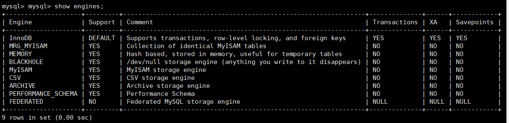

修改搜索引擎

```shell
ALTER TABLE 表名 ENGINE=引擎;
```

看你的mysql当前默认的存储引擎

```mysql
mysql> show variables like '%storage_engine%';
```

如何查看Mysql服务器上的版本

```mysql
mysql> select version();
```

创建时候指定引擎

```mysql
mysql> create table t1(id int,manager char(10)) engine =innodb;
```

# 库操作

```mysql
1.创建库
mysql> create database 库名;
2.查看数据库
mysql> show databases;
3.进入数据库
mysql> use 库名
4.查看当前所在的库
mysql> select database();
5.查看当前库下所有的表格
mysql> show tables;
```

# 表操作

```shell
1.创建表:
创建表 create table t1(id int,name varchar(20),age int); 
                      字段 类型 字段 类型(长度)，字段 类型 
mysql> create table t1(id int,name varchar(50),sex enum('m','f'),age int);

2.查看有哪些表
mysql> show tables;

3.查看表结构：
mysql> desc t1;

4.查看表里面的所有记录:
语法: select 内容 from 表名；
mysql> select * from t1;
*:代表所有内容

5.查看表里面的指定字段：
语法:select 字段，字段 from 表名；
mysql> select name,sex from t1;

6.查看表的状态
mysql> show table status like '表名'\G    ---每条SQL语句会以分号结尾，想看的清楚一些以\G结尾，一条记录一条记录显示。（把表90度向左反转，第一列显示字段，第二列显示记录）使用的\G就不用添加分号了

7.修改表名称
方式一、语法:rename table 旧表名 to 新表名;
mysql> rename table t1 to t2;
Query OK, 0 rows affected (0.00 sec)
方式二、语法:alter table 旧表名 rename 新表名;
mysql> alter table t2 rename t3;

8.使用edit(\e)编辑------了解
mysql> \e  #可以写新的语句，调用的vim编辑器，在里面结尾的时候不加分号，保存退出之后在加“;”
    -> ;
    
9.删除表
mysql> drop table 表名;

10.删除库
mysql> drop database 库名;
```

# 数据类型

在MySQL数据库管理系统中，可以通过存储引擎来决定表的类型。同时，MySQL数据库管理系统也
提供了数据类型决定表存储数据的类型。

------

```shell
1.整型
mysql> create table data.test1(age int(10));     //在data库下创建test1表格，设置数据类型

mysql> insert into  test1(age) values(1000);
Query OK, 1 row affected (0.00 sec)

mysql> insert into  test1(age) values(2147483647);
Query OK, 1 row affected (0.00 sec)

mysql> insert into  test1(age) values(2147483648);    //超出范围，报错
ERROR 1264 (22003): Out of range value for column 'age' at row 1

mysql> select * from test1;			//查询
+------------+
| age        |
+------------+
|        100 |
|       1000 |
| 2147483647 |
+------------+
3 rows in set (0.00 sec)
=====================================================
2.浮点数类型	     FLOAT DOUBLE
作用：用于存储用户的身高、体重、薪水等
float(5,3)      #一共5位，小数占3位.做了限制
mysql> create table test4(float_test float(5,2));  #案例   宽度不算小数点
mysql> desc test4;
+------------+------------+------+-----+---------+-------+
| Field      | Type       | Null | Key | Default | Extra |
+------------+------------+------+-----+---------+-------+
| float_test | float(5,2) | YES  |     | NULL    |       |
+------------+------------+------+-----+---------+-------+
1 row in set (0.00 sec)

mysql> insert into test4(float_test) values(123.345534354);
Query OK, 1 row affected (0.01 sec)

mysql> insert into test4(float_test) values(34.39567);
Query OK, 1 row affected (0.00 sec)

mysql> insert into test4(float_test) values(678.99993);
Query OK, 1 row affected (0.00 sec)

mysql> insert into test4(float_test) values(6784.9);
ERROR 1264 (22003): Out of range value for column 'float_test' at row 1

mysql> select * from test4;
+------------+
| float_test |
+------------+
|     123.35 |
|      34.40 |
|     679.00 |
+------------+
4 rows in set (0.00 sec)
====================================================================================
定点数类型   	 DEC
定点数在MySQL内部以字符串形式存储，比浮点数更精确，适合用来表示货币等精度高的数据。

3.字符串类型  
作用：用于存储用户的姓名、爱好、电话，邮箱地址，发布的文章等 
字符类型 char varchar  --存字符串

- char表示定长字符串，长度是固定的；如果插入数据的长度小于char的固定长度时，则用空格填充；因为长度固定，所以存取速度要比varchar快很多，甚至能快50%，但正因为其长度固定，所以会占据多余的空间。
- varchar表示可变长字符串，长度是可变的；插入的数据是多长，就按照多长来存储；varchar在存取方面与char相反，它存取慢，因为长度不固定，但正因如此，不占据多余的空间。
- 结合性能角度（char更快），节省磁盘空间角度（varchar更小），具体情况还需具体来设计数据库才是妥当的做法。

char(10)        根据10，占10个.
    列的长度固定为创建表时声明的长度： 0 ~ 255
varchar(10)     根据实际字符串长度占空间，最多10个
    列中的值为可变长字符串，长度： 0 ~ 65535

案例:
mysql> create table t8(c char(5),v varchar(12));
Query OK, 0 rows affected (0.42 sec)

mysql> insert into t8 values('abcde','abcdef');
Query OK, 1 row affected (0.38 sec)

mysql> insert into t8 values('abc','abcdef');  #char可以少于规定长度。
Query OK, 1 row affected (0.05 sec)

mysql> insert into t8 values('abc777','abcdef7');  #char不能大于规定的长度。
ERROR 1406 (22001): Data too long for column 'c' at row 1
mysql> 
=====================================================================
总结：
1.经常变化的字段用varchar
2.知道固定长度的用char
3.超过255字符的只能用varchar或者text
4.能用varchar的地方不用text
text：文本格式
-----------------------------------------------------------------
4.枚举类型 enum 
mysql> create table t10(sex enum('m','w'));
只能从tom,jim两个里面2选其1
（enumeration）  
 有限制的时候用枚举
 
案例：
mysql> insert into t10(sex) values('m');
Query OK, 1 row affected (0.00 sec)

mysql> insert into t10 values('w');
Query OK, 1 row affected (0.00 sec)

mysql> insert into t10 values('n');
ERROR 1265 (01000): Data truncated for column 'sex' at row 1
==================================================================
5.日期类型
===时间和日期类型测试：year、date、time、datetime、timestamp
作用：用于存储用户的注册时间，文章的发布时间，文章的更新时间，员工的入职时间等
注意事项:
==插入年份时，尽量使用4位值
==插入两位年份时，<=69，以20开头，比如65,  结果2065      
                 >=70，以19开头，比如82，结果1982
案例:
mysql> create table test_time(d date,t time,dt datetime);
Query OK, 0 rows affected (0.03 sec)+
mysql> desc test_time;
+-------+----------+------+-----+---------+-------+
| Field | Type     | Null | Key | Default | Extra |
+-------+----------+------+-----+---------+-------+
| d     | date     | YES  |     | NULL    |       |
| t     | time     | YES  |     | NULL    |       |
| dt    | datetime | YES  |     | NULL    |       |
+-------+----------+------+-----+---------+-------+
3 rows in set (0.01 sec)
mysql> insert into test_time values(now(),now(),now());
Query OK, 1 row affected, 1 warning (0.02 sec)
mysql> select * from test_time;
+------------+----------+---------------------+
| d          | t        | dt                  |
+------------+----------+---------------------+
| 2019-08-23 | 00:26:29 | 2019-08-23 00:26:29 |
+------------+----------+---------------------+
1 row in set (0.00 sec)
测试年：
mysql> create table t3(born_year year);
Query OK, 0 rows affected (0.40 sec)

mysql> desc t3;
+-----------+---------+------+-----+---------+-------+
| Field     | Type    | Null | Key | Default | Extra |
+-----------+---------+------+-----+---------+-------+
| born_year | year(4) | YES  |     | NULL    |       |
+-----------+---------+------+-----+---------+-------+
1 row in set (0.00 sec)
mysql> insert into t3 values (12),(80);
Query OK, 2 rows affected (0.06 sec)
Records: 2  Duplicates: 0  Warnings: 0
mysql> select * from t3;
+-----------+
| born_year |
+-----------+
|      2012 |
|      1980 |
+-----------+
2 rows in set (0.00 sec)
mysql> insert into t3 values (2019),(81);
Query OK, 2 rows affected (0.00 sec)
Records: 2  Duplicates: 0  Warnings: 0
mysql> select * from t3;
+-----------+
| born_year |
+-----------+
|      2012 |
|      1980 |
|      2019 |
|      1981 |
+-----------+
4 rows in set (0.00 sec)
mysql>
```

# 表完整性约束

```shell
分类：
1、primary——key主键
2、auto_increment自增
3、unique唯一约束
4、null和not null允许为空和不允许为空
5、default默认约束
```


```shell
1.主键
每张表里只能有一个主键，不能为空，而且唯一，主键保证记录的唯一性，主键自动为NOT NULL。
一个 UNIQUE KEY 又是一个NOT NULL的时候，那么它被当做PRIMARY KEY主键。

定义两种方式：
#表存在，添加约束
mysql> alter table t7 add primary key (hostname);

创建表并指定约束
mysql> create table t9(hostname char(20),ip char(150),primary key(hostname));
```

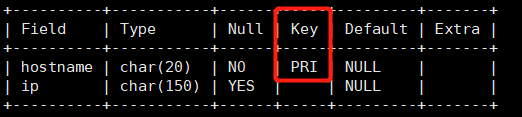

```shell
mysql> insert into t9(hostname,ip) values('github.com', '10.10.10.11');
Query OK, 1 row affected (0.00 sec)

mysql> insert into t9(hostname,ip) values('github.com', '10.10.10.12');
ERROR 1062 (23000): Duplicate entry 'github.com' for key 'PRIMARY'

mysql> insert into t9(hostname,ip) values('gitlab', '10.10.10.11');
Query OK, 1 row affected (0.01 sec)

mysql> select * from t9;
+-----------+-------------+
| hostname  | ip          |
+-----------+-------------+
| gitlab     | 10.10.10.11|
| github.com | 10.10.10.11|
+-----------+-------------+
2 rows in set (0.00 sec)

mysql> insert into t9(hostname,ip) values('git', '10.10.10.12');
Query OK, 1 row affected (0.00 sec)

mysql> select * from t9;
+-----------+-------------+
| hostname  | ip          |
+-----------+-------------+
| server     | 10.10.10.11 |
| server.com | 10.10.10.11 |
| git       | 10.10.10.12 |
+-----------+-------------+
3 rows in set (0.00 sec)

删除主键
mysql> alter table tab_name  drop  primary key;
```

```shell
2.auto_increment自增--------自动编号，且必须与主键组合使用默认情况下，起始值为1，每次的增量为1。当插入记录时，如果为AUTO_INCREMENT数据列明确指定了一个数值，则会出现两种情况：
- 如果插入的值与已有的编号重复，则会出现出错信息，因为AUTO_INCREMENT数据列的值必须是唯一的；
- 如果插入的值大于已编号的值，则会把该插入到数据列中，并使在下一个编号将从这个新值开始递增。也就是说，可以跳过一些编号。如果自增序列的最大值被删除了，则在插入新记录时，该值被重用。
（每张表只能有一个字段为自曾） （成了key才可以自动增长）
mysql> CREATE TABLE department3 (
    dept_id INT PRIMARY KEY AUTO_INCREMENT,
    dept_name VARCHAR(30),
    comment VARCHAR(50)
    );
```

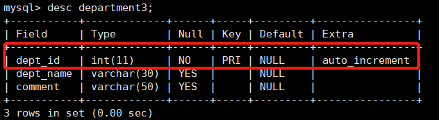

```shell
mysql> select * from department3;
Empty set (0.00 sec)

插入值
mysql> insert into department3(dept_name, comment) values('tom','test'), ('jack', 'test2');
Query OK, 2 rows affected (0.00 sec)

mysql> select * from department3;
+---------+-----------+---------+
| dept_id | dept_name | comment |
+---------+-----------+---------+
|       1 | tom       | test    |
|       2 | jack      | test2   |
+---------+-----------+---------+
2 rows in set (0.00 sec)

删除自动增长
mysql> ALTER TABLE department3 CHANGE dept_id  dept_id INT NOT NULL;
Query OK, 2 rows affected (0.01 sec)
Records: 2  Duplicates: 0  Warnings: 0

mysql> desc department3;
+-----------+-------------+------+-----+---------+-------+
| Field     | Type        | Null | Key | Default | Extra |
+-----------+-------------+------+-----+---------+-------+
| dept_id   | int(11)     | NO   | PRI | NULL    |       |
| dept_name | varchar(30) | YES  |     | NULL    |       |
| comment   | varchar(50) | YES  |     | NULL    |       |
+-----------+-------------+------+-----+---------+-------+
3 rows in set (0.00 sec)

再次插入数据，报错
mysql> insert into department3(dept_name,comment) values('tom','test1'),('jack','test2');
ERROR 1364 (HY000): Field 'dept_id' doesn't have a default value

```

```shell
3.设置唯一约束 UNIQUE，字段添加唯一约束之后，该字段的值不能重复，也就是说在一列当中不能出现一样的值。
mysql> CREATE TABLE department2 (
     dept_id INT,
     dept_name VARCHAR(30) UNIQUE,
     comment VARCHAR(50)
     );
```

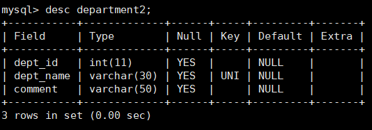

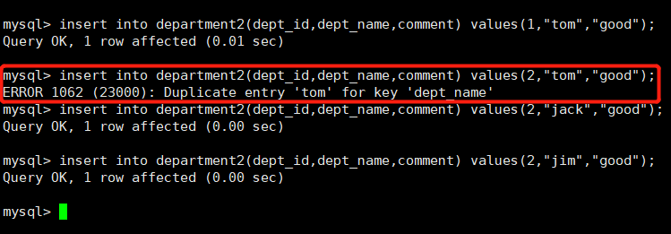

插入数据的时候id和comment字段相同可以插入数据，如果有相同的名字不唯一。所以插入数据失败。

```shell
4.null与not null
1. 是否允许为空，默认NULL，可设置NOT NULL，字段不允许为空，必须赋值
2. 字段是否有默认值，缺省的默认值是NULL，如果插入记录时不给字段赋值，此字段使用默认值
sex enum('male','female') not null default 'male'  #只能选择male和female，不允许为空，默认是male
```

```shell
mysql> create table t4(id int(5),name varchar(10),sex enum('male','female') not null default 'male');
Query OK, 0 rows affected (0.00 sec)
mysql> insert into t4(id,name) values(1,'tom');
mysql> select * from t4;
+------+------+------+
| id   | name | sex  |
+------+------+------+
|    1 | tom  | male |
+------+------+------+
1 row in set (0.00 sec)
```

```shell
允许为null
mysql> create table t1(id int(5),name varchar(10),age int(5));
Query OK, 0 rows affected (0.00 sec)
mysql> desc t1;
+-------+-------------+------+-----+---------+-------+
| Field | Type        | Null | Key | Default | Extra |
+-------+-------------+------+-----+---------+-------+
| id    | int(5)      | YES  |     | NULL    |       |
| name  | varchar(10) | YES  |     | NULL    |       |
| age   | int(5)      | YES  |     | NULL    |       |
+-------+-------------+------+-----+---------+-------+
3 rows in set (0.01 sec)

mysql> insert into t1(id,name) values(1,'tom');
Query OK, 1 row affected (0.00 sec)

mysql> select * from t1;
+------+------+------+
| id   | name | age  |
+------+------+------+
|    1 | tom  | NULL |
+------+------+------+
1 row in set (0.00 sec)
```

```shell
修改字符集 ：在创建表的最后面指定一下： default charset=utf8  #可以指定中文

* 未指定之前，插入
mysql> insert into t1(id,name) values(1,'明日香');
ERROR 1366 (HY000): Incorrect string value: '\xE7\x9F\xB3\xE5\xAE\x87...' for column 'name' at row 1

* 创建表格式指定字符集为utf-8
mysql> create table t6(id int(2),name char(5),age int(4)) default charset=utf8;
Query OK, 0 rows affected (0.00 sec)

mysql> desc t6;
+-------+---------+------+-----+---------+-------+
| Field | Type    | Null | Key | Default | Extra |
+-------+---------+------+-----+---------+-------+
| id    | int(2)  | YES  |     | NULL    |       |
| name  | char(5) | YES  |     | NULL    |       |
| age   | int(4)  | YES  |     | NULL    |       |
+-------+---------+------+-----+---------+-------+
3 rows in set (0.00 sec)

mysql> insert into t6(id,name) values(1,'明日香');
Query OK, 1 row affected (0.00 sec)
```

```shell
5.默认约束
添加/删除默认约束

1.创建一个表
mysql> create table user(id int not null, name varchar(20), number int, primary key(id));
Query OK, 0 rows affected (0.01 sec)

mysql> describe user;
+--------+-------------+------+-----+---------+-------+
| Field  | Type        | Null | Key | Default | Extra |
+--------+-------------+------+-----+---------+-------+
| id     | int(11)     | NO   | PRI | NULL    |       |
| name   | varchar(20) | YES  |     | NULL    |       |
| number | int(11)     | YES  |     | NULL    |       |
+--------+-------------+------+-----+---------+-------+
3 rows in set (0.00 sec)

2、设置默认值
mysql> ALTER TABLE user ALTER number SET DEFAULT 0;
Query OK, 0 rows affected (0.00 sec)
Records: 0  Duplicates: 0  Warnings: 0

mysql> DESCRIBE user;
+--------+-------------+------+-----+---------+-------+
| Field  | Type        | Null | Key | Default | Extra |
+--------+-------------+------+-----+---------+-------+
| id     | int(11)     | NO   | PRI | NULL    |       |
| name   | varchar(20) | YES  |     | NULL    |       |
| number | int(11)     | YES  |     | 0       |       |
+--------+-------------+------+-----+---------+-------+
3 rows in set (0.00 sec)


3、插入值
mysql> ALTER TABLE user CHANGE id id INT NOT NULL AUTO_INCREMENT;
Query OK, 2 rows affected (0.01 sec)
Records: 2  Duplicates: 0  Warnings: 0

mysql> INSERT INTO user(name) VALUES('rock'); 
Query OK, 1 row affected (0.00 sec)

mysql> INSERT INTO user(name) VALUES('rock');
Query OK, 1 row affected (0.00 sec)

mysql> select * from user;
+----+------+--------+
| id | name | number |
+----+------+--------+
|  1 | rock |      0 |
|  2 | rock |      0 |
+----+------+--------+
2 rows in set (0.00 sec)

删除默认值
mysql> ALTER TABLE user ALTER number drop DEFAULT;
```

# 表操作

```shell
表操作有些？
1、创建表
2、查看表(表结构，有哪些表，表中的内容，指定的字段，表的状态，表的名称，)
3、删除表
4、添加字段
5、修改字段和类型
6、插入数据(添加记录)
7、单表查询，多表查询
```


## 1.添加字段

```shell
添加新字段
alter table 表名 add 字段 类型;
mysql> alter table t3  add math int(10);-------添加的字段
mysql> alter table t3  add (chinese int(10),english int(10));------添加多个字段,中间用逗号隔开。
=====================================================================
alter table 表名 add 添加的字段(和类型) after name; -------把添加的字段放到name后面
mysql> alter table t9 add id char(10) after home;
Query OK, 0 rows affected (0.04 sec)
Records: 0  Duplicates: 0  Warnings: 0

mysql> desc t9;
+----------+---------------+------+-----+---------+-------+
| Field    | Type          | Null | Key | Default | Extra |
+----------+---------------+------+-----+---------+-------+
| name     | char(10)      | YES  |     | NULL    |       |
| hostname | char(10)      | NO   |     | NULL    |       |
| ip       | char(20)      | YES  |     | NULL    |       |
| math     | int(3)        | YES  |     | NULL    |       |
| chinese  | int(10)       | YES  |     | NULL    |       |
| english  | int(10)       | YES  |     | NULL    |       |
| home     | char(10)      | YES  |     | NULL    |       |
| id       | char(10)      | YES  |     | NULL    |       |
| sex      | enum('w','m') | YES  |     | NULL    |       |
+----------+---------------+------+-----+---------+-------+
9 rows in set (0.00 sec)
=======================================================
alter table 表名 add 添加的字段(和类型) first; ----------把添加的字段放在第一个
mysql> alter table t9 add name char(10) first;
Query OK, 0 rows affected (0.04 sec)
Records: 0  Duplicates: 0  Warnings: 0

mysql> desc t9;
+----------+---------------+------+-----+---------+-------+
| Field    | Type          | Null | Key | Default | Extra |
+----------+---------------+------+-----+---------+-------+
| name     | char(10)      | YES  |     | NULL    |       |
| hostname | char(10)      | NO   |     | NULL    |       |
| ip       | char(20)      | YES  |     | NULL    |       |
| math     | int(3)        | YES  |     | NULL    |       |

```

## 2.修改字段和类型

```shell
1.修改名称、数据类型、类型 
alter table 表名 change 旧字段 新字段 类型; #change修改字段名称，类型，约束，顺序 
mysql> alter table t3 change max maxs int(15) after id;  #修改字段名称与修饰并更换了位置
2.修改字段类型，约束，顺序
alter table 表名 modify 字段 类型； #modify 不能修改字段名称
mysql> alter table t3 modify maxs int(20) after math;    #修改类型并更换位置
3.删除字段
mysql> alter table t3 drop maxs;  #drop 丢弃的字段。
```

## 3.插入数据(添加纪录)

```shell
mysql> create table t3(id int, name varchar(20), sex enum('m','f'), age int);
字符串必须引号引起来
记录与表头相对应，表头与字段用逗号隔开。

1.添加一条记录
insert into 表名(字段1,字段2,字段3,字段4) values(1,"tom","m",90);
mysql> insert into t3(id,name,sex,age) values(1,"tom","m",18);
Query OK, 1 row affected (0.00 sec)
注:添加的记录与表头要对应，

2.添加多条记录
mysql> insert into t3(id,name,sex,age) values(2,"jack","m",19),(3,"xiaoli","f",20);
Query OK, 2 rows affected (0.34 sec)

3.用set添加记录
mysql> insert into t3 set id=4,name="zhangsan",sex="m",age=21;
Query OK, 1 row affected (0.00 sec)

4.更新记录
update 表名 set  修改的字段  where  给谁修改;
mysql> update t3 set id=6 where name="xiaoli";

5.删除记录
删除单条记录
mysql> delete from t3 where id=6;   #删除那个记录，等于几会删除那个整条记录
Query OK, 1 row affected (0.35 sec)
删除所有记录
mysql> delete from t3;
```

## 4.单表查询

```shell
测试表:company.employee5
mysql> create database company;   #创建一个库；
创建一个测试表:
mysql> CREATE TABLE company.employee5(
     id int primary key AUTO_INCREMENT not null,
    name varchar(30) not null,
    sex enum('male','female') default 'male' not null,
     hire_date date not null,
     post varchar(50) not null,
     job_description varchar(100),
     salary double(15,2) not null,
     office int,
     dep_id int
     );
插入数据:
mysql> insert into company.employee5(name,sex,hire_date,post,job_description,salary,office,dep_id) values 
	('jack','male','20180202','instructor','teach',5000,501,100),
	('tom','male','20180203','instructor','teach',5500,501,100),
	('robin','male','20180202','instructor','teach',8000,501,100),
	('alice','female','20180202','instructor','teach',7200,501,100),
	('tianyun','male','20180202','hr','hrcc',600,502,101),
	('harry','male','20180202','hr',NULL,6000,502,101),
	('emma','female','20180206','sale','salecc',20000,503,102),
	('christine','female','20180205','sale','salecc',2200,503,102),
    ('zhuzhu','male','20180205','sale',NULL,2200,503,102),
    ('gougou','male','20180205','sale','',2200,503,102);
mysql> use company

语法：
select   字段名称,字段名称2    from  表名   条件

简单查询
mysql> select * from employee5;

多字段查询：
mysql> select id,name,sex from employee5;

有条件查询：where
mysql> select id,name from employee5 where id<=3;
mysql> select id,name,salary from employee5 where salary>2000;

设置别名：as
mysql> select id,name,salary as "salry_num" from employee5 where salary>5000;
给 salary 的值起个别名，显示值的表头会是设置的别名

统计记录数量：count()
mysql> select count(*) from employee5;

统计字段得到数量:
mysql> select count(id) from employee5;

避免重复DISTINCT:表里面的数据有相同的
mysql> select distinct post from employee5;
                       #字段      表名
```

```shell
表复制：key不会被复制: 主键、外键和索引
复制表
1.复制表结构＋记录 （key不会复制: 主键、外键和索引）
语法:create table 新表 select * from 旧表;
mysql> create table new_t1 select * from employee5;

2.复制单个字段和记录:
mysql> create table new_t2(select id,name from employee5);

3.多条件查询:  and   ----和
语法: select   字段，字段2 from   表名   where   条件 and where 条件；
mysql> SELECT name,salary from employee5 where post='hr' AND salary>1000;
mysql> SELECT name,salary from employee5 where post='instructor' AND salary>1000;

4.多条件查询:  or   ----或者
语法：       select   字段，字段2 from   表名   where   条件   or   条件；
mysql> select name from employee5 where salary>5000 and salary<10000 or dep_id=102;
mysql> select name from employee5 where salary>2000 and salary<6000 or dep_id=100;

5.关键字 BETWEEN AND  什么和什么之间。
mysql> SELECT name,salary FROM employee5 WHERE salary BETWEEN 5000 AND 15000;
mysql> SELECT name,salary FROM employee5 WHERE salary NOT BETWEEN 5000 AND 15000;
mysql> select name,dep_id,salary from employee5 where  not salary>5000;
注:not  给条件取反

6.关键字IS NULL   空的
mysql> SELECT name,job_description FROM employee5 WHERE job_description IS NULL;
mysql> SELECT name,job_description FROM employee5  WHERE job_description IS NOT NULL;  #-取反 不是null
mysql> SELECT name,job_description FROM employee5 WHERE job_description=''; #什么都没有==空
NULL说明：
        1、等价于没有任何值、是未知数。
        2、NULL与0、空字符串、空格都不同,NULL没有分配存储空间。
        3、对空值做加、减、乘、除等运算操作，结果仍为空。
        4、比较时使用关键字用“is null”和“is not null”。
        5、排序时比其他数据都小（索引默认是降序排列，小→大），所以NULL值总是排在最前。

7.关键字IN集合查询
一般查询：
mysql> SELECT name,salary FROM employee5 WHERE salary=4000 OR salary=5000 OR salary=6000 OR salary=9000;
IN集合查询
mysql> SELECT name, salary FROM employee5 WHERE salary IN (4000,5000,6000,9000);
mysql> SELECT name, salary FROM employee5 WHERE salary NOT IN (4000,5000,6000,9000); #取反

8.排序查询    order by  ：指令，在mysql是排序的意思。
mysql> select name,salary from employee5 order by salary; #-默认从小到大排序。
mysql> select name,salary from employee5 order by salary desc; #降序，从大到小

9.limit 限制
mysql> select * from employee5 limit 5;  #只显示前5行
mysql> select name,salary from employee5 order by salary desc limit 0,1; #从第几行开始，打印一行
查找什么内容从那张表里面降序排序只打印第二行。
注意：
0-------默认第一行
1------第二行  依次类推...
mysql> SELECT * FROM employee5 ORDER BY salary DESC LIMIT 0,5;  #降序，打印5行
mysql> SELECT * FROM employee5 ORDER BY salary DESC LIMIT 4,5;  #从第5条开始，共显示5条
mysql> SELECT * FROM employee5 ORDER BY salary  LIMIT 4,3;  #默认从第5条开始显示3条。

10.分组查询 ：group  by
mysql> select count(name),post from employee5 group by post;
+-------------+------------+
| count(name) | post       |
+-------------+------------+
|           2 | hr         |
|           4 | instructor |
|           4 | sale       |
+-------------+------------+
 count可以计算字段里面有多少条记录，如果分组会分组做计算
 mysql> select count(name),group_concat(name) from employee5 where salary>5000;
 查找 统计（条件：工资大于5000）的有几个人（count(name)），分别是谁（group_concat(name)）
+-------------+----------------------------+
| count(name) | group_concat(name)         |
+-------------+----------------------------+
|           5 | tom,robin,alice,harry,emma |
+-------------+----------------------------+

11.GROUP BY和GROUP_CONCAT()函数一起使用
GROUP_CONCAT()-------组连接
mysql> SELECT dep_id,GROUP_CONCAT(name) FROM employee5 GROUP BY dep_id; #以dep_id分的组，dep_id这个组里面都有谁
mysql> SELECT dep_id,GROUP_CONCAT(name) as emp_members FROM employee5 GROUP BY dep_id; #给组连接设置了一个别名

12.函数
max() 最大值
mysql> select max(salary) from employee5;
查询薪水最高的人的详细信息：
mysql> select name,sex,hire_date,post,salary,dep_id from employee5 where salary = (SELECT MAX(salary) from employee5);
min()最小值
select min(salary) from employee5;
avg()平均值
select avg(salary) from employee5;
now()  现在的时间
select now();
sum()  计算和
select sum(salary) from employee5 where post='sale';
```

## 5.多表查询

```shell
概念：当在查询时，所需要的数据不在一张表中，可能在两张表或多张表中。此时需要同时操作这些表。即关联查询。

内连接：在做多张表查询时，这些表中应该存在着有关联的两个字段,组合成一条记录。只连接匹配到的行

实战
准备两张表（表一）
mysql> create database company;
mysql> create table employee6( emp_id int auto_increment primary key not null, emp_name varchar(50), age int, dept_id int);
Query OK, 0 rows affected (0.00 sec)

mysql> desc employee6;
+----------+-------------+------+-----+---------+----------------+
| Field    | Type        | Null | Key | Default | Extra          |
+----------+-------------+------+-----+---------+----------------+
| emp_id   | int(11)     | NO   | PRI | NULL    | auto_increment |
| emp_name | varchar(50) | YES  |     | NULL    |                |
| age      | int(11)     | YES  |     | NULL    |                |
| dept_id  | int(11)     | YES  |     | NULL    |                |
+----------+-------------+------+-----+---------+----------------+
4 rows in set (0.08 sec)

插入数据：
mysql> insert into employee6(emp_name,age,dept_id) values('xiaoli',19,200),('tom',26,201),('jack',30,201),('alice',24,202),('robin',40,200),('zhangsan',28,204);
Query OK, 6 rows affected (0.00 sec)
Records: 6  Duplicates: 0  Warnings: 0

mysql> select * from employee6;
+--------+----------+------+---------+
| emp_id | emp_name | age  | dept_id |
+--------+----------+------+---------+
|      1 | xiaoli   |   19 |     200 |
|      2 | tom      |   26 |     201 |
|      3 | jack     |   30 |     201 |
|      4 | alice    |   24 |     202 |
|      5 | robin    |   40 |     200 |
|      6 | zhangsan |   28 |     204 |
+--------+----------+------+---------+
6 rows in set (0.00 sec)

（表二）
mysql> create table department6(dept_id int, dept_name varchar(100));
Query OK, 0 rows affected (0.01 sec)

mysql> desc department6;
+-----------+--------------+------+-----+---------+-------+
| Field     | Type         | Null | Key | Default | Extra |
+-----------+--------------+------+-----+---------+-------+
| dept_id   | int(11)      | YES  |     | NULL    |       |
| dept_name | varchar(100) | YES  |     | NULL    |       |
+-----------+--------------+------+-----+---------+-------+
2 rows in set (0.00 sec)

mysql> insert into department6 values
    -> (200,'hr'),
    -> (201,'it'),
    -> (202,'sale'),
    -> (203,'op');
Query OK, 4 rows affected (0.00 sec)
Records: 4  Duplicates: 0  Warnings: 0

mysql> select * from department6;
+---------+-----------+
| dept_id | dept_name |
+---------+-----------+
|     200 | hr        |
|     201 | it        |
|     202 | sale      |
|     203 | op        |
+---------+-----------+
4 rows in set (0.00 sec)


内连接查询：只显示表中有匹配的数据
只找出有相同部门的员工
mysql> select employee6.emp_id,employee6.emp_name,employee6.age,department6.dept_name from employee6,department6 where employee6.dept_id = department6.dept_id;
+--------+----------+------+-----------+
| emp_id | emp_name | age  | dept_name |
+--------+----------+------+-----------+
|      1 | xiaoli   |   19 | hr        |
|      2 | tom      |   26 | it        |
|      3 | jack     |   30 | it        |
|      4 | alice    |   24 | sale      |
|      5 | robin    |   40 | hr        |
+--------+----------+------+-----------+
5 rows in set (0.00 sec)

```

```shell
外连接：在做多张表查询时，所需要的数据，除了满足关联条件的数据外，还有不满足关联条件的数据。此时需要使用外连接.外连接分为三种

左外连接：表A left [outer] join 表B  on 关联条件，表A是主表，表B是从表
右外连接：表A right [outer] join 表B  on 关联条件，表B是主表，表A是从表
全外连接：表A  full [outer] join 表B on 关联条件，两张表的数据不管满不满足条件，都做显示。     

案例：查找出所有员工及所属部门
1.左外链接
mysql> select emp_id,emp_name,dept_name from  employee6 left join department6 on employee6.dept_id = department6.dept_id;
+--------+----------+-----------+
| emp_id | emp_name | dept_name |
+--------+----------+-----------+
|      1 | xiaoli   | hr        |
|      5 | robin    | hr        |
|      2 | tom      | it        |
|      3 | jack     | it        |
|      4 | alice    | sale      |
|      6 | zhangsan | NULL      |
+--------+----------+-----------+
6 rows in set (0.01 sec)

2.右外连接
案例：找出所有部门包含的员工
mysql> select emp_id,emp_name,dept_name from  employee6 right join department6 on employee6.dept_id = department6.dept_id;
+--------+----------+-----------+
| emp_id | emp_name | dept_name |
+--------+----------+-----------+
|      1 | xiaoli   | hr        |
|      2 | tom      | it        |
|      3 | jack     | it        |
|      4 | alice    | sale      |
|      5 | robin    | hr        |
|   NULL | NULL     | op        |
+--------+----------+-----------+
6 rows in set (0.00 sec)
```

## 6.破解密码

先将这个修改成简单密码注释掉

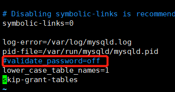

```shell
root账户没了或者root密码丢失：
关闭Mysql使用下面方式进入Mysql直接修改表权限                       
  5.6/5.7版本：
  vim /etc/my.cnf
    # mysqld --skip-grant-tables --user=mysql &    
    
    # mysql -uroot
    mysql> UPDATE mysql.user SET authentication_string=password('QianFeng@123') WHERE user='root' AND host='localhsot';
    mysql> FLUSH PRIVILEGES;
    
#编辑配置文件将skip-grant-tables参数注释
#重启mysql
```

# MySQL 索引


```shell
索引作为一种数据结构，其用途是用于提升检索数据的效率。
```

## 1、MySQL 索引的分类

```shell
- 普通索引（INDEX）：索引列值可重复
- 唯一索引（UNIQUE）：索引列值必须唯一，可以为NULL
- 主键索引（PRIMARY KEY）：索引列值必须唯一，不能为NULL，一个表只能有一个主键索引
- 全文索引（FULL TEXT）：给每个字段创建索引
```

## 2、MySQL 不同类型索引用途和区别

```shell
- 普通索引常用于过滤数据。例如，以商品种类作为索引，检索种类为“手机”的商品。
- 唯一索引主要用于标识一列数据不允许重复的特性，相比主键索引不常用于检索的场景。
- 主键索引是行的唯一标识，因而其主要用途是检索特定数据。
- 全文索引效率低，常用于文本中内容的检索。
```

## 3、MySQL 使用索引

### 创建索引

#### 1、普通索引（INDEX）

```mysql
# 在创建表时指定
mysql> create table student1(id int not null, name varchar(100) not null, birthdy date, sex char(1) not null, index nameindex (name(50)));
Query OK, 0 rows affected (0.02 sec)


# 基于表结构创建
mysql> create table student2(id int not null, name varchar(100) not null, birthday date, sex char(1) not null);
Query OK, 0 rows affected (0.01 sec)

mysql> create index nameindex on student2(name(50));

# 修改表结构创建
mysql> create table student3(id int not null, name varchar(100) not null, birthday date, sex char(1) not null);
Query OK, 0 rows affected (0.01 sec)

mysql> ALTER TABLE student3 ADD INDEX nameIndex(name(50));

mysql> show index from student3;   //查看某个表格中的索引
```

#### 2、唯一索引（UNIQUE）

```mysql
# 在创建表时指定
mysql> create table student4(id int not null, name varchar(100) not null, birthday date, sex char(1) not null, unique index id_idex (id));
Query OK, 0 rows affected (0.00 sec)

# 基于表结构创建
mysql> create table student5(id int not null, name varchar(100) not null, birthday date, sex char(1) not null);
Query OK, 0 rows affected (0.00 sec)

mysql> CREATE unique INDEX idIndex ON student5(id);
```

#### 3、主键索引（PRIMARY KEY）

```mysql
# 创建表时时指定
mysql> create table student6(id int not null, name varchar(100) not null, birthday date, sex char(1) not null, primary key (id));
Query OK, 0 rows affected (0.01 sec)

# 修改表结构创建
mysql> create table student7(id int not null, name varchar(100) not null, birthday date, sex char(1) not null);
Query OK, 0 rows affected (0.01 sec)

mysql> ALTER TABLE student7 ADD PRIMARY KEY (id);
Query OK, 0 rows affected (0.01 sec)
Records: 0  Duplicates: 0  Warnings: 0
```

主键索引不能使用基于表结构创建的方式创建。

### 删除索引

#### 1、普通索引（INDEX）

```mysql
# 直接删除
mysql> DROP INDEX nameIndex ON student1;

# 修改表结构删除
mysql> ALTER TABLE student2 DROP INDEX nameIndex;
```

#### 2、唯一索引（UNIQUE）

```mysql
# 直接删除
mysql> DROP INDEX idIndex ON student4;

# 修改表结构删除
mysql> ALTER TABLE student DROP INDEX idIndex;
```

#### 3、主键索引（PRIMARY KEY）

```mysql
mysql> ALTER TABLE student DROP PRIMARY KEY;
```

主键不能采用直接删除的方式删除。

#### 4、查看索引

```mysql
mysql> SHOW INDEX FROM tab_name;
```


# 权限管理

## 1、用户管理

```shell
登录和退出MySQL
本地登录客户端命令：
# mysql -uroot -p123

远程登陆：
客户端语法：mysql  -u  用户名  -p  密码  -h  ip地址   -P端口号:如果没有改端口号就不用-P指定端口
# mysql -h192.168.246.253 -P 3306 -uroot -p123
```

```shell
如果报错进入server端服务器登陆mysql执行:

mysql> use mysql

mysql> update user set host = '%' where user = 'root';

mysql> flush privileges;
```

```shell
# mysql -h192.168.246.253 -P 3306 -uroot -p123 -e 'show databases;'
-h	指定主机名            【默认为localhost】
-大P	MySQL服务器端口       【默认3306】
-u	指定用户名             【默认root】
-p	指定登录密码           【默认为空密码】
-e	接SQL语句，可以写多条拿;隔开
# mysql -h192.168.246.253 -P 3306 -uroot -p123 -D mysql -e 'select * from user;'
此处 -D mysql为指定登录的数据库
修改端口rpm安装：vim /etc/my.cnf
在到【mysql】标签下面添加port=指定端口。重启服务
```

## 2、创建用户

```shell
方法一：CREATE USER语句创建
mysql> create user tom@'localhost' identified by '123'; #创建用户为tom，并设置密码。
mysql> FLUSH PRIVILEGES; #更新授权表
注:
identified by ：设置密码
在用户tom@'  ' 这里 选择:
%：允许所有主机远程登陆包括localhost。也可以指定某个ip，允许某个ip登陆。也可以是一个网段。
localhost:只允许本地用户登录
==客户端主机	    %				     所有主机远程登录
			192.168.246.%		    192.168.246.0网段的所有主机
			192.168.246.252		    指定主机
			localhost               只允许本地用户登录
```

```shell
GRANT  ---授权。
mysql> GRANT ALL ON *.* TO 'user3'@’localhost’;
            #权限 库名.表名  账户名                
mysql> FLUSH PRIVILEGES;
Query OK, 0 rows affected (0.00 sec)
```

```shell
修改远程登陆:
将原来的localhost修改为%或者ip地址
mysql> use mysql
mysql> update user set host = '192.168.246.%' where user = 'user3';
mysql> FLUSH PRIVILEGES;
```

## 3、刷新权限

```shell
修改表之后需要刷新权限
方式1：
    mysql > flush privileges;
```

```shell
方式二：使用命令创建用户并授权：grant   
   也可创建新账户(不过后面的版本会移除这个功能，建议使用create user) 
语法格式：
grant 权限列表  on 库名.表名 to '用户名'@'客户端主机' IDENTIFIED BY '123'；
 ==权限列表		all	 		所有权限（不包括授权权限）
			select,update	
			select, insert

#注意：root用授权时候grant授权权限不要给予
								
 ==数据库.表名	*.*			所有库下的所有表
			   web.*		web库下的所有表
			web.stu_info	web库下的stu_info表

#单独授权
给刚才创建的用户tom授权：
mysql> grant select,insert on *.* to 'tom'@'localhost';
mysql> FLUSH PRIVILEGES;
```

## 4、权限简介

```shell
权限简介

| 权限                   | 权限级别                 | 权限说明                    
| :--------------------- | :--------------------- | :------------------------------------
| CREATE                 | 数据库、表或索引          | 创建数据库、表或索引权限                 
| DROP                   | 数据库或表               | 删除数据库或表权限                       
| GRANT OPTION           | 数据库、表或保存的程序     | 赋予权限选项 #小心给予                 
| ALTER                  | 表                     | 更改表，比如添加字段、索引等               
| DELETE                 | 表                     | 删除数据权限                             
| INDEX                  | 表                     | 索引权限                               
| INSERT                 | 表                     | 插入权限                               
| SELECT                 | 表                     | 查询权限                               
| UPDATE                 | 表                     | 更新权限                               
| LOCK TABLES            | 服务器管理              | 锁表权限                               
| CREATE USER            | 服务器管理             | 创建用户权限                             
| REPLICATION SLAVE      | 服务器管理             | 复制权限                                 
| SHOW DATABASES         | 服务器管理             | 查看数据库权限                           
```

## 5、查看权限

```shell
查看权限
1.看自己的权限：
mysql> SHOW GRANTS\G
*************************** 1. row ***************************
Grants for root@%: GRANT ALL PRIVILEGES ON *.* TO 'root'@'%' WITH GRANT OPTION
    
2.看别人的权限：
mysql> SHOW GRANTS FOR tom@'localhost'\G
*************************** 1. row ***************************
Grants for tom@localhost: GRANT SELECT, INSERT ON *.* TO 'tom'@'localhost'  
```

## 6、移除权限

```shell
移除用户权限
语法：REVOKE 权限 ON 数据库.数据表 FROM '用户'@'IP地址';
- 被回收的权限必须存在，否则会出错
- 整个数据库，使用 ON datebase.*；
- 特定的表：使用 ON datebase.table；

mysql> revoke select,delete on *.* from jack@'%';   #回收指定权限
mysql> revoke all privileges on *.* from jack@'%';  #回收所有权限
mysql> flush privileges;
```

## 7、修改密码

```shell
＝＝＝root修改自己密码
方法一:
语法： mysqladmin -uroot -p'123' password 'new_password'	    #123为旧密码
案例:
# mysqladmin -uroot -p'jack123' password 'asuka23';
方法二:
mysql>SET PASSWORD='new_password';

==root修改其他用户密码
mysql> use mysql
mysql> SET PASSWORD FOR user3@'localhost'='new_password'
                                用户     =  新密码
```

## 8、删除用户

```shell
方法一：DROP USER语句删除
DROP USER 'user3'@'localhost';

方法二：DELETE语句删除
DELETE FROM mysql.user  WHERE user='tom' AND host='localhost';

更新授权表：	FLUSH PRIVILEGES;
```

## 9、查看密码复杂度

MySQL 默认启用了密码复杂度设置，插件名字叫做 validate_password，初始化之后默认是安装的如果没有安装执行下面的命令会返回空或者没有值，这时需要安装该插件

```shell
安装插件
mysql> INSTALL PLUGIN validate_password SONAME 'validate_password.so';
```

```shell
1.查看密码复杂度
mysql> show variables like 'validate%';
+--------------------------------------+--------+
| Variable_name                        | Value  |
+--------------------------------------+--------+
| validate_password_check_user_name    | OFF    |
| validate_password_dictionary_file    |        |
| validate_password_length             | 8      |
| validate_password_mixed_case_count   | 1      |
| validate_password_number_count       | 1      |
| validate_password_policy             | MEDIUM |
| validate_password_special_char_count | 1      |
+--------------------------------------+--------+

参数解释：
validate_password_length ：#密码最少长度，默认值是8最少是0
validate_password_dictionary_file：#用于配置密码的字典文件，字典文件中存在的密码不得使用。
validate_password_policy： #代表的密码策略，默认是MEDIUM
validate_password_number_count ：#最少数字字符数，默认1最小是0
validate_password_mixed_case_count ：#最少大写和小写字符数(同时有大写和小写)，默认为1最少是0
validate_password_special_char_count ：#最少特殊字符数，默认1最小是0

2.查看密码策略
mysql> select @@validate_password_policy;
+----------------------------+
| @@validate_password_policy |
+----------------------------+
| MEDIUM                     |
+----------------------------+
1 row in set (0.00 sec)

策略：
- 0 or LOW 设置密码长度（由参数validate_password_length指定）
- 1 or MEDIUM 满足LOW策略，同时还需满足至少有1个数字，小写字母，大写字母和特殊字符
- 2 or STRONG 满足MEDIUM策略，同时密码不能存在字典文件（dictionary file）中

3.查看密码的长度
mysql> select @@validate_password_length; 
+----------------------------+
| @@validate_password_length |
+----------------------------+
|                          8 |
+----------------------------+
1 row in set (0.00 sec)

4.设置密码复杂度
mysql> set global validate_password_length=1; #设置密码长度为1个
mysql> set global validate_password_number_count=2; #设置密码数字最少为2个

5.设置密码复杂性策略
mysql> set global validate_password_policy=LOW; 也可以是数字表示。#设置密码策略

mysql> flush privileges; #刷新授权
```

## 10、权限控制机制

```shell
四张表：user   db    tables_priv  columns_priv
1.用户认证
查看mysql.user表
2.权限认证
以select权限为例：
1.先看 user表里的select_priv权限
 Y:不会接着查看其他的表  拥有查看所有库所有表的权限
 N:接着看db表
2.db表:  #某个用户对一个数据库的权限。
 Y:不会接着查看其他的表  拥有查看所有库所有表的权限
 N:接着看tables_priv表
3.tables_priv表：#针对表的权限
 tables_priv:如果这个字段的值里包括select  拥有查看这张表所有字段的权限，不会再接着往下看了
 tables_priv:如果这个字段的值里不包括select，接着查看下张表还需要有column_priv字段权限
4.columns_priv:针对数据列的权限表
 columns_priv:有select，则只对某一列有select权限
             没有则对所有库所有表没有任何权限
 注：其他权限设置一样。
 
# 授权级别排列

- mysql.user #全局授权
- mysql.db #数据库级别授权
- 其他     #表级，列级授权
```

# 日志管理

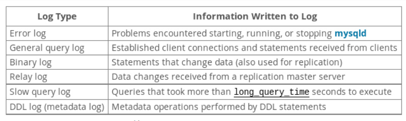

```shell
Error Log
[root@server ~]# vim /etc/my.cnf
log-error=/var/log/mysqld.log
编译安装的在/usr/local/mysql/

Binary Log:前提需要开启
[root@server ~]# vim /etc/my.cnf
log-bin=/var/log/mysql-bin/mylog  #如果不指定路径默认在/var/lib/mysql
server-id=1   #AB复制的时候使用，为了防止相互复制，会设置一个ID，来标识谁产生的日志

[root@server ~]# mkdir /var/log/mysql-bin
[root@server ~]# chown mysql.mysql /var/log/mysql-bin/
[root@server ~]# systemctl restart mysqld
```

```shell
查看binlog日志：开启之后等一会
[root@server mysql]# mysqlbinlog mylog.000001 -v
# at 4     #时间的开始位置
# end_log_pos 319 #事件结束的位置(position)
#190820 19:41:26  #时间点
注：
1. 重启mysqld 会截断
2. mysql> flush logs; 会截断
3. mysql> reset master; 删除所有binlog,不要轻易使用，相当于：rm -rf /
4. 删除部分
mysql> PURGE BINARY LOGS TO 'mylog.000004';   #删除mysqllog.000004之前的日志
5. 暂停 仅当前会话
SET SQL_LOG_BIN=0;  #关闭
SET SQL_LOG_BIN=1;  #开启
=====================================
解决binlog日志不记录insert语句
登录mysql后，设置binlog的记录格式：
mysql> set binlog_format=statement;
然后，最好在my.cnf中添加：
binlog_format=statement
修改完配置文件之后记得重启服务
================================================
Slow Query Log ： 慢查询日志
slow_query_log=1  #开启
slow_query_log_file=/var/log/mysql-slow/slow.log
long_query_time=3    #设置慢查询超时间，单位是秒

# mkdir /var/log/mysql-slow/
# chown mysql.mysql /var/log/mysql-slow/
# systemctl restart mysqld

验证查看慢查询日志
mysql> select sleep(6);
# cat /var/log/mysql-slow/slow.log
```

## 扩展

UNIX Socket连接方式其实不是一个网络协议，所以只能在MySQL客户端和数据库实例在同一台服务器上的情况下使用。**本地进程间通信的一种方式**

```shell
通过socket方式登录
查看sock的存放路径
[root@server ~]# cat /etc/my.cnf | grep sock
socket=/var/lib/mysql/mysql.sock
[root@server ~]# mysql -uroot -p'123' -S /var/lib/mysql/mysql.sock
```

# 数据备份与恢复

## percona-xtrabackup 物理备份

​    Xtrabackup是开源免费的支持MySQL 数据库热备份的软件，在 Xtrabackup 包中主要有 Xtrabackup 和 innobackupex 两个工具。其中 Xtrabackup 只能备份 InnoDB 和 XtraDB 两种引擎; innobackupex则是封装了Xtrabackup，同时增加了备份MyISAM引擎的功能。它不暂停服务创建Innodb**热备份**；

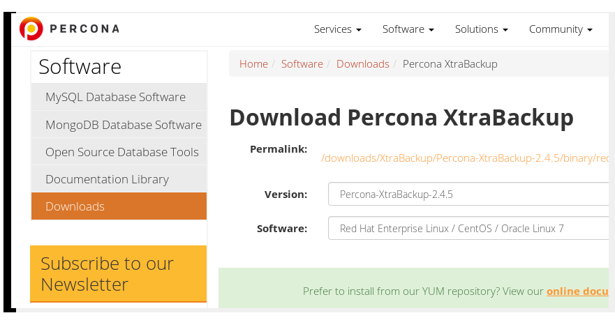

### 1、安装xtrabackup

```shell
步骤：
1、下载rpm包并安装
2、修改配置文件进行yum安装
```


```shell
安装xtrabackup
# wget http://www.percona.com/downloads/percona-release/redhat/0.1-4/percona-release-0.1-4.noarch.rpm
# rpm -ivh percona-release-0.1-4.noarch.rpm
[root@mysql-server yum.repos.d]# vim percona-release.repo
```

修改如下内容：将原来的1改为0

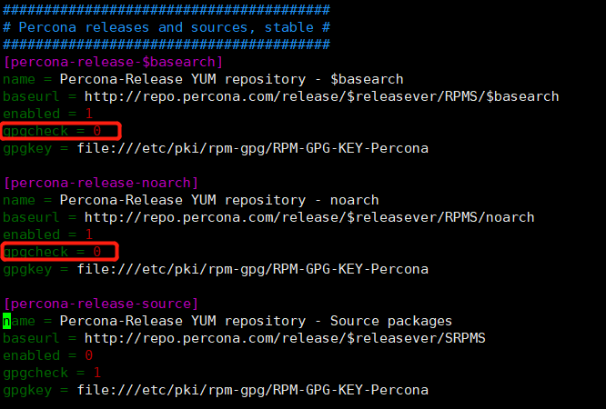

```shell
[root@mysql-server yum.repos.d]# yum -y install percona-xtrabackup-24.x86_64
```

注意

```shell
如果安装不上报错：
Transaction check error:
  file /etc/my.cnf from install of Percona-Server-shared-56-5.6.46-rel86.2.1.el7.x86_64 conflicts with file from package mysql-community-server-5.7.28-1.el7.x86_64
Error Summary  #说是冲突
解决方式如下：
1.先安装yum install mysql-community-libs-compat -y #安装包
2.在安装yum -y install percona-xtrabackup-24.x86_64

参考：https://www.cnblogs.com/EikiXu/p/10217931.html

方式二：
1.先安装percona-xtrabackup
2.在安装mysql
或者先将mysql源back了，重新建立yum缓存。在安装percona-xtrabackup。
```

以上安装方式如果失效，请用asukaev提供的方式：

```shell
======第一种========
[root@mysql-server ~]# vim /etc/yum.repos.d/Percona.repo 
[percona] 
name = CentOS $releasever - Percona 
baseurl=http://repo.percona.com/centos/$releasever/os/$basearch/ 
enabled = 1 
gpgkey = file:///etc/pki/rpm-gpg/RPM-GPG-KEY-percona 
gpgcheck = 1

[root@mysql-server yum.repos.d]# vim /etc/pki/rpm-gpg/RPM-GPG-KEY-percona
-----BEGIN PGP PUBLIC KEY BLOCK-----
Version: GnuPG v1.4.9 (GNU/Linux)

mQGiBEsm3aERBACyB1E9ixebIMRGtmD45c6c/wi2IVIa6O3G1f6cyHH4ump6ejOi
AX63hhEs4MUCGO7KnON1hpjuNN7MQZtGTJC0iX97X2Mk+IwB1KmBYN9sS/OqhA5C
itj2RAkug4PFHR9dy21v0flj66KjBS3GpuOadpcrZ/k0g7Zi6t7kDWV0hwCgxCa2
f/ESC2MN3q3j9hfMTBhhDCsD/3+iOxtDAUlPMIH50MdK5yqagdj8V/sxaHJ5u/zw
YQunRlhB9f9QUFfhfnjRn8wjeYasMARDctCde5nbx3Pc+nRIXoB4D1Z1ZxRzR/lb
7S4i8KRr9xhommFnDv/egkx+7X1aFp1f2wN2DQ4ecGF4EAAVHwFz8H4eQgsbLsa6
7DV3BACj1cBwCf8tckWsvFtserverCP4CiBB50Ku49MU2Nfwq7durfIiePF4IIYRDZgg
kHKSfP3oUZBGJx00BujtTobERraaV7lIRIwETZao76MqGt9K1uIqw4NT/jAbi9ce
rFaOmAkaujbcB11HYIyjtkAGq9mXxaVqCC3RPWGr+fqAx/akBLQ2UGVyY29uYSBN
eVNRTCBEZXZlbG9wbWVudCBUZWFtIDxteXNxbC1kZXZAcGVyY29uYS5jb20+iGAE
ExECACAFAksm3aECGwMGCwkIBwMCBBUCCAMEFgIDAQIeAQIXgAAKCRAcTL3NzS79
Kpk/AKCQKSEgwX9r8jR+6tAnCVpzyUFOQwCfX+fw3OAoYeFZB3eu2oT8OBTiVYu5
Ag0ESybdoRAIAKKUV8rbqlB8qwZdWlmrwQqg3o7OpoAJ53/QOIySDmqy5TmNEPLm
lHkwGqEserverbFYoTbOCEEJi2yFLg9UJCSBM/sfPaqb2jGP7fc0nZBgUBnFuA9USX72
O0PzVAF7rCnWaIz76iY+AMI6xKeRy91TxYo/yenF1nRSJ+rExwlPcHgI685GNuFG
chAExMTgbnoPx1ka1Vqbe6iza+FnJq3f4p9luGbZdSParGdlKhGqvVUJ3FLeLTqt
caOn5cN2ZsdakE07GzdSktVtdYPT5BNMKgOAxhXKy11IPLj2Z5C33iVYSXjpTelJ
b2qHvcg9XDMhmYJyE3O4AWFh2no3Jf4ypIcABA0IAJO8ms9ov6bFserverTqA0UW2gWQ
cKFN4Q6NPV6IW0rV61ONLUc0VFXvYDtwsRbUmUYkB/L/R9fHj4lRUDbGEQrLCoE+
/HyYvr2rxP94PT6Bkjk/aiCCPAKZRj5CFUKRpShfDIiow9qxtqv7yVd514Qqmjb4
eEihtcjltGAoS54+6C3lbjrHUQhLwPGqlAh8uZKzfSZq0C06kTxiEqsG6VDDYWy6
L7qaMwOqWdQtdekKiCk8w/FoovsMYED2qlWEt0i52G+0CjoRFx2zNsN3v4dWiIhk
ZSL00Mx+g3NA7pQ1Yo5Vhok034mP8L2fBLhhWaK3LG63jYvd0HLkUFhNG+xjkpeI
SQQYEQIACQUCSybdoQIbDAAKCRAcTL3NzS79KlacAJ0aAkBQapIaHNvmAhtVjLPN
wke4ZgCePe3sPPF49lBal7QaYPdjqapa1SQ=
=qcCk
-----END PGP PUBLIC KEY BLOCK-----

[root@mysql-server yum.repos.d]# yum -y install percona-xtrabackup
```

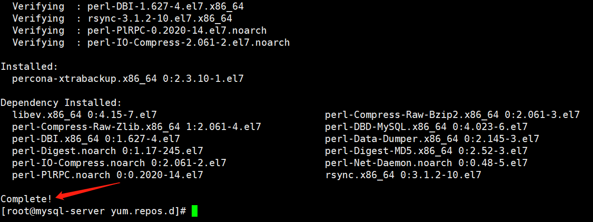

```shell
[root@mysql-server yum.repos.d]# innobackupex --version
innobackupex version 2.3.10 Linux (x86_64) (revision id: bd0d4403f36)
```

```shell
======第二种========
百度搜吧，明日香这边就是用的这种方式

访问以下链接：
https://zhuanlan.zhihu.com/p/140414143
```


下载完成，把包上传至服务器


### 2、完整备份流程

```
步骤
备份流程：
1、创建备份目录
2、innobackupex进行备份

恢复流程：
1. 停止数据库
2. 清理环境
3. 重演回滚－－> 恢复数据
4. 修改权限
5. 启动数据库
```


```shell
创建备份目录：
[root@mysql-server ~]# mkdir /xtrabackup/full -p
备份之前，进入数据库，存入些数据
[root@mysql-server ~]# mysql -uroot -p'123'
mysql> create database asukaev;
mysql> use asukaev;
Database changed
mysql> create table t1(id int);
备份：
[root@mysql-server ~]# innobackupex --user=root --password='123' /xtrabackup/full
```


```shell
可以查看一下:
[root@mysql-server ~]# cd /xtrabackup/full/
[root@mysql-server full]# ls
2020-12-07_14-31-13
====================================================================================
完全备份恢复流程
1. 停止数据库
2. 清理环境
3. 重演回滚－－> 恢复数据
4. 修改权限
5. 启动数据库
1.关闭数据库：
[root@mysql-server ~]# systemctl stop mysqld
[root@mysql-server ~]# rm -rf /var/lib/mysql/*		//删除所有数据
[root@mysql-server ~]# rm -rf /var/log/mysqld.log
[root@mysql-server ~]# rm -rf /var/log/mysql-slow/slow.log
2.重演恢复:
[root@mysql-server ~]# innobackupex --apply-log /xtrabackup/full/2019-08-20_11-47-49
```

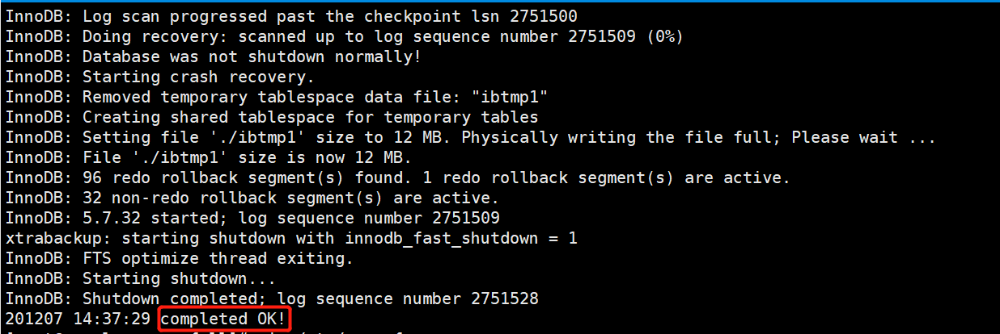

```shell
3.确认数据库目录：
恢复之前需要确认配置文件内有数据库目录指定，不然xtrabackup不知道恢复到哪里
# cat /etc/my.cnf
[mysqld]
datadir=/var/lib/mysql
4.恢复数据：
[root@mysql-server ~]# innobackupex --copy-back /xtrabackup/full/2019-08-20_11-47-49
```

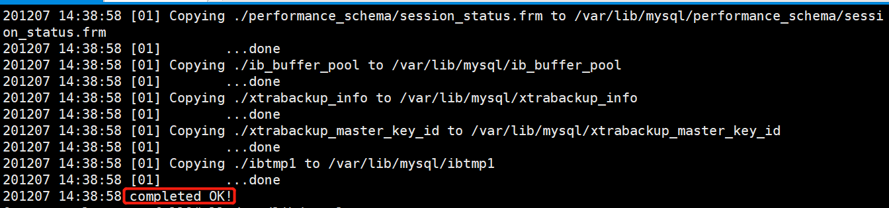

```shell
5.修改权限：
[root@mysql-server ~]# chown mysql.mysql  /var/lib/mysql  -R
启动数据库:
[root@mysql-server ~]# systemctl start mysqld
6.确认数据是否恢复
mysql> show databases;
+--------------------+
| Database           |
+--------------------+
| information_schema |
| mysql              |
| performance_schema |
| sys                |
| asukaev           |
+--------------------+
5 rows in set (0.00 sec)

mysql> use asukaev;
Database changed

mysql> show tables;
+--------------------+
| Tables_in_asukaev |
+--------------------+
| t1                 |
+--------------------+
1 row in set (0.00 sec)
===可以看到数据已恢复===
```

### 3、增量备份流程

  原理：每次备份上一次备份到现在产生的新数据

```shell
在数据库上面创建一个测试的库
```

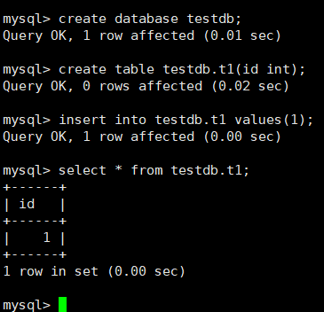

1.完整备份:周一

```shell
[root@mysql-server ~]# rm -rf /xtrabackup/*
[root@mysql-server ~]# innobackupex --user=root --password='123' /xtrabackup
[root@mysql-server ~]# cd /xtrabackup/
[root@mysql-server xtrabackup]# ls
2019-08-20_14-51-35
[root@mysql-server xtrabackup]# cd 2019-08-20_14-51-35/
[root@mysql-server 2019-08-20_14-51-35]# ls
backup-my.cnf  ib_buffer_pool  mysql               sys   testdb                  xtrabackup_info
company        ibdata1         performance_schema  test  xtrabackup_checkpoints  xtrabackup_logfile
```

2、增量备份：周二　——　周三

```shell
在数据库中插入周二的数据:
mysql> insert into testdb.t1 values(2);    #模拟周二
[root@mysql-server ~]# innobackupex --user=root --password='123' --incremental /xtrabackup/ --incremental-basedir=/xtrabackup/2019-08-20_14-51-35/
--incremental-basedir:基于哪个增量
[root@mysql-server ~]# cd /xtrabackup/
[root@mysql-server xtrabackup]# ls
2019-08-20_14-51-35  2019-08-20_15-04-29    ---相当于周二的增量备份
```

```shell
在数据库中插入周三的数据:
mysql> insert into testdb.t1 values(3);   #模拟周三
[root@mysql-server ~]# innobackupex --user=root --password='123' --incremental /xtrabackup/ --incremental-basedir=/xtrabackup/2019-08-20_15-04-29/      #基于前一天的备份为目录
[root@mysql-server ~]# cd /xtrabackup/
[root@mysql-server xtrabackup]# ls
2019-08-20_14-51-35  2019-08-20_15-04-29  2019-08-20_15-10-56   ---相当于周三的增量备份
```

```shell
查看一下备份目录:
[root@mysql-server ~]# ls /xtrabackup/
2019-08-20_14-51-35  2019-08-20_15-04-29  2019-08-20_15-10-56
    全备周一             增量周二               增量周三
```

```shell
增量备份恢复流程
1. 停止数据库
2. 清理环境
3. 依次重演回滚redo log－－> 恢复数据
4. 修改权限
5. 启动数据库
```

```shell
[root@mysql-server ~]# systemctl stop mysqld
[root@mysql-server ~]# rm -rf /var/lib/mysql/*
依次重演回滚redo log:
[root@mysql-server ~]# innobackupex --apply-log --redo-only /xtrabackup/2019-08-20_14-51-35
周二 ---  周三
[root@mysql-server ~]# innobackupex --apply-log --redo-only /xtrabackup/2019-08-20_14-51-35 --incremental-dir=/xtrabackup/2019-08-20_15-04-29
--incremental-dir：增量目录
[root@mysql-server ~]# innobackupex --apply-log --redo-only /xtrabackup/2019-08-20_14-51-35 --incremental-dir=/xtrabackup/2019-08-20_15-10-56/
恢复数据:
[root@mysql-server ~]# innobackupex --copy-back /xtrabackup/2019-08-20_14-51-35/
修改权限
[root@mysql-server ~]# chown -R mysql.mysql /var/lib/mysql
[root@mysql-server ~]# systemctl start mysqld
登陆上去看一下:
```

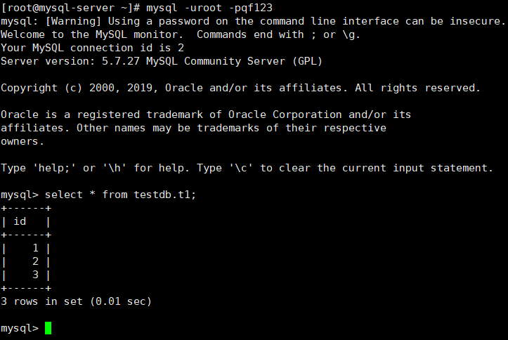

### 4、差异备份流程

清理备份的环境:

```shell
[root@mysql-server ~]# rm -rf /xtrabackup/*
登陆数据库，准备环境
mysql> delete from testdb.t1;
mysql> insert into testdb.t1 values(1);    #插入数据1，模拟周一
mysql> select * from testdb.t1;
+------+
| id   |
+------+
|    1 |
+------+
mysql> \q
查看时间:
[root@mysql-server ~]# date
Tue Aug 20 15:39:59 CST 2019
1、完整备份：周一
[root@mysql-server ~]# innobackupex --user=root --password='123' /xtrabackup
2、差异备份：周二　——　周三
语法: # innobackupex --user=root --password=888 --incremental /xtrabackup --incremental-basedir=/xtrabackup/完全备份目录（周一）
3.修改时间：
[root@mysql-server ~]# date 08211543
Wed Aug 21 15:43:00 CST 2019
4.在登陆mysql：
mysql> insert into testdb.t1 values(2);  #插入数据2，模拟周二
差异备份周二的
[root@mysql-server ~]# innobackupex --user=root --password='123' --incremental /xtrabackup --incremental-basedir=/xtrabackup/2019-08-20_15-42-02/  #备份目录基于周一的备份
5.再次登陆mysql
mysql> insert into testdb.t1 values(3);  #插入数据，模拟周三
6.在次修改时间
[root@mysql-server ~]# date 08221550
Thu Aug 22 15:50:00 CST 2019
7.在次差异备份
[root@mysql-server ~]# innobackupex --user=root --password='123' --incremental /xtrabackup --incremental-basedir=/xtrabackup/2019-08-20_15-42-02/  #还是基于周一的备份
8.延申到周四
mysql> insert into testdb.t1 values(4);
9.修改时间
[root@mysql-server ~]# date 08231553
Fri Aug 23 15:53:00 CST 2019
10.差异备份周四
[root@mysql-server ~]# innobackupex --user=root --password='123' --incremental /xtrabackup --incremental-basedir=/xtrabackup/2019-08-20_15-42-02/   #还是基于周一的备份
11.查看一下备份目录
[root@mysql-server ~]# ls /xtrabackup/
2019-08-20_15-42-02  2019-08-21_15-46-53  2019-08-22_15-51-15  2019-08-23_15-53-28
   周一                   周二                   周三               周四
```

```shell
差异备份恢复流程
1. 停止数据库
2. 清理环境
3. 重演回滚redo log（周一，某次差异）－－> 恢复数据
4. 修改权限
5. 启动数据库
停止数据库
[root@mysql-server ~]# systemctl stop mysqld
[root@mysql-server ~]# rm -rf /var/lib/mysql/*
1.恢复全量的redo log
语法: # innobackupex --apply-log --redo-only /xtrabackup/完全备份目录（周一）
[root@mysql-server ~]# innobackupex --apply-log --redo-only /xtrabackup/2019-08-20_15-42-02/
2.恢复差异的redo log
语法:# innobackupex --apply-log --redo-only /xtrabackup/完全备份目录（周一）--incremental-dir=/xtrabacku/某个差异备份
这里我们恢复周三的差异备份
[root@mysql-server ~]# innobackupex --apply-log --redo-only /xtrabackup/2019-08-20_15-42-02/ --incremental-dir=/xtrabackup/2019-08-22_15-51-15/   #我们恢复周三的差异备份
3.恢复数据
语法:# innobackupex --copy-back /xtrabackup/完全备份目录（周一）
[root@mysql-server ~]# innobackupex --copy-back /xtrabackup/2019-08-20_15-42-02/
修改权限：
[root@mysql-server ~]# chown -R mysql.mysql /var/lib/mysql
[root@mysql-server ~]# systemctl start mysqld
```

登陆mysql查看一下:

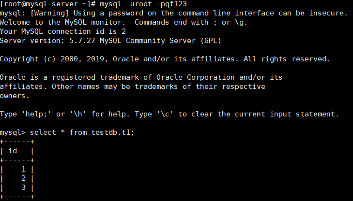

只有123.因为我们恢复的是周三的差异备份。

### 4、mysqldump逻辑备份   ---- 推荐优先使用

mysqldump 是 MySQL 自带的逻辑备份工具。可以保证数据的一致性和服务的可用性。

如何保证数据一致?在备份的时候进行锁表会自动锁表。锁住之后在备份。

```shell
本身为客户端工具:
远程备份语法: # mysqldump  -h 服务器  -u用户名  -p密码   数据库名  > 备份文件.sql
本地备份语法: # mysqldump  -u用户名  -p密码   数据库名  > 备份文件.sql
```

##### **1、常用备份选项**

```shell
-A, --all-databases #备份所有库

-B, --databases  #备份多个数据库

-F, --flush-logs #备份之前刷新binlog日志

--default-character-set #指定导出数据时采用何种字符集，如果数据表不是采用默认的latin1字符集的话，那么导出时必须指定该选项，否则再次导入数据后将产生乱码问题。

--no-data，-d #不导出任何数据，只导出数据库表结构。

--lock-tables #备份前，锁定所有数据库表

--single-transaction #保证数据的一致性和服务的可用性

-f, --force #即使在一个表导出期间得到一个SQL错误，继续。
```

**注意**

```shell
使用 mysqldump 备份数据库时避免锁表:
对一个正在运行的数据库进行备份请慎重！！ 如果一定要 在服务运行期间备份，可以选择添加 --single-transaction选项，

类似执行： mysqldump --single-transaction -u root -p123456 dbname > mysql.sql
```

##### 2、备份表

```shell
语法: # mysqldump -u root -p1 db1  t1 > /db1.t1.bak
[root@mysql-server ~]# mkdir /home/back  #创建备份目录
[root@mysql-server ~]# mysqldump -uroot -p'123' company employee5 > /home/back/company.employee5.bak
备份多个表：
语法: mysqldump -u root -p1 db1 t1   t2 > /db1.t1_t2.bak
[root@mysql-server ~]# mysqldump -uroot -p'123' company new_t1 new_t2  > /home/back/company.new_t1_t2.bak
```

##### 3、备份库

```shell
备份一个库：相当于将这个库里面的所有表全部备份。
语法: # mysqldump -u root -p1 db1 > /db1.bak
[root@mysql-server ~]# mysqldump -uroot -p'123' company > /home/back/company.bak
备份多个库：
语法：mysqldump  -u root -p1 -B  db1 db2 db3 > /db123.bak
[root@mysql-server ~]# mysqldump -uroot -p'123' -B company testdb > /home/back/company_testdb.bak
备份所有的库：
语法：# mysqldump  -u root -p1 -A > /alldb.bak
[root@mysql-server ~]# mysqldump -uroot -p'123' -A > /home/back/allbase.bak
```

到目录下面查看一下：

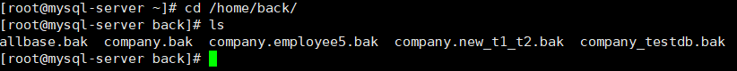

##### 4、恢复数据库和表

  ```shell
为保证数据一致性，应在恢复数据之前停止数据库对外的服务,停止binlog日志 因为binlog使用binlog日志恢复数据时也会产生binlog日志。
  ```

为实验效果先将刚才备份的数据库和表删除了。登陆数据库：

```shell
[root@mysql-server ~]# mysql -uroot -p123
mysql> show databases;
```

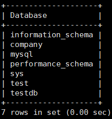

```shell
mysql> drop database company;
mysql> \q
```

##### 5、恢复库

```shell
登陆mysql创建一个库
mysql> create database company;
恢复：
[root@mysql-server ~]# mysql -uroot -p'123' company < /home/back/company.bak
```

##### 6、恢复表

```shell
登陆到刚才恢复的库中将其中的一个表删除掉
mysql> show databases;
mysql> use company
mysql> show tables;
+-------------------+
| Tables_in_company |
+-------------------+
| employee5         |
| new_t1            |
| new_t2            |
+-------------------+
mysql> drop table employee5;
开始恢复:
mysql> set sql_log_bin=0;   #停止binlog日志
Query OK, 0 rows affected (0.00 sec)
mysql> source /home/back/company.employee5.bak;  -------加路径和备份的文件 

恢复方式二：
# mysql -u root -p1  db1  < db1.t1.bak
                     库名    备份的文件路径
```

##### 7、备份及恢复表结构

```shell
1.备份表结构：
语法：mysqldump  -uroot -p123456 -d database table > dump.sql
[root@mysql-server ~]# mysqldump -uroot -p'123' -d company employee5 > /home/back/emp.bak
恢复表结构：
登陆数据库创建一个库
mysql> create database t1;
语法：# mysql -u root -p1 -D db1  < db1.t1.bak
[root@mysql-server ~]# mysql -uroot -p'123' -D t1 < /home/back/emp.bak
```

登陆数据查看：

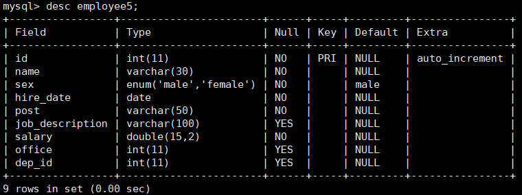

##### 8、数据的导入导出,没有表结构。

 ```shell
表的导出和导入只备份表内记录，不会备份表结构，需要通过mysqldump备份表结构，恢复时先恢复表结构，再导入数据。
 ```

```shell
mysql> show variables like "secure_file_priv";  ----查询导入导出的目录。 
```


```shell
修改安全文件目录：
1.创建一个目录：mkdir  路径目录
[root@mysql-server ~]# mkdir /sql
2.修改权限
[root@mysql-server ~]# chown mysql.mysql /sql
3.编辑配置文件：
vim /etc/my.cnf
在[mysqld]里追加
secure_file_priv=/sql
4.重新启动mysql.
```

```shell
1.导出数据
登陆数据查看数据
mysql> show databases;    #找到test库
mysql> use test   #进入test库
mysql> show tables;  #找到它t3表
mysql> select * from t3 into outfile '/sql/test.t3.bak';
```

```shell
2.数据的导入
先将原来表里面的数据清除掉，只保留表结构
mysql> delete from t3;
mysql> load data infile '/sql/test.t3.bak' into table t3;
如果将数据导入别的表，需要创建这个表并创建相应的表结构。
```

### 5、通过binlog恢复

```shell
步骤：
1、开启binlog日志
2、创建目录并修改权限
3、根据位置恢复
4、测试
```

开启binlog日志：

```shell
[root@mysql-server ~]# vim /etc/my.cnf
log-bin=/var/log/sql-bin/mylog
server-id=1
```

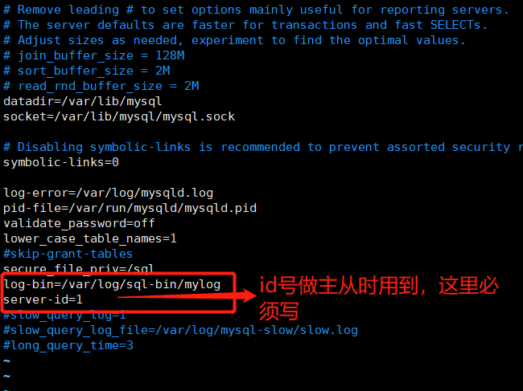

创建目录并修改权限

```shell
[root@mysql-server ~]# mkdir /var/log/sql-bin
[root@mysql-server ~]# chown mysql.mysql /var/log/sql-bin
[root@mysql-server ~]# systemctl restart mysqld
```

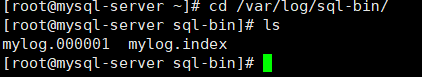

```shell
mysql> flush logs; #刷新binlog日志会截断产生新的日志文件

mysql> create table testdb.t3(id int);   #创建一个表
```

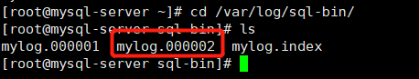

根据位置恢复

找到要恢复的sql语句的起始位置、结束位置

```shell
[root@mysql-server sql-bin]# mysqlbinlog mylog.000002 
```

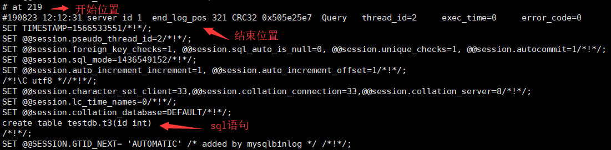

测试

```shell
[root@mysql-server ~]# mysql -uroot -p'123'
mysql> drop table testdb.t3;   #将这个表删除
Query OK, 0 rows affected (0.01 sec)
恢复：
[root@mysql-server ~]# cd /var/log/sql-bin/
[root@mysql-server sql-bin]# mysqlbinlog --start-position 219 --stop-position 321 mylog.000002 | mysql -uroot -p'123'
mysql: [Warning] Using a password on the command line interface can be insecure.
```

查看：

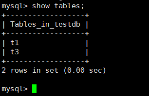

# mysql优化

```shell
引擎：
查看引擎：
mysql> show engines;
mysql> SHOW VARIABLES LIKE '%storage_engine%';
mysql> show create table t1;   ---查看建表信息

临时指定引擎：
mysql> create table innodb1(id int)engine=innodb;
修改默认引擎： 
/etc/my.cnf
[mysqld]
default-storage-engine=INNODB  ----引擎
修改已经存在的表的引擎：
mysql> alter table t2 engine=myisam;
```

```shell
mysql常用命令：
    mysql> show warnings    查看最近一个sql语句产生的错误警告，看其他的需要看.err日志
    mysql> show processlist 显示系统中正在运行的所有进程。
    mysql> show errors   查看最近一个sql语句产生的错误信息
```

```shell
字符集设置
    临时：
        mysql> create database db1 CHARACTER SET = utf8;
        mysql> create table t1(id int(10)) CHARACTER SET = utf8;      
        
          5.7/ 5.5版本设置：
            [mysqld]
            character_set_server = utf8
===========================================================================================
慢查询：  
  查看是否设置成功：
    mysql> show variables like '%query%'; 
```

```shell
当连接数的数值过小会经常出现ERROR 1040: Too many connections错误。
这是是查询数据库当前设置的最大连接数
mysql> show variables like '%max_connections%';

强制限制mysql资源设置:
# vim /etc/my.cnf
max_connections = 1024  并发连接数，根据实际情况设置连接数。
connect_timeout= 5   单位秒 ----超时时间，默认30秒
```

```shell
innodb引擎：       
   innodb-buffer-pool-size   //缓存 InnoDB 数据和索引的内存缓冲区的大小
innodb-buffer-pool-size=#   ----值     
        这个值设得越高,访问表中数据需要得磁盘 I/O 越少。在一个专用的数据库服务器上,你可以设置这个参数达机器物理内存大小的 80%。
# vim /etc/my.cnf
innodb-buffer-pool-size=2G
```


# AB复制

```shell
A：准备环境：关闭防火墙和selinux，时间一致，机器的版本一致，yum安装mysql

B：master：
1、vim /etc/my.cnf修改配置文件
2、登陆mysql创建账户

C：slave：
1、vim /etc/my.cnf修改配置文件
2、登陆mysql进行\e编辑(ip地址，授权用户，密码)
3、查看sql和IO是不是yes
```

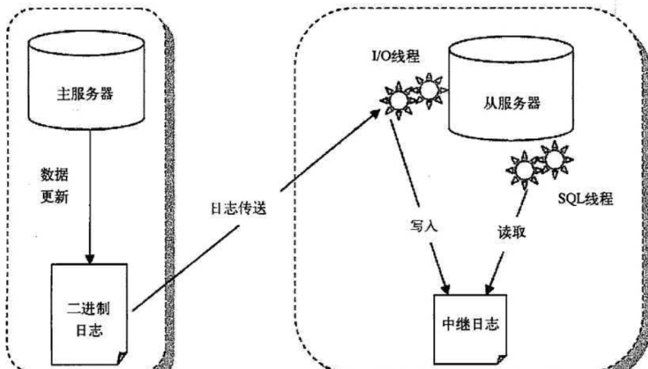


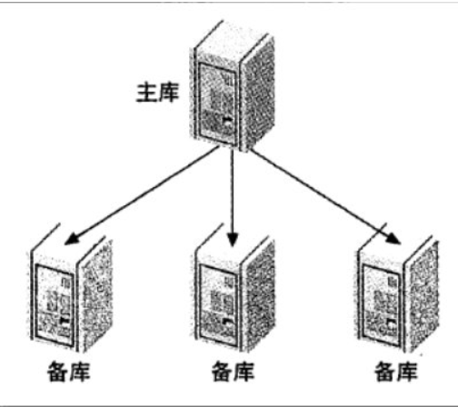

```shell
准备环境两台机器，关闭防火墙和selinux。---两台机器环境必须一致。时间也得一致
```

```shell
192.168.246.129  mysql-master
192.168.246.128  mysql-slave
```

```shell
两台机器安装mysql5.7
[root@mysql-master ~]# wget https://dev.mysql.com/get/mysql80-community-release-el7-3.noarch.rpm
[root@mysql-master ~]# yum -y install mysql-community-server
安装略...
[root@mysql-master ~]# systemctl start mysqld
[root@mysql-master ~]# systemctl enable mysqld
[root@mysql-master ~]# netstat -lntp | grep 3306
tcp6       0      0 :::3306                 :::*                    LISTEN      11669/mysqld
[root@mysql-slave ~]# netstat -lntp | grep 3306
tcp6       0      0 :::3306                 :::*                    LISTEN      11804/mysqld
配置并修改密码
略....
```

```shell
master操作：
[root@mysql-master ~]# vim /etc/my.cnf   #在[mysqld]下添加如下内容
server-id=1   #定义server id master必写 
log-bin = mylog #开启binlog日志，master比写
gtid_mode = ON    #开启gtid
enforce_gtid_consistency=1   #强制gtid
[root@mysql-master ~]# systemctl restart mysqld   #重启
主服务器创建账户：
mysql> grant replication  slave,reload,super on *.*  to 'slave'@'%' identified by 'server@12345！';
#注:生产环境中密码采用高级别的密码，实际生产环境中将'%'换成slave的ip
mysql> flush privileges;

注意:如果不成功删除以前的binlog日志
replication slave：拥有此权限可以查看从服务器，从主服务器读取二进制日志。
super权限：允许用户使用修改全局变量的SET语句以及CHANGE  MASTER语句
reload权限：必须拥有reload权限，才可以执行flush  [tables | logs | privileges]
```

```shell
slave操作：
[root@mysql-slave ~]# vim /etc/my.cnf  #添加如下配置
server-id=2
gtid_mode = ON
enforce_gtid_consistency=1
master-info-repository=TABLE
relay-log-info-repository=TABLE
[root@mysql-slave ~]# systemctl restart mysqld
[root@mysql-slave ~]# mysql -uroot -p'123'   #登陆mysql
mysql> \e
change master to
master_host='master1',      #主ip 地址  最好用域名
master_user='授权用户',     #主服务上面创建的用户
master_password='授权密码', 
master_auto_position=1;
-> ;
Query OK, 0 rows affected, 2 warnings (0.02 sec)
```

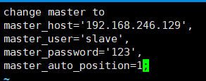

```shell
mysql> start slave;   #启动slave角色
Query OK, 0 rows affected (0.00 sec)

mysql> show slave status\G  #查看状态，验证sql和IO是不是yes。
```

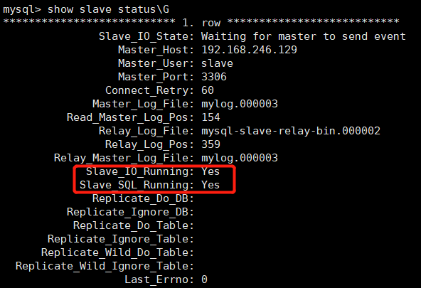

测试

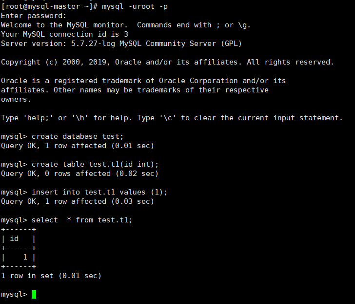

在slave上面查看一下有没有同步过去：

```shell
[root@mysql-slave ~]# mysql -uroot -p'123'
mysql> show databases;
+--------------------+
| Database           |
+--------------------+
| information_schema |
| mysql              |
| performance_schema |
| sys                |
| test               |
+--------------------+
mysql> use test
mysql> show tables;
+----------------+
| Tables_in_test |
+----------------+
| t1             |
+----------------+
mysql> select * from t1;
+------+
| id   |
+------+
|    1 |
+------+
```

# 主从复制binlog日志方式

```shell
A：准备环境：关闭防火墙和selinux，时间一致，机器的版本一致，安装mysql

B：master：
1、vim /etc/my.cnf修改配置文件
2、创建日志并赋予权限
3、重启服务并查找主从同步用户密码且修改
4、查看position号码

C：slave1
1、vim /etc/my.cnf修改配置文件
2、登陆mysql进行\e编辑(ip地址，授权用户，密码，mysql-bin)
3、查看sql和IO是不是yes

D：再增加一台slave2
1、先将master服务上面的数据备份出来。导入slave2的mysql中并远程拷贝到slave2
2、从库导入主库传输的数据
3、同slave1一样的操作
```


```shell
192.168.246.135    mysql-master
192.168.246.136    mysql-slave
准备两台机器，关闭防火墙和selinux。---两台机器环境必须一致。时间也得一致
```

```shell
两台机器配置hosts解析
192.168.246.135 mysql-master
192.168.246.136 mysql-slave
两台机器安装mysql
# wget https://dev.mysql.com/get/mysql80-community-release-el7-3.noarch.rpm
略...
[root@mysql-master ~]# systemctl start mysqld
[root@mysql-master ~]# systemctl enable mysqld
```

开始配置主服务

```shell
1、在主服务器上，必须启用二进制日志记录并配置唯一的服务器ID。需要重启服务器。
```

编辑主服务器的配置文件 `my.cnf`，添加如下内容

```shell
[root@mysql-server ~]# vim /etc/my.cnf
添加配置
[mysqld]
log-bin=/var/log/mysql/mysql-bin
server-id=1
```

创建日志目录并赋予权限

```shell
[root@mysql-master ~]# mkdir /var/log/mysql
[root@mysql-master ~]# chown mysql.mysql /var/log/mysql
```

重启服务

```shell
[root@mysql-master ~]# systemctl restart mysqld
```

查找密码

```shell
[root@mysql-master ~]# grep pass /var/log/mysqld.log
```

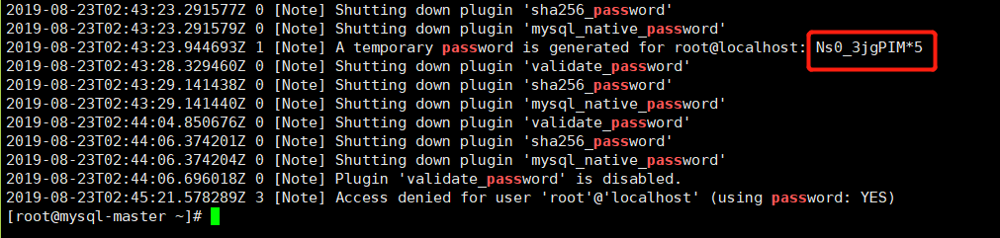

修改密码

```mysql
[root@mysql-master ~]# mysqladmin -uroot -p'Ns0_3jgPIM*5' password 'server@12345!'
创建主从同步的用户：
mysql> GRANT REPLICATION SLAVE ON *.*  TO  'repl'@'%'  identified by 'server@12345!';
mysql> flush privileges;
```

在主服务器上面操作

```mysql
mysql> show master status\G
```

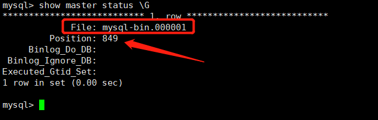

在从服务上面操作：

`my.cnf`配置文件

```shell
[mysqld]
server-id=2
重启服务
[root@mysql-slave ~]# systemctl restart mysqld
设置密码
[root@mysql-slave ~]# grep pass /var/log/mysqld.log
[root@mysql-slave ~]# mysqladmin -uroot -p'ofeUcgA)4/Yg' password 'server@12345!'
登录mysql
[root@mysql-slave ~]# mysql -uroot -p'server@12345!'
stop slave;
mysql> \e
CHANGE MASTER TO
MASTER_HOST='mysql-master',
MASTER_USER='repl',
MASTER_PASSWORD='server@12345!',
MASTER_LOG_FILE='mysql-bin.000001',
MASTER_LOG_POS=849;
    -> ;
mysql> start slave;
mysql> show slave status\G
```

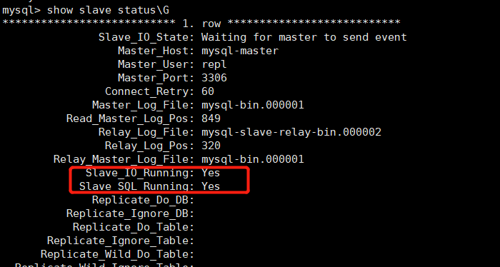

```shell
参数解释：
CHANGE MASTER TO
MASTER_HOST='master2.example.com',      #主服务器ip
MASTER_USER='replication',                        #主服务器用户
MASTER_PASSWORD='password',               #用户密码
MASTER_PORT=3306,                                #端口
MASTER_LOG_FILE='master2-bin.001',      #binlog日志文件名称
MASTER_LOG_POS=4,               #日志位置
```

在master上面执行：

```shell
mysql> create database testdb;   #创建一个库
Query OK, 1 row affected (0.10 sec)

mysql> \q
```

故障排错

```shell
#### UUID一致，导致主从复制I/O线程不是yes

> Fatal error: The slave I/O thread stops because master and slave have equal MySQL server UUIDs; these UUIDs must be different for replication to work

致命错误：由于master和slave具有相同的mysql服务器uuid，导致I/O线程不进行；这些uuid必须不同才能使复制工作。

问题提示主从使用了相同的server UUID，一个个的检查：

检查主从server_id

主库：

mysql>  show variables like 'server_id';
+---------------+-------+
| Variable_name | Value |
+---------------+-------+
| server_id     | 1     |
+---------------+-------+
1 row in set (0.01 sec)

从库：

mysql>  show variables like 'server_id';
+---------------+-------+
| Variable_name | Value |
+---------------+-------+
| server_id     | 2     |
+---------------+-------+
1 row in set (0.01 sec)

server_id不一样，排除。

检查主从状态：

主库：

mysql> show master status;
+------------------+----------+--------------+------------------+-------------------+
| File             | Position | Binlog_Do_DB | Binlog_Ignore_DB | Executed_Gtid_Set |
+------------------+----------+--------------+------------------+-------------------+
| mysql-bin.000001 |      154 |              |                  |                   |
+------------------+----------+--------------+------------------+-------------------+
1 row in set (0.00 sec)
从库：

mysql> show master status;
+------------------+----------+--------------+------------------+-------------------+
| File             | Position | Binlog_Do_DB | Binlog_Ignore_DB | Executed_Gtid_Set |
+------------------+----------+--------------+------------------+-------------------+
| mysql-bin.000001 |      306 |              |                  |                   |
+------------------+----------+--------------+------------------+-------------------+
1 row in set (0.00 sec)

File一样，排除。

最后检查发现他们的auto.cnf中的server-uuid是一样的。。。

[root@localhost ~]# vim /var/lib/mysql/auto.cnf

[auto]

server-uuid=4f37a731-9b79-11e8-8013-000c29f0700f

修改uuid并重启服务
```

```shell
在准备一台虚拟机做为slave2，关闭防火墙和selinux
192.168.246.130       #mysql-slave2
```

```shell
1.由于刚才测试已经有了数据，需要先将master服务上面的数据备份出来。导入slave2的mysql中。这样才能保证集群中的机器环境一致。
在master操作：
[root@mysql-master ~]# mysqldump -uroot -p'123' --set-gtid-purged=OFF test > test.sql
[root@mysql-master ~]# ls
test.sql
[root@mysql-master ~]# scp test.sql 192.168.246.130:/root/   #拷贝到slave2
```

```shell
#### 开启 GTID 后的导出导入数据的注意点

> Warning: A partial dump from a server that has GTIDs will by default include the GTIDs of all transactions, even those that changed suppressed parts of the database. If you don't want to restore GTIDs, pass --set-gtid-purged=OFF. To make a complete dump, pass --all-databases --triggers --routines --events

意思是： 当前数据库实例中开启了 GTID 功能, 在开启有 GTID 功能的数据库实例中, 导出其中任何一个库, 如果没有显示地指定--set-gtid-purged参数, 都会提示这一行信息. 意思是默认情况下, 导出的库中含有 GTID 信息, 如果不想导出包含有 GTID 信息的数据库, 需要显示地添加--set-gtid-purged=OFF参数.

mysqldump -uroot  -p  --set-gtid-purged=OFF   --all-databases > alldb.db

导入数据是就可以相往常一样导入了。
mysql -uroot -p'123' company < /home/back/company.bak
```


```shell
slave2操作：
安装mysql5.7
[root@mysql-slave2 ~]# wget https://dev.mysql.com/get/mysql80-community-release-el7-3.noarch.rpm
安装略...
[root@mysql-slave2 ~]# systemctl start mysqld
[root@mysql-slave2 ~]# systemctl enable mysqld
登陆mysql创建一个test的库
[root@mysql-slave2 ~]# mysql -uroot -p'server@12345!'
mysql> create database test;
[root@mysql-slave2 ~]# mysql -uroot -p'server@12345!'  test < test.sql #将数据导入。
```

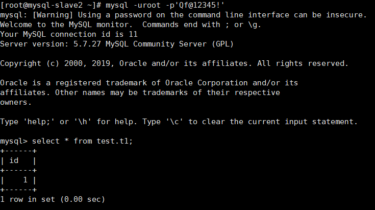

```shell
开始配置slave2
[root@mysql-slave2 ~]# vim /etc/my.cnf
server-id=3    #每台机器的id不一样
gtid_mode = ON
enforce_gtid_consistency=1
master-info-repository=TABLE
relay-log-info-repository=TABLE
[root@mysql-slave2 ~]# systemctl restart mysqld
[root@mysql-slave2 ~]# mysql -uroot -p'server@12345!'
mysql> \e
change master to
master_host='192.168.246.129',
master_user='slave',
master_password='123',
master_auto_position=1;
    -> ;
mysql> start slave;  #将slave启动起来
mysql> show slave status\G  #查看一下状态
```

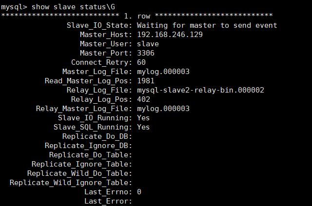

测试：

在master上面在创建一个库：

```shell
[root@mysql-master ~]# mysql -uroot -p'123'
mysql> create database server;
mysql> create table server.t1(id int);
mysql> insert into server.t1 values (1);
mysql>
```

两台slave

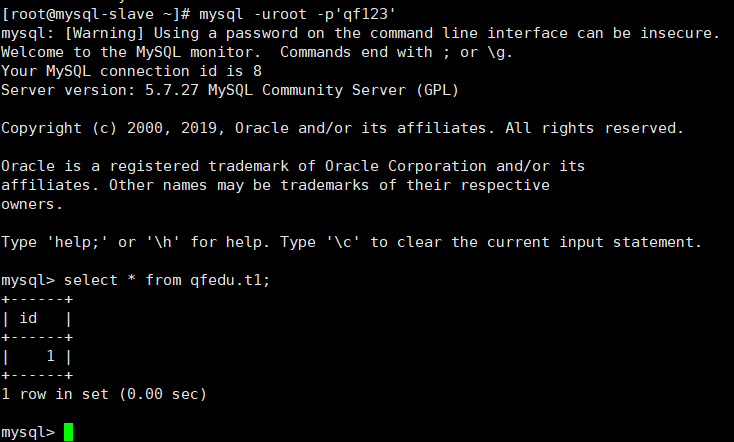

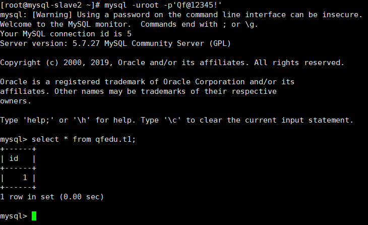

主从同步完成！

```shell
注意: 在关闭和启动mysql服务的时候按顺序先启动master。
```


# 读写分离

```shell
步骤：
1、安装jdk环境(下载包、添加环境变量)
2、下载并配置mycat配置文件(逻辑库和分表设置，数据节点，主机组，健康检查，读写配置.....)
3、master数据库上给用户授权
4、启动mycat服务
```

架构

这里是在mysql主从复制实现的基础上，利用mycat做读写分离，架构图如下

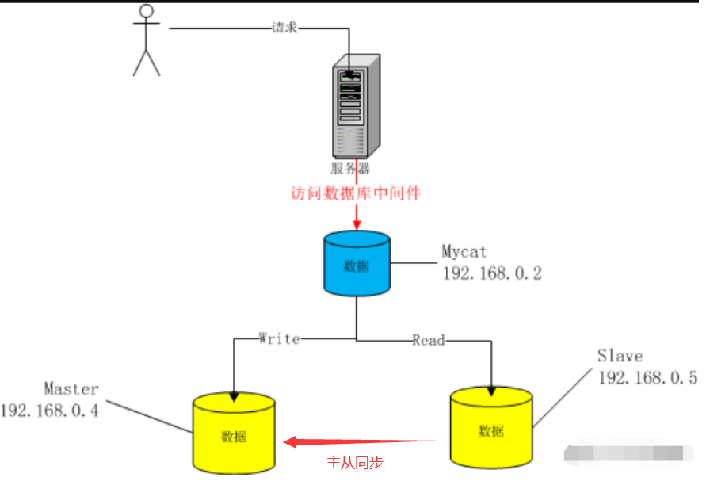

部署环境：

安装jdk

```shell
下载jdk账号：
账号：liwei@xiaostudy.com
密码：OracleTest1234
将jdk上传到服务器中，
[root@mycat ~]# tar xzf jdk-8u221-linux-x64.tar.gz -C /usr/local/
[root@mycat ~]# cd /usr/local/
[root@mycat local]# mv jdk1.8.0_221/ java 
设置环境变量
[root@mycat local]# vim /etc/profile  #添加如下内容，
JAVA_HOME=/usr/local/java
PATH=$JAVA_HOME/bin:$PATH
export CLASSPATH=.:$JAVA_HOME/lib/dt.jar:$JAVA_HOME/lib/tools.jar
[root@mycat local]# source /etc/profile


java -version
```

## 部署mycat


```shell
下载
[root@mycat ~]# wget http://dl.mycat.io/1.6.5/Mycat-server-1.6.5-release-20180122220033-linux.tar.gz
解压
[root@mycat ~]# tar xf Mycat-server-1.6.5-release-20180122220033-linux.tar.gz -C /usr/local/
```

配置mycat

```shell
认识配置文件

MyCAT 目前主要通过配置文件的方式来定义逻辑库和相关配置:

/usr/local/mycat/conf/server.xml  #定义用户以及系统相关变量，如端口等。其中用户信息是前端应用程序连接 mycat 的用户信息。
/usr/local/mycat/conf/schema.xml  #定义逻辑库，表、分片节点等内容。
```

配置server.xml

以下为代码片段

**下面的用户和密码是应用程序连接到 MyCat 使用的，可以自定义配置**

而其中的schemas 配置项所对应的值是逻辑数据库的名字，也可以自定义，但是这个名字需要和后面 schema.xml 文件中配置的一致。

```shell
[root@mycat ~]# cd /usr/local/mycat/conf/
[root@mycat conf]# vim server.xml
...
  <!--下面的用户和密码是应用程序连接到 MyCat 使用的.schemas 配置项所对应的值是逻辑数据库的名字,这个名字需要和后面 schema.xml 文件中配置的一致。-->      

        <user name="root" defaultAccount="true">
                <property name="password">server@12345!</property>
                <property name="schemas">testdb</property>

                <!-- 表级 DML 权限设置 -->
                <!--            
                <privileges check="false">
                        <schema name="TESTDB" dml="0110" >
                                <table name="tb01" dml="0000"></table>
                                <table name="tb02" dml="1111"></table>
                        </schema>
                </privileges>           
                 -->
        </user>
        <!--
<!--下面是另一个用户，并且设置的访问 TESTED 逻辑数据库的权限是 只读。可以注释掉
        <user name="user">
                <property name="password">user</property>
                <property name="schemas">TESTDB</property>
                <property name="readOnly">true</property>
        </user>
         -->
</mycat:server>
```

== 上面的配置中，假如配置了用户访问的逻辑库，那么必须在 `schema.xml` 文件中也配置这个逻辑库，否则报错，启动 mycat 失败 ==

明日香特意更换的配置：

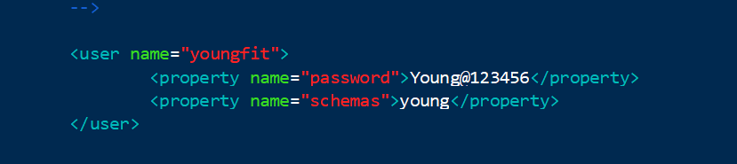

## 配置schema.xml

以下是配置文件中的每个部分的配置块儿

## **逻辑库和分表设置**

```mysql
<schema name="testdb"           // 逻辑库名称,与server.xml的一致
        checkSQLschema="false"    // 不检查sql
        sqlMaxLimit="100"         // 最大连接数
        dataNode="dn1">        //  数据节点名称
<!--这里定义的是分表的信息-->        
</schema>
```

## **数据节点**

```mysql
<dataNode name="dn1"             // 此数据节点的名称
          dataHost="localhost1"     // 主机组虚拟的
          database="testdb" />  // 真实的数据库名称
```

## **主机组**

```mysql
<dataHost name="localhost1"                       // 主机组
          maxCon="1000" minCon="10"               // 连接
          balance="0"                             // 负载均衡
          writeType="0"                           // 写模式配置
          dbType="mysql" dbDriver="native"        // 数据库配置
          switchType="1"  slaveThreshold="100">
<!--这里可以配置关于这个主机组的成员信息，和针对这些主机的健康检查语句-->
</dataHost>
```

```shell
balance 属性
负载均衡类型,目前的取值有 3 种:
1. balance="0", 不开启读写分离机制,所有读操作都发送到当前可用的 writeHost 上。
2. balance="1", 全部的 readHost 与  writeHost 参与 select 语句的负载均衡,简单的说,当双主双从模式(M1->S1,M2->S2,并且 M1 与 M2 互为主备),正常情况下,M2,S1,S2 都参与 select 语句的负载均衡。
3. balance="2", 所有读操作都随机的在 writeHost、readhost 上分发。
4. balance="3", 所有读请求随机的分发到 wiriterHost 对应的 readhost 执行,writerHost 不负担读压力, #注意 balance=3 只在 1.4 及其以后版本有,1.3 没有。

writeType 属性
负载均衡类型
1. writeType="0", 所有写操作发送到配置的第一个 writeHost,第一个挂了切换到还生存的第二个writeHost,重新启动后已切换后的为准.
2. writeType="1",所有写操作都随机的发送到配置的 writeHost,#版本1.5 以后废弃不推荐。
```

## **健康检查**

```mysql
<heartbeat>select user()</heartbeat>	#对后端数据进行检测，执行一个sql语句，user()内部函数
```

## **读写配置**

```mysql
<writeHost host="hostM1" url="192.168.246.135:3306" user="mycat" password="server@12345!">
                        <!-- can have multi read hosts -->
<readHost host="hostS2" url="192.168.246.136:3306" user="mycat" password="server@12345!" />
</writeHost>
```

以下是组合为完整的配置文件，适用于一主一从的架构

```mysql
[root@mycat ~]# cd /usr/local/mycat/conf/
[root@mycat conf]# cp schema.xml schema.xml.bak
[root@mycat conf]# vim schema.xml     
<?xml version="1.0"?>
<!DOCTYPE mycat:schema SYSTEM "schema.dtd">
<mycat:schema xmlns:mycat="http://io.mycat/">

        <schema name="testdb" checkSQLschema="false" sqlMaxLimit="100" dataNode="dn1">
        </schema>

        <dataNode name="dn1" dataHost="localhost1" database="testdb" />

        <dataHost name="localhost1" maxCon="1000" minCon="10" balance="3"
                          writeType="0" dbType="mysql" dbDriver="native" switchType="1"  slaveThreshold="100">
                <heartbeat>select user()</heartbeat>
                <!-- can have multi write hosts -->
                <writeHost host="mysql-master" url="mysql-master:3306" user="mycat" password="server@1234!">
                        <!-- can have multi read hosts -->
                 <readHost host="mysql-slave" url="mysql-slave:3306" user="mycat" password="server@1234!" />
                </writeHost>
        </dataHost>
</mycat:schema>
```

明日香特意更换的配置，因为我这边是两从节点，所以配置了两个读节点：

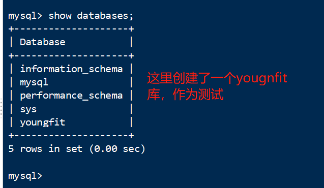

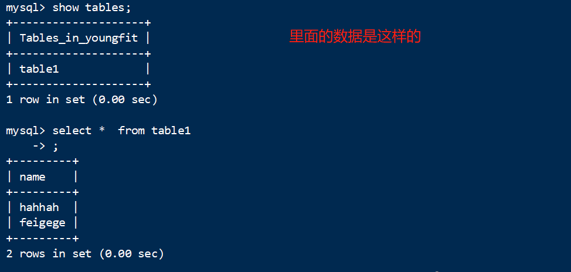

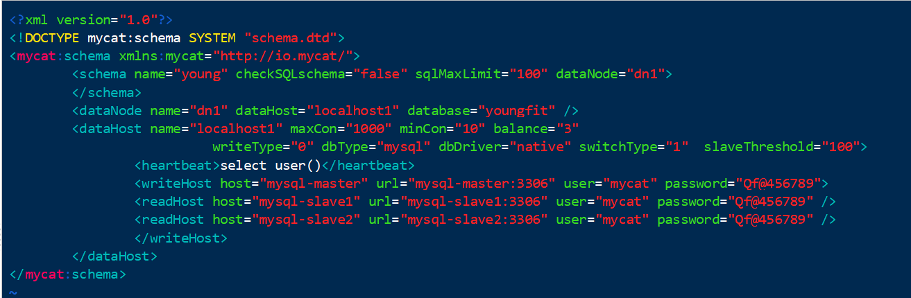

在真实的 master 数据库上给用户授权

```mysql
mysql> grant all on testdb.* to mycat@'%' identified by 'server@456789';
mysql> flush privileges;
```

在mycat的机器上面测试mycat用户登录：

```shell
安装mysql的客户端：
# yum install -y mysql

# mysql -umycat -p'server@456789' -h mysql-master
```

启动Mycat

启动之前需要调整JVM

```shell
在wrapper.conf中添加 
[root@mycat mycat]# cd conf/
[root@mycat conf]# vim wrapper.conf  #在设置JVM哪里添加如下内容
wrapper.startup.timeout=300 //超时时间300秒 
wrapper.ping.timeout=120
启动:
[root@mycat conf]# /usr/local/mycat/bin/mycat start     #需要稍微等待一会
Starting Mycat-server...
[root@mycat ~]# jps   #查看mycat是否启动
13377 WrapperSimpleApp
13431 Jps
[root@mycat ~]# netstat -lntp | grep java
```


测试mycat

```shell
将master当做mycat的客户端
[root@mysql-master ~]# mysql -uroot -h mysql-mycat -p'server@456789' -P 8066
```

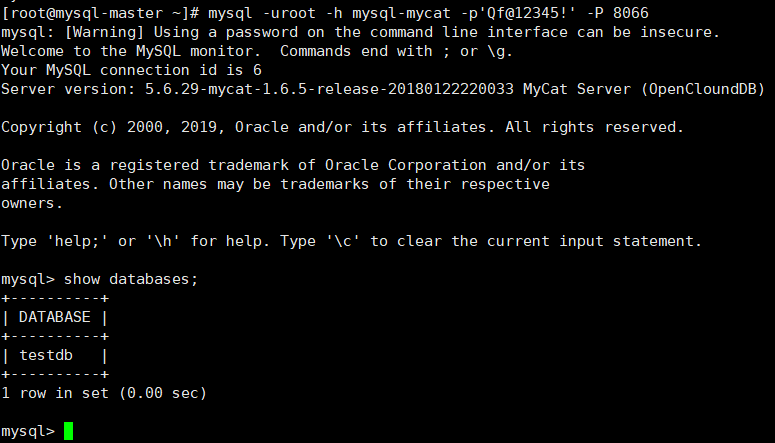

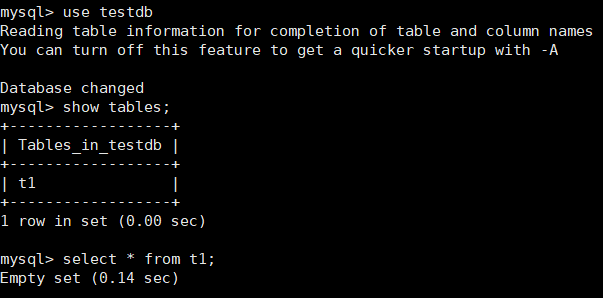

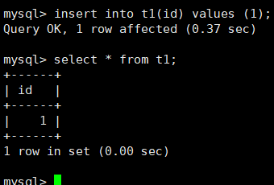

```shell
如果在show table报错：

mysql> show tables;
ERROR 3009 (HY000): java.lang.IllegalArgumentException: Invalid DataSource:0
```

```shell
解决方式：
登录master服务将mycat的登录修改为%
mysql> update user set Host = '%' where User = 'mycat' and Host = 'localhost';
Query OK, 1 row affected (0.00 sec)
Rows matched: 1  Changed: 1  Warnings: 0

mysql> flush privileges;
或者在授权用户mycat权限为*.*
```