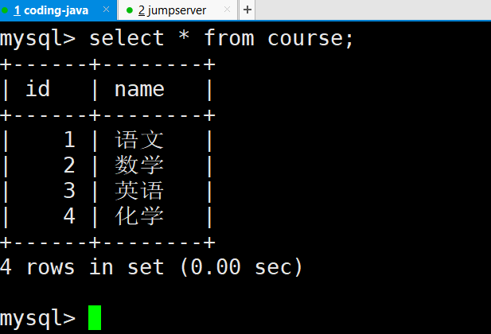

# Mysql三表联查

## 设置字符集

```shell
character-set-server=utf8
collation-server=utf8_general_ci
# systemctl restart mysqld
```

## 创建学生表

```shell
mysql> use db2;
Database changed
mysql> create table stu (id int,name varchar(20),age int);
mysql> insert into stu values(1,'张三',20),(2,'王二',19),(3,'李四',18),(4,'麻子',20);
```

学生信息表：id  name  age


## 创建课程表

```shell
mysql> create table course(id int,name varchar(30));

mysql> insert into course values(1,'语文'),(2,'数学'),(3,'英语'),(4,'化学');
```



## 创建成绩表

```shell
mysql> create table report(id int,sid int,cid int,score int);

insert into report values(1,1,1,59);
insert into report values(2,1,2,60);
insert into report values(3,1,3,61);
insert into report values(4,1,4,62);
insert into report values(5,2,1,90);
insert into report values(6,2,2,59);
insert into report values(7,2,3,100);
insert into report values(8,2,4,43);
```