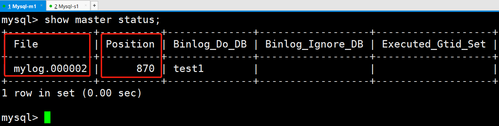

# Mysql主从复制指定库

Mysql-Master ：

```shell
[root@mysql-master ~]# vim /etc/my.cnf
server-id=1
log-bin=mylog   #开启binlog日志功能
binlog-do-db=test1  #指定要同步的库
binlog_format=mixed   #主从复制的格式（mixed,statement,row，默认格式是statement）
[root@mysql-master ~]# systemctl start mysqld

[root@mysql-master ~]# grep password /var/log/mysqld.log 
2022-01-23T02:06:38.471426Z 1 [Note] A temporary password is generated for root@localhost: MRHDpas-y1QG

[root@mysql-master ~]# mysqladmin -uroot -p'MRHDpas-y1QG' password 'Youngfit@123456'
[root@mysql-master ~]# mysql -uroot -p'Youngfit@123456'
mysql> grant replication slave,replication client on *.* 
to 'slave'@'%' identified by 'Slave@123456';
mysql> flush privileges;

mysql> show master status;
```



Mysql-slave：

```shell
[root@mysql-slave ~]# systemctl start mysqld
[root@mysql-slave ~]# grep password /var/log/mysqld.log 
2022-01-23T02:13:41.207156Z 1 [Note] A temporary password is generated for root@localhost: f%Zw9lpZ_q+y
[root@mysql-slave ~]# mysqladmin  -uroot -p'f%Zw9lpZ_q+y' password 'Youngfit@123456'
[root@mysql-slave ~]# mysql -uroot -p'Youngfit@123456'
mysql> change master to 
master_host='mysql-master1',
master_user='slave',
master_password='Slave@123456',
master_port=3306,
master_log_file='mylog.000002',
master_log_pos=870,
```