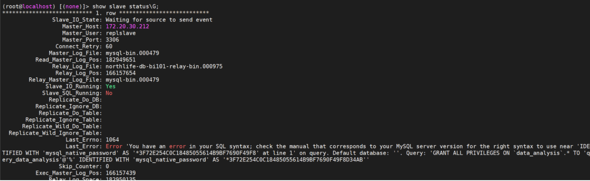

# Mysql主从异常解决方案

# 版本不一致

主节点：Mysql5.7  从节点：Mysql8.0


**1.主从同步错误 SQL线程报错**

问题描述：zabbix报警mysql数据库主从不同步,登录后查询发现SQL线程错误。

解决方案：查看错误代码为1062,1032 导致出现问题的原因有很多,这次并没有去深入分析原因,直接将错误跳过。

1.临时在mysql中操作：

stop slave; # 停止主从复制

SET GLOBAL SQL_SLAVE_SKIP_COUNTER = 1       #跳过一个事务

start slave; # 开启主从复制

show slave status\G # 查看状态

2.在配置文件中永久生效

/etc/my.cnf

在mysql配置文件[mysqld]下面增加

slave-skip-errors = 1064, 1032 # 主从复制时忽略错误

2.今天在进行数据库操作时,导致一个从库发生主从同步错误,ERROR的意思是创建用户的语法错误,在5.7可以,然后在8.0进行Binlog重放错误.



问题处理：

出现这个错误的原因是在主库执行的语句是创建用户并授权,但是对于8.0数据库,创建用户和授权语句需要分开写,随意会出现以上错误。

链接：[(20条消息) MySQL_8.0与5.7区别之账户与安全_weixin_30652879的博客-CSDN博客](https://blog.csdn.net/weixin_30652879/article/details/95577869)


解决步骤：

1.stop slave; 

2.SET GLOBAL SQL_SLAVE_SKIP_COUNTER = 1 跳过这个事务

3.start slave;

4.show slave status\G 查看主从异常是否解决

5.set global read_only=0;

6.create user 'query_data_analysis'@'%' identified by 'Han2rZY7uEn9m!Asana';

7.GRANT all privileges on data_analysis.* to query_data_analysis@'%';

8.set global read_only=1;

9.show global variables like "%read_only%"; 查看是否开启成功


# 从节点插入数据导致不一致

问题：

从节点插入数据 insert into test1.t1 values(1);

主节点未同步。但是主从未失效，从节点I/O、SQL线程仍为YES，而且主节点创建数据，从节点仍能同步

但是主节点再次插入数据insert into test1.t1 values(1);

出现下面报错：

从节点查看show slave status\G


```sql
# 先停止同步
mysql> stop slave;   
Query OK, 0 rows affected (0.01 sec)

# 跳过一个事务，
mysql> set global sql_slave_skip_counter=1;
Query OK, 0 rows affected (0.00 sec)

# 重新开启同步
mysql> start slave;
Query OK, 0 rows affected (0.00 sec)

# 再次查看同步状态
mysql> show slave status\G
```


总结：

由于master节点添加的数据，从节点已经存在，导致从节点执行同样的sql语句时报错，从而出现sql线程错误；

但是主从的数据是一致的；

所以只需要从节点执行以上操作即可；


以上方案是临时解决方案：

以下是永久解决方案：


修改从节点mysql的配置文件

```sql
[root@mysql-slave ~]# vim /etc/my.cnf
```


```sql
[root@mysql-slave ~]# systemctl restart mysqld
[root@mysql-slave ~]# mysql -uroot -p'Qf@12345!'
mysql> show slave status\G
```

