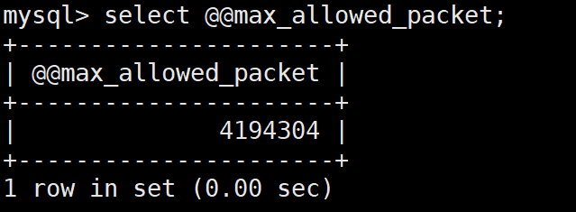
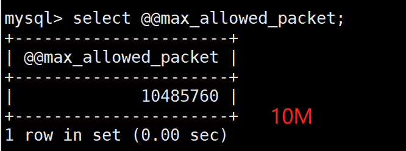

# Mysql主从数据不一致

# 数据库主从数据不一致

## 主从不一致问题原因


MySQL主从复制什么原因会造成不一致，如何预防及解决？


```shell
1、从节点未设置只读，人为误操作在从节点写入数据。

2、主从复制过程中，主库异常宕机；

3、主库执行更改前有执行set sql_log_bin=0，会使主库不记录binlog，从库也无法变更这部分数据

4、binlog非row格式

5、主从实例版本不一致，特别是高版本是主，低版本是从的情况下，主数据库上面支持的功能从数据库上面可能不支持 

6、从库中断很久，binlog应用不连续，监控并及时修复主从

7、从库启用了诸如存储过程，从库禁用存储过程等

8、备份的时候没有指定参数 例如mysqldump --master-data=2 等

9、异步复制本身不保证，半同步存在提交读的问题，增强半同步起来比较完美。 但对于异常重启（Replication Crash Safe），从库写数据（GTID）的防范，还需要策略来保证。

10、一主二从环境，二从的server id一致

11、自增键不一致，key自增键开始的键值跟自增步长设置不一致引起的主从不一致。比如主节点设置1 3 5增长，从节点设置2 4 6增长；

13、启用增强半同步了（5.7的after_sync方式），但是从库延迟超时自动切换成异步复制

14、mysql异常宕机情况下，如果未设置sync_binlog=1或者innodb_flush_log_at_trx_commit=1很有可能出现binlog或者relaylog文件出现损坏，导致主从不一致。
```

## [Mysql配置参数sync_binlog说明](https://www.cnblogs.com/Cherie/p/3309503.html)

Mysql配置参数sync_binlog说明


MySQL提供一个sync_binlog参数来控制数据库的binlog刷到磁盘上去。

默认，sync_binlog=0，表示MySQL不控制binlog的刷新，由文件系统自己控制它的缓存的刷新。这时候的性能是最好的，但是风险也是最大的。因为一旦系统崩溃，在binlog_cache中的所有binlog信息都会被丢失。

如果sync_binlog>0，表示每sync_binlog次事务提交，MySQL调用文件系统的刷新操作将缓存刷下去。最安全的就是sync_binlog=1了，表示每次事务提交，MySQL都会把binlog刷下去，是最安全但是性能损耗最大的设置。这样的话，在数据库所在的主机操作系统损坏或者突然掉电的情况下，系统才有可能丢失1个事务的数据。但是binlog虽然是顺序IO，但是设置sync_binlog=1，多个事务同时提交，同样很大的影响MySQL和IO性能。虽然可以通过group commit的补丁缓解，但是刷新的频率过高对IO的影响也非常大。对于高并发事务的系统来说，“sync_binlog”设置为0和设置为1的系统写入性能差距可能高达5倍甚至更多。

所以很多MySQL DBA设置的sync_binlog并不是最安全的1，而是100或者是0。这样牺牲一定的一致性，可以获得更高的并发和性能。

## MySQL参数(max_allowed_packet)说明

1. 指服务器端和客户端在一次传送数据包的过程中数据包的大小(最大限制)
2. 如果超出这个值，将抛出异常

导致主从不一致原因：如果主节点设置允许传送的最大数据包是10M，从节点设置允许传送的最大数据包是5M；如果有个7M的数据包传送，主节点是可以执行成功，从节点执行失败，从而导致主从数据不一致；

参数查看：

```shell
// 查看MySQL最大支持数据包大小
select @@max_allowed_packet;
 
// 服务器响应的最大连接数
show global status like 'Max_used_connections';
```



1. 注：MySQL版本不同这个默认值可能会不一样

- 参数修改

1. 通过配置文件修改，修改后要重启服务

```shell
[root@mysql-server ~]# vim /etc/my.cnf
[mysqld]
max_allowed_packet = 10M #这也是Mysql优化的一项
[root@mysql-server ~]# systemctl restart mysqld #修改配置，记得重启
```



## 预防Mysql主从数据不一致

```shell
# 从节点设置不能写,设置完需要重启mysql服务
[root@grafana-server ~]# vim /etc/my.cnf
[mysqld]
read_only=ON
super_read_only=ON
mysql> create database test2;
ERROR 1290 (HY000): The MySQL server is running with the --super-read-only option so it cannot execute this statement

# SQL语句临时设置锁表
mysql> FLUSH TABLES WITH READ LOCK;
Query OK, 0 rows affected (0.00 sec)

mysql> create database test1; #失败
ERROR 1223 (HY000): Can't execute the query because you have a conflicting read lock 
```