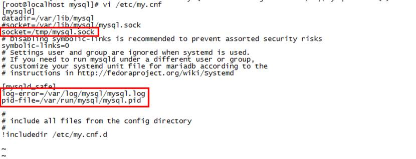
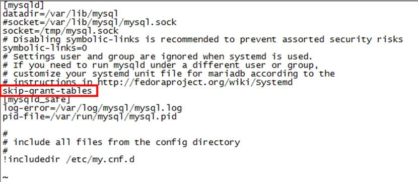
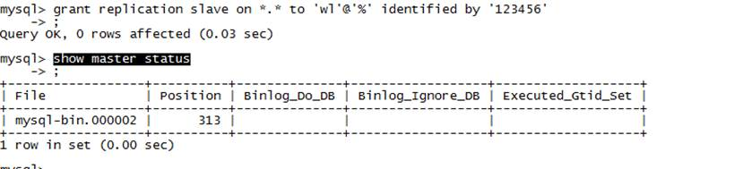
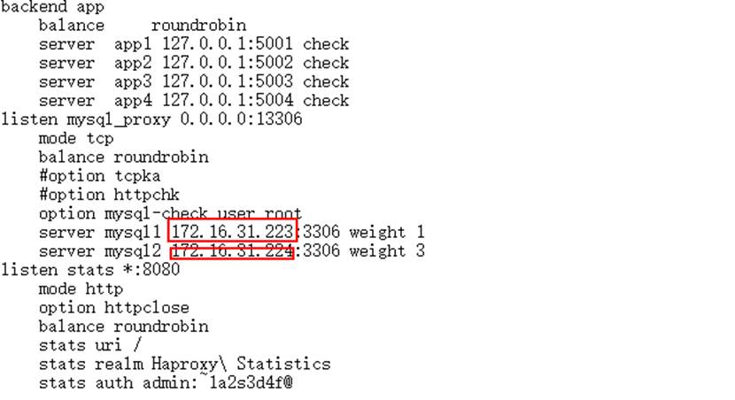

# 1.  数据库服务搭建

## 1.1MYSQL数据库搭建（两台服务器）

### 1.1.1服务器环境

**注：数据库对外访问IP和端口为172.16.31.222：13306**

| **服务器****IP**         | **操作系统** | **安装软件**                               |
| ------------------------ | ------------ | ------------------------------------------ |
| 192.168.126.215（主1）   | Centos7.2    | mysql-5.7.20-linux-glibc2.12-x86_64.tar.gz |
| 192.168.126.219  （主2） | Centos7.2    | mysql-5.7.20-linux-glibc2.12-x86_64.tar.gz |
| 172.16.31.222            | Centos7.2    | haproxy-1.5.14-3.el7.x86_64.rpm            |

### 1.1.2安装mysql5.7（两台机器都需要安装）

此部分安装可以使用以下文档进行

**(1)****删除原数据库**

l rpm -qa | grep mysql

l yum -y remove mysql-libs*

**(2)****安装**

l tar -zxvf mysql-5.7.20-linux-glibc2.12-x86_64.tar.gz

l mv mysql-5.7.20-linux-glibc2.12-x86_64 /usr/local/mysql

l groupadd mysql

l useradd -r -g mysql -s /bin/false mysql

l cd /usr/local

l mkdir mysql-files

l cd mysql

l chmod 750 mysql-files

l chgrp -R mysql .

l cd mysql

l bin/mysqld --initialize --user=mysql

  rf84*&h5sVt+

bin/mysql_ssl_rsa_setup

l chown -R root .

l /usr/local/mysql/bin/mysqld --user=mysql --basedir=/usr/local/mysql --datadir=/usr/local/mysql/data –initizlize

 

Cnf配置文件位置：vi /etc/my.cnf，参照下图修改文件内容：

l mkdir /var/log/mysql

l chown -R mysql:mysql /var/log/mysql

l sudo support-files/mysql.server start 

l cat /root/.mysql_secret //生成初始化密码

l cp support-files/mysql.server /etc/init.d/mysqld //设置开机启动

(3)加入环境变量

l vi /etc/profile 

l 加入：export PATH=$PATH:/usr/local/mysql/bin保存

l source /etc/profile

l service mysqld start

**(4)****安全模式登录（修改密码）**

Cnf配置文件位置：vi /etc/my.cnf

首先运行 vi /etc/my.cnf，添加skip-grant-tables保存，

然后重启服务 service mysqld restart，

服务重启：/etc/init.d/mysql restart

_lwilwfSl5da

**修改密码：**

l mysql -uroot -p 

l update mysql.user set authentication_string=password('~1a2s3d4f@') where user='root';

l flush privileges;

l GRANT ALL PRIVILEGES ON *.* TO 'root'@'%' IDENTIFIED BY '~1a2s3d4f@' WITH GRANT OPTION;

l flush privileges;

### 1.1.3主主搭建

**（1）****基础配置**

**主1：**

l 在/etc/my.cnf 加入下列配置

[mysqld] 

max_connections=16384
 server-id=1           
 log-bin=mysql-bin 
 binlog-ignore-db=mysql,information_schema  
 auto-increment-increment=2      
 auto-increment-offset=1       
 slave-skip-errors=all        

log_bin_trust_function_creators=1 

sql_mode=STRICT_TRANS_TABLES,NO_AUTO_CREATE_USER,NO_ENGINE_SUBSTITUTION

l service mysqld restart

 

**主2：**

l 在/etc/my.cnf 加入下列配置

[mysqld] 

max_connections=16384
 server-id=2           
 log-bin=mysql-bin 
 binlog-ignore-db=mysql,information_schema  
 auto-increment-increment=2      
 auto-increment-offset=1       
 slave-skip-errors=all        

log_bin_trust_function_creators=1 

sql_mode=STRICT_TRANS_TABLES,NO_AUTO_CREATE_USER,NO_ENGINE_SUBSTITUTION

l service mysqld restart

 

**（2）配置主1服务器**

l 在主2服务器上建立账号并授权：

grant replication slave on *.* to 'mysql'@'%' identified by '~1a2s3d4f@;  //默认不适用root用户

flush privileges;

l 登录主2服务器，查看master状态

show master status;

l 根据主2服务器状态，配置主1

change master to 

master_host='192.168.126.219',master_user='mysql',master_password='~1a2s3d4f@',master_log_file='mysql-bin.000002',master_log_pos= 313 ;

l 启动服务

start slave;

**（3）配置主2服务器**

l 在主1服务器上建立账号并授权：

grant replication slave on *.* to 'mysql'@'%' identified by '~1a2s3d4f@';  //默认不适用root用户

l 登录主1服务器，查看master状态

show master status;

（2）从服务器命令输入:

l 根据主1服务器状态，配置主2

change master to 

master_host='192.168.126.215',master_user='mysql',master_password='~1a2s3d4f@',master_log_file='mysql-bin.000002',master_log_pos=313;

l 启动从服务

start slave;

## 1.2haproxy安装

在服务器：172.16.31.222上安装

l rpm -ivh haproxy-1.5.14-3.el7.x86_64.rpm

l 修改配置文件vi /etc/haproxy/haproxy.cfg

详细配置参看：haproxy.cfg，红框内IP更改为实际数据库IP地址即可

l  启动服务：systemctl start haproxy.service

注：数据库对外访问IP和端口号：172.16.31.222：13306

 