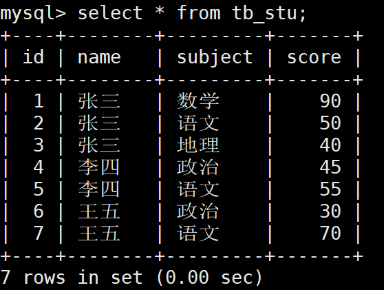

# Mysql查询group by

## group by 分组

“Group By”从字面意义上理解就是根据“By”指定的规则对数据进行分组，所谓的分组就是将一个“数据集”划分成若干个“小区域”，然后针对若干个“小区域”进行数据处理。

```shell
select 类别, sum(数量) as 数量之和
from A
group by 类别
```

注：group by语句中select指定的字段必须是“分组依据字段”，其他字段若想出现在select中则必须包含在聚合函数中。

mysql中五种常用的聚合函数：

（1）max(列名)：求最大值。

（2）min(列名)：求最小值。

（2）sum(列名)：求和。

（4）avg(列名)：求平均值。

（5）count(列名)：统计记录的条数。

## having

having子句可以让我们筛选成组后的各种数据，where子句在聚合前先筛选记录，也就是说作用在group by和having子句前。而 having子句在聚合后对组记录进行筛选。 

示例：

```shell
select 类别, sum(数量) as 数量之和 from A group by 类别 having sum(数量) > 18
```

示例：Having和Where的联合使用方法

```shell
select 类别, SUM(数量)from A where 数量 >8 group by 类别 having SUM(数量) >10
```

**where和having的区别：**

作用的对象不同。WHERE 子句作用于表和视图，HAVING 子句作用于组。
WHERE 在分组和聚集计算之前选取输入行（因此，它控制哪些行进入聚集计算）， 而 HAVING 在分组和聚集之后选取分组的行。因此，WHERE 子句不能包含聚集函数； 因为试图用聚集函数判断那些行输入给聚集运算是没有意义的。 相反，HAVING 子句总是包含聚集函数。（严格说来，你可以写不使用聚集的 HAVING 子句， 但这样做只是白费劲。同样的条件可以更有效地用于 WHERE 阶段。）
在上面的例子中，我们可以在 WHERE 里应用数量字段来限制，因为它不需要聚集。 这样比在 HAVING 里增加限制更加高效，因为我们避免了为那些未通过 WHERE 检查的行进行分组和聚集计算。
**综上所述：**
having一般跟在group by之后，执行记录组选择的一部分来工作的。where则是执行所有数据来工作的。
再者having可以用聚合函数，如having sum(qty)>1000

**例子：where + group by + having + 函数 综合查询**

练习表：

```shell
mysql> create table tb_stu(id int primary key auto_increment,name varchar(20),subject varchar(3),score int) default ch
arset=utf8;Query OK, 0 rows affected (0.00 sec)

mysql> insert into tb_stu values(1,'张三','数学',90);
Query OK, 1 row affected (0.00 sec)

mysql> insert into tb_stu values(1,'张三','语文',50);
ERROR 1062 (23000): Duplicate entry '1' for key 'PRIMARY'
mysql> insert into tb_stu values(2,'张三','语文',50);
Query OK, 1 row affected (0.00 sec)

mysql> insert into tb_stu values(3,'张三','地理',40);
Query OK, 1 row affected (0.00 sec)

mysql> insert into tb_stu values(4,'李四','政治',45);
Query OK, 1 row affected (0.01 sec)

mysql> insert into tb_stu values(5,'李四','语文',55);
Query OK, 1 row affected (0.04 sec)

mysql> insert into tb_stu values(6,'王五','政治',30);
Query OK, 1 row affected (0.00 sec)

mysql> insert into tb_stu values(7,'王五','语文',70);
Query OK, 1 row affected (0.00 sec)
```



**查询出两门及两门以上不及格者的平均成绩(注意是所有科目的平均成绩)**

错误情况1：题意理解错误，理解成查出不及格科目的平均成绩。

```shell
mysql> select name,avg(score),sum(score<60) as 'gk' from tb_stu  group by name having gk>=2;
+--------+------------+------+
| name   | avg(score) | gk   |
+--------+------------+------+
| 张三   |    60.0000 |    2 |
| 李四   |    50.0000 |    2 |
+--------+------------+------+
2 rows in set (0.00 sec)
```