# Mysql触发器、视图

# Mysql触发器trigger

Q：什么是触发器？

A：触发器是与表有关的数据库对象，在满足定义条件时触发，并执行触发器中定义的语句集合。

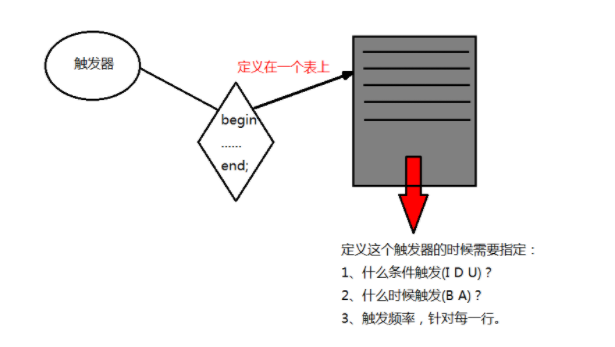

触发器的特性：

1、有begin end体，begin end;之间的语句可以写的简单或者复杂

2、什么条件会触发：I、D、U

3、什么时候触发：在增删改前或者后

4、触发频率：针对每一行执行

5、触发器定义在表上，附着在表上。

也就是由事件来触发某个操作，事件包括INSERT语句，UPDATE语句和DELETE语句；可以协助应用在数据库端确保数据的完整性。

！！尽量少使用触发器，不建议频繁使用。

假设触发器触发每次执行1s，insert table 500条数据，那么就需要触发500次触发器，光是触发器执行的时间就花费了500s，而insert 500条数据一共是1s，那么这个insert的效率就非常低了。因此我们特别需要注意的一点是触发器的begin end;之间的语句的执行效率一定要高，资源消耗要小。

触发器尽量少的使用，因为不管如何，它还是很消耗资源，如果使用的话要谨慎的使用，确定它是非常高效的：触发器是针对每一行的；对增删改非常频繁的表上切记不要使用触发器，因为它会非常消耗资源。 


### 触发器参数说明：

\> BEFORE和AFTER参数指定了触发执行的时间，在事件之前或是之后。

\> FOR EACH ROW表示任何一条记录上的操作满足触发事件都会触发该触发器，也就是说触发器的触发频率是针对每一行数据触发一次。

\> trigger_event详解：

①INSERT型触发器：插入某一行时激活触发器，可能通过INSERT、LOAD DATA、REPLACE 语句触发(LOAD DAT语句用于将一个文件装入到一个数据表中，相当与一系列的INSERT操作)；

②UPDATE型触发器：更改某一行时激活触发器，可能通过UPDATE语句触发；

③DELETE型触发器：删除某一行时激活触发器，可能通过DELETE、REPLACE语句触发。

\> trigger_order是MySQL5.7之后的一个功能，用于定义多个触发器，使用follows(尾随)或precedes(在…之先)来选择触发器执行的先后顺序。

### 一、创建触发器

### 1、创建只有一个执行语句的触发器

```shell
CREATE TRIGGER 触发器名 BEFORE|AFTER 触发事件 ON 表名 FOR EACH ROW 执行语句;
```

例1：创建了一个名为trig1的触发器，一旦在work表中有插入动作，就会自动往time表里插入当前时间

```powershell
# 准备2张表，time,work
mysql> create table time(time date);
mysql> create table work (id int,name varchar(20),time date);

# 创建触发器
mysql> CREATE TRIGGER trig1 AFTER INSERT ON work FOR EACH ROW INSERT INTO time VALUES(NOW());
 
# 测试
mysql> insert into work(id,name) values(1,'feige');
# 查看结果
mysql> select * from time;
+------------+
| time       |
+------------+
| 2021-12-09 |
+------------+
1 row in set (0.00 sec)
# 再来一次
mysql> insert into work(id,name) values(2,'youngfit');
mysql> select * from time;
+------------+
| time       |
+------------+
| 2021-12-09 |
| 2021-12-09 |
+------------+
2 rows in set (0.00 sec)
```

### 2、创建有多个执行语句的触发器

```shell
CREATE TRIGGER 触发器名 BEFORE|AFTER 触发事件
ON 表名 FOR EACH ROW
BEGIN
        执行语句列表
END;
```

例2：定义一个触发器，一旦有满足条件的删除操作，就会执行BEGIN和END中的语句

```shell
# work表原本的内容
mysql> select * from work;
+------+----------+------+
| id   | name     | time |
+------+----------+------+
|    1 | feige    | NULL |
|    2 | youngfit | NULL |
+------+----------+------+
2 rows in set (0.00 sec)

# 创建1个employee表格
mysql> create table employee(id int,name varchar(20),age int);

# DELIMITER其实就是告诉mysql解释器，该段命令是否已经结束了，mysql是否可以执行了。默认情况下，delimiter是分号;。在命令行客户端中，
如果有一行命令以分号结束，那么回车后，mysql将会执行该命令。
# 创建触发器
mysql> DELIMITER ||
mysql> create trigger trig2 before delete on work for each row begin insert into employee values(1,'feige',18);insert into employee values(2,'youngfit',19);
    -> END ||
mysql> DELIMITER ;

mysql> delete from work where id = 1;
Query OK, 1 row affected (0.00 sec)

mysql> select * from employee;
+------+----------+------+
| id   | name     | age  |
+------+----------+------+
|    1 | feige    |   18 |
|    2 | youngfit |   19 |
+------+----------+------+
2 rows in set (0.00 sec)
```

### 3、NEW与OLD详解

MySQL 中定义了 NEW 和 OLD，用来表示触发器的所在表中，触发了触发器的那一行数据，来引用触发器中发生变化的记录内容，具体地：

①在INSERT型触发器中，NEW用来表示将要（BEFORE）或已经（AFTER）插入的新数据；

②在UPDATE型触发器中，OLD用来表示将要或已经被修改的原数据，NEW用来表示将要或已经修改为的新数据；

③在DELETE型触发器中，OLD用来表示将要或已经被删除的原数据；

使用方法：

NEW.columnName （columnName为相应数据表某一列名）

另外，OLD是只读的，而NEW则可以在触发器中使用 SET 赋值，这样不会再次触发触发器，造成循环调用（如每插入一个学生前，都在其学号前加“2013”）。

例3：

```shell
mysql> CREATE TABLE account (acct_num INT, amount DECIMAL(10,2));
mysql> INSERT INTO account VALUES(137,14.98),(141,1937.50),(97,-100.00);
mysql> select * from account;
```

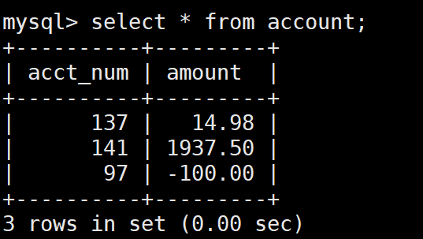

```shell
# 创建触发器
mysql> delimiter $$
mysql> create trigger upd_check before update on account for each row begin
    -> if new.amount < 0 then
    -> set new.amount = 0;
    -> elseif new.amount > 100 then
    -> set new.amount = 100;
    -> end if;
    -> END$$
Query OK, 0 rows affected (0.01 sec)

mysql> delimiter ;

# 案例1：
mysql> update account set amount=-10 where acct_num=137;

mysql> select * from account;
+----------+---------+
| acct_num | amount  |
+----------+---------+
|      137 |    0.00 |
|      141 | 1937.50 |
|       97 | -100.00 |
+----------+---------+
3 rows in set (0.00 sec)

# 案例2：
mysql> update account set amount=200 where acct_num=137;
Query OK, 1 row affected (0.00 sec)
Rows matched: 1  Changed: 1  Warnings: 0

mysql> select * from account;
+----------+---------+
| acct_num | amount  |
+----------+---------+
|      137 |  100.00 |
|      141 | 1937.50 |
|       97 | -100.00 |
+----------+---------+
3 rows in set (0.00 sec)
```

二、查看触发器

1、SHOW TRIGGERS语句查看触发器信息

```shell
mysql> SHOW TRIGGERS\G;
```

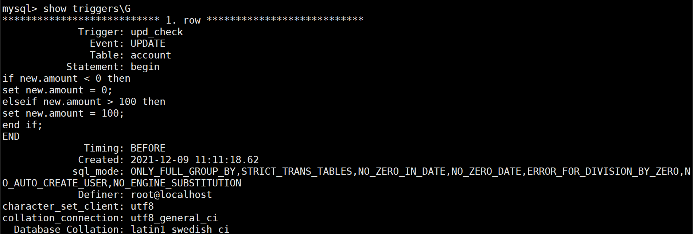

结果，显示所有触发器的基本信息；无法查询指定的触发器。


2、在information_schema.triggers表中查看触发器信息

```shell
mysql> SELECT * FROM information_schema.triggers\G
```

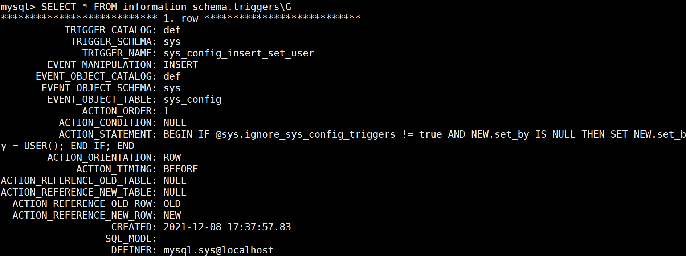

结果，显示所有触发器的详细信息；同时，该方法可以查询制定触发器的详细信息。

```shell
mysql> select * from information_schema.triggers where trigger_name='upd_check'\G
```

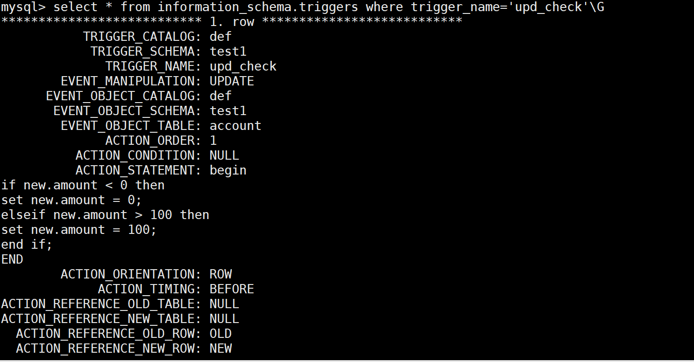

### 4、删除触发器

如果不需要某个触发器时一定要将这个触发器删除，以免造成意外操作，这很关键。

先用上面的命令查询出来，再指定名称删除，如下：

```shell
mysql> drop trigger upd_check;
Query OK, 0 rows affected (0.00 sec)
```

# Mysql自定义函数

```shell
mysql> use test1;
mysql> create table tb1(username varchar(20),age int(3));
mysql> delimiter //
mysql> create function addUser(username varchar(20),age tinyint(3) unsigned)
    -> returns tinyint(3) unsigned
    -> begin
    -> insert tb1(username,age) values(username,age);
    -> return (select max(age) from tb1);
    -> end //
mysql> delimiter ;
mysql> select addUser('chenjs',20);
+----------------------+
| addUser('chenjs',20) |
+----------------------+
|                   20 |
+----------------------+
1 row in set (0.00 sec)

mysql> select addUser('chenjs',20);
+----------------------+
| addUser('chenjs',20) |
+----------------------+
|                   20 |
+----------------------+
1 row in set (0.00 sec)

# 查看结果
mysql> select * from tb1;
+----------+------+
| username | age  |
+----------+------+
| chenjs   |   20 |
| chenjs   |   20 |
+----------+------+
2 rows in set (0.00 sec)

# 再试一次
mysql>  select addUser('feige',27);
+---------------------+
| addUser('feige',27) |
+---------------------+
|                  27 |
+---------------------+
1 row in set (0.00 sec)

mysql> select * from tb1;
+----------+------+
| username | age  |
+----------+------+
| chenjs   |   20 |
| chenjs   |   20 |
| feige    |   27 |
+----------+------+
3 rows in set (0.00 sec)
```

# Mysql视图

## 1、基本概念

视图，虚拟表，从一个表或多个表中查询出来的表，作用和真实表一样，包含一系列带有行和列的数据。视图中，用户可以使用SELECT语句查询数据，也可以使用INSERT，UPDATE，DELETE修改记录，视图可以使用户操作方便，并保障数据库系统安全。

### 视图特点

- 优点

- - 简单化，数据所见即所得。
  - 安全性，用户只能查询或修改他们所能见到得到的数据。
  - 逻辑独立性，可以屏蔽真实表结构变化带来的影响。

- 缺点

- - 性能相对较差，简单的查询也会变得稍显复杂。
  - 修改不方便，特变是复杂的聚合视图基本无法修改。

**大数据分表时可以用到**

比如,表的行数超过200万行时,就会变慢,

可以把一张的表的数据拆成4张表来存放.

News表

Newsid, 1,2,3,4

News1,news2,news3,news4表


把一张表的数据分散到4张表里,分散的方法很多,

最常用可以用id取模来计算.

Id%4+1 = [1,2,3,4]

比如 $_GET['id'] = 17,

17%4 + 1 = 2,  $tableName = 'news'.'2'

Select * from news2 where id = 17;


**还可以用视图****,** **把****4****张表形成一张视图**

Create view news as  select from n1 union select from n2 union........

## 2、数据准备

### 第一张表

1、员工表

```shell
mysql> CREATE TABLE t_employee(          
ID INT  PRIMARY KEY  AUTO_INCREMENT,          
NAME CHAR (30) NOT NULL,          
SEX  CHAR (2) NOT NULL ,          
AGE INT NOT NULL ,          
DEPARTMENT CHAR (10) NOT NULL ,
SALARY  INT NOT NULL ,          
HOME CHAR (30),          
MARRY CHAR (3) NOT NULL DEFAULT  '否' ,
HOBBY CHAR (30)   ) 
default charset=utf8;
```

#### 插入数据

```shell
INSERT INTO test1.t_employee(ID, NAME , SEX, AGE,DEPARTMENT, SALARY, HOME, MARRY, HOBBY)
VALUES ( NULL , '小红' , '女' ,20, '人事部' , '4000' , '广东' , '否' , '网球' );
INSERT INTO test1.t_employee(ID, NAME , SEX, AGE,DEPARTMENT, SALARY, HOME, MARRY, HOBBY)
VALUES ( NULL , '明日' , '女' ,21, '人事部' , '9000' , '北京' , '否' , '网球' );
INSERT INTO test1.t_employee(ID, NAME , SEX, AGE,DEPARTMENT, SALARY, HOME, MARRY, HOBBY)
VALUES ( NULL , '天天' , '男' ,22, '研发部' , '8000' , '上海' , '否' , '音乐' );
INSERT INTO test1.t_employee(ID, NAME , SEX, AGE,DEPARTMENT, SALARY, HOME, MARRY, HOBBY)
VALUES ( NULL , '大大' , '女' ,23, '研发部' , '9000' , '重庆' , '否' , '无' );
INSERT INTO test1.t_employee(ID, NAME , SEX, AGE,DEPARTMENT, SALARY, HOME, MARRY, HOBBY)
VALUES ( NULL , '王下' , '女' ,24, '研发部' , '9000' , '四川' , '是' , '足球' );
INSERT INTO test1.t_employee(ID, NAME , SEX, AGE,DEPARTMENT, SALARY, HOME, MARRY, HOBBY)
VALUES ( NULL , '无名' , '男' ,25, '销售部' , '6000' , '福建' , '否' , '游戏' );
INSERT INTO test1.t_employee(ID, NAME , SEX, AGE,DEPARTMENT, SALARY, HOME, MARRY, HOBBY)
VALUES ( NULL , '不知道' , '女' ,26, '销售部' , '5000' , '山西' , '否' , '篮球' );
```

#### 插入结果

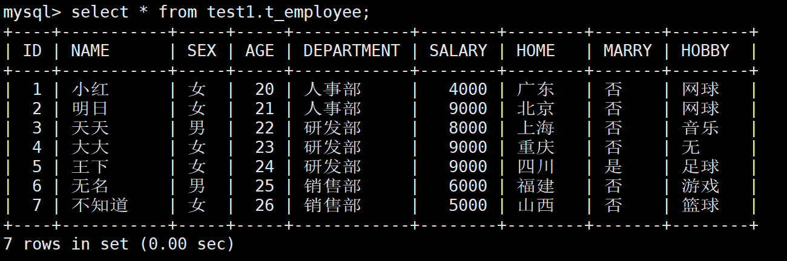

### 第二张表

然后再定义一张员工信息表：

```shell
mysql> create TABLE t_employee_detail(
     ID INT PRIMARY KEY ,
     POS CHAR (10) NOT NULL ,
     EXPERENCE CHAR (10) NOT NULL ,
     CONSTRAINT `FK_ID` FOREIGN KEY (ID) REFERENCES t_employee(ID)
     ) default charset=utf8;
```

#### 插入数据

```shell
INSERT INTO t_employee_detail(ID,POS,EXPERENCE) VALUES (1, '人事管理' , '工作二年' );
INSERT INTO t_employee_detail(ID,POS,EXPERENCE) VALUES (2, '人事招聘' , '工作二年' );
INSERT INTO t_employee_detail(ID,POS,EXPERENCE) VALUES (3, '初级工程师' , '工作一年' );
INSERT INTO t_employee_detail(ID,POS,EXPERENCE) VALUES (4, '中级工程师' , '工作二年' );
INSERT INTO t_employee_detail(ID,POS,EXPERENCE) VALUES (5, '高级工程师' , '工作三年' );
INSERT INTO t_employee_detail(ID,POS,EXPERENCE) VALUES (6, '销售代表' , '工作二年' );
INSERT INTO t_employee_detail(ID,POS,EXPERENCE) VALUES (7, '销售员' , '工作一年' );
```

#### 插入结果

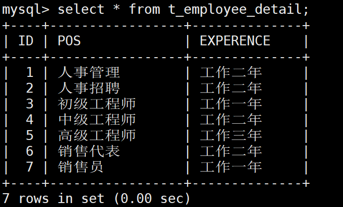

## 3、使用案例

1. 语法


CREATE [OR REPLACE] [ALGORITHM = {UNDEFINED | MERGE | TEMPTABLE}] VIEW [db_name.]view_name [(column_list)] AS select_statement [WITH [CASCADED | LOCAL] CHECK OPTION]


通过该语句可以创建视图，若给定了[OR REPLACE]，则表示当已具有同名的视图时，将覆盖原视图。select_statement是一个查询语句，这个查询语句可从表或其它的视图中查 询。视图属于数据库，因此需要指定数据库的名称，若未指定时，表示在当前的数据库创建新视图。
表和数据库共享数据库中相同的名称空间，因此，数据库不能包含相同名称的表和视图，并且，视图的列名也不能重复。


在创建视图前应先看看是否有权限：

```shell
mysql> SELECT SELECT_priv,create_view_priv from mysql.user WHERE user = 'root';
```

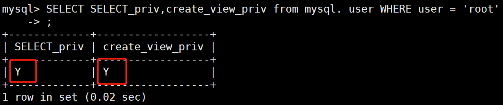

### 单表上创建视图

在员工表是创建视图

```shell
CREATE VIEW V_VIEW1(ID, NAME , SEX, AGE,DEPARTMENT) AS SELECT ID, NAME , SEX, AGE, DEPARTMENT FROM test1.t_employee;
```

然后是显示内容：

```shell
mysql> select * from V_VIEW1;
+----+-----------+-----+-----+------------+
| ID | NAME      | SEX | AGE | DEPARTMENT |
+----+-----------+-----+-----+------------+
|  1 | 小红      | 女  |  20 | 人事部     |
|  2 | 明日      | 女  |  21 | 人事部     |
|  3 | 天天      | 男  |  22 | 研发部     |
|  4 | 大大      | 女  |  23 | 研发部     |
|  5 | 王下      | 女  |  24 | 研发部     |
|  6 | 无名      | 男  |  25 | 销售部     |
|  7 | 不知道    | 女  |  26 | 销售部     |
+----+-----------+-----+-----+------------+
7 rows in set (0.00 sec)
```

### 多表上创建视图

```shell
mysql> CREATE VIEW V_VIEW2(ID, NAME , SEX, AGE,DEPARTMENT,POS,EXPERENCE) AS SELECT a.ID, a. NAME ,  a.SEX, a.AGE,a.DEP
ARTMENT,b.POS,b.EXPERENCE FROM test1.t_employee a,test1.t_employee_detail b WHERE a.ID=b.ID;
```

显示结果：

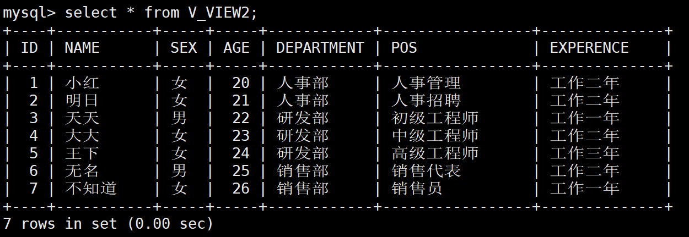

### 查看视图

#### DESCRIBE指令查看

```shell
mysql> describe V_VIEW2;
```

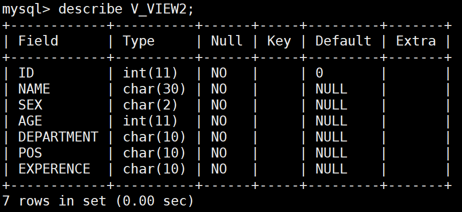

#### SHOW TABLE STATUS

```shell
mysql> show table status like 'V_VIEW2'\G
```

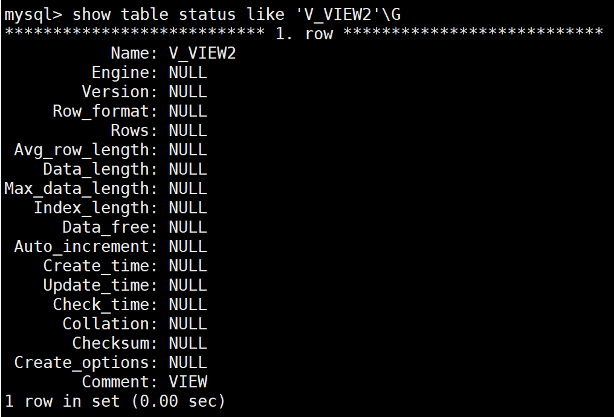

#### SHOW CREATE view命令

```shell
mysql> show create view V_VIEW1\G
mysql> show create view V_VIEW2\G
```

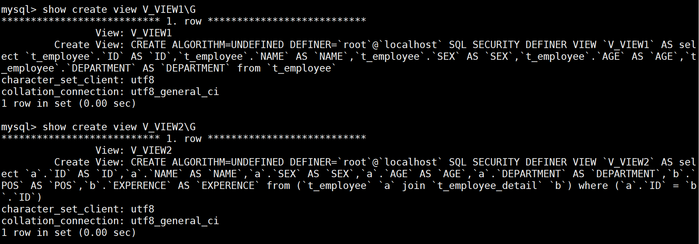

### 修改视图

#### CREATE OR REPLACE命令

```shell
mysql> CREATE OR REPLACE VIEW V_VIEW1(ID, NAME , SEX) AS SELECT ID, NAME , SEX  FROM
    -> test1.t_employee;
```

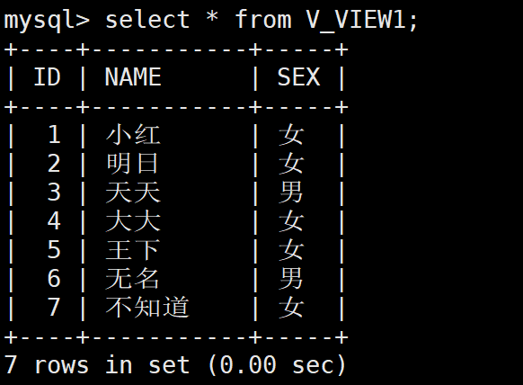

#### ALTER 命令

```shell
mysql> ALTER VIEW  V_VIEW1(ID, NAME ) AS SELECT ID, NAME  FROM test1.t_employee;
```

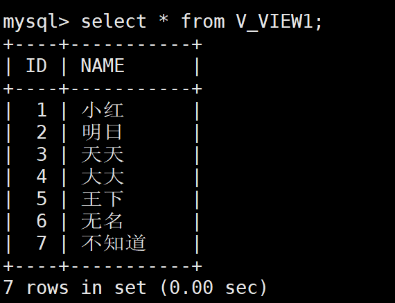

### 更新视图数据

在MySQL中，更新视图是指通过视图来插入（INSERT）、更新（UPDATE）和删除（DELETE）表中的数据。因为视图是一个虚拟表，其中没有数据，所以通过视图更新时，都是转换到基本表来更新。
更新视图时，只能更新权限范围内的数据。超出了范围，就不能更新。

更新前：

```shell
mysql> select * from V_VIEW2;
```

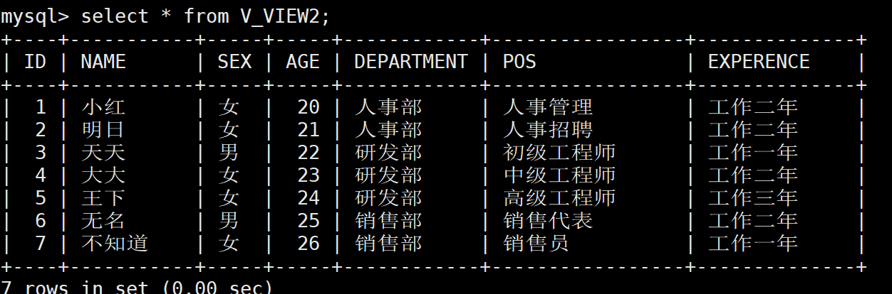

更新后：

```shell
mysql> UPDATE V_VIEW2 SET POS= '高级工程师' WHERE NAME = '天天';
```

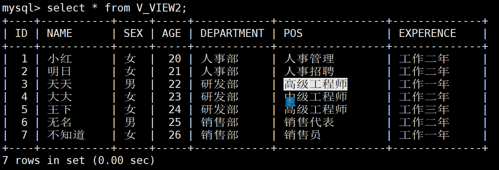

对应 的真实表上的数据也发生改变 了

```shell
mysql> SELECT * FROM test1.t_employee_detail WHERE t_employee_detail.ID=3;
```

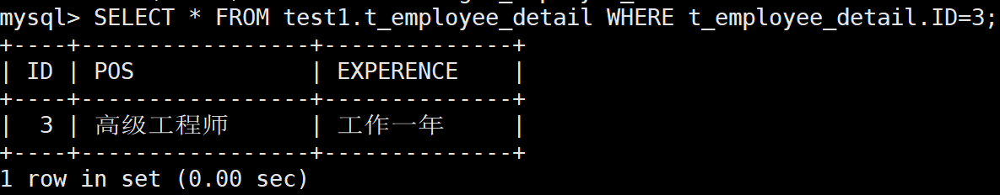

不可更新的视图：
某些视图是可更新的。也就是说，可以在诸如UPDATE、DELETE或INSERT等语句中使用它们，以更新基表的内容。对于可更新的视图，在视图中的行和基表中的行之间必须具有一对一的关系。还有一些特定的其他结构，这类结构会使得视图不可更新。更具体地讲，如果视图包含下述结构中的任何一种，那么它就是不可更新的：

· 聚合函数（SUM(), MIN(), MAX(), COUNT()等）。
· DISTINCT
· GROUP BY
· HAVING
· UNION或UNION ALL
· 位于选择列表中的子查询
· Join
· FROM子句中的不可更新视图
· WHERE子句中的子查询，引用FROM子句中的表。
· 仅引用文字值（在该情况下，没有要更新的基本表）。
· ALGORITHM = TEMPTABLE（使用临时表总会使视图成为不可更新的）。


注意:
视图中虽然可以更新数据，但是有很多的限制。一般情况下，最好将视图作为查询数据的虚拟表，而不要通过视图更新数据。因为，使用视图更新数据时，如果没有全面考虑在视图中更新数据的限制，就可能会造成数据更新失败。

CASCADED和LOCAL能不能决定视图是否能更新？
WITH[CASCADED|LOCAL] CHECK OPTION能不能决定视图是否能更新？这两个参数的基本定义如下：
LOCAL参数表示更新视图时只要满足该视图本身定义的条件即可。
CASCADED参数表示更新视图时需要满足所有相关视图和表的条件。没有指明时，该参数为默认值。

With check option的用法：
（with check option对于没有where条件的视图不起作用的）

```shell
mysql> CREATE VIEW V_VIEW3(ID, NAME ,SEX,AGE,DEPARTMENT,SALARY, HOME, MARRY, HOBBY) AS SELECT ID, NAME , SEX,AGE,DEPAR
TMENT,SALARY,HOME,MARRY,HOBBY FROM test1.t_employee WHERE DEPARTMENT= '人事部' WITH LOCAL CHECK OPTION;
```

表示只限定插入部门为人事部的人。

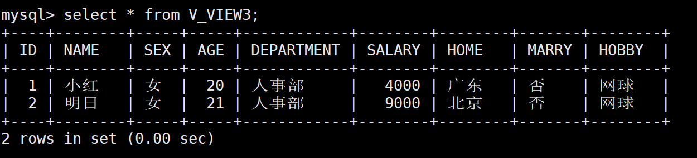

然后插入一条：

```shell
mysql> INSERT INTO test1.V_VIEW3(ID, NAME , SEX, AGE,DEPARTMENT, SALARY, HOME, MARRY, HOBBY) VALUES ( NULL , '会会会会
' , '女' ,20, '人事部' , '4500' , '广东' , '否' , '网球' );
```

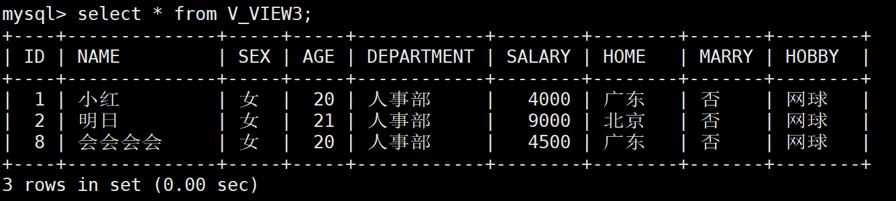

同时查看真实表中的数据：

```shell
mysql> select * from t_employee;
```

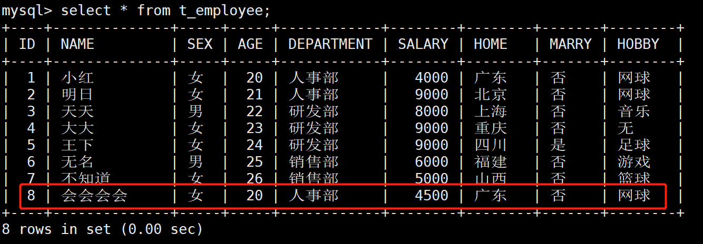

再来插入一条：

```shell
mysql> INSERT INTO test1.V_VIEW3(ID, NAME , SEX, AGE,DEPARTMENT, SALARY, HOME, MARRY, HOBBY) VALUES ( NULL , 'qqqqvasv
as' , '女' ,20, '研发部' , '4500' , '上海' , '否' , '网球' );
ERROR 1369 (HY000): CHECK OPTION failed 'test1.V_VIEW3'
```

结果显示插入失败
对于with check option用法，总结如下：
通过有with check option选项的视图操作基表(只是面对单表，对连接多表的视图正在寻找答案)，有以下结论： 插入后的数据，通过视图能够查询出来就符合WITH CHECK OPTION 否则就不符合；
首先视图只操作它可以查询出来的数据，对于它查询不出的数据，即使基表有，也不可以通过视图来操作。
1.对于update,有with check option，要保证update后，数据要被视图查询出来
2.对于delete,有无with check option都一样
4.对于insert,有with check option，要保证insert后，数据要被视图查询出来
对于没有where 子句的视图，使用with check option是多余的

### 删除视图

```shell
mysql> drop VIEW if exists V_VIEW3;
```

# Mysql存储过程

## 定义

​       存储过程（Stored Procedure）是在大型数据库系统中，一组为了完成特定功能的SQL 语句集，存储在数据库中，经过第一次编译后调用不需要再次编译，用户通过指定存储过程的名字并给出参数（如果该存储过程带有参数）来执行它。存储过程是数据库中的一个重要对象。

存储过程和函数是事先经过编译并存储在数据库中的一段SQL语句的集合，存储和和函数的区别在于函数必须有返回值，而存储过程没有，存储过程的参数可以使用IN、OUT、INOUT类型，而函数的参数只能是IN类型。存储过程再简单点来说，就是为以后的使用而保存的一条或多条MySQL语句的集合。可将其视为批件，虽然它们的作用不仅限于批处理。在我看来， 存储过程就是有业务逻辑和流程的集合， 可以在存储过程中创建表，更新数据， 删除等等。本次博客就来讲一下存储过程

## 存储过程的特点

​    1、能完成较复杂的判断和运算

​    2、可编程性强，灵活

​    3、SQL编程的代码可重复使用

​    4、执行的速度相对快一些

​    5、减少网络之间的数据传输，节省开销

## 创建一个简单的存储过程

```shell
# 表原来的内容
mysql> select * from work;
+------+----------+------+
| id   | name     | time |
+------+----------+------+
|    2 | youngfit | NULL |
+------+----------+------+
1 row in set (0.00 sec)

# 创建存储过程
mysql> delimiter //
mysql> create procedure testa() 
    -> begin
    ->   select * from work;
    -> end //
mysql> delimiter ;

# 调用存储过程
mysql> call testa();
+------+----------+------+
| id   | name     | time |
+------+----------+------+
|    2 | youngfit | NULL |
+------+----------+------+
1 row in set (0.00 sec)

Query OK, 0 rows affected (0.00 sec)
```

## 存储过程的变量

先通过一个简单的例子来学习变量的声明和赋值

```shell
# work表原来的内容
mysql> create table work(id int,name varchar(32),time datetime);
mysql> insert into work values(2,'youngfit',NULL);
mysql> select * from work;
+------+----------+------+
| id   | name     | time |
+------+----------+------+
|    2 | youngfit | NULL |
+------+----------+------+
1 row in set (0.00 sec)

# 创建存储过程，使用变量
mysql> delimiter //
create procedure test2() 
begin 
  declare username varchar(32);   --使用decalre声明变量
  set username='feige';   --使用set设置变量
  select name into username from work where id=2;  --将work表中id=2的名称赋值给username,会将username='feige'覆盖掉
  select username; --返回变量
end //

Query OK, 0 rows affected (0.00 sec)

mysql> delimiter ;

# 调用存储过程；
mysql> call test2;
+----------+
| username |
+----------+
| youngfit |
+----------+
1 row in set (0.00 sec)

Query OK, 0 rows affected (0.00 sec)
```

2、概括

​        (1)、变量的声明使用declare,一句declare只声明一个变量，变量必须先声明后使用；

​        (2)、变量具有数据类型和长度，与mysql的SQL数据类型保持一致，因此甚至还能制定默认值、字符集和排序规则等；

​        (3)、变量可以通过set来赋值，也可以通过select into的方式赋值；

​        (4)、变量需要返回，可以使用select语句，如：select 变量名;

### 变量的作用域

​    1、变量作用域说明：

​        (1)、存储过程中变量是有作用域的，作用范围在begin和end块之间，end结束变量的作用范围即结束。

​        (2)、需要多个块之间传值，可以使用全局变量，即放在所有代码块之前

​        (3)、传参变量是全局的，可以在多个块之间起作用

​    2、通过一个实例来验证变量的作用域

​         需求: 创建一个存储过程，用来统计表users、orders表中行数数量和orders表中的最大金额和最小金额

准备第一张表

```shell
mysql> create table users(id int primary key auto_increment,name varchar(32),age int,status int,score int,accontid int)
 default charset=utf8;
mysql> insert into users values(1,'张三',19,0,40,10001),(2,'李四',15,1,0,10002);
mysql> insert into users values(3,'王五',15,2,0,10001),(5,'王小丽',20,3,0,10003);
```

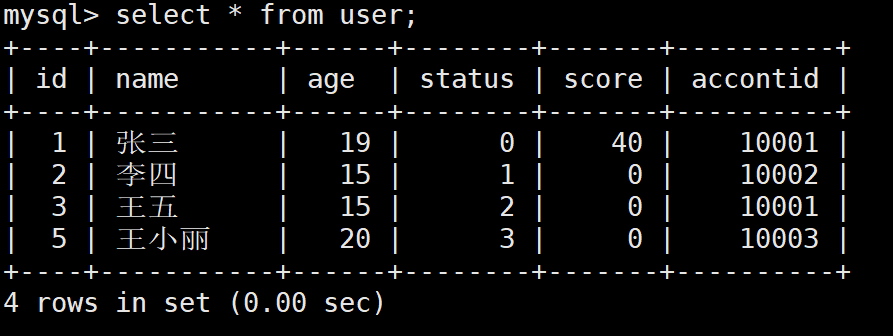

准备第二张表

```shell
mysql> create table orders(id int primary key auto_increment,order_num bigint,create_date datetime,money int) default
charset=utf8;
mysql> insert into orders values(1,201902020001,now(),200);
Query OK, 1 row affected (0.00 sec)

mysql> insert into orders values(2,201902019002,now(),100);
Query OK, 1 row affected (0.00 sec)

mysql> insert into orders values(3,201902019003,now(),300);
Query OK, 1 row affected (0.00 sec)
```

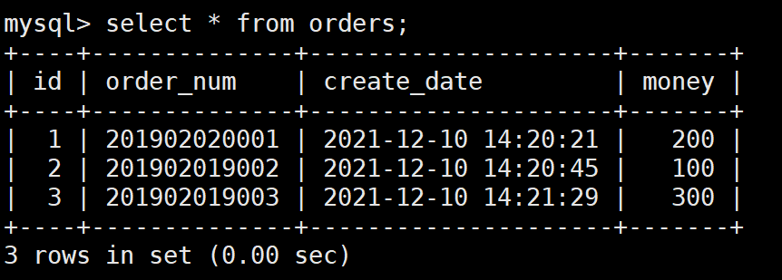

```shell
# 创建存储过程
mysql> delimiter //
mysql> create procedure test3()
begin
  begin
    declare userscount int default 0; -- 用户表中的数量
    declare ordercount int default 0; -- 订单表中的数量
    select count(*) into userscount from users;
    select count(*) into ordercount from orders;
    select userscount,ordercount; -- 返回用户表中的数量、订单表中的数量
  end;
  begin 
    declare maxmoney int default 0; -- 最大金额
    declare minmoney int default 0; -- 最小金额
    select max(money) into maxmoney from orders;
    select min(money) into minmoney from orders;
    select maxmoney,minmoney; -- 返回最大金额、最小金额
  end;
end //

mysql> delimiter ;
```

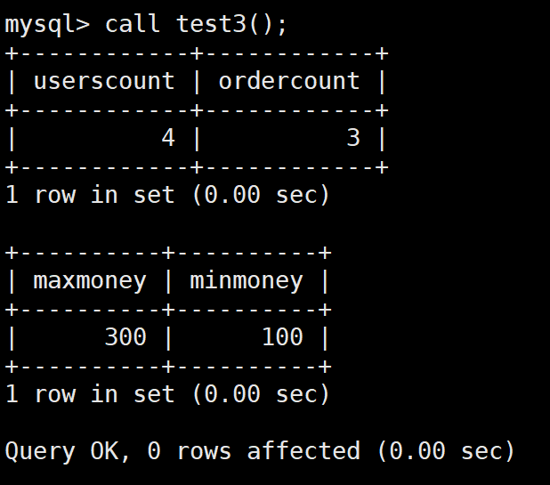

将userscount,ordercount改为局部变量，再次验证

```shell
mysql> delimiter //
create procedure test4()
    begin
      begin
        declare userscount int default 0; -- 用户表中的数量
        declare ordercount int default 0; -- 订单表中的数量
        select count(*) into userscount from users;
        select count(*) into ordercount from orders;
        select userscount,ordercount; -- 返回用户表中的数量、订单表中的数量
      end;
      begin 
        declare maxmoney int default 0; -- 最大金额
        declare minmoney int default 0; -- 最小金额
        select max(money) into maxmoney from orders;
        select min(money) into minmoney from orders;
        select userscount,ordercount，maxmoney,minmoney; -- 返回最金额、最小金额
       end;
    end //
mysql> delimiter ;
mysql> call test4; # 会报错
```

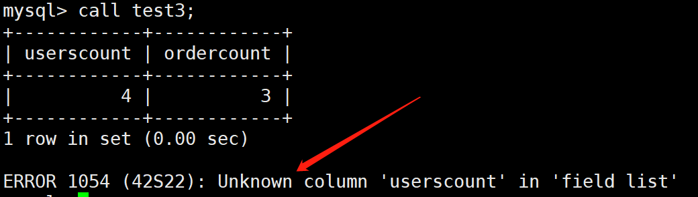

将userscount,ordercount改为全局变量，再次验证

```shell
mysql> delimiter //
create procedure test5()
    begin
        declare userscount int default 0; -- 用户表中的数量
        declare ordercount int default 0; -- 订单表中的数量
        begin
            select count(*) into userscount from users;
            select count(*) into ordercount from orders;
            select userscount,ordercount; -- 返回用户表中的数量、订单表中的数量
     	  end;
        begin 
          declare maxmoney int default 0; -- 最大金额
          declare minmoney int default 0; -- 最小金额
          select max(money) into maxmoney from orders;
          select min(money) into minmoney from orders;
          select userscount,ordercount,maxmoney,minmoney; -- 返回最金额、最小金额
        end;
    end //
mysql> delimiter ;
```

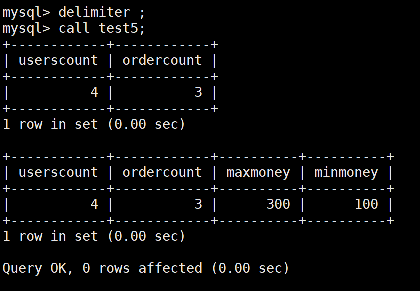

因此，存储过程中变量的作用域，作用范围在begin和end块之间，end结束变量的作用范围即结束

## 存储过程参数

### 1、基本语法

```shell
create procedure 名称([IN|OUT|INOUT] 参数名 参数数据类型 )
begin
.........
end
```

 存储过程的参数类型有：IN,OUT,INOUT，下面分别介绍这个三种类型：

###  2、存储过程的传出参数IN

·

​     说明：        


​        （1）传入参数：类型为in,表示该参数的值必须在调用存储过程时指定，如果不显示指定为in,那么默认就是in类型。

​        （2）IN类型参数一般只用于传入，在调用过程中一般不作为修改和返回

​        （3）如果调用存储过程中需要修改和返回值，可以使用OUT类型参数


通过一个实例来演示：

需求：编写存储过程，传入id,根据id返回name

```shell
# work表原来的内容
mysql> select * from work;
+------+----------+------+
| id   | name     | time |
+------+----------+------+
|    2 | youngfit | NULL |
+------+----------+------+
1 row in set (0.00 sec)

mysql> delimiter //
create procedure test2(userid int) 
begin 
  declare username varchar(32); 
  set username='feige';
  select name into username from work where id=userid;
  select username; 
end //
mysql> delimiter ;

mysql> call test2(2);
+----------+
| username |
+----------+
| youngfit |
+----------+
1 row in set (0.00 sec)

Query OK, 0 rows affected (0.00 sec)
```

另一张表做测试：

```shell
# users表中原来的内容们，这里修改了name下面的字段；
mysql> select * from users;
+----+----------+------+--------+-------+----------+
| id | name     | age  | status | score | accontid |
+----+----------+------+--------+-------+----------+
|  1 | feige    |   19 |      0 |    40 |    10001 |
|  2 | youngfit |   15 |      1 |     0 |    10002 |
|  3 | hadeng   |   15 |      2 |     0 |    10001 |
|  5 | james    |   20 |      3 |     0 |    10003 |
+----+----------+------+--------+-------+----------+
4 rows in set (0.00 sec)

mysql> delimiter //
create procedure test6(in userId int)   --这里就用了in
    begin
            declare username varchar(20);
            declare ordercount int default 0;
            select name into username from users where id=userId;
            select username;
    end //
mysql> delimiter ;
mysql> call test6(3);
+----------+
| username |
+----------+
| hadeng   |
+----------+
1 row in set (0.01 sec)
```

###  3、存储过程的传出参数out

需求：调用存储过程时，传入userId返回该用户的name

```shell
create procedure test5(in userId int,out username varchar(32))
begin
   select name into username from users where id=userId;
end;
```

调用以及运行结果如图：

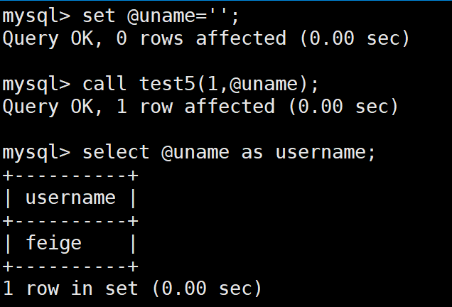

 概括：

​        1、传出参数：在调用存储过程中，可以改变其值，并可返回；

​        2、out是传出参数，不能用于传入参数值；

​        3、调用存储过程时，out参数也需要指定，但必须是变量，不能是常量；

​        4、如果既需要传入，同时又需要传出，则可以使用INOUT类型参数


### 4、存储过程的可变参数INOUT


        需求：调用存储过程时，传入userId和userName,即使传入，也是传出参数。

```shell
mysql> delimiter //
create procedure test6(inout userId int,inout username varchar(32))
begin
    set userId=2;
    set username='';
    select id,name into userId,username from users where id=userId;
end //
mysql> delimiter ;

# 调用以及结果显示：
mysql> set @uname='';
Query OK, 0 rows affected (0.00 sec)

mysql> set @userid=0;
Query OK, 0 rows affected (0.00 sec)

mysql> call test6(@userid,@uname);
Query OK, 1 row affected (0.00 sec)

mysql> select @userid,@uname as username;
+---------+----------+
| @userid | username |
+---------+----------+
|       2 | youngfit |
+---------+----------+
1 row in set (0.00 sec)
```

   概括：
        1、可变变量INOUT:调用时可传入值，在调用过程中，可修改其值，同时也可返回值；
        2、INOUT参数集合了IN和OUT类型的参数功能；
        3、INOUT调用时传入的是变量，而不是常量；

## 存储过程条件语句

   1、基本结构

   （1）条件语句基本结构：

```shell
if() then...else...end if;
```

   （2）、多条件判断语句：

```shell
if() then...
elseif() then...
else ...
end if;
```

   2、实例

​    实例1：编写存储过程，如果用户userId是偶数则返回username,否则返回userId

```shell
mysql> delimiter //
create procedure test7(in userId int)
begin
   declare username varchar(32) default '';
   if(userId%2=0)
   then 
      select name into username from users where id=userId;
      select username;
   else
      select userId;
   end if;
end //
mysql> delimiter ;
```

调用以及运行结果：

```shell
# 传入奇数
mysql> call test7(5);
+--------+
| userId |
+--------+
|      5 |
+--------+
1 row in set (0.00 sec)

Query OK, 0 rows affected (0.00 sec)
# 传入偶数
mysql> call test7(2);
+----------+
| username |
+----------+
| youngfit |
+----------+
1 row in set (0.00 sec)

Query OK, 0 rows affected (0.00 sec)
```

 2、存储过程的多条件语句应用示例

​        需求：根据用户传入的uid参数判断

​        （1）如果用户状态status为1，则给用户score加10分

​        （2）如果用户状态status为2，则给用户score加20分

​        （3）其他情况加30分

先看users表中原来的数据：

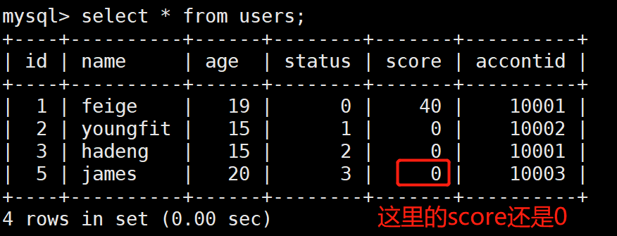

```shell
mysql> delimiter //
create procedure test8(in userid int)
begin
   declare my_status int default 0;
   select status into my_status from users where id=userid;
   if(my_status=1)
   then 
       update users set score=score+10 where id=userid;
    elseif(my_status=2)
    then 
       update users set score=score+20 where id=userid;
    else 
       update users set score=score+30 where id=userid;
    end if;
end //
mysql> delimiter ;
mysql> call test8(5);
```

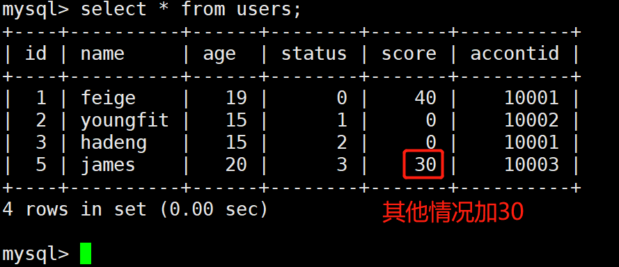

## 存储过程循环语句

1、while语句

（1）while语句的基本结构

```shell
while(表达式) do 
   ......  
end while;
```

（2）示例
    需求：使用循环语句，向表test1(id)中插入10条连续的记录

```shell
# 先创建1个test1表格
mysql> create table test1(id int)

mysql> delimiter //
create procedure test9()
begin
  declare i int default 0;
  while(i<10) do 
    begin 
        select i;
        set i=i+1;
        insert into test1(id) values(i);
     end;
  end while;
end //
mysql> delimiter ;
mysql> call test9;
```

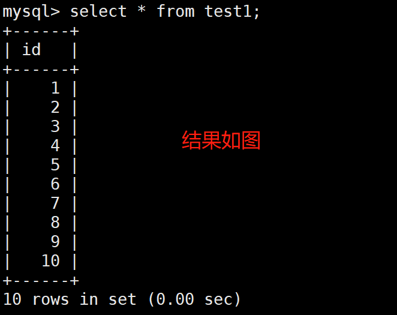

2、repeat语句
    （1）repeat语句基本的结构：

```shell
repeat...until...end repeat;
```

（2）示例

需求：给test1表中的id字段插入数据，从1到10

```shell
mysql> delimiter //
create procedure test13()
begin
    declare i int default 0;
    repeat 
    begin 
        select i;
        set i=i+1;
        insert into test1(id) values(i);
    end;
    until i>=10 -- 如果i>=10,则跳出循环
    end repeat;
end //
mysql> delimiter;
mysql> call test1;
```


   概括：
        until判断返回逻辑真或者假，表达式可以是任意返回真或者假的表达式，只有当until语句为真是，循环结束。

# 存储过程游标的使用


1、什么是游标
游标是保存查询结果的临时区域
2、示例
需求：编写存储过程，使用游标，把users表中 id为偶数的记录逐一更新用户名

```shell
mysql> delimiter //
create procedure test11()
    begin
        declare stopflag int default 0;
        declare username VARCHAR(32);
        -- 创建一个游标变量，declare 变量名 cursor ...
        declare username_cur cursor for select name from users where id%2=0;
        -- 游标是保存查询结果的临时区域
        -- 游标变量username_cur保存了查询的临时结果，实际上就是结果集
        -- 当游标变量中保存的结果都查询一遍(遍历),到达结尾，将变量stopflag设置为1，用于循环中判断是否结束
        declare continue handler for not found set stopflag=1;
 
        open username_cur; -- 打卡游标
        fetch username_cur into username; -- 游标向前走一步，取出一条记录放到变量username中
        while(stopflag=0) do -- 如果游标还没有结尾，就继续
            begin 
                -- 在用户名前门拼接 '_cur' 字符串
                update users set name=CONCAT(username,'_cur') where name=username;
                fetch username_cur into username;
            end;
        end while; -- 结束循环
        close username_cur; -- 关闭游标
    end;
mysql> delimiter ;
```

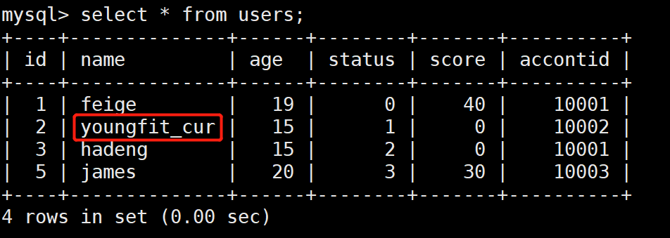