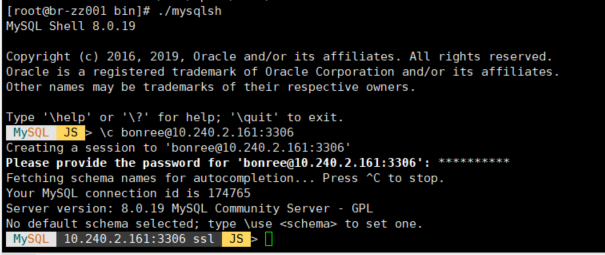
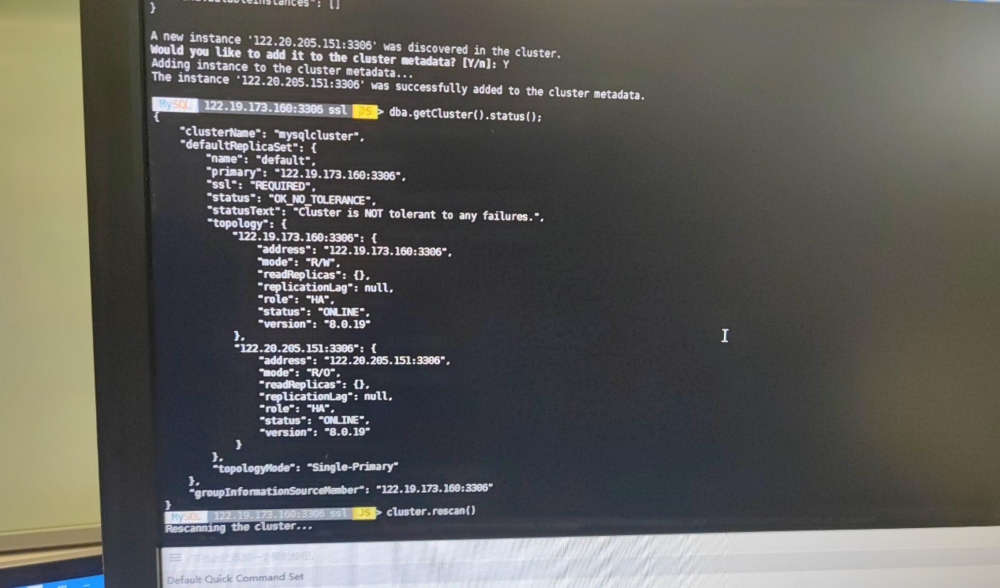
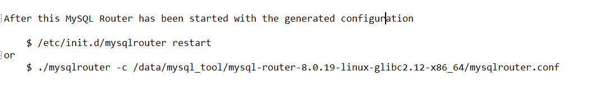
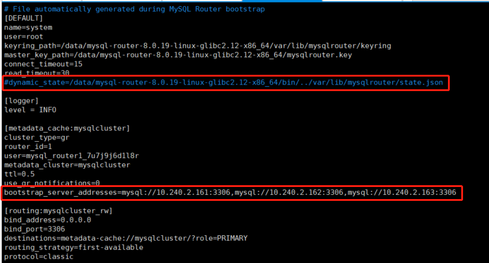
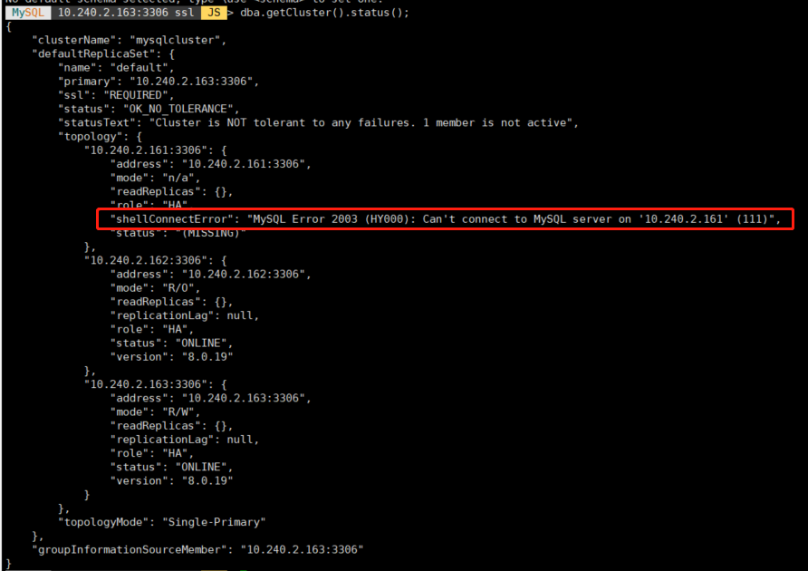
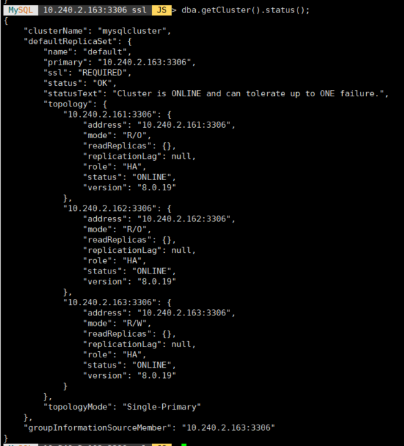

# Mysql8-MIC

Mysql8.0-MIC

目录

[一、数据库安装	2](https://www.yuque.com/yuqueyonghusrzc8b/ny8mz3/vgn42rzk645qhhce#_Toc69135051)

[二、安装mysql-shell和mysql-router	2](https://www.yuque.com/yuqueyonghusrzc8b/ny8mz3/vgn42rzk645qhhce#_Toc69135052)

[三、利用mysql-shell搭建集群	2](https://www.yuque.com/yuqueyonghusrzc8b/ny8mz3/vgn42rzk645qhhce#_Toc69135053)

[1、用root用户分别在三台数据库上建用户 授权	2](https://www.yuque.com/yuqueyonghusrzc8b/ny8mz3/vgn42rzk645qhhce#_Toc69135054)

[2、搭建集群	3](https://www.yuque.com/yuqueyonghusrzc8b/ny8mz3/vgn42rzk645qhhce#_Toc69135055)

[检查配置信息	3](https://www.yuque.com/yuqueyonghusrzc8b/ny8mz3/vgn42rzk645qhhce#_Toc69135056)

[配置持久化，用于集群管理	3](https://www.yuque.com/yuqueyonghusrzc8b/ny8mz3/vgn42rzk645qhhce#_Toc69135057)

[创建一个mysqlcluster的集群	3](https://www.yuque.com/yuqueyonghusrzc8b/ny8mz3/vgn42rzk645qhhce#_Toc69135058)

[查看集群信息	4](https://www.yuque.com/yuqueyonghusrzc8b/ny8mz3/vgn42rzk645qhhce#_Toc69135059)

[在集群中添加实例(两个从库都执行)	4](https://www.yuque.com/yuqueyonghusrzc8b/ny8mz3/vgn42rzk645qhhce#_Toc69135060)

[四、利用mysql-router做vip漂移，故障恢复	5](https://www.yuque.com/yuqueyonghusrzc8b/ny8mz3/vgn42rzk645qhhce#_Toc69135061)

[五、测试	6](https://www.yuque.com/yuqueyonghusrzc8b/ny8mz3/vgn42rzk645qhhce#_Toc69135062)

[六、配置文件修改	8](https://www.yuque.com/yuqueyonghusrzc8b/ny8mz3/vgn42rzk645qhhce#_Toc69135063)

Mysql架构: 一主两从

服务器：122.19.173.160(主) 122.20.205.131（从），122.20.205.151（从）

# 一、数据库安装

1.mysql安装。基于架构部提供的ansible的安装包进行安装，修改hosts.ini，分别在3台机器上进行mysql的安装。

2.修改配置文件  my.cnf，三台机器server_id不能相同。

server_id=xxx

report_host=当前服务器ip

report_port=数据库端口

loose-group_replication_ip_whitelist="ip1,ip2,ip3"

改完之后重启mysql：docker restart br-mysql

二、安装mysql-shell和mysql-router（shell只装一个即可，router三个都需要装（有vip就装三个，没vip只装一个））

wget https://downloads.mysql.com/archives/get/p/43/file/mysql-shell-8.0.19-linux-glibc2.12-x86-64bit.tar.gz

tar -zxvf [mysql-shell-8.0.19-linux-glibc2.12-x86-64bit.tar.gz](https://downloads.mysql.com/archives/get/p/43/file/mysql-shell-8.0.19-linux-glibc2.12-x86-64bit.tar.gz)

tar -zxvf  mysql-router-8.0.19-linux-glibc2.12-x86_64.tar.xz

# 三、利用mysql-shell搭建集群

1、用root用户分别在三台数据库上建用户 授权（有bonree用户的话可以先drop user bonree;在执行下面的授权，每台都全部执行）

create user bonree identified by 'Bonree@365';

GRANT BACKUP_ADMIN, CLONE_ADMIN, CREATE USER, EXECUTE, FILE, PERSIST_RO_VARIABLES_ADMIN, PROCESS, RELOAD, REPLICATION CLIENT, REPLICATION SLAVE, SELECT, SHUTDOWN, SUPER, SYSTEM_VARIABLES_ADMIN ON *.* TO 'bonree'@'%' WITH GRANT OPTION;

GRANT DELETE, INSERT, UPDATE ON mysql.* TO 'bonree'@'%' WITH GRANT OPTION;

GRANT ALTER, ALTER ROUTINE, CREATE, CREATE ROUTINE, CREATE TEMPORARY TABLES, CREATE VIEW, DELETE, DROP, EVENT, EXECUTE, INDEX, INSERT, LOCK TABLES, REFERENCES, SHOW VIEW, TRIGGER, UPDATE ON mysql_innodb_cluster_metadata.* TO 'bonree'@'%' WITH GRANT OPTION;

GRANT ALTER, ALTER ROUTINE, CREATE, CREATE ROUTINE, CREATE TEMPORARY TABLES, CREATE VIEW, DELETE, DROP, EVENT, EXECUTE, INDEX, INSERT, LOCK TABLES, REFERENCES, SHOW VIEW, TRIGGER, UPDATE ON mysql_innodb_cluster_metadata_bkp.* TO 'bonree'@'%' WITH GRANT OPTION;

GRANT ALTER, ALTER ROUTINE, CREATE, CREATE ROUTINE, CREATE TEMPORARY TABLES, CREATE VIEW, DELETE, DROP, EVENT, EXECUTE, INDEX, INSERT, LOCK TABLES, REFERENCES, SHOW VIEW, TRIGGER, UPDATE ON mysql_innodb_cluster_metadata_previous.* TO 'bonree'@'%' WITH GRANT OPTION;

grant all on *.* to 'bonree'@'%';

grant all privileges on *.* to bonree with grant option;

## 2、搭建集群

cd [mysql-shell-8.0.19-linux-glibc2.12-x86-64bit](https://downloads.mysql.com/archives/get/p/43/file/mysql-shell-8.0.19-linux-glibc2.12-x86-64bit.tar.gz)/bin/

./mysqlsh

连接122.19.173.160（连主）

\c [bonree@122.19.173.160:3306](mailto:bonree@122.19.173.160:3306)

输入密码

### 检查配置信息

dba.checkInstanceConfiguration()

### 配置持久化，用于集群管理

dba.configureInstance('bonree@192.168.90.7:3306')

dba.configureInstance('bonree@192.168.90.8:3306')

dba.configureInstance('bonree@192.168.90.9:3306')

以上操作执行完毕之后，手动重启mysql容器

### 创建一个mysqlcluster的集群（三台服务器都需要是空白的）

var cluster=dba.createCluster('mysqlcluster');

### 查看集群信息

cluster.status()（利用shell连接变量是一次性的，如果退出重连，则需如下命令）

dba.getCluster().status()

### 在集群中添加实例(两个从库都执行)

cluster.addInstance('bonree@192.168.90.7:3306')（同上，退出后重新连接得用如下命令）

var cluster=dba.getCluster();cluster.addInstance(‘bonree@122.20.205.131:3306’)

添加实例过程中，会通过clone方式将160上的数据clone到131上，clone之后会重启131上的mysql。如果是采用的docker镜像，手动将进行restart。

如果添加过程中添加失败，可以 执行cluster.rescan()重新扫描加入集群

实例添加完成后，查看进行信息 

cluster.status();

三个数据库节点信息都显示，则成功

# 四、利用mysql-router做vip漂移，故障恢复

mysql-router对接innodb cluster集群

cd mysql-router-8.0.19-linux-glibc2.12-x86_64/bin

./mysqlrouter --bootstrap bonree@122.19.173.160:3306 --user=root

执行完信息如下，提示执行启动命令，配置文件是mysqlrouter.conf，先不启动。

修改配置文件 vim mysqlrouter.conf

将dynamic_state进行注释，添加bootstrap_server_addresses信息。保存后启动mysqlrouter

启动命令

cd mysql-router-8.0.19-linux-glibc2.12-x86_64/bin

./mysqlrouter -c /data/mysql-router-8.0.19-linux-glibc2.12-x86_64/mysqlrouter.conf &

默认6446端口为提供服务端口，可以修改mysqlrouter.conf修改

对外提供的mysql访问地址：mysqlrouter所在的ip:6446

其中一台数据库尝试连接，测试连通性：

mysql -ubonree -pBonree@365 -hmysql-router的ip -P6446

删除sdk库drop database br_sdk_druid

导入br_sdk_druid.sql   br_sdk_druid_init.sql

删除zues库,然后创建：

CREATE DATABASE /*!32312 IF NOT EXISTS*/ `zeusdb` DEFAULT CHARACTER SET utf8 COLLATE utf8_general_ci;

导入zeusdb.sql

执行py脚本

# 五、测试

将160docker停掉

连接mysql可以连接

在mysql-shell中查看集群状态

./mysqlsh

\c [bonree@10.240.2.163:3306](mailto:bradmin@10.240.48.71:3306)

dba.getCluster().status();

启动160上mysql容器后恢复

# 六、配置文件修改

1、修改配置文件数据库地址，修改global：

% s/convertToNull/CONVERT_TO_NULL/g

% s/10.240.2.133:3306/122.19.173.160:6446,122.20.205.131:6446,122.20.205.151:6446/g

把旧的数据库地址修改为新的数据库地址

修改完写zk

2、所有有druid的服务器都要修改：

/data/br/conf/druid/ _common/common.runtime.properties

% s/10.240.2.133:3306/122.19.173.160:6446,122.20.205.131:6446,122.20.205.151:6446/g

把旧的数据库地址修改为新的数据库地址

3、所有middlemanager都需修改如下配置：

/data/br/conf/presto/etc/catalog/zeus/production.cluster

把修改旧数据库地址，当前版本sdk5.11.3，只有上述一个文件有数据库地址的配置，保险起见，建议都检查下

修改完成后，重启druid组件和各产品组
