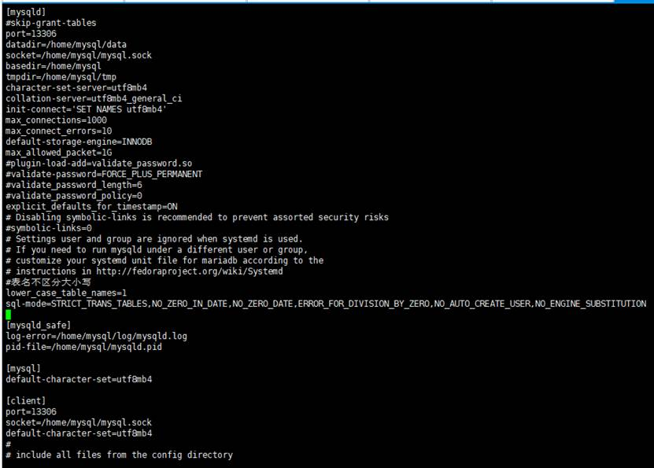
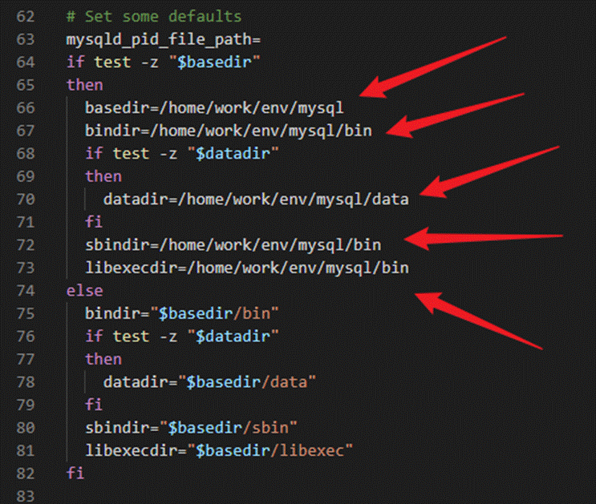
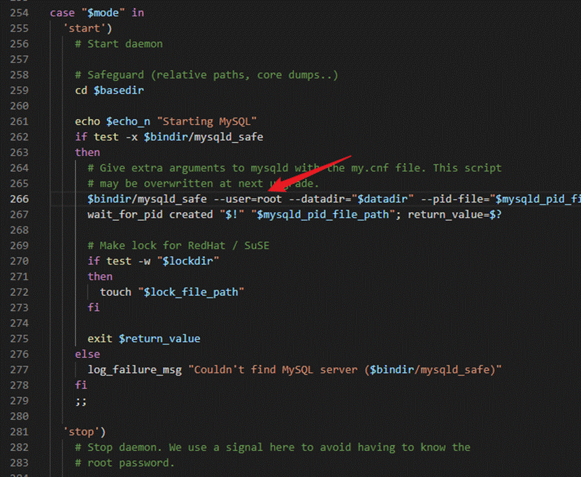
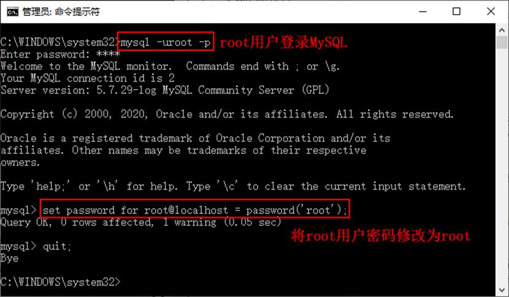

\1. 安装环境

操作系统：Centos 7

 

1.1  删除 现有环境mysql 数据库

rpm – qa|grep mysql

rpm -e ***

1.1.1    删除所有与 mysql 数据库关联的目录，注意如果是python关联模块为mysql，别乱删除

find / -name mysql

rm -rf 所有关联的目录（文件夹）

 

特别是（如果存在的话）

 

rm -rf /etc/init.d/mysqld

 

1.2 强制停止 mysql 服务进程

ps -ef |grep mysqld

 

kill -9 pid编号

 

ps -ef |grep mysql

 

kill -9 pid编号

 

如果全新的服务器，可以从这一步开始做

 

\2. 安装mysql 依赖

安装msyql 依赖shell 命令：

 

yum -y install libaio

yum -y install numactl

 

\3. 判断有无mysql用户

shell命令：

 

id msyql

 

没有则创建msyql用户

 

shell命令：

 

groupadd mysql

useradd -r -g mysql mysql

 

 

cd /home/

 

解压 tar.gz 安装包

 

tar -zxvf mysql-5.7.23-linux-glibc2.12-x86_64.tar.gz

 

改名

 

mv mysql-5.7.23-linux-glibc2.12-x86_64/ mysql/

 

进入该mysql安装文件内

 

cd mysql/

 

4.1 创建相应目录规范化

mkdir -p {data,log,tmp}

 

分配文件权限，不然有可能会报错

 

chown -R mysql:mysql /home/mysql

chmod –R 777 /home/mysql     -----755亦可

 

\5. 定义 /etc/my.cnf

查看有无/etc/my.cnf文件，没有则创建，当然这里笔者没弄过，感觉是之前留下来的文件，如果已经存在了该文件，那么只需要修改里面的配置就好了，如果没有后面可能需要在初始化 mysql数据库时，需要添加相应的 basedir 和 datadir log-error等参数。

/etc/my.cnf文件内的配置和初始化mysql时的参数配置是对应的，示例如下：

 

|      |                                                              |
| ---- | ------------------------------------------------------------ |
|      | ![文本框: [mysqld] port=13306 datadir=/home/mysql/data socket=/home/mysql/mysql.sock basedir=/home/mysql tmpdir=/home/mysql/tmp character-set-server=utf8mb4 collation-server=utf8mb4_general_ci init-connect='SET NAMES utf8mb4' max_connections=1000 max_connect_errors=10 default-storage-engine=INNODB #plugin-load-add=validate_password.so #validate-password=FORCE_PLUS_PERMANENT #validate_password_length=6 #validate_password_policy=0 explicit_defaults_for_timestamp=ON # Disabling symbolic-links is recommended to prevent assorted security risks #symbolic-links=0 # Settings user and group are ignored when systemd is used. # If you need to run mysqld under a different user or group, # customize your systemd unit file for mariadb according to the # instructions in http://fedoraproject.org/wiki/Systemd #表名不区分大小写 lower_case_table_names=1 sql-mode=STRICT_TRANS_TABLES,NO_ZERO_IN_DATE,NO_ZERO_DATE,ERROR_FOR_DIVISION_BY_ZERO,NO_AUTO_CREATE_USER,NO_ENGINE_SUBSTITUTION  [mysqld_safe] log-error=/home/mysql/log/mysqld.log pid-file=/home/mysql/mysqld.pid  [mysql] default-character-set=utf8mb4  [client] port=13306 socket=/home/mysql/mysql.sock default-character-set=utf8mb4 # # include all files from the config directory # !includedir /etc/my.cnf.d  ](assets/mysql离线安装--单节点/clip_image003.gif) |

 

这个文件最为关键，自定义目录mysql安装 精华版安装的核心在于其配置,直接复制粘贴，无需修改

 

\6. 配置mysql服务

cd /home/mysql/support-files

 

复制到开机启动服务文件目录内

 

cp mysql.server /etc/init.d/mysqld

 

\7. 修改 /etc/init.d/mysqld 配置文件

vi /etc/init.d/mysqld

 

默认的安装路径：（如果按上面的my.cnf配置文件模板去配置的话，就按这个默认安装的配置）

 

basedir=/home/mysql

bindir=/home/mysql/bin

datadir=/home/mysql/data

sbindir=/home/mysql/bin

libexecdir=/home/mysql/bin

 

 

7.1 特别修改

可能会启动不了，如果一直是用 root 用户安装 mysql 的话，所以需要修改一下，用户登录为 root

 

vi /etc/init.d/mysqld

 

增加 --user=root

 

 

 

验证登录

创建软连接

ln -s /home/mysql/bin/mysql /usr/bin/mysql

 

8.1 默认 /etc/my.cnf 文件存在

先配置好该文件，才对mysql安装文件进行初始化命令。

 

cd 到 /home/mysql/ 路径下输入如下命令，初始化 mysql 数据库

 

./bin/mysqld --user=mysql

 

8.2 默认 /etc/my.cnf 存在，但没有配置(供参考，一般使用上面配置过文件的方法)

（如果不去配置 /etc/my.cnf 那么，就可以在安装msyql 初始化时，输入相应参数）

 

上面的命令，修改为：

 

./bin/mysqld --user=mysql --initialize --basedir=/home/mysql --datadir=/home/mysql/data

 

建议使用

./bin/mysqld --user=mysql --initialize --basedir=/home/mysql --datadir=/home/mysql/data

 

 

8.3安装后，使用以下命令启动mysql

/etc/init.d/mysqld restart

 

 

 

服务器登录mysql：

 

mysql -uroot -p

 

输入初始化时屏幕显示的密码

 

 

登录进mysql，修改root密码以及开启远程访问

set password for username @localhost = password(newpwd);

例如：

set password for root@localhost = password('SG_i60002_0db');

 

use mysql；

1、 改表法：

 

可能是你的帐号不允许从远程登陆，只能在localhost。这个时候只要在localhost的那台电脑，登入mysql后，更改 “mysql” 数据库里的 “user” 表里的 “host” 项，从“localhost”改称”%”mysql -u root -p

 

mysql>use mysql;

 

mysql> update user set host = '%' where user='root';

 

mysql>flush privileges;

 

mysql> select host,user from user where user='root';

 

现在就可以连接了！

 

2、 授权法：

 

例如，你想root使用root从任何主机连接到mysql服务器的话。

GRANT ALL PRIVILEGES ON *.* TO 'root'@'%' IDENTIFIED BY 'SG_i60002_0db' WITH GRANT OPTION;

 

flush privileges;

 

 

参考链接：https://blog.csdn.net/qq_42701659/article/details/127529735

 

 