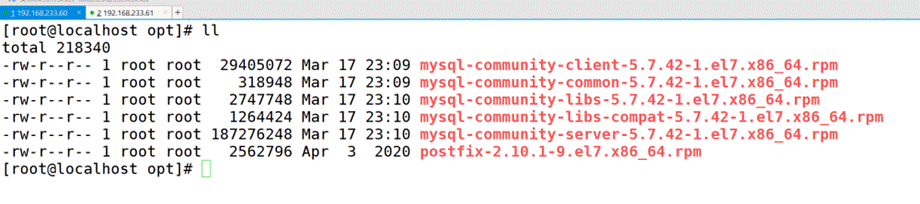
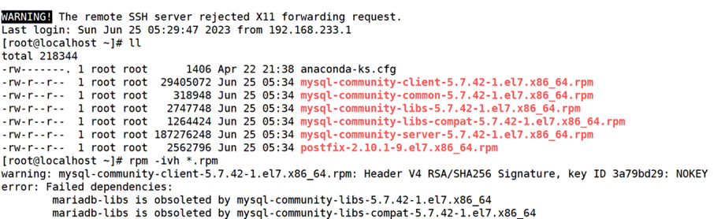
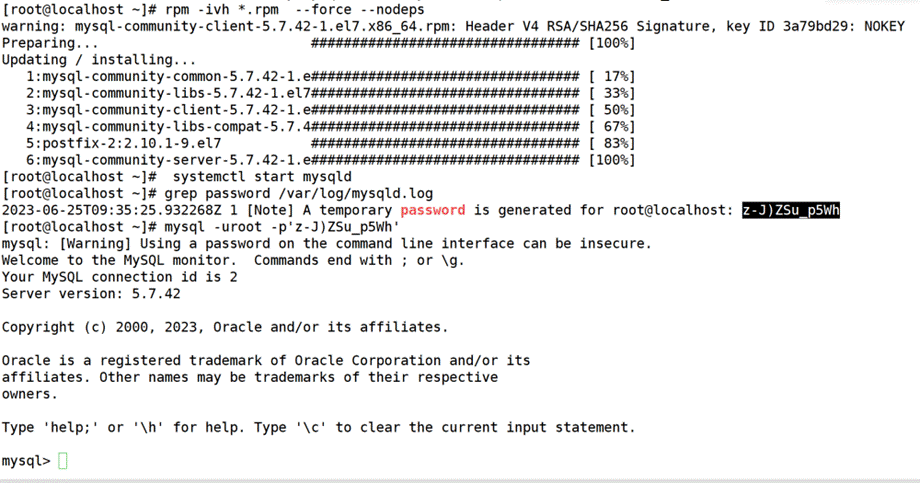
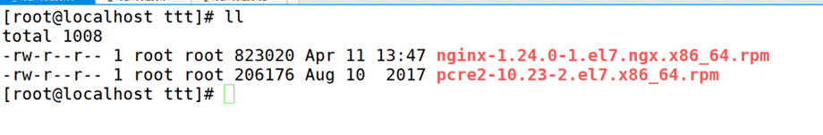
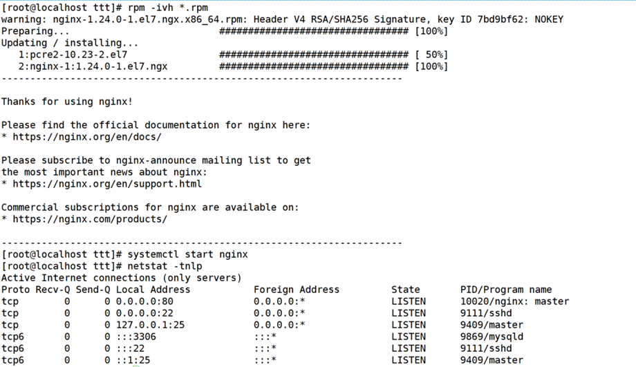
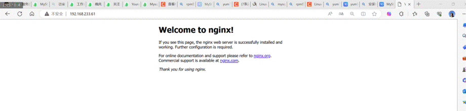

# 内网离线安装

在内网安装由于没有yum源，安装任何东西只有该软件的rpm包，安装时发现各种报错需要依赖，该方法是解决一切依赖，任何软件通用。

首先在自己电脑上安装个和内网同环境的操作系统。

## mysql

比如我们要在内网下载MySQL5.7，先按照正常的安装流程。

wget https://dev.mysql.com/get/mysql80-community-release-el7-7.noarch.rpm 官网下载MySQL源
 rpm -ivh mysql80-community-release-el7-7.noarch.rpm     安装MySQL源
 vim /etc/yum.repos.d/mysql-community.repo          修改5.7版本
  yum install -y --downloadonly --downloaddir=/opt  mysql-community-server mysql 
 下载MySQL服务端和客户端包加依赖
 

--downloadonly    只下载不安装
 --downloaddir=/opt  下载到opt目录下
 

yum reinstall -y --downloadonly --downloaddir=/opt  mysql-community-server  mysql
 这个是你已经安装了MySQL的基础上只下载包
 

把包和需要的依赖下载下来了，然后把包传到内网环境。（我这里62模仿内网）

[root@localhost ~]# rpm -ivh *.rpm  安装所有rpm包
 

报错了，这里说的是这是由于yum安装了旧版本的GPG keys造成的 解决办法：

后面加上 --force --nodeps

（这里是MySQL安装需要加上不验证密钥，其他软件不需要。）

rpm -ivh *.rpm --force --nodeps  
 

安装成功，验证

[root@localhost ~]# systemctl start mysqld
 grep password /var/log/mysqld.log
 mysql -uroot -p'4IPdppp7ya.d'
 

## nginx

比如说nginx

rpm -Uvh http://nginx.org/packages/centos/7/noarch/RPMS/nginx-release-centos-7-0.el7.ngx.noarch.rpm
 yum install -y --downloadonly --downloaddir=/ttt nginx
 scp *.rpm 192.168.233.61:/ttt
 

rpm -ivh *.rpm
 systemctl start nginx
 netstat -tnlp
 

