# 数据库可视化工具

### navicat安装教程

软件包百度网盘：

链接：https://pan.baidu.com/s/1S4K8HhQvx4SAYgtLG-2Hhg 

提取码：wtne 


安装教程网址

```shell
https://www.jianshu.com/p/da0cc500a80a
```


第一步首先安装 navicat，到注册那一步


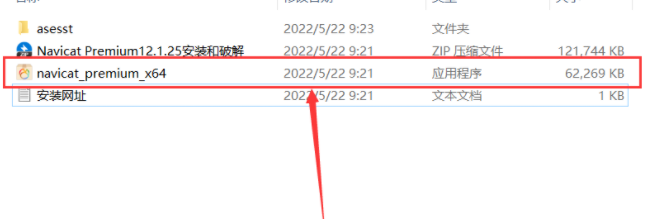


创建一个目录，解压上面的破解版，用于安装存放产生的注册码


### 安装navicat

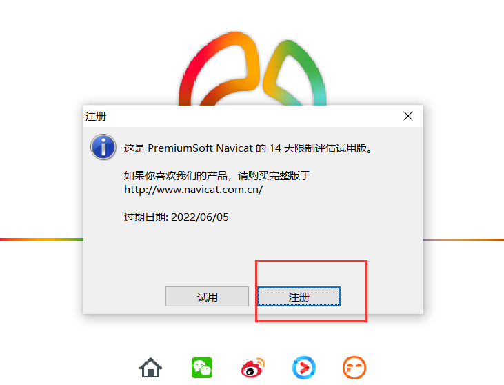


安装到注册这一步，放到这里
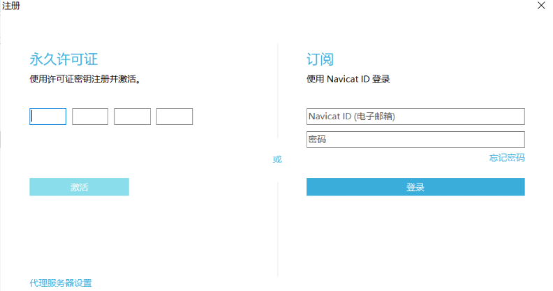

打开破解版的目录，找到里面解压的资源，这里友情提示，可能你的电脑有防火墙啥的拦截不让安装，关闭一下就可以安装了


### 重点，右键以管理员身份运行


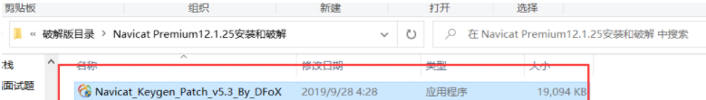


打开工具样式


##### 第一步生产注册码


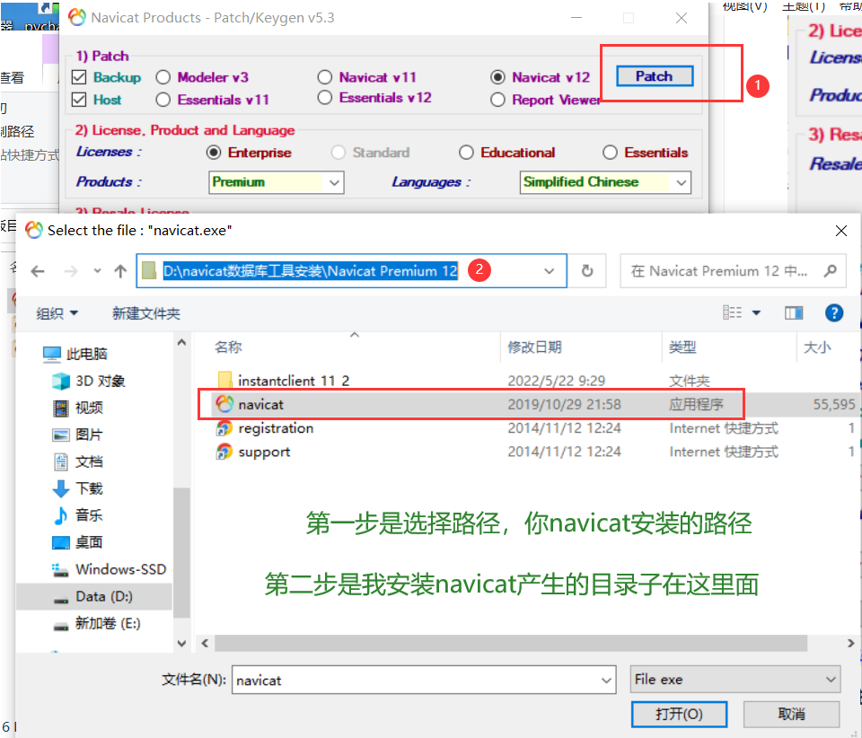


### 打开出现这个表示成功，必须出现这个

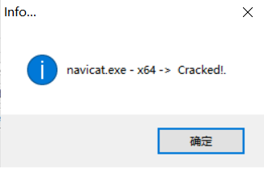


如果没有出现这个，就会产生不来注册码，卸载navicat，再次安装到其他目录


##### 第二步骤

点击一下Enterprise

```shell
如图所示 License, Product and Language这一项License选Enterprise, Products为Premium，Languages为Simplified Chinese
Resale License这一项中Resale Version选Site license
```


产生注册码，点击generate生成 按钮

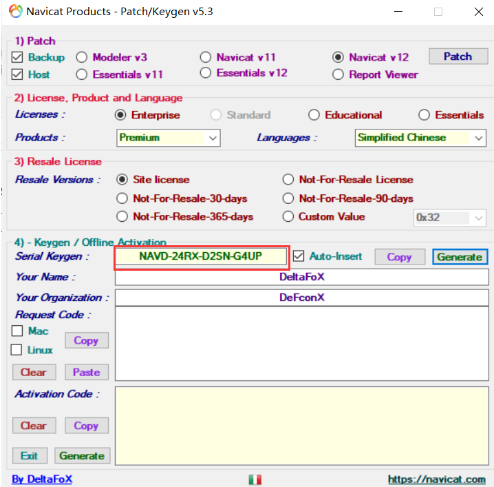


##### 运行软件Navicat Premium，点击注册按钮，将注册机中的注册码复制到窗口中，点击激活


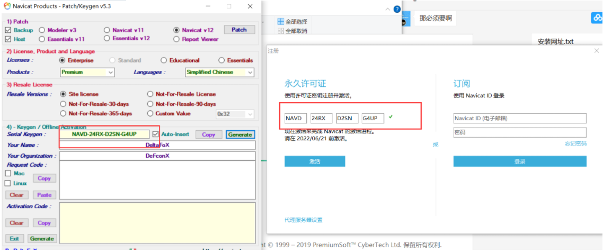


##### 出现以下提示，点击手动激活选项


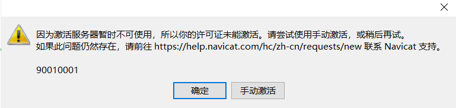


##### 将软件中的申请码复制到注册机中


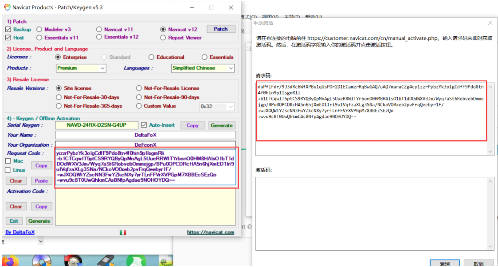


##### 点击生成按钮


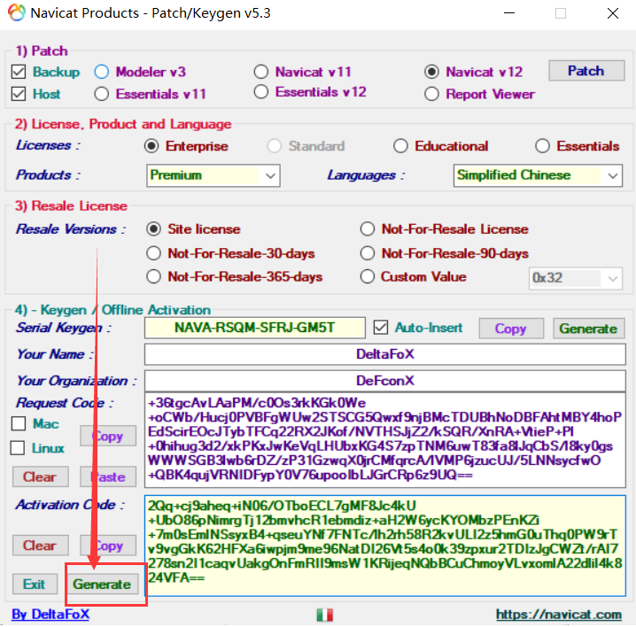


##### 将手动激活码复制到软件中，点击激活


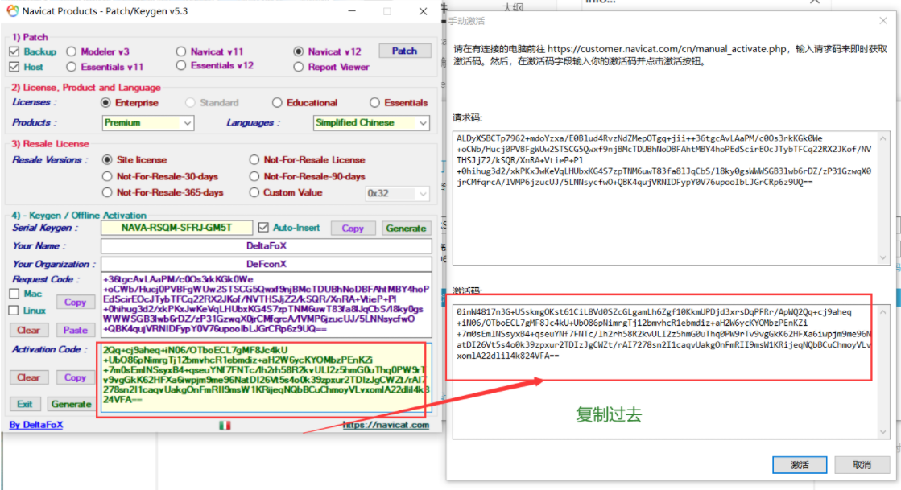


##### 激活成功


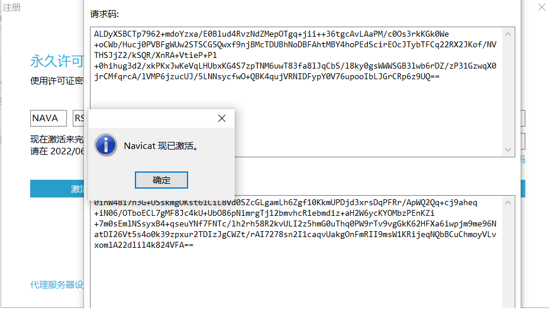


##### 查看许可证


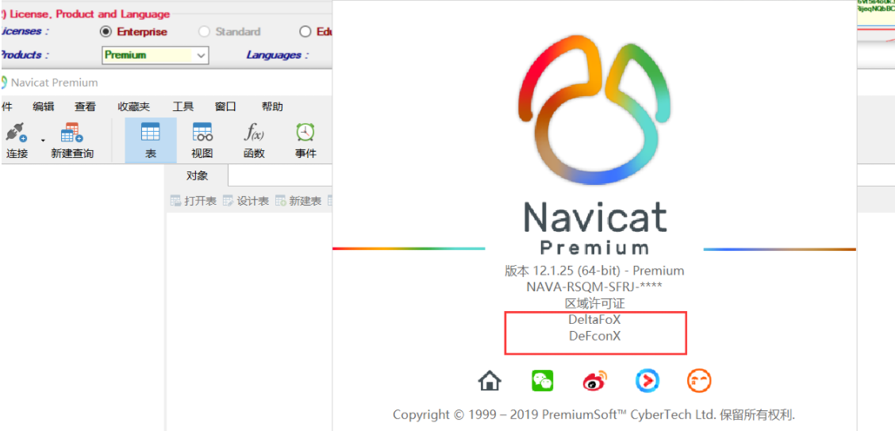
进入Navicat Premium 软件，点击上面区域的 帮助 选项中的 关于 即可查看是否真的激活


### 遇到问题总结


###### 激活navicat提示rsa public key not find的问题


操作顺序先不打开[Navicat](https://so.csdn.net/so/search?q=Navicat&spm=1001.2101.3001.7020)，注机patch，然后再开Navicat注册


卸载原来的navicat重新安装再次点击patch选择路径就行了


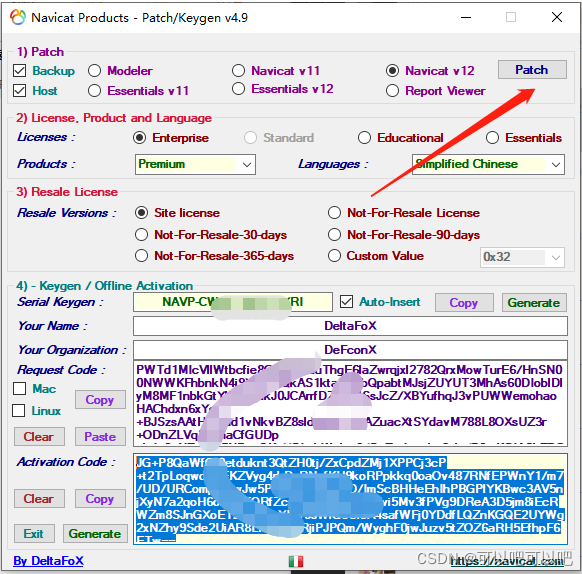


###### 还不行就记得,右键激活工具以管理员权限打开激活再次patch选择navicat的安装好的navicat.exe文件即可