# Elasticsearch索引生命周期管理方案

# Elasticsearch索引生命周期管理方案

## 1、生命周期

通常在一个非常大规模的日志系统中，Elasticsearch集群的数据节点通常会被拆分为hot, warm, cold三种类型的节点，不同的节点采用不同规则的硬件设备，不同时间段的数据存放在不同的节点上，比如近7天日志数据存放在磁盘io性能最强的hot节点上，7-15天的数据存储在io性能次之的warm节点，15-30天数据存储在cold节点，超过30天的数据自动删除。

### 1.1  阶段介绍

索引生命周期管理(`Index Lifecycle Managerment`，`ILM`)，是一种可以随着时间自动化管理索引的工具，适合管理重要性随着时间降低的索引，比如监控指标、日志这种类型的数据。在ILM之前，日志系统中索引通常以日期为格式进行写入，然后通过计划任务定时删除过期的数据，但是这种方式并不灵活。通常索引会经历以下阶段：


1.  Hot阶段：该阶段索引可以被频繁的更新和查询 
2.  Warm阶段：该阶段索引很少被更新，但是仍然经常被查询到 
3.  Cold阶段：此阶段索引已经不再被更新，可以进行查询，但是运行查询速度比较慢 
4.  Delete阶段：此阶段索引基本没用价值，可以被安全的删除 


ILM其实就是通过策略触发索引管理动作完成上述节点的管理，主要动作如下：


1.  xxxxxxxxxx cgexec -g cpu:CPU50_Nginx_Grouop systemctl start nginxshell
2.  缩容(Shrink)：降低索引的主分片的数量提升查询性能 
3.  合并(Force Merge)：通过强制合并，降低索引分片中的段的数量 
4.  冻结(Freeze)：通过设置索引只读来冻结索引 
5.  删除(Delete)：通过删除索引释放磁盘空间 


不同版本的Elasticsearcher管理对各阶段生命索引时支持的动作差别较大，需要对照对应官方文档查看。此处以7.16版本为例：管理索引生命周期策略支持的阶段和各个阶段支持的动作以及执行顺序如下：


其中hot主要负责对索引进行rollover操作。rollover负责滚动更新创建的新索引将添加到索引别名，并被指定为写索引。


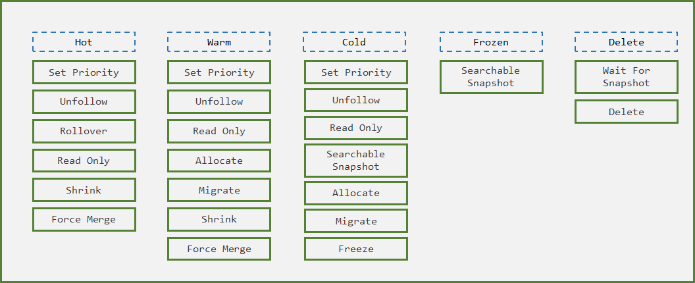


**设定ILM策略的流程如下**：


1.  设置ILM策略：如果data节点有设置数据分层(热温冷)，可设置多个阶段，否则设置hot和delete就行了 
2.  设置索引模板：在该模板中使用`index.lifecycle.name`指定ILM策略名称，使用`index.lifecycle.rollover_alias`指定滚动的索引别名，该别名只能被一个索引使用。 
3.  创建写入索引：该索引的`aliases`需要显式指定`index.lifecycle.rollover_alias`别名的`is_write_index`属性为`true` 
4.  写入数据：数据写入到索引别名，即`index.lifecycle.rollover_alias` 


需要注意的是：


- 索引模板中的aliases字段中不能引用`index.lifecycle.rollover_alias`别名，否则报错
- 因为写入索引别名只能管一个索引，因此索引的生命周期只能针对一个输入源，进而在这种场景中，通常索引模板只针对一个索引模式


## 2、模拟过程（简易）


可以PUT命令创建，也可以在kibana中创建


docker启动es和kibana，方便操作


```bash
version: '3'
services:
  node-01:
    image: elasticsearch:c'd
    container_name: node-01
    environment:
      - node.name=node-01
      - cluster.name=es-docker-cluster
      - discovery.seed_hosts=node-02,node-03
      - cluster.initial_master_nodes=node-01,node-02,node-03
      - bootstrap.memory_lock=true
      - node.attr.data=hot
      - "ES_JAVA_OPTS=-Xms512m -Xmx512m"
    ulimits:
      memlock:
        soft: -1
        hard: -1
    volumes:
      - /data/elk/elasticsearch/cluster/data/node-01:/usr/share/elasticsearch/data
    ports:
      - 127.0.0.1:9200:9200
      - 127.0.0.1:5601:5601
    extra_hosts:
      - 'elasticsearch:127.0.0.1'
    deploy:
      resources:
        limits:
          cpus: '1'
          memory: '1024m'

  node-02:
    image: elasticsearch:7.16.2
    container_name: node-02
    environment:
      - node.name=node-02
      - cluster.name=es-docker-cluster
      - discovery.seed_hosts=node-01,node-03
      - cluster.initial_master_nodes=node-01,node-02,node-03
      - bootstrap.memory_lock=true
      - node.attr.data=warm
      - "ES_JAVA_OPTS=-Xms512m -Xmx512m"
    ulimits:
      memlock:
        soft: -1
        hard: -1
    volumes:
      - /data/elk/elasticsearch/cluster/data/node-02:/usr/share/elasticsearch/data
    deploy:
      resources:
        limits:
          cpus: '1'
          memory: '1024m'

  node-03:
    image: elasticsearch:7.16.2
    container_name: node-03
    environment:
      - node.name=node-03
      - cluster.name=es-docker-cluster
      - discovery.seed_hosts=node-01,node-02
      - cluster.initial_master_nodes=node-01,node-02,node-03
      - bootstrap.memory_lock=true
      - node.attr.data=code
      - "ES_JAVA_OPTS=-Xms512m -Xmx512m"
    ulimits:
      memlock:
        soft: -1
        hard: -1
    volumes:
      - /data/elk/elasticsearch/cluster/data/node-03:/usr/share/elasticsearch/data
    deploy:
      resources:
        limits:
          cpus: '1'
          memory: '1024m'

  kibana:
    image: kibana:7.16.2
    container_name: kibana
    network_mode: "service:node-01" 
    volumes:
      - /data/elk/elasticsearch/cluster/data/kibana:/usr/share/kibana/data
    depends_on:
      - node-01
      - node-02
      - node-03
    deploy:
      resources:
        limits:
          cpus: '1'
          memory: '1024m'
```


修改目录权限，否则会执行失败（进入容器内部查看/usr/share/kibana/data的目录权限，发现所属用户是1000）


```bash
[root@localhost cluster]# chown -R 1000.1000  data/
```


启动docker-compose


```bash
[root@localhost cluster]# docker-compose up -d
```


### 2.1 创建索引生命周期策略


```plain
PUT _ilm/policy/my_policy
{
  "policy": {
    "phases": {
      "hot": {
        "actions": {
          "rollover": {
            "max_docs": 5
          }
        }
      },
      "delete": {
        "min_age": "45s",
        "actions": {
          "delete": {}
        }
      }
    }
  }
}
```


创建了一个  `my_policy` 策略，策略含义是：


-  HOT阶段：当日志索引文档数量超过5条时就会发生rollover。 
-  DELETE阶段：超过30s执行删除动作。 


还可以选择其它维度控制，索引大小，索引时间：


```plain
"max_size": "50GB"
"max_age": "30d"
```


### 2.2 创建索引模版


```plain
PUT /_index_template/nginx_access
{
  "index_patterns": ["nginx_access*"],
  "template": {
    "settings" : {
    "number_of_shards": 2,
    "number_of_replicas": 1,
    "index.lifecycle.name": "my_policy",    
    "index.lifecycle.rollover_alias": "nginx_access"
    }
  }
}
```


创建了一个索引模板，匹配所有以 `nginx_access-` 开头的索引，并自动采用setting的配置。


-  `"number_of_shards": 2`：索引分片数为2 
-  `"number_of_replicas": 1`：索引副本数为1 
-  `"index.lifecycle.name": "my_policy"`：采用”my_policy“的策略 
-  `"index.lifecycle.rollover_alias": "nginx_access"`：创建使用该模版创建的索引统一用”nginx_access“的别名进行管理 


### 2.3 创建初始索引


说一下别名问题，我们代码程序查询、添加文档到索引时，需要指定索引名称，但是这种方式扩容的索引需要统一的别名，根据别名进行操作，查询别名就会查询别名下的所有索引，同样添加文档到别名，就会添加到此别名下最新索引，当然最新索引必须满足"is_write_index":true也就是支持写入，集群只能规定一个写入的索引，如果不是请注意修改调整。


ILM 的第一个索引需要我们手动来创建，另外启动 Rollover 必须以数值类型结尾，比如 nginx_access-000001。索引创建的 api 如下：


```bash
# 写入和读取，都是根据共同的别名article进行的，他们别名一样
# 设置别名，如果别名不对的话，就无法查询到此article-test索引
# 设置允许写入写入"is_write_index":true ，否则无法写入数据，集群只能规定一个写入的索引

//创建索引，指定别名
PUT /nginx_access-000001                            
{
  "aliases": {
    "nginx_access": {
      "is_write_index": "true"           
    }
  }
}
```


注：


- 当发生rollover时，老索引的别名 `nginx_access` 将被去掉，新创建的索引别名为 `nginx_access`，同时索引名自动在索引名上自增，变为 `nginx_access-000002`
- 设置 `"is_write_index": true` 在rollover的时候，alias会包含所有rollover文档。


### 2.4 配置检测时间


ES检测索引的索引策略是否该生效的时间默认为10min，便于测试，改为1s。


```bash
PUT _cluster/settings
{
  "persistent": {
    "indices.lifecycle.poll_interval":"1s"
  }
}
```


### 2.5 验证


首先插入四条测试数据，查看是否发生 rollover


```plain
PUT nginx_access/_bulk
{"index":{"_id":1}}
{"title":"testing 01"}
{"index":{"_id":2}}
{"title":"testing 02"}
{"index":{"_id":3}}
{"title":"testing 03"}
{"index":{"_id":4}}
{"title":"testing 04"}
```


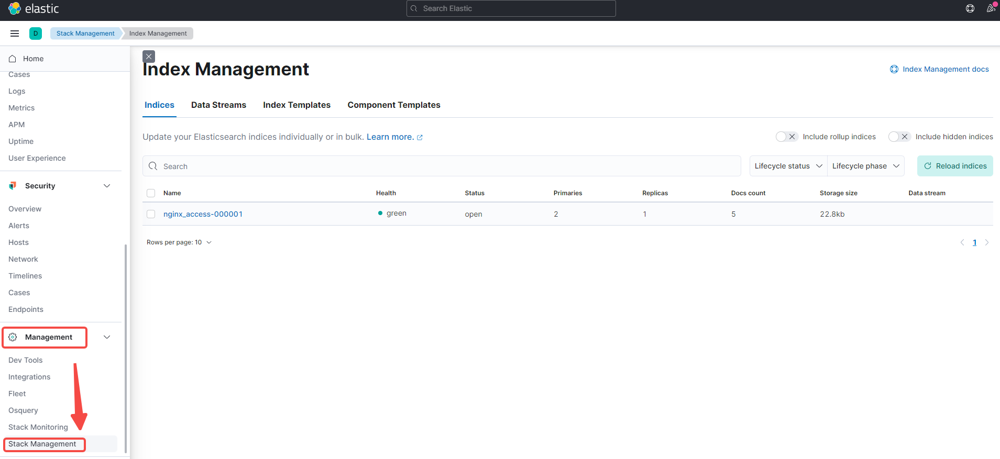


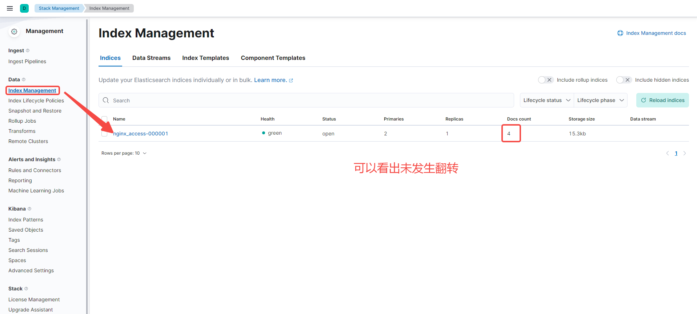


再插入一条数据，查看索引是否发生变化


```plain
PUT nginx_access/_bulk
{"index":{"_id":5}}
{"title":"testing 05"}
```


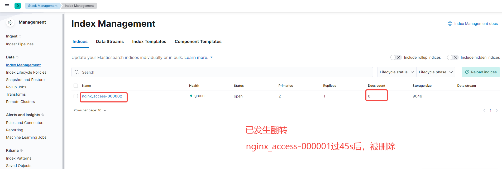


## 3、Elasticvue 插件


作用和head插件相同，个人感觉比head的界面看起来舒服，同时安装也更加方便，在Microsoft自带的浏览器即可安装


### 3.1 安装插件


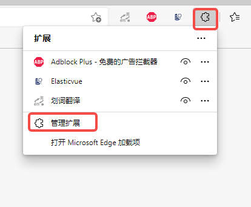


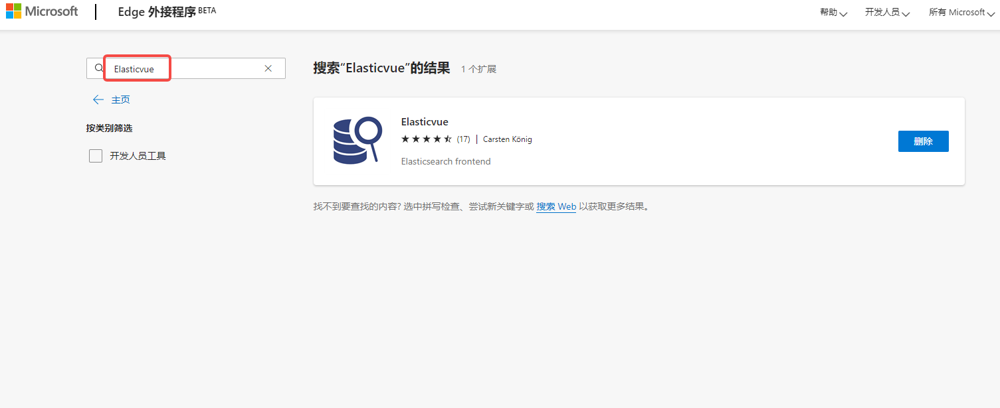


安装插件之后，点击图标


### 3.2 使用插件


进入界面后，添加es集群


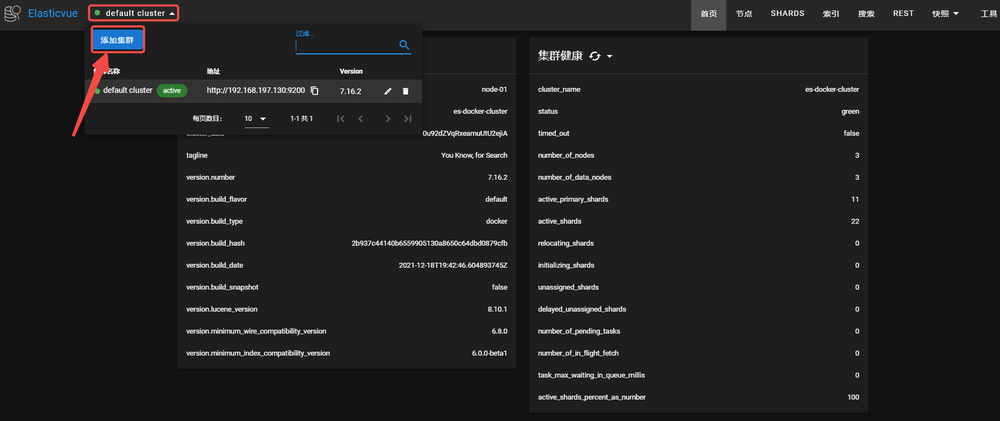


查看索引信息，这里的索引就是2.5步骤中的索引信息


### 3.3 测试


连续执行多次POST，创建多个文档。查看索引变化（此处可以把delete阶段时间设置成300秒，方便查看索引变化）


```plain
POST nginx_access/_doc
{
  "name":"abbc"
}
```


插入数据前


插入数据后


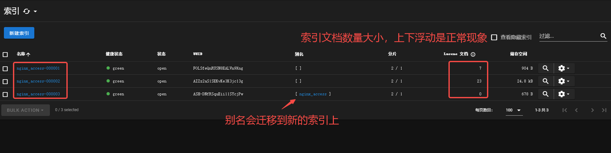


### 3.4 head插件（扩展）


搜索 `head`，进行添加即可


点击图标，进入head插件


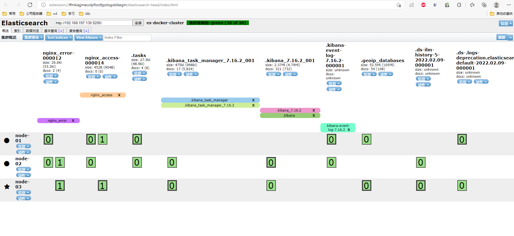


## 4、模拟过程（进阶）


7.16 和 7.8 下的配置类似，区别在于模板API不同，生命周期策略支持的动作不同。以下使用冷热架构，并使用带日期的索引，这在日志采集中很常用。步骤如下：


- 创建生命周期
- 创建索引模板，并引用生命周期
- 创建初始索引，并设置别名
- 向别名中写入文档


### 4.1 部署es集群和kibana

由于热温冷依赖于[分片分配感知](https://www.elastic.co/guide/en/elasticsearch/reference/6.7/allocation-awareness.html)，因此，我们首先标记哪些节点是热节点、温节点和（可选）冷节点。此操作可以通过启动参数或在docker-compose.yml 配置文件中完成。

```yaml
version: '3'
services:
  node-01:
    image: elasticsearch:7.16.2
    container_name: node-01
    environment:
      - node.name=node-01
      - cluster.name=es-docker-cluster
      - discovery.seed_hosts=node-02,node-03,node-04,node-05,node-06
      - cluster.initial_master_nodes=node-01,node-02,node-03
      - bootstrap.memory_lock=true
      - node.attr.data=hot
      - "ES_JAVA_OPTS=-Xms512m -Xmx512m"
    ulimits:
      memlock:
        soft: -1
        hard: -1
    volumes:
      - /data/elk/elasticsearch/cluster/data/node-01:/usr/share/elasticsearch/data
    ports:
      - 127.0.0.1:9200:9200     # 这里两处修改自己对应的IP地址
      - 127.0.0.1:5601:5601
    extra_hosts:
      - 'elasticsearch:127.0.0.1'
    deploy:
      resources:
        limits:
          cpus: '1'
          memory: '1024m'

  node-02:
    image: elasticsearch:7.16.2
    container_name: node-02
    environment:
      - node.name=node-02
      - cluster.name=es-docker-cluster
      - discovery.seed_hosts=node-01,node-03,node-04,node-05,node-06
      - cluster.initial_master_nodes=node-01,node-02,node-03
      - bootstrap.memory_lock=true
      - node.attr.data=hot
      - "ES_JAVA_OPTS=-Xms512m -Xmx512m"
    ulimits:
      memlock:
        soft: -1
        hard: -1
    volumes:
      - /data/elk/elasticsearch/cluster/data/node-02:/usr/share/elasticsearch/data
    deploy:
      resources:
        limits:
          cpus: '1'
          memory: '1024m'

  node-03:
    image: elasticsearch:7.16.2
    container_name: node-03
    environment:
      - node.name=node-03
      - cluster.name=es-docker-cluster
      - discovery.seed_hosts=node-01,node-02,node-04,node-05,node-06
      - cluster.initial_master_nodes=node-01,node-02,node-03
      - bootstrap.memory_lock=true
      - node.attr.data=hot
      - "ES_JAVA_OPTS=-Xms512m -Xmx512m"
    ulimits:
      memlock:
        soft: -1
        hard: -1
    volumes:
      - /data/elk/elasticsearch/cluster/data/node-03:/usr/share/elasticsearch/data
    deploy:
      resources:
        limits:
          cpus: '1'
          memory: '1024m'

  node-04:
    image: elasticsearch:7.16.2
    container_name: node-04
    environment:
      - node.name=node-04
      - cluster.name=es-docker-cluster
      - discovery.seed_hosts=node-01,node-02,node-03,node-05,node-06
      - cluster.initial_master_nodes=node-01,node-02,node-03
      - bootstrap.memory_lock=true
      - node.attr.data=warm
      - "ES_JAVA_OPTS=-Xms512m -Xmx512m"
    ulimits:
      memlock:
        soft: -1
        hard: -1
    volumes:
      - /data/elk/elasticsearch/cluster/data/node-04:/usr/share/elasticsearch/data
    deploy:
      resources:
        limits:
          cpus: '1'
          memory: '1024m'

  node-05:
    image: elasticsearch:7.16.2
    container_name: node-05
    environment:
      - node.name=node-05
      - cluster.name=es-docker-cluster
      - discovery.seed_hosts=node-01,node-02,node-03,node-04,node-06
      - cluster.initial_master_nodes=node-01,node-02,node-03
      - bootstrap.memory_lock=true
      - node.attr.data=warm
      - "ES_JAVA_OPTS=-Xms512m -Xmx512m"
    ulimits:
      memlock:
        soft: -1
        hard: -1
    volumes:
      - /data/elk/elasticsearch/cluster/data/node-05:/usr/share/elasticsearch/data
    deploy:
      resources:
        limits:
          cpus: '1'
          memory: '1024m'

  node-06:
    image: elasticsearch:7.16.2
    container_name: node-06
    environment:
      - node.name=node-06
      - cluster.name=es-docker-cluster
      - discovery.seed_hosts=node-01,node-02,node-03,node-04,node-05
      - cluster.initial_master_nodes=node-01,node-02,node-03
      - bootstrap.memory_lock=true
      - node.attr.data=cold
      - "ES_JAVA_OPTS=-Xms512m -Xmx512m"
    ulimits:
      memlock:
        soft: -1
        hard: -1
    volumes:
      - /data/elk/elasticsearch/cluster/data/node-06:/usr/share/elasticsearch/data
    deploy:
      resources:
        limits:
          cpus: '1'
          memory: '1024m'

  kibana:
    image: kibana:7.16.2
    container_name: kibana
    network_mode: "service:node-01" 
    volumes:
      - /data/elk/elasticsearch/cluster/data/kibana:/usr/share/kibana/data
    depends_on:
      - node-01
      - node-02
      - node-03
      - node-04
      - node-05
      - node-06
    deploy:
      resources:
        limits:
          cpus: '1'
          memory: '1024m'
```


修改目录权限，否则会执行失败


```bash
[root@localhost opt]# cd /data/elk/elasticsearch/cluster/
[root@localhost cluster]# chown  -R   1000:1000  data/
```


如果启动不成功的话，我们可以通过如下命令来获取容器的日志地址

```plain
docker inspect --format '{{.LogPath}}' 97069f94437b
```


启动docker-compose

```bash
[root@localhost cluster]# docker-compose up -d
```


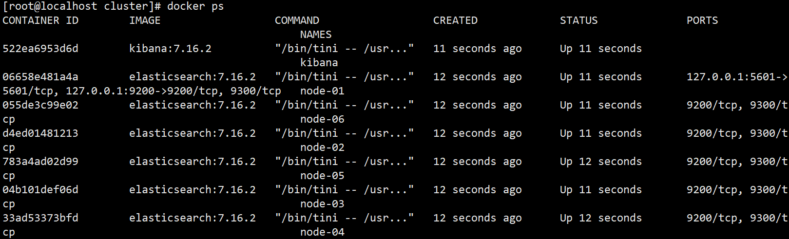


如果启动不成功的话，我们可以通过如下命令来获取容器的日志地址


```bash
docker inspect --format '{{.LogPath}}' 97069f94437b
```


然后通过cat命令查看上述命令找到的日志地址


```bash
cat /var/lib/docker/containers/97069f94437b86b50341f8253d85f426884315c3d027f7b7fa975751c7d8e18e/97069f94437b86b50341f8253d85f426884315c3d027f7b7fa975751c7d8e18e-json.log
```


**查看ES 集群架构**

```bash
curl -s "http://192.168.197.130:9200/_cat/nodeattrs?v&h=host,attr,value" | grep -E "data|host"
host       attr              value
172.19.0.3 data              warm
172.19.0.7 data              hot
172.19.0.5 data              hot
172.19.0.2 data              cold
172.19.0.4 data              hot
172.19.0.6 data              warm
```


### 4.2 创建索引策略

配置索引策略：

- hot 阶段: 每60文档轮转一次。生产中通常按大小或者索引时间
- warm阶段：索引超过120s进入warm阶段，转移至warm节点，缩减主分片数量，设置只读
- cold阶段：索引超过300s进入cold阶段，转移至cold节点，移除所有副本分片
- 删除阶段：索引超过600s删除


API 请求如下：


```bash
PUT _ilm/policy/stdout-policy
{
  "policy": {
    "phases": {
      "hot": {
        "actions": {
          "rollover": {
            "max_docs": 60
          },
          "set_priority": {
            "priority": 100
          }
        },
        "min_age": "0ms"
      },
      "warm": {
        "min_age": "120s",
        "actions": {
          "set_priority": {
            "priority": 50
          },
          "allocate": {
            "number_of_replicas": 1,
            "require": {
              "data": "warm"
            }
          },
          "forcemerge": {
            "max_num_segments": 1
          },
          "shrink": {
            "number_of_shards": 1
          },
          "readonly": {}
        }
      },
      "cold": {
        "min_age": "300s",
        "actions": {
          "set_priority": {
            "priority": 0
          },
          "allocate": {
            "number_of_replicas": 0,
            "require": {
              "data": "cold"
            }
          }
        }
      },
      "delete": {
        "min_age": "600s",
        "actions": {
          "delete": {}
        }
      }
    }
  }
}
```


### 4.3 创建索引模板

```bash
# 创建索引模板，并设置分配到Hot节点
PUT /_index_template/stdout-template
{
  "index_patterns" : ["stdout*"],
  "template": {
      "settings": {
      "number_of_replicas": 1,
      "number_of_shards": 3,
      "refresh_interval": "5s",
      "routing.allocation.require.data": "hot",
      "lifecycle" : {
        "name" : "stdout-policy",
        "rollover_alias" : "stdout"
      }
    }
  }
}
```


### 4.4 创建初始索引

```bash
# 创建带日期的索引；日志系统中常用
PUT /%3Cstdout-%7Bnow%2Fd%7D-000001%3E?pretty
{
  "aliases": {
    "stdout": {}
  }
}
```


### 4.5 测试

```bash
# 写入测试数据
[root@duduniao cluster]# i=1; while :;do curl -s -XPOST -H "Content-Type: application/json" -d "{\"id\": ${RANDOM}, \"msg\": \"test $i for stdout index\"}" http://127.0.0.1:9200/stdout/_doc;i=$[i+1]; sleep 1;echo;done
```


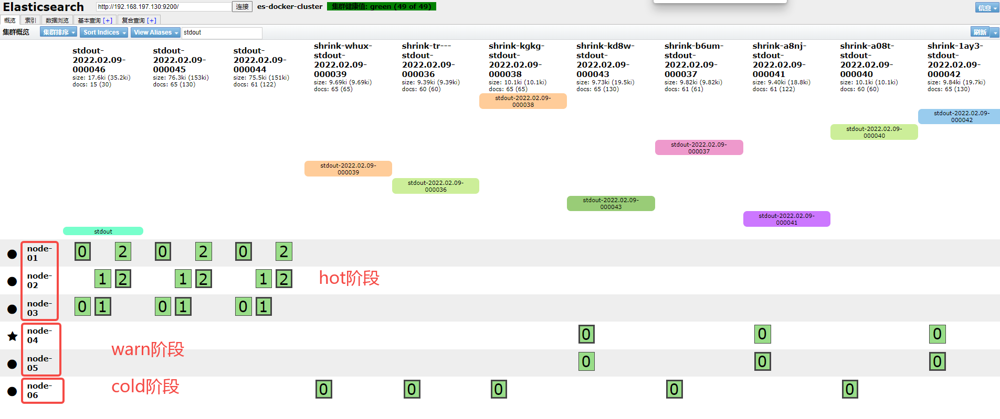


## 5、filebeat使用ILM

问题来了，当我们使用ELK搭建索引日志系统时，咋让filebeat和ES的ILM无缝连接呢？

 

其实我们只需要在filebeat的配置文件中简单配置下就可以全部托管给ES ILM了。

 

从 7.0 版开始，当 Beats 和 Logstash 连接到支持生命周期管理的集群时，它们会默认使用索引生命周期管理。此外，Beats 已将大多数 ILM 设置从 `output.elasticsearch.ilm` 命名空间[移动](https://www.elastic.co/guide/en/beats/libbeat/current/breaking-changes-7.0.html#_ilm_support)到 `setup.ilm` 命名空间。例如，请参阅 [7.0 Filebeat 文档](https://www.elastic.co/guide/en/beats/filebeat/7.0/ilm.html)。而且，从 7.0 开始，系统索引（如 `.watcher-history-*`）可以由 ILM 管理。


### 5.1 es配置


```plain
PUT _cluster/settings
{
  "persistent": {
    "indices.lifecycle.poll_interval":"1s"
  }
}

PUT _ilm/policy/my_policy
{
  "policy": {
    "phases": {
      "hot": {
        "actions": {
          "rollover": {
            "max_docs": 5
          },
          "set_priority": {
            "priority": 100
          }
        }
      },
      "delete": {
        "min_age": "45s",
        "actions": {
          "delete": {}
        }
      }
    }
  }
}

PUT /_index_template/nginx_access
{
  "index_patterns": ["nginx_access*"],
  "template": {
     "settings" : {
     "number_of_shards": 2,
     "number_of_replicas": 1,
     "refresh_interval": "5s",
     "lifecycle" : {
       "name" : "my_policy",
       "rollover_alias" : "nginx_access"
      }
    }
  }
}

PUT /_index_template/nginx_error
{
  "index_patterns": ["nginx_error*"],
  "template": {
     "settings" : {
     "number_of_shards": 2,
     "number_of_replicas": 1,
     "refresh_interval": "5s",
     "lifecycle" : {
       "name" : "my_policy",
       "rollover_alias" : "nginx_error"
      }
    }
  }
}


PUT /nginx_access-000001
{
  "aliases": {
    "nginx_access": {
      "is_write_index": true
    }
  }
}

PUT /nginx_error-000001
{
  "aliases": {
    "nginx_error": {
      "is_write_index": true
    }
  }
}
```


### 5.2 filebeat配置


```yaml
filebeat.inputs:
- type: log
  paths:
    - /var/log/nginx/access*
  fields:
    source: access
- type: log
  paths:
    - /var/log/nginx/error*
  fields:
    source: error

setup.ilm.enabled: false

output.elasticsearch:
  hosts: ["localhost:9200"]
  protocol: "http"
  indices:
    - index: "nginx_access"
      when.equals.fields:
        source: "access"
    - index: "nginx_error"
      when.equals.fields:
        source: "error"

logging:
  level: info
  to_files: true
  files:
    path: /data/filebeat/logs
    name: filebeat.log
    keepfiles: 5
    permissons: 0644
    rotateonstartup: false    # 禁止每次重启切割
    rotateeverybytes: 10485760 # 默认10MB切割一次，单位 Byte
```


启动filebeat


```bash
[root@localhost filebeat]# nohup ./filebeat -e &
```


### 5.3 测试


访问nginx，写入测试数据


```bash
# 命令行输入如下命令
[root@localhost ~]# while true;do curl -I http://192.168.197.129/;sleep 1;curl -I http://192.168.197.129/aaa;done
```


查看索引变化


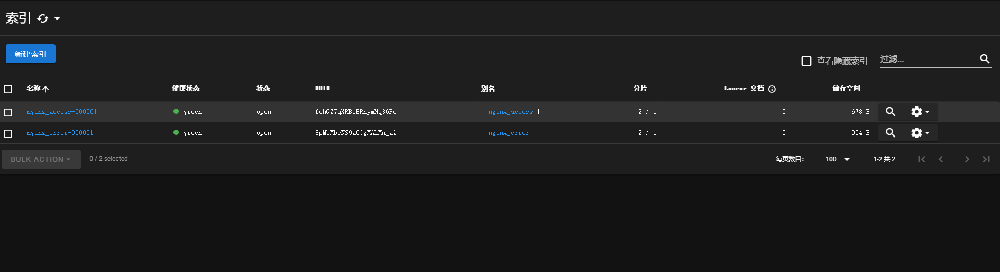


输入数据后


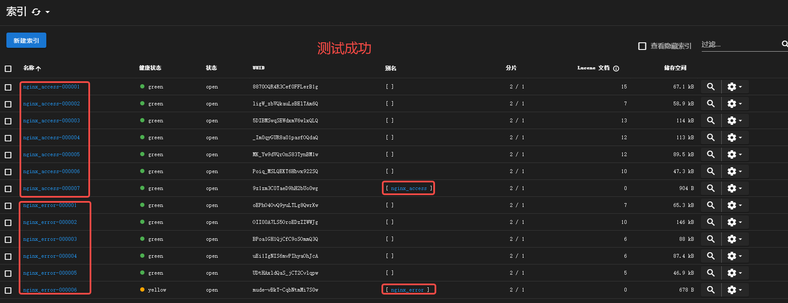


在kibana上查看


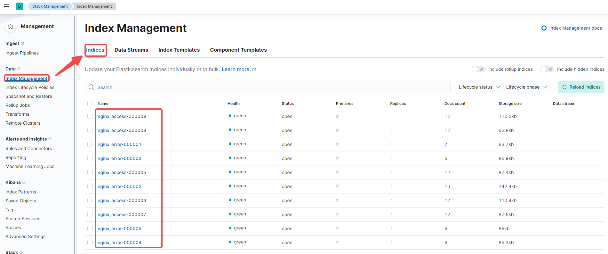


## 